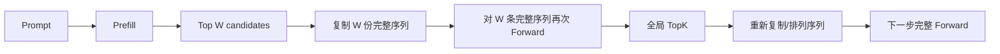
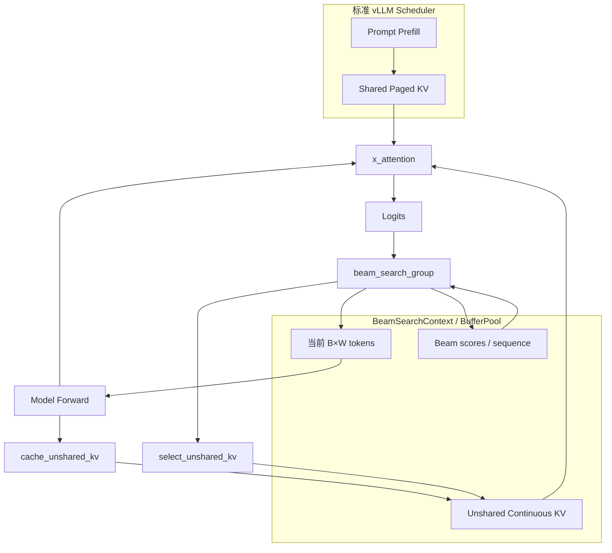
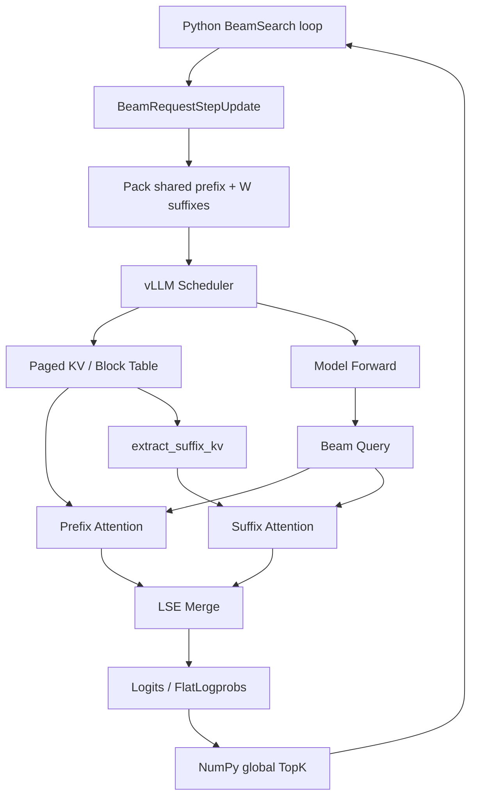
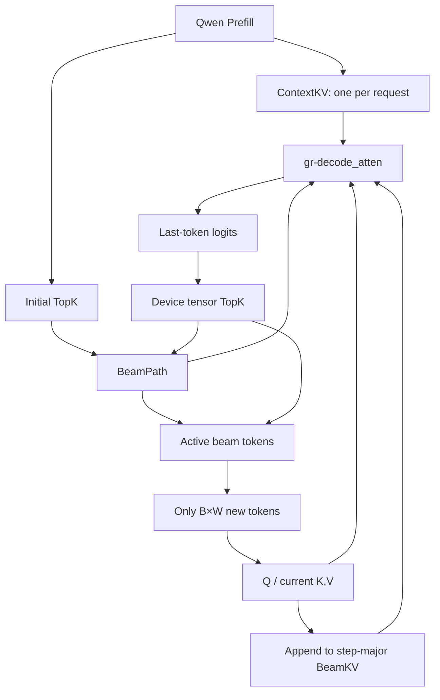
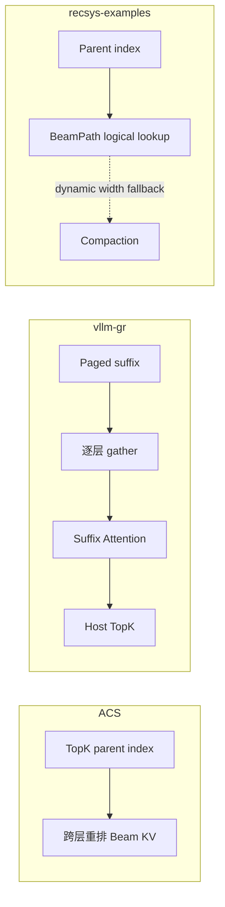
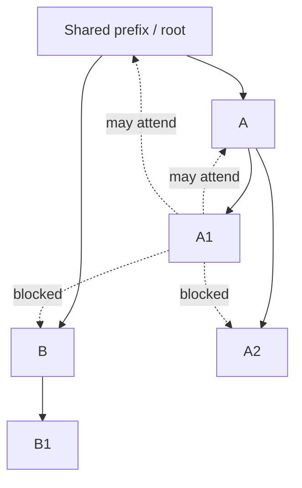
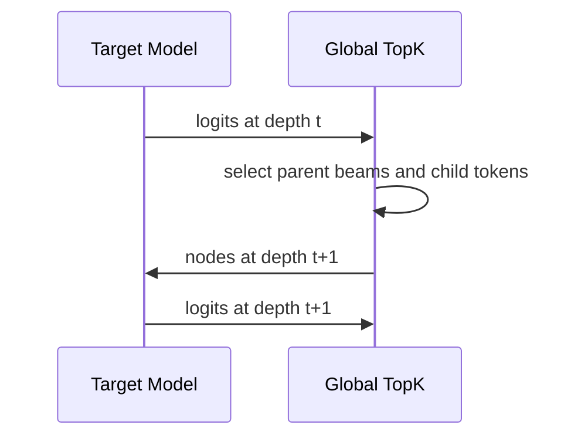
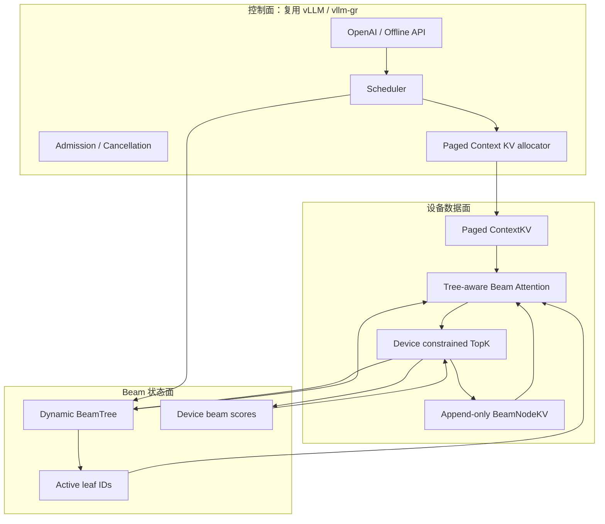
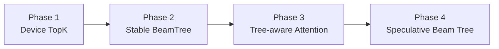

# BeamSearch 优化方案代码分析

> 本文从代码架构和执行路径出发，对比 `ACS_vllm-GR`、`vllm-gr`、
> `recsys-examples` 三种 BeamSearch 优化方案，并分析 vLLM 投机推理
> Tree Attention 对 BeamSearch 的参考价值。
>
> 本文不使用不同硬件、模型或基准下的性能数字进行横向排名；结论属于代码方案层面的初步分析。

## 目录

- [1. 结论摘要](#1-结论摘要)
- [2. BeamSearch 的核心计算问题](#2-beamsearch-的核心计算问题)
- [3. 方案一：ACS_vllm-GR](#3-方案一acs_vllm-gr)
- [4. 方案二：vllm-gr](#4-方案二vllm-gr)
- [5. 方案三：recsys-examples](#5-方案三recsys-examples)
- [6. 三种方案的横向对比](#6-三种方案的横向对比)
- [7. Tree Attention 是否适合 BeamSearch](#7-tree-attention-是否适合-beamsearch)
- [8. 推荐的融合架构](#8-推荐的融合架构)
- [9. 建议实施顺序](#9-建议实施顺序)
- [10. 最终建议](#10-最终建议)
- [11. 代码索引](#11-代码索引)

## 1. 结论摘要

三种方案优化的共同目标都是避免传统 BeamSearch 在每个 decode step 中：

1. 将完整 Prompt 为每个 beam 重复执行；
2. 为每个 beam 复制共享 KV Cache；
3. 将 beam 当作互不相关的普通请求调度；
4. 在 Host 和 Device 之间频繁传递 TopK、parent beam 和 KV 状态。

从纯 BeamSearch 热路径设计看，方案关系可以概括为：

| 方案 | 核心定位 | 方案层面判断 |
| --- | --- | --- |
| `ACS_vllm-GR` | Ascend 专用 Shared/Unshared KV 与设备侧 Beam 算子 | 设备闭环完整，但 KV 物理重排和独立状态管理较重 |
| `vllm-gr` | 在 vLLM Scheduler/Paged KV 内实现分组 BeamRequest 与 Cascade Attention | 通用性和框架融合最好，但热路径仍存在 gather、多段 Attention 和 Host 后处理 |
| `recsys-examples` | 原生 `ContextKV + BeamKV + BeamPath` 与专用 decode kernel | 最符合 BeamSearch 数据模型，性能设计最彻底，但通用性最弱 |
| Tree Attention 参考方案 | Flatten Tree + ancestor-only attention | 适合改进 Beam 祖先寻址和 KV 生命周期，但不能直接消除精确 BeamSearch 的逐层依赖 |

如果必须按场景选型：

- **纯粹追求长上下文、短 decode、大 beam 的热路径设计**：优先参考 `recsys-examples`。
- **希望保持 vLLM 模型、调度、Paged KV 和服务生态**：优先采用 `vllm-gr`。
- **Ascend 固定形状、可维护自定义算子**：可采用 `ACS_vllm-GR`，但建议将 KV 物理重排改为 BeamTree 逻辑寻址。
- **理想演进方向**：`vllm-gr` 控制面 + `recsys` BeamPath 数据模型 + ACS 设备侧 TopK + TreeAttn 祖先寻址。

---

## 2. BeamSearch 的核心计算问题

设：

- `B`：请求 batch size；
- `W`：beam width；
- `L`：Prompt 长度；
- `T`：decode step 数；
- `H`：KV head 数；
- `D`：head dimension。

### 2.1 朴素执行路径



主要浪费包括：

- Prompt 的投影和 Attention 被每个 beam 重复计算；
- Prompt KV 被复制，或者被多个独立请求分别管理；
- 每步重新提交 `B × W` 个请求；
- Beam parent 改变时复制 token history 或 KV history；
- 每步都发生 Device → Host → Device 的控制回路。

### 2.2 目标数据模型

合理的 BeamSearch 应显式区分：

```text
Request-shared state
└── Prompt / Context KV：每个请求一份

Beam-private state
├── 当前 token
├── 短 decode KV
├── cumulative score
└── parent beam / parent node
```

共享 Prompt KV 的空间复杂度应接近 `O(B × L)`，而不是 `O(B × W × L)`；
Beam 独享部分只需要覆盖短 decode 历史，接近 `O(B × W × T)`。

---

## 3. 方案一：ACS_vllm-GR

### 3.1 核心设计

ACS 将 KV Cache 拆成两部分：

- **Shared KV**：Prompt KV，继续存放在 vLLM Paged KV 中；
- **Unshared KV**：每个 beam 的 decode KV，放在连续预分配张量中。

代码中的 Unshared KV 形状为：

```python
# 每层各一份 K/V
[max_batch, max_beams, kv_heads, max_decode_steps, head_dim]
```

对应实现：

- [`BeamSearchBufferPool`](ACS_vllm-GR/vllm-ascend/vllm_ascend/beam_search/context.py#L17-L117)
- [`x_attention`](ACS_vllm-GR/vllm-ascend/vllm_ascend/ops/xllm_ops.py#L29-L70)
- [`cache_unshared_kv`](ACS_vllm-GR/vllm-ascend/vllm_ascend/ops/xllm_ops.py#L73-L90)
- [`select_unshared_kv`](ACS_vllm-GR/vllm-ascend/vllm_ascend/ops/xllm_ops.py#L93-L108)
- [`beam_search_group`](ACS_vllm-GR/vllm-ascend/vllm_ascend/ops/xllm_ops.py#L111-L132)

### 3.2 Decode 数据流



### 3.3 优点

#### 设备侧闭环较完整

TopK、累计分数、sequence 更新和 KV 更新都由 NPU 算子完成，不要求每个 step
将完整 beam 状态返回 Host。约束解码还提供了融合过滤、log-softmax 和 TopK 的
[`rec_constrained_topk`](ACS_vllm-GR/vllm-ascend/vllm_ascend/ops/xllm_ops.py#L134-L172)。

#### Shared/Unshared 分离适合短 decode

Prompt 保持 Paged KV；短 decode history 使用连续布局，避免为极短 Beam history
引入复杂 page table。

#### 静态地址适合 ACL Graph

`BeamSearchBufferPool` 预分配持久张量，不同请求只创建 slice view，可以保持图捕获地址稳定。

### 3.4 局限

#### Beam parent 更新通过物理 KV 重排实现

Beam 选择后调用 `select_unshared_kv`，按新的 parent beam 重排各层历史 KV：

```text
代价约随 layers × batch × beam × decoded_steps × KV-size 增长
```

对于 SID-GR 的极短 decode，这个代价可能可控；但从数据结构设计看，使用 parent index
进行逻辑寻址比重复搬运历史 KV 更自然。

#### 存在第二套 KV 生命周期

Shared KV 由 vLLM Scheduler 管理，Unshared KV 由 `BeamSearchContext` 管理。
取消、超时、动态 batch、请求交错和显存回收都需要跨两套状态保持一致。

#### 静态预分配容易放大显存

显存主要由以下乘积决定：

```text
max_batch × max_beams × max_steps × num_layers × kv_heads × head_dim × K/V
```

较大的任意历史峰值都会扩大持久 BufferPool。仓内也有针对过度预分配 OOM 的修复说明：
[`beam-search-bs-gt1-adaptation.md`](ACS_vllm-GR/docs/beam-search-bs-gt1-adaptation.md#修改-1bufferpool-max_batch_size-去掉-max_num_reqsoom-修复)。

#### 状态更适合规则批次

`BeamSearchContext` 是有 `current_step` 的持久状态。固定 batch/beam/step 非常直接，
但动态到达、不同 beam width 和不同 decode step 的在线混部更复杂。

#### 代码审查关注点

- `x_attention` wrapper 接收 `unshared_block_tables` 后又将其设置为 `None`：
  [`xllm_ops.py`](ACS_vllm-GR/vllm-ascend/vllm_ascend/ops/xllm_ops.py#L64-L70)。
  这意味着当前算子实际依赖隐式/固定映射，接口语义与调用行为需要进一步统一。
- `reset_buffers()` 会对整个持久 Unshared KV Pool 执行 `zero_()`：
  [`context.py`](ACS_vllm-GR/vllm-ascend/vllm_ascend/beam_search/context.py#L118-L138)。
  Pool 按历史最大规格扩张后，即使后续请求很小，重置成本仍由最大 Pool 决定。

---

## 4. 方案二：vllm-gr

### 4.1 核心设计

`vllm-gr` 尽量不另建独立 KV Cache，而是将一个请求的所有 beam suffix 打包成一个
逻辑 `BeamRequest`：

```text
[shared prefill tokens]
+ [beam 0 suffix]
+ [beam 1 suffix]
+ ...
+ [beam W-1 suffix]
```

请求构造代码见
[`_handle_beam_request_step_update`](vllm-gr/vllm_gr/v1/engine/core.py#L70-L203)，
其中 [`beam_token_ids`](vllm-gr/vllm_gr/v1/engine/core.py#L157-L166)
将 shared prefix 和全部 beam suffix 组装成单个 vLLM Request。

Attention 使用 Cascade 思路：

1. 从 Paged KV 读取共享 Prefix；
2. gather 每个 beam 的 Suffix KV；
3. 分别计算 Prefix Attention 与 Suffix Attention；
4. 使用两部分的 LSE 合并最终 Attention 输出。

### 4.2 Decode 数据流



关键代码：

- BeamRequest 元数据构建：
  [`_build_beam_request_metadata`](vllm-gr/vllm_gr/v1/engine/engine_core_patch.py#L273-L302)
- Prefix 分组与 Suffix 映射：
  [`_build_beam_mappings`](vllm-gr/vllm_gr/v1/attention/backends/beam_attn.py#L354-L477)
- GPU Cascade Attention：
  [`cascade_attention_gpu`](vllm-gr/vllm_gr/v1/attention/backends/beam_attn.py#L878-L991)
- NPU Cascade Attention：
  [`cascade_attention_npu`](vllm-gr/vllm_gr/v1/attention/backends/beam_attn.py#L993-L1079)
- Host 侧 Beam 选择：
  [`_custom_beam_search_batch`](vllm-gr/vllm_gr/entrypoints/gr.py#L406-L532)

### 4.3 优点

#### 与 vLLM 控制面融合最好

普通请求和 BeamRequest 仍经过 vLLM Scheduler、Paged KV、Block Table 和 ModelRunner。
变长上下文、Prefix Cache、显存分页和多请求混部可以继续复用 vLLM 机制。

#### 不需要按最大 Beam 配置预分配完整独立 KV Pool

KV 空间由 vLLM block allocator 管理，对上下文长度和请求并发的变化更有弹性。

#### Prefix/Suffix 数学拆分具有通用性

Cascade Attention 不要求定制一种完整的 Shared+Unshared KV kernel。Prefix 与 Suffix
分别使用已有 Attention 能力，最后根据 LSE 合并，GPU/NPU 都能实现。

#### Beam 被视为一个调度实体

所有 beam 作为一个逻辑请求进入调度，可以减少 `W` 个独立 Request 带来的队列、对象和调度开销。

### 4.4 局限

#### Attention 被拆成多段执行

热路径包含：

```text
Prefix Attention + Suffix gather + Suffix Attention + LSE merge
```

相比一个直接理解 `ContextKV + BeamKV + BeamPath` 的专用 kernel，Kernel launch、临时张量和
中间读写更多。

#### Suffix KV 需要 gather

[`extract_suffix_kv`](vllm-gr/vllm_gr/v1/attention/backends/beam_attn.py#L945-L951)
将 Paged KV 中的 beam suffix 提取成连续 K/V，再执行 Suffix Attention。它避免了长期维护第二套 KV，
但把一部分复杂度转化为逐层的数据搬运。

#### Beam 选择仍在 Host

当前路径将 logprobs 转为 NumPy，再调用 `_select_top_beams`：

```python
all_beams_token_id = np.array(all_beams_token_id)
all_beams_logprob = np.array(all_beams_logprob)
fork_info = _select_top_beams(...)
```

对应代码：[`gr.py`](vllm-gr/vllm_gr/entrypoints/gr.py#L501-L523)。
这会保留每步 Device/Host 同步和 Python 控制循环。

#### 对 vLLM 内部接口耦合较深

方案需要 patch Scheduler、EngineCore、ModelRunner 输入准备和 bookkeeping。
它比维护完整 fork 更轻，但 vLLM 内部接口升级仍会产生适配成本。

#### 代码审查关注点

- `_build_beam_mappings` 在 Python 中逐 request、逐 beam 构造 mapping，并使用
  `np.arange` 和多个 Python list：
  [`beam_attn.py`](vllm-gr/vllm_gr/v1/attention/backends/beam_attn.py#L394-L449)。
  大 beam 下，Attention kernel 加速后这部分 metadata 构造可能成为新的 Host 瓶颈。
- Scheduler patch 在一次 `schedule()` 内临时替换
  `kv_cache_manager.get_computed_blocks`：
  [`engine_core_patch.py`](vllm-gr/vllm_gr/v1/engine/engine_core_patch.py#L305-L351)。
  该方式实现成本低，但依赖 Scheduler 的调用顺序和内部对象结构。

---

## 5. 方案三：recsys-examples

### 5.1 核心设计

该方案直接为 SID-GR 建立三种一等公民数据结构：

| 数据结构 | 含义 | 典型生命周期 |
| --- | --- | --- |
| `ContextKV` | 请求级长上下文 KV | 整个请求共享 |
| `BeamKV` | step-major 的短 decode KV | 随 decode step 追加 |
| `BeamPath` | 每步 parent beam、token 和 score | 逻辑描述 beam ancestry |

`BeamKV` 的布局为：

```python
[layers, batch, max_decode_steps, max_beam_width, kv_heads, head_dim]
```

代码见 [`beam_kv.py`](recsys-examples/examples/sid-gr-inference/src/gr_inference/gr_kv/beam_kv.py#L24-L109)。

`BeamPath` 不复制历史 token，而是保存每步 parent index：

```python
BeamPathEntry(
    parent_beams=(...),
    token_ids=(...),
    scores=(...),
)
```

代码见 [`beam_path.py`](recsys-examples/examples/sid-gr-inference/src/gr_inference/gr_kv/beam_path.py#L12-L95)。

### 5.2 Decode 数据流



Attention 接口直接接收 `context_kv`、`beam_kv` 和 `beam_path`：
[`GRDecodeEngine.decode_attention_step`](recsys-examples/examples/sid-gr-inference/src/gr_inference/gr_runtime/engine.py#L27-L74)。

### 5.3 优点

#### 数据模型最接近 BeamSearch 本质

共享上下文、短 Beam KV 和逻辑父子关系被明确拆分，不需要通过“多个普通 Sequence”模拟 Beam。

#### Beam parent 主要通过逻辑关系表达

`BeamPath` 可以从当前 beam 反向追溯祖先：

```text
current beam → parent beam → parent beam → ... → root
```

这比每步复制完整 token history 更紧凑，也为 Tree Attention 式祖先寻址提供了基础。

#### 专用 Kernel 可以按 request × beam tile

Kernel 知道多个 beam 共享同一 ContextKV，因此可以在 kernel 内按 request 和 beam tile
复用上下文读取，而不是将 `B × W` 看成互不相关的 decode rows。

#### 固定短 decode 易于 CUDA Graph

`BeamKV` 使用 step-major 固定容量，Context/Beam Pool 可以提供稳定地址，适合长 Prompt、
短输出、固定 beam 桶的图捕获。

### 5.4 局限

#### 为专项 workload 重建了推理运行时

Scheduler、KV Pool、连续批处理、HTTP Serving、CUDA Graph 和模型适配都由项目自身维护。
它规避了 vLLM 内部耦合，但需要承担完整运行时维护成本。

#### Dense ContextKV 对变长上下文不够灵活

连续稠密 ContextKV 有利于专用 kernel 和图捕获，但不同上下文长度混部时容易产生 padding
或固定 bucket 浪费。相比 Paged KV，动态显存利用率较弱。

#### BeamPath 尚未完全等价于稳定节点树

当前 `BeamPath` 以“step 内 beam index”表示 parent。当动态 beam width 缩小时，部分祖先可能位于
当前 active width 之外，因此代码仍提供 BeamKV compaction：
[`beam_kv_compaction.py`](recsys-examples/examples/sid-gr-inference/src/gr_inference/gr_runtime/beam_kv_compaction.py)。

更彻底的设计应给每个 Beam node 分配稳定 `node_id/kv_slot`，从而完全避免依赖每步局部 beam index。

#### 代码审查关注点

- 基础 `BeamPath` 使用 Python tuple/list 保存 parent、token 和 score，`token_trace()`
  通过 Python 反向遍历祖先：
  [`beam_path.py`](recsys-examples/examples/sid-gr-inference/src/gr_inference/gr_kv/beam_path.py#L78-L95)。
  Serving 热路径需要坚持使用 tensor-backed selection 和延迟 materialize，避免逐步同步。
- 当前 BeamKV compaction 使用 batch × beam × history 的嵌套 Python 循环和 tensor copy：
  [`beam_kv_compaction.py`](recsys-examples/examples/sid-gr-inference/src/gr_inference/gr_runtime/beam_kv_compaction.py#L26-L71)。
  如果动态 beam shrink 频繁发生，应优先改为稳定 node slot 或设备 gather kernel。

---

## 6. 三种方案的横向对比

### 6.1 热路径对比

| 维度 | ACS_vllm-GR | vllm-gr | recsys-examples |
| --- | --- | --- | --- |
| Prompt KV | vLLM Paged KV | vLLM Paged KV | Dense ContextKV |
| Decode KV | 独立连续 Unshared KV | vLLM Paged KV 中的 suffix | Step-major BeamKV |
| Parent 更新 | 物理重排 Unshared KV | 重组 BeamRequest + suffix 映射 | BeamPath 逻辑 parent，必要时 compaction |
| Prefix Attention | `x_attention` 内完成 | 独立 Prefix Attention | 专用 kernel 内完成 |
| Suffix Attention | `x_attention` 内完成 | gather 后独立 Suffix Attention | 专用 kernel 内完成 |
| Attention 合并 | kernel 内部 | 显式 LSE merge | kernel 内部 |
| Beam TopK | NPU 自定义算子 | Python/NumPy | Torch tensor；连续服务支持延迟 materialize |
| Graph 友好度 | 高，持久 BufferPool | 中，受 vLLM 动态调度约束 | 高，固定 Pool/shape |
| 动态显存 | 中 | 高 | 中 |
| 跨平台能力 | Ascend 为主 | GPU + NPU | NVIDIA GPU 为主 |
| 通用模型/Serving | 中 | 高 | 低到中 |

### 6.2 数据移动对比



从减少数据移动的角度，最理想的是让 KV 保持 append-only，Beam 选择只改变 active leaf ID，
而不是改变历史 KV 的物理位置。

### 6.3 方案评分

这里的“高/中/低”只描述方案特性，不代表实测性能：

| 指标 | ACS_vllm-GR | vllm-gr | recsys-examples |
| --- | --- | --- | --- |
| 专项性能上限 | 高 | 中高 | 高 |
| 通用性 | 中低 | 高 | 低 |
| KV 动态弹性 | 中 | 高 | 中 |
| Host 同步优化 | 高 | 中低 | 中高 |
| Beam 语义原生程度 | 中高 | 中 | 高 |
| 在线动态调度适配 | 中 | 高 | 中高 |
| 代码侵入/维护成本 | 高 | 中高 | 高 |

---

## 7. Tree Attention 是否适合 BeamSearch

### 7.1 TreeAttn 的基本机制

vLLM Tree Attention 将一棵 token tree flatten 成一个 token batch，并通过 Attention bias 保证：

```text
每个节点只能看到：
1. 共享前缀；
2. 自己；
3. 自己的祖先节点；
4. 不能看到兄弟分支。
```



当前 vLLM 实现通过 `_prepare_tree_attn_bias` 预生成 ancestor mask：
[`tree_attn.py`](ACS_vllm-GR/vllm/vllm/v1/attention/backends/tree_attn.py#L268-L304)，
并将其作为 `qq_bias` 传入 `unified_attention`：
[`TreeAttentionImpl.forward`](ACS_vllm-GR/vllm/vllm/v1/attention/backends/tree_attn.py#L430-L450)。

### 7.2 可以直接参考的部分

#### Flatten Tree metadata

BeamSearch 可以复用以下抽象：

```text
node_id
parent_node_id
depth / position
token_id
kv_slot
request_id
score
active flag
```

所有 active leaf 可以作为一次 decode batch；Attention 根据 parent chain 读取自己的历史 KV。

#### Append-only KV 与稳定 slot

新节点只向 BeamNodeKV 追加，不因 TopK 选择移动旧 KV：

```text
TopK 前：active leaves = [10, 11, 12, 13]
TopK 后：active leaves = [21, 24, 25, 29]

KV node 0..29 的物理位置不变；仅 active leaf tensor 改变。
```

这可以替代：

- ACS 的 `select_unshared_kv` 物理重排；
- recsys 动态 beam shrink 时的 BeamKV compaction；
- vllm-gr 的部分 Beam fork/suffix 重组逻辑。

#### Tree-aware Paged KV slot 管理

EAGLE Tree 路径根据 tree position、block table 和 block size 构造 slot mapping：
[`eagle.py`](ACS_vllm-GR/vllm/vllm/v1/spec_decode/eagle.py#L640-L652)。
这部分可以用于动态 BeamTree 节点分配、裁剪和延迟回收。

### 7.3 不能直接复用的部分

#### vLLM 当前 Tree shape 偏静态

当前 `TreeAttentionMetadataBuilder` 从 `speculative_token_tree` 解析静态 `tree_choices`，
并预生成 dense tree bias。BeamSearch 的 parent 关系由每步 TopK 动态产生，因此需要动态 metadata。

对于大 beam，不建议每步生成 `[num_nodes, num_nodes]` dense mask。更合适的是：

- parent index + depth；
- 每个 leaf 的 ancestor slot list；
- CSR/offset 形式的 path table；
- 或由专用 kernel 在内部追踪 parent chain。

#### 精确 BeamSearch 存在逐层依赖

精确 BeamSearch 的下一层候选依赖上一层 target-model logits：



因此，仅使用 Tree Attention 不能提前知道下一层应该包含哪些精确 TopK child。
它可以将同一层的多个 tree node 批量执行，但不能无条件将多个精确 BeamSearch step 合并成一个 forward。

#### 多层 Tree 需要 proposer

若希望一次 Target forward 验证多层 tree，需要先由以下组件生成候选树：

- Draft model；
- EAGLE/MTP；
- 小模型；
- Catalog trie；
- 启发式候选生成器。

这将算法变为 Speculative BeamSearch。除非候选树覆盖全部潜在 winner，否则可能漏掉标准 BeamSearch 的真实 TopK。

### 7.4 TreeAttn 对三种方案的改进价值

| 现有方案 | TreeAttn 可改进点 | 预期收益 |
| --- | --- | --- |
| ACS | 用稳定 node ID 和 parent indirection 替代 `select_unshared_kv` | 消除跨层历史 KV 重排 |
| vllm-gr | 复用 Paged KV slot/tree metadata，按 active leaf 调度 | 减少 BeamRequest 重组和 suffix gather |
| recsys | 将 step-local `BeamPath` 升级为稳定 `BeamTree` | 消除动态 width compaction，支持多层候选树 |

---

## 8. 推荐的融合架构

### 8.1 控制面与数据面

推荐将通用控制面和专用数据面分开：



### 8.2 推荐的数据结构

```python
@dataclass
class BeamNodeTable:
    # [max_nodes]
    parent_node: Tensor
    token_id: Tensor
    depth: Tensor
    score: Tensor
    kv_slot: Tensor
    request_id: Tensor
    alive: Tensor

@dataclass
class BeamBatch:
    # [batch, max_beam_width]
    active_leaf_ids: Tensor
    active_widths: Tensor

@dataclass
class BeamNodeKV:
    # Paged 或 chunked append-only storage
    key: Tensor
    value: Tensor
```

关键原则：

1. `node_id` 在请求生命周期内稳定；
2. parent 变化只更新 `active_leaf_ids`；
3. 历史 KV 不因 Beam 排名变化而移动；
4. 被裁剪节点延迟回收，不在每个 step 立即 compact；
5. Context KV 与 BeamNodeKV 可以使用不同布局；
6. TopK、score、parent 和 active leaf 更新保持在 Device。

### 8.3 推荐 Attention 接口

```python
beam_tree_attention(
    query,                  # [num_active_leaves, num_heads, head_dim]
    context_key_cache,      # Paged request-shared KV
    context_value_cache,
    context_block_tables,
    node_key_cache,         # Append-only beam node KV
    node_value_cache,
    active_leaf_ids,
    parent_node_ids,
    node_kv_slots,
    node_depths,
)
```

Kernel 内部逻辑：

```text
for each active leaf:
    1. attend shared ContextKV
    2. follow parent chain / ancestor slot list
    3. attend only its BeamNodeKV ancestors
    4. merge context and node attention state
```

对于 GPU，可按 request × beam tile；对于 Ascend，可将该接口映射为新的 `x_attention`
版本，并让 parent index 取代 `select_unshared_kv`。

---

## 9. 建议实施顺序

### Phase 1：消除 Host Beam 控制回路

- 在 `vllm-gr` 中将 global TopK、累计分数和 parent index 移至 Device；
- 输出只在最终 step materialize；
- 保留现有 Cascade Attention，先降低改造风险。

### Phase 2：统一 BeamPath/BeamTree

- 引入稳定 `node_id`；
- 将 ACS `select_unshared_kv` 和 recsys compaction 改为 parent indirection；
- 建立 active leaf tensor 和延迟回收机制。

### Phase 3：Tree-aware Beam Attention

- 设计同时读取 Paged Context KV 与 BeamNodeKV 的 kernel；
- 去掉 vllm-gr 的 suffix gather、第二次 Attention 和显式 LSE merge；
- GPU/NPU 分别提供平台实现，共享 metadata 协议。

### Phase 4：可选 Speculative BeamSearch

- 使用 Catalog trie、MTP/EAGLE 或小模型提出多层候选树；
- Target model 通过 TreeAttn 批量评分；
- 增加候选覆盖率、TopK 一致性和收益门限；
- 当树展开成本大于节省的 launch/调度成本时自动回退逐层 BeamSearch。



---

## 10. 最终建议

### 若目标是改进现有 vllm-gr

不建议直接替换为完整 `recsys-examples` Runtime，也不建议直接复制 ACS 的独立 BufferPool。
更稳妥的路线是：

1. 保留 vLLM Scheduler 和 Paged Context KV；
2. 保留 `BeamRequest` 作为一个逻辑调度单元；
3. 将 Beam TopK 和 parent 更新移至 Device；
4. 引入稳定 BeamTree/BeamNodeKV；
5. 最终用 Tree-aware 专用 Attention 替代 Cascade Attention 多段执行。

### 若从零构建 SID-GR 专用运行时

以 `recsys-examples` 的 `ContextKV + BeamKV + BeamPath` 为起点，但应尽早将：

```text
step-local BeamPath
升级为
stable-node BeamTree
```

这样可以避免未来为动态 beam width 和多层候选树反复增加 KV compaction 逻辑。

### TreeAttn 的定位

TreeAttn 最值得复用的不是“投机”本身，而是：

- Flatten Tree 表达；
- ancestor-only Attention；
- 稳定 KV slot；
- prune/commit 生命周期；
- 多节点图捕获。

它应作为 Beam KV 数据模型和 Attention kernel 的设计参考。只有在存在高质量 proposer，且多步候选覆盖率足够时，
才进一步升级为 Speculative BeamSearch。

---

## 11. 代码索引

### ACS_vllm-GR

- [`BeamSearchBufferPool`](ACS_vllm-GR/vllm-ascend/vllm_ascend/beam_search/context.py#L17)
- [`BeamSearchContext`](ACS_vllm-GR/vllm-ascend/vllm_ascend/beam_search/context.py#L141)
- [`xllm_ops`](ACS_vllm-GR/vllm-ascend/vllm_ascend/ops/xllm_ops.py)
- [`BeamSearchDecode Attention`](ACS_vllm-GR/vllm-ascend/vllm_ascend/attention/attention_v1.py#L716)
- [`BeamSearch 集成设计`](ACS_vllm-GR/docs/beam_search_xllm_ops_integration.md)

### vllm-gr

- [`BeamRequest EngineCore`](vllm-gr/vllm_gr/v1/engine/core.py)
- [`Beam Scheduler/ModelRunner patches`](vllm-gr/vllm_gr/v1/engine/engine_core_patch.py)
- [`Cascade Beam Attention`](vllm-gr/vllm_gr/v1/attention/backends/beam_attn.py)
- [`Offline GR BeamSearch`](vllm-gr/vllm_gr/entrypoints/gr.py)
- [`Online BeamSearch`](vllm-gr/vllm_gr/entrypoints/openai/serving_engine.py)

### recsys-examples

- [`ContextKV`](recsys-examples/examples/sid-gr-inference/src/gr_inference/gr_kv/context_kv.py)
- [`BeamKV`](recsys-examples/examples/sid-gr-inference/src/gr_inference/gr_kv/beam_kv.py)
- [`BeamPath`](recsys-examples/examples/sid-gr-inference/src/gr_inference/gr_kv/beam_path.py)
- [`BeamKV compaction`](recsys-examples/examples/sid-gr-inference/src/gr_inference/gr_runtime/beam_kv_compaction.py)
- [`GRDecodeEngine`](recsys-examples/examples/sid-gr-inference/src/gr_inference/gr_runtime/engine.py)
- [`Continuous batching`](recsys-examples/examples/sid-gr-inference/src/gr_inference/gr_serving/continuous.py)

### vLLM Tree Attention

- [`TreeAttentionBackend`](ACS_vllm-GR/vllm/vllm/v1/attention/backends/tree_attn.py)
- [`Tree attention bias`](ACS_vllm-GR/vllm/vllm/v1/attention/backends/tree_attn.py#L268-L304)
- [`EAGLE tree proposer`](ACS_vllm-GR/vllm/vllm/v1/spec_decode/eagle.py#L539-L704)
