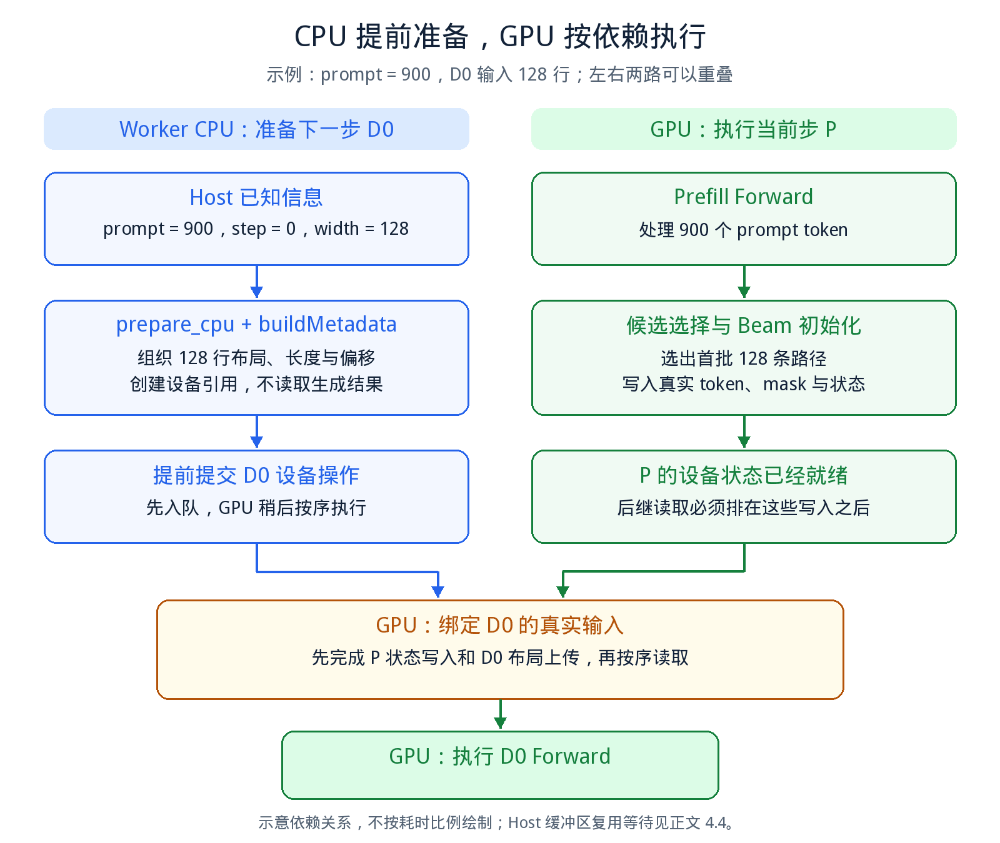
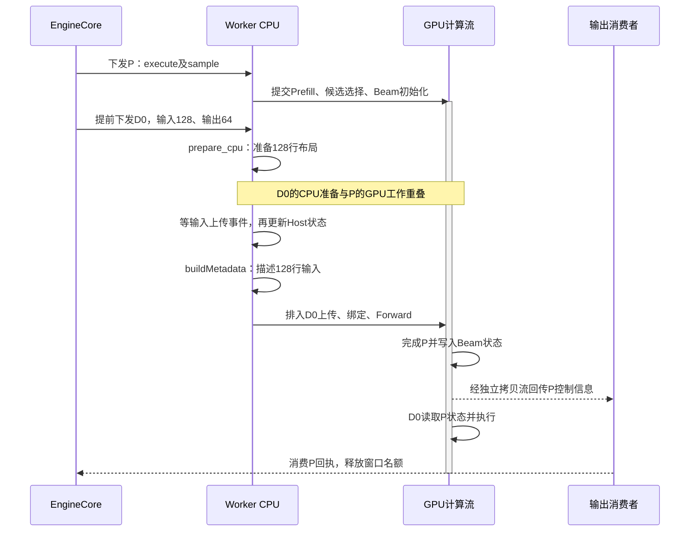
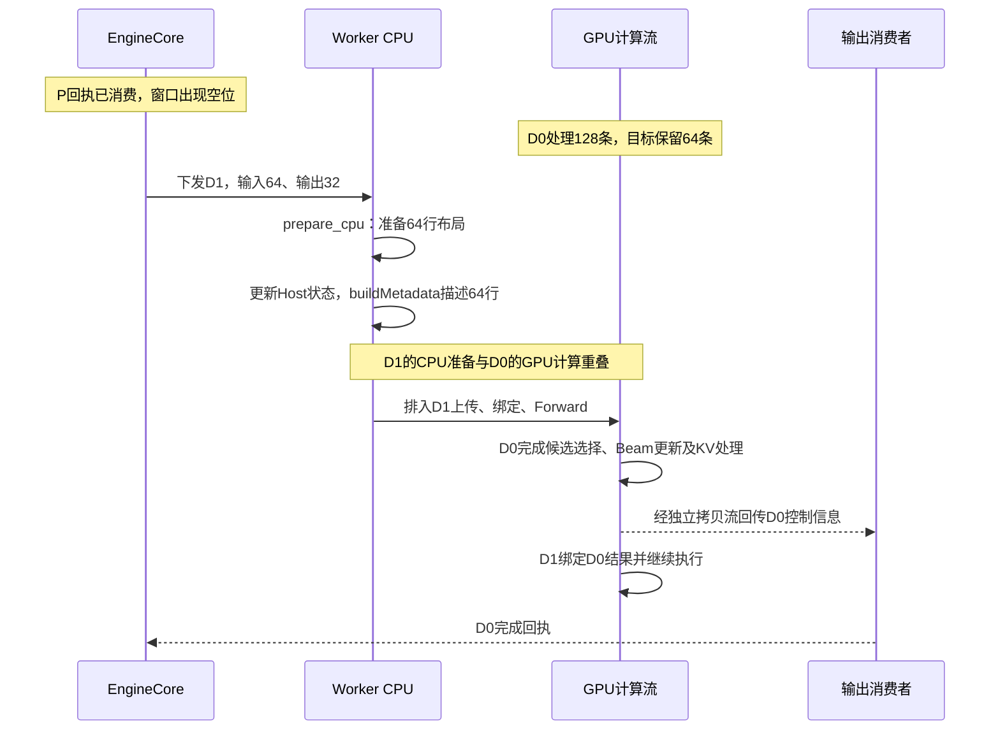
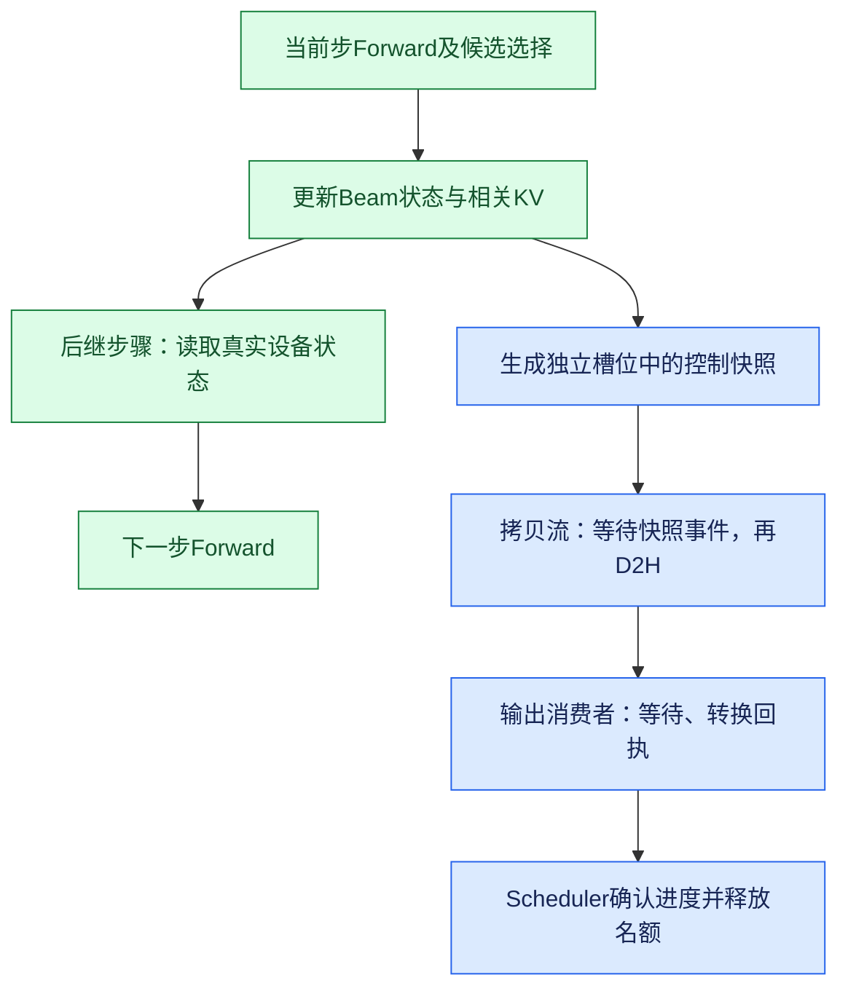
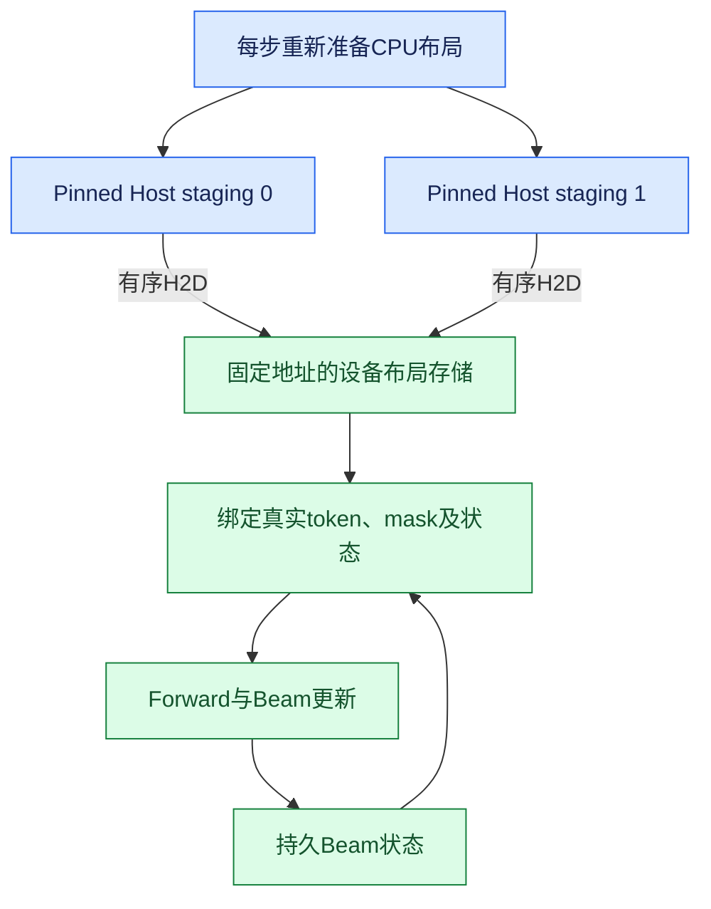
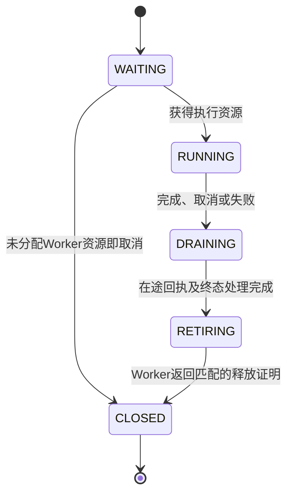

# 图解推理引擎异步调度：CPU/GPU 重叠与 P→D、D→D 衔接

> 面向读者：了解 Prefill、Decode 和 Beam Search 的基本概念，希望理解异步调度如何减少推理中的 CPU 等待。
>
> 本文以一个请求内的 Beam Search 执行为例，说明原理、执行顺序、缓冲区保护和 Profiling 读图方法。先介绍固定 BeamWidth，再扩展到各 Step 使用不同预设 BeamWidth；示例采用一个活跃 session、最多两个在途任务。宽度计划在执行前已知是提前准备的条件之一，各 Step 宽度相同不是必要条件。
>
> 跨 Step 不同预设宽度的例子用于解释适配后的执行逻辑。附录引用的代码快照仍采用全程固定宽度，不能直接视为已经支持这些变宽例子。
>
> 图中的时间顺序用于说明依赖，横纵距离不表示实测耗时。所有示例数字均标明用途，本文不据此承诺具体性能收益。

**核心思路：提前调度下一步，把不依赖生成结果的 CPU 准备工作，与当前步 GPU 计算重叠；真实 token、Beam 状态和 KV 在设备端按顺序传递。**

理解它，先分清楚三个时刻：

**CPU 提交任务、GPU 完成任务、CPU 消费完成回执，是三个不同的时刻。**

## 阅读路线

| 想解决的问题 | 对应章节 |
| --- | --- |
| GPU 为什么会等 CPU？ | 1–2 |
| 上一步 token 还没出来，怎么准备下一步？ | 3 |
| prepare_cpu 和 buildMetadata 为什么可以提前做？ | 3.3–3.5、4.4 |
| 各 Step 使用不同的预设 BeamWidth，还能提前准备吗？ | 3.1、3.6 |
| Prefill→Decode 如何重叠？ | 4，具体例子见 4.5 |
| Decode→Decode 如何重叠？ | 5，具体例子见 5.1 |
| 两步在途窗口与回执如何配合？ | 6–7 |
| 如何避免覆盖数据、提前释放 KV？ | 8–9 |
| Graph 有什么作用，哪些开销仍然存在？ | 10 |
| 如何从 Profiling 确认重叠与剩余瓶颈？ | 11 |
| 分享时怎样组织讲解，如何继续读源码？ | 12、附录 |

## 1. 从一次生成请求开始

### 1.1 统一术语

| 术语 | 本文含义 |
| --- | --- |
| Host / CPU | 调度、准备输入、提交 GPU 操作的执行侧 |
| Device / GPU | 执行模型、候选选择和 Beam 状态更新的设备侧 |
| Prefill，简称 P | 处理输入 prompt，建立前缀 KV，并利用最后位置的 logits 选择第一个生成 token |
| D0 | 第一次 Decode Forward，处理第一个生成 token，并选择第二个生成 token |
| D1 | 第二次 Decode Forward，处理第二个生成 token，并选择第三个生成 token |
| Worker | 持有模型及设备状态、负责提交和执行模型工作的运行单元 |
| Metadata | 描述 Attention 如何解释输入的数据，例如长度、偏移和 KV block table |
| Stream | GPU 操作队列；本文通过同一计算流或显式事件依赖保证先后顺序 |
| Dispatch | 一次物理执行任务的下发；切分 Prefill 时，一个 Prefill 阶段可能对应多次下发 |
| 在途任务 | 已经下发，但调度器尚未消费其完成回执的任务 |
| H2D / D2H | Host→Device 上传 / Device→Host 回传 |

先看全程固定宽度的基础例子：一个请求有 900 个 prompt token、BeamWidth 为 128，希望生成 3 个 token。第 3.6、4.5、5.1 节再使用逐步变宽的扩展示例。

| 阶段 | 主要工作 | 阶段完成后的逻辑进度 |
| --- | --- | --- |
| P | 处理 prompt，计算 logits，初始化 Beam | 每条有效候选路径有第 1 个生成 token |
| D0 | 处理当前 128 行 Beam 输入，选择并更新 Beam | 产生第 2 个生成 token |
| D1 | 继续处理 Beam 输入，选择并更新 Beam | 产生第 3 个生成 token |

**生成 3 个 token，通常只需要 1 次 Prefill 和 2 次 Decode Forward。** 这里不计前端额外插入的特殊 token，也不计强制补充结束符等接口策略。

### 1.2 相邻步骤有真实的数据依赖

D0 的输入 token 来自 P 的候选选择；D1 的输入 token 来自 D0 的 Beam 更新。设备端必须遵守这一先后关系。

异步调度调整的是 CPU 开始准备、提交后继任务的时间。相邻步骤的真实状态读取仍然服从生成过程的依赖。

## 2. 同步执行为什么会留下 GPU 空隙

一次推理步骤可以分成四类工作：

1. CPU 调度：决定执行哪个请求、哪一步。
2. CPU 准备：整理布局、position、KV block table 和 Attention metadata。
3. GPU 执行：Forward、候选选择、Beam 更新及相关 KV 处理。
4. CPU 消费结果：等待回传、转换结果、确认进度。

如果每一步都等结果回到 CPU 后才推进下一步，执行顺序如下：

| 顺序 | CPU 的动作 | GPU 的状态 |
| --- | --- | --- |
| 1 | 准备并提交 P | 等待输入，然后开始 P |
| 2 | 等待并消费 P 的结果 | 执行 P，完成后回传 |
| 3 | 调度、准备并提交 D0 | P 已结束，等待 D0 |
| 4 | 等待并消费 D0 的结果 | 执行 D0，完成后回传 |
| 5 | 调度、准备并提交 D1 | D0 已结束，等待 D1 |

**步骤 3 和步骤 5 中，GPU 可能已经算完，却还没有拿到下一步任务。** 这类空隙来自依赖 CPU 推进的执行链，而不一定来自模型算子本身。

可以将同步边界概括为：

`前一步 GPU 完成 → 结果回传与处理 → 下一步 CPU 准备 → 下一步 GPU 执行`

异步调度希望让其中的 CPU 工作更早发生。

## 3. 把下一步输入分成“可提前准备”和“必须等结果”两部分

### 3.1 不是所有准备工作都依赖真实 token

| 信息 | 何时能知道 | 如何处理 |
| --- | --- | --- |
| 当前请求、计划执行的步编号 | 下发时已知 | CPU 提前准备 |
| 本步计划输入宽度、输出保留宽度 | 从启动或请求建立时确定的宽度计划取得 | CPU 提前准备；输入、输出宽度分别记录 |
| 当前 token 的 position | 根据 prompt 长度和计划步数推导 | CPU 提前准备 |
| Attention 偏移、计划长度和输入布局 | 根据本步计划输入宽度、步数与既定存储布局推导 | CPU 提前准备 |
| prompt KV block IDs | 分配后已有 Host 记录 | CPU 提前准备 |
| 每个 Beam 实际输入哪个 token | 上一轮候选选择后确定 | GPU 顺序读取 |
| 哪些 Beam 仍然有效 | 上一轮状态更新后确定 | GPU 顺序读取 |
| 生成序列、父节点关系和对应 KV 状态 | 上一轮 Beam 更新后确定 | 保持设备端依赖 |
| EOS、整体完成状态或设备错误 | 执行过程中确定 | GPU 检查并屏蔽无效后继 |

**提前准备要求的是当前 Step 的执行几何在 Host 上已知，并不要求所有 Step 的 BeamWidth 相同。** 例如执行前已经确定各阶段保留宽度为 `128 → 64 → 32`，CPU 就可以提前取得对应输入行数并组织布局。哪些 token、父节点和有效 Beam 最终进入这些行，仍由 GPU 按序确定。

这些长度和行数描述计划几何；提前结束等动态变化由设备 mask 和状态校验处理。如果实际宽度必须根据上一轮分数、EOS 或存活 Beam 数确定，CPU 就不能提前构建依赖该结果的精确形状。此时可以只提前准备独立部分，或采用已知容量上界与设备 mask，并相应适配后端。

### 3.2 固定 BeamWidth 的基础例子

prompt 长度为 900、BeamWidth 为 128 时：

| 准备内容 | D0 | D1 |
| --- | --- | --- |
| 计划输入行数 | 128 | 128 |
| position，按 0 起算 | 900 | 901 |
| 计划 suffix Attention 长度，包含当前输入 token | 1 | 2 |
| 实际 input token | 读取 P 的设备结果 | 读取 D0 的设备结果 |

CPU 可以先组织好“128 行怎样排列、每行的位置在哪里”，GPU 随后补上“每行真正输入哪个 token、是否有效”。这里没有预测 token；使用的始终是前一步实际计算出的结果。



<details>
<summary>查看图 1 的 Mermaid 源码</summary>

```text
flowchart TD
    H["Host已知信息：长度、步数、宽度、block IDs"] --> C["CPU：准备下一步布局和metadata"]
    C --> Q["提前提交下一步设备操作"]
    G["GPU：当前步Forward和Beam更新"] --> S["真实token、mask、序列及KV状态"]
    S --> B["GPU：绑定下一步真实输入"]
    Q --> B
    B --> F["GPU：下一步Forward"]
    classDef host fill:#DBEAFE,stroke:#2563EB,color:#172554
    classDef device fill:#DCFCE7,stroke:#15803D,color:#14532D
    class H,C,Q host
    class G,S,B,F device
```

</details>

**图 1：CPU 准备与 GPU 当前步计算可以重叠；真实输入绑定必须等待前一步状态写入。** 箭头表示准备条件或设备顺序依赖，不表示 CPU 需要逐项等待 GPU 返回。

### 3.3 prepare_cpu 为什么可以提前做

`prepare_cpu` 的输入可以概括为：

`Host 已知的 prompt 长度 + 计划 decode_step + 本步计划输入宽度 + Host 上的 prompt block IDs + 已确定的存储布局`

它主要进行列表、偏移和长度计算，再把布局写入本次 dispatch 选中的 pinned Host staging。下面先解释这些字段描述什么，再说明它们如何被消费。

#### 先统一一个小例子

为便于展开数组，本节将 BeamWidth 缩小为 4，假设四条路径都有效：

- `prompt_len = 900`：共享 prompt 的位置为 0–899。
- `W = 4`：本步有四个输入 token，每个 Beam 一个。
- `decode_step = 1`：正在准备 D1，即第二次 Decode Forward。
- P 已选出各路径的第一个生成 token，D0 选出了第二个；D1 把第二个作为输入，计算第三个的 logits。
- D1 当前输入位置为 901。Attention 读取的计划长度为 902：900 个共享 prompt token，加各路径的两个 suffix token，其中第二个就是当前输入。

**Q 是当前输入 token 经过投影得到的 Query 向量，KV 是 Attention 要读取的 Key/Value。** 本例每层有四行 Q；每行 Q 都需要读取共享的 900 个 prefix KV，以及自己路径的两个 suffix KV。当前输入的 KV 会在该层计算过程中写入，长度描述包含它。

| Attention 部分 | Q 怎样分组 | 每组读取多少 KV | 为什么这样组织 |
| --- | --- | --- | --- |
| Prefix | 一组，包含四行 Q | 同一份 900 个共享 prompt KV | 四条路径的 prompt 相同，可以复用同一份 KV |
| Suffix | 四组，每组一行 Q | 每组两个，来自该 Beam 自己的路径 | 各路径的生成后缀不同，必须分组读取 |

这解释了为什么同样的四行 Q，在 prefix 和 suffix 两部分使用不同 offsets。分组不表示四条 Beam 彼此做 Attention；每行 Q 仍然得到自己的计算结果。后端根据两部分的 softmax 统计合并 prefix/suffix 结果，不能简单把两个输出平均。[Attention 消费与合并逻辑][gr-attention]

#### 字段、示例值和操作含义

| 文档字段（布局键） | 本例提前准备的值 | 含义与后续操作 |
| --- | --- | --- |
| positions（`positions`） | `[901, 901, 901, 901]` | 每个当前输入 token 的序列位置；模型据此应用位置编码，例如 RoPE。不是 token ID，也不是 KV 地址。 |
| prefix query offsets（`query`） | `[0, 4]` | 把四行 Q 作为一个共享前缀组；prefix Attention 从 Q 的第 0 行取到第 4 行之前，并让它们读取同一份 prefix KV。 |
| 计划总长度（`sequence`） | `[902]` | 当前请求在本步的完整逻辑上下文长度，包含当前输入；用于 common metadata 的 `seq_lens` 描述。本路径的两段 Attention 还分别使用 prefix/suffix 长度。 |
| prefix KV 长度（`prefix_lengths`） | `[900]` | 共享 prompt 中有 900 个有效 KV token；prefix Attention 用它限制 block table 对应存储中的有效读取范围。 |
| prefix block table（`blocks`） | 已分配的 prompt block IDs，末尾按容量补齐 | 将逻辑 prompt block 映射到设备 KV cache 中的物理 block，决定去哪里读取 prefix KV。 |
| suffix query offsets（`suffix_query`） | `[0, 1, 2, 3, 4]` | 把四行 Q 分成四组，一组一个 Beam；第 i 组使用 Q 的第 i 行。 |
| suffix KV 计划长度（`suffix_lengths`） | `[2, 2, 2, 2]` | 每条路径在本步有两个有效 suffix KV token，包含当前输入。注意这是每个 Beam 的长度，不是四条路径加起来的总数。 |
| suffix KV offsets（`suffix_offsets`） | `[0, 2, 4, 6, 8]` | 在按 Beam 打包的 suffix KV 视图中，每组占两个 KV 行；后端据此划分各 Beam 的有效 KV 范围。不是 token 值或父节点 ID。 |

其中 `W` 表示本步计划输入 Beam 数，即 `W_in[t]`；`decode_step` 是调度器下发的计划步编号。这些示例值均不需要先读取上一轮的真实 token。

#### offsets 到底表示什么

`offsets` 是分段边界，也常写为 `cu_seqlens`（累计长度）。约定第 i 组使用半开区间 `[offsets[i], offsets[i+1])`，因此有 N 组就需要 N+1 个边界。

| 本例对象 | offsets | 实际划分 |
| --- | --- | --- |
| Prefix 的四行 Q | `[0, 4]` | 只有一组：Q 行 0、1、2、3 |
| Suffix 的四行 Q | `[0, 1, 2, 3, 4]` | 四组分别取 Q 行 0、1、2、3 |
| Suffix 的八行 KV | `[0, 2, 4, 6, 8]` | 四组分别取 KV 行 0–1、2–3、4–5、6–7 |

例如 Beam 2（从 0 起算）：它的 suffix query 范围是 `[2,3)`，只取 Q 第 2 行；suffix KV 范围是 `[4,6)`，取该路径的两个 KV 行。这样 Q 不会错误地读取其他 Beam 的 suffix。

这些 offsets 的单位是打包视图中的 Q/KV 行，不是字节。参考后端先把各 Beam 的有效 suffix KV 整理到打包缓冲区，再交给 Attention 使用这组边界。它们不等于原始 Beam KV pool 中的物理地址；跨 Step 变宽时，历史段起点、stride 和祖先索引仍需独立适配，详见 3.6。

#### block table 到底操作哪一层地址

假设 block size 为 16，prompt 长度 900 需要 `ceil(900/16) = 57` 个逻辑 block，最后一个只使用其中四个位置。举例说明其映射：

| 逻辑 prompt block | 覆盖的 prompt 位置 | block table 中的物理 block ID，示意 |
| --- | --- | --- |
| 0 | 0–15 | 17 |
| 1 | 16–31 | 42 |
| 2 | 32–47 | 9 |
| … | … | … |
| 56 | 896–899，有效四个位置 | 63 |

若要读取 prompt 位置 20，先得到逻辑 block `20 // 16 = 1`、块内偏移 `20 % 16 = 4`，再查 `block_table[1] = 42`，从物理 block 42 的第 4 个位置读取该层 KV。

CPU 准备的是这些 block ID，不是在准备或复制 K/V 向量本身。固定容量末尾补齐也不代表新增有效 KV，有效范围仍由 prefix 长度等 metadata 限制。在途 KV 引用和资源所有权保证这些 block 不会被其他请求提前复用。

#### CPU 准备、metadata 构建、GPU 消费的分工

| 执行位置 | 具体操作 |
| --- | --- |
| `prepare_cpu` | 从 Host 已知的长度、步数、宽度、block IDs 计算上表整数数组，写入 pinned Host staging。 |
| 布局上传 | 异步把整数数组复制到对应设备布局存储。 |
| `buildMetadata` | 把标量、CPU 列表、设备 Tensor view 和 session 引用放入 Attention 描述对象。 |
| 设备绑定 | 读取上一轮真实 token、mask 与状态，验证步数，并对终止状态进行必要的屏蔽或长度修正。 |
| 模型与 Attention | 用 positions 处理位置编码，用 offsets 划分 Q/KV 组，用长度限定有效范围，用 block table 定位共享 prefix KV。 |

源码中还有一个名为 `logits` 的布局键，值为 `[0, 1, ..., W-1]`，在这里用于提供 Beam 行的索引，例如 `prefix_indices`；它存储的是行号，不是模型计算出的词表 logits。[布局构建与字段映射][gr-metadata]

**这些量依赖“准备执行哪一步”，不依赖“上一步选中了哪个 token”。** 所以只要拿到调度元信息和可用 staging，CPU 就能计算，无需等待上一轮 GPU 结果。

需要等待上一轮的 token、有效 mask、生成序列以及实际状态校验，被保留到设备端绑定。提前计算的计划值若对应已结束的 session，由设备状态屏蔽；活跃 session 的实际步数不匹配则报错。

这里的“提前”没有要求跳过 CPU 准备。布局仍然每步计算；减少的是它暴露在 GPU 空闲区间里的时间。参考实现的这条路径也不需要命中布局缓存来获得这一性质。

### 3.4 buildMetadata 为什么也可以提前做

本文用 `buildMetadata` 表示 Host 上构建 Attention metadata 的工作；参考实现的相应入口是 `BeamAttentionMetadataBuilder.build_async()`，由 `_bind_attention()` 调用。

**3.3 主要回答“布局里的数值怎么算”；3.4 回答“怎样把这些数值和设备缓冲区组织成 Attention 能使用的描述”。** 这两步之后，模型和 Attention 才按该描述实际计算。

#### 沿用四条 Beam 的例子

继续使用 `prompt_len=900`、`W=4`、`decode_step=1`。`prepare_cpu` 已经算好了：

```python
# CPU上的计划布局；示意只列出部分字段。
layout = {
    "positions": [901, 901, 901, 901],
    "query": [0, 4],
    "sequence": [902],
    "prefix_lengths": [900],
    "suffix_query": [0, 1, 2, 3, 4],
    "suffix_lengths": [2, 2, 2, 2],
    "suffix_offsets": [0, 2, 4, 6, 8],
}
```

与此同时，Worker 已经持有相应设备布局缓冲区、mask buffer 和 Beam session。此时 CPU 知道这些存储在哪里、容量多大；不要求其中已经包含本轮最终有效内容。

`buildMetadata` 把两类信息接起来：Host 已知的计划描述，以及稍后 GPU 将读取的设备存储引用。

#### Metadata 对象里究竟装了什么

Metadata 外层是一个 Host/Python 描述对象。它既可以持有 CPU 数值和列表，也可以持有设备 Tensor 的 Python 引用；设备 Tensor 的实际元素仍存放在 GPU 上。

| 类型 | 示例 | CPU 构造时是否需要读 GPU 结果 |
| --- | --- | --- |
| Host 标量、列表 | 行数、Head 数、block size、计划长度、CPU offsets | 不需要，来自配置或 prepare_cpu |
| 设备 Tensor 的引用或 view | block table、device offsets、device lengths | 不需要，只需已有 Tensor 对象与地址 |
| 持久对象引用 | Beam session、active mask buffer、KV pool 相关对象 | 不需要，绑定已有对象即可 |

本例中的具体字段映射如下：

| 3.3 准备的内容 | buildMetadata 中的去向 | 后续作用 |
| --- | --- | --- |
| 输入行数 4 | `num_actual_tokens=4`、`num_prefix_indices=4` | 描述本步提交的四行输入；四行中是否有效还由 mask 控制 |
| 请求数 1 | `num_reqs=1` | 一个请求拥有四条 Beam，不能把 Beam 数当成请求数 |
| CPU query offsets `[0,4]` | `query_start_loc_cpu` 等 CPU 列表字段 | Host 侧可直接使用的分组描述 |
| 设备 query offsets buffer | `query_start_loc`、`prefix_cu_seqlens_q_device` | prefix Attention 读取设备上的 `[0,4]` 分组边界 |
| 总长度 `[902]` | CPU 版本进入 `seq_lens_cpu`，设备引用进入 `seq_lens` | 提供 Host 与设备两侧的计划长度描述 |
| 设备 prefix 长度 buffer | `prefix_seqlens_kv_device` | prefix Attention 读取有效长度 900 |
| 设备 block table buffer | `.view(1, -1)` 后进入 `block_table`、`prefix_block_table` | 一个请求对应一行 block IDs，供 prefix KV 寻址 |
| 设备 suffix query offsets buffer | `suffix_cu_seqlens_q_device` | suffix Attention 将 Q 分成四个单行组 |
| 设备 suffix KV offsets buffer | `suffix_cu_seqlens_k_device` | suffix Attention 从设备读取各 Beam 的 KV 分段边界 |
| 设备 suffix 长度 buffer | `suffix_seqlens_kv_device` 等长度描述 | 记录每行的计划有效长度，设备绑定还可按实际状态修正相关字段 |
| 固定设备 execution mask buffer | `beam_active_mask` | 相关设备操作读取真实有效 mask，屏蔽已经结束的路径 |
| 已有 Beam session 对象 | `beam_session` | 后端通过它找到持久 session 与 suffix KV 相关资源 |

`positions` 的路径略有不同：它由 Worker 绑定到模型的 `positions` 输入，供位置编码使用，并不是上表 Attention metadata 中的一个同名字段。[布局构建与字段映射][gr-metadata] · [Worker 绑定入口][gr-bind-attention]

#### “保存引用”和“读取设备内容”有什么区别

假设设备上有一块 `mask_buffer`，CPU 已经持有它的 Tensor 对象：

```python
# 只把已有Tensor对象交给metadata，不把GPU元素取回CPU。
metadata.beam_active_mask = mask_buffer
```

这一步的含义是：“后面需要 mask 时，从这块设备存储读取。”CPU 不必先知道 buffer 中最后会是 `[True, True, False, True]` 还是其他值。

等 GPU 完成 D0 的 Beam 更新后，D1 的设备绑定根据真实状态更新这块 execution mask。随后相关 Attention/KV 操作读取的就是更新后的内容。固定四行布局仍然保留，mask 决定哪些行有效。

这和下面的操作有本质上的依赖差别：

```python
# 需要把GPU元素读回CPU；会引入设备结果的完成依赖。
host_mask = mask_buffer.cpu().tolist()
```

前者保存引用，后者读取值。允许 metadata 提前构建的关键，是这条构建路径不需要后一类设备结果读取。

类似地，参考实现中 `views["blocks"].view(1, -1)` 只给已有连续设备存储增加一个形状视图，不复制整份 KV、不计算 Attention，也不把 block IDs 读回 Host。CPU 能从 Tensor 对象知道 shape、stride 和 dtype，这些描述不需要等待 GPU 生成结果。

#### 布局上传还没结束，为什么也能先建 metadata

`upload()` 会把 H2D 复制排进计算流，然后返回指向目标设备存储的各个 view。CPU 随后可以立即构建 metadata，因为目标存储已经存在。

```python
# 机制示意。GPU缓冲区已分配，并满足在途任务的复用保护。
device_layout.copy_(host_staging, non_blocking=True)

# 此时H2D可能还在排队；创建view不需要读取它的设备元素。
query_view = device_layout[query_slice]
sequence_view = device_layout[sequence_slice]

# 只展示部分字段；实际构造还包含其他布局、配置和session信息。
metadata = make_attention_metadata(
    num_actual_tokens=4,
    query_start_loc_cpu=[0, 4],
    query_start_loc=query_view,
    seq_lens_cpu=[902],
    seq_lens=sequence_view,
    beam_active_mask=mask_buffer,
)

# 设备真正读取前，先按流顺序完成H2D和真实状态绑定。
enqueue_bind_actual_device_state(metadata)
enqueue_attention_forward(metadata)
```

`non_blocking=True` 本身不是完整的正确性保证；这里还需要 pinned Host staging、有效的缓冲区生命周期，以及前一步、上传、设备绑定、Forward 之间明确的流或事件顺序。

#### CPU 和 GPU 的时间线怎样错开

假设 D0 仍在 GPU 上运行，D1 已经获得调度窗口名额：

| 顺序 | Worker CPU | GPU 计算流 |
| --- | --- | --- |
| 1 | `prepare_cpu(D1)` 算出四行输入的整数布局 | 执行 D0 Forward 和后处理 |
| 2 | 提交 D1 布局 H2D，获得目标设备存储的 view | D1 上传可以先排队，等待前面的设备工作 |
| 3 | `buildMetadata(D1)` 构造 Host 对象、复制小列表、保存设备引用 | D0 仍可继续执行，CPU无需知道其真实 token 和 mask |
| 4 | 提交 D1 设备绑定与 Forward | 完成 D0 状态更新，按序执行 D1 上传与动态绑定 |
| 5 | 后续处理或推进队列 | D1 读取已经更新的 offsets、mask、token 和 KV 状态并计算 |

**被提前并可能覆盖的是步骤 3 的 Host 对象构造等工作。GPU 真正消费 metadata 指向的数据时，前置写入仍然必须已经完成。** 如果步骤 3 开始时 D0 已经算完，它依然是可提前的工作，但这次执行没有获得实际覆盖窗口。

P→D 使用同一原理，不过参考实现中的 metadata 构造位于 Prefill Host 输入复用保护和所需 Host 状态更新之后，具体顺序见 4.4。

#### 逐步变宽和 Graph 的额外约束

若 D0 输入 128 条 Beam、D1 输入 64 条 Beam，CPU 可以从预设 `W_in[t]` 分别构建 128 行和 64 行描述，不必等待具体胜出路径。设备引用必须对应已分配且有效的存储，后端也必须适配该宽度计划。

Graph 模式还要求设备地址、形状、stride 和所选图兼容。**新建一个 Python metadata 对象，不会自动改写已经捕获的 CUDA Graph。** 重放时仍需更新图所引用的固定设备存储；多宽度场景则选择事先准备好的兼容图或采用已适配的 padding 方案。

在本文参考路径中，`buildMetadata` 的主要 Host 工作是构造描述、列表和 Tensor 引用，布局 H2D 与动态设备绑定分别处理。其他后端的同名 builder 可能还会分配 workspace、启动 kernel 或读取设备结果；能否提前要逐项核对其依赖，不能仅根据函数名判断。

### 3.5 能提前的前提，以及不能提前的边界

| 条件 | 为什么必要 |
| --- | --- |
| 所需几何可从 Host 信息推导 | CPU 不必等待真实 token 或 GPU 统计结果 |
| GPU 数据保留为 Tensor 引用，动态值在设备端更新 | 创建 metadata 时不用读取设备内容 |
| Host 输入采用独立 staging，或等待其复用事件 | 不会覆盖仍被旧 H2D 读取的内存 |
| 设备写入与后继读取有明确顺序 | metadata 先建好，实际读取时内容也必须已经准备好 |
| 本步计划宽度、实际有效数与终止 mask 的接口一致 | 预设的逐步变宽与提前 EOS 都能保持正确的执行几何；无效行不会被当成有效输入 |
| KV、workspace 和 session 生命周期覆盖在途任务 | metadata 中保存的引用在执行时仍然有效 |

如果某个 metadata builder 需要对 GPU 结果执行 `.item()`、`.cpu().tolist()`，根据实际 surviving Beam 数压缩形状，或先把父节点读到 Host 再重建 KV 映射，它就存在新的设备结果依赖，不能直接套用上述提前构建方式。应先拆开独立布局与动态绑定，或保留必要等待。

**prepare_cpu 与 buildMetadata 都可以提前执行，但不意味着把整个原生输入准备函数无条件搬到任意位置。** 每个子步骤都要分别核对数据依赖、Host 内存复用与设备顺序。

### 3.6 各 Step 使用不同的预设 BeamWidth

**结论：异步准备的原理可以复用，固定宽度实现的缓冲区、Beam 更新和 Graph 接口需要适配。**

这里的“预设宽度”指启动或请求建立时已经知道每一阶段的目标保留数量。例如，Prefill 选出 128 条，D0 结束保留 64 条，D1 结束保留 32 条。

#### 输入宽度和输出宽度必须分开

| 阶段 | 本次 Decode Forward 输入 Beam 数 | 本阶段选择后保留的 Beam 数 | 下一次 Decode 输入 Beam 数 |
| --- | ---: | ---: | ---: |
| P | —，处理 900 个 prompt token | 128 | 128 |
| D0 | 128 | 64 | 64 |
| D1 | 64 | 32 | 本例到此结束 |

Prefill 最后位置的 logits 用于选出首批 128 条路径。D0 仍然需要对 128 条输入路径执行 Forward，再从它们的扩展候选中选择 64 条。**保留 64 条发生在 D0 后处理，64 行 Forward 对应的是 D1。**

```python
# 宽度计划在执行前确定；示意包含两次Decode。
prefill_output_width = 128
decode_input_widths = [128, 64]
decode_output_widths = [64, 32]

t = planned_decode_step
prepared = prepare_cpu(
    input_width=decode_input_widths[t],
    prompt_len=900,
    decode_step=t,
    # 以及Host block IDs、staging槽位和存储布局信息
)
# output_width用于后续候选选择与Beam状态更新，不能替代本步输入行数。
planned_output_width = decode_output_widths[t]
```

因此 CPU 在 D0 尚未完成时，就知道 D1 是 64 行、position 为 901、计划 suffix 长度为 2；尚不知道的是哪 64 条路径胜出以及各自的 token、父节点。这部分依赖继续留在 GPU 上。

#### KV 布局要区分逻辑宽度和物理容量

| 存储策略 | Host 可以预知的信息 | GPU 仍需按序确定的信息 |
| --- | --- | --- |
| 各步按最大宽度预留 | 最大宽度容量、固定物理 stride、本步输入及输出范围 | 父 Beam、真实写入和读取路径、有效 mask |
| 各步按预设宽度紧凑分段 | 完整宽度计划、每个历史段的容量及累计起点 | 选中的祖先索引、真实 token 和 KV 内容 |

即使采用紧凑分段，所有段的起点也可以从宽度计划提前算出；每条 Beam 实际应该读取哪条历史路径，则仍由设备祖先索引或重排逻辑处理。不能直接使用“当前宽度 × 历史步数”替代所有历史段的地址计算。

#### 具体实现需要适配的接口

| 模块 | 需要表达的内容 |
| --- | --- |
| Scheduler / dispatch metadata | 本步输入宽度、输出保留宽度，以及可校验的阶段身份 |
| 输入缓冲区、Beam 状态与 workspace | 最大物理容量与本步逻辑范围分离，维持在途所有权保护 |
| 候选选择与 Beam / KV 更新 | 支持输入、输出路径数不同，检查父索引范围 |
| Attention metadata | 使用本步输入宽度与既定历史 KV 布局构造 |
| CUDA Graph | 按所需输入形状预捕获并保持各图地址稳定，或按容量上界 padding 并正确屏蔽 |

若后处理也被捕获，Graph 的匹配条件还要包含它依赖的输出宽度等几何。使用多个宽度的图不等于运行中临时改变同一张图的形状。

附录引用的 `GRInputBuffers` 按单个 `self.width` 分配存储，且校验元信息宽度与其相等。因此，**本节证明的是预设变宽不破坏提前准备的原理，不代表该代码快照可以原样运行变宽计划。** [参考输入实现][gr-inputs]

## 4. P→D：GPU 执行 Prefill 时，CPU 准备第一次 Decode

### 4.1 四个执行角色

| 角色 | 主要职责 |
| --- | --- |
| EngineCore / Scheduler | 管理请求、下发阶段、维护在途任务和 KV 资源 |
| Worker CPU | 准备输入、构建 metadata、提交设备操作 |
| GPU 计算流 | 顺序执行 Forward、候选选择、Beam 更新和后继输入绑定 |
| 输出消费者 | 等待控制信息回传、转换结果、交付完成回执 |

CPU 完成 GPU 操作的提交后，可以继续运行，GPU 则按自己的进度执行已排入的任务。**提交完成不等于计算完成。**

### 4.2 P→D 的执行顺序

1. Worker 提交 Prefill Forward、候选选择和 Beam 初始化。
2. 调度器在窗口有空间时提前下发 D0。
3. Worker CPU 开始准备 D0 的独立布局，不等待 P 的完整结果回传。
4. 处理必要的输入缓冲区保护，再更新 Host 状态、构建 metadata。
5. 把 D0 上传、设备绑定和 Forward 排到 P 的设备工作之后。
6. GPU 完成 P 后，D0 读取 P 产生的真实 token 和 Beam 状态并执行。



**图 2：一种允许的 P→D 执行顺序。** 控制回传和 D0 计算的相对完成时间会变化；关键是 D0 准备和提交不以 P 回执消费为前提。

图中使用 3.6 的预设变宽例子，假设相关缓冲区与后端已完成适配。P 输出 128 条路径，所以 D0 输入为 128 行；D0 的输出保留目标为 64，不能据此将 D0 Forward 缩成 64 行。

### 4.3 D0 已经提交，为什么不会读到旧 token

设备执行顺序受到保护：

`P Forward → 候选选择与Beam初始化 → D0输入绑定 → D0 Forward`

CPU 可以提前提交 D0 输入绑定操作，但 GPU 真正执行该操作时，前面的 Beam 初始化已经完成，因此会读取新的真实状态。

这与 CPU 提前读取结果不同：CPU 没有把尚未完成的设备结果取出来使用。

### 4.4 为什么 P→D 仍然可能有一次 Host 等待

原生 Prefill 可能从 pinned Host 输入缓冲区异步上传数据。后继步骤的 Host 状态更新若会修改这些内存，就必须保证此前上传已经读完。

合理的顺序是：

```python
# 执行顺序示意；省略异常、资源和取消处理。
prepared = prepare_cpu_from_host_metadata()  # 使用独立的GR Host缓冲区

if previous_stage_is_prefill:
    wait_until_prefill_input_upload_is_safe()

update_native_host_state()
device_views = enqueue_layout_h2d(prepared)   # 提交上传，不等它执行完成
metadata = build_metadata(prepared, device_views)  # CPU构造描述和Tensor引用
enqueue_device_binding_from_previous_beam_state()
enqueue_forward()
```

**独立的 CPU 布局计算放在等待之前，涉及共享 Host 缓冲区的修改放在等待之后。** 等待目标是 Prefill 输入准备/上传对应的事件，不要求整个 Prefill Forward 完成。

等待结束后，只要 P 的 GPU 工作还没有结束，Host 状态更新、metadata 构建和操作提交仍有机会继续与它重叠。

| CPU 工作 | 在 P→D 中的位置 | 能被哪段 GPU 工作覆盖 |
| --- | --- | --- |
| 独立 prepare_cpu | Prefill 输入复用等待之前 | 从该准备开始到 P GPU 完成之间的可用时间 |
| Host 状态更新与 buildMetadata | 输入复用安全之后 | 此时仍未完成的 P GPU 工作 |
| 真正的 token / mask 绑定 | CPU可提前提交，GPU按序执行 | 不能越过P的Beam更新；其设备成本仍然存在 |

因此，“buildMetadata 可以提前”的含义是 **不必等待 Prefill 完整执行及结果消费后才构建**。在具体实现中，它仍位于所需 Host 状态更新和输入缓冲区保护之后。若等待解除时 P 已经算完，它就没有获得覆盖窗口。

`event.synchronize()` 会让调用它的 CPU 等待；`stream.wait_event()` 则在设备队列上建立依赖，通常不会为了该依赖阻塞 CPU。设备流的等待不能替代保护 CPU 内存改写所需的 Host 等待。

### 4.5 具体例子：Prefill 如何覆盖 D0 的准备

使用 3.6 的同一个请求：`prompt_len=900`，P 选出 128 条路径，D0 输入 128 条、输出保留 64 条，D1 输入 64 条、输出保留 32 条。

**首先区分“准备 Prefill”和“用 Prefill 覆盖后继准备”。** 对这个单请求例子，P 自己的输入与 metadata 必须在 P Forward 读取前就绪；不能用 P 自己尚未提交的 Forward 去覆盖这段前置准备。本文 P→D 的重叠是：P 已提交后，用它尚未结束的 GPU 工作覆盖 D0 的 CPU 准备。

| 顺序 | Worker CPU / 调度器的工作 | GPU 工作与依赖 |
| --- | --- | --- |
| 1 | 准备 P 的 900 个 prompt token、KV 映射和 metadata，提交 P 及首轮选择 | 上传输入，执行 P Forward，再选择首批 128 条路径 |
| 2 | P 回执尚未消费，第二个窗口名额允许下发 D0 | P 的设备操作仍可能在运行 |
| 3 | `prepare_cpu(D0)`：128 行 position=900，query offsets=[0,128]，suffix 计划长度=1 | 与尚未结束的 P 设备工作重叠；此时不读取 P 选出的 token |
| 4 | 等待 Prefill Host 输入复用安全，再更新所需 Host 状态 | 只需相关上传结束，不必等 P Forward 与首轮选择全部完成 |
| 5 | 排入 D0 布局上传；`buildMetadata(D0)` 创建 128 行描述、设备 view、mask 和 session 引用 | CPU 构造引用时，P 仍可执行；D0 的上传在计算流上按序排队 |
| 6 | 提交 D0 的设备绑定和 Forward，继续让队列推进 | P 完成首轮选择后，绑定真实的 128 个 token、有效 mask 和对应状态，再执行 D0 |

本例中，D0 metadata 的 Host 内容可以提前确定：

| 字段 | 提前准备的值或引用 |
| --- | --- |
| Forward 输入行数 | 128 |
| positions | 128 个 900 |
| prefix query offsets | [0, 128] |
| suffix query offsets | [0, 1, ..., 128] |
| 每行计划 suffix 长度 | 1，包含 D0 当前输入 token |
| 后处理目标保留数 | 64，作为独立输出宽度参数 |
| 实际 token、mask 与 KV 路径 | 设备缓冲区引用，执行时按序读取和绑定 |

**被覆盖的是步骤 3、步骤 4 中等待结束后的 Host 工作，以及步骤 5 的 CPU metadata 构造与提交开销。** 等待本身是否阻塞、这些工作能否全部落在 P 剩余执行区间内，要看实际时序；D0 的设备上传和绑定仍然有成本。

## 5. D→D：GPU 执行当前 Decode 时，CPU 准备下一次 Decode

D→D 复用同样的机制：GPU 执行 D0 时，CPU 准备并提交 D1。D1 的输入 token、mask 和序列前缀，在 GPU 完成 D0 更新之后才被读取。



**图 3：D1 可以在 D0 回执被消费之前准备和提交。** 图中假设 P 回执及时释放了窗口名额。

D1 的 64 行是执行前已知的计划；它们最终对应哪 64 条路径，由 D0 的设备端 Beam 选择确定。

两条关系需要同时保留：

| 关系 | 是否允许重叠 |
| --- | --- |
| D1 的 CPU 准备，与 D0 的 GPU 计算 | 可以 |
| D0 的 Beam 更新，与 D1 对该结果的真实读取 | 必须按依赖顺序执行 |

采用独立 Decode 输入路径后，D→D 不再重复 P→D 那道原生 Prefill Host 输入等待。但 staging 复用事件、窗口容量和其他必要的资源约束仍然存在。

此外，D1 的 H2D 上传、设备绑定在本文实现中与 Forward 使用有序计算流。**CPU 提前提交可以减少 GPU 等待 CPU 的空隙，但上传和绑定的设备执行成本仍在。**

### 5.1 具体例子：D0 如何覆盖变宽后 D1 的准备

继续使用 `P保留128 → D0保留64 → D1保留32` 的计划。D0 的 Forward 处理 128 条输入；D1 的 Forward 将处理 64 条输入。

| 顺序 | Worker CPU / 调度器的工作 | GPU 工作与依赖 |
| --- | --- | --- |
| 1 | D0 的 Forward 与 Beam 更新已提交；消费 P 回执，释放一个在途名额 | D0 正在处理 128 条输入或进行后处理 |
| 2 | 提前下发 D1，元信息携带 input_width=64、output_width=32 | 不需要等 D0 的完成回执 |
| 3 | `prepare_cpu(D1)`：64 行 position=901，query offsets=[0,64]，suffix 计划长度=2 | D0 可同时计算候选，并按计划选出 64 条路径 |
| 4 | 更新 Host 状态，排入布局上传，`buildMetadata(D1)` 构造 64 行描述与设备引用 | 不需要先把这 64 条路径的 token 或父节点读回 CPU |
| 5 | 提交 D1 设备绑定与 Forward；若启用图模式，选择匹配 64 行输入形状的预捕获图，或适配好的容量上界图 | 设备端先完成 D0 的 128→64 Beam 选择与相关 KV 处理 |
| 6 | 输出消费者独立处理 D0 回执 | D1 读取真实的 64 行 token、mask 与历史状态，执行 Forward，随后按计划保留 32 条 |

例如，D0 最终选中的 64 条路径，其父节点可能重复，也可能没有覆盖全部 128 条旧路径。这个具体映射只有 GPU 算完选择后才知道。CPU 在步骤 3–4 只负责“准备 64 个输入位置和它们的描述”，并不提前决定每个位置对应哪个父节点。

**D→D 的覆盖关系是 `prepare_cpu(D1, 64行)`、`buildMetadata(D1, 64行)` 与 D0 的 128 行 GPU 执行重叠。** 它不要求前后两个 Step 的行数相等。

D→D 不再重复 P→D 专用的原生 Prefill 输入等待，但 staging 复用事件和设备顺序保护仍然有效。如果 P 回执迟迟未被消费，D1 就拿不到窗口名额；如果 D1 准备结束得晚，GPU 仍会等待。因此，预设变宽保留了重叠机会，实际覆盖比例需重新测量。

## 6. 两步在途窗口：如何提前推进，又不无限下发

### 6.1 下发进度与完成进度分开记账

调度器不必逐步接收真实 Beam token 才能描述下一个执行阶段。它需要分别维护：

| 状态 | 用途 |
| --- | --- |
| 已下发进度 | 判断接下来应该执行哪一阶段 |
| 已确认进度 | 记录已消费回执确认的执行结果 |
| 在途任务集合 | 限制尚未确认的物理 dispatch 数量 |
| 输出占位计数 | 让原生调度逻辑记录已安排、尚未确认的逻辑输出 |
| 设备状态引用 | 标识后继阶段应读取哪个 session 的前一阶段结果 |

例如，P 已下发但尚未完成时，调度器已经能够描述 D0：

> 执行当前 session 的第一次 Decode，读取该 session 中 Prefill 产生的设备状态。

设备状态引用是身份和顺序信息，不包含必须先回传的真实 token。

占位值只用于调度记账。它不能进入模型成为真实 input token，也不能被当成用户生成序列或合法生成前缀进行缓存。

### 6.2 两个名额如何流转

| 时刻 | 在途任务 | 调度动作 |
| --- | --- | --- |
| P 已下发 | P | 可以继续下发 D0 |
| D0 已下发 | P、D0 | 窗口满，等待旧回执 |
| P 回执已消费 | D0 | 可以下发 D1 |
| D1 已下发 | D0、D1 | 窗口再次满，等待旧回执 |
| D0 回执已消费 | D1 | 若还有生成预算，可继续推进 |

**“两步在途”不要求两步在 GPU 上同时计算。** 在途的定义还包含结果已经算完、但回执尚未消费的情况。

一个请求就可以形成这条流水线：一个活跃 session 与两个在途 dispatch 并不冲突。

调度循环的概念逻辑是：

```python
# 机制示意，并非原生EngineCore的逐行复刻。
while has_work():
    if has_dispatch_slot() and can_issue_next_stage():
        stage = schedule_next_stage()
        submit_execute_and_sample(stage)  # 提交后不立即等待结果
    else:
        receipt = consume_oldest_receipt()
        confirm_progress_and_release_slot(receipt)
```

原生队列还可能在结果已经就绪时直接消费，或处理无 token 的控制任务。核心规则是：**有可执行的后继任务与空位时，允许先下发后继，再等待前驱结果。**

### 6.3 切分 Prefill 时的计数

若 Prefill 被分成多个 chunk，每个 chunk 都是一次物理 dispatch，也占用在途名额。尚未完成 prompt 的中间 chunk 不产生首个生成 token，因此不能提前推进到 D0，也不能增加一个已产生 token 的逻辑进度。

需要分开记录“物理下发次数”和“产生输出的逻辑阶段数”。本文 P→D 图中的 P 对应能完成 prompt 并产生首个 token 的最终 Prefill 阶段。

## 7. 控制信息异步回传：让输出处理离开逐步输入依赖

### 7.1 下一步计算需要的数据留在 GPU

| 数据类别 | 内容 | 主要消费者 |
| --- | --- | --- |
| 计算状态 | 真实 token、Beam 分数、父节点、生成序列、KV 状态 | 下一步 GPU 计算 |
| 控制信息 | 本阶段产生数量、结束标志、错误码 | Scheduler 与资源管理 |

GPU 完成一阶段后，可以将少量控制信息快照交给独立拷贝流，同时继续计算流上的后继步骤。



**图 4：设备状态向下一步传递，控制快照向调度器回传。** 快照复制与后继计算具有重叠机会，实际重叠取决于设备、拷贝资源及执行时序。

### 7.2 等待仍然存在，但由合适的消费者执行

Worker 提交控制信息 D2H 后返回一个异步输出对象。输出消费者稍后等待拷贝完成，再构造 Host 回执。多进程 Executor 可以使用独立消费线程；单进程 Executor 可以在 Future 取结果时延迟完成转换。

这里并未消除同步，而是将结果等待从“下一步准备必须先完成的动作”中移开。

**控制回传依然影响长期推进。** 如果旧回执迟迟不能消费，在途窗口会耗尽，后继调度仍会被阻塞。

## 8. 双 Host staging 与有序设备存储

### 8.1 为什么需要两份 Host staging

CPU 准备下一步时，上一份 Host 数据可能仍被异步 H2D 使用。双 staging 让 CPU 能写另一份 Host 内存。

在本文方案中，两份 Host staging 上传到一份固定地址的设备布局存储；上传与 Forward 按流顺序执行。



**图 5：两份 Host 输入源，一份按设备顺序使用的固定地址布局存储。** 控制回传也使用独立槽位，不能把输入 staging 与全部执行状态混为一体。

### 8.2 三种保护解决三个不同问题

| 保护机制 | 解决的问题 |
| --- | --- |
| dispatch 槽位占用 | 一次任务的控制结果尚未消费时，避免复用它的槽位 |
| 每个 staging 的 H2D 完成事件 | GPU 还在读取 Host 源数据时，避免 CPU 覆盖 |
| 计算流顺序或等价事件依赖 | 前一步还在读取设备布局时，避免后一步提前覆盖 |

固定设备地址方便 CUDA Graph 重放；每一步仍可以构建新的 Host metadata 描述并更新设备内容。**地址稳定、内容更新、Host 描述重新构建，可以同时成立。**

独立 staging 也不意味着永远无需等待。如果准备速度超过槽位释放速度，或先前 H2D 尚未完成，CPU 仍然必须等待复用条件成立。

## 9. 提前结束、取消与资源回收

### 9.1 上一步已经结束，下一步可能已在队列中

异步执行允许 D1 在 D0 回执消费之前下发。如果 D0 已经使整个 session 完成，CPU 此时可能还不知道。

后继输入绑定应在 GPU 上检查真实状态：

- 单条 Beam 结束：通过 active mask 屏蔽该路径；是否继续整个 session 由 Beam 算法决定。
- 整个 session 完成或发生设备错误：屏蔽已排入的后继执行，避免把它记成新的有效输出。
- 实际生成步数与计划步数不匹配：记录错误，不按错误状态继续推进。

**屏蔽无效状态并不保证所有已提交 GPU 工作都消失。** 部分布局上传或固定形状 Forward 仍可能执行，因此窗口大小同时影响提前量与无效工作的上界。

### 9.2 请求结束与资源可复用是两个条件

CPU 收到结束信号后，要停止新下发，并处理此前已经排入的工作。只有确认这些工作及其消费者都退出，才能让另一个请求接管共享状态。



**图 6：资源生命周期。** `DRAINING` 处理在途工作，`RETIRING` 确认 Worker 实际释放；`CLOSED` 之后才能安全交出所有权。

| 机制 | 作用 |
| --- | --- |
| 在途 dispatch 持有 KV 引用 | 避免请求被取消后，GPU 尚在使用的 KV block 被其他请求复用 |
| 预留足够执行容量 | 减少已经进入生成阶段后因资源不足而无法推进的问题 |
| 排空完成回执 | 保证旧任务的输出消费者已退出 |
| Worker 释放证明 | 确认共享 workspace、session 状态等已解除占用 |
| session、generation、retire ID 校验 | 防止旧回执或重复回执错误释放新请求的资源 |

若共享输入或 workspace 同时被多个活跃 session 使用，需要增加隔离、容量和所有权设计；不能只把“两个在途任务”直接解释成“支持两个请求并行占用”。

## 10. Graph 如何配合，以及重叠的性能边界

### 10.1 两类机制各自解决什么

| 机制 | 主要作用 |
| --- | --- |
| 异步调度与执行队列 | 允许后继 CPU 工作在前驱回执消费前开始 |
| CUDA Graph | 减少 CPU 提交一组 GPU 操作时的开销 |
| 持久设备状态 | 避免每步把真实 Beam 数据回传、再重新上传 |
| 独立输入 staging 与事件保护 | 让提前准备具备安全的内存复用条件 |

Worker CPU 通常需要先完成当前阶段的操作提交，才能继续准备下一步。如果 eager Forward 需要逐个提交很多算子，CPU 可能很晚才进入下一步准备；这时 GPU 已经快算完，可用于覆盖的时间很短。

Graph 重放有助于更早结束当前阶段提交，让 CPU 更早进入下一步准备。异步 eager 同样可能产生收益，Graph 也不保证一定扩大有效窗口：它会改变 Host 提交时间，也可能改变设备执行时间，需要结合 trace 判断。

### 10.2 如何估计 CPU 准备能被覆盖多少

先明确两个量：

| 量 | 含义 |
| --- | --- |
| C | 下一步可提前进行的 CPU 准备耗时 |
| G_remaining | CPU 开始这段准备时，前一步 GPU 还剩多少执行时间 |

在窗口已可用、无额外等待的简化条件下：

`暴露的 CPU 准备时间 ≈ max(0, C - G_remaining)`

关键是看 **GPU 剩余时间**，而不是整个 Prefill 或 Decode 的耗时。

以下数字仅用于解释：

| C | G_remaining | 简化模型中的暴露时间 |
| --- | --- | --- |
| 0.5 ms | 2.0 ms | 0 ms：有机会全部覆盖 |
| 0.5 ms | 0.2 ms | 约 0.3 ms：覆盖不完全 |
| 0.5 ms | 0 ms | 约 0.5 ms：准备启动过晚 |

这不是完整 E2E 公式。实际还需考虑回执释放窗口的时机、Host staging 复用等待，以及顺序执行的 H2D、设备绑定等成本。

### 10.3 不能仅凭机制成立就宣布零空隙

以下情况都可能使 P→D 或 D→D 仍存在等待：

- 下一步下发得太晚，Worker 收到任务时前一步 GPU 已完成。
- CPU 输入准备或 metadata 构建比剩余设备计算更长。
- 两步窗口被尚未消费的旧回执占满。
- Host staging 的旧上传未完成，复用必须等待。
- Forward 图外仍有 LM head、候选选择、Beam 更新等操作需要提交。
- 图模式回退、形状变化或其他实现路径缩短了重叠机会。

本文讨论的队列方案仍然每步经过 EngineCore 和 Worker CPU。若将多个 Decode 步骤组织成 Worker 内部连续执行窗口，则进一步改变了调度边界，需要单独分析。

## 11. 如何从 Profiling 读出“到底覆盖了什么”

### 11.1 先找六个边界

| 标记 | 观察位置 |
| --- | --- |
| A | 当前步 Worker 完成 Forward 与 Beam 操作提交 |
| B | 下一步 Worker 开始 CPU 布局准备 |
| C | 下一步 CPU 布局、metadata 和必要提交完成 |
| D | 当前步 GPU 完成 Beam 更新及必须的 KV 工作 |
| E | 下一步 GPU 开始上传、绑定等过渡操作 |
| F | 下一步 GPU Forward 开始 |

在设备有序执行的假设下，E 应排在 D 之后；但 B 和 C 有机会早于 D。还需要观察旧回执何时消费，以解释 B 为什么没有更早发生。

### 11.2 常见现象与解释

| Trace 现象 | 优先检查 |
| --- | --- |
| B 在 D 之前，CPU 准备区间与 GPU 工作明显重叠 | 异步准备已经形成重叠 |
| C 在 D 之前，但 D→F 仍有时间 | 区分必要 H2D/绑定的设备成本，与真正空闲 |
| B 在 D 之后 | 下发时机、窗口名额、IPC、Worker 当前阶段的 Host 提交耗时 |
| B 在 D 之前，但 C 晚于 D | CPU 准备过长，或准备中存在同步等待 |
| GPU 已算完控制快照，下一步仍未下发 | D2H 完成、结果转换和 EngineCore 消费回执是否延迟 |
| P→D 有等待，D→D 没有相同等待 | 检查是否为 Prefill 输入缓冲区保护 |
| D→D 间有大量小 kernel 和 memcpy | 区分 Host 等待与 GPU 上实际执行的绑定、后处理成本 |

**不能把两个 Forward 之间的全部间隔都叫 CPU bubble。** 间隔中可能包含候选选择、Beam 更新、KV 处理、控制快照、上传和设备绑定，这些都是实际执行的工作。

### 11.3 对比实验保持哪些条件一致

比较同步与异步时，保持模型、dtype、prompt 分布、完整 BeamWidth 计划（包括各阶段输入、输出宽度）、生成预算、cache 状态和 Executor 一致。分析 Graph 与调度各自作用时，可比较 eager/Graph 与同步/异步的四种组合，并记录 Graph 的实际重放和回退情况。

性能结论应同时说明测量边界：只测 Worker 服务时间、包含资源退役，还是完整客户端 E2E。Profiler 内的时序用于归因，无 Profiler 的重复测量用于确认最终收益。

## 12. 分享讲解顺序与常见问题

### 12.1 五个问题串起整套机制

| 讲解顺序 | 要回答的问题 | 推荐材料 |
| --- | --- | --- |
| 1 | GPU 为什么会等 CPU？ | 第 2 节串行执行表 |
| 2 | token 还没出来，为什么能准备？ | 第 3 节数据拆分表、图 1 |
| 3 | P→D 和 D→D 各怎样重叠？ | 图 2、图 3，以及 4.5、5.1 的逐步变宽例子 |
| 4 | 提前下发如何保证正确？ | 第 6 节窗口表、图 5、图 6 |
| 5 | 实际收益如何确认？ | 第 10 节时间窗口、第 11 节 Profiling 表 |

### 12.2 常见问题

| 问题 | 回答 |
| --- | --- |
| 只有一个请求也能做异步调度吗？ | 可以。下一步 CPU 准备与当前步 GPU 计算就能形成流水线。 |
| 需要额外开一个输入准备线程吗？ | 不一定。同一个 Worker 主线程在提交当前步后继续准备下一步，就可能与 GPU 重叠。 |
| P 与 D0 会同时在 GPU 上计算吗？ | 本文方案中它们按数据依赖有序执行，重叠主要发生在 CPU 与 GPU 之间。 |
| 提前准备是不是在猜下一步 token？ | 没有猜测。布局提前准备，真实 token 到设备执行时读取。 |
| 各 Step 的静态 BeamWidth 不同，还能提前准备吗？ | 可以，只要本步输入、输出宽度和布局在 Host 上已知；真实选择结果继续由 GPU 按序绑定。 |
| D0 结束保留 64 条，D0 Forward 就是 64 行吗？ | 不一定。本例 D0 先处理 128 行再保留 64 条，D1 才是 64 行 Forward。 |
| Prefill 自己的准备也被自己的计算覆盖了吗？ | 本文单请求例子中，其前置输入与 metadata 要先就绪；P 的 GPU 工作覆盖的是后继 D0 的 CPU 准备。 |
| 异步是不是不需要任何同步？ | 仍然需要缓冲区复用、设备顺序和资源回收的同步，只是限制在必要边界。 |
| 两步窗口是不是两个请求的 batch？ | 两步窗口统计未消费回执的 dispatch；请求 batch 是另一维度。 |
| 为什么不把所有 Decode 一次排完？ | 有完成状态、取消、资源容量和无效工作成本等约束，窗口大小需要权衡。 |
| metadata 每步重新构建还能优化吗？ | 可以。通过提前执行来覆盖成本；是否继续减少其成本，需要看未覆盖的剩余部分。 |
| CUDA Graph 是否能替代异步调度？ | Graph 减少提交开销；是否允许后继提前推进由调度和结果依赖决定。 |
| CPU 工作都覆盖后，Forward 之间会完全没有间隔吗？ | 仍可能有必要的 Beam 更新、KV 操作、上传和绑定；应看设备是否真的空闲。 |

## 附录 A. 对照源码的阅读路线

本文机制对照 vLLM `v0.22.1` 与 vllm-gr 固定快照 `ee3c7129a47f9db688880f163dd810206e8e9b9d`，核对日期为 2026-09-16。主文解释调度逻辑；下表提供具体实现入口。快照中某项容量、平台或 Graph 边界不应推广为所有推理引擎的统一约束。3.6、4.5、5.1 的逐步变宽内容属于基于依赖关系的扩展分析，相关状态、KV、后处理与图模式接口需按该计划适配，不能据此认为快照已经支持变宽执行。

| 阅读顺序 | 入口 | 重点看什么 |
| --- | --- | --- |
| 1 | [原生 EngineCore 的 step_with_batch_queue][native-core] | 队列有空间时先下发，何时等待 Future、消费旧结果 |
| 2 | [原生 AsyncScheduler][native-async] | 输出占位计数如何在下发与结果确认之间变化 |
| 3 | [GR 阶段下发与在途记账][gr-scheduler] | issued/completed 进度、两步窗口、KV 引用与资源退役 |
| 4 | [Worker execute / sample][gr-worker] | P→D 准备顺序，Forward、Beam 更新及控制 D2H 如何提交 |
| 5 | [GR 输入缓冲区与设备绑定][gr-inputs] | 两份 Host staging、H2D 事件、真实 token 与 mask 的设备读取 |
| 6 | [Attention 布局与 metadata][gr-metadata] | 哪些信息来自 Host，固定地址上怎样构建新描述 |
| 7 | [原生输入准备事件][native-inputs] | Host 缓冲区复用为何需要等待上传完成 |
| 8 | [调度顺序测试][queue-test] | execute(P)、sample(P)、execute(D0)、sample(D0)、consume(P) 的次序 |

阅读 Worker 时，`sample_tokens` / `sample` 在这里负责候选选择和 Beam 初始化或推进，不能仅凭函数名将其理解为普通随机采样。

代码顺序测试能证明“后继可在前驱回执消费前下发”；是否在特定负载上形成实际 CPU/GPU 重叠，仍由运行 trace 验证。

## 附录 B. 相关文档

- [持久 Beam Session 与引擎所有权](./engine_owned_persistent_beam_session_feature_design.md)
- [Beam Decode KV Buffer 组织分析](./beam_decode_kv_buffer_organization_analysis.md)
- [Beam Search CUDA Graph Profiling 时序分析](./beam_search_cuda_graph_profiling_timeline_analysis.md)
- [SID-GR Decode：Attention、BeamKV 与祖先索引](./sid_gr_decode_attention_and_beamkv_guide.md)

[native-core]: https://github.com/vllm-project/vllm/blob/v0.22.1/vllm/v1/engine/core.py#L469-L559
[native-async]: https://github.com/vllm-project/vllm/blob/v0.22.1/vllm/v1/core/sched/async_scheduler.py
[gr-scheduler]: https://github.com/zhanghanleo10/vllm-gr/blob/ee3c7129a47f9db688880f163dd810206e8e9b9d/vllm_gr/v1/engine/gr_async_scheduler.py
[gr-worker]: https://github.com/zhanghanleo10/vllm-gr/blob/ee3c7129a47f9db688880f163dd810206e8e9b9d/vllm_gr/v1/worker/gpu_beam_stage_runner.py#L502-L604
[gr-inputs]: https://github.com/zhanghanleo10/vllm-gr/blob/ee3c7129a47f9db688880f163dd810206e8e9b9d/vllm_gr/v1/worker/gr_inputs.py
[gr-metadata]: https://github.com/zhanghanleo10/vllm-gr/blob/ee3c7129a47f9db688880f163dd810206e8e9b9d/vllm_gr/v1/attention/backends/beam_attn_metadata.py#L140-L244
[gr-bind-attention]: https://github.com/zhanghanleo10/vllm-gr/blob/ee3c7129a47f9db688880f163dd810206e8e9b9d/vllm_gr/v1/worker/gpu_beam_stage_runner.py#L413-L468
[gr-attention]: https://github.com/zhanghanleo10/vllm-gr/blob/ee3c7129a47f9db688880f163dd810206e8e9b9d/vllm_gr/v1/attention/backends/beam_attn_gpu.py#L204-L383
[native-inputs]: https://github.com/vllm-project/vllm/blob/v0.22.1/vllm/v1/worker/gpu_model_runner.py#L3653-L3666
[queue-test]: https://github.com/zhanghanleo10/vllm-gr/blob/ee3c7129a47f9db688880f163dd810206e8e9b9d/tests/test_async_scheduling_scheduler.py#L247-L305
