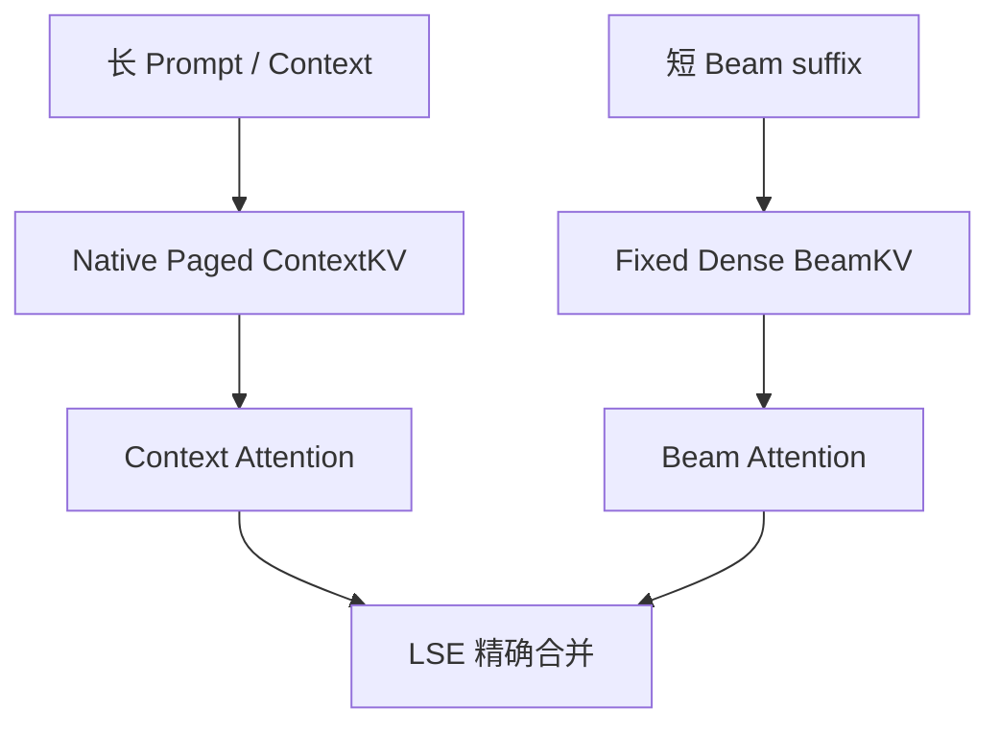
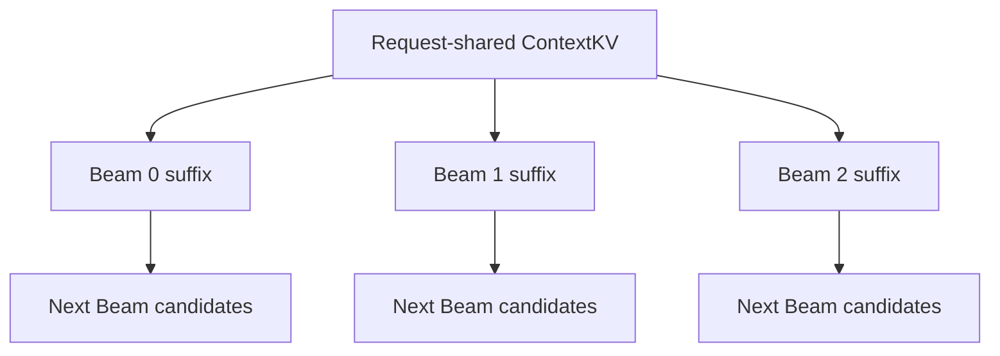
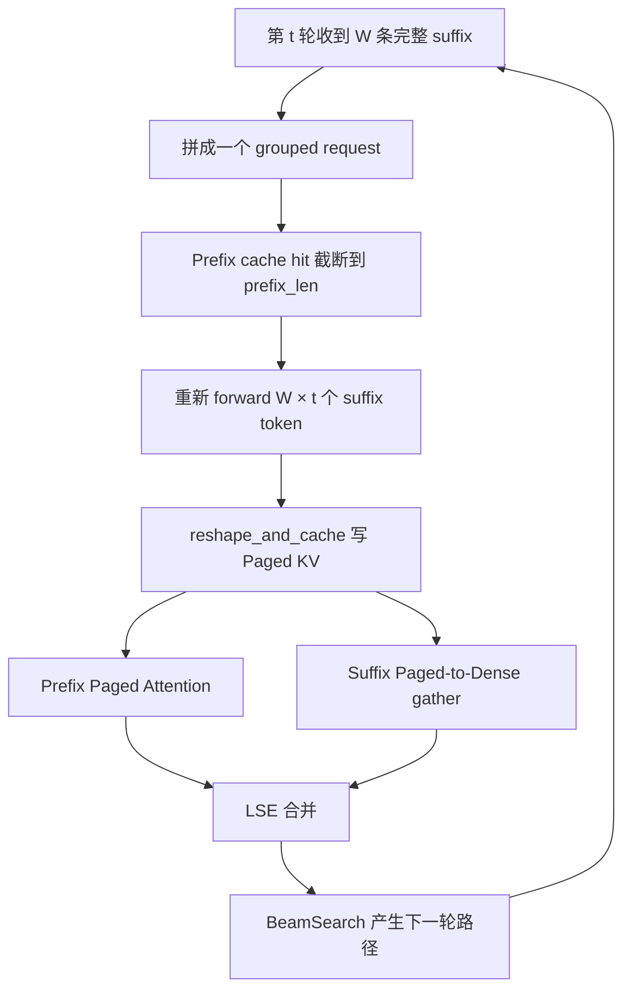
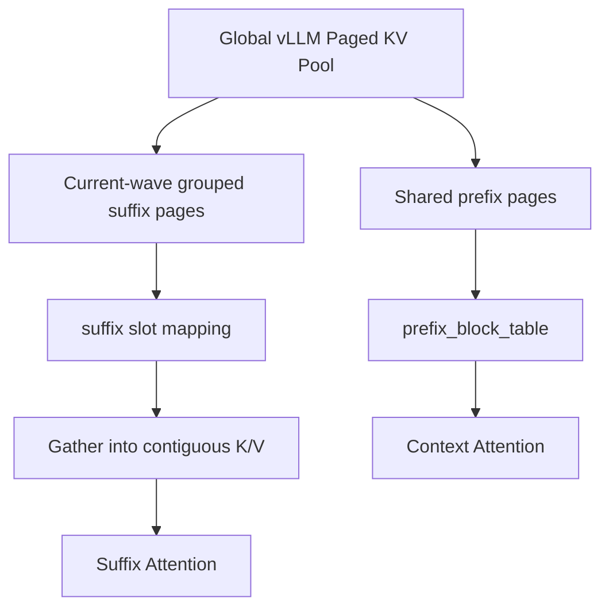
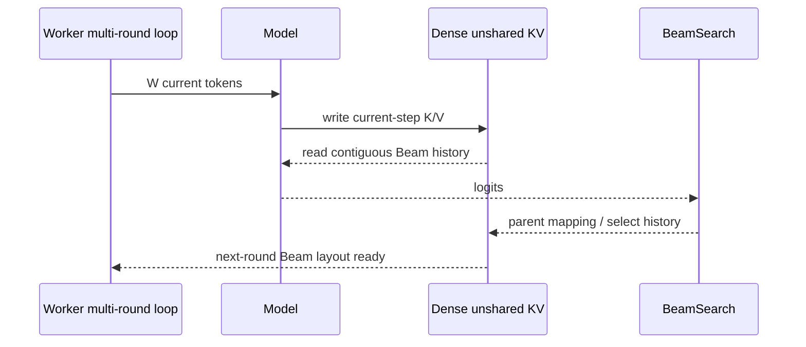
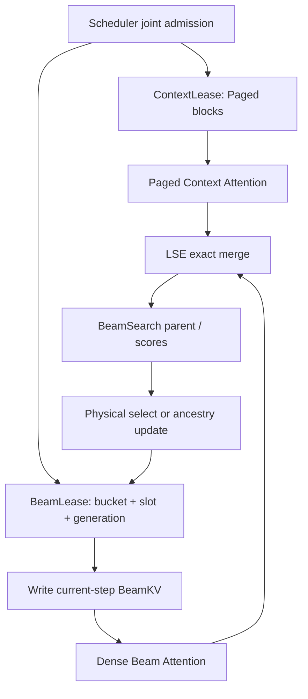
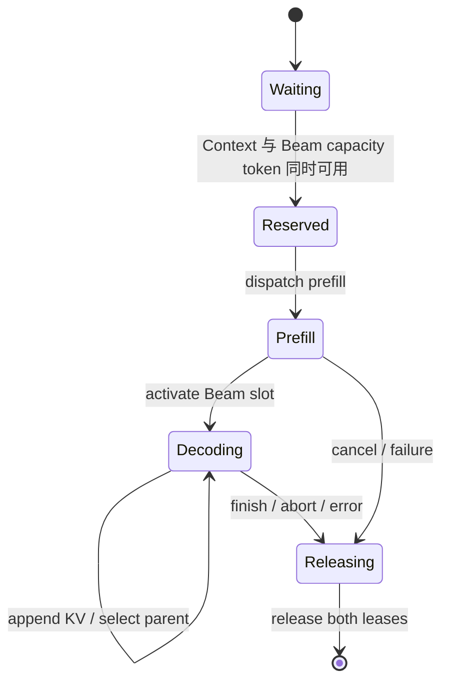
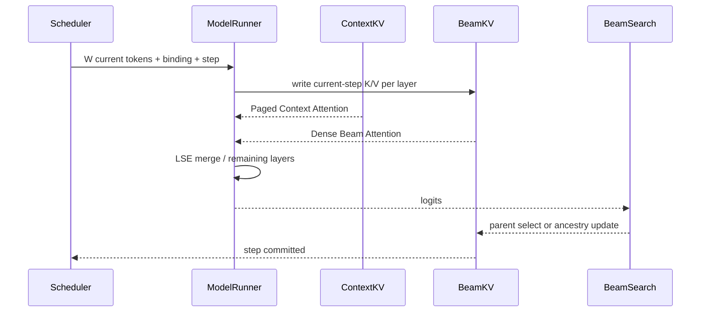

# vLLM-GR Beam Decode KV Buffer 组织方式与方案权衡

> 状态：Community Discussion Draft  
> 分析日期：2026-08-12  
> 主要范围：Beam decode 阶段 decoder self-attention KV 的申请、组织、读取、父子 Beam 更新、释放与 Graph 约束  
> 典型负载：Prompt 1K–10K、Beam width 64–512、Decode steps 2–5、MVP 固定 Beam width  
> 非目标：本文不重新定义 Beam ranking、Catalog 约束、EOS、返回协议，也不假设动态 Beam shrink/regrow 已进入 MVP。

## 目录

- [1. 结论摘要](#1-结论摘要)
- [2. 问题为什么值得单独讨论](#2-问题为什么值得单独讨论)
- [3. 当前 vLLM-GR main 的真实 KV 数据流](#3-当前-vllm-gr-main-的真实-kv-数据流)
- [4. 当前 Paged KV 方案的优点与问题](#4-当前-paged-kv-方案的优点与问题)
- [5. vLLM-GR decode_graph 的增量 BeamKV 进展](#5-vllm-gr-decode_graph-的增量-beamkv-进展)
- [6. xLLM OneRec 的 KV 组织](#6-xllm-onerec-的-kv-组织)
- [7. NVIDIA SID-GR 的 KV 组织](#7-nvidia-sid-gr-的-kv-组织)
- [8. 四种方案横向对比](#8-四种方案横向对比)
- [9. 推荐的 Hybrid KV 架构](#9-推荐的-hybrid-kv-架构)
- [10. BeamKV 逻辑布局与 Backend ABI](#10-beamkv-逻辑布局与-backend-abi)
- [11. Parent Beam 与 KV 历史的两种处理策略](#11-parent-beam-与-kv-历史的两种处理策略)
- [12. Pool 申请、Session 使用和资源释放](#12-pool-申请session-使用和资源释放)
- [13. 容量模型与 Scheduler Admission](#13-容量模型与-scheduler-admission)
- [14. CUDA Graph 与 ACL Graph 约束](#14-cuda-graph-与-acl-graph-约束)
- [15. 建议社区冻结的决策](#15-建议社区冻结的决策)
- [16. 分阶段实施建议](#16-分阶段实施建议)
- [17. 验证与 Benchmark](#17-验证与-benchmark)
- [18. 最终结论](#18-最终结论)
- [19. 代码与资料索引](#19-代码与资料索引)

---

## 1. 结论摘要

本文最重要的结论不是“Paged KV 好”或“Paged KV 不好”，而是：

> **ContextKV 和 BeamKV 的生命周期、共享关系和长度分布完全不同，应当采用不同的物理组织。**

推荐的 vLLM-GR 目标形态是：

- 长、共享、长度变化大的 Prompt/Context KV：继续使用 vLLM Native Paged KV；
- 只有 2–5 步、但 Beam width 可达 64–512 的 Beam suffix KV：使用固定地址 Dense BeamKV Pool；
- Scheduler 同时管理 Context block lease 和 Beam slot lease；
- 每轮只 forward 当前新增的 `W` 个 token；
- MVP 使用物理 KV select，优先复用现有连续 Attention；
- 长期使用 parent/ancestry index，避免搬运历史 BeamKV；
- GPU 和 NPU 统一逻辑语义，但允许不同物理 layout、stride 和算子 ABI。



需要特别澄清三点：

1. 当前 vLLM-GR 已把所有 Beam suffix 打包成一个 grouped request，suffix page 使用很紧凑；不能把问题描述为“每条 Beam 浪费一个 page”。
2. 当前主要损失来自每轮重建 grouped request、Beam suffix 不持久、历史 token 重算，以及 Paged-to-Dense gather，而不是 paging 机制本身必然导致重算。
3. Dense BeamKV 也不是零成本：它会按 `slot × W_bucket × T_max` 预留容量，必须进入 Scheduler admission 和显存规划。

---

## 2. 问题为什么值得单独讨论

### 2.1 GR Beam decode 与普通 LLM decode 不同

本文关注的负载具有以下特点：

| 维度 | 典型范围 | 对 KV 组织的影响 |
| --- | ---: | --- |
| Prompt length | 1K–10K | ContextKV 大，不能按 Beam 复制 |
| Beam width | 64–512 | Beam-private 状态很宽 |
| Decode steps | 2–5 | Beam 历史极短、容量上限明确 |
| Beam width 变化 | MVP 固定 | 首期不需要 shrink/regrow compaction |
| Batch | 首期聚焦 batch=1 | 接口仍需保留多 session slot 扩展 |

普通自回归 KV 是一条线性历史；Beam decode 是一棵共享 Prefix、随后分叉的短树：



因此合理的数据模型应显式区分：

| 状态类型 | 是否跨 Beam 共享 | 典型长度 | 推荐存储 |
| --- | --- | ---: | --- |
| Prompt self-KV | 是 | 1K–10K | Paged ContextKV |
| Encoder cross-attention KV（若模型存在） | 是 | 模型相关 | Request-shared ContextKV |
| Decode suffix self-KV | 否 | 2–5 | Dense BeamKV |
| Parent/score/token/finished mask | 否 | 2–5 | Device Beam state buffer |

本文主体讨论 decoder self-KV。若 OneRec 模型还包含 encoder cross-attention KV，它应随请求共享，不应增加 Beam 维。

### 2.2 评价 KV 方案不能只看显存

BeamKV 方案至少要同时评价：

- Transformer 重算 token 数；
- Context 是否真的只保存一份；
- KV 的动态分配、gather、copy 和地址稳定性；
- Parent Beam 是物理搬运还是逻辑寻址；
- Scheduler 能否做容量准入、抢占和异常清理；
- TP/PP 各 rank 的 slot 是否一致；
- CUDA Graph/ACL Graph 能否固定地址、shape、workspace 和控制流。

---

## 3. 当前 vLLM-GR main 的真实 KV 数据流

本节基于 `JiusiServe/vllm-gr` `main@6ece5a6` 和其固定的 vLLM `0.22.1` 依赖。

### 3.1 Beam suffix 被打包成一个 grouped request

第 `t` 轮，前端提交每条已选 Beam 的完整 suffix。EngineCore 将它们拼成一条逻辑 Request：

```text
prompt
+ beam-0 suffix[0:t]
+ beam-1 suffix[0:t]
+ ...
+ beam-(W-1) suffix[0:t]
```

这不是 `W` 条独立 paged sequence，而是一个 request-level block table 中的连续 suffix 区域。

直接结果是：

- Prompt 只保存一份；
- Beam suffix 在 page 中紧凑排列；
- Scheduler 只管理一个 grouped request，而不是 `W` 个 request；
- 但下一轮打包顺序和每段长度变化，当前 suffix KV 没有稳定的跨轮 Beam 语义。

### 3.2 每轮只复用 Prompt，完整 suffix 重新 forward

当前 Beam request 的 prefix cache hit 会被限制到 `prefix_len`。即使 flattened suffix 的某些 block hash 可以命中，执行路径也不会把它们作为下一轮 Beam history 复用。

因此第 `t` 轮会重新 forward `W × t` 个 suffix token。



### 3.3 Prefix 和 suffix 只有逻辑分区，没有物理 Pool 分区

当前两部分物理上仍位于同一个 Native Paged KV Pool：



其中 `beam_cache` 保存的是 CPU token、hash 和请求属性，不是设备 KV buffer。

### 3.4 KV 写入与 Attention 读取

每层执行大致为：

1. `reshape_and_cache` 按 slot mapping 将本轮 K/V 写入 Native Paged KV；
2. 多条 Beam query 通过相同的 `prefix_block_table` 读取共享 Prompt；
3. `extract_suffix_kv` 根据 suffix slot mapping 将 suffix K/V gather 到新建的 contiguous tensor；
4. 分别执行 Prefix Attention 和 Suffix Attention；
5. 使用两段 Attention 的 LSE 做数学上精确的合并。

这里的 LSE merge 不是简单相加两个 output。对于两个不相交的 KV 集合，需要根据各自的 log-sum-exp 归一化权重合并，才能与一次完整 Attention 等价。

### 3.5 Parent Beam 当前没有更新持久 KV

当前 `parent_beam_ids` / `child_beam_ids` 不会触发：

- block table fork；
- copy-on-write page；
- parent page remap；
- 独立 BeamKV reorder；
- 持久 BeamPath 更新。

Parent 关系体现在前端下一轮重新提交的完整 token 路径中。因此当前 Beam parent 更新发生在 token/score 语义层，不发生在持久 KV 层。

### 3.6 每轮与整个 Session 的计算量

设 `D` 为需要执行模型 forward 的 Beam decode 轮数。

当前总 suffix token forward 数为：

\[
N_{\text{current}}
= W(1+2+\cdots+D)
= W\frac{D(D+1)}{2}
\]

真正的增量 BeamKV 只需要：

\[
N_{\text{incremental}} = WD
\]

历史重算倍率为：

\[
\frac{N_{\text{current}}}{N_{\text{incremental}}}
= \frac{D+1}{2}
\]

| 场景 | 当前 token forward | 增量 BeamKV | 倍率 |
| --- | ---: | ---: | ---: |
| `W=64, D=2` | 192 | 128 | 1.5× |
| `W=128, D=3` | 768 | 384 | 2× |
| `W=512, D=5` | 7680 | 2560 | 3× |

这些历史 token 不只是重复生成 K/V；它们还会重新经过投影、MLP、Norm，并再次对 1K–10K Context 做 Attention。

因此不建议用 `O(W²t)` 概括整个 forward。KV 改造直接、可证明地消除的是每轮 `W × t` 历史 token 重算；Beam candidate ranking 的复杂度应另行分析。

---

## 4. 当前 Paged KV 方案的优点与问题

### 4.1 优点

#### Prompt 不随 Beam width 复制

理想 Prompt KV 占用近似为：

\[
M_{\text{context}}
= 2LPH_{kv}D_h \times bytes
\]

其中没有乘以 `W`。对 1K–10K Prompt，这是当前方案最重要的正确设计。

#### Grouped suffix 避免 per-Beam page 内碎片

假设 block size 为 16：

| 场景 | 每 Beam 独立分页 | 当前 grouped row |
| --- | ---: | ---: |
| `W=64, T=2` | 64 pages / 1024 slots | 8 pages / 128 slots |
| `W=512, T=5` | 512 pages / 8192 slots | 160 pages / 2560 slots |

所以不能用 `ceil(T/16)×16/T` 的浪费倍率批评当前 main；该倍率只适用于每条 Beam 单独分页的设计。

#### 直接继承 vLLM 的通用能力

当前方案继续获得：

- 全局 block admission；
- prefix cache；
- chunked prefill；
- 通用 preemption；
- 多请求 continuous batching；
- 统一 BlockTable / SlotMapping；
- Request finish 后的 block refcount/free。

这里继承的是单个内部 Request/current wave 的 vLLM preemption；它不等于 Beam session 已具备 Context lease、BeamKV 保存和恢复能力。

#### 内存按实际 W 和当前 step 使用

Paged KV 只为当前 wave 的实际 `W × t` token 分配 block，不需要永久为 `W_max × T_max` 预留 Dense slot。

### 4.2 主要问题

#### Beam suffix 没有跨轮持久语义

每轮重新拼接 grouped request，导致旧 suffix KV 无法作为稳定的 Beam history 被下轮直接复用。这是历史重算的根因。

#### 每层发生 Paged-to-Dense 数据搬运

当前执行链为：

```text
new K/V
-> reshape_and_cache to Paged KV
-> extract_suffix_kv to contiguous buffer
-> suffix FlashAttention
```

这增加一次完整 suffix KV 读写，并且当前 `extract_suffix_kv` 会动态创建输出 tensor。

#### Suffix cache entry 可能增加 Prefix Cache churn

Grouped request 会按 `prefix + flattened suffix` 参与完整 block hash/cache 更新；但下一轮 GR cache hit 又被主动截断到 `prefix_len`，不会复用这些 suffix block。于是已登记的 suffix cache entry 只会作为后续 eviction candidate，可能挤压更有价值的 Prompt prefix。这里的问题不是 page 内碎片，而是 cache policy 与 Beam suffix 生命周期不匹配。

#### 不利于 Decode Full Graph

以下动态因素都会扩大 Graph capture 难度：

- 每轮 token 数为 `W × t`；
- slot mapping 和 suffix mapping 动态构造；
- Paged-to-Dense 临时 buffer 动态分配；
- BeamSearch 与下一轮 token 路径仍依赖 Host；
- Graph 外 Parent/state transition 改变下一轮输入。

固定 BeamKV 地址只是 Full Graph 的必要条件，不是充分条件；仍需固定 workspace、shape bucket、控制流和设备侧状态。

#### Prompt 当前依赖 cache 命中，而不是显式 Session lease

Prefill 内部 Request 完成后，prefix block 可以进入 `ref_cnt=0` 的 cache/LRU 状态。`beam_cache` 保存 hash，但不持有物理 block lease。

在并发和内存压力下，理论上可能发生：

```text
prefill complete
-> prefix blocks become evictable
-> other requests reuse blocks
-> next Beam wave misses prefix
-> recompute Prompt
```

这不影响 correctness，但可能放大 10K Prompt 场景的 P99。目标架构需要明确的 Beam-session Context lease；这是演进建议，不是当前 main 已具备的保证。

#### Dense BeamKV 也有代价

独立 BeamKV 会引入第二类资源：

- 按最大 `W_bucket × T_max` 预留；
- 需要 Worker 物理 Pool 和 Scheduler 逻辑 slot 同步；
- 需要处理 finish、abort、exception、preemption；
- 需要在 Native Paged KV 吃完 HBM 之前完成显存预留。

因此目标不是“用 Dense 替换全部 Paged KV”，而是只把短 Beam suffix 从通用 Paged KV 中拆出。

---

## 5. vLLM-GR decode_graph 的增量 BeamKV 进展

`decode_graph@3b0dd1d` 已经开始实现推荐的物理拆分，但不能描述为 main 生产链已经切换完成。

### 5.1 已有的数据层组件

每层 `BeamAttentionPool` 预分配：

```text
K/V: [1, max_beams, local_num_kv_heads, max_decode_steps, head_dim]
```

`BeamSearchSession` 持有：

- 每层 BeamAttentionPool；
- `decode_step_buf`；
- `actual_shared_kvlen_buf`；
- `block_table_buf`；
- 固定 suffix scratch buffer；
- `begin_session / prepare_next_step / end_session` 生命周期。

已有算子语义包括：

- `cache_unshared_kv`：写当前 step K/V；
- `select_unshared_kv`：根据 Beam expansion group 复制 Parent 历史；
- fixed-address tensor 和 active view；
- duplicate parent 的 snapshot 语义测试。

当前 `decode_graph` 的 PyTorch reference 会 clone/gather 整个预分配 `T_max` 时间轴；这与目标 MVP“只复制 `0..current_step` 有效历史”的优化语义不同，不能混写成已经实现。

### 5.2 尚未形成 main 的端到端生产路径

当前状态需要区分：

- main 仍使用 grouped Paged suffix；
- `decode_graph` 具备 Pool、Session 和 operator 基础；
- 增量 Attention PR 已描述 Prefix Paged Attention + Beam Dense Attention 路径；
- 端到端 Task 3 调度、Session 激活、每轮输入 remap、异常清理和生产验证仍是独立集成工作。

因此社区讨论应把它称为“增量 BeamKV 原型/演进分支”，而不是已经发布的运行时行为。

### 5.3 当前原型值得继续讨论的点

- `[1, ...]` 与 `block_table=[0]` 只覆盖 batch=1 MVP；
- 固定 suffix scratch 消除了动态 allocation，但每层每轮仍有 Pool-to-Scratch copy；
- OneRec/NPU ABI 的 layout 不应直接成为所有 Backend 的物理布局；
- 当前 Session 是每 ModelRunner 一套固定资源，后续多请求需要 slot pool；
- BeamKV 预算必须在 Native KV block 数最终确定之前被预留或扣除。

---

## 6. xLLM OneRec 的 KV 组织

### 6.1 必须区分普通 OneRec 与 OneRec XAttention

xLLM 当前存在两种不同执行方式：

| 路径 | Decoder self-KV 行为 | 每轮输入 |
| --- | --- | ---: |
| 普通 OneRec | 不持久保存 Beam self-KV，后续轮重新跑增长后的完整 decoder 输入 | 完整历史 |
| OneRec XAttention / multi-round | Shared ContextKV + 固定 Dense unshared BeamKV | 当前 `W` 个 token |

所以不能把 shared/unshared KV 方案泛化成 xLLM 所有 OneRec 路径。

### 6.2 XAttention 的申请与生命周期

XAttention pipeline 构造时读取：

- `B_max`；
- 配置 Beam width `W`；
- `T = max_decode_rounds - 1`；
- local KV heads 和 head dimension。

然后为每层申请长期存在的 unshared K/V。NPU OneRec 路径可见的物理 shape 为：

```text
[B_max, W, Hkv_local, T, D]
```

请求进入时：

1. 切实际 `[0:B, 0:W]` active view；
2. 对 active view 执行 `zero_()`；
3. 为 Prompt shared self-KV 创建每层 `[N_shared, Hkv_local, D]`；
4. 整个 multi-round decode 在一次 worker invocation、同一 pipeline lane 内完成；
5. 请求结束后 unshared capacity 不释放，下一个请求复用同一 pipeline-local storage。

这是一种固定 pipeline lane，而不是 request-id 级的通用 page/slot allocator。

### 6.3 每轮写入与 Parent 物化

Round 0 完成 Prefill；Round `>0` 时，每个 Beam 只输入一个当前 token。

BeamSearch 产生 parent 之后，xLLM 调用 `select_unshared_kv`，把被选 Parent 的历史物理复制到新的 Beam slot，供下一轮直接连续读取。



证据边界需要说明：xLLM GitHub 主仓可以直接核验 `select_unshared_kv` 的调用和传入 fused XAttention block 的 unshared cache/current-round 参数；当前 step K/V 的精确写入 API 位于下层 fused ATB/XAttention 实现，不能仅凭主仓声称存在某个具名 `cache_unshared_kv` 调用。

### 6.4 优点

- 每轮只 forward `W` 个新 token；
- 下一轮 Beam history 已连续物化，Attention 逻辑简单；
- unshared KV 地址稳定，适合固定 shape 的图执行；
- Parent copy 对 `T<=5` 的 workload 容易实现和验证；
- Shared Prompt 没有 Beam 维。

### 6.5 局限

- 按 `B_max × W × T` 最坏容量预留；
- 单个 pipeline 的批内并发受 `B_max` 限制；若通过增加 worker/pipeline 实例扩展并行 lane，则每个实例都会复制一套最大容量 buffer；
- 每请求 active `zero_()` 产生额外写流量；
- Parent select 需要搬运所有层的历史 KV；
- NPU wrapper 当前存在逐轮 workspace 申请、stream synchronize、free 风险；
- 不提供通用请求级 slot lease、抢占、跨 lane 迁移或 prefix page reuse；
- 所有 rounds 必须 sticky 在同一个 pipeline invocation 中。

### 6.6 GPU/NPU layout 不能混为一个 ABI

xLLM 当前 OneRec NPU allocation 使用：

```text
[B, W, Hkv, T, D]
```

而仓内通用 CUDA XAttention cache kernel 的 contract 为：

```text
[B, W, T, Hkv, D]
```

因此公共架构应冻结逻辑轴和读写语义，而不是强制 GPU/NPU 使用同一个 stride 顺序。

当前公开 release 将 OneRec XAttention 支持限定在 NPU；仓内 CUDA XAttention cache kernel 可作为机制和 layout 参考，但不应表述为 OneRec CUDA 生产链已经接通。

---

## 7. NVIDIA SID-GR 的 KV 组织

NVIDIA `recsys-examples` 中的新服务化实现位于 `examples/sid-gr-inference`。它是与 OneRec 工作负载相近的 SID-GR/Qwen3 GR reference，不是 OpenOneRec 的原样实现。

### 7.1 ContextKV、BeamKV 和 BeamPath

新实现将三类对象设为一等公民：

| 对象 | 逻辑布局 | 含义 |
| --- | --- | --- |
| ContextKV | `[L, slot, context_len, Hkv, D]` | Request-shared 长 Context |
| BeamKV | `[L, slot, T_max, W_max, Hkv, D]` | Step-major Beam suffix |
| BeamPath | `parent[step, beam]` 等 | Beam lineage、token、score |

每个请求从 Dense pool 租一个 slot。每步只写：

```text
BeamKV[layer, slot, current_step, :active_width, :, :]
```

请求完成后立即归还 slot，物理 Pool 保留复用。

### 7.2 Parent 使用 ancestry index，而不是常规物理 reorder

固定 Beam width 下，BeamKV 保持 append-only。`BeamPath` 记录 Parent，Attention 构造 ancestry index：

```text
flat_index = decode_step * W + ancestor_beam
```

专用 kernel 据此为每个 query Beam 读取自己的祖先 KV。一个 Parent 可以被多个 Child 引用，不需要复制历史 KV。

只有动态缩 Beam 导致旧祖先 slot 超出新的 active width 时，才需要 history compaction。本文 MVP 固定 Beam width，因此不把 compaction 纳入第一阶段。

### 7.3 Dense Pool 与 CUDA Graph

新 serving 实现的价值不仅是避免 allocation，还包括：

- ContextKV/BeamKV pool 地址稳定；
- Decode Graph 可绑定 pool view；
- replay 时主要更新 token、step、topk/parent index；
- 请求 slot lease 明确；
- finish 后立即复用 slot。

### 7.4 不能整套照搬到 vLLM-GR

NVIDIA 当前 ContextKV 也是 Dense contiguous；其 page-backed ContextKV/native page table 仍属于 roadmap。

vLLM-GR 已拥有成熟的 Paged ContextKV、Prefix Cache 和 Scheduler，因此更合理的迁移是：

- 保留 vLLM Native Paged ContextKV；
- 借鉴 NVIDIA 的 Dense BeamKV、BeamPath、request slot lease 和 graph-friendly 数据模型。

旧的 `examples/sid_gr` 原型使用逐 step `torch.cat` 增长 BeamKV，更适合作为算法说明，不适合作为固定地址 serving 内存方案。

---

## 8. 四种方案横向对比

### 8.1 存储与生命周期

| 方案 | ContextKV | BeamKV | 申请粒度 | 生命周期 |
| --- | --- | --- | --- | --- |
| vLLM-GR main | Native Paged KV | Grouped suffix 仍进 Paged KV | token block | 每轮内部 Request |
| xLLM XAttention | Invocation-local shared Dense KV | Pipeline-local Dense unshared KV | worker/pipeline 最大容量 | 一次 multi-round invocation |
| NVIDIA SID-GR serving | Request slot Dense ContextKV | Request slot Dense BeamKV | request slot | 完整 generation |
| 推荐 vLLM-GR | Paged Context lease | Dense bucket Beam slot | context blocks + Beam slot | 完整 Beam session |

### 8.2 每步执行

| 方案 | 第 t 轮模型输入 | Parent 处理 | 额外 KV 数据移动 | Graph 特性 |
| --- | ---: | --- | --- | --- |
| vLLM-GR main | `W × t` | 重建 token path | 每层 Paged-to-Dense gather | 动态 token/mapping/buffer |
| xLLM XAttention | `W` | 物理 select | 复制 Beam 历史 | 地址稳定，select 路径仍需优化 |
| NVIDIA SID-GR | `W` | 逻辑 ancestry | 通常无历史 copy | Pool/BeamPath 适配专用 Graph |
| 推荐 MVP | `W` | 物理 select | 复制极短有效历史 | 可复用连续 suffix Attention |
| 推荐长期 | `W` | 逻辑 ancestry | 通常无历史 copy | 需要专用 dual-source Attention |

### 8.3 优化目标的准确归因

| 优化项 | 当前 Paged main | Dense incremental BeamKV 的收益 |
| --- | --- | --- |
| Prompt 共享 | 已实现 | 保持不变 |
| Grouped suffix page 利用率 | 已较高 | 不是主要收益 |
| 历史 token 重算 | 存在 | 消除 |
| Paged-to-Dense gather | 存在 | 可消除或变为简单固定 copy |
| 每轮动态 allocation | 存在 | 固定 Pool/Scratch 可消除 |
| Parent KV 语义 | 由完整 token 重建 | 显式 select 或 ancestry |
| Session 级容量 | Native blocks | 增加 Beam slot admission |
| Stable address | Native Pool 稳定，suffix view 动态 | Beam Pool/Scratch 稳定 |

---

## 9. 推荐的 Hybrid KV 架构

### 9.1 总体结构



### 9.2 建议的公共对象

控制面只传可序列化的资源句柄，不传 Tensor：

```python
ContextLease(
    request_id,
    block_ids,
    prefix_len,
    generation,
)

BeamKVBinding(
    request_id,
    bucket_id,
    slot_id,
    slot_generation,
    active_width,
    max_decode_steps,
)
```

Worker/ModelRunner 本地持有设备对象：

```python
BeamKVRuntimeState(
    binding,
    current_step,
    parent_table,
    token_buffer,
    score_buffer,
    finished_mask,
)
```

### 9.3 核心不变量

1. ContextKV 在 Beam decode 期间只读，并由 Beam session lease 持有；
2. BeamKV slot 在 session 内地址稳定；
3. 每层每步的新 K/V 只由模型 projection/cache operator 生成并写入一次；物理 Parent select 仍可以复制或覆盖已提交的历史区域；
4. 当前 token K/V 必须先写入，再参与当前层 Beam Attention；
5. Attention 只能读取 `0..current_step` 的已提交区域；
6. 未写区域即使包含上一个 request 的旧数据也不可见；
7. `slot_generation` 防止 slot 释放复用后的 stale handle/ABA；
8. replay 热路径不申请 Tensor 或 workspace；
9. finish、abort、timeout、exception 均幂等释放两类 lease；
10. Scheduler 同时检查 Context blocks、Beam slots 和 Graph/workspace bucket。

### 9.4 Context lease 的必要性

推荐在 Beam admission 时同时保证：

- Prompt 所需 Native KV blocks；
- 一个匹配 `W_bucket/T_max` 的 Beam capacity token 或物理 slot；
- 对应 Backend workspace/Graph capacity。

可选实现方式：

1. 在 KVCacheManager 增加显式 request/session lease；
2. 保留一个内部 anchor request 持有 prefix blocks；
3. 为 Beam session 单独记录并维护 block refcount。

第一种语义最清晰。无论采用哪种实现，都不应只依赖下一轮 hash 恰好命中。

---

## 10. BeamKV 逻辑布局与 Backend ABI

### 10.1 公共层冻结逻辑轴，不冻结物理 stride

公共语义建议统一为：

```text
logical BeamKV axes:
[layer, session_slot, step, beam, kv_head, head_dim]
```

Backend descriptor 至少包含：

```python
BeamKVLayout(
    layout_id,
    key,
    value,
    shape,
    strides,
    max_slots,
    max_beams,
    max_steps,
    local_num_kv_heads,
    head_dim,
)
```

### 10.2 三种可行物理布局

| 物理布局 | 优势 | 更适合 |
| --- | --- | --- |
| `[L, slot, T, W, H, D]` | 当前 step 的 W 路写入连续；flat index=`t×W+b` | NVIDIA 式 ancestry-index kernel |
| `[L, slot, W, T, H, D]` | 每条 Beam 的短历史连续；物理 reorder 简单 | GPU 连续 suffix Attention、xLLM CUDA 风格 |
| `[L, slot, W, H, T, D]` | 对齐特定 NPU operator ABI | 当前 OneRec/NPU 兼容路径 |

不存在对所有 Backend 都绝对最优的维序。

### 10.3 为什么当前固定 suffix scratch 仍有 copy

如果 Beam pool 的每条 Beam 预留 `T_max`，但当前只使用 `t+1`：

```text
pool[beam, 0:t+1]
```

把所有 Beam 直接 reshape 成 packed `[W×(t+1), H, D]` 时，各 Beam 之间可能存在未使用的 `T_max-(t+1)` gap。普通 packed varlen Attention 不一定能直接消费这种 stride，因此当前原型选择复制到固定 scratch。

这仍优于动态 Paged gather 的地方是：

- Pool 和 scratch 地址固定；
- 没有每轮 `torch.empty`；
- source address 规则；
- 后续可以替换为支持 stride 的专用 kernel。

但该 copy 仍是 `O(L×W×t×Hkv×D)` HBM 流量，应作为过渡方案单独计量，而不是宣称已经实现 zero-copy Beam Attention。

---

## 11. Parent Beam 与 KV 历史的两种处理策略

设 `W=4`，某轮选择得到：

```text
parent = [2, 0, 2, 1]
```

其中旧 Beam 2 同时产生两个 Child。

### 11.1 策略 A：物理 select/reorder

将旧 step-0 历史复制为：

```text
new step-0 slots = [K0[2], K0[0], K0[2], K0[1]]
```

这个 select 发生在本轮 K/V 已写入、Attention/BeamSearch 已完成之后，并把包含本轮在内的已提交历史准备成下一轮布局。随后下一轮输入 token 的 K/V 才写入下一个 step；不能把 Parent select 误放到本轮模型写入之前。

| 优点 | 缺点 |
| --- | --- |
| 下一轮每条 Beam 历史连续 | 每轮复制所有层的有效历史 |
| 可复用普通连续 Attention | copy bandwidth 随 `L×W×t` 增长 |
| 不需要专用 ancestry kernel | 需要 scratch/ping-pong 或安全 gather |
| `T<=5` 时容易实现和验证 | 动态宽度和多 slot 增加控制复杂度 |

不同实现的 copy 范围必须分开：

| 路径 | 可核验的 copy 范围 |
| --- | --- |
| vLLM-GR `decode_graph` PyTorch reference | clone/gather 整个预分配 `T_max` 时间轴 |
| xLLM OneRec NPU | 主仓只暴露 wrapper，底层 operator 的精确范围无法据此确认 |
| xLLM 通用 CUDA XAttention reference | 只遍历已提交的 `0..decode_step` |
| 推荐 MVP | 只复制有效历史，并将 bytes 纳入指标 |

注意：duplicate parent 意味着它不是普通 permutation。朴素 in-place reorder 可能先覆盖后续仍要读取的源数据，必须保证 snapshot 语义：

- 固定 ping-pong workspace；或
- 临时 snapshot/gather source；或
- 已证明支持一父多子的专用 operator。

如果下一步不会再 forward，最后一轮应跳过 select。

### 11.2 策略 B：逻辑 ancestry index

BeamKV 保持 append-only，只记录：

```text
parent[step] = [2, 0, 2, 1]
```

下一轮 Attention 反向追踪 Parent，并计算每个历史 step 的实际 KV index。

| 优点 | 缺点 |
| --- | --- |
| 历史 KV 不搬运 | 需要专用 Attention/kernel indexing |
| 一父多子天然共享 | irregular gather 更复杂 |
| 与 step-major BeamKV 自然匹配 | 动态 width 可能需要 compaction |
| Graph 中只更新小型 parent table | 通用 FlashAttention 不能直接照搬 |

### 11.3 推荐选择

| 阶段 | 推荐 | 原因 |
| --- | --- | --- |
| MVP | 物理 select | 对齐已有 OneRec operator 语义，复用连续 suffix Attention，正确性边界清楚 |
| 多 session/Full Graph | 固定 workspace 的设备 select | 消除 Python/per-layer dispatch 和动态 workspace |
| 长期专用 CUDA kernel | ancestry index | 消除历史 copy，接近 NVIDIA SID-GR 数据模型 |

当前 MVP 固定 Beam width，因此不把 dynamic shrink/regrow 和 history compaction 纳入第一阶段。

---

## 12. Pool 申请、Session 使用和资源释放

### 12.1 Pool、Capacity Reservation 与 Slot Activation

| 类型 | 发生时间 | 所有者 | 实际动作 |
| --- | --- | --- | --- |
| BeamKV 物理 Pool 申请 | Worker 初始化/warmup | Worker/ModelRunner | 创建设备 K/V Tensor、scratch、workspace |
| Beam capacity reservation | 请求 admission/Prefill 前 | Scheduler/BeamCapacityManager | 预留 bucket quota，保证 Prefill 后可进入 decode |
| Beam slot activation | Prefill 前（简单 MVP）或 Prefill 完成后 | Scheduler/Worker | 绑定 `bucket_id/slot_id/generation` 和稳定设备地址 |

请求结束时只释放逻辑 slot，物理 Tensor 继续存在。只有模型卸载、Worker shutdown 或 CachePlan 重配置时才销毁 Pool。

### 12.2 推荐状态机



`Reserved` 状态很重要：如果 Prefill 前完全不做 Beam capacity reservation，长 Prompt 完成后可能因没有 Beam slot 而持有大量 Context blocks 等待，形成资源滞留、反压或 starvation；没有循环等待证据时不应称为 deadlock。反过来，若在长 Prefill 开始前就占用物理 slot，slot 会在 Prefill 期间闲置。

推荐把两件事分开：Prefill 前预留可兑现的 Beam capacity token，Prefill 完成后再激活物理 slot。简单 MVP 可以直接提前绑定 slot，以换取更清晰的正确性；后续再用指标评估并拆分 reservation/activation。

### 12.3 单个 Decode Step 的时序



关键顺序：

1. 当前 token K/V 写入 current step；
2. 当前 token 可以看到 Context 和包含自己的 Beam history；
3. 所有层完成后执行 LM Head/BeamSearch；
4. 只有还存在下一次 forward 时才更新 Parent KV 布局；
5. Parent transition 完成后才能发布下一轮 Beam state。

### 12.4 正常路径不需要全量清零

只要满足以下不变量，slot 复用时无须 `zero_()` 整个 BeamKV：

- `current_step` 从 0 重新开始；
- 每个可见 step 在读取前被当前 request 覆盖；
- Attention 的有效长度严格限制到已提交区域；
- release/rebind 更新 `slot_generation`；
- debug reset 与正常 hot path 分离。

---

## 13. 容量模型与 Scheduler Admission

### 13.1 Dense BeamKV 物理容量

每个 rank 的 BeamKV reserved capacity 为：

\[
M_{\text{beam}}
= 2L_{\text{local}}N_{\text{slots}}W_{\text{bucket}}T_{\max}
H_{kv,\text{local}}D_h \times bytes
\]

其中：

- 系数 2 表示 K 和 V；
- TP 使用 local KV heads；
- PP 使用 local layers；
- `N_slots` 是真正允许并发 ACTIVE 的 Beam sessions；
- 这是 reserved bytes，不是当前 active bytes。

### 13.2 OneRec-1.7B 参考量级

按 28 层、8 KV heads、head dimension 128、BF16、TP=1 估算：

这些数值用于建立容量直觉，不替代运行时从实际 model config、TP/PP 切分和 dtype 推导并打印的显存预算。

| 配置 | 单 session BeamKV | 说明 |
| --- | ---: | --- |
| `W=64, T=2` | 约 14 MiB | 小宽度短 decode |
| `W=128, T=3` | 约 42 MiB | 当前 Task 1 常用参考配置 |
| `W=512, T=5` | 约 280 MiB | 最大典型配置 |

`W=128,T=3` 若再加一层等价的固定 K/V suffix scratch，长期 allocation 约为 43.5 MiB。

对应的理想 ContextKV（未计 page padding）为：

| Prompt length | 单请求 ContextKV |
| ---: | ---: |
| 1024 | 约 112 MiB |
| 10000 | 约 1.07 GiB |

这进一步说明：

- 长 Context 必须只保存一份并继续使用弹性的 Paged KV；
- Beam suffix 适合固定 Dense slot；
- 多 session slot 会线性放大 Beam reserved capacity，必须进入 admission。

### 13.3 Bucket 设计

建议至少按 Beam width 建立：

```text
W buckets = {64, 128, 256, 512}
T max     = service/model configured bound
```

实际利用率为：

\[
Utilization
= \frac{W_{active}T_{actual}}
       {W_{bucket}T_{max}}
\]

Dense pool 仍有 bucket padding，不应描述为零碎片。

### 13.4 联合 Admission

一个 Beam request 只有同时满足以下条件才能从 Waiting 进入 Reserved：

```text
native context blocks available
AND matching BeamKV bucket slot available
AND graph/workspace capacity available or eager fallback allowed
AND TP/PP ranks agree on the same logical slot
```

BeamKV、scratch 和 graph workspace 必须在 vLLM 最终计算 Native Paged KV `num_blocks` 之前预留，或从可用 KV bytes 中显式扣除。不能让 Native Paged KV 先吃完“剩余 HBM”，再额外申请 Beam Pool。

### 13.5 Preemption 建议

MVP 推荐 session-level preemption：

- 释放 Beam slot；
- 释放/降低 Context lease；
- 需要恢复时重新 Prefill/Decode；
- 暂不实现 BeamKV page swap。

Beam history 只有 2–5 步，给 BeamKV 增加细粒度 page/swap 状态机会显著增加复杂度，收益需要真实 workload 证明。

---

## 14. CUDA Graph 与 ACL Graph 约束

### 14.1 Stable pointer 只是必要条件

完整 Decode Graph 还需要：

- 固定或 bucketed input shape；
- 固定 BeamKV arena base；
- 固定 scratch/workspace；
- replay 内无 tensor allocation；
- device-resident `step/slot_ids/parent/score/token`；
- 无中间 D2H 同步；
- 无 Host-dependent Python branching；
- kernel topology 固定，或按 GraphKey 捕获；
- 明确 Graph miss 的 eager fallback 原因。

### 14.2 多 slot 时优先传 Pool base + slot IDs

如果每次把不同 slot slice 作为 Tensor view 传入 Graph，`data_ptr + storage_offset` 会随 slot 变化，可能导致：

- 每个 slot 捕获不同 Graph；
- pointer guard miss；
- 非连续 batch slots 回退 Eager。

长期更推荐 kernel 接收：

```text
fixed BeamKV arena base
+ device slot_ids[B]
+ device current_step
+ active_width / valid lengths
```

这样 Graph 绑定 Pool base，逻辑 request 到物理 slot 的变化由小型 device metadata 表达。

### 14.3 推荐 Graph 演进

| 阶段 | Graph 范围 | KV 行为 |
| --- | --- | --- |
| G0 | Attention/model piecewise | Pool/Scratch 地址稳定，Host 控制 Parent |
| G1 | 单 decode step model graph | 当前 `W` token 输入固定，Parent transition 图外 |
| G2 | Full step | Model + LM Head + Beam select + KV transition |
| G3 | Multi-step device loop | 中间 step 无 D2H，仅最终结果返回 Host |

GPU/NPU 可以共享 Graph contract，但不要求使用相同物理 BeamKV layout 或相同 operator 组合。

---

## 15. 建议社区冻结的决策

建议把“代码事实”“MVP 决策”“长期优化”分开讨论：

| 决策项 | 当前 main 事实 | MVP 建议 | 长期方向 |
| --- | --- | --- | --- |
| Context 存储 | Native Paged KV | Paged KV + Session lease | 保持 |
| Beam 存储 | Grouped Paged suffix | Dense bucket Pool | 保持 |
| 每轮输入 | `W×t` | `W` | `W` |
| Parent | 完整 token path 重建 | 物理 select | ancestry index |
| Beam width | 固定/请求提供 | 固定 | dynamic shrink/regrow |
| Pool ownership | 无独立 Beam Pool | 每 ModelRunner 长期 Pool | 多 session slot arena |
| Slot ownership | Native block only | Scheduler Beam binding | 联合多资源 admission |
| Preemption | vLLM Request 级 | 整 Session 释放/重算 | swap/restore（按需） |
| Layout | Paged backend layout | 冻结逻辑轴 | Backend-specific strides |
| Graph | suffix 动态 gather | single-step bucket | full-step/device loop |

### 15.1 建议优先回答的讨论问题

1. Beam session 是否必须持有 prefix block lease？
2. Beam slot 是在 Prefill 前 reservation，还是 Prefill 后才申请？
3. `BeamKVPool` 在统一显存计划中预留多少 slots、哪些 W buckets？
4. MVP 是否正式冻结固定 Beam width？
5. GPU MVP 采用 `[W,T,H,D]` 还是继续兼容 `[W,H,T,D]`？
6. 物理 select 是复制有效历史，还是为了 NPU ABI 复制完整 `T_max`？
7. duplicate parent 的 snapshot/ping-pong contract 如何冻结？
8. 多 rank 如何原子地 begin/select/release 同一逻辑 slot？
9. Graph 是按 slot view 捕获，还是改为 arena base + slot_ids？
10. legacy Paged suffix 的 fallback 条件和可观测原因是什么？

---

## 16. 分阶段实施建议

### Phase 1：batch=1 增量 BeamKV 正确性闭环

- 保留 Native Paged ContextKV；
- 增加 Beam session Context lease；
- 每 ModelRunner 一套固定 BeamKV/Scratch；
- 每轮只输入 `W` 个 token；
- 使用现有 OneRec-compatible `cache/select` 语义；
- duplicate parent 使用安全 snapshot；
- 最后一步跳过 select；
- 与 legacy grouped Paged path 做逐层/logits/E2E 对齐；
- 不承诺 Full Graph。

### Phase 2：多 session slot 与 Scheduler Admission

- 引入 `BeamCapacityManager`；
- 建立 W buckets 和 slot generation；
- Prefill 前联合 reservation；
- TP/PP slot 一致性和失败原子性；
- finish/abort/timeout/exception 幂等释放；
- reserved/active bytes 指标；
- 混合普通请求与 Beam 请求压力测试。

### Phase 3：Full-Step Graph

- 固定 arena base、scratch 和 workspace；
- device-resident step、slot_ids、tokens、scores、parent；
- 融合或设备化 LM Head 后处理；
- 消除中间 D2H；
- all-layer KV select 或纳入 Graph；
- GraphKey/bucket/fallback 指标。

### Phase 4：Ancestry-index Beam Attention

- 引入 append-only step-major BeamKV；
- parent table/BeamPath 常驻设备；
- 专用 Paged Context + Dense Beam 双源 Attention；
- 避免历史 BeamKV copy；
- 真实数据验证其相对固定 workspace select 的收益；
- 再考虑 dynamic shrink/regrow compaction。

---

## 17. 验证与 Benchmark

### 17.1 Correctness

- 每层 current K/V 写入位置；
- Prefix Attention、Suffix Attention 和 LSE merge；
- position id=`prefix_len + decode_step`；
- duplicate parent、一父多子、identity 和 reorder；
- 最后一步跳过 select；
- Session reuse 不读取旧 request 数据；
- TP/PP rank 的 slot/step/generation 一致；
- legacy fallback 输出一致；
- abort/error 后无 slot 或 Context lease 泄漏。

### 17.2 性能指标

至少记录：

| 指标 | 目的 |
| --- | --- |
| Forwarded Beam tokens | 验证从 `WD(D+1)/2` 降到 `WD` |
| Paged-to-Dense gather bytes | 量化 legacy suffix gather |
| Pool-to-Scratch bytes | 量化增量 MVP 的过渡 copy |
| Parent select copy bytes | 量化物理 reorder 成本 |
| Per-step allocation count | 验证 Graph 热路径无 allocation |
| Beam pool reserved/active bytes | 观察 bucket 内碎片 |
| Prefix eviction/recompute count | 验证 Context lease 价值 |
| Graph replay/fallback ratio | 定位 shape/pointer/workspace miss |
| P50/P99 latency | 关注长 Prompt 的 tail latency |
| Throughput/QPS | 验证多请求容量利用率 |

### 17.3 测试矩阵

```text
Prompt length = {1K, 5K, 10K}
Beam width    = {64, 128, 256, 512}
Decode steps  = {2, 3, 5}
Batch/session = {1, multi-slot capacity}
Execution     = {legacy, incremental eager, graph}
```

测试时应固定模型、硬件、dtype、batch 形成方式和约束生成配置。NVIDIA SID-GR 或 xLLM 的公开性能数字只能作为方向性参考，不能与 vLLM-GR 做不受控的直接横向结论。

---

## 18. 最终结论

当前 vLLM-GR main 的 Paged KV 方案是一个合理的兼容性基线：

- Prompt 共享正确；
- grouped suffix page 利用率高；
- 继承 vLLM 成熟的调度、Prefix Cache 和 block 生命周期；
- 普通请求、Beam 请求和变长 Context 更容易混部。

但它不适合作为 OneRec Beam decode 的最终热路径：

- Beam suffix 不跨轮持久；
- `D=5` 时历史 token forward 达到增量方案的 3 倍；
- 每层存在 Paged-to-Dense gather 和动态输出 buffer；
- Parent 关系不进入持久 KV 数据模型；
- Prefix 只有 cache hash，没有明确的 Beam-session lease；
- 不利于固定地址、固定 shape 的 Full-Step Graph。

xLLM 提供了“Shared Context + Dense unshared BeamKV + 物理 select”的可行实现参考；NVIDIA SID-GR 展示了“Dense BeamKV + BeamPath/ancestry index + request slot lease”的长期形态。

因此建议社区冻结的主方向是：

> **Native Paged KV 负责长且共享的 Context；固定 Dense BeamKV 负责极短且分叉的 suffix；Scheduler 同时管理 Context lease 和 Beam slot；MVP 物理 select，长期 ancestry index。**

---

## 19. 代码与资料索引

### 19.1 分析快照

- vLLM-GR main：[`6ece5a625d406ca298e9549f6975c7d1e4631447`](https://github.com/JiusiServe/vllm-gr/commit/6ece5a625d406ca298e9549f6975c7d1e4631447)
- vLLM-GR decode_graph：[`3b0dd1d9642da33063034f5d2779437b3ba51e4a`](https://github.com/JiusiServe/vllm-gr/commit/3b0dd1d9642da33063034f5d2779437b3ba51e4a)
- xLLM main：[`cd167a6aca8b4de200a1e7ab76b105cf102e7b72`](https://github.com/xLLM-AI/xllm/commit/cd167a6aca8b4de200a1e7ab76b105cf102e7b72)
- NVIDIA recsys-examples main：[`9a3bf5df169969b71defdced0cc29079fe897064`](https://github.com/NVIDIA/recsys-examples/commit/9a3bf5df169969b71defdced0cc29079fe897064)

### 19.2 vLLM-GR main

- [Grouped Beam request 构造](https://github.com/JiusiServe/vllm-gr/blob/6ece5a625d406ca298e9549f6975c7d1e4631447/vllm_gr/v1/engine/core.py#L179-L230)
- [Prefix cache hit 截断到 prefix_len](https://github.com/JiusiServe/vllm-gr/blob/6ece5a625d406ca298e9549f6975c7d1e4631447/vllm_gr/v1/engine/engine_core_patch.py#L196-L214)
- [Beam position/input remap](https://github.com/JiusiServe/vllm-gr/blob/6ece5a625d406ca298e9549f6975c7d1e4631447/vllm_gr/v1/worker/model_runner_common.py#L75-L124)
- [Paged KV 写入](https://github.com/JiusiServe/vllm-gr/blob/6ece5a625d406ca298e9549f6975c7d1e4631447/vllm_gr/v1/attention/backends/beam_attn.py#L152-L191)
- [Prefix/Suffix Attention 与 LSE merge](https://github.com/JiusiServe/vllm-gr/blob/6ece5a625d406ca298e9549f6975c7d1e4631447/vllm_gr/v1/attention/backends/beam_attn_gpu.py#L117-L191)
- [Paged-to-Contiguous suffix gather](https://github.com/JiusiServe/vllm-gr/blob/6ece5a625d406ca298e9549f6975c7d1e4631447/vllm_gr/v1/attention/backends/beam_attn_triton.py#L81-L151)
- [vLLM 0.22.1 KV block free/cache behavior](https://github.com/vllm-project/vllm/blob/v0.22.1/vllm/v1/core/single_type_kv_cache_manager.py#L338-L353)

### 19.3 vLLM-GR incremental decode 讨论与原型

- [Incremental Decode RFC #248](https://github.com/JiusiServe/vllm-gr/issues/248)
- [Task 1 KV Pool/Session/Operator RFC #250](https://github.com/JiusiServe/vllm-gr/issues/250)
- [Incremental Beam Attention PR #258](https://github.com/JiusiServe/vllm-gr/pull/258)
- [BeamAttentionPool](https://github.com/JiusiServe/vllm-gr/blob/3b0dd1d9642da33063034f5d2779437b3ba51e4a/vllm_gr/v1/beam/beam_attention_pool.py#L20-L80)
- [BeamSearchSession](https://github.com/JiusiServe/vllm-gr/blob/3b0dd1d9642da33063034f5d2779437b3ba51e4a/vllm_gr/v1/beam/beam_search_session.py#L31-L213)
- [cache_unshared_kv](https://github.com/JiusiServe/vllm-gr/blob/3b0dd1d9642da33063034f5d2779437b3ba51e4a/vllm_gr/ops/cache_unshared_kv.py#L87-L139)
- [select_unshared_kv](https://github.com/JiusiServe/vllm-gr/blob/3b0dd1d9642da33063034f5d2779437b3ba51e4a/vllm_gr/ops/onerec_decode.py#L93-L174)

### 19.4 xLLM OneRec/XAttention

- [OneRec pipeline selection](https://github.com/xLLM-AI/xllm/blob/cd167a6aca8b4de200a1e7ab76b105cf102e7b72/xllm/core/util/rec_model_utils.h#L33-L87)
- [Unshared KV allocation、active view 与 select](https://github.com/xLLM-AI/xllm/blob/cd167a6aca8b4de200a1e7ab76b105cf102e7b72/xllm/core/runtime/rec_worker_impl.cpp#L1021-L1159)
- [Shared KV 创建](https://github.com/xLLM-AI/xllm/blob/cd167a6aca8b4de200a1e7ab76b105cf102e7b72/xllm/core/runtime/rec_worker_impl.cpp#L1175-L1274)
- [Multi-round decode loop](https://github.com/xLLM-AI/xllm/blob/cd167a6aca8b4de200a1e7ab76b105cf102e7b72/xllm/core/runtime/rec_worker_impl.cpp#L1681-L1953)
- [NPU select_unshared_kv wrapper](https://github.com/xLLM-AI/xllm/blob/cd167a6aca8b4de200a1e7ab76b105cf102e7b72/xllm/core/kernels/npu/xllm_ops/select_unshared_kv.cpp#L38-L130)
- [CUDA XAttention cache layout contract](https://github.com/xLLM-AI/xllm/blob/cd167a6aca8b4de200a1e7ab76b105cf102e7b72/xllm/core/kernels/cuda/xattention/decoder_reshape_and_cache.cu#L48-L138)
- [OneRec cross-attention KV](https://github.com/xLLM-AI/xllm/blob/cd167a6aca8b4de200a1e7ab76b105cf102e7b72/xllm/core/layers/npu/npu_onerec_block_layer_impl.cpp#L1328-L1343)
- [OneRec XAttention 的 NPU release scope](https://github.com/xLLM-AI/xllm/blob/cd167a6aca8b4de200a1e7ab76b105cf102e7b72/RELEASE.md#L107)

### 19.5 NVIDIA SID-GR

- [SID-GR inference README 与当前状态](https://github.com/NVIDIA/recsys-examples/blob/9a3bf5df169969b71defdced0cc29079fe897064/examples/sid-gr-inference/README.md#L99-L150)
- [BeamKV layout](https://github.com/NVIDIA/recsys-examples/blob/9a3bf5df169969b71defdced0cc29079fe897064/examples/sid-gr-inference/src/gr_inference/gr_kv/beam_kv.py)
- [ContextKV layout](https://github.com/NVIDIA/recsys-examples/blob/9a3bf5df169969b71defdced0cc29079fe897064/examples/sid-gr-inference/src/gr_inference/gr_kv/context_kv.py)
- [Dense BeamKV/ContextKV pools 与 slot lease](https://github.com/NVIDIA/recsys-examples/blob/9a3bf5df169969b71defdced0cc29079fe897064/examples/sid-gr-inference/src/gr_inference/gr_serving/memory.py#L625-L847)
- [Batched ancestry indices](https://github.com/NVIDIA/recsys-examples/blob/9a3bf5df169969b71defdced0cc29079fe897064/examples/sid-gr-inference/src/gr_inference/gr_runtime/batched_topk_indices.py#L14-L125)
- [Dynamic Beam history compaction](https://github.com/NVIDIA/recsys-examples/blob/9a3bf5df169969b71defdced0cc29079fe897064/examples/sid-gr-inference/src/gr_inference/gr_runtime/beam_kv_compaction.py)
- [Decode CUDA Graph direct pool view](https://github.com/NVIDIA/recsys-examples/blob/9a3bf5df169969b71defdced0cc29079fe897064/examples/sid-gr-inference/src/gr_inference/gr_serving/decode_cuda_graph.py#L126-L425)
- [Page-backed ContextKV roadmap](https://github.com/NVIDIA/recsys-examples/blob/9a3bf5df169969b71defdced0cc29079fe897064/examples/sid-gr-inference/README.md#L486-L501)

### 19.6 本仓库相关文档

- [BeamKV Cache 架构、数据流与容量调度设计](./beam_kv_cache_architecture_and_scheduling_design.md)
- [Beam Incremental Decode 统一架构设计](./beam_incremental_decode_unified_architecture_design.md)
- [BeamSearch CUDA Graph Profiling 时间线分析](./beam_search_cuda_graph_profiling_timeline_analysis.md)
