# vLLM-GR Beam Decode KV Buffer：现状、对比与推荐方案

> 状态：Community Discussion Draft  
> 更新日期：2026-08-12  
> 范围：Beam decode 的 decoder self-KV；不讨论 Beam ranking、Catalog 约束和动态 Beam width  
> 负载：Prompt 1K–10K，Beam width 64–512，Decode steps 2–5  
> vLLM-GR 快照：`main@6ece5a6` / `decode_graph@3b0dd1d`  
> 对照快照：xLLM `cd167a6` / NVIDIA `9a3bf5d`

---

## 1. 一页结论

核心判断：

- 长且共享的 Prompt KV：继续使用 Native Paged KV。
- 短且分叉的 Beam suffix KV：使用固定地址 Dense BeamKV。
- 每轮只 forward 当前新增的 `W` 个 token。
- MVP 用物理 select；长期可演进到 ancestry index。
- Scheduler 同时管理 Context lease 和 Beam slot。

> 图 1：推荐架构的控制面与数据面

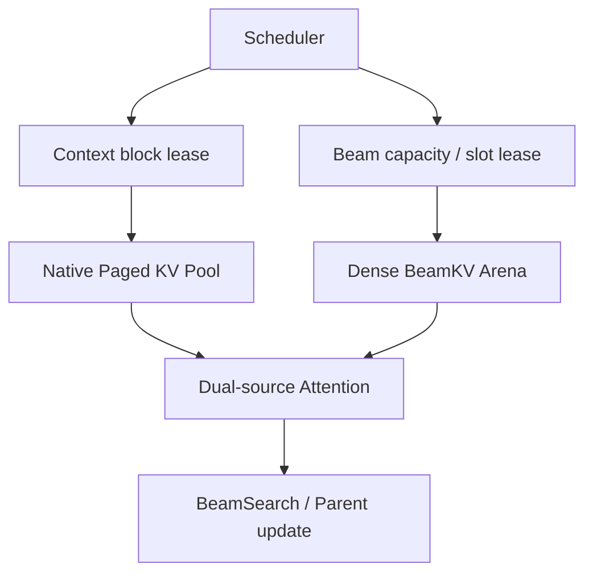

这不是“Paged KV 全部替换成 Dense KV”。只拆出极短的 Beam suffix。

| 数据 | 是否共享 | 长度 | 推荐组织 |
| --- | --- | ---: | --- |
| Prompt KV | 所有 Beam 共享 | 1K–10K | Paged |
| Beam suffix KV | 当前 step 分叉；历史可复制/共享 | 2–5 | Dense |
| Parent / score / token | 每条 Beam 独立 | 2–5 | Device state |

---

## 2. 当前 vLLM-GR main：好在哪里，慢在哪里

### 2.1 每轮重新提交完整 suffix

当前 main 把所有 Beam suffix 拼成一个 grouped request。它不是 `W` 条独立请求。

> 图 2：Prefill 后的 Beam request 重建

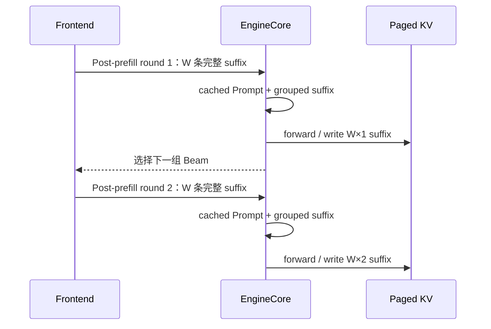

Prompt 可以命中 Prefix Cache；旧 Beam suffix 不作为持久历史复用。

### 2.2 grouped row 很紧凑，但位置会变化

> 图 3：flatten 后的 Beam 位置随 step 改变

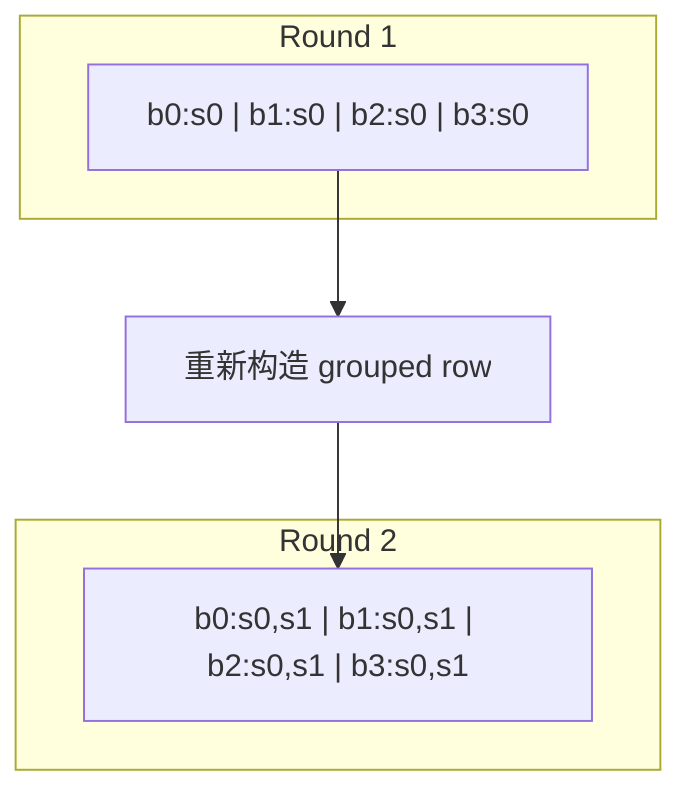

因此要把问题说准确：

- 好处：suffix page 紧凑，不是“每条 Beam 浪费一个 page”。
- 问题：跨轮没有稳定的 BeamKV slot 和 Parent 语义。

### 2.3 单层 Attention 还要做一次 gather

> 图 4：当前单层数据流

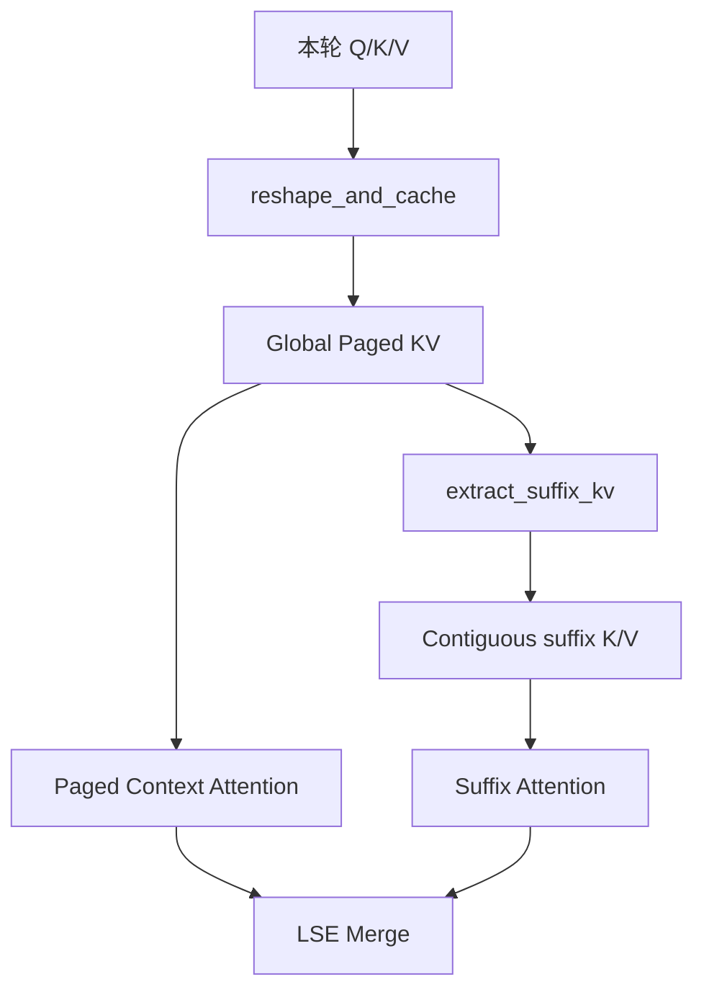

热路径代价：

- 历史 suffix token 重新 forward；
- Paged suffix 再 gather 成 contiguous K/V；
- suffix tensor 和 mapping 随轮次变化；
- Full Graph 更难固定 shape、地址和 workspace。

### 2.4 Prefix Cache 不等于 Session lease

每个内部 request 结束后，Prompt block 的 ref 可归零并受 LRU eviction 管理。
下一轮仍可按 hash 命中，但这不是显式 Session lease。
正确性不受影响，长 Prompt 的 P99 可能被放大。

### 2.5 重算量

```text
R = Prefill 之后的 BEAM_REQUEST 轮数

current_tokens     = W × R × (R + 1) / 2
incremental_tokens = W × R
replay_ratio       = (R + 1) / 2
```

若服务把 Prefill 产生的首层也计入总深度 `D`，则 `R = D - 1`。

> 图 5：每轮 forward 的 suffix token

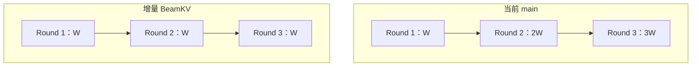

| Post-prefill rounds `R` | 当前 / 增量 |
| ---: | ---: |
| 1 | 1× |
| 2 | 1.5× |
| 3 | 2× |
| 5 | 3× |

### 2.6 main 与 decode_graph 分支

| 路径 | 当前状态 |
| --- | --- |
| `main` | grouped suffix 进入 Paged KV，跨轮重算 |
| `decode_graph` | 已有 Beam pool、Session、cache/select operator |
| 端到端集成 | 仅有 prototype/operator/tests，尚未接入 E2E runtime |

---

## 3. xLLM：Dense BeamKV + 物理 Parent select

xLLM 必须区分两条路径：

- 普通 OneRec：后续轮重新跑完整 decoder 历史；
- OneRec XAttention：Shared Context + persistent unshared BeamKV。

> 图 6：XAttention 的 multi-round loop

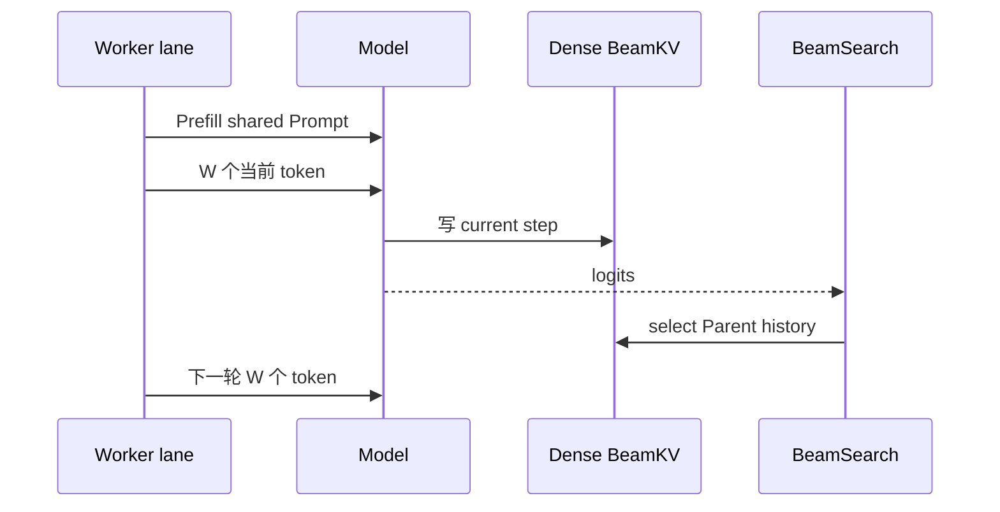

可见的 NPU OneRec layout：

`[B_max, W, Hkv_local, T, D]`

它是 pipeline-local 固定容量，不是通用 request page allocator。

> 图 7：物理 select，Parent = [2, 0, 2, 1]

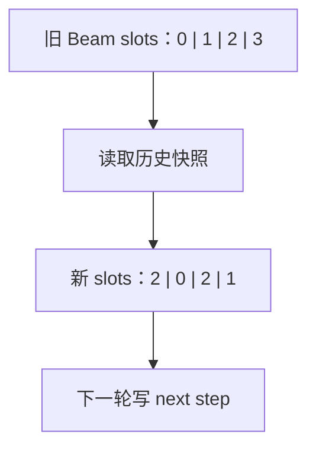

关键点：

- 一父多子会复制同一 Parent；
- 不能做有覆盖风险的朴素 in-place reorder；
- `T<=5` 时实现简单；
- 仍需继续 decode 的中间轮会产生历史 KV copy；
- 当前 NPU wrapper 每次 select 还有 workspace 申请、同步和释放。

> 证据边界：xLLM 主仓可核验 `select_unshared_kv`；NPU fused operator 内部的精确写入和 copy 范围不在该仓展开。

---

## 4. NVIDIA SID-GR：Dense Pool + 逻辑 BeamPath

NVIDIA 新 serving 实现将 ContextKV、BeamKV 和 BeamPath 分开管理。

请求从 Dense pool lease 一个 Beam slot；decode 结束后归还，物理 Pool 保留复用。

BeamKV 采用 step-major 逻辑布局：

`[layer, slot, step, beam, kv_head, head_dim]`

每步只 append 当前 `W` 路 K/V。

> 图 8：逻辑 ancestry，Parent = [2, 0, 2, 1]

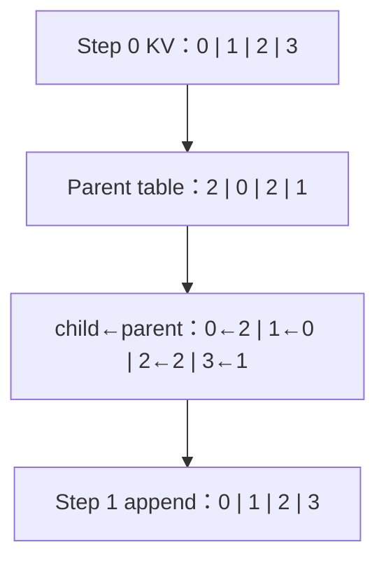

固定 Beam width 下通常不搬历史 KV。动态 shrink 才可能触发 compaction。

需要避免两个误解：

- NVIDIA 当前 serving 的 ContextKV 仍是 Dense pool；
- page-backed ContextKV/native page table 仍属于 roadmap。

---

## 5. 三种 Parent/history 路径

| 方案 | 每轮输入 | Parent 更新 | BeamKV 生命周期 |
| --- | ---: | --- | --- |
| vLLM-GR main | `W×t` | token path 重建 | 单个内部 request |
| xLLM XAttention | `W` | 物理复制 | pipeline invocation |
| NVIDIA SID-GR | `W` | 逻辑索引 | request slot |
| 推荐 MVP | `W` | 物理复制有效历史 | Beam session |
| 推荐长期 | `W` | 逻辑 ancestry | Beam session |

### 5.1 两种 Parent 策略怎么选

| | 物理 select | Ancestry index |
| --- | --- | --- |
| Attention | 可复用连续实现 | 需要专用索引 |
| 数据移动 | 复制有效历史 | 通常不复制 |
| 一父多子 | 需要 snapshot 语义 | 天然共享 |
| 建议 | MVP | 长期优化 |

当前 `decode_graph` 的 PyTorch reference 会 clone/gather 整个 `T_max`。目标 MVP 应只复制 `0..current_step`。

---

## 6. 推荐的 vLLM-GR Hybrid KV

### 6.1 所有权

总体所有权见图 1。

职责边界：

- Scheduler：准入、lease、释放、异常清理；
- Worker：预分配 BeamKV Arena 和固定 workspace；
- Attention：Paged Context + Dense Beam 两路读取；
- BeamSearch：更新 Parent，不拥有 KV 内存。

### 6.2 单个增量 step

> 图 9：推荐执行顺序

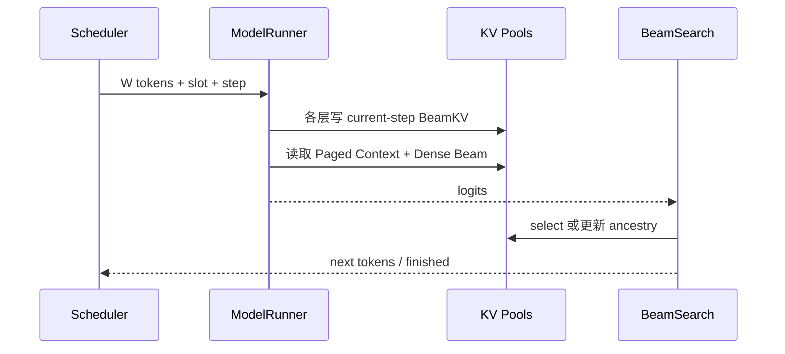

顺序约束：

1. 本轮新 K/V 先写 current step；
2. 当前 query 能看到 Context 和自己的 Beam history；
3. BeamSearch 后才做 Parent transition；
4. 最后一轮跳过无用的 Parent reorder。

### 6.3 Layout

公共逻辑轴只冻结语义：

`[layer, session, step, beam, kv_head, head_dim]`

GPU/NPU 可以使用不同 stride：

| Backend 偏好 | 示例 layout |
| --- | --- |
| step-major ancestry | `[L,S,T,W,H,D]` |
| Beam history contiguous | `[L,S,W,T,H,D]` |
| 特定 NPU operator | `[L,S,W,H,T,D]` |

不要把某个 Backend 的物理维序写死成公共 ABI。

---

## 7. Admission、容量与 Graph

### 7.1 Reservation 不等于 Activation

> 图 10：请求资源生命周期

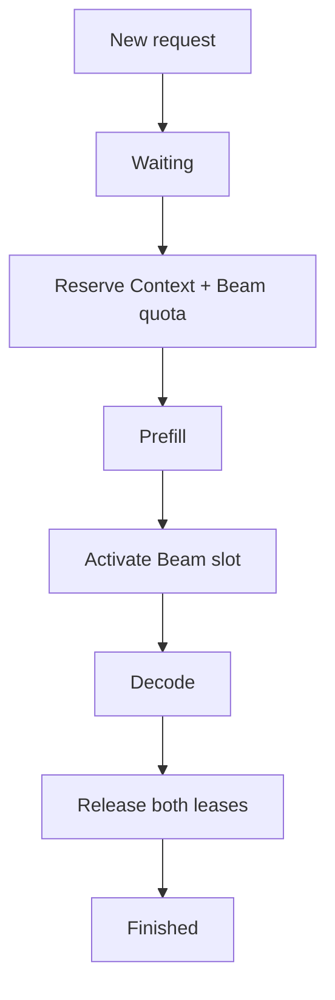

Prefill 前完全不预留 Beam capacity，可能在 Prefill 后持有大量 Context blocks 等 slot。  
Prefill 前长期占住物理 slot，又会让 slot 空闲。

建议：

- Prefill 前 reserve 可兑现的 capacity token；
- Prefill 完成后 activate 物理 slot；
- MVP 可以先直接 reserve slot，换取简单正确。

### 7.2 容量

```text
beam_bytes =
  2 × local_layers × slots × W_bucket × T_max
    × local_kv_heads × head_dim × dtype_bytes
```

假设 28 层、8 KV heads、head dim 128、BF16、TP=1：

| `W × T` | 单 slot BeamKV |
| ---: | ---: |
| `64 × 2` | 约 14 MiB |
| `128 × 3` | 约 42 MiB |
| `512 × 5` | 约 280 MiB |

这些是容量直觉。实际值必须从 model config、TP/PP 和 dtype 推导。

### 7.3 Graph 条件

Full Graph 需要同时满足：

- BeamKV、scratch、workspace 地址稳定；
- shape 按 `W/T` bucket 固定；
- step、slot、Parent、token 常驻 device；
- replay 内无 tensor allocation；
- 无中间 D2H 和 Python 分支；
- Graph miss 有明确 eager fallback。

多 slot 推荐传固定 Arena base + device `slot_ids`，不要为每个 slot 捕获一张图。

---

## 8. 社区需要冻结什么

### 8.1 建议决策

- [ ] Context 是否在整个 Beam session 内持有 block lease？
- [ ] MVP 是否冻结固定 Beam width？
- [ ] MVP Parent 是否采用“复制有效历史”的物理 select？
- [ ] Beam width buckets 采用 `64/128/256/512` 吗？
- [ ] 公共 ABI 是否只冻结逻辑轴和 stride descriptor？
- [ ] Prefill 前 reserve capacity，何时 activate 物理 slot？
- [ ] 多 rank 的 slot reserve/release 如何保证原子性？
- [ ] GraphKey 是否包含 `W bucket / T / layout / slot mode`？
- [ ] legacy grouped Paged suffix 的 fallback 条件是什么？

### 8.2 落地顺序

> 图 11：从增量 BeamKV 到 Full Graph / Ancestry

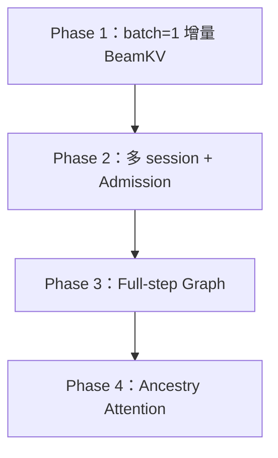

| Phase | 只做什么 |
| --- | --- |
| 1 | Paged Context + 单 slot Dense BeamKV + 物理 select |
| 2 | bucket pool、generation guard、多 rank 一致性 |
| 3 | 固定 workspace、device Beam state、Full-step Graph |
| 4 | step-major BeamKV、BeamPath、专用 dual-source Attention |

### 8.3 最少验证指标

- Forwarded Beam tokens：是否从 `W×R(R+1)/2` 降到 `W×R`；
- Paged-to-Dense gather bytes；
- Parent select copy bytes；
- 每 step allocation count；
- Beam pool reserved / active bytes；
- Prefix eviction / recompute count；
- Graph replay / fallback ratio；
- P50 / P99 / QPS。

---

## 9. 代码证据

### vLLM-GR main @ `6ece5a6`

- [Grouped request 构造](https://github.com/JiusiServe/vllm-gr/blob/6ece5a625d406ca298e9549f6975c7d1e4631447/vllm_gr/v1/engine/core.py#L179-L230)
- [Prefix hit 截断到 prefix_len](https://github.com/JiusiServe/vllm-gr/blob/6ece5a625d406ca298e9549f6975c7d1e4631447/vllm_gr/v1/engine/engine_core_patch.py#L196-L214)
- [Beam input / position remap](https://github.com/JiusiServe/vllm-gr/blob/6ece5a625d406ca298e9549f6975c7d1e4631447/vllm_gr/v1/worker/model_runner_common.py#L75-L124)
- [Prefix/Suffix Attention 与 LSE merge](https://github.com/JiusiServe/vllm-gr/blob/6ece5a625d406ca298e9549f6975c7d1e4631447/vllm_gr/v1/attention/backends/beam_attn_gpu.py#L117-L191)
- [Paged-to-Contiguous suffix gather](https://github.com/JiusiServe/vllm-gr/blob/6ece5a625d406ca298e9549f6975c7d1e4631447/vllm_gr/v1/attention/backends/beam_attn_triton.py#L81-L151)

### vLLM-GR decode_graph @ `3b0dd1d`

- [BeamAttentionPool](https://github.com/JiusiServe/vllm-gr/blob/3b0dd1d9642da33063034f5d2779437b3ba51e4a/vllm_gr/v1/beam/beam_attention_pool.py#L20-L80)
- [BeamSearchSession](https://github.com/JiusiServe/vllm-gr/blob/3b0dd1d9642da33063034f5d2779437b3ba51e4a/vllm_gr/v1/beam/beam_search_session.py#L31-L213)
- [cache_unshared_kv](https://github.com/JiusiServe/vllm-gr/blob/3b0dd1d9642da33063034f5d2779437b3ba51e4a/vllm_gr/ops/cache_unshared_kv.py#L87-L139)
- [select_unshared_kv](https://github.com/JiusiServe/vllm-gr/blob/3b0dd1d9642da33063034f5d2779437b3ba51e4a/vllm_gr/ops/onerec_decode.py#L93-L174)

### xLLM @ `cd167a6`

- [OneRec pipeline selection](https://github.com/xLLM-AI/xllm/blob/cd167a6aca8b4de200a1e7ab76b105cf102e7b72/xllm/core/util/rec_model_utils.h#L33-L87)
- [Unshared KV allocation 与 select](https://github.com/xLLM-AI/xllm/blob/cd167a6aca8b4de200a1e7ab76b105cf102e7b72/xllm/core/runtime/rec_worker_impl.cpp#L1021-L1159)
- [Multi-round decode loop](https://github.com/xLLM-AI/xllm/blob/cd167a6aca8b4de200a1e7ab76b105cf102e7b72/xllm/core/runtime/rec_worker_impl.cpp#L1681-L1953)
- [NPU select wrapper](https://github.com/xLLM-AI/xllm/blob/cd167a6aca8b4de200a1e7ab76b105cf102e7b72/xllm/core/kernels/npu/xllm_ops/select_unshared_kv.cpp#L38-L130)

### NVIDIA recsys-examples @ `9a3bf5d`

- [当前 Dense ContextKV / BeamKV 状态](https://github.com/NVIDIA/recsys-examples/blob/9a3bf5df169969b71defdced0cc29079fe897064/examples/sid-gr-inference/README.md#L99-L150)
- [BeamKV layout](https://github.com/NVIDIA/recsys-examples/blob/9a3bf5df169969b71defdced0cc29079fe897064/examples/sid-gr-inference/src/gr_inference/gr_kv/beam_kv.py)
- [Dense pool 与 slot lease](https://github.com/NVIDIA/recsys-examples/blob/9a3bf5df169969b71defdced0cc29079fe897064/examples/sid-gr-inference/src/gr_inference/gr_serving/memory.py#L625-L847)
- [Batched ancestry indices](https://github.com/NVIDIA/recsys-examples/blob/9a3bf5df169969b71defdced0cc29079fe897064/examples/sid-gr-inference/src/gr_inference/gr_runtime/batched_topk_indices.py#L14-L125)
- [Page-backed ContextKV roadmap](https://github.com/NVIDIA/recsys-examples/blob/9a3bf5df169969b71defdced0cc29079fe897064/examples/sid-gr-inference/README.md#L486-L501)

### 本仓库延伸阅读

- [BeamKV Cache 架构、数据流与容量调度设计](./beam_kv_cache_architecture_and_scheduling_design.md)
- [Beam Incremental Decode 统一架构设计](./beam_incremental_decode_unified_architecture_design.md)
- [BeamSearch CUDA Graph Profiling 时间线分析](./beam_search_cuda_graph_profiling_timeline_analysis.md)
