# vLLM-GR Beam Incremental Decode 统一架构设计

> 状态：Design Draft  
> 日期：2026-08-06  
> 主架构基线：vLLM `releases/v0.22.1` + JiusiServe/vllm-gr  
> 平台参考：ACS_vllm-GR（NPU）；NVIDIA/recsys-examples SID-GR（仅 CUDA 算子、BeamKV 布局、调度分组与 CUDA Graph）  
> 范围：基于 vLLM V1 Engine 的 Beam Incremental Decode 扩展，包括 KV 资源管理、Scheduler Admission、Worker/ModelRunner 执行、GPU/NPU Backend 和 Graph 边界  
> 非目标：不引入独立于 vLLM 的 Serving Runtime；不照搬 NVIDIA 的请求、HTTP、模型加载和状态机；不要求 GPU/NPU 使用相同物理 KV 布局；不在本文中重新定义 Catalog、EOS、Beam Ranking 和对外返回格式

---

## 1. 结论摘要

本方案以 vLLM 原生执行链为唯一主干：

```text
vLLM EngineCore / Scheduler
    -> SchedulerOutput Beam Extension
    -> vLLM Worker / ModelRunner
    -> Native Paged Prefix KV + Beam Decode KV
    -> GPU/NPU Beam Attention Backend
    -> vLLM Request State / Output Processor
```

其中：

- **vLLM/vllm-gr** 决定请求生命周期、调度、资源所有权、ModelRunner 接入和输出流程；
- **ACS** 提供 NPU 连续 BeamKV、Attention/Cache 算子和物理重排实现参考；
- **NVIDIA SID-GR** 只为 CUDA Backend 提供算子接口、BeamKV 布局、Decode Batch 分组和 CUDA Graph 参考，不定义系统上层架构。

最终设计决策：

1. Prompt 和共享 Prefix 始终使用 vLLM Native Paged KV；
2. Beam Decode Suffix 使用独立的 `BeamKVPool`；
3. `BeamKVPool` 在 Worker 初始化阶段按统一 CachePlan 一次性申请，服务期间禁止 Grow；
4. Scheduler 将 Beam Slot 作为一等资源，在请求下发前完成 Admission；
5. Worker 不自行分配 Slot，只消费 SchedulerOutput 中的 `BeamKVBinding`；
6. Beam Decode 仍走 vLLM `Scheduler -> Worker -> ModelRunner -> Attention` 主链；
7. CUDA/NPU 共享请求语义和资源生命周期，但不共享物理布局和 Kernel ABI；
8. CUDA 只在算子、KVC 布局、调度分组和成图方面参考 NVIDIA；
9. NPU 参考 ACS 的连续 Unshared KV、`cache_unshared_kv`、`x_attention` 和 `select_unshared_kv`；
10. 当前 Token K/V 必须先写入，再参与当前层 Attention；
11. Beam Parent 关系必须进入每一步核心路径；
12. 所有 Layer 的 KV Commit 完成后，才能发布下一代 Beam 状态；
13. Session 结束只释放 Slot 所有权，物理 Pool 保留复用；
14. 最后一步没有下一次 Forward 时，跳过无意义的 KV Reorder；
15. Graph Dispatch 与 Capacity Admission 相互独立：没有 Slot 必须等待，没有 Graph 可以 Eager 回退。

---

## 2. 主架构与参考边界

### 2.1 vLLM / vllm-gr：系统主架构

必须保留并基于以下主链路扩展：

```text
API / Offline Entry
    -> EngineCore
    -> Scheduler
    -> SchedulerOutput
    -> Worker / ModelRunner
    -> Attention Backend
    -> Output Processor
```

vLLM/vllm-gr 负责：

- Request 和 Beam Session 生命周期；
- Native Paged KV 的容量规划、Block 分配和 Prefix Cache；
- Scheduler Admission 和 Continuous Batching；
- SchedulerOutput 到 Worker 的数据下发；
- ModelRunner 输入准备、Forward 和结果回传；
- 普通请求与 Beam 请求混部；
- Cancel、Finish、Timeout、Failure 和资源释放。

### 2.2 ACS_vllm-GR：NPU 参考

ACS 主要提供：

```text
Paged Shared Prefix KV
Dense Unshared BeamKV
cache_unshared_kv
x_attention
beam_search_group
select_unshared_kv
ACLGraph 固定 Buffer
```

NPU 的 Beam 状态更新、Parent Grouping、Physical Reorder 和 Final-step Skip 优先参考 ACS，但仍接入 vLLM Scheduler/Worker 生命周期。

### 2.3 NVIDIA SID-GR：限定范围的 CUDA 技术参考

只参考以下四部分：

1. **算子**：GR Decode Attention、BeamKV Append、Lineage/TopK Index 输入形式；
2. **KVC 布局**：Context/Beam 分离、Step-major BeamKV、固定 Pool View；
3. **调度**：按 `(decode_step, active_beam_width, next_beam_width, context_shape)` 分组 Decode Batch；
4. **成图**：固定地址 Pool、Pointer Guard、Graph Shape Key、Direct Pool-view Replay、Graph Miss 回退。

明确不采用 NVIDIA 的：

- 独立 Serving Runtime；
- HTTP/API 层；
- 独立 Request State Machine；
- 模型加载和输出协议；
- Dense ContextKV 作为 vLLM Prefix KV 的替代方案。

### 2.4 责任矩阵

| 设计维度 | 主来源 | 说明 |
| --- | --- | --- |
| EngineCore / Scheduler 主流程 | vLLM | 不建立独立 Scheduler Runtime |
| Request / Finish / Cancel 生命周期 | vLLM + vllm-gr | Beam 状态作为 vLLM Request 扩展 |
| Native Prefix KV | vLLM | 保留 Paged KV、BlockTable、SlotMapping |
| Beam Capacity Admission | vLLM Scheduler 扩展 | 继承 Native KV 的控制面/执行面分离 |
| Worker / ModelRunner 接入 | vllm-gr | 在 ModelRunner 中组织 Beam Batch 和 Backend 输入 |
| Constraint / Beam Select | vllm-gr + ACS | 产生公共 `BeamTransition` |
| NPU BeamKV 和算子 | ACS | 连续 Unshared KV、x_attention、select_unshared_kv |
| CUDA Attention 算子 | NVIDIA 参考 | GR Decode Attention/Lineage 输入形式 |
| CUDA BeamKV 布局 | NVIDIA 参考 | Step-major、Append-only、固定 Pool View |
| CUDA Decode Batch 分组 | NVIDIA 参考，vLLM 实现 | 分组逻辑落在 vLLM Scheduler |
| CUDA Graph | NVIDIA 参考，vLLM 实现 | Graph Runner 落在 GPUModelRunner 扩展 |
| Serving API / 模型加载 / 输出 | vLLM | 不采用 NVIDIA 独立实现 |

---

## 3. 总体架构

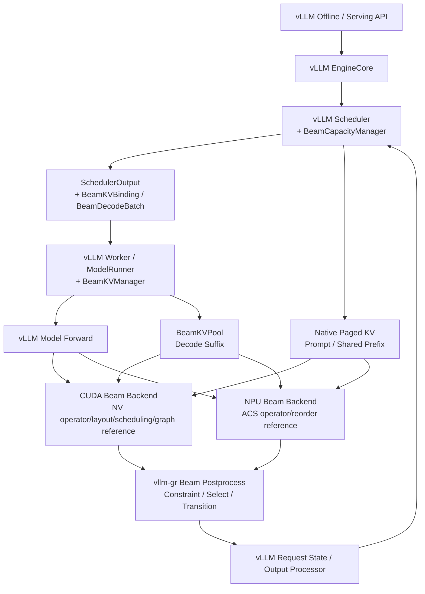

架构中不存在独立的 NVIDIA Runtime 或 ACS Runtime。两者只作为 GPU/NPU Backend 的技术参考。

### 3.1 对象位置图

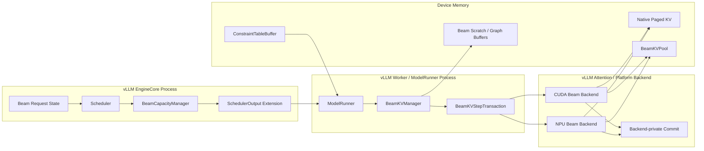

### 3.2 最小扩展组件

不在 vLLM 外部再造 Runtime，只增加三个 vLLM 扩展点：

```text
vLLM Scheduler extension:
    BeamCapacityManager

vLLM Worker / ModelRunner extension:
    BeamKVManager

vLLM platform backend extension:
    CudaBeamBackend / NpuBeamBackend
```

---

## 4. 公共数据契约

### 4.1 BeamDecodeRequestSpec

```python
@dataclass(frozen=True)
class BeamDecodeRequestSpec:
    session_id: str
    max_beam_width: int
    max_decode_steps: int
    constraint_table_id: str | None
    constraint_table_version: int | None
```

用于 Scheduler Admission 和 Bucket 选择。

### 4.2 BeamKVBinding

一个独立 Beam Session 对应一个固定 Slot：

```python
@dataclass(frozen=True)
class BeamKVBinding:
    session_id: str
    bucket_id: str
    slot_id: int
    generation: int
    capacity_beam_width: int
    max_decode_steps: int
```

多个 Session 的 Binding 由 `BeamDecodeBatch` 聚合。

### 4.3 BeamStepCursor

```python
@dataclass(frozen=True)
class BeamStepCursor:
    decode_index: int
    materialized_kv_len: int
    selected_token_count: int
```

公共层统一使用 0-based：

```text
第一次 Decode Forward:
    decode_index = 0
    materialized_kv_len = 0
    selected_token_count = 1
```

NPU 算子的 1-based `decode_step` 只在 NPU Backend 内转换：

```text
npu_decode_step = decode_index + 1
```

### 4.4 BeamDecodeBatch

```python
@dataclass(frozen=True)
class BeamDecodeBatch:
    bindings: tuple[BeamKVBinding, ...]
    cursor: BeamStepCursor
    active_beam_width: int
    next_beam_width: int
    input_token_ids: DeviceTensor
    active_mask: DeviceTensor | None
```

必须区分：

```text
capacity_beam_width
active_beam_width
next_beam_width
```

### 4.5 BeamTransition

```python
@dataclass(frozen=True)
class BeamTransition:
    parent_beam_ids: DeviceTensor
    selected_token_ids: DeviceTensor
    selected_scores: DeviceTensor
    next_constraint_state_ids: DeviceTensor | None
    finished_mask: DeviceTensor | None
    requires_next_forward: bool
```

公共顺序是语义 Beam 顺序。NPU 的 grouped parent、permutation、prefix sum 属于 Backend 私有数据。

### 4.6 对象关系图

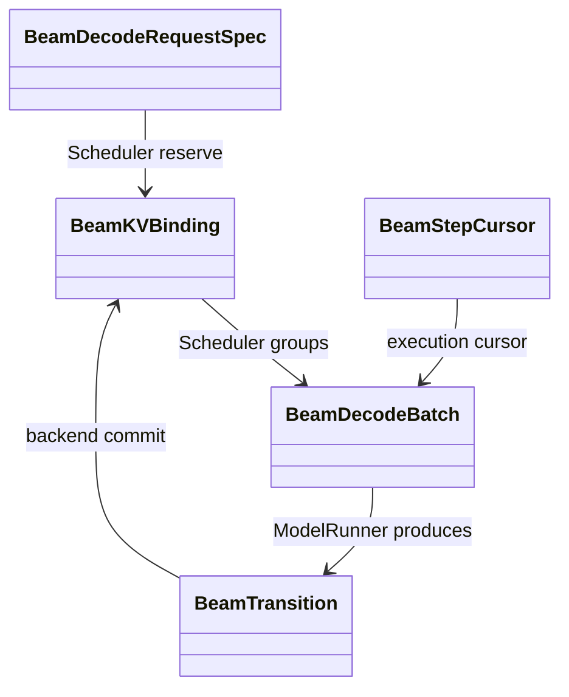

---

## 5. 物理资源与 CachePlan

### 5.1 四类设备资源

```text
NativeKVPool
    Prompt、Shared Prefix、普通请求、Prefix Cache

BeamKVPool
    Beam Decode Suffix

BeamDecodeScratch
    Token、Score、Parent、TopK、Constraint State、Mask、Graph Buffer

ConstraintTableBuffer
    模型/Catalog 级只读合法生成表
```

### 5.2 统一显存规划

BeamKV 不能在 Native Paged KV 已经消耗全部可用缓存预算后再临时申请。

```text
M_device_budget
  = M_requested
  - M_weights
  - M_peak_activation
  - M_non_framework
  - M_graph
  - M_workspace
  - M_constraint_table
  - M_safety_margin

M_native_kv + M_beam_kv + M_beam_scratch
    <= M_device_budget
```

### 5.3 CachePlan 数据流

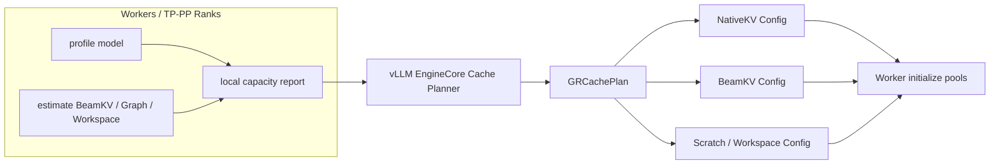

### 5.4 Bucket 与 Slot

```python
BeamKVPoolConfig(
    buckets={
        "w32_t64": BeamKVBucket(
            capacity_beam_width=32,
            max_decode_steps=64,
            num_slots=8,
        ),
        "w128_t16": BeamKVBucket(
            capacity_beam_width=128,
            max_decode_steps=16,
            num_slots=4,
        ),
    }
)
```

请求选择最小兼容 Bucket：

```text
W=24,T=48 -> w32_t64
W=80,T=12 -> w128_t16
```

每个 Bucket 的全局容量：

```text
C_global(bucket)
    = min(C_worker_0, C_worker_1, ..., C_worker_n)
```

### 5.5 禁止在线 Grow

服务期间禁止：

```text
Pool 不足
    -> 新建更大 Tensor
    -> 复制旧 KV
    -> 替换 data_ptr
```

容量调整必须通过受控 Reconfigure：停止 Admission、Drain Session、销毁 Graph/Pool、重新规划和初始化。

---

## 6. Scheduler Admission

### 6.1 Beam Slot 是一等资源

```python
admissible = (
    token_budget_available
    and native_kv_available
    and beam_slot_available
    and beam_scratch_available
    and constraint_table_available
)
```

Graph Hit 不属于 Admission 条件。

### 6.2 原子 Reservation

```python
beam_reservation = beam_capacity_manager.try_reserve(request_spec)
if beam_reservation is None:
    request.status = WAITING_FOR_BEAM_KV
    continue

native_blocks = kv_cache_manager.allocate_slots(request, num_new_tokens)
if native_blocks is None:
    beam_capacity_manager.rollback(beam_reservation)
    continue

binding = beam_capacity_manager.commit(beam_reservation)
scheduler_output.beam_kv_bindings[request.session_id] = binding
```

### 6.3 Admission 时序

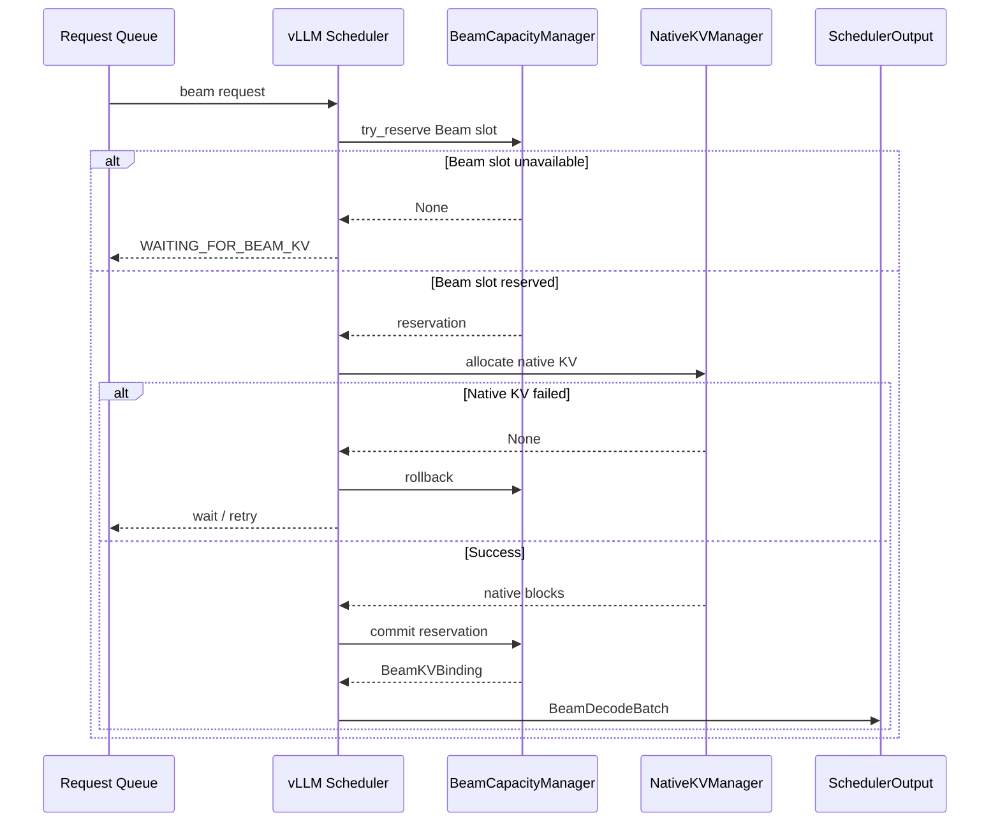

### 6.4 Slot 状态

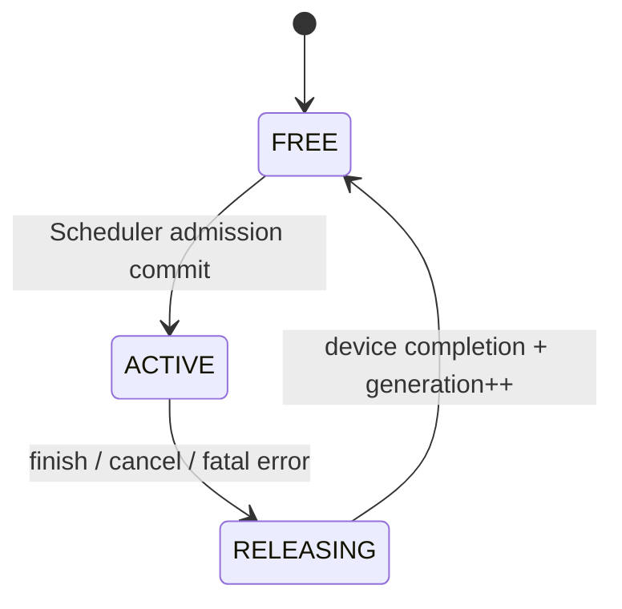

Slot 只有在最后设备事件完成后才允许复用。

---

## 7. 请求与数据流

### 7.1 完整生命周期

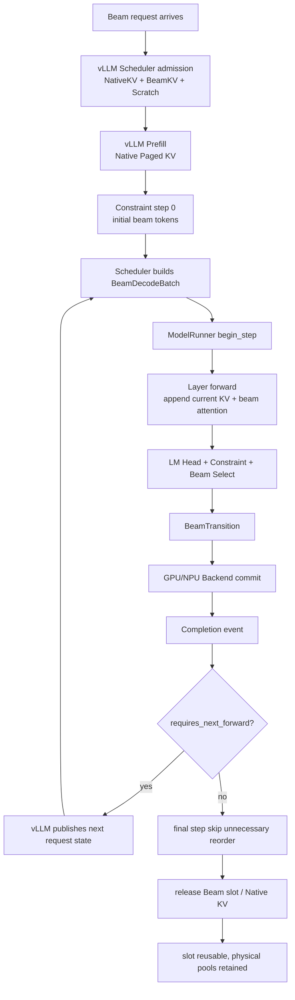

### 7.2 每层严格顺序

```text
1. Q/K/V Projection
2. 将当前 Token K/V 写入 current_write_target[decode_index]
3. 当前 Attention 读取：
   - vLLM Native Shared Prefix KV
   - 已提交的 Beam 历史 KV
   - 当前层刚写入的当前 Token K/V
4. Prefix Attention
5. Suffix/Beam Attention
6. LSE Merge 或专用融合 Attention
7. Output Projection / 下一层
```

### 7.3 Layer 数据流

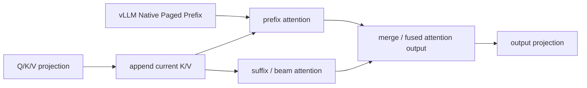

当前 K/V 对本层 Attention 立即可见，但在整个 Step Commit 前不发布为下一代 Beam 状态。

---

## 8. Beam Parent 与 Commit

### 8.1 Parent 是核心语义

```text
parent_beam_ids = [3, 1, 1, 1]
```

表示下一代 Beam 历史分别来自旧 Beam 3、1、1、1。

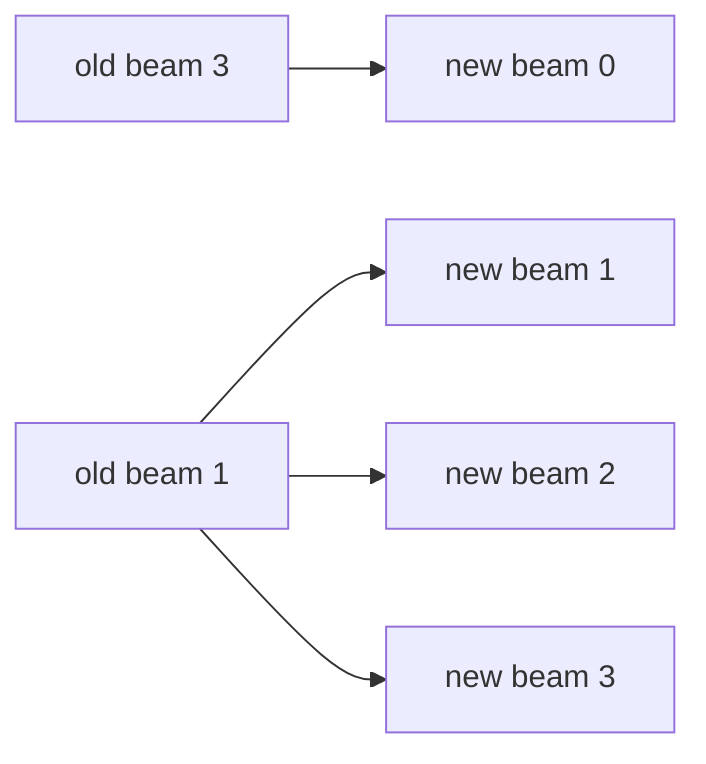

### 8.2 公共 Commit 流程

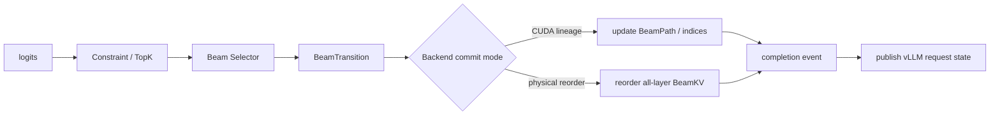

### 8.3 可见性不变量

```text
所有 Layer 的 KV Append/Commit 完成
    -> Device Completion Event
    -> committed_generation++
    -> vLLM Request State 发布 Parent/Token/Score
```

NPU 原地 Reorder 中途失败时，不承诺通用 Rollback；Session 标记 Fatal，Slot 进入 `RELEASING`。

---

## 9. CUDA Backend：基于 vLLM，参考 NVIDIA 执行层

CUDA 路径仍由 vLLM `GPUModelRunner -> Model Forward -> Attention Backend` 驱动。

### 9.1 NVIDIA 可借鉴内容

| NVIDIA 参考项 | vLLM-GR 落点 |
| --- | --- |
| Step-major BeamKV | `BeamKVManager` 管理的 CUDA BeamKVPool |
| BeamPath / topk indices | CUDA Backend 私有 Lineage Metadata |
| GR Decode Attention | vLLM Attention Backend 或自定义 CUDA Op |
| BeamKV Writer | Layer Forward 内当前 K/V Append |
| Decode Batch 分组 | vLLM Scheduler 的 Beam Decode Group Key |
| Direct Pool-view Graph | GPUModelRunner 内 Beam Graph Runner |
| Pointer Guard | Graph Replay 前验证 Pool View 地址 |

NVIDIA Dense `ContextKV` 不进入公共 Prefix ABI。vLLM Prefix 始终使用 Native Paged KV。

### 9.2 推荐 CUDA BeamKV 布局

```text
BeamKV[layer]
    [slot, step, beam, kv_head, head_dim]
```

要求：

- 当前 Step Append 地址稳定；
- Pool Base 和 Slot Stride 固定；
- Lineage Metadata 使用固定 Buffer；
- Attention 能组合 Paged Prefix 与 Beam Suffix；
- 布局属于 CUDA Backend 私有实现。

### 9.3 CUDA Decode Batch 分组

参考 NVIDIA 分组维度，但实现位置在 vLLM Scheduler：

```text
BeamDecodeGroupKey = (
    decode_index,
    active_beam_width,
    next_beam_width,
    context_shape_bucket,
    graph_shape_bucket,
)
```

分组结果通过 `SchedulerOutput.beam_decode_batches` 下发到 GPUModelRunner，不建立独立 Continuous Scheduler。

### 9.4 CUDA 内部 Commit 模式

#### Lineage 模式

```text
Append BeamKV[:, step, :]
    -> Beam Select
    -> 更新 BeamPath / Lineage
    -> 下一步 GR Decode Attention 按祖先索引读取
```

#### Dense Reorder 模式

```text
Dense BeamKV
    -> Prefix Attention
    -> Suffix Attention
    -> LSE Merge
    -> Physical Reorder
```

Dense Reorder 便于先基于当前 vllm-gr 机制落地；Lineage 模式用于后续对接 NVIDIA 风格专用算子。

### 9.5 CUDA 数据流

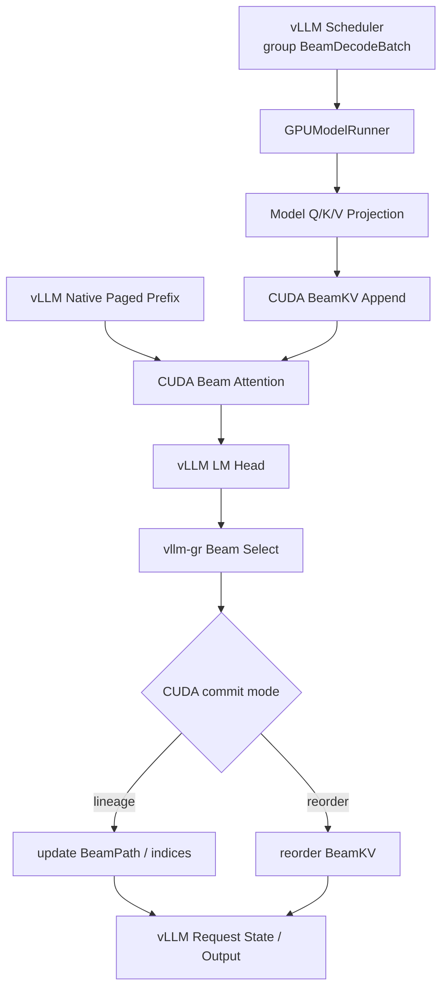

---

## 10. NPU Backend：参考 ACS

### 10.1 推荐布局

```text
BeamKV[layer]
    [slot, beam, kv_head, max_decode_steps, head_dim]
```

### 10.2 每层路径

```text
Q/K/V Projection
    -> cache_unshared_kv
    -> x_attention(shared prefix + unshared beam history)
    -> output projection
```

### 10.3 Step Commit

```text
Beam Selection
    -> 原始 parent_beam_ids
    -> NPU Parent Canonicalization
    -> grouped parent / permutation / prefix sums
    -> all-layer select_unshared_kv
    -> Completion Event
    -> vLLM Request State Publish
```

### 10.4 NPU 数据流

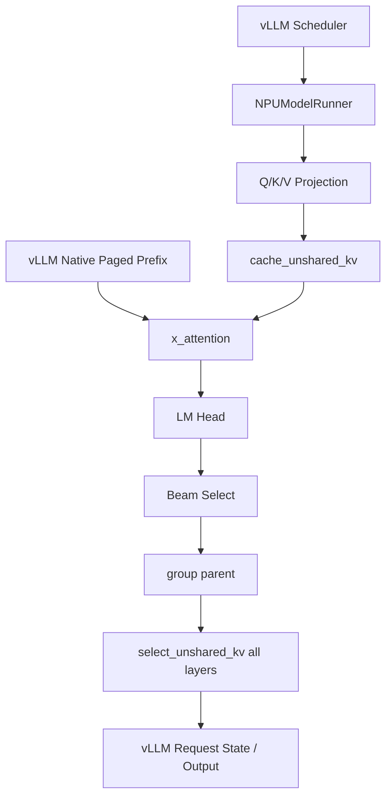

Final Step 的 `requires_next_forward=false` 时跳过 KV Reorder。

---

## 11. Attention Backend Contract

公共输入基于 vLLM Paged Prefix：

```python
beam_attention(
    query,
    paged_prefix_ref,
    beam_layer_step_view,
    active_beam_width,
    cursor,
)
```

`paged_prefix_ref` 包含：

```text
block_table
seq_lens
slot_mapping
native kv cache tensor reference
```

NVIDIA Dense `ContextKV` 仅用于理解其 CUDA 算子，不进入公共 ABI。

Layer 使用明确 `layer_idx`：

```python
beam_kv_pool.key[layer_idx]
beam_kv_pool.value[layer_idx]
```

不使用 `id(kv_cache)` 作为正式跨模块接口。

Forward 热路径禁止：

- 新建或 Grow Beam Pool；
- 替换 Metadata Tensor；
- 每层构造 Python Pool 字典；
- 动态创建 Graph 输入 Buffer。

---

## 12. Graph 设计

### 12.1 Capacity 与 Graph 分离

```text
Capacity Admission:
    请求是否拥有合法 Beam Slot？

Graph Dispatch:
    已获准执行的 Batch 是否有匹配 Graph？
```

- Capacity 失败：请求等待；
- Graph Miss：Eager/Piecewise 回退；
- Graph Miss 不能绕过 Capacity。

### 12.2 BeamGraphKey

```python
@dataclass(frozen=True)
class BeamGraphKey:
    platform: str
    runtime_mode: str
    num_sessions_bucket: int
    beam_width: int
    query_len: int
    dtype: str
    kv_layout: str
    attention_backend: str
    postprocess_variant: str
    tp_size: int
```

通常不进入 Key：Request ID、Slot ID、Token ID、Parent ID、Score 和精确 Decode Step。

### 12.3 Graph Runner 位置

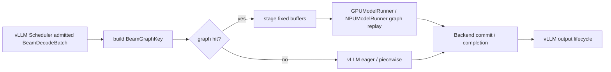

CUDA Graph 的 Direct Pool-view、Pointer Guard 和固定输出 Buffer 可以参考 NVIDIA，但 Runner 必须位于 vLLM ModelRunner 扩展中。

ACLGraph 参考 ACS 的固定 Buffer 和 Task Update 机制。

---

## 13. 推荐代码组织

```text
vllm_gr/
  v1/
    beam/
      types.py
        BeamDecodeRequestSpec
        BeamKVBinding
        BeamStepCursor
        BeamDecodeBatch
        BeamTransition

      capacity.py
        BeamCapacityManager
        BeamKVPoolConfig
        BeamKVBucketConfig

      manager.py
        BeamKVManager
        BeamKVStepTransaction
        SlotGenerationState

      backend/
        base.py
        cuda.py
        npu.py

      attention/
        contract.py
        cuda_backend.py
        npu_backend.py

      postprocess/
        constraint_backend.py
        beam_selector.py

      graph/
        key.py
        cuda_runner.py
        npu_runner.py
```

集成点：

```text
vLLM Scheduler
    -> BeamCapacityManager
    -> SchedulerOutput.beam_kv_bindings

GPU/NPU ModelRunner
    -> BeamKVManager.begin_step
    -> Backend LayerStepView
    -> Model Forward
    -> Postprocess
    -> Backend Commit
    -> vLLM Output Processor
```

---

## 14. 核心不变量

### 容量

```text
所有 ACTIVE/RELEASING Session 占用 Slot
    <= CachePlan 公布的全局物理 Slot 容量
```

### Binding

```text
binding.generation == local_slot.generation
```

### Step

```text
decode_index < max_decode_steps
materialized_kv_len == decode_index
selected_token_count == decode_index + 1
```

### Attention

```text
当前层 Attention 开始前
    当前 Token K/V 已写入 current_write_target
```

### 发布

```text
所有 Layer KV Commit 完成
    -> Completion Event
    -> committed_generation++
    -> vLLM Request State 可见 Parent/Token/Score
```

### 释放

```text
Slot 只有在最后 Device Event 完成后
    才能 Generation 失效并重新分配
```

---

## 15. 测试与验收

### 15.1 vLLM 主流程

- 普通请求不受 Beam 扩展影响；
- Beam 请求仍由 vLLM Scheduler 驱动；
- Cancel、Finish、Timeout、Failure 正确释放 Native KV 和 Beam Slot；
- SchedulerOutput 到 GPU/NPU ModelRunner 的 Binding 一致。

### 15.2 Beam 语义

- Parent Beam IDs；
- Selected Token IDs；
- Accumulated Scores；
- Final Item List；
- EOS/Finished Mask；
- Constraint State。

### 15.3 KV 正确性

- 当前 K/V 写入位置；
- `[3,1,1,1]` 等 Parent 复制场景；
- CUDA Lineage 与 Dense Reorder 结果等价；
- NPU Physical Reorder 正确；
- Final-step Skip 不影响输出；
- Slot 复用无旧数据污染。

### 15.4 调度与容量

- Beam Slot 满时请求不下发；
- Native KV 失败时 Beam Reservation 回滚；
- Grouped Request 按独立 Session 数计 Slot；
- 多 Worker 使用全局最小容量；
- Releasing Slot 不提前复用。

### 15.5 Graph

- Pool 和 Graph Buffer 地址稳定；
- Graph Replay 与 Eager 输出一致；
- Graph Miss 不绕过 Capacity；
- Pointer Guard 拒绝错误 Pool View；
- Padding Row 不写入 Live Slot。

---

## 16. 最终设计决策

1. 主架构保持 vLLM V1 `EngineCore -> Scheduler -> SchedulerOutput -> Worker/ModelRunner -> Attention -> Output`；
2. Beam Incremental Decode 作为 vllm-gr 扩展接入，不建立独立 Runtime；
3. Native Prefix KV 始终使用 vLLM Paged KV；
4. BeamKV 是与 Native KV 并列规划的固定物理 Pool；
5. Beam Slot 由 vLLM Scheduler 扩展分配，Worker 只消费 Binding；
6. 当前 Token K/V 必须先写后读；
7. Beam Parent 通过 `BeamTransition` 进入每一步 Commit；
8. CUDA 只在算子、BeamKV 布局、Decode Batch 分组和 CUDA Graph 上参考 NVIDIA；
9. NPU 参考 ACS 的连续 BeamKV、x_attention 和 Physical Reorder；
10. NVIDIA Dense ContextKV、独立 Scheduler、Serving API 和状态机不进入系统设计；
11. CUDA/NPU Graph Runner 均位于 vLLM ModelRunner 扩展内；
12. Backend Commit 完成前禁止发布下一代 vLLM Request State；
13. Slot 释放晚于最后 Device Event；
14. 服务期间禁止 BeamKVPool Grow；
15. 普通 vLLM 请求路径保持不变。

---

## 17. 代码与资料索引

### 设计文档

- `GR/beam_kv_cache_architecture_and_scheduling_design.md`
- `zhanghanleo10/vllm-gr-summary/02-inference-engine/beam-search/incremental-decode/01_incremental_decode_architecture.md`

### NVIDIA SID-GR（仅执行层参考）

- `examples/sid-gr-inference/src/gr_inference/gr_kv/beam_kv.py`
- `examples/sid-gr-inference/src/gr_inference/gr_kv/beam_path.py`
- `examples/sid-gr-inference/src/gr_inference/gr_runtime/decode_kv.py`
- `examples/sid-gr-inference/src/gr_inference/gr_kernels/attention/gr_decode_attention.py`
- `examples/sid-gr-inference/src/gr_inference/gr_serving/continuous.py`（仅 Decode Batch 分组）
- `examples/sid-gr-inference/src/gr_inference/gr_serving/decode_cuda_graph.py`

### ACS_vllm-GR

- `vllm-ascend/vllm_ascend/beam_search/context.py`
- `vllm-ascend/vllm_ascend/attention/attention_v1.py`
- `vllm-ascend/vllm_ascend/ops/xllm_ops.py`

### JiusiServe/vllm-gr

- `vllm_gr/v1/engine/scheduler_metadata.py`
- `vllm_gr/v1/engine/core.py`
- `vllm_gr/v1/worker/model_runner_common.py`
- `vllm_gr/v1/attention/backends/beam_attn_metadata.py`
- `vllm_gr/v1/attention/backends/beam_attn_gpu.py`
- `vllm_gr/v1/attention/backends/beam_attn_npu.py`
