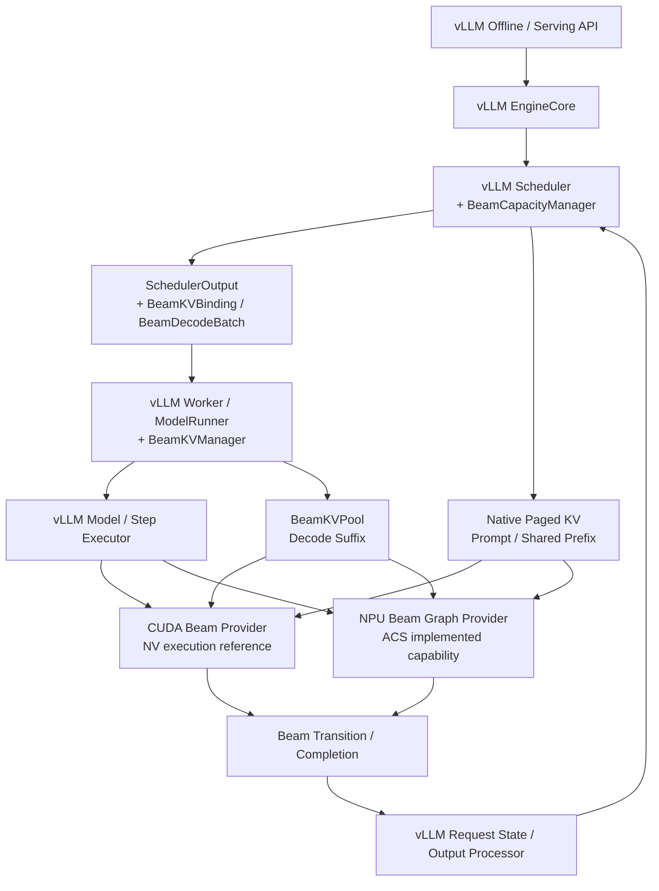
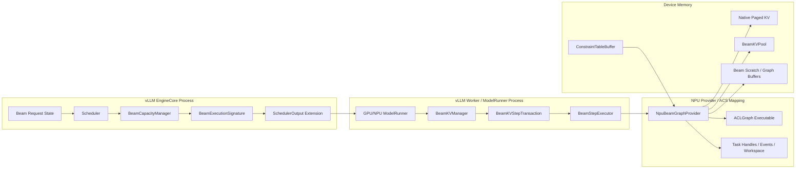
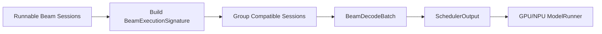
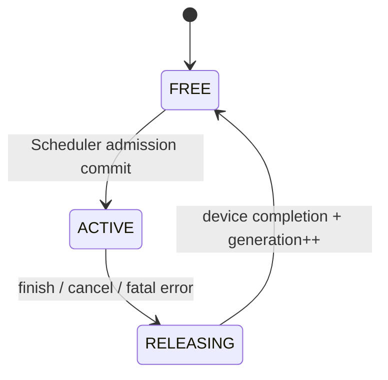
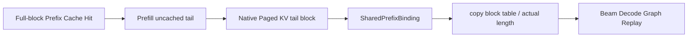
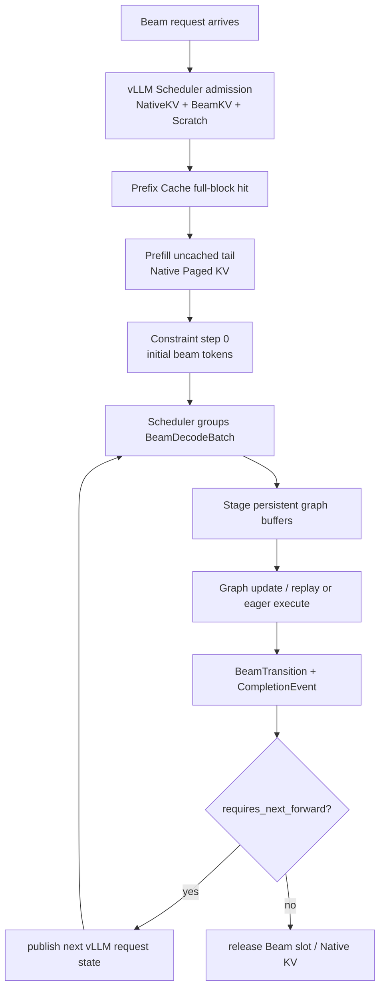
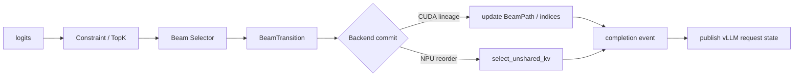
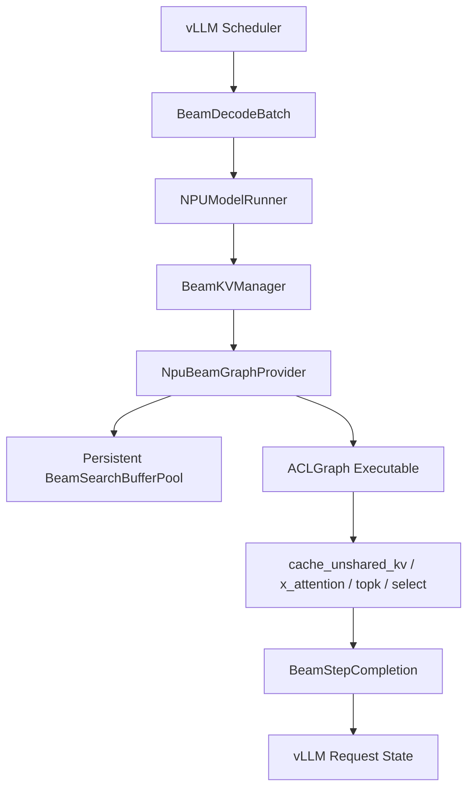
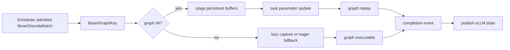

# vLLM-GR Beam Incremental Decode 统一架构设计

> 状态：Design Draft  
> 日期：2026-08-06  
> 主架构基线：vLLM `releases/v0.22.1` + JiusiServe/vllm-gr  
> 平台参考：ACS_vllm-GR（NPU 已实现能力）；NVIDIA/recsys-examples SID-GR（仅 CUDA 算子、BeamKV 布局、调度分组与 CUDA Graph）  
> 范围：基于 vLLM V1 Engine 的 Beam Incremental Decode 扩展，包括 KV 资源管理、Scheduler Admission、Prefill 尾块、Worker/ModelRunner 执行、GPU/NPU Backend、Full-Step Graph 和状态提交边界  
> 非目标：不引入独立于 vLLM 的 Serving Runtime；不照搬 NVIDIA 的请求、HTTP、模型加载和状态机；不要求 GPU/NPU 使用相同物理 KV 布局；不在本文中重新定义 Catalog、EOS、Beam Ranking 和对外返回格式

---

## 1. 结论摘要

本方案以 vLLM 原生执行链为唯一主干：

```text
vLLM EngineCore / Scheduler
    -> SchedulerOutput Beam Extension
    -> vLLM Worker / ModelRunner
    -> Native Paged Prefix KV + Beam Decode KV
    -> GPU/NPU Beam Backend
    -> Graph Completion / Beam Transition
    -> vLLM Request State / Output Processor
```

其中：

- **vLLM/vllm-gr** 决定请求生命周期、调度、资源所有权、Native Paged KV、ModelRunner 接入和输出流程；
- **ACS** 提供已经实现的 NPU Beam ACLGraph、连续 Unshared BeamKV、Attention/Cache 算子、约束 TopK、Beam Select 和物理重排能力；
- **NVIDIA SID-GR** 只为 CUDA Backend 提供算子接口、BeamKV 布局、Decode Batch 分组和 CUDA Graph 参考，不定义系统上层架构。

最终设计决策：

1. Prompt 和共享 Prefix 始终使用 vLLM Native Paged KV；
2. Prefix Cache 只命中完整 Block，未缓存尾部由本轮 Prefill 写入 Native Paged KV；
3. Prompt 最后一个未满 Block 的剩余 Slot 不用于存放 Beam Token；
4. Beam Decode Suffix 从首个生成 Token 开始写入独立 `BeamKVPool`；
5. `BeamKVPool`、Beam Scratch 和 Graph Workspace 在 Worker 初始化阶段按统一 CachePlan 一次性申请，服务期间禁止 Grow；
6. Scheduler 将 Beam Slot 作为一等资源，在请求下发前完成 Admission；
7. Worker 不自行分配 Slot，只消费 SchedulerOutput 中的 `BeamKVBinding`；
8. Beam Decode 仍走 vLLM `Scheduler -> Worker -> ModelRunner -> Backend` 主链；
9. CUDA/NPU 共享请求语义、Graph Contract 和资源生命周期，但不共享物理布局和 Kernel ABI；
10. CUDA 只在算子、KVC 布局、调度分组和成图方面参考 NVIDIA；
11. NPU 将 ACS 已实现的 ACLGraph 能力封装为 `NpuBeamGraphProvider`；
12. 当前 Token K/V 必须先写入，再参与当前层 Attention；
13. Beam Parent 关系必须进入每一步核心路径；
14. Full-Step Graph 或 Backend Commit 完成后，才能发布下一代 Beam 状态；
15. Session 结束只释放 Slot 所有权，物理 Pool 和 Graph Executable 保留复用；
16. 最后一步没有下一次 Forward 时，跳过无意义的 KV Reorder；
17. Graph Dispatch 与 Capacity Admission 相互独立：没有 Slot 必须等待，没有 Graph 可以 Eager 回退。

---

## 2. 主架构与参考边界

### 2.1 vLLM / vllm-gr：系统主架构

必须保留并基于以下主链路扩展：

```text
API / Offline Entry
    -> EngineCore
    -> Scheduler
    -> SchedulerOutput
    -> Worker / ModelRunner
    -> Attention / Beam Backend
    -> Output Processor
```

vLLM/vllm-gr 负责：

- Request 和 Beam Session 生命周期；
- Native Paged KV 的容量规划、Block 分配和 Prefix Cache；
- Scheduler Admission 和 Continuous Batching；
- SchedulerOutput 到 Worker 的数据下发；
- ModelRunner 输入准备、Forward、Graph Dispatch 和结果回传；
- 普通请求与 Beam 请求混部；
- Cancel、Finish、Timeout、Failure 和资源释放。

### 2.2 ACS_vllm-GR：NPU 已实现能力

ACS 提供的能力包括：

```text
Paged Shared Prefix KV
Dense Unshared BeamKV
BeamSearchBufferPool
ACLGraphWrapper
Graph Task Group Update
cache_unshared_kv
x_attention
rec_constrained_topk
beam_search_group
select_unshared_kv
final beam select
```

统一架构不复制 ACS 的 Worker 资源所有权和上层状态机，而是把这些能力封装到 NPU Provider：

```text
ACS BeamSearchBufferPool
    -> NpuBeamKVProvider physical arena

ACS BeamSearchContext
    -> Worker-side Beam execution state

ACLGraphWrapper / GraphParams
    -> NpuBeamGraphProvider executable runtime

select_unshared_kv
    -> NpuBeamKVProvider.commit_transition
```

### 2.3 NVIDIA SID-GR：限定范围的 CUDA 技术参考

只参考以下四部分：

1. **算子**：GR Decode Attention、BeamKV Append、Lineage/TopK Index 输入形式；
2. **KVC 布局**：Context/Beam 分离、Step-major BeamKV、固定 Pool View；
3. **调度**：按 Decode Step、Beam Width、Context/Graph Shape 分组；
4. **成图**：固定地址 Pool、Pointer Guard、Graph Shape Key、Direct Pool-view Replay、Graph Miss 回退。

明确不采用 NVIDIA 的：

- 独立 Serving Runtime；
- HTTP/API 层；
- 独立 Request State Machine；
- 模型加载和输出协议；
- Dense ContextKV 作为 vLLM Prefix KV 的替代方案。

### 2.4 责任矩阵

| 设计维度 | 主来源 | 说明 |
| --- | --- | --- |
| EngineCore / Scheduler 主流程 | vLLM | 不建立独立 Scheduler Runtime |
| Request / Finish / Cancel 生命周期 | vLLM + vllm-gr | Beam 状态作为 vLLM Request 扩展 |
| Native Prefix KV | vLLM | 保留 Paged KV、BlockTable、SlotMapping |
| Prefill 未缓存尾部 | vLLM | 写入 Native Paged KV 的最后一个物理 Block |
| Beam Capacity Admission | vLLM Scheduler 扩展 | 控制面拥有 Slot，Worker 消费 Binding |
| Worker / ModelRunner 接入 | vllm-gr | 组织 Beam Batch、Graph Runtime 和 Backend 输入 |
| NPU BeamKV / ACLGraph / 后处理 | ACS | 作为 NPU Provider 已实现能力接入 |
| CUDA Attention 算子 | NVIDIA 参考 | GR Decode Attention/Lineage 输入形式 |
| CUDA BeamKV 布局 | NVIDIA 参考 | Step-major、Append-only、固定 Pool View |
| CUDA Decode Batch 分组 | NVIDIA 参考，vLLM 实现 | 分组逻辑落在 vLLM Scheduler |
| Serving API / 模型加载 / 输出 | vLLM | 不采用 NVIDIA 独立实现 |

---

## 3. 总体架构



架构中不存在独立的 NVIDIA Runtime 或 ACS Runtime。NVIDIA 和 ACS 均通过 vLLM Platform/ModelRunner 扩展接入。

### 3.1 对象位置图



### 3.2 最小扩展组件

不在 vLLM 外部再造 Runtime，只增加：

```text
vLLM Scheduler extension:
    BeamCapacityManager

vLLM Worker / ModelRunner extension:
    BeamKVManager
    BeamStepExecutor

vLLM platform backend extension:
    CudaBeamProvider
    NpuBeamGraphProvider
```

---

## 4. 公共数据契约

### 4.1 BeamDecodeRequestSpec

```python
@dataclass(frozen=True)
class BeamDecodeRequestSpec:
    session_id: str
    max_beam_width: int
    max_decode_steps: int
    constraint_table_id: str | None
    constraint_table_version: int | None
```

### 4.2 BeamKVBinding

```python
@dataclass(frozen=True)
class BeamKVBinding:
    session_id: str
    bucket_id: str
    slot_id: int
    generation: int
    capacity_beam_width: int
    max_decode_steps: int
```

### 4.3 BeamStepCursor

```python
@dataclass(frozen=True)
class BeamStepCursor:
    decode_index: int
    materialized_kv_len: int
    selected_token_count: int
```

公共层使用 0-based；NPU 的 1-based `decode_step` 只在 Provider 内转换：

```text
npu_decode_step = decode_index + 1
```

### 4.4 SharedPrefixBinding

```python
@dataclass(frozen=True)
class SharedPrefixBinding:
    block_table_slot: int
    actual_prefix_len: int
    num_prefix_blocks: int
```

它表示 Prefill 完成后的整个 Prompt，包括未满尾块中的有效 Token。

### 4.5 BeamDecodeBatch

```python
@dataclass(frozen=True)
class BeamDecodeBatch:
    bindings: tuple[BeamKVBinding, ...]
    prefix_bindings: tuple[SharedPrefixBinding, ...]
    cursor: BeamStepCursor
    active_beam_width: int
    next_beam_width: int
    input_token_ids: DeviceTensor
    active_mask: DeviceTensor | None
```

### 4.6 BeamTransition 与 Completion

```python
@dataclass(frozen=True)
class BeamTransition:
    parent_beam_ids: DeviceTensor
    selected_token_ids: DeviceTensor
    selected_scores: DeviceTensor
    next_constraint_state_ids: DeviceTensor | None
    finished_mask: DeviceTensor | None
    requires_next_forward: bool

@dataclass
class BeamStepCompletion:
    transition: BeamTransition
    completion_event: DeviceEvent
    committed_generation: int
```

Scheduler/Worker 只有在 `completion_event` 完成后才能发布新状态。

---

## 5. 物理资源与 CachePlan

### 5.1 设备资源

```text
NativeKVPool
    Prompt、Shared Prefix、普通请求、Prefix Cache

BeamKVPool
    Beam Decode Suffix

BeamDecodeScratch
    Token、Score、Parent、TopK、Sequence、Mask、Graph Buffer

GraphWorkspace
    CUDA Graph / ACLGraph Workspace、Task Metadata 和固定输出

ConstraintTableBuffer
    模型/Catalog 级只读合法生成表
```

### 5.2 统一显存规划

```text
M_device_budget
  = M_requested
  - M_weights
  - M_peak_activation
  - M_non_framework
  - M_graph
  - M_workspace
  - M_constraint_table
  - M_safety_margin

M_native_kv + M_beam_kv + M_beam_scratch
    <= M_device_budget
```

Provider 在初始化前报告：

```python
class BeamProvider:
    def estimate_memory(self, profiles) -> BeamGraphMemoryPlan: ...
```

EngineCore 汇总所有 Rank 后下发统一 CachePlan，Worker 再申请 Pool、Scratch、Workspace 和 Executable Cache。

### 5.3 禁止在线 Grow

服务期间禁止：

```text
Pool 不足
    -> 新建更大 Tensor
    -> 复制旧 KV
    -> 替换 data_ptr
```

容量调整必须通过受控 Reconfigure：停止 Admission、Drain Session、销毁 Graph/Pool、重新规划和初始化。

---

## 6. Scheduler Admission 与执行分组

### 6.1 Beam Slot 是一等资源

```python
admissible = (
    token_budget_available
    and native_kv_available
    and beam_slot_available
    and beam_scratch_available
    and constraint_table_available
)
```

Graph Hit 不属于 Admission 条件。

### 6.2 原子 Reservation

```python
beam_reservation = beam_capacity_manager.try_reserve(request_spec)
if beam_reservation is None:
    request.status = WAITING_FOR_BEAM_KV
    continue

native_blocks = kv_cache_manager.allocate_slots(request, num_new_tokens)
if native_blocks is None:
    beam_capacity_manager.rollback(beam_reservation)
    continue

binding = beam_capacity_manager.commit(beam_reservation)
scheduler_output.beam_kv_bindings[request.session_id] = binding
```

### 6.3 BeamExecutionSignature

Scheduler 不能只按 `batch * beam` 分组。统一签名为：

```python
@dataclass(frozen=True)
class BeamExecutionSignature:
    platform: str
    graph_scope: str
    num_sessions_bucket: int
    active_beam_width: int
    next_beam_width: int
    query_len: int
    max_prefix_blocks_bucket: int
    kv_layout: str
    attention_backend: str
    postprocess_variant: str
    result_width: int
```

例如 `batch=1, beam=8` 和 `batch=2, beam=4` 虽然总 Token 都是 8，但 Shared BlockTable 行数、Beam Grouping 和 Result Shape 不同，不应仅凭 `num_tokens=8` 复用同一个 Graph。



### 6.4 Slot 状态



---

## 7. Prefill 尾块与 Shared Prefix 边界

### 7.1 vLLM Prefix Cache 语义

Prefix Cache 只复用完整 Block。假设：

```text
block_size = 16
prompt_len = 37
```

物理组织为：

```text
Block 0: token  0 ~ 15  full/cached
Block 1: token 16 ~ 31  full/cached
Block 2: token 32 ~ 36  partial tail
         offset 5 ~ 15  unused
```

未缓存尾部 `token 32~36` 在本轮 Prefill 中通过 Native `slot_mapping` 写入 Block 2。Prefill 完成后，Shared Prefix 的真实长度是 37，而不是物理容量 48。

### 7.2 Beam 边界

```text
Native Paged KV:
    Prompt 的全部 Token
    包括未满尾块中的有效 Token

BeamKVPool:
    从首个生成 Token y0 开始
```

禁止利用 Native 尾块的剩余 Slot 存放 Beam Token。原因是尾块属于所有 Beam 共享的 Prefix，而 Beam Token 从第一步就发生分叉。

### 7.3 Prefill Tail Metadata

```python
@dataclass
class PrefillTailMetadata:
    cached_prefix_len: int
    uncached_token_count: int
    slot_mapping: DeviceTensor
    query_start_loc: DeviceTensor
    logits_indices: DeviceTensor
```

`PrefillTailMetadata` 只在 Prefill 使用；Decode 只消费：

```text
shared_block_table_buf
actual_shared_kvlen_buf
num_prefix_blocks_buf
```

### 7.4 对 Graph 的影响

Prefill 未缓存尾部改变本轮 Query Token 数，因此会改变 Prefill Graph Shape。可采用：

```text
Eager / Piecewise Tail
或
num_uncached_tokens Bucket + Padding Mask
```

Decode 阶段尾块只表现为固定地址 Buffer 中的动态内容，不应把精确 Tail Length 放入 Decode Graph Key。



---

## 8. 请求与数据流

### 8.1 完整生命周期



### 8.2 每层严格顺序

```text
1. Q/K/V Projection
2. 将当前 Token K/V 写入 current_write_target[decode_index]
3. Attention 读取 Native Shared Prefix、已提交 Beam 历史和当前 K/V
4. Prefix/Beam Attention 或融合 x_attention
5. Output Projection / 下一层
```

---

## 9. Beam Parent 与 Commit

```text
parent_beam_ids = [3, 1, 1, 1]
```

下一代 Beam 历史分别来自旧 Beam 3、1、1、1。



可见性不变量：

```text
Graph / Backend Commit 完成
    -> Completion Event
    -> committed_generation++
    -> Parent/Token/Score 对 vLLM Request State 可见
```

---

## 10. CUDA Backend：基于 vLLM，参考 NVIDIA 执行层

CUDA 路径仍由 vLLM `GPUModelRunner -> Model Forward -> Attention Backend` 驱动。

可借鉴：

- Step-major Append-only BeamKV；
- BeamPath / Lineage Metadata；
- GR Decode Attention；
- Decode Batch 分组；
- Direct Pool-view Graph；
- Pointer Guard。

推荐布局：

```text
BeamKV[layer]
    [slot, step, beam, kv_head, head_dim]
```

NVIDIA Dense ContextKV 不进入公共 Prefix ABI，Prefix 始终使用 vLLM Native Paged KV。

---

## 11. NPU Backend：ACS ACLGraph 接入架构

### 11.1 Provider 映射



ACS 对象映射：

| ACS 对象 | 统一架构位置 |
| --- | --- |
| `BeamSearchBufferPool` | NPU Provider 物理 Arena |
| `BeamSearchContext` | Worker Beam Session 状态 |
| `ACLGraphWrapper` | NPU ModelRunner Graph Executor |
| `GraphParams` | Provider 私有 Executable Metadata |
| `decode_step_buf` | `BeamStepCursor` 设备镜像 |
| `actual_shared_kvlen` | `SharedPrefixBinding` 设备镜像 |
| `unshared_block_tables` | NPU Beam Slot Device Binding |
| `sequence/beam_scores` | Beam Postprocess 持久化 Scratch |
| `select_unshared_kv` | `commit_transition()` |

### 11.2 持久化 Buffer Contract

初始化期一次性创建：

```text
decode_step_buf
actual_shared_kvlen
unshared_block_tables
unshared K/V per layer
sequence
beam_scores
group_token_num
last_out_token_ids
constraint tables
temperatures
workspace
fixed outputs
```

Runtime 只允许：

```python
persistent_buffer.copy_(runtime_value)
persistent_scalar.fill_(runtime_value)
```

不允许重新创建或替换 Tensor。

### 11.3 Graph Capability

```python
@dataclass(frozen=True)
class BeamGraphCapabilities:
    supports_full_forward: bool
    supports_full_step: bool
    supports_dynamic_decode_step: bool
    supports_dynamic_prefix_length: bool
    supports_dynamic_block_table: bool
    requires_task_group_update: bool
    requires_fixed_beam_width: bool
```

ACS NPU Provider 作为已实现能力对外声明 Full-Step Graph 支持；Common 层不依赖其内部 Task Handle 或算子 ABI。

### 11.4 Runtime Staging 与 Replay

```python
runtime = npu_beam_provider.prepare_runtime(
    batch=beam_decode_batch,
    prefix_bindings=shared_prefix_bindings,
)

executable = npu_beam_provider.get_or_capture_graph(
    runtime.graph_key,
)

npu_beam_provider.update_runtime_params(
    executable,
    runtime,
)

completion = executable.replay()
```

### 11.5 Task Group Update

ACS 的 Task Group、Handle、Event 和 Workspace 应封装在 Provider：

```python
class NpuBeamGraphProvider:
    def update_runtime_params(self, executable, runtime):
        self._update_cache_tasks(executable, runtime)
        self._update_attention_tasks(executable, runtime)
        self._update_postprocess_tasks(executable, runtime)
        self.replay_stream.wait_stream(self.update_stream)
```

Provider 私有维护：

```text
cache task handles
attention task handles
postprocess task handles
external events
workspace
fixed output buffers
```

Common 层只看到：

```text
stage_runtime()
update_runtime_params()
replay()
completion_event
```

### 11.6 Full-Step Graph 范围

统一架构支持：

```text
G0 Eager
G1 Full Forward
G2 Full Beam Step
G3 Fixed Decode Window
```

ACS 作为已实现的 NPU G2 Provider 接入。G2 的逻辑边界为：

```text
Model Forward
    -> LM Head
    -> Constrained TopK
    -> Beam Global Select
    -> select_unshared_kv / Final Select
    -> BeamStepCompletion
```

### 11.7 Final Step

`requires_next_forward=false` 时，使用 Final Beam Select，跳过只服务下一轮 Attention 的 `select_unshared_kv`。

---

## 12. Graph 设计

### 12.1 Capacity 与 Graph 分离

```text
Capacity Admission:
    请求是否拥有合法 Beam Slot？

Graph Dispatch:
    已获准执行的 Batch 是否有匹配 Executable？
```

### 12.2 BeamGraphKey

```python
@dataclass(frozen=True)
class BeamGraphKey:
    platform: str
    graph_scope: str
    num_sessions_bucket: int
    active_beam_width: int
    next_beam_width: int
    query_len: int
    max_prefix_blocks_bucket: int
    dtype: str
    kv_layout: str
    attention_backend: str
    postprocess_variant: str
    result_width: int
    tp_size: int
```

通常不进入 Key：Request ID、Slot ID、Block ID、Token ID、Parent ID、Score、精确 Prefix Length、尾块长度和精确 Decode Step。

### 12.3 ModelRunner Graph Dispatch



### 12.4 Prefill 与 Decode Graph Key

Prefill Graph Key 可以包含：

```text
num_reqs_bucket
num_uncached_tokens_bucket
max_query_len_bucket
prefix_hit_mode
attention_backend
```

Decode Graph Key 不包含精确尾块长度；只在算子 Launch Geometry 确实依赖时包含 `max_prefix_blocks_bucket`。

### 12.5 地址稳定性

必须验证：

- Pool Base 地址稳定；
- Slot View 地址与 Graph 捕获一致；
- Runtime Metadata 使用固定 Tensor；
- Output Buffer 固定；
- Provider 禁止服务期 Grow；
- Slot 复用前等待最后 Completion Event。

---

## 13. 推荐代码组织

```text
vllm_gr/
  v1/
    beam/
      types.py
      capacity.py
      manager.py
      execution_signature.py

      backend/
        base.py
        cuda.py
        npu.py

      graph/
        capabilities.py
        key.py
        executor.py
        cuda_runner.py
        npu_runner.py
        npu_task_update.py

      postprocess/
        constraint_backend.py
        beam_selector.py
```

集成点：

```text
vLLM Scheduler
    -> BeamCapacityManager
    -> BeamExecutionSignature
    -> SchedulerOutput.beam_decode_batches

GPU/NPU ModelRunner
    -> BeamKVManager.begin_step
    -> Provider stage runtime
    -> Graph update / replay
    -> BeamStepCompletion
    -> vLLM Output Processor
```

---

## 14. 核心不变量

### 容量

```text
所有 ACTIVE/RELEASING Session 占用 Slot
    <= CachePlan 公布的全局物理 Slot 容量
```

### Prefix

```text
actual_prefix_len <= num_prefix_blocks * block_size
Beam Token 不写入 Native Prefix 尾块剩余空间
```

### Binding

```text
binding.generation == local_slot.generation
```

### Attention

```text
当前层 Attention 开始前
    当前 Token K/V 已写入 current_write_target
```

### Graph

```text
同一 BeamGraphKey 的所有固定 Tensor 地址一致
Runtime 只更新 Buffer 内容或 Task 参数
```

### 发布

```text
Full-Step Graph / Backend Commit 完成
    -> Completion Event
    -> committed_generation++
    -> vLLM Request State 可见 Parent/Token/Score
```

---

## 15. 测试与验收

### 15.1 Prefill 尾块

- Prefix Cache 只命中完整 Block；
- 未缓存尾部正确写入 Native KV；
- Decode 只读取尾块有效 Token；
- Beam Token 不复用尾块空槽；
- Prefix Length 变化不要求重建 Decode Graph。

### 15.2 Graph Signature

- `batch=1, beam=8` 与 `batch=2, beam=4` 不得因相同 `num_tokens` 误复用；
- 不同 Beam Width、Result Width 和 Postprocess Variant 使用正确 Executable；
- Graph Miss 不绕过 Capacity。

### 15.3 ACS ACLGraph

- `decode_step` 更新后 Replay 正确；
- `actual_shared_kvlen` 和 BlockTable 更新后 Replay 正确；
- Task Update Stream 与 Replay Stream 同步正确；
- Full-Step Graph 输出与 Eager 输出一致；
- Final Step Skip 不影响输出；
- Slot 复用无旧 KV、Sequence 和 Score 污染。

### 15.4 生命周期

- Graph 完成前不发布 Beam State；
- Cancel/Failure 等待迟到 Device Task 后释放 Slot；
- Worker 不在 Runtime 重建 Beam Pool；
- 多 Worker 使用统一全局容量和一致的 Binding Generation。

---

## 16. 最终设计决策

1. 主架构保持 vLLM V1 `EngineCore -> Scheduler -> SchedulerOutput -> Worker/ModelRunner -> Backend -> Output`；
2. Beam Incremental Decode 作为 vllm-gr 扩展接入，不建立独立 Runtime；
3. Native Prefix KV 始终使用 vLLM Paged KV；
4. Prefix Cache 只复用完整 Block，未缓存尾部由 Prefill 写入 Native KV；
5. Beam Token 不复用 Native 尾块剩余 Slot；
6. BeamKV、Scratch、Graph Workspace 由 EngineCore 统一规划并在初始化期申请；
7. Beam Slot 由 Scheduler 扩展分配，Worker 只消费 Binding；
8. Scheduler 使用完整 `BeamExecutionSignature` 分组，不能只使用总 Token 数；
9. CUDA 只在算子、BeamKV 布局、Decode Batch 分组和 CUDA Graph 上参考 NVIDIA；
10. ACS 已实现的 NPU ACLGraph 能力封装为 `NpuBeamGraphProvider`；
11. ACS BufferPool、Task Handle、Event 和 Workspace 均属于 Provider 私有实现；
12. Common 层通过 Capability、GraphKey、CompletionEvent 接入不同成图范围；
13. Full-Step Graph 或 Backend Commit 完成前禁止发布下一代 Request State；
14. Slot 释放晚于最后 Device Event；
15. 服务期间禁止 BeamKVPool 和 Graph Buffer Grow；
16. 普通 vLLM 请求路径保持不变。

---

## 17. 代码与资料索引

### 设计文档

- `GR/beam_kv_cache_architecture_and_scheduling_design.md`
- `zhanghanleo10/vllm-gr-summary/02-inference-engine/beam-search/incremental-decode/01_incremental_decode_architecture.md`

### NVIDIA SID-GR（仅执行层参考）

- `examples/sid-gr-inference/src/gr_inference/gr_kv/beam_kv.py`
- `examples/sid-gr-inference/src/gr_inference/gr_kv/beam_path.py`
- `examples/sid-gr-inference/src/gr_inference/gr_kernels/attention/gr_decode_attention.py`
- `examples/sid-gr-inference/src/gr_inference/gr_serving/continuous.py`
- `examples/sid-gr-inference/src/gr_inference/gr_serving/decode_cuda_graph.py`

### ACS_vllm-GR

- `vllm-ascend/vllm_ascend/beam_search/context.py`
- `vllm-ascend/vllm_ascend/attention/attention_v1.py`
- `vllm-ascend/vllm_ascend/ops/xllm_ops.py`
- `vllm-ascend/vllm_ascend/compilation/acl_graph.py`
- `vllm-ascend/vllm_ascend/worker/model_runner_v1.py`
- `vllm-ascend/vllm_ascend/ascend_forward_context.py`

### JiusiServe/vllm-gr

- `vllm_gr/v1/engine/scheduler_metadata.py`
- `vllm_gr/v1/engine/core.py`
- `vllm_gr/v1/worker/model_runner_common.py`
- `vllm_gr/v1/attention/backends/beam_attn_metadata.py`
- `vllm_gr/v1/attention/backends/beam_attn_gpu.py`
- `vllm_gr/v1/attention/backends/beam_attn_npu.py`
