# vLLM-GR Beam Incremental Decode 统一架构设计

> 状态：Design Draft  
> 日期：2026-08-06  
> 基线：vLLM `releases/v0.22.1`、JiusiServe/vllm-gr、NVIDIA/recsys-examples SID-GR、ACS_vllm-GR  
> 范围：Beam Incremental Decode 的公共语义、KV 资源管理、Scheduler Admission、Worker 事务、CUDA/NPU Provider 和 Graph 边界  
> 非目标：不保持当前 vllm-gr 的 Beam Request 重打包协议；不要求 CUDA/NPU 使用相同物理 KV 布局；不在本文中重新定义 Catalog、EOS、Beam Ranking 和对外返回格式

---

## 1. 结论摘要

本文给出的统一方案建立在以下核心模型上：

```text
Native Paged Prefix KV
    +
Platform-specific Beam Decode KV
    +
Explicit Beam Transition
    +
Scheduler-owned Capacity Admission
    +
Worker-owned Step Transaction
```

最终设计决策如下：

1. Prompt 和共享 Prefix 继续使用 vLLM Native Paged KV；
2. Beam Decode Suffix 使用独立的 `BeamKVPool`，不把每个 Beam 的完整历史复制进 Native Paged KV；
3. `BeamKVPool` 在 Worker 初始化阶段按统一 CachePlan 一次性申请，服务期间不动态 Grow；
4. Scheduler 将 Beam Slot 作为一等资源，在请求下发前完成 Reservation；
5. Worker 不能自行决定 Slot，只消费 Scheduler 下发的 `BeamKVBinding`；
6. 公共层统一 `BeamStepCursor`、`BeamKVBinding`、`BeamDecodeBatch` 和 `BeamTransition`；
7. CUDA/NPU 共享 Beam 语义和事务可见性，不共享物理布局、Kernel ABI 和 KV Commit 算法；
8. CUDA 推荐 Append-only BeamKV + Lineage/BeamPath；必要时可保留 Dense + Physical Reorder 实现；
9. NPU 推荐沿用 ACS 的连续 Unshared KV + `cache_unshared_kv` + `x_attention` + `select_unshared_kv`；
10. 每层必须先写当前 Token 的 K/V，再执行包含当前 K/V 的 Prefix/Suffix Attention；
11. Beam Parent 关系必须进入核心路径，不能作为后续附加功能；
12. Beam 状态只有在所有层 KV Commit 完成后才发布为新 Generation；
13. Slot 结束后立即进入可复用流程，但物理 Pool 不释放、不缩容；
14. 最后一步如果不再执行下一次 Forward，跳过只服务于下一步 Attention 的 KV Reorder；
15. Graph Dispatch 和 Capacity Admission 是两套独立机制：没有 Slot 必须等待，没有 Graph 可以回退 Eager。

这套架构兼容 NVIDIA、ACS 和 vLLM-GR 的方式不是统一 Tensor Shape，而是统一逻辑生命周期和 Provider Contract。

---

## 2. 背景与问题

### 2.1 GR Beam Decode 的工作负载

典型 Generative Recommendation 推理具有：

```text
Long Context + Short Decode + Large Beam Width
```

Prompt/用户历史通常较长，Decode Step 较少，但 Beam Width 可能达到 128、256 或更大。多个 Beam 共享同一份 Prompt KV，只在短 Decode Suffix 上发生分叉。

如果把每个 Beam 当成独立普通请求，会产生：

- Prompt KV 重复；
- Request 和 BlockTable 数量膨胀；
- 每步 Request Fork/Abort/重组开销；
- Beam Parent 变化引起大量 KV Copy 或 BlockTable 更新；
- Attention Metadata 和后处理 Host 开销占比过高。

因此 Beam Decode 应当直接表达：

```text
共享 Prefix
+
每个 Beam 的短 Suffix
+
每一步 Parent-Child Transition
```

### 2.2 现有三类实现

#### NVIDIA SID-GR

逻辑模型为：

```text
ContextKV
BeamKV
BeamPath / topk_indices
GR Decode Attention
```

其优势是 Beam 历史可以 Append-only 保存，Parent 关系通过 Lineage 表达，避免每一步复制全部历史 KV。

#### ACS_vllm-GR

逻辑模型为：

```text
Paged Shared Prefix KV
Dense Unshared KV
cache_unshared_kv
x_attention
select_unshared_kv
```

其优势是 NPU 算子路径明确，下一步 Attention 直接读取已经按新 Beam 顺序重排的连续历史。

#### 当前 JiusiServe/vllm-gr

当前路径更多依赖：

```text
Beam 后缀重新打包为 Request
Scheduler Metadata Patch
ModelRunner Row Remap
Prefix/Suffix Cascade Attention
```

该实现可以继续提供模型、Paged Prefix KV、Scheduler、Worker 和 Serving 宿主，但新架构不再以保持当前 Beam Request 协议为约束。

### 2.3 旧 Incremental Decode 设计的问题

旧设计已经验证了 Paged Prefix + Dense Suffix 的可行性，但存在以下架构缺口：

- Beam Parent/Pruning 不在核心路径；
- Slot 由 Worker Registry 隐式分配；
- Pool 可以在运行时 Regrow，破坏固定地址；
- Slot 只单调分配，不及时复用；
- `decode_step` 在 Registry 内隐式推进；
- 使用 `id(kv_cache)` 作为 Layer ABI；
- Worker 只做局部 Shape Check，Scheduler 不感知总物理容量；
- GPU/NPU 被假定使用相近的 Dense 物理路径；
- 当前 Step K/V 的写入与 Attention 顺序描述不统一。

本文对这些问题进行统一修正。

---

## 3. 设计原则

### 3.1 统一语义，不统一物理布局

Common 层只定义：

- Session 与物理 Slot 的 Binding；
- Decode Step Cursor；
- Active/Next Beam Width；
- Parent、Token、Score 的 Transition；
- Commit 成功后的状态发布；
- Finish/Cancel/Failure 的释放语义。

Platform Provider 决定：

- BeamKV Tensor Layout；
- Append、Gather、Reorder 或 Lineage 算法；
- Attention Kernel；
- Graph Capture 参数；
- Operator Workspace；
- 私有 Parent Canonicalization。

### 3.2 控制面拥有资源，执行面消费 Binding

与 vLLM Native Paged KV 一致：

```text
EngineCore / Scheduler
    决定请求拥有哪些逻辑物理编号

Worker / ModelRunner
    使用固定物理 Pool 和下发的编号
```

Worker 不在请求到达后从剩余 HBM 动态申请 Beam Tensor，也不自行选择 Slot。

### 3.3 固定 Pool 与可复用 Slot

```text
固定 Pool
    != Slot 不回收
```

正确模型是：

- Pool Tensor 在 Worker 生命周期内常驻；
- Session 生命周期内 Slot 稳定；
- Session 结束后 Slot 可以复用；
- Pool 不因请求结束而释放；
- Slot Generation 防止旧异步操作污染新 Session。

### 3.4 Step 是显式输入，不是隐藏副作用

`decode_index` 由执行状态显式提供。Provider 不应在 Attention 内部悄悄推进全局 Step。

```text
执行 cursor=s
    -> Forward
    -> Select
    -> Commit
    -> 完成事件
    -> Publish cursor=s+1
```

### 3.5 Beam Transition 是唯一公共提交语义

Constraint、Beam Selection 和 KV Provider 通过统一对象连接：

```text
BeamTransition(parent, token, score, next_state, requires_next_forward)
```

Constraint Backend 不直接操作 KV；KV Provider 不理解 Catalog 内部格式。

---

## 4. 总体架构

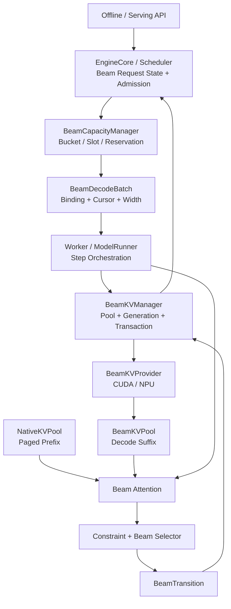

### 4.1 对象位置图

下面这张图强调“对象放在哪里、谁拥有它、谁读写它”。

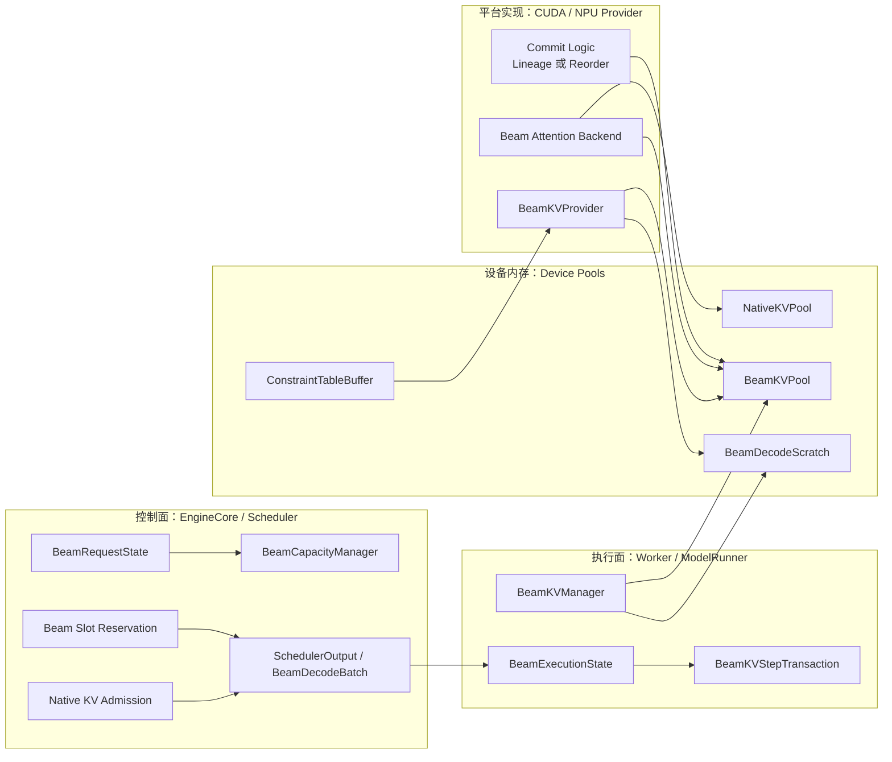

### 4.2 最小运行时组件

为避免对象过度拆分，正式实现只需要三个有状态核心组件：

```text
Scheduler:
    BeamCapacityManager

Worker:
    BeamKVManager

Platform:
    BeamKVProvider
```

其他职责作为数据对象或执行函数存在：

- Resource Coordination：Scheduler 一次 Scheduling Transaction；
- Worker Orchestration：ModelRunner 的 Beam Step 执行函数；
- Attention：Provider/Backend 的 Layer Execution；
- Postprocess：产生 `BeamTransition` 的无状态或轻状态组件。

不再要求独立的 `BeamSessionRegistry + BeamAttentionContext + View + WorkerOrchestrator + ResourceCoordinator` 全部成为有状态类。

### 4.3 使用位置图

这张图强调“哪些对象在哪个阶段被使用”。

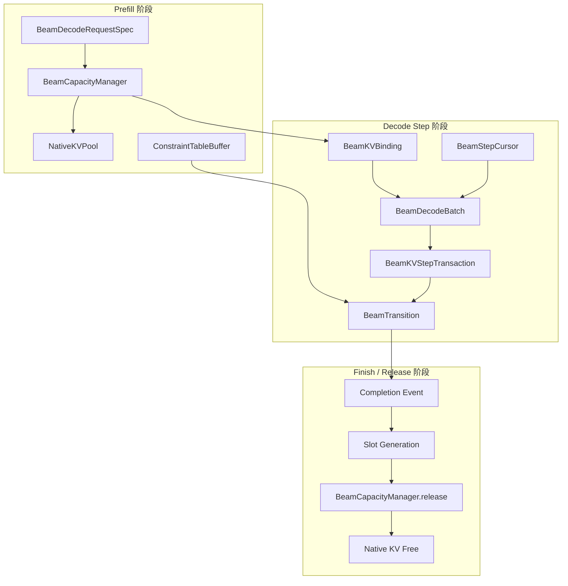

---

## 5. 公共数据契约

### 5.1 BeamDecodeRequestSpec

```python
@dataclass(frozen=True)
class BeamDecodeRequestSpec:
    session_id: str
    max_beam_width: int
    max_decode_steps: int
    constraint_table_id: str | None
    constraint_table_version: int | None
```

它描述逻辑 Session 的最坏资源需求，用于 Admission 和 Bucket 选择。

### 5.2 BeamKVBinding

一个独立 Beam Session 对应一个 Binding 和一个 Slot：

```python
@dataclass(frozen=True)
class BeamKVBinding:
    session_id: str
    bucket_id: str
    slot_id: int
    generation: int
    capacity_beam_width: int
    max_decode_steps: int
```

不在 Binding 中放 Batch 级 `slot_ids`。多个 Binding 由 `BeamDecodeBatch` 组织。

### 5.3 BeamStepCursor

```python
@dataclass(frozen=True)
class BeamStepCursor:
    decode_index: int
    materialized_kv_len: int
    selected_token_count: int
```

统一使用 0-based：

```text
第一次 Decode Forward:
    decode_index = 0
    materialized_kv_len = 0
    selected_token_count = 1
```

NPU 算子如果使用 1-based `decode_step`，转换只发生在 NPU Provider 内：

```text
npu_decode_step = decode_index + 1
```

### 5.4 BeamDecodeBatch

```python
@dataclass(frozen=True)
class BeamDecodeBatch:
    bindings: tuple[BeamKVBinding, ...]
    cursor: BeamStepCursor
    active_beam_width: int
    next_beam_width: int
    input_token_ids: DeviceTensor
    active_mask: DeviceTensor | None
```

物理容量宽度与当前执行宽度必须区分：

```text
capacity_beam_width >= active_beam_width
capacity_beam_width >= next_beam_width
```

### 5.5 BeamTransition

```python
@dataclass(frozen=True)
class BeamTransition:
    parent_beam_ids: DeviceTensor
    selected_token_ids: DeviceTensor
    selected_scores: DeviceTensor
    next_constraint_state_ids: DeviceTensor | None
    finished_mask: DeviceTensor | None
    requires_next_forward: bool
```

公共顺序是最终语义 Beam 顺序，不要求按 Parent 分组。NPU Provider 可以在内部生成 grouped parent、permutation 和 prefix sum。

### 5.6 Provider Opaque View

Common 层不读取平台私有 Tensor Tuple：

```python
@dataclass
class BeamKVLayerStepView:
    history_read_view: object
    current_write_target: object
```

`object` 可以是：

- CUDA Append-only Arena View；
- CUDA Dense Suffix View；
- NPU K/V Tensor Tuple；
- 专用 Kernel 的 BeamPath/Index Metadata。

### 5.7 数据对象关系图

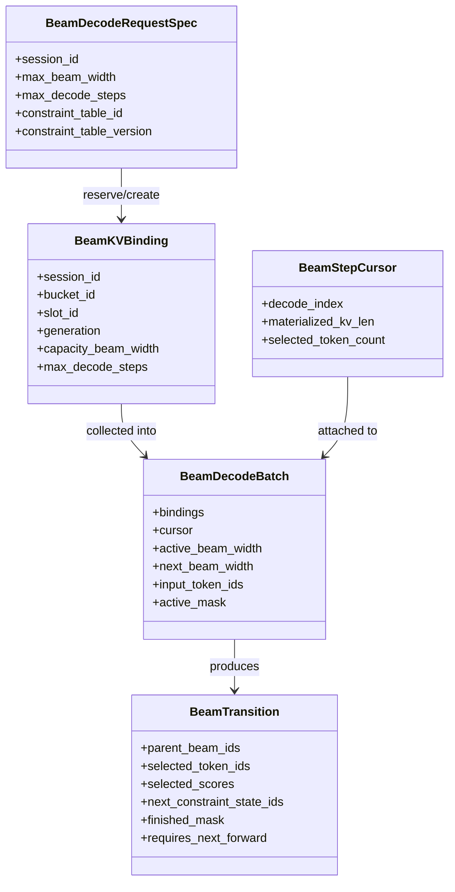

---

## 6. 物理资源模型

### 6.1 四类设备资源

```text
NativeKVPool
    Prompt、Shared Prefix、普通请求和 Prefix Cache

BeamKVPool
    Beam Decode Suffix

BeamDecodeScratch
    Token、Score、Parent、TopK、Constraint State、Mask、Graph Input/Output

ConstraintTableBuffer
    模型/Catalog 级只读合法生成表
```

它们不能混成一个无边界的 `BeamSearchBufferPool`。

### 6.2 统一 CachePlan

BeamKV 不能在 Native Paged KV 已经消耗全部可用缓存预算后再额外申请。统一预算为：

```text
M_device_budget
  = M_requested
  - M_weights
  - M_peak_activation
  - M_non_framework
  - M_graph
  - M_workspace
  - M_constraint_table
  - M_safety_margin

M_native_kv + M_beam_kv + M_beam_scratch
    <= M_device_budget
```

初始化顺序：

```text
Worker Profile
    -> Platform 估算 BeamKV/Graph/Workspace
    -> EngineCore 汇总所有 Rank
    -> 生成统一 GRCachePlan
    -> Worker 申请 NativeKV + BeamKV + Scratch
    -> Warmup Kernel
    -> Capture Graph Bucket
    -> 校验实际显存
```

### 6.3 CachePlan 数据流图

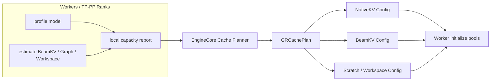

### 6.4 Bucket 与 Slot

按执行容量建立固定 Bucket：

```python
BeamKVPoolConfig(
    buckets={
        "w32_t64": BeamKVBucket(
            capacity_beam_width=32,
            max_decode_steps=64,
            num_slots=8,
        ),
        "w128_t16": BeamKVBucket(
            capacity_beam_width=128,
            max_decode_steps=16,
            num_slots=4,
        ),
    }
)
```

请求选择最小可容纳 Bucket：

```text
request W=24,T=48 -> w32_t64
request W=80,T=12 -> w128_t16
```

### 6.5 Bucket/Slot 结构图

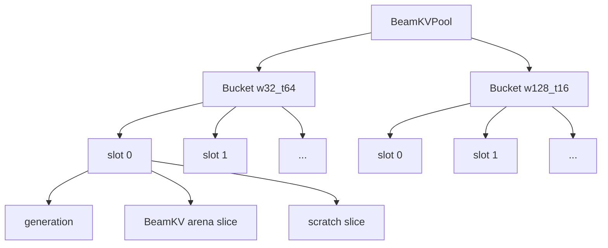

### 6.6 跨 Worker 容量

每个 Bucket 的全局 Slot 数是所有相关 Worker 可支持容量的最小值：

```text
C_global(bucket)
    = min(C_worker_0, C_worker_1, ..., C_worker_n)
```

相同逻辑 `slot_id` 在所有相关 TP/PP Worker 上都必须合法，但不要求映射到相同物理地址。

### 6.7 禁止在线 Regrow

服务期间不允许：

```text
Pool 不足
    -> 申请更大 Tensor
    -> 复制旧 KV
    -> 替换 data_ptr
```

原因包括：

- 活跃 Session View 失效；
- CUDA Graph/ACLGraph 地址失效；
- CachePlan 不再可信；
- NativeKV 和 BeamKV 总预算可能越界；
- 多 Worker 容量不再一致。

需要改变容量时，应执行受控 Reconfigure：停止 Admission、Drain Session、销毁 Graph 和 Pool、重新规划并启动。

---

## 7. Scheduler Admission

### 7.1 Beam Slot 是一等调度资源

请求可执行条件为：

```python
admissible = (
    token_budget_available
    and native_kv_available
    and beam_slot_available
    and beam_scratch_available
    and constraint_table_available
)
```

Graph 是否命中不属于 Admission 条件。Graph Miss 可以 Eager，Beam Slot 不足必须等待。

### 7.2 原子 Reservation

推荐 Scheduling Transaction：

```python
beam_reservation = beam_capacity_manager.try_reserve(request_spec)
if beam_reservation is None:
    request.status = WAITING_FOR_BEAM_KV
    continue

native_blocks = kv_cache_manager.allocate_slots(request, num_new_tokens)
if native_blocks is None:
    beam_capacity_manager.rollback(beam_reservation)
    continue

binding = beam_capacity_manager.commit(beam_reservation)
scheduler_output.beam_kv_bindings[request.session_id] = binding
```

任何一步失败都不能留下半分配资源。

### 7.3 Admission 时序图

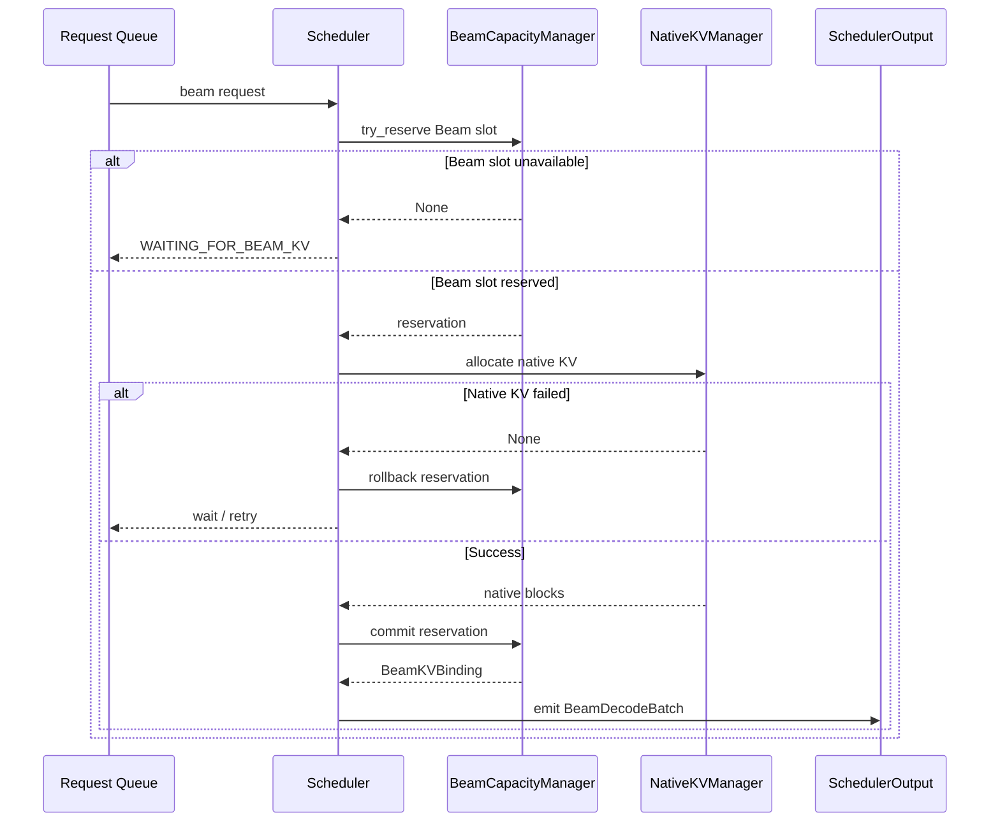

### 7.4 Reservation 时机

第一版在进入 Prefill 前预留完整 Beam Window：

```text
Native KV + BeamKV + Scratch
    all-or-nothing
```

这样不会出现 Prompt 已经占用大量 Native KV，但 Prefill 完成后长期等待 Beam Slot 的资源僵局。

### 7.5 Slot 状态

稳定状态机：

```text
FREE
  -> ACTIVE
  -> RELEASING
  -> FREE
```

`RESERVED` 可以仅作为一次 Scheduler Transaction 内的临时状态。如果未来存在跨 Worker 动态 Bind 或请求级 Workspace 申请，再扩展为长期 `RESERVED -> ACTIVE` ACK 流程。

### 7.6 Slot 生命周期图

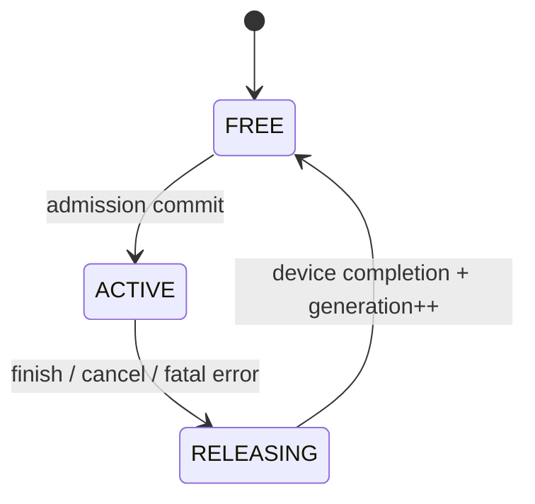

### 7.7 Worker 安全检查

Worker 仍需验证：

```python
assert binding.bucket_id in local_pools
assert 0 <= binding.slot_id < bucket.num_slots
assert binding.generation == local_slot.generation
assert batch.active_beam_width <= binding.capacity_beam_width
assert batch.next_beam_width <= binding.capacity_beam_width
assert batch.cursor.decode_index < binding.max_decode_steps
assert local_slot.state == ACTIVE
```

这些检查是最后安全防线，不承担 Admission Policy。

---

## 8. 请求生命周期

### 8.1 Prefill

```text
Beam Request Admission
    -> Native KV 与 Beam Slot Reservation
    -> Prefill 使用 Native Paged KV
    -> Prompt KV 写入 Shared Prefix
    -> LM Head / Constraint Step 0
    -> 选择初始 Beam Tokens y0
```

此时：

```text
KV(y0) 尚未写入 BeamKV
```

第一次 Decode Forward 负责生成 `KV(y0)`。

### 8.2 完整生命周期图

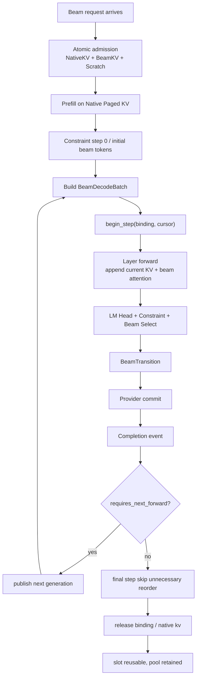

### 8.3 Decode Step

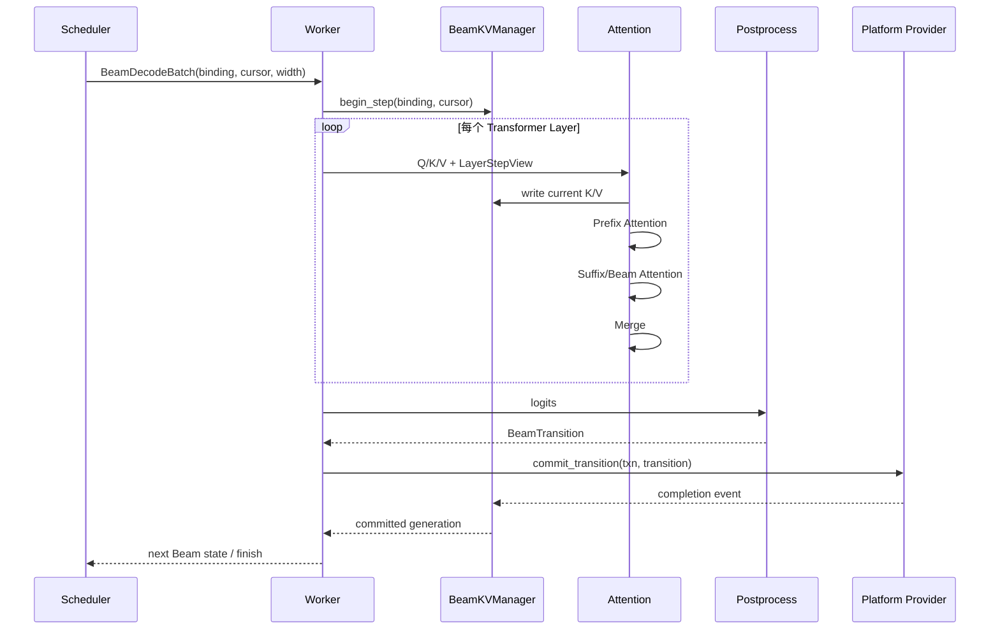

### 8.4 每层严格执行顺序

```text
1. Q/K/V Projection
2. 将当前 Token K/V 写入 current_write_target[decode_index]
3. 当前层 Attention 读取：
   - Native Shared Prefix KV
   - 已提交的 Beam 历史 KV
   - 当前层刚写入的当前 Token K/V
4. Prefix Attention
5. Suffix/Beam Attention
6. LSE Merge 或专用融合 Attention
7. Output Projection / 下一层
```

当前 K/V 是 Provisional 的含义是：

- 对本层当前 Attention 可见；
- 在整个 Step Commit 前，不对下一 Generation 的逻辑 Beam 状态可见。

### 8.5 Layer 内部数据流图

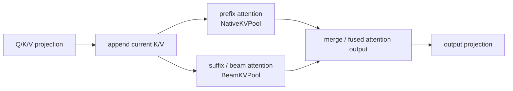

### 8.6 Step Commit

```python
txn = beam_kv_manager.begin_step(binding, cursor)

logits = model_runner.forward(
    scheduler_output,
    beam_kv_step=txn,
)

transition = postprocess.select(logits, beam_state)

completion = beam_kv_manager.commit_transition(
    txn,
    transition,
)

beam_execution_state.publish(
    transition,
    completion.generation,
)
```

### 8.7 Finish 与释放

```text
最后一次 Forward
    -> Final Beam Select
    -> requires_next_forward = false
    -> 跳过下一轮专用 KV Reorder
    -> 等待最后 Device Event
    -> Slot Generation 失效
    -> Slot 进入 FREE
    -> Native KV 按正常请求流程释放
    -> BeamKVPool Tensor 保留
```

---

## 9. Beam Parent 与 KV Commit

### 9.1 Parent 是核心语义

例如：

```text
parent_beam_ids = [3, 1, 1, 1]
```

下一代四个 Beam 的历史分别来自旧 Beam 3、1、1、1。若不处理 Parent，下一轮 Token 与 KV 历史将不匹配。

因此每个 Step 必须产生：

```text
Parent IDs
Selected Token IDs
Selected Scores
```

并在发布新 Beam 状态前完成对应 KV Commit。

### 9.2 Beam 语义变化图

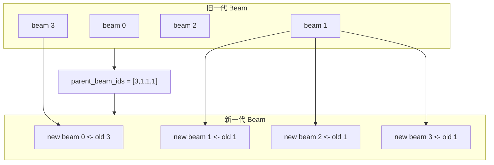

### 9.3 两类 Commit 模式

#### Lineage Commit

```text
BeamKV Append-only
Parent IDs 写入 BeamPath/Lineage
下一步 Attention 按祖先关系读取历史 KV
```

优点：

- Beam 复制不搬历史 KV；
- 适合 CUDA 专用 Kernel；
- 与 NVIDIA SID-GR 语义一致。

#### Physical Reorder Commit

```text
根据 Parent IDs
将 [0 : decode_index + 1] 的 Beam KV
重排为下一代 Beam 顺序
```

优点：

- 下一步 Attention 读取简单连续历史；
- 适合 ACS NPU 路径；
- 可以复用普通 Dense Suffix Attention。

Common 层不感知使用哪一种模式。

### 9.4 Commit 数据流图

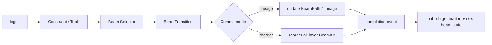

### 9.5 Commit 可见性

```text
所有 Layer 的 KV Append/Commit 完成
    -> Device Completion Event
    -> committed_generation++
    -> 发布新 Parent/Token/Score
```

禁止：

```text
先发布新 Token/Parent
    -> 后续才异步完成部分 Layer KV Reorder
```

### 9.6 Failure 语义

- Commit 前失败：新 Generation 不发布，Provisional 区域可忽略；
- CUDA Lineage Commit 失败：旧 Generation 仍是唯一已发布状态；
- NPU 原地 Reorder 中失败：不承诺通用 Rollback，Session 标记 Fatal；
- Fatal Session 的 Slot 进入 `RELEASING`；
- 等待所有迟到 Device 操作完成后，Generation 才能失效和复用。

事务是逻辑发布事务，不承诺所有平台都有硬件级回滚能力。

---

## 10. CUDA Provider

### 10.1 推荐布局

```text
BeamKV[layer]
    [slot, step, beam, kv_head, head_dim]
```

或者等价的 Step-major 布局。要求：

- 当前 Step Append 地址稳定；
- Pool Base 和 Slot Stride 固定；
- Lineage Metadata 使用固定 Buffer；
- Attention 可根据 Parent Path 读取祖先 KV。

### 10.2 Lineage 模式

```text
Step s:
    写 BeamKV[:, s, :]
    Beam Select 得到 parent[s, :]
    Commit 只更新 parent/score/token metadata

Step s+1 Attention:
    根据 parent history 找到每个历史 Step 的祖先 Beam
```

这与 NVIDIA 的 `BeamKV + BeamPath/topk_indices + GR Decode Attention` 对齐。

### 10.3 CUDA 数据流图

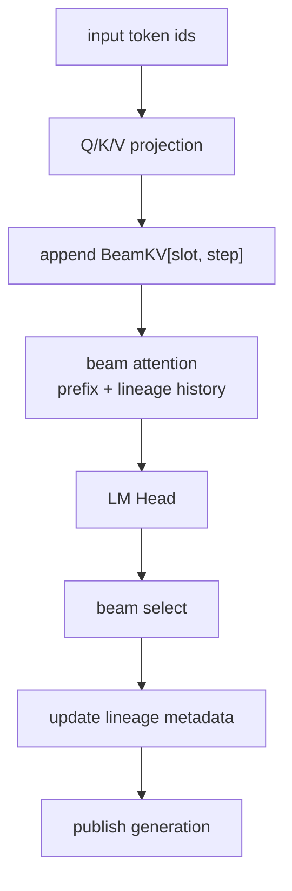

### 10.4 Dense Reorder 模式

在专用 Lineage Attention 尚未完成时，可以使用：

```text
Dense BeamKV
+ Prefix FA
+ Suffix FA
+ LSE Merge
+ Physical Reorder
```

它与旧 Incremental Decode 原型更接近，但仍必须使用本文统一的 Binding、Admission、Cursor 和 Transition。

### 10.5 CUDA Provider 接口

```python
class CudaBeamKVProvider(BeamKVProvider):
    def layer_step_view(self, binding, cursor, layer_idx): ...
    def append_current_kv(self, view, key, value): ...
    def run_beam_attention(self, query, prefix_ref, view): ...
    def commit_transition(self, txn, transition): ...
    def release(self, binding): ...
```

---

## 11. NPU Provider

### 11.1 推荐布局

沿用 ACS 的连续形式：

```text
BeamKV[layer]
    [slot, beam, kv_head, max_decode_steps, head_dim]
```

### 11.2 每层路径

```text
cache_unshared_kv
    -> 写当前 Step K/V

x_attention
    -> 读取 Shared Paged Prefix
    -> 读取 Unshared Beam History
    -> 输出 Attention Result
```

### 11.3 NPU 数据流图

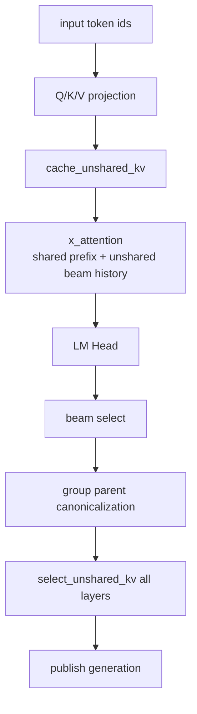

### 11.4 Step Commit

```text
Beam Selection
    -> 原始 parent_beam_ids
    -> NPU 私有 Parent Canonicalization
    -> grouped parent / permutation / group prefix sums
    -> 对所有 Layer 调用 select_unshared_kv
    -> Completion Event
    -> Publish Generation
```

公共 `BeamTransition` 保持语义顺序，不暴露 NPU 私有 grouped 顺序。

### 11.5 Final Step

如果：

```text
requires_next_forward = false
```

则无需为了下一轮 Attention 重排全部历史 KV。可以直接执行 Final Beam Select 并完成请求。

### 11.6 NPU Step 转换

Common Cursor 使用 0-based：

```text
decode_index = 0,1,2,...
```

NPU Provider 内转换为算子需要的 1-based：

```text
npu_decode_step = decode_index + 1
```

不能在 Common 层混用两套定义。

---

## 12. Attention Backend Contract

统一逻辑输入：

```python
beam_attention(
    query,
    prefix_kv_ref,
    beam_layer_step_view,
    active_beam_width,
    cursor,
)
```

### 12.1 PrefixKVRef

物理实现可以是：

```text
PagedPrefixKVRef
    vLLM-GR / ACS

DenseContextKVRef
    NVIDIA SID-GR Reference
```

Common 层不要求把 vLLM Paged Prefix 转换成 NVIDIA Dense ContextKV。

### 12.2 Layer Index

正式 ABI 使用明确 `layer_idx` 或 Layer 初始化时绑定的稳定索引：

```python
beam_kv_pool.key[layer_idx]
beam_kv_pool.value[layer_idx]
```

不使用 `id(kv_cache)` 作为跨模块正式接口。

### 12.3 Attention 输入图

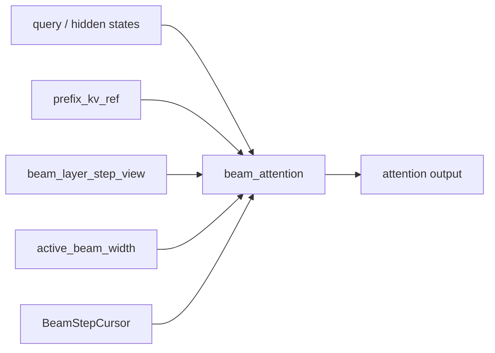

### 12.4 无 Forward 动态分配

在 Forward 热路径中禁止：

- 新建 Beam Pool；
- Pool Regrow；
- 替换 Metadata Tensor；
- 为每层构造 Python `pools[id(kv_cache)]` 字典；
- 动态创建 Graph 输入 Buffer。

允许更新固定 Tensor 的内容。

---

## 13. Graph 设计

### 13.1 Capacity 与 Graph 分离

```text
Capacity Admission:
    请求是否拥有合法 Beam Slot？

Graph Dispatch:
    当前执行 Shape 是否有匹配 Executable？
```

结果：

- Capacity 失败：请求等待；
- Graph Miss：使用 Eager/Piecewise 或受控 Capture；
- Graph Miss 不能绕过 Slot 限制。

### 13.2 Graph Key

```python
@dataclass(frozen=True)
class BeamGraphKey:
    platform: str
    runtime_mode: str
    num_sessions_bucket: int
    beam_width: int
    query_len: int
    dtype: str
    kv_layout: str
    attention_backend: str
    postprocess_variant: str
    tp_size: int
```

通常不进入 Key：

- Request ID；
- Slot ID；
- Token ID；
- Parent ID；
- Score；
- 精确 Decode Step，如果 Step 通过固定 Buffer 内容传入。

### 13.3 固定与可变对象

固定地址：

- NativeKVPool / BeamKVPool；
- 每层 K/V View；
- Input、Position、Slot、Step Buffer；
- Parent、Score、Mask Buffer；
- Attention Metadata；
- Output 和 Workspace；
- Scratch Arena。

可变内容：

- Slot ID；
- Decode Step；
- Parent ID；
- Token、Score；
- Active Mask；
- Block Table 内容。

### 13.4 Graph Dispatch 数据流图

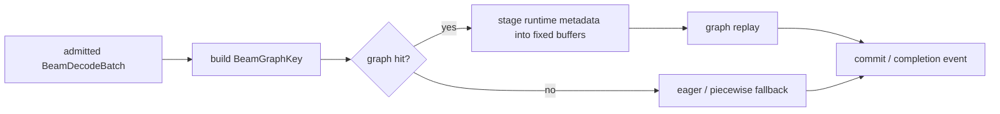

### 13.5 Capture 边界

架构支持：

```text
Piecewise
Full Forward
Full Step
Fixed Window
```

无论捕获范围如何，都必须保持：

```text
Device Completion
    -> Generation Publish
```

Graph 只是执行优化，不改变事务语义和资源所有权。

---

## 14. 与三套实现的兼容关系

| 维度 | NVIDIA SID-GR | ACS_vllm-GR | 统一方案 |
| --- | --- | --- | --- |
| Prefix KV | Dense ContextKV | Native Paged KV | `PrefixKVRef`，物理格式由 Provider 决定 |
| Beam KV | Step-major BeamKV | Dense Unshared KV | Provider-specific BeamKVPool |
| Parent | BeamPath/topk indices | Physical reorder | Common BeamTransition，Provider Commit |
| Attention | 专用 GR Decode Kernel | x_attention | CUDA/NPU 独立 Backend |
| Slot | Dense Pool Lease | BufferPool Batch Slice | Scheduler Binding + Worker Fixed Pool |
| Capacity | Serving Pool/Lease | 运行中 Pool 管理 | EngineCore CachePlan + Scheduler Admission |
| Graph | Direct Pool View CUDA Graph | ACLGraph | Provider Graph，统一固定地址原则 |
| Step | Runtime Generation State | BeamSearchContext current_step | 显式 BeamStepCursor |

### 14.1 兼容关系图

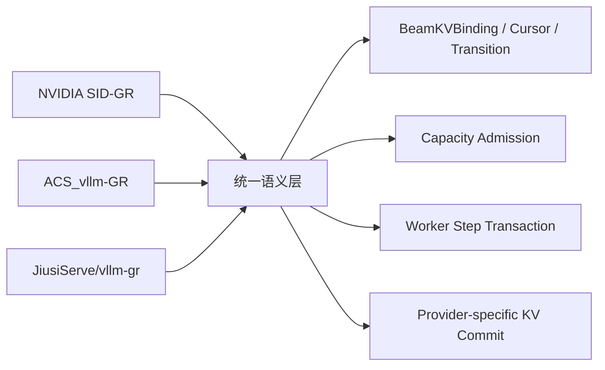

### 14.2 NVIDIA 兼容

统一方案能够直接承载：

- Append-only BeamKV；
- BeamPath/Lineage；
- Active/Next Beam Width；
- Dense Pool Lease；
- Direct Pool View Graph。

不要求 vLLM-GR 把 Paged Prefix 转换为 Dense ContextKV。

### 14.3 ACS 兼容

统一方案能够直接承载：

- Dense Unshared KV；
- `cache_unshared_kv`；
- `x_attention`；
- Parent Grouping；
- `select_unshared_kv`；
- Final-step Reorder Skip；
- ACLGraph 固定 Buffer。

需要移除 ACS 运行时 Lazy Grow，并把 Slot 分配移到 Scheduler Admission。

### 14.4 vLLM-GR 兼容

vLLM-GR 保留：

- EngineCore/Scheduler；
- Native Paged KV；
- Worker/ModelRunner；
- Platform Plugin；
- Serving 和模型加载。

新架构替换当前 Beam 特有的：

- 多 Beam 后缀 Request 重打包；
- 隐式 Beam Request Fork/Abort；
- Scheduler Hot-path Monkey Patch Metadata 依赖；
- ModelRunner 复杂 Row Proxy/Collapse；
- Worker 内部临时 Pool 分配。

---

## 15. 旧 Incremental Decode 文档的定位

旧文档不再作为系统总架构，而应定位为：

> Dense Suffix BeamKV Provider 的实现设计和原型验证记录。

### 15.1 保留内容

- Paged Prefix + Dense Suffix；
- Dense KV Tensor Layout；
- Prefix/Suffix Attention；
- LSE Merge；
- 每层 KV Append；
- 固定地址 Pool；
- GPU Cascade Attention 实现细节。

### 15.2 替换内容

| 旧设计 | 新设计 |
| --- | --- |
| Worker `ensure_capacity()` | EngineCore CachePlan + Scheduler Admission |
| 运行时 Regrow | 初始化固定 Pool，服务期禁止 Grow |
| 单调不回收 Slot | Slot Release + Generation Safe Reuse |
| Registry 隐式 `advance_step()` | 显式 `BeamStepCursor` + Commit Publish |
| `id(kv_cache)` Layer Key | 明确 `layer_idx` |
| Beam Pruning 未来实现 | BeamTransition + Provider Commit 核心语义 |
| View 携带 Python Pool 字典 | Provider Opaque LayerStepView |
| GPU/NPU 共用 Dense 逻辑 | CUDA/NPU 独立 Provider |

---

## 16. 推荐代码组织

```text
vllm_gr/
  beam/
    types.py
      BeamDecodeRequestSpec
      BeamKVBinding
      BeamStepCursor
      BeamDecodeBatch
      BeamTransition

    capacity.py
      BeamCapacityManager
      BeamKVPoolConfig
      BeamKVBucketConfig

    manager.py
      BeamKVManager
      BeamKVStepTransaction
      SlotGenerationState

    provider/
      base.py
      cuda.py
      npu.py

    attention/
      contract.py
      cuda_backend.py
      npu_backend.py

    postprocess/
      constraint_backend.py
      beam_selector.py

    graph/
      key.py
      cuda_runner.py
      npu_runner.py
```

控制面集成：

```text
Scheduler
    -> BeamCapacityManager
    -> SchedulerOutput.beam_kv_bindings

ModelRunner
    -> BeamKVManager.begin_step
    -> Provider LayerStepView
    -> Postprocess
    -> Provider Commit
```

### 16.1 代码位置图

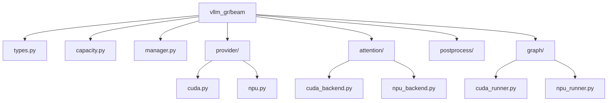

---

## 17. 核心不变量

### 17.1 容量

```text
所有 ACTIVE/RELEASING Session 占用 Slot
    <= CachePlan 公布的全局物理 Slot 容量
```

### 17.2 Binding

```text
binding.generation == local_slot.generation
```

### 17.3 Step

```text
decode_index < max_decode_steps
materialized_kv_len == decode_index
selected_token_count == decode_index + 1
```

### 17.4 Attention

```text
当前层 Attention 开始前
    当前 Token K/V 已写入 current_write_target
```

### 17.5 发布

```text
所有 Layer KV Commit 完成
    -> Completion Event
    -> committed_generation++
    -> Parent/Token/Score 可见
```

### 17.6 释放

```text
Slot 只有在最后 Device Event 完成后
    才能 Generation 失效并重新分配
```

### 17.7 平台边界

```text
Common BeamTransition
    不包含 CUDA/NPU 私有 Tensor Layout 和 Parent Grouping ABI
```

---

## 18. 测试与验收

### 18.1 语义一致性

逐 Step 验证：

- Parent Beam IDs；
- Selected Token IDs；
- Accumulated Scores；
- Final Item List；
- EOS/Finished Mask；
- Constraint State。

### 18.2 KV 正确性

逐 Layer、逐 Step 验证：

- 当前 K/V 写入位置；
- Parent `[3,1,1,1]` 等复制场景；
- Lineage 与 Physical Reorder 结果等价；
- Final Step Skip 不影响最终输出；
- Slot 复用后无旧数据污染。

### 18.3 容量与调度

验证：

- Beam Slot 满时请求不下发；
- Native KV 分配失败时 Beam Reservation 回滚；
- Grouped Request 按独立 Session 数计 Slot；
- 多 Worker 使用全局最小容量；
- Cancel/Timeout/Failure 最终归还 Slot；
- Releasing Slot 不被提前复用。

### 18.4 Graph

验证：

- Pool 和 Graph Buffer `data_ptr()` 稳定；
- Graph Replay 与 Eager 输出一致；
- Graph Miss 不绕过 Capacity；
- Padding Row 不写入 Live Slot；
- Graph Capture 内无动态 Tensor 替换。

### 18.5 可观测性

建议指标：

```text
beam_slot_capacity{bucket}
beam_slot_active{bucket}
beam_slot_releasing{bucket}
beam_admission_wait_total
beam_reservation_rollback_total
beam_generation_mismatch_total
beam_commit_failure_total
beam_slot_reuse_total
beam_graph_hit_total
beam_graph_fallback_total
beam_kv_bytes
beam_scratch_bytes
```

---

## 19. 最终设计决策

1. 系统主架构采用 `Scheduler BeamCapacityManager + Worker BeamKVManager + Platform BeamKVProvider`；
2. Native Prefix KV 与 Beam Decode KV 是并列物理资源，由 EngineCore 统一规划；
3. BeamKV 物理 Pool 在初始化阶段申请，服务期间禁止动态 Grow；
4. 每个 Beam Session 对应一个 `BeamKVBinding` 和一个稳定 Slot；
5. 多 Session Batch 使用 `BeamDecodeBatch` 聚合 Binding；
6. `capacity_beam_width`、`active_beam_width` 和 `next_beam_width` 必须区分；
7. Common Step 使用 0-based `BeamStepCursor`；
8. Beam Parent、Token、Score 通过统一 `BeamTransition` 发布；
9. CUDA 使用 Lineage 或 Dense Reorder Provider，NPU 使用 ACS 风格 Physical Reorder Provider；
10. 当前 Token K/V 必须先写后读；
11. KV Commit 完成前禁止发布新一代 Beam 状态；
12. Slot Generation 更新必须晚于最后 Device Event；
13. Graph 只优化执行，不改变 Admission、Binding 和 Commit 语义；
14. 旧 Incremental Decode 设计降级为 Dense Suffix Provider 实现文档；
15. 当前 vllm-gr Beam Request 重打包链路不作为新架构兼容约束。

---

## 20. 代码与资料索引

### 设计文档

- `GR/beam_kv_cache_architecture_and_scheduling_design.md`
- `zhanghanleo10/vllm-gr-summary/02-inference-engine/beam-search/incremental-decode/01_incremental_decode_architecture.md`

### NVIDIA SID-GR

- `examples/sid-gr-inference/src/gr_inference/gr_kv/context_kv.py`
- `examples/sid-gr-inference/src/gr_inference/gr_kv/beam_kv.py`
- `examples/sid-gr-inference/src/gr_inference/gr_kv/beam_path.py`
- `examples/sid-gr-inference/src/gr_inference/gr_kernels/attention/gr_decode_attention.py`
- `examples/sid-gr-inference/src/gr_inference/gr_serving/continuous.py`
- `examples/sid-gr-inference/src/gr_inference/gr_serving/memory.py`

### ACS_vllm-GR

- `vllm-ascend/vllm_ascend/beam_search/context.py`
- `vllm-ascend/vllm_ascend/attention/attention_v1.py`
- `vllm-ascend/vllm_ascend/ops/xllm_ops.py`

### JiusiServe/vllm-gr

- `vllm_gr/v1/engine/scheduler_metadata.py`
- `vllm_gr/v1/engine/core.py`
- `vllm_gr/v1/worker/model_runner_common.py`
- `vllm_gr/v1/attention/backends/beam_attn_metadata.py`
- `vllm_gr/v1/attention/backends/beam_attn_gpu.py`
- `vllm_gr/v1/attention/backends/beam_attn_npu.py`
