# vLLM-GR Decode BeamKV Cache 架构、数据流与容量调度设计

> 状态：Design Draft  
> 基线：vLLM `releases/v0.22.1`、`JiusiServe/vllm-gr`、`NVIDIA/recsys-examples`、`ACS_vllm-GR`  
> 范围：Decode 阶段 Beam KV Cache 的内存规划、生命周期、GPU/NPU 平台实现、数据流和 Scheduler admission  
> 非目标：本文不改变 Beam ranking、Catalog constraint、EOS、返回格式等上层语义。

## 目录

- [1. 结论摘要](#1-结论摘要)
- [2. 背景与问题定义](#2-背景与问题定义)
- [3. vLLM 原生 KV Cache 的设计理念](#3-vllm-原生-kv-cache-的设计理念)
- [4. 目标架构与所有权划分](#4-目标架构与所有权划分)
- [5. 核心对象与状态不变量](#5-核心对象与状态不变量)
- [6. 初始化阶段：显存汇总与物理 Pool 申请](#6-初始化阶段显存汇总与物理-pool-申请)
- [7. BeamKV 物理容量模型](#7-beamkv-物理容量模型)
- [8. 请求阶段：BeamKV 端到端数据流](#8-请求阶段beamkv-端到端数据流)
- [9. 单个 Decode Step 的事务模型](#9-单个-decode-step-的事务模型)
- [10. 容量安全与 Scheduler Admission](#10-容量安全与-scheduler-admission)
- [11. 释放、销毁、抢占与异常处理](#11-释放销毁抢占与异常处理)
- [12. CUDA BeamKV Provider 设计](#12-cuda-beamkv-provider-设计)
- [13. NPU BeamKV Provider 设计](#13-npu-beamkv-provider-设计)
- [14. ACS、NVIDIA 与目标方案对比](#14-acsnvidia-与目标方案对比)
- [15. 与 L0/L1/L2 执行层级的关系](#15-与-l0l1l2-执行层级的关系)
- [16. CUDA Graph / ACLGraph 与 BeamKV 联动设计](#16-cuda-graph--aclgraph-与-beamkv-联动设计)
- [17. 推荐接口与代码组织](#17-推荐接口与代码组织)
- [18. 对当前 vLLM-GR 代码的改造点](#18-对当前-vllm-gr-代码的改造点)
- [19. 可观测性、测试与验收标准](#19-可观测性测试与验收标准)
- [20. 分阶段实施建议](#20-分阶段实施建议)
- [21. 最终设计决策](#21-最终设计决策)
- [22. 代码与资料索引](#22-代码与资料索引)

---

## 1. 结论摘要

Decode BeamKV 的推荐设计不是继续把 Beam suffix 当作普通 vLLM Paged KV，也不是让
Worker 在请求到达后从“剩余 HBM”临时申请一块 Tensor，而是：

1. `NativeKVPool` 与 `BeamKVPool` 是并列的两类物理缓存；
2. `NativeKVPool` 保存普通请求、Prompt、共享 Prefix、Prefix Cache；
3. `BeamKVPool` 只保存 Beam decode suffix；
4. EngineCore 负责汇总各 Worker 的显存报告，统一规划 Native/Beam/Workspace 容量；
5. Worker/ModelRunner 根据 EngineCore 下发的配置，在本地设备上真正申请物理 Tensor；
6. Scheduler 必须把 Beam slot 当作一等资源，先 reservation，再下发请求；
7. Worker 不能自行决定 slot，只能使用 Scheduler 下发的 `BeamKVBinding`；
8. Common 层统一的是 Beam lineage、step cursor、transition 和事务可见性；
9. CUDA/NPU 不共享物理布局、Tensor tuple、重排算法或图执行参数；
10. CUDA 推荐使用 append-only BeamKV + lineage/BeamPath，避免复制历史 KV；
11. NPU 第一版推荐沿用 ACS 连续 Beam slot + `cache_unshared_kv` + `select_unshared_kv`；
12. 最后一步如果没有下一次 forward，跳过只服务于下一步 Attention 的 KV reorder；
13. 请求结束时只释放 slot 的逻辑所有权，物理 BeamKVPool 保留并复用；
14. 物理 Pool 只在 Worker shutdown、模型卸载或 CachePlan 重配置时销毁。

核心资源不变量：

```text
所有 RESERVED/ACTIVE/RELEASING session 占用的 slot 数量
    <= 启动阶段确认的全局物理 slot 容量
```

核心发布不变量：

```text
所有 Layer 的 Beam KV commit 完成
    -> committed_generation 更新
    -> 新 token / score / parent Beam 状态可见
```

---

## 2. 背景与问题定义

### 2.1 为什么 Beam decode 不能完全使用普通 Paged KV

普通自回归请求的 KV 生命周期通常是线性的：

```text
request token 0 -> token 1 -> token 2 -> ...
```

BeamSearch 的 decode history 是一棵动态树：

```text
shared prompt
  -> beam 0
  -> beam 1
  -> beam 2
       -> child 0
       -> child 1
```

每一步不仅会新增 token，还会产生：

- `parent_beam_ids`；
- 新的语义 Beam 顺序；
- Beam 淘汰和复制；
- score、token、constraint state、finished mask 的同步更新；
- 下一步 Attention 对祖先 KV 的读取关系。

如果继续完全使用普通 Paged KV，需要在每一步将新的 Beam 语义顺序映射回 Block Table，
或者执行 KV block copy。对于固定 Beam width、短 decode 的 GR 场景，这会把大量框架控制和
metadata 开销带入每个 step。

### 2.2 需要解决的四个问题

本文集中回答：

1. BeamKV 抽象放在 EngineCore、Scheduler、Worker、ModelRunner 还是 Attention；
2. BeamKV 物理内存在哪里申请、何时释放；
3. 如何在同一架构下支持 CUDA 与 Ascend NPU；
4. 物理容量有限时，Scheduler 如何保证请求不会越界或过度下发。

### 2.3 目标与非目标

目标：

- 保留 vLLM 控制面和 continuous batching；
- 支持普通请求与 Beam 请求混部；
- 支持 CUDA/NPU 对等、延迟加载和平台代码可剥离；
- 支持固定地址的 CUDA Graph/ACLGraph；
- 支持 L0 stepwise、L1 engine-resident、L2 fixed-window；
- 明确 cancel、finish、timeout、preemption、failure 的清理语义；
- 防止物理越界、双重分配和 slot 复用污染。

非目标：

- 不要求 CUDA/NPU 使用相同 KV layout；
- 不要求 CUDA/NPU 使用相同私有 Tensor 返回结构；
- 不要求第一版支持 BeamKV swap；
- 不要求第一版支持在线 Pool 扩容；
- 不将 Catalog、EOS、ranking 语义下沉给 Platform Provider；
- 不将 ModelRunner V2 升级混入 BeamKV 第一阶段。

---

## 3. vLLM 原生 KV Cache 的设计理念

### 3.1 一句话理解 Paged KVCache

vLLM 的 Paged KVCache 不是“请求到达后为该请求申请一块 GPU Tensor”，而是：

> Worker 启动时一次性申请物理 KV 大池；请求运行时，Scheduler 只分配逻辑 block ID；
> ModelRunner 将 block ID 组织为 BlockTable 和 SlotMapping；Attention 据此读写固定物理大池；
> 请求结束时只归还逻辑 Block，物理 Tensor 继续常驻并复用。

这里有两种完全不同的“申请”：

| 申请类型 | 发生时间 | 执行位置 | 实际内容 |
| --- | --- | --- | --- |
| 物理内存申请 | Engine 初始化 | Worker/ModelRunner | 创建设备上的 KVCache Tensor |
| 逻辑 Block 申请 | 每轮请求调度 | Scheduler/KVCacheManager | 从 BlockPool 取得 block ID |

### 3.2 三层数据结构

Paged KVCache 可以拆成三个平面：

| 平面 | 核心对象 | 主要位置 | 职责 |
| --- | --- | --- | --- |
| 容量规划 | `KVCacheSpec`、`KVCacheConfig` | EngineCore + Worker report | 决定物理池能容纳多少 Block |
| 逻辑管理 | `KVCacheManager`、`BlockPool`、`KVCacheBlock` | Scheduler | 请求所有权、Prefix Cache、ref count、抢占、释放 |
| 执行寻址 | `BlockTable`、`slot_mapping`、Attention metadata | ModelRunner/Worker | 把 request token 映射到物理 KV 地址 |

其中：

- `KVCacheBlock` 只是 Python 逻辑元数据，不持有 K/V Tensor；
- `block_id` 是连接 Scheduler 逻辑管理和 Worker 物理 Tensor 的桥梁；
- Scheduler 不直接访问设备 KV；
- Worker 不自行决定请求应获得哪个 Block。

### 3.3 端到端总览

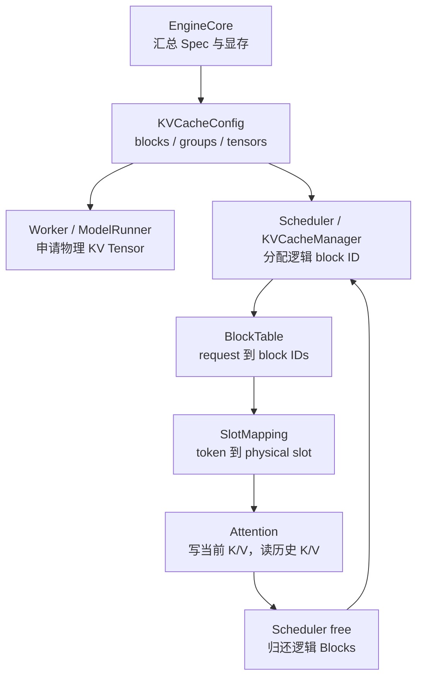

### 3.4 初始化：从 Layer Spec 到物理 Tensor

#### 3.4.1 收集每一层的 KVCacheSpec

EngineCore 首先执行：

```python
kv_cache_specs = self.model_executor.get_kv_cache_specs()
```

调用链为：

```text
EngineCore
  -> Executor.get_kv_cache_specs()
  -> GPUWorker.get_kv_cache_spec()
  -> GPUModelRunner.get_kv_cache_spec()
  -> Attention.get_kv_cache_spec()
```

普通 decoder Full Attention 产生的逻辑描述类似：

```python
FullAttentionSpec(
    block_size=block_size,
    num_kv_heads=num_kv_heads,
    head_size=head_size,
    dtype=kv_cache_dtype,
)
```

`KVCacheSpec` 描述每个 Layer 需要的缓存类型、Block 大小、KV Heads、Head Dimension、dtype
和 Page 大小。此时还没有申请最终物理 KV Tensor。

不同模型可能产生不同 Spec：

- `FullAttentionSpec`；
- `SlidingWindowSpec`；
- `MLAAttentionSpec`；
- `MambaSpec`；
- `CrossAttentionSpec`；
- 多种混合/共享 Cache Spec。

#### 3.4.2 Worker profile 可用显存

每个 Worker 执行：

```python
GPUWorker.determine_available_memory()
```

主要计算关系为：

```text
requested device memory
  - model weights
  - peak activation
  - non-framework allocation
  - CUDA Graph memory estimate
  = available KV cache memory
```

其中：

- `profile_run()` 测量模型 forward 的峰值；
- CUDA Graph 启用时，`profile_cudagraph_memory()` 估算 Graph pool；
- 最终返回的是本 Worker 可用于 KVCache 的字节数。

所以 dummy/profile run 的职责边界是：

| 行为 | 所在位置 |
| --- | --- |
| 发起所有 Worker profile | EngineCore/Executor |
| 真正执行 dummy forward | Worker/ModelRunner |
| 汇总可用显存报告 | EngineCore |
| 决定统一 `num_blocks` | EngineCore |

#### 3.4.3 EngineCore 统一生成 KVCacheConfig

EngineCore 调用：

```python
get_kv_cache_configs(
    vllm_config,
    kv_cache_specs,
    available_gpu_memory,
)
```

主要完成：

1. 合并所有 Worker 的 Layer KVCacheSpec；
2. 按 Attention/State 类型构造 `KVCacheGroupSpec`；
3. 处理 PP Worker 拥有不同 Layer 的情况；
4. 计算各 Worker 可以容纳的 Block 数量；
5. 取所有相关 Worker 的最小值；
6. 按最小 Block 数缩减各 Worker 的 Tensor size；
7. 生成 Worker 和 Scheduler 共用的逻辑配置。

核心不变量：

```text
global_num_blocks = min(worker_0_blocks, worker_1_blocks, ...)
```

因此 Scheduler 下发的任意合法 block ID，在 TP/PP 相关 Worker 上都不会超过物理容量。

最终配置：

```python
KVCacheConfig(
    num_blocks=num_blocks,
    kv_cache_tensors=kv_cache_tensors,
    kv_cache_groups=kv_cache_groups,
)
```

字段语义：

| 字段 | 语义 |
| --- | --- |
| `num_blocks` | Scheduler 可分配的统一逻辑 Block 总数 |
| `kv_cache_tensors` | Worker 应申请的物理 Buffer 大小和共享关系 |
| `kv_cache_groups` | 哪些 Layer 使用同一组 BlockTable 语义 |

#### 3.4.4 Worker 真正申请物理 Tensor

EngineCore 下发每个 Worker 对应的 `KVCacheConfig`：

```text
model_executor.initialize_from_config(kv_cache_configs)
  -> GPUWorker.initialize_from_config()
  -> GPUModelRunner.initialize_kv_cache()
  -> initialize_kv_cache_tensors()
```

通用路径先按字节数申请原始设备 Buffer：

```python
tensor = torch.zeros(
    kv_cache_tensor.size,
    dtype=torch.int8,
    device=self.device,
)
```

再根据 Backend 要求解释为目标 dtype、shape 和 stride：

```python
kv_cache_shape = attn_backend.get_kv_cache_shape(...)
kv_cache = raw_tensor.view(dtype).view(kv_cache_shape)
```

普通 Attention 可以直观理解为：

```text
Layer KVCache:
    [K/V, num_blocks, block_size, num_kv_heads, head_dim]
```

常见逻辑形态为：

```text
[2, num_blocks, block_size, num_kv_heads, head_dim]
```

但 Common 层不能固定这一 shape，因为最终形态由 Attention Backend 的
`get_kv_cache_shape()` 和 `get_kv_cache_stride_order()` 决定。MLA、混合 Cache、量化 KVC
和特定 Backend 都可能使用不同布局。

最终执行：

```python
bind_kv_cache(
    kv_caches,
    static_forward_context,
    model_runner.kv_caches,
)
```

它将物理 Tensor：

- 放入 `ModelRunner.kv_caches`；
- 绑定到每个 Attention Layer 的 `layer.kv_cache`；
- 注册到静态 forward context；
- 必要时注册给 KVConnector。

从这一时刻开始，物理 KV 大池在 Worker 生命周期内持续存在。

### 3.5 Scheduler 如何组织逻辑 Block

EngineCore 完成物理 KV 初始化后，将同一份 Scheduler KVCacheConfig 用来创建：

```python
KVCacheManager(
    kv_cache_config=kv_cache_config,
    ...
)
```

内部主要关系为：

```text
KVCacheManager
  -> KVCacheCoordinator
  -> SingleTypeKVCacheManager per group
  -> shared BlockPool
```

#### 3.5.1 BlockPool 只管理元数据

BlockPool 初始化：

```python
self.blocks = [
    KVCacheBlock(0),
    KVCacheBlock(1),
    ...,
    KVCacheBlock(num_blocks - 1),
]
```

`KVCacheBlock` 主要包含：

- `block_id`；
- `ref_cnt`；
- `block_hash`；
- 是否为 null block；
- Prefix Cache 和 eviction 元数据。

它不持有真正的 K/V Tensor。物理关系是：

```text
KVCacheBlock(block_id=17)
    -> 对应 KV group 内各 Layer 的 kv_cache[..., 17, ...]
```

单一 Full Attention group 下，同一请求的一组 block ID 被该 group 内所有 Layer 使用。
Hybrid KV 场景则为每个 KV group 维护独立 Block 序列和 BlockTable。

#### 3.5.2 请求到 Block 的所有权

每个 SingleType manager 维护：

```python
req_to_blocks: dict[request_id, list[KVCacheBlock]]
```

例如：

```text
request A -> [block 17, block 42, block 53]
request B -> [block 6,  block 31]
request C -> [block 88]
```

BlockPool 维护：

```text
free_block_queue
cached_block_hash_to_block
```

`free_block_queue` 中可能同时存在：

- 没有缓存价值的空闲 Block；
- `ref_cnt == 0`、但仍保留有效 Prefix KV 的可驱逐 Block。

### 3.6 请求阶段的逻辑 Block 申请

#### 3.6.1 Prefix Cache 查询

新请求第一次调度时，Scheduler 调用：

```python
KVCacheManager.get_computed_blocks(request)
```

它根据 Request 的 block hashes 查询最长本地 Prefix Cache 命中，返回：

```text
computed_blocks
num_computed_tokens
```

Prefix Cache 只以完整 Block 为稳定复用单位。即使 Prompt 全部命中，也至少保留最后一个 token
重新计算，从而得到本次请求的 logits。

#### 3.6.2 allocate_slots

Scheduler 根据本轮要执行的 token 数调用：

```python
KVCacheManager.allocate_slots(
    request,
    num_new_tokens,
    new_computed_blocks=...,
    num_lookahead_tokens=...,
)
```

它依次处理：

1. 请求已有 Block；
2. 本地 Prefix Cache 命中的 Block；
3. KVConnector 外部命中对应的 Block；
4. 本轮新 token；
5. speculative decode lookahead token；
6. Sliding Window 等场景下已经不需要的 Block；
7. 当前 BlockPool 是否还有足够空闲容量。

对普通 Full Attention，所需 Block 数可以近似写成：

```text
required_blocks
  = ceil((computed + new + lookahead) / block_size)
```

如果：

```python
num_blocks_to_allocate > block_pool.get_num_free_blocks()
```

则 `allocate_slots()` 返回 `None`。Scheduler 会尝试抢占低优先级请求；仍不够时，本请求不会
下发到 Worker。

所以 Paged KVCache 的容量和越界保护主要发生在 Scheduler admission，而不是等 Attention
访问时再检查。

#### 3.6.3 分配新 Block

通过容量检查后：

```python
new_blocks = block_pool.get_new_blocks(num_new_blocks)
```

BlockPool 从 free queue 取出 Block：

- 如果 Block 带旧 Prefix hash，先执行 eviction；
- 验证 `ref_cnt == 0`；
- 设置 `ref_cnt += 1`；
- 加入 `req_to_blocks[request_id]`；
- 返回新的 block ID。

### 3.7 Block ID 如何传到 Worker

Scheduler 不把 `KVCacheBlock` Python 对象传给 Worker，只传 block ID。

新请求使用：

```python
NewRequestData(
    req_id=request_id,
    block_ids=([17, 42],),
)
```

已运行请求使用：

```python
CachedRequestData(
    req_ids=[request_id],
    new_block_ids=[([53],)],
)
```

完整路径为：

```text
KVCacheBlock objects
  -> KVCacheBlocks
  -> get_block_ids()
  -> NewRequestData / CachedRequestData
  -> SchedulerOutput
  -> Worker
```

这保持了清晰的所有权边界：

- Scheduler 决定请求可使用哪些物理 page index；
- Worker 只消费下发的 block ID；
- Scheduler 和 Worker 使用同一份 `num_blocks` 容量空间。

### 3.8 ModelRunner 如何组织 BlockTable

Worker 收到 SchedulerOutput 后调用：

```python
GPUModelRunner._update_states()
```

它维护两层状态：

```text
CachedRequestState
    保存请求完整 block ID 序列

InputBatch.block_table
    保存当前执行 batch 的二维 BlockTable
```

例如：

| Request | logical block 0 | logical block 1 | logical block 2 |
| --- | ---: | ---: | ---: |
| A | 17 | 42 | 53 |
| B | 6 | 31 | - |
| C | 88 | - | - |

对于持续运行的请求，新 Block 以 append-only 方式加入：

```python
input_batch.block_table.append_row(new_block_ids, req_index)
```

对于被抢占后恢复的请求，旧 block ID 已经失效，需要用 Scheduler 重新分配的完整序列替换。

执行前：

```python
block_table.commit_block_table(num_reqs)
```

把 CPU/Pinned BlockTable 复制到设备，为 Attention metadata 构建做好准备。

### 3.9 SlotMapping：从 token position 到物理写地址

BlockTable 表示请求完整历史的 page 列表；SlotMapping 表示本轮每个 token 的具体物理写入位置。

不考虑 DCP/PCP 时，对 token 的绝对 position `p`：

```text
logical_block_index = floor(p / block_size)
block_id = BlockTable[request_index, logical_block_index]
offset = p % block_size
physical_slot = block_id * block_size + offset
```

#### 具体例子

假设：

```text
block_size = 4
request block table = [17, 42]
```

则：

| Token position | logical block | physical block | offset | physical slot |
| ---: | ---: | ---: | ---: | ---: |
| 0 | 0 | 17 | 0 | 68 |
| 1 | 0 | 17 | 1 | 69 |
| 2 | 0 | 17 | 2 | 70 |
| 3 | 0 | 17 | 3 | 71 |
| 4 | 1 | 42 | 0 | 168 |
| 5 | 1 | 42 | 1 | 169 |

如果本轮计算 position 5：

```text
slot_mapping = [169]
```

Attention 的 KV write 会把当前 token 的 K/V 写到每个相关 Layer 的 physical slot 169。

DCP/PCP 场景还会加入 rank-local interleave 计算，但基础关系保持不变：

```text
request position
  -> BlockTable
  -> physical block ID
  -> offset in block
  -> physical slot
```

### 3.10 Attention 如何使用 Paged KVCache

ModelRunner 为每个 KV group 构建 Attention metadata，主要包含：

```text
block_table_tensor
slot_mapping
seq_lens
query_start_loc
num_actual_tokens
positions
```

每个 Attention Layer 已通过 `bind_kv_cache()` 持有自己的物理：

```python
layer.kv_cache
```

Attention 的数据流分为两个动作。

#### 3.10.1 写入当前 K/V

如果 Backend 没有把 KV write 融合进 Attention forward，会调用：

```python
unified_kv_cache_update(key, value, layer_name)
```

内部获得：

```text
当前 Layer 的 kv_cache
当前 Layer 的 slot_mapping
```

再执行 Backend 的：

```python
do_kv_cache_update(
    key,
    value,
    kv_cache,
    slot_mapping,
)
```

即：

```text
current K/V
  -> slot_mapping
  -> physical KV slots
```

#### 3.10.2 读取历史 K/V

随后：

```python
unified_attention_with_output(...)
```

Attention Backend 得到：

```text
query
kv_cache
block_table
seq_lens
attention metadata
```

根据当前 request 的 BlockTable 遍历历史 page，完成 Paged Attention。

某些 Backend 设置：

```python
forward_includes_kv_cache_update = True
```

会把当前 K/V 写入和 Attention 读取融合在一次 Backend forward 中，但寻址和所有权关系不变。

### 3.11 单个调度 Step 的完整链路

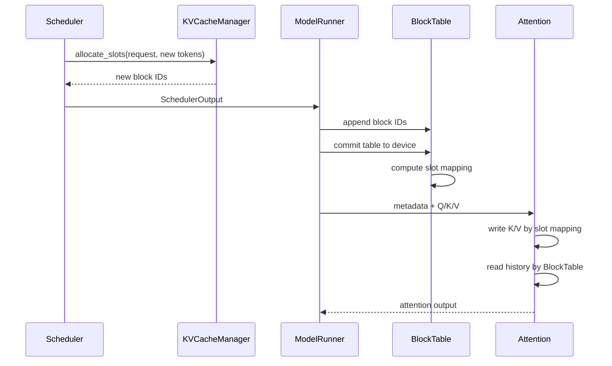

这里两套索引用途不同：

| 结构 | 主要用途 |
| --- | --- |
| BlockTable | 告诉 Attention 一个请求的历史 KV 分布在哪些 page |
| SlotMapping | 告诉 KV write 当前 token 应写入哪个 physical slot |

二者最终访问同一个物理 KVCache Tensor。

### 3.12 Prefix Cache 的特殊生命周期

#### 3.12.1 完整 Block 才进入 Prefix Cache

当请求产生新的完整 Block 时：

```python
cache_full_blocks(...)
```

会：

- 为 Block 设置 `block_hash`；
- 建立 hash 到 `KVCacheBlock` 的映射；
- 记录已经缓存的 Block 数量；
- 保持 block ID 不变。

不完整 tail Block 通常不能作为稳定 Prefix Cache 命中单元。

#### 3.12.2 ref count 为零不等于数据立即失效

请求结束后，如果一个 Block 有有效 Prefix hash：

```text
ref_cnt -> 0
  -> 进入 free queue
  -> block_hash 仍保留
  -> 物理 KV 数据仍保留
  -> 成为 eviction candidate
```

后续发生两种情况。

Prefix 命中：

```text
touch(block)
  -> 从 free queue 移除
  -> ref_cnt += 1
  -> 新请求直接复用原物理 KV
```

缓存驱逐：

```text
get_new_blocks()
  -> 取出 ref_cnt == 0 的 cached block
  -> 删除旧 block_hash
  -> 分配给无关请求
  -> 新 K/V 逐步覆盖旧物理内容
```

所以 vLLM Prefix Cache 的本质是：

> 释放请求引用后继续保留物理数据，将零引用 Block 作为可驱逐缓存，而不是立即清零。

### 3.13 请求完成、取消和抢占时如何释放

#### 3.13.1 Scheduler 逻辑释放

正常完成或取消的调用链为：

```text
Scheduler.finish_requests()
  -> _free_request()
  -> _free_blocks()
  -> KVCacheManager.free(request)
  -> KVCacheCoordinator.free(request_id)
  -> SingleTypeKVCacheManager.free(request_id)
  -> BlockPool.free_blocks(blocks)
```

SingleType manager：

1. 从 `req_to_blocks` 删除该请求；
2. 以逆序释放 Block，使尾部 Block 优先成为 eviction candidate；
3. 对每个非 null Block 执行 `ref_cnt -= 1`；
4. 将零引用 Block加入 free queue；
5. 删除请求级 `num_cached_block` 元数据。

#### 3.13.2 Worker 执行状态清理

Scheduler 通过：

```python
SchedulerOutput.finished_req_ids
```

通知 Worker。ModelRunner 删除：

- `CachedRequestState`；
- InputBatch 中的请求 row；
- 当前 batch 的 BlockTable 引用；
- 相关采样和请求级 metadata。

Worker 这里仍不会销毁物理 KVCache Tensor。

#### 3.13.3 抢占

Block 不足时 Scheduler 可能执行：

```python
_preempt_request(request)
```

主要动作：

```text
KVCacheManager.free(request)
request.num_computed_tokens = 0
request.status = PREEMPTED
request -> waiting queue
```

恢复时请求重新进行 Prefix Cache 查询和必要的 recompute，再获得新的 block ID。

因此典型 vLLM 抢占不是保留原 BlockTable，也不是把 KV 完整 swap 到 CPU，而是释放并在恢复时
重建执行状态。

### 3.14 物理 Tensor 什么时候真正释放

物理 KVCache 的正常生命周期：

```text
Worker 初始化
  -> 一次性申请物理 KV Tensor
  -> 所有请求共享并复用
  -> Worker shutdown / model unload / sleep discard
  -> 物理内存真正释放
```

`GPUModelRunner.shutdown()` 会：

- 清理 `kv_caches` 引用；
- 清理 Attention Layer 上绑定的 KV Tensor；
- 清理 Graph 和 workspace；
- 触发 GC 和 allocator cache 清理。

启用 CuMem sleep mode 时，带 `kv_cache` tag 的物理内存还可以被暂时 discard，并在 wake-up
阶段恢复运行所需状态。

生命周期对比：

| 操作 | 释放逻辑 Block | 销毁物理 KV Tensor |
| --- | ---: | ---: |
| 请求正常完成 | 是 | 否 |
| 请求取消 | 是 | 否 |
| 请求抢占 | 是 | 否 |
| Prefix Cache eviction | 改为其他请求所有 | 否 |
| Worker shutdown | 是 | 是 |
| 模型 unload/显存 sleep | 视模式而定 | 是或暂时 discard |

### 3.15 Paged KVCache 的核心不变量

容量不变量：

```text
所有活跃请求引用的物理 Block 数
    <= global num_blocks
```

多 Worker 一致性：

```text
global num_blocks
    = 所有相关 Worker 可支持 Block 数的最小值
```

Block 所有权：

```text
ref_cnt > 0
    -> Block 不能被重新分配
```

Prefix Cache：

```text
ref_cnt == 0 and block_hash != None
    -> Block 是可驱逐缓存
```

寻址安全：

```text
slot_mapping 中的 physical slot
    必须来自 Scheduler 已分配给该请求的 block ID
```

生命周期：

```text
request free
    != physical KV tensor free
```

### 3.16 对 BeamKV 设计的直接启示

Paged KVCache 最值得继承的不是 page/block 物理布局，而是所有权分层：

```text
EngineCore
    规划物理容量

Scheduler / KVCacheManager
    管理逻辑所有权

Worker / ModelRunner / Attention
    使用固定物理内存
```

对应关系：

| Native Paged KVCache | BeamKV 目标对象 |
| --- | --- |
| `KVCacheConfig` | `BeamKVCacheConfig` |
| `BlockPool` | `BeamSlotPool` |
| `KVCacheBlock` | `BeamKVSlot` |
| `allocate_slots()` | `reserve_beam_slot()` |
| `block_ids` | `BeamKVBinding` |
| `BlockTable` | Beam slot/lineage/permutation metadata |
| `slot_mapping` | Beam append target |
| `free(request)` | `release_beam_session()` |
| 物理 KV Tensor 常驻 | BeamKVPool 常驻 |

共同原则：

> 控制面决定“哪个请求拥有哪些物理地址”，Worker 只使用下发的 binding；请求结束时释放逻辑
> 所有权，物理 Pool 不随请求反复申请和销毁。

### 3.17 为什么不能在 Native Paged KV 之后额外申请 BeamKV

假设 profile 得到可用于全部 KVC 的 HBM 为 20 GiB。原生 vLLM 会近似将这部分全部换算为
Paged KV blocks。如果 Worker 随后额外申请 4 GiB BeamKV：

```text
Native Paged KV = 20 GiB
BeamKV          =  4 GiB
总需求          = 24 GiB
```

这会导致 OOM、allocator fragmentation，或者挤占 Graph workspace。

正确做法是：

```text
Native 可用容量
    = profile 可用容量
    - BeamKV 预留
    - Beam Graph/Metadata/Workspace 预留
```

所以 BeamKV 应完全遵循 vLLM 的容量规划哲学：

> EngineCore 负责 NativeKV、BeamKV、Graph 和 Workspace 的统一容量规划；Worker 负责按配置
> 创建物理 Tensor；Scheduler 同时管理 Native Block 和 Beam slot 的逻辑所有权。

---

## 4. 目标架构与所有权划分

### 4.1 总体架构

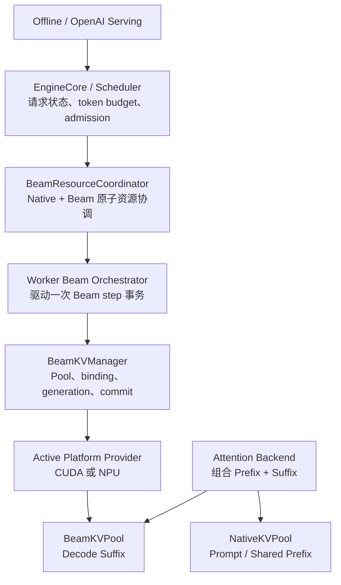

### 4.2 模块职责

| 模块 | 应负责 | 不应负责 |
| --- | --- | --- |
| EngineCore/Scheduler | session、capacity、admission、waiting、finish/cancel | 设备 Tensor、CUDA/NPU kernel |
| BeamResourceCoordinator | Native/Beam 双资源预留和回滚 | 逐层 K/V 读写 |
| Worker Orchestrator | `begin_step -> forward -> select -> commit` | 全局调度策略 |
| BeamKVManager | 物理 Pool、slot binding、generation、事务和提交 | Beam ranking、EOS、Catalog |
| Attention Backend | 消费本层 Prefix/Suffix View，写当前 K/V | 申请 session slot、释放请求 |
| Postprocess | 产生公共 `BeamTransition` | 定义平台物理 KV 顺序 |
| Platform Provider | layout、kernel、graph、workspace、commit | 改变公共 Beam 语义 |

### 4.3 双 Pool 关系

```text
NativeKVPool
  - 普通请求 KV
  - Prompt / Shared Prefix KV
  - Prefix Cache / PD / LMCache 兼容路径

BeamKVPool
  - Beam decode suffix
  - parent-child lineage 对应的物理或逻辑更新
  - CUDA/NPU 各自的物理布局
```

一次 Beam Attention 可以同时读取两类 Pool，但二者不能共享全部 allocation、free、copy、
reorder 规则。

---

## 5. 核心对象与状态不变量

### 5.1 Beam step 时间线

Prefill 已经选择第一个 Beam token `y0`，但 `KV(y0)` 尚未生成。

在 decode step `s` 开始前：

```text
当前输入 token       = y_s
已物化 Beam KV       = KV(y_0 ... y_{s-1})
materialized_kv_len  = s
selected_token_count = s + 1
decode_index         = s
```

公共层统一使用 0-based `decode_index`。ACS/xLLM 的 `decode_step` 是 1-based，转换必须
只发生在 NPU Provider 内：

```text
npu_decode_step = decode_index + 1
```

推荐对象：

```python
@dataclass(frozen=True)
class BeamStepCursor:
    decode_index: int
    materialized_kv_len: int
    selected_token_count: int
```

### 5.2 BeamKVBinding

```python
@dataclass(frozen=True)
class BeamKVBinding:
    session_id: str
    bucket_id: str
    slot_ids: tuple[int, ...]
    generation: int
    beam_width: int
    max_decode_steps: int
    prefix_lease_id: str
```

`slot_ids` 是跨 Worker 一致的逻辑编号。每个 Worker 的实际地址不同，但相同 slot ID 在
所有相关 Worker 上都必须合法。

### 5.3 BeamTransition

```python
@dataclass(frozen=True)
class BeamTransition:
    parent_beam_ids: DeviceTensor
    next_token_ids: DeviceTensor
    next_scores: DeviceTensor
    requires_next_forward: DeviceTensor
```

公共顺序是语义输出顺序，不要求按 parent 排序。

NPU 可以在 Provider 内部生成私有物理结构：

```python
@dataclass(frozen=True)
class NPUBeamCommitView:
    grouped_parent_beam_ids: DeviceTensor
    permutation: DeviceTensor
    group_token_prefix_sums: DeviceTensor
```

### 5.4 BeamKVLayerStepView

```python
@dataclass
class BeamKVLayerStepView:
    history_read_view: object
    current_write_target: object
    current_token_kv: object | None = None
```

`object` 表示 Platform opaque view。Common 层不能假设它是 GPU 的 stacked Tensor、NPU 的
K/V tuple 或某种 Block Table。

### 5.5 状态发布不变量

当前 token K/V 相对于下一代 Beam 顺序是 provisional，但对当前层 Attention 必须可见。
事务保护的对象不是“禁止当前 Attention 读取 K/V”，而是：

```text
禁止在 KV commit 完成前发布新一代 parent/token/score 状态。
```

---

## 6. 初始化阶段：显存汇总与物理 Pool 申请

### 6.1 完整初始化数据流

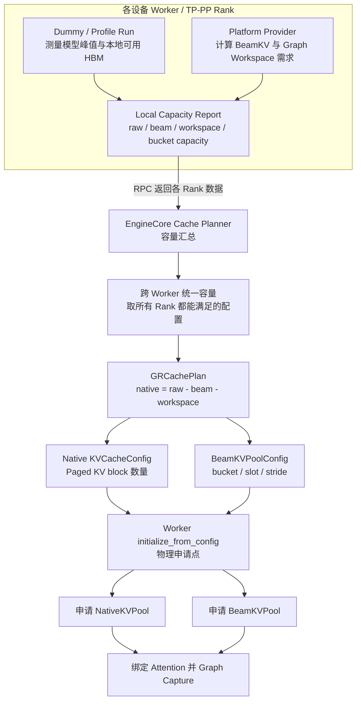

### 6.2 推荐统一 CachePlan

```python
@dataclass(frozen=True)
class GRCachePlan:
    native_kv_configs: tuple[KVCacheConfig, ...]
    beam_kv_configs: tuple[BeamKVPoolConfig, ...]
    scheduler_beam_capacity: BeamKVCapacityConfig
```

EngineCore 的规划伪代码：

```python
raw_available = executor.determine_available_memory()

beam_specs = executor.get_beam_kv_pool_specs(
    max_sessions=max_beam_sessions,
    beam_width_buckets=beam_width_buckets,
    decode_step_buckets=decode_step_buckets,
)

native_available = [
    raw - beam.pool_bytes - beam.graph_workspace_bytes
    for raw, beam in zip(raw_available, beam_specs)
]

native_configs = get_kv_cache_configs(
    vllm_config,
    native_kv_specs,
    native_available,
)

executor.initialize_gr_cache_from_config(
    native_configs=native_configs,
    beam_configs=beam_specs,
)
```

### 6.3 为什么物理 Tensor 在 Worker 申请

优点：

- Worker 拥有真实 device context、stream 和 allocator；
- 能按本地 PP layer、TP KV heads、dtype 精确计算；
- 不需要跨进程传递 CUDA/NPU device pointer；
- Platform Provider 可以控制 layout 和大块连续内存；
- Pool、Attention、Graph capture 位于同一执行进程；
- 能统一接入 sleep/wake、model unload、device cleanup。

代价：

- EngineCore 与 Worker 必须共享一致的 capacity/binding；
- 若不进入统一 CachePlan，会发生显存双重记账；
- 多 Worker 容量必须取共同最小值；
- 需要处理 Worker failure 和部分绑定失败；
- 独立静态 Pool 可能在没有 Beam 请求时闲置。

结论：

> Worker 是物理内存 owner，但不是容量 policy owner。

---

## 7. BeamKV 物理容量模型

### 7.1 基本容量公式

对于固定连续 layout，单个 Worker 的 Beam Pool 基础字节数可估算为：

```text
M_beam = 2 * L_local * S * W_max * T_max
         * H_kv_local * D * sizeof(dtype)
```

其中：

- `2`：K 和 V；
- `L_local`：当前 PP rank 的本地 Attention layer 数；
- `S`：物理 session slot 数；
- `W_max`：该 bucket 的 Beam width；
- `T_max`：最大 decode step；
- `H_kv_local`：当前 TP rank 的本地 KV heads；
- `D`：head dimension。

还需要额外计入：

- lineage/BeamPath；
- token、score、finished mask；
- device-side step cursor；
- stable input/output buffer；
- CUDA Graph/ACLGraph workspace；
- NPU grouped parent 和 permutation buffer；
- operator temporary workspace。

### 7.2 Bucket 与 slot

推荐按执行几何建立固定 bucket：

```python
BeamKVPoolConfig(
    buckets={
        "w32_t64": BeamKVBucket(
            beam_width=32,
            max_decode_steps=64,
            num_slots=8,
            slot_stride_bytes=...,
        ),
        "w128_t16": BeamKVBucket(
            beam_width=128,
            max_decode_steps=16,
            num_slots=4,
            slot_stride_bytes=...,
        ),
    }
)
```

物理地址：

```text
slot_base = pool_base + slot_id * slot_stride
```

防越界条件：

```text
0 <= slot_id < num_slots
beam_width <= bucket.beam_width
decode_index < bucket.max_decode_steps
binding.generation == slot.current_generation
```

### 7.3 多 Worker 全局容量

每个 bucket 的全局容量必须是所有参与 Worker 的最小值：

```text
C_global(bucket) = min(C_worker_0, C_worker_1, ..., C_worker_n)
```

例如：

| Worker | `w32_t64` 本地容量 |
| --- | ---: |
| PP0 | 10 |
| PP1 | 8 |
| PP2 | 9 |

EngineCore 只能向 Scheduler 公布 8 个全局 slot。

### 7.4 Grouped request 的资源单位

容量单位应是“独立 Beam session”，不是 API request 数量。如果一次 `ADD_BATCH` 包含 4 个
用户，每个用户有一套独立 Beam lineage：

```text
required_slots = 4
```

不能因为它们被一个 RPC 或一个 SchedulerOutput 携带，就只记为一个 slot。

---

## 8. 请求阶段：BeamKV 端到端数据流

### 8.1 完整请求生命周期

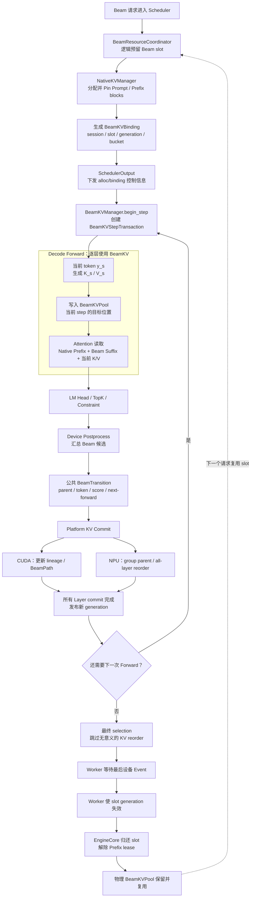

### 8.2 Prefill 到 Beam decode 的切换

1. Prefill 继续使用原生 Native Paged KV；
2. Prompt/Prefix 完成后，Prefix blocks 被 lease/pin；
3. Prefill logits 选出初始 Beam token `y0`；
4. 此时 `KV(y0)` 尚未写入 BeamKV；
5. Scheduler 必须已经为该 session 准备好 BeamKVBinding；
6. 第一次 decode forward 负责写入 `KV(y0)`。

### 8.3 每层数据流

每层 Attention 的逻辑输入为：

```text
query                = 当前 Beam hidden states
prefix_read_view     = NativeKVPool 中的 Shared Prefix
history_read_view    = BeamKVPool 中已提交的 suffix
current_write_target = BeamKVPool 中 decode_index 的目标地址
```

每层顺序：

```text
Q/K/V Projection
    -> 写当前 K/V
    -> 当前层可立即读取当前 K/V
    -> Prefix Attention
    -> Suffix/Beam Attention
    -> Merge
    -> 下一层
```

---

## 9. 单个 Decode Step 的事务模型

### 9.1 时序图

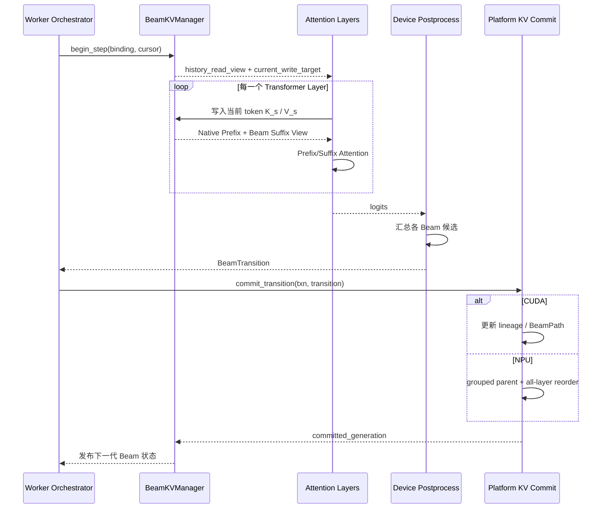

### 9.2 推荐事务 API

```python
txn = beam_kv_manager.begin_step(
    binding=binding,
    cursor=cursor,
)

logits = model_runner.forward(
    scheduler_output,
    beam_kv_step=txn,
)

transition = postprocess_backend.select(
    logits,
    beam_state,
)

completion = beam_kv_manager.commit_transition(
    txn,
    transition,
)

beam_execution_state.publish(
    transition,
    completion.generation,
)
```

### 9.3 Commit 前后的失败语义

- commit 前失败：当前 write target 尚未发布，可以覆盖或忽略；
- CUDA lineage commit 失败：旧 generation 仍有效；
- NPU 原地 reorder 中失败：不承诺通用 rollback，session 标记 fatal；
- 所有 failure 都必须使当前 binding 不再被新 step 使用；
- generation 防止迟到的异步操作污染已经复用的 slot。

---

## 10. 容量安全与 Scheduler Admission

### 10.1 为什么 Worker shape check 不够

Worker 中的：

```text
batch <= max_batch
beam <= max_beams
step < max_steps
```

只能防止单次调用直接越界，无法阻止多个并发请求的总容量超过物理 Pool。

正确方式是：

> Scheduler 在请求下发前完成 reservation；Worker 只接受具有有效 binding 的请求。

### 10.2 Beam slot 状态机

```text
FREE
  -> RESERVED
  -> ACTIVE
  -> RELEASING
  -> FREE
```

| 状态 | 含义 | 能否执行 forward |
| --- | --- | --- |
| `FREE` | 无请求占用 | 否 |
| `RESERVED` | Scheduler 已预留，Worker 尚未全部绑定 | 否 |
| `ACTIVE` | 所有 Worker 均绑定成功 | 是 |
| `RELEASING` | 最后设备操作尚未确认完成 | 否 |

### 10.3 Admission 条件

```python
admissible = (
    token_budget_available
    and native_prefix_kv_available
    and beam_kv_slot_available
    and compatible_graph_bucket_available
)
```

BeamKV 是和 token budget、Native KV blocks、`max_num_seqs` 并列的调度资源。

### 10.4 原子资源预留

推荐伪代码：

```python
beam_spec = normalize_beam_request(request)

bucket = beam_capacity_manager.select_smallest_compatible_bucket(
    beam_width=beam_spec.beam_width,
    max_decode_steps=beam_spec.max_decode_steps,
)

if bucket is None:
    fallback_or_reject(request)
    continue

reservation = beam_capacity_manager.try_reserve(
    bucket=bucket,
    num_slots=beam_spec.num_sessions,
)

if reservation is None:
    request.status = WAITING_FOR_BEAM_KV
    continue

native_blocks = kv_cache_manager.allocate_slots(
    request,
    num_new_tokens,
)

if native_blocks is None:
    beam_capacity_manager.rollback(reservation)
    continue

binding = beam_capacity_manager.commit(reservation)

scheduler_output.beam_kv_allocs[request.request_id] = binding
```

禁止以下流程：

```text
先把请求下发给 Worker
    -> Worker 才发现 Pool 不足
    -> 临时扩容或 OOM
```

### 10.5 Eager reservation 与延迟 reservation

#### Eager reservation

请求进入执行前一次性预留完整 Beam window。

优点：

- 不会在 Prefill 完成后才发现无 Beam capacity；
- 适合 fixed-window Graph；
- 地址和 shape 稳定；
- session 中途不会因 KVC 不足失败。

缺点：

- chunked prefill 期间 Beam slot 可能闲置；
- 大请求可能长期占用 reservation。

#### 延迟 reservation

在最后一个 Prefill chunk 或 Prefill-to-Decode 边界才申请。

优点：Beam slot 利用率更高。  
缺点：Prefix 已经占用 Native KV 后可能长时间等待 Beam slot，形成另一类资源死锁或浪费。

第一版建议使用 eager reservation，优先保证正确性和 full-graph 稳定性。

### 10.6 Bucket 选择和公平性

推荐 best-fit：选择能容纳请求的最小 bucket。

```text
W=24,T=48 -> w32_t64
W=80,T=12 -> w128_t16
```

Scheduler 可以在大请求等待时继续调度能放入其他 bucket 的小请求，避免全局队头阻塞；
同时需要 aging 或 reservation priority，防止大 bucket 请求永久饥饿。

### 10.7 Worker 最后防线

即使 Scheduler 已 reservation，Worker 仍需验证：

```python
assert binding.bucket_id in local_pool.buckets
assert all(0 <= slot < local_bucket.num_slots for slot in binding.slot_ids)
assert binding.generation == local_slot.generation
assert binding.beam_width <= local_bucket.beam_width
assert cursor.decode_index < local_bucket.max_decode_steps
assert local_slot.state == ACTIVE
```

这些检查是安全防线，不是 admission policy。

---

## 11. 释放、销毁、抢占与异常处理

### 11.1 逻辑释放与物理销毁

| 操作 | 触发时机 | 位置 | 动作 |
| --- | --- | --- | --- |
| 逻辑释放 | finish/cancel/timeout/error | Worker + EngineCore | generation 失效、slot 归还、Prefix lease 解除 |
| 物理销毁 | shutdown/unload/reconfigure | Worker | 删除 BeamKVPool Tensor，归还 HBM |
| 普通复用 | 新 session 使用旧 slot | Worker | 不销毁 Tensor，只覆盖有效区域 |
| Graph 重建 | Pool 地址/shape 变化 | Worker/Platform | 销毁旧 Graph，重新 capture |

### 11.2 正常释放流程

```text
最后一次 forward
  -> 最终 Beam selection
  -> requires_next_forward = false
  -> 跳过下一步专用 reorder
  -> 等待最后设备 Event
  -> Worker release ack
  -> EngineCore 将 slot 标记 FREE
  -> Prefix lease 解除
```

### 11.3 generation 防止 use-after-free

旧 session：

```python
BeamKVBinding(slot_id=3, generation=8)
```

释放并复用后：

```python
BeamKVBinding(slot_id=3, generation=9)
```

任何来自 generation 8 的迟到操作都必须被拒绝。

### 11.4 抢占策略

可选方案：

| 方案 | 优点 | 问题 |
| --- | --- | --- |
| 抢占后保留 slot | 恢复快 | 被抢占请求继续占用稀缺容量 |
| 释放 slot，恢复时重算 suffix | 真正释放容量 | 恢复代价高 |
| BeamKV swap 到 Host/远端 | 资源利用率高 | 数据搬运、lineage 和地址恢复复杂 |

第一版建议：

> Active Beam decode 不做保留式抢占；若必须抢占，释放 Beam slot，恢复时从 Prefix 重算。

### 11.5 物理销毁流程

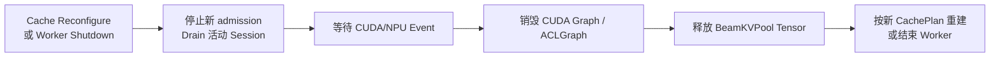

---

## 12. CUDA BeamKV Provider 设计

### 12.1 借鉴 NVIDIA 的 ContextKV + BeamKV + BeamPath

NVIDIA SID-GR 的 Beam decode 将：

- Context K/V：Prefill 产生，所有 Beam 共享；
- Beam K/V：每一步新增；
- `topk_indices`：表示当前 Beam 在历史每一步的祖先；
- 专用 Attention kernel：根据 BeamPath 读取祖先 K/V。

这是很自然的 GPU Beam 数据模型。

### 12.2 NVIDIA 示例不能直接用于 serving 的部分

当前示例在一次 `generate_beam_decode()` 内创建：

```python
beam_kv_caches = [None] * num_layers
```

每一步通过 `torch.cat()` 扩展历史 K/V：

```python
torch.cat([k_prev, k_new], dim=1)
torch.cat([v_prev, v_new], dim=1)
```

问题：

- 每步动态分配；
- 每步复制历史；
- Tensor 地址变化；
- 多个调用没有统一容量；
- PyTorch OOM 是事实上的最终容量检查；
- 不适合 CUDA Graph 和 continuous batching。

### 12.3 推荐 CUDA 物理布局

第一版可以采用固定 arena：

```text
[layer, session_slot, step, beam, kv_head, head_dim]
```

或等价的 step-major flattened layout：

```text
[layer, session_slot, step_offset + beam, kv_head, head_dim]
```

每一步只写当前 `(step, beam)`，不复制历史。

### 12.4 CUDA commit

Postprocess 返回：

```text
parent_beam_ids = [3, 1, 1, 1]
```

CUDA commit 只更新：

- parent lineage；
- BeamPath/topk indices；
- valid length；
- generation；
- token/score state。

历史 BeamKV 保持 append-only，不根据新 Beam 顺序物理搬移。

### 12.5 CUDA 数据流

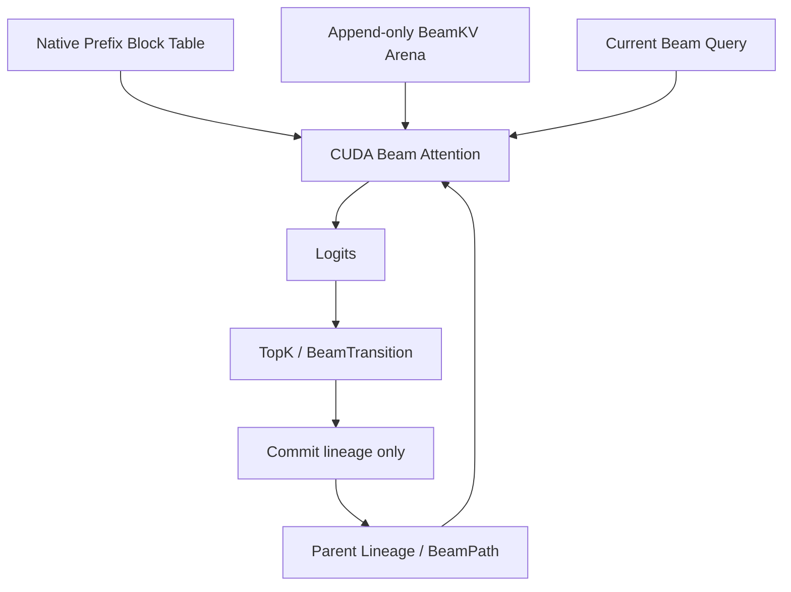

---

## 13. NPU BeamKV Provider 设计

### 13.1 借鉴 ACS 的 Shared/Unshared KV

ACS 使用：

```text
Shared KV   = vLLM Paged KV 中的 Prompt/Prefix
Unshared KV = 连续 Beam decode KV
```

Unshared 形状：

```text
[batch_slot, beam, kv_head, max_decode_steps, head_dim]
```

每层使用 `cache_unshared_kv` 写当前 token，`x_attention` 读取 Shared + Unshared；
selection 后使用 `select_unshared_kv` 对所有 Layer 的 Beam 行原地重排。

### 13.2 推荐保留的部分

- 连续 Beam slot layout；
- `cache_unshared_kv` 逐层写入；
- `x_attention` 组合 Shared/Unshared；
- `select_unshared_kv` 集中 all-layer commit；
- graph-stable persistent buffer；
- 最后一步跳过 reorder。

### 13.3 需要改造的部分

ACS 当前实现主要是 batch-wide 单 Context：

- `NPUModelRunner` 只有一个 `_beam_search_context`；
- Pool 不足时 lazy grow；
- grow 会改变地址并清除 ACLGraph；
- `reset_buffers()` 重置整块 Pool；
- 依赖 Beam chunk 串行执行假设；
- 没有 Scheduler 级 reservation。

vLLM-GR 服务化后需要：

- 每个逻辑 session 独立 slot；
- Scheduler 下发 slot binding；
- 不在运行中扩容；
- 不因一个请求结束而 reset 全 Pool；
- 只清理该 slot 的 metadata/generation；
- 任意到达和取消不影响其他 slot。

### 13.4 NPU grouped commit

公共语义：

```text
parents = [3, 1, 1, 1]
tokens  = [E, F, G, H]
```

NPU Provider 私有 canonicalization：

```text
parents = [1, 1, 1, 3]
tokens  = [F, G, H, E]
group_token_prefix_sums = [0, 3, 3, 4]
```

parent、token、score、sequence、finished、constraint state 必须应用同一个 permutation。
公共 `BeamTransition` 的顺序不能被 NPU kernel 约束污染。

### 13.5 NPU 数据流

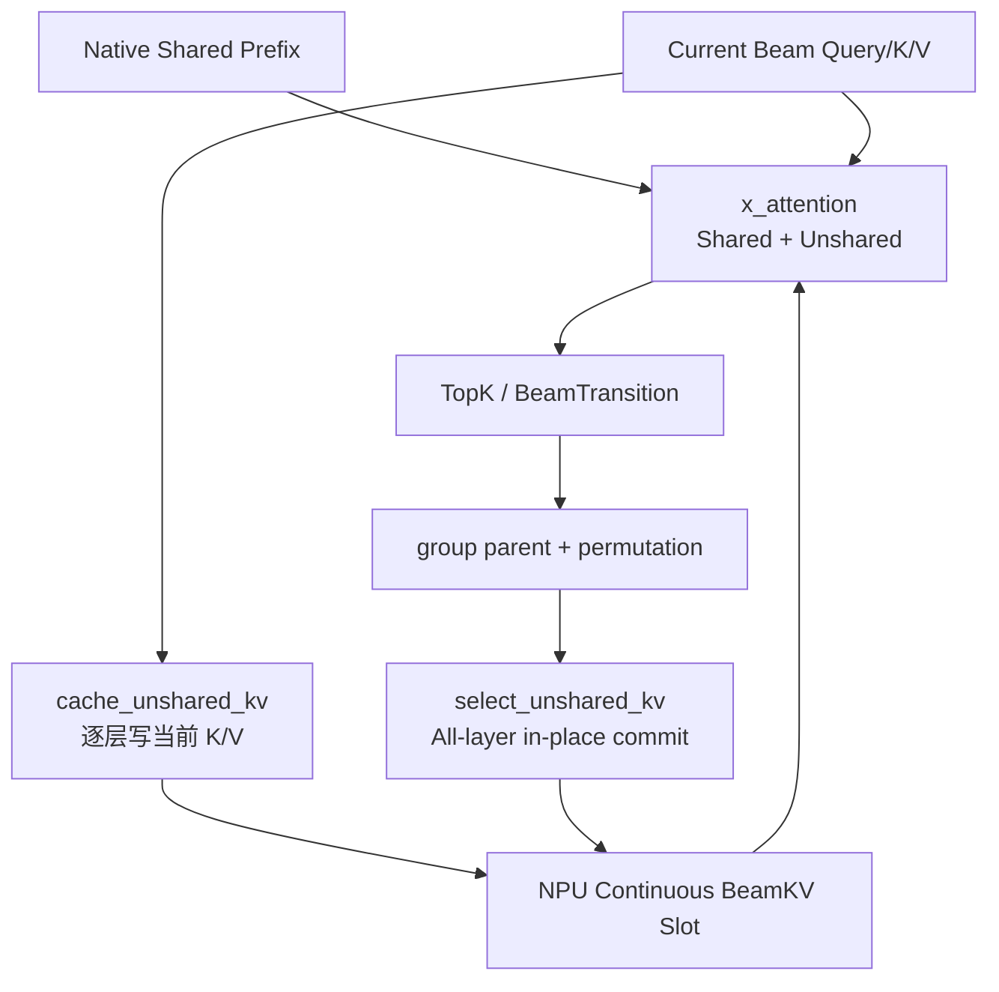

---

## 14. ACS、NVIDIA 与目标方案对比

### 14.1 容量与生命周期对比

| 维度 | ACS_vllm-GR | NVIDIA SID-GR | vLLM-GR 目标 |
| --- | --- | --- | --- |
| 物理内存 | 固定但可 lazy grow 的 BufferPool | 每次 generate 动态增长 | 初始化阶段固定 Pool |
| 容量单位 | 当前 batch shape | 实际 Tensor 大小 | Scheduler-visible bucket/slot |
| 防越界 | Worker shape 检查 | 动态 Tensor，无固定上限 | reservation + Worker 检查 |
| 并发 session | 基本为单 Context | 调用间无统一管理 | 多 session 独立 slot |
| Pool 不足 | 扩容、重建 ACLGraph | 继续申请直到 OOM | 请求等待，不下发 |
| 请求释放 | reset Context/Buffer | 函数返回后 Tensor 释放 | 释放逻辑 slot，物理 Pool 复用 |
| Graph 友好 | 地址不变时友好 | 不友好 | 固定地址和 bucket |
| Beam 更新 | NPU 物理 reorder | GPU lineage/topk indices | 各平台独立实现 |
| Scheduler 参与 | 无 | 无 | 必须参与 |

### 14.2 ACS 的适用性与不足

ACS 解决的是：

```text
当前执行 batch 是否能被当前 BufferPool 容纳。
```

优点：

- 有明确 `max_batch/max_beam/max_step`；
- Tensor slice 防止单次调用越界；
- persistent buffer 适合 ACLGraph；
- NPU all-layer reorder 边界清晰。

不足：

- 没有多个并发 session 的 reservation；
- 单一 `_beam_search_context` 使请求生命周期耦合；
- Pool 不足时扩容而不是 backpressure；
- 扩容可能 OOM 并使 graph 失效；
- 不能直接满足 vLLM continuous batching。

### 14.3 NVIDIA 的适用性与不足

NVIDIA 解决的是：

```text
单次 generate 内如何用 lineage 表达 Beam ancestry，并由专用 kernel 读取 Beam KV。
```

优点：

- `ContextKV + BeamKV + BeamPath` 数据模型自然；
- 内存按当前实际 batch/beam/step 增长；
- lineage 避免根据新 Beam 顺序复制历史 KV；
- 适合 GPU 专用 kernel。

不足：

- 没有固定物理容量；
- 没有 Scheduler admission；
- `torch.cat` 动态分配并复制；
- 地址不稳定；
- 并发调用总量无统一控制；
- 不适合 full graph serving。

### 14.4 推荐融合关系

```text
vLLM
  -> 继承 EngineCore 统一容量规划
  -> 继承 Scheduler admission/free 思路

NVIDIA
  -> 继承 GPU append-only BeamKV + lineage/BeamPath

ACS
  -> 继承 NPU continuous slot + cache/select ops

vLLM-GR Common
  -> 统一 Binding、Cursor、Transition、Transaction、Generation
```

---

## 15. 与 L0/L1/L2 执行层级的关系

BeamKV 接口不应固定 Beam loop 在 Host、Engine 还是 Device。

| 级别 | Transition 产生位置 | BeamKV 事务 |
| --- | --- | --- |
| L0 Stepwise | Host/frontend 每步产生或传回 | Worker 每次 forward 独立 begin/commit |
| L1 Engine-resident | Engine/Worker 每步产生 | Worker 每步事务，Scheduler 可重组 batch |
| L2 Fixed window | Worker/device 多步连续产生 | Worker 内连续事务，地址和 workspace 固定 |

稳定演进边界应是：

```text
BeamTransition + BeamKVStepTransaction
```

变化的只是：

- transition producer 在哪里；
- Host 是否参与 step 间决策；
- 是否允许 Scheduler 在 step 间重组 batch；
- 是否进入固定 shape/address 的多步 Graph。

---

## 16. CUDA Graph / ACLGraph 与 BeamKV 联动设计

### 16.1 先给结论

Graph 化 Beam decode 的关键不是“把 BeamKV Tensor 放进图里”，而是同时固定执行拓扑、
设备地址、launch geometry 和 workspace，并把每一步变化的内容改造成固定地址 Buffer 中的
数据更新。

因此：

1. 固定 BeamKVPool 是 Graph 的必要条件，但不是充分条件；
2. Scheduler admission 解决“物理 slot 是否够”，Graph dispatcher 解决“当前 shape 是否有图”，
   两者不能合并成一个判断；
3. `batch * beam` 相同不代表 Graph signature 相同，例如 `2 x beam4` 和 `1 x beam8`
   都是 8 个 token row，但 Beam 分组、lineage 和 KV layout 完全不同；
4. CUDA 推荐固定 append target，通过 lineage 改变逻辑父子关系；
5. NPU 推荐固定 continuous slot，通过 `select_unshared_kv` 改变物理 Beam 顺序；
6. 第一阶段的“Full Graph”应明确指 **一次 model forward，包括 Beam Attention 和 KV append**，
   Beam top-k/commit 可以先在图外；
7. 后续才把 LM Head、Beam top-k、lineage/reorder 和状态提交并入完整 step graph；
8. 多 step graph 需要固定 window 和 device-resident loop state，不应作为第一阶段目标；
9. Graph pool、Graph workspace 与 BeamKVPool 都要纳入 EngineCore 的统一显存计划；
10. Graph miss 只能导致降级执行或受控 capture，不能绕过 Beam slot 容量限制。

最重要的区分是：

```text
Capacity admission:
    这个请求有没有可用的物理 Beam slot？

Graph dispatch:
    这个已获准执行的物理 batch，有没有匹配的 Graph executable？
```

前者失败时请求必须等待；后者失败时可以安全回退 Eager。

### 16.2 Graph 固定的到底是什么

Graph capture 记录的不是某个逻辑 request，而是一组可复用的设备执行关系。对 BeamKV 而言，
对象可以分成三类。

| 类别 | 典型对象 | replay 时是否可变 | 处理方式 |
| --- | --- | --- | --- |
| 地址和拓扑 | BeamKVPool base、每层 K/V Tensor、workspace、输出 Buffer | 不可改变 | Pool 生命周期内固定 |
| launch geometry | token bucket、beam width、head 数、layout、kernel variant | 通常不可改变 | 进入 Graph key |
| Buffer 内容 | slot id、step、parent id、block table、length、active mask | 可以改变 | replay 前原地 `copy_()` / `fill_()` |
| Host 控制状态 | admission、请求等待队列、取消、slot owner | 不进入图 | Scheduler/Manager 管理 |

必须稳定的地址至少包括：

- NativeKVPool 和 BeamKVPool 的 base address；
- 每个 Layer 的 K/V view 地址；
- slot stride 和平台物理 layout；
- input id、position、slot binding Buffer；
- parent、permutation、active mask Buffer；
- Attention metadata 和 block table Buffer；
- LM Head / Beam postprocess 输出 Buffer；
- operator workspace；
- generation、step cursor 和完成标志 Buffer；
- CUDA Graph 或 ACLGraph executable 所引用的所有中间 Tensor。

允许变化的是这些 Buffer 的**内容**，而不是用新的 Tensor 替换它们。例如：

```python
# 正确：地址不变，只更新内容
graph_inputs.slot_ids[:actual].copy_(runtime_slot_ids)
graph_inputs.decode_steps[:actual].copy_(runtime_steps)
graph_inputs.active_mask.fill_(False)
graph_inputs.active_mask[:actual].fill_(True)

# 错误：替换 Tensor，Graph 仍引用旧地址
graph_inputs.slot_ids = runtime_slot_ids
graph_inputs.decode_steps = torch.tensor(runtime_steps, device=device)
```

### 16.3 Graph 显存必须进入统一 CachePlan

#### 16.3.1 vLLM CUDA 当前做法

vLLM `GPUWorker.determine_available_memory()` 的实际思路是：

1. `profile_run()` 测量模型权重之外的峰值 activation/non-torch memory；
2. 启用 CUDA Graph 时，通过 `profile_cudagraph_memory()` 估算 Graph pool；
3. 从 requested device memory 中扣除 non-KV 和 Graph estimate；
4. 把剩余值交给 EngineCore；
5. EngineCore 生成 KVCacheConfig 并让 Worker 分配 KV；
6. 随后真正 capture Graph，并比较实际 Graph memory 与估算值。

这意味着 BeamKV 不能在原生 Paged KV 已经吃完这个“剩余值”后再单独申请，否则是对同一份
余量的重复消费。

#### 16.3.2 BeamKV 目标公式

统一预算应满足：

```text
M_device_budget
  = M_requested
  - M_weights
  - M_peak_activation
  - M_non_framework
  - M_graph_pool
  - M_operator_workspace
  - M_safety_margin

M_native_kv + M_beam_kv <= M_device_budget
```

其中 `M_graph_pool` 必须覆盖 Beam 专属 Graph，而不仅是原生 vLLM decode Graph。

推荐的初始化顺序：

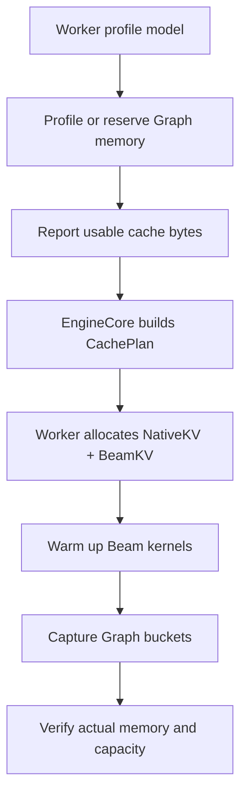

Beam Graph 内存可以用两种方式纳入预算：

- **Profile 方式**：用临时 Beam proxy Buffer 运行 Beam Graph profile，销毁临时 executable，
  得到 Graph pool estimate，再生成最终 CachePlan；
- **Reserve 方式**：按配置显式保留 `beam_graph_memory_reserve_bytes`，完成最终 capture 后用实际值
  校验，超出保留量则启动失败或减少 Native/Beam 容量后重新规划。

第一版更推荐 Reserve 方式，流程简单、可控；稳定后再做精确 profile。

#### 16.3.3 ACS 当前路径的风险

ACS 的 `NPUWorker.determine_available_memory()` 当前主要用 `profile_run()` 计算可用于 KV 的内存，
`capture_model()` 在 KV 初始化后的 warm-up 阶段发生。也就是说，ACLGraph 的真实内存占用没有像
CUDA 新路径那样显式进入可用 KV 预算。

同时，当前 `_ensure_beam_search_buffer_pool()` 支持运行中扩容，扩容后会删除旧的 Beam ACLGraph
entry 和 task-group 参数。它适合验证功能，但不适合作为 continuous batching serving 的最终容量
模型。

目标实现应改成：

```text
先规划 ACLGraph reserve
  -> 再划分 NativeKV / BeamKV
  -> 一次性申请 Pool
  -> capture 热门 bucket
  -> 服务期间禁止 grow
```

### 16.4 BeamGraphKey：不能只复用 num_tokens

vLLM 原生 `CudagraphDispatcher` 主要通过 `num_tokens`、`num_reqs`、是否 uniform decode、
LoRA 状态等构造 `BatchDescriptor`。Beam decode 还需要显式表达 Beam geometry。

推荐增加平台无关的逻辑 key：

```python
@dataclass(frozen=True)
class BeamGraphKey:
    platform: str                 # cuda / npu
    runtime_mode: str             # full_forward / full_step / piecewise
    num_tokens_bucket: int        # padded sessions * beam width
    num_sessions_bucket: int
    beam_width: int
    query_len: int                # 首版固定为 1
    dtype: str
    kv_layout: str
    attention_backend: str
    postprocess_variant: str      # normal / constrained / final
    tp_size: int
```

平台 Provider 可以在此基础上追加私有 key，例如 CUDA kernel tile、NPU task-group variant，
但不能删除 Common key 中影响语义的字段。

#### 16.4.1 哪些字段通常不应进入 key

- `slot_id`：它是 replay 输入内容；
- `request_id`：只属于控制面；
- 当前 token id、score、parent id：都是 Buffer 内容；
- 精确 `decode_step`：如果 kernel 从固定地址 scalar/vector Buffer 读取，则不进入 key；
- `max_decode_steps`：通常属于 Pool capacity，而不是一次 launch geometry。

只有当某个平台 kernel 将 step 固化为编译属性，或者不同 step bucket 使用不同 launch 参数时，
才把 `decode_step_bucket` 纳入 Provider 私有 Graph key。

#### 16.4.2 num_tokens 相同但不能共图的例子

```text
Case A: 8 个普通 decode request
Case B: 2 个 Beam session, beam_width = 4
Case C: 1 个 Beam session, beam_width = 8

三者 num_tokens 都是 8，但：
  - KV layout 不同；
  - parent grouping 不同；
  - Attention metadata 不同；
  - postprocess 输出 shape 不同；
  - commit 算法不同。
```

因此，Beam Graph dispatcher 不能仅根据 `total_num_scheduled_tokens` 命中原生 decode graph。

### 16.5 Graph bucket、物理 slot bucket 与 padding

这里有两套 bucket：

| Bucket | 解决的问题 | 由谁管理 |
| --- | --- | --- |
| Beam capacity bucket | 有多少 `(beam_width, max_steps)` 物理 slot | EngineCore + Scheduler |
| Graph shape bucket | 哪些执行 shape 有已捕获 executable | Worker Graph dispatcher |

请求先通过 capacity admission，再进行 Graph dispatch：

```text
request
  -> reserve physical Beam slot
  -> build actual execution batch
  -> choose padded Graph bucket
  -> stage binding and masks
  -> replay or fallback
```

如果实际有 5 个 Beam session、`beam_width=4`，Graph bucket 是 8 个 session：

```text
actual token rows = 5 * 4 = 20
graph token rows  = 8 * 4 = 32
```

多出的 12 行不能错误地指向 live slot 0。推荐二选一：

1. kernel 的所有写入、Attention、top-k、commit 都受 `active_mask` 保护；
2. padding row 绑定专用 scratch slot，且输出被 mask。

推荐同时做两层保护：

- active mask 保证语义；
- 每个 Graph bucket 配置 scratch arena，防止错误 kernel 写到 live slot。

scratch arena 是 Graph workspace，不占用可调度 slot；但其显存必须进入 CachePlan。

### 16.6 建议分四级推进 Graph 边界

| 等级 | 捕获范围 | BeamKV 行为 | Scheduler 自由度 | 推荐阶段 |
| --- | --- | --- | --- | --- |
| G0 Piecewise | Transformer 可图分段 | Beam Attention/commit 可在图外 | 高 | 最低风险 fallback |
| G1 Full Forward | input 到 hidden/logits，包含 Beam Attention 和 KV append | step 后处理在图外 | 高 | 第一阶段 |
| G2 Full Step | forward + LM Head + Beam top-k + BeamKV commit | step 边界可重组 batch | 中 | 第二阶段 |
| G3 Fixed Window | 连续 N 个 decode step | 图内更新 step/finished/lineage | 低 | L2 最终优化 |

#### G0：Piecewise

与 vLLM 的 PIECEWISE 理念一致：把不支持 Graph 或动态性高的 Attention/Beam postprocess 留在图外，
其余模型分段 replay。它不是最终性能目标，但应长期保留为可靠 fallback。

#### G1：Full Forward

一次 replay 覆盖：

```text
embedding
  -> transformer layers
     -> BeamKV append
     -> Beam Attention
  -> LM Head 或 hidden output
```

Beam transition、parent 选择和 commit 暂时在图外执行。该模式已经消除逐 Layer 的 Host launch，
并保留 Scheduler 每一步重新组 batch 的能力，是最合理的第一阶段。

#### G2：Full Step

进一步捕获：

```text
forward
  -> LM Head
  -> constrained/unconstrained top-k
  -> BeamTransition
  -> lineage commit 或 physical reorder
  -> generation publish
```

G2 要求 top-k 和 commit 算子提供固定地址的 `out=` 形式，不能返回新的动态 Tensor 并替换
BeamContext 内字段。

#### G3：Fixed Window

一次 replay 连续执行固定 N 步。需要：

- Beam loop 在 device 上；
- finished/EOS 通过 active mask 表达；
- 每一步的 input token 从上一轮固定 output Buffer 获取；
- 每一步使用固定 workspace；
- 不能在 window 内进行 Scheduler 抢占、插入或重组；
- 图内错误只能在 window 完成或设备事件报错后被发现。

它适合吞吐优先、shape 稳定的离线或专用服务，不一定适合通用 continuous batching。

### 16.7 Common 控制流与 Graph 数据流

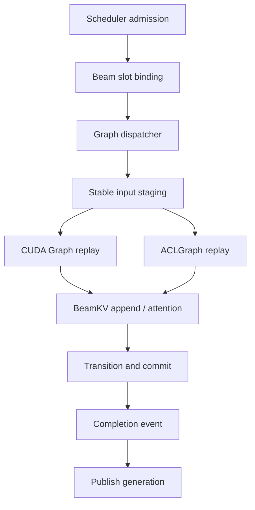

图外行为：

- 物理 slot reservation/free；
- Graph key 选择；
- 请求取消和抢占决策；
- 把 runtime metadata 写入固定 staging Buffer；
- 等待 completion event；
- 向 Scheduler 发布 generation/finished 状态。

图内行为取决于 G0/G1/G2/G3，但必须保持同一事务原则：

```text
Graph replay 成功并完成所有 Layer 的 KV/transition commit
    -> completion event
    -> committed_generation++
    -> Scheduler 才能观察到新 token 和新 Beam 状态
```

### 16.8 CUDA Graph + append-only BeamKV

#### 16.8.1 推荐的固定 Buffer

CUDA Provider 至少预分配：

```text
input_ids_buf          [max_token_bucket]
positions_buf          [max_token_bucket]
slot_ids_buf           [max_session_bucket]
decode_steps_buf       [max_session_bucket]
active_mask_buf        [max_session_bucket, beam_width]
parent_ids_buf         [2, max_session_bucket, beam_width]
beam_scores_buf        [2, max_session_bucket, beam_width]
transition_buf         [max_session_bucket, beam_width]
generation_buf         [max_session_bucket]
beam_kv[layer]         [slot, step, beam, kv_head, head_dim]  # 示例布局
```

`parent_ids_buf`、score 和其他逐步状态可以使用 ping-pong Buffer，避免读写同一份状态造成
Graph 内依赖不清。

#### 16.8.2 replay 数据流

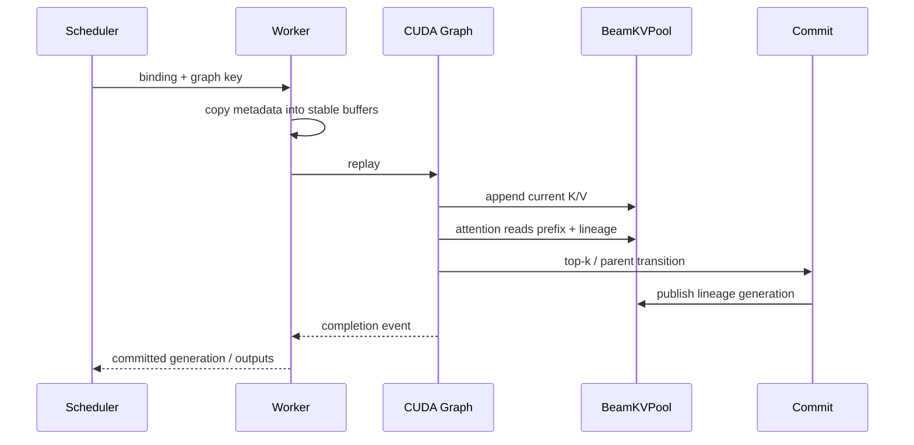

#### 16.8.3 为什么 append-only 更适合 CUDA Graph

对于 CUDA：

- 当前 step 的物理写地址只依赖 `slot + step + beam`；
- parent 变化只更新 lineage Buffer；
- 历史 KV 不需要因 Beam 重排而复制；
- Graph 中的 Tensor 地址和 kernel topology 都保持稳定；
- `decode_step` 可以作为固定地址 device scalar/vector 的内容更新；
- Beam Attention kernel 根据 lineage 解析逻辑祖先。

需要禁止：

- NVIDIA reference 中逐步 `torch.cat([old_kv, new_kv])`；
- Python list 中替换每层 `beam_kv_caches[l]`；
- 根据当前 step 创建新的 parent Tensor；
- `.item()` 后用 Python 分支决定图内算子；
- 使用运行时长度改变 kernel launch grid；
- Graph replay 前后让 allocator 移动或重建 BeamKVPool。

#### 16.8.4 与 vLLM CUDAGraphMode 的对应

| vLLM runtime mode | Beam decode 解释 |
| --- | --- |
| `NONE` | 完整 eager，仍必须使用 Scheduler reservation |
| `PIECEWISE` | 模型片段 replay，Beam Attention 或 postprocess 可在图外 |
| `FULL` | 至少捕获完整 Beam forward；是否包含 postprocess 由 Beam graph level 决定 |
| `FULL_DECODE_ONLY` | Beam decode 优先 Full，prefill/mixed batch 不成图 |
| `FULL_AND_PIECEWISE` | uniform Beam decode 走 Full，mixed/prefill 走 Piecewise |

不能直接把 Beam batch 冒充原生 uniform decode batch。原生 `BatchDescriptor.num_reqs` 表示请求数，
而 Beam 执行同时存在 `num_sessions` 和 `num_sessions * beam_width` 两个维度，必须由
`BeamGraphKey` 明确区分。

#### 16.8.5 final step

final step 不需要为下一轮 Attention 更新 lineage。两种选择：

- 单独 capture `postprocess_variant=final` 的 Graph，省掉 next-step commit；
- 复用 normal Graph，但通过 device predicate 跳过 lineage commit。

如果 final 请求比例高且 shape 稳定，单独 Graph 更高效；否则优先统一 Graph，减少 capture 数量。

### 16.9 ACLGraph + continuous BeamKV

#### 16.9.1 ACS 已验证的有效思路

ACS 当前实现已经说明以下路径可行：

- `BeamSearchBufferPool` 为 K/V、sequence、score、step 等提供持久地址；
- Beam decode Attention 使用 `cache_unshared_kv + x_attention`；
- `decode_step_buf` 使用固定地址 NPU Tensor；
- ACLGraph capture 为每层记录 cache 和 attention task group；
- replay 前通过 `graph_task_update` 更新 `decode_step` 等动态参数；
- 非最后一步使用 `select_unshared_kv` 物理重排所有 Layer KV；
- 最后一步使用 final select，跳过无用 KV reorder。

这些思路应保留在 NPU Provider，而不是泄漏到 Common 层。

#### 16.9.2 当前 ACS 实现不宜直接照搬的部分

| 当前行为 | serving 风险 | 目标修正 |
| --- | --- | --- |
| Pool 不够时 lazy grow | 地址变化、删图、瞬时 OOM | 启动期固定容量，运行期 backpressure |
| Beam Graph 首次请求 lazy capture | 首请求抖动、并发 capture 复杂 | 预捕获热门 bucket，冷门 bucket 受控 fallback |
| 单一 `_beam_search_context` | 多 session 生命周期耦合 | 每个 slot 独立 SessionState |
| 新请求前 `reset_buffers()` 整个 Pool | 破坏其他并发 slot，带来大带宽写 | slot generation/active mask，按 slot 清理 |
| 单一 scalar `decode_step_buf` | 只能安全支持 lock-step batch | 每 slot step vector，或 Scheduler 按 step 分组 |
| `beam_search_group` 返回新 Tensor | 地址可能变化，不利于 full step graph | `out=` 到持久 Buffer |
| Graph memory 未进入 KV budget | capture 时可能 OOM | EngineCore CachePlan 预留 ACLGraph memory |

#### 16.9.3 decode_step 的平台差异

CUDA kernel 通常可以直接从固定地址的 device scalar/vector 读取 step；ACLGraph 中某些 NPU op
可能在 capture 时把标量参数固化到 task。ACS 使用 `graph_task_update_begin/end` 对每层
`cache_unshared_kv` 和 `x_attention` 更新参数，就是针对这种差异。

Common 层只提供：

```text
BeamStepCursor
  slot_ids
  decode_steps
  generation
```

Provider 决定：

- CUDA：更新 device Buffer 内容；
- NPU：更新 Buffer，并在需要时执行 task-group parameter update；
- 某些 NPU kernel 只支持一个 scalar step 时，Scheduler 临时把不同 step 的 session 分桶执行；
- kernel 支持 step vector 后，再允许任意 step 的 session 进入同一 Graph bucket。

不能假设 continuous batching 中所有请求的 decode step 相同。

#### 16.9.4 NPU forward graph 与 full step graph

当前 ACS Beam ACLGraph 重点覆盖逐层：

```text
cache_unshared_kv
  -> x_attention
```

`beam_search_group + select_unshared_kv` 仍属于 forward 后的 Beam commit 路径。目标实现应分两步：

1. 先稳定 G1：Beam forward 进入 ACLGraph，postprocess/reorder 在图外；
2. 再实现 G2：为 top-k/group/select 提供固定 `out=` Buffer 和稳定 workspace，将它们一起 capture。

NPU 的 G2 事务为：

```text
all-layer cache_unshared_kv / x_attention
  -> LM Head
  -> beam_search_group
  -> all-layer select_unshared_kv
  -> completion event
  -> generation publish
```

`select_unshared_kv` 是原地 commit。任何 Layer reorder 失败后都无法轻易恢复到旧物理排列，因此：

- generation 只能在所有 Layer reorder 完成后发布；
- replay/task update 失败时 session 进入 ERROR；
- slot 在 stream 同步和错误确认前不能复用；
- 第一版不尝试通用 rollback。

#### 16.9.5 NPU slot 清理

为了 Graph 地址稳定和多 session 并发，不应在每个新请求前清零整个 Pool。推荐：

- `slot_generation[slot]++`；
- `active_mask[slot]` 标记有效 Beam；
- `valid_step[slot]` 限制 Attention 可读范围；
- 只清理该 slot 的 sequence/score metadata；
- KV 数据不必物理清零，只要新 generation 无法读取旧 step；
- 有安全或调试要求时再异步按 slot 清零。

### 16.10 CUDA Graph 与 ACLGraph 对比

| 维度 | CUDA Graph 推荐方案 | ACLGraph 推荐方案 |
| --- | --- | --- |
| BeamKV 物理策略 | append-only + lineage | continuous slot + physical reorder |
| step 更新 | 固定 device scalar/vector 内容 | device Buffer + 必要的 task update |
| parent commit | 写 lineage/ping-pong metadata | `select_unshared_kv` all-layer reorder |
| 历史 KV 移动 | 不移动 | 每个非 final step 原地重排 |
| Graph key | token/session/beam/layout/kernel | token/session/beam/layout/task variant |
| 动态参数 | stable pointer + content update | stable pointer，部分参数需 graph task update |
| final step | 跳过 lineage-next commit | 跳过 `select_unshared_kv` |
| Pool 扩容 | 禁止 | 禁止 |
| 冷门 shape | Piecewise/Eager | Piecewise/Eager 或受控 lazy capture |
| 失败恢复 | 未 publish 前 session-fatal | 原地 reorder 失败后 session-fatal |

两端共用的是 Graph 生命周期和事务协议，而不是具体的 Graph API：

```python
class BeamGraphExecutor(Protocol):
    def supports(self, key: BeamGraphKey) -> bool: ...
    def stage(self, batch: BeamExecutionBatch) -> None: ...
    def replay(self, key: BeamGraphKey) -> BeamGraphTicket: ...
    def poll(self, ticket: BeamGraphTicket) -> BeamGraphResult: ...
    def invalidate(self, reason: str) -> None: ...
```

`CUDAStream/CUDAGraph`、`NPUStream/ACLGraph/task handle` 都只出现在 Provider 实现中。

### 16.11 Scheduler 对 Graph 的考量

Scheduler 不管理 executable，但需要感知 Graph bucket，才能减少 padding 和 fallback。

推荐调度优先级：

```text
先满足容量安全和公平性
  -> 再优先合并同 BeamGraphKey 请求
  -> 再选择最小可容纳 Graph bucket
  -> Graph miss 则 Piecewise/Eager
```

不能为了命中 Graph 而破坏：

- Beam slot reservation；
- 等待时间公平性；
- request deadline；
- Native KV block 容量；
- 每步最大 token budget；
- TP/PP Worker 的一致 binding。

Scheduler 下发的执行描述建议增加：

```python
@dataclass
class BeamExecutionPlan:
    bindings: list[BeamKVBinding]
    graph_key: BeamGraphKey | None
    actual_num_sessions: int
    padded_num_sessions: int
    actual_num_tokens: int
    padded_num_tokens: int
    final_step_mask: DeviceBufferRef
    fallback_mode: str
```

#### 正常请求与 Beam 请求混跑

正常 decode 和 Beam decode 可以出现在同一个 Scheduler step，但不应强行塞入同一个 Graph：

```text
Scheduler output
  -> normal decode sub-batch -> native Graph
  -> Beam decode sub-batch   -> Beam Graph
```

如果底层 ModelRunner 暂时不支持一个 step 多次 sub-batch execution，则第一版应在 Scheduler 中分开
发射，而不是用错误 metadata 拼成一个 batch。

### 16.12 Graph cache、capture 与 fallback 策略

推荐：

1. 启动时 capture 高频 bucket；
2. 最大 bucket 优先 capture，以便 Graph memory pool 复用；
3. 冷门 bucket 默认 Eager/Piecewise；
4. 只有在平台支持、安全锁和显存 reserve 足够时才允许 lazy capture；
5. lazy capture 只能新增 executable，不能扩大 BeamKVPool；
6. Graph cache key 必须包含模型/权重/并行配置和 Beam provider 版本；
7. Pool 地址或 layout 改变时，整组相关 Graph 全部 invalid；
8. 单个请求结束不能 invalid Graph。

安全降级关系：

```text
G3 FIXED WINDOW
  -> G2 FULL STEP
  -> G1 FULL FORWARD
  -> G0 PIECEWISE
  -> EAGER
```

降级只改变执行方式，不改变：

- slot binding；
- Beam transition 语义；
- KV commit 顺序；
- generation；
- 最终 token/score 结果。

### 16.13 Graph 场景的容量和越界不变量

除了第 10 节的一般容量不变量，还需要增加：

```text
actual_num_sessions <= graph_key.num_sessions_bucket
actual_num_tokens   <= graph_key.num_tokens_bucket

for every active lane:
    slot_id < physical_slot_capacity[bucket]
    decode_step < slot.max_decode_steps
    beam_id < slot.beam_width

for every padding lane:
    active_mask == false
    slot_id points to scratch or write is masked
```

Worker replay 前必须做 host-side 快速校验；debug/CI 模式下 kernel 还应做 device-side assert 或写
error flag。Graph replay 完成后，只有 `error_flag == 0` 才能发布 generation。

### 16.14 对当前三套实现的直接判断

#### vLLM upstream

可以直接继承：

- FULL/PIECEWISE/NONE runtime mode；
- capture size 和 padded batch dispatch；
- profile Graph memory 再计算 KV 余量；
- 最大 shape 优先 capture；
- attention backend capability 导致自动降级的思路。

必须扩展：

- `BatchDescriptor` 对 Beam geometry 表达不足；
- 原生 KV config 只规划 Native Paged KV，尚不知道 BeamKVPool；
- 原生 Scheduler 不做 Beam slot reservation；
- 原生 graph completion 不等同于 Beam multi-layer commit generation。

#### NVIDIA SID-GR

可以继承 append-only/lineage 语义，但当前逐步 `torch.cat`、Python per-layer list 替换和单次
generate 生命周期不满足 Graph serving。需要预分配 arena、固定输出 Buffer 和 Graph-friendly
BeamAttention kernel。

#### ACS_vllm-GR

可以继承 persistent Buffer、`cache_unshared_kv`、`x_attention`、`select_unshared_kv`、
`graph_task_update` 和 final-step skip。需要去掉运行期 grow、全 Pool reset 和单 Context 假设，
并把 ACLGraph memory、multi-session slot 和 per-slot step 纳入统一规划。

### 16.15 推荐实施顺序

#### CUDA

1. 固定 BeamKV arena，移除 `torch.cat`；
2. 实现 `BeamGraphKey` 和 stable input Buffer；
3. G0 Piecewise correctness；
4. G1 Full Forward，包含 Beam Attention + KV append；
5. graph memory profile/reserve 接入 CachePlan；
6. LM Head/top-k/lineage 使用固定 `out=` Buffer；
7. G2 Full Step；
8. 评估 G3 fixed window。

#### NPU

1. 把 ACS lazy Pool 改成启动期固定 BeamKVPool；
2. 增加 per-slot generation/step/active metadata；
3. 禁止全 Pool reset；
4. ACLGraph reserve 接入 CachePlan；
5. 预捕获热门 G1 Beam forward bucket；
6. 验证 task update 与多 session step 分桶；
7. 将 Beam group/select 改为固定 `out=` Buffer；
8. G2 Full Step；
9. 最后评估 G3。

### 16.16 Graph 专项测试与指标

必须增加：

- 同一个 Graph bucket 连续 replay 不发生地址变化；
- 不同 slot、不同 step、不同 parent pattern 的 replay correctness；
- `parents=[3,1,1,1]` 等重复 parent 场景；
- actual batch 小于 Graph bucket 时 padding 不污染 live slot；
- 多 session 不同步 step 的 CUDA correctness；
- NPU scalar-step 分桶或 vector-step correctness；
- final Graph 不执行无用 lineage/reorder；
- 请求取消后，completion event 前 slot 不复用；
- Graph replay 失败时 generation 不递增；
- Graph miss 回退结果与 Full Graph bitwise/numerically 对齐；
- capture 前后实际显存与 CachePlan reserve 的差值；
- Pool grow 次数必须恒为 0；
- Graph invalidation 不能由普通请求完成触发。

建议指标：

```text
beam_graph_replay_total{platform,key}
beam_graph_fallback_total{reason}
beam_graph_capture_seconds{key}
beam_graph_memory_bytes{platform}
beam_graph_padding_ratio{key}
beam_graph_invalidation_total{reason}
beam_graph_task_update_seconds{platform}
beam_graph_commit_seconds{platform}
beam_graph_replay_error_total{platform,key}
```

---

## 17. 推荐接口与代码组织

### 17.1 目录建议

```text
vllm_gr/
├── v1/
│   ├── beam/
│   │   └── kv/
│   │       ├── protocol.py
│   │       ├── binding.py
│   │       ├── cursor.py
│   │       ├── transition.py
│   │       └── transaction.py
│   ├── engine/
│   │   └── beam_resource_coordinator.py
│   └── worker/
│       ├── beam_execution_orchestrator.py
│       └── beam_kv/
│           ├── manager.py
│           ├── cuda.py
│           └── npu.py
└── platforms/
    ├── protocol.py
    ├── cuda.py
    └── npu.py
```

### 17.2 Platform Provider 扩展

```python
class GRBackendProvider(Protocol):
    @property
    def device_type(self) -> str:
        ...

    def estimate_beam_kv_pool(
        self,
        request: BeamKVCapacityRequest,
        worker_topology: WorkerTopology,
    ) -> BeamKVPoolSpec:
        ...

    def create_beam_kv_manager(
        self,
        config: BeamKVPoolConfig,
        runtime: WorkerRuntimeContext,
    ) -> BeamKVManager:
        ...
```

Provider 在进程初始化时解析并缓存。Hot path 不重复查询 registry 或 `current_platform`。

### 17.3 BeamKVManager 最小语义接口

```python
class BeamKVManager(Protocol):
    def bind(self, binding: BeamKVBinding) -> None:
        ...

    def begin_step(
        self,
        binding: BeamKVBinding,
        cursor: BeamStepCursor,
    ) -> BeamKVStepTransaction:
        ...

    def layer_view(
        self,
        txn: BeamKVStepTransaction,
        layer_idx: int,
    ) -> object:
        ...

    def commit_transition(
        self,
        txn: BeamKVStepTransaction,
        transition: BeamTransition,
    ) -> BeamKVCommitCompletion:
        ...

    def release(self, binding: BeamKVBinding) -> BeamKVReleaseCompletion:
        ...
```

`layer_view()` 和 completion 可以是平台私有对象，Common 不展开其 Tensor 结构。

### 17.4 EngineCore CapacityManager

```python
class BeamKVCapacityManager:
    def select_smallest_compatible_bucket(...): ...
    def try_reserve(...): ...
    def commit(...): ...
    def rollback(...): ...
    def mark_releasing(...): ...
    def complete_release(...): ...
    def get_usage(...): ...
```

它只维护逻辑 slot，不持有设备 Tensor。

---

## 18. 对当前 vLLM-GR 代码的改造点

### 18.1 Scheduler

当前 Scheduler patch 主要通过临时包装 `get_computed_blocks()`，限制 Beam request 的
Prefix Cache 命中范围。这只能解决 prefix visibility，不能解决双 Pool 的 allocation。

需要增加：

- Beam request resource spec；
- `BeamKVCapacityManager`；
- `WAITING_FOR_BEAM_KV`；
- Native/Beam 双资源 reservation；
- SchedulerOutput 中的 alloc/release/binding；
- Beam decode 阶段不再为 suffix 继续分配 Native KV slots；
- Prefix block lease/pin；
- finish/cancel/preempt 的联合清理。

### 18.2 ModelRunner

当前 GPU/NPU ModelRunner patch 已经分开处理不同 `_prepare_inputs()` 和
`_bookkeeping_sync()` tuple contract，这是合理的。BeamKV 不应再次把这些平台私有 tuple
拉回 Common。

需要增加：

- Worker-side Beam execution orchestrator；
- binding/control op 处理；
- begin/commit/release 事务；
- stable per-bucket device buffer；
- Postprocess 后的 Platform commit；
- generation 和 release ack。

### 18.3 BeamAttention

当前 `BeamAttentionImpl` 仍直接处理：

- CUDA/NPU 分支；
- GPU stacked KVC 与 NPU tuple KVC；
- 从 Native KVC gather suffix；
- Common metadata 中的 NPU-specific mask。

目标调整：

```text
BeamAttentionPlan
  -> Platform Metadata Materialization
  -> Platform Attention Execution
```

Common plan 只描述：

- standard segment；
- shared prefix segment；
- Beam suffix logical segment；
- query indices；
- binding/cursor。

CUDA/NPU metadata、mask、workspace、block table、BeamPath、group prefix 都由 Provider 私有化。

### 18.4 Platform registry

当前 Provider Protocol 已覆盖环境、ModelRunner hooks 和 Attention execution。需要扩展
BeamKV estimate/factory/lifecycle，并确保：

- CUDA 进程不 import `torch_npu`、`vllm_ascend`；
- NPU 进程不无条件加载 CUDA execution stack；
- Common 不包含硬件选择分支；
- 删除某个平台目录不要求修改 Common runtime。

---

## 19. 可观测性、测试与验收标准

### 19.1 关键指标

容量：

- `beam_kv_pool_bytes{worker,bucket}`；
- `beam_kv_slots_total{bucket}`；
- `beam_kv_slots_used{bucket}`；
- `beam_kv_slots_reserved{bucket}`；
- `beam_kv_slot_utilization{bucket}`；
- `native_kv_blocks_reduced_by_beam_reservation`。

调度：

- `beam_kv_admission_success_total`；
- `beam_kv_admission_wait_total`；
- `beam_kv_wait_time_ms`；
- `beam_kv_bucket_miss_total`；
- `beam_kv_reservation_rollback_total`；
- `beam_kv_starvation_age_ms`。

事务：

- `beam_kv_begin_step_total`；
- `beam_kv_commit_latency_us`；
- `beam_kv_release_latency_us`；
- `beam_kv_generation_mismatch_total`；
- `beam_kv_session_fatal_total`；
- `beam_kv_final_step_reorder_skipped_total`。

### 19.2 单元测试

- bucket best-fit；
- slot reserve/commit/rollback；
- `FREE -> RESERVED -> ACTIVE -> RELEASING -> FREE`；
- generation reuse；
- grouped request 消耗多个 slot；
- global capacity 取最小 Worker；
- Beam/native 任一分配失败时资源回滚；
- final-step skip；
- cancel/timeout release；
- stale binding 拒绝；
- decode index 越界拒绝。

### 19.3 跨平台语义测试

给 CUDA/NPU 相同：

- logits；
- 初始 score；
- parent candidate；
- EOS mask；
- Catalog constraint；
- Beam width 和 decode steps。

要求产生相同公共 `BeamTransition`：

```text
parent_beam_ids
next_token_ids
next_scores
requires_next_forward
```

随后分别验证：

- CUDA lineage/path 对下一步 Attention 的读取正确；
- NPU grouped permutation 和 all-layer reorder 正确。

### 19.4 并发和故障测试

- 多 session 同 bucket 并发；
- 多 bucket 混部；
- 普通请求与 Beam 请求混部；
- Pool 满时请求等待，不下发；
- slot 释放后立即复用；
- 旧 generation 的迟到 completion；
- Worker bind 失败时全局 rollback；
- NPU commit 中失败时 session-fatal；
- EngineCore cancel 与 Worker release 交叉；
- Graph replay 时 Pool 地址保持不变。

### 19.5 验收不变量

```text
1. 任意时刻 reserved + active + releasing <= global capacity
2. 任意 ACTIVE binding 在所有 Worker 上均存在相同逻辑 slot
3. 未持有 ACTIVE binding 的请求不能进入 Beam forward
4. decode_index 永远小于 bucket.max_decode_steps
5. 新 generation 不读取旧 generation 的有效长度和状态
6. 发布新 Beam 状态前所有 Layer commit 已完成
7. final step 不执行下一步专用 KV reorder
8. CUDA 运行时不加载 NPU execution modules
9. NPU 运行时不依赖 CUDA BeamKV layout
```

---

## 20. 分阶段实施建议

### Phase 0：固定语义与容量配置

- 定义 `BeamStepCursor`；
- 定义 `BeamKVBinding`；
- 定义 `BeamTransition`；
- 定义 `BeamKVPoolConfig/BeamKVCapacityConfig`；
- 固定 0-based/1-based step 转换边界；
- 增加 Pool 字节估算和启动日志。

### Phase 1：统一 CachePlan 与 admission

- profile 后扣除 BeamKV/Workspace 预算；
- EngineCore 生成 Native + Beam 两套配置；
- Worker 初始化期分配固定 BeamKVPool；
- Scheduler 增加 `BeamKVCapacityManager`；
- 实现 reservation/rollback/binding/release；
- Pool 满时进入 `WAITING_FOR_BEAM_KV`。

### Phase 2：NPU Provider

- 将 ACS BufferPool 改成多 session slot；
- 接入 `cache_unshared_kv`；
- 接入 `x_attention`；
- 接入 grouped parent canonicalization；
- 接入 all-layer `select_unshared_kv`；
- 接入 final-step skip；
- 去掉运行中 lazy grow。

### Phase 3：CUDA Provider

- 固定 append-only BeamKV arena；
- stable current-write target；
- parent lineage/BeamPath；
- 专用 Beam Attention view；
- 移除 `torch.cat` 和历史 KV copy；
- 验证与 NVIDIA reference 的语义一致性。

### Phase 4：Worker 事务与 device postprocess

- `BeamKVStepTransaction`；
- forward/select/commit/publish 顺序；
- device-resident BeamTransition；
- generation 和 release ack；
- L1 engine-resident integration。

### Phase 5：Full Graph

- stable metadata/workspace；
- bucket lazy capture；
- CUDA Graph/ACLGraph replay；
- L2 fixed-window；
- FULL/PIECEWISE/EAGER fallback；
- 性能和尾延迟验证。

---

## 21. 最终设计决策

建议将以下内容作为后续实现和 Issue 拆分的共同前提：

- [ ] NativeKVPool 与 BeamKVPool 是并列物理资源；
- [ ] Prompt/Shared Prefix 继续由原生 vLLM KVCacheManager 管理；
- [ ] Beam decode suffix 由 Worker-side BeamKVManager 管理；
- [ ] EngineCore 统一规划 Native/Beam/Workspace 显存；
- [ ] Worker 不允许在 Native Paged KV 分配后偷偷扩容 BeamKV；
- [ ] Scheduler 必须先 reservation，再下发 Beam 请求；
- [ ] 全局 bucket capacity 取所有相关 Worker 的最小值；
- [ ] Grouped request 按逻辑 Beam session 数消耗 slot；
- [ ] Common 只统一 binding/cursor/transition/transaction；
- [ ] GPU/NPU 不共享物理 layout 和 commit 算法；
- [ ] CUDA 第一目标是 append-only BeamKV + lineage；
- [ ] NPU 第一目标是 continuous slot + all-layer in-place reorder；
- [ ] 多 Layer KV commit 完成后才能发布新 generation；
- [ ] NPU 原地 commit 失败按 session-fatal 处理；
- [ ] final step 跳过仅服务于下一次 forward 的 reorder；
- [ ] 请求完成只释放逻辑 slot，不销毁物理 Pool；
- [ ] 第一版使用 eager reservation、固定 bucket、固定 slot；
- [ ] 第一版不做在线扩容和 BeamKV swap；
- [ ] BeamKV 事务边界同时支持 L0/L1/L2。

最终可以概括为：

> vLLM 提供控制面、容量规划和调度哲学；NVIDIA 提供 CUDA BeamPath 数据模型；ACS 提供
> NPU Shared/Unshared KV 与设备算子路径；vLLM-GR Common 统一跨平台 Beam 语义和事务，
> 但不统一硬件物理实现。

---

## 22. 代码与资料索引

### vLLM `releases/v0.22.1`

- [EngineCore KV cache initialization](https://github.com/vllm-project/vllm/blob/releases/v0.22.1/vllm/v1/engine/core.py)
- [KVCacheManager](https://github.com/vllm-project/vllm/blob/releases/v0.22.1/vllm/v1/core/kv_cache_manager.py)
- [BlockPool and Prefix Cache block lifecycle](https://github.com/vllm-project/vllm/blob/releases/v0.22.1/vllm/v1/core/block_pool.py)
- [Single-type request-to-block ownership](https://github.com/vllm-project/vllm/blob/releases/v0.22.1/vllm/v1/core/single_type_kv_cache_manager.py)
- [KV cache config planning](https://github.com/vllm-project/vllm/blob/releases/v0.22.1/vllm/v1/core/kv_cache_utils.py)
- [Scheduler allocation, preemption and release](https://github.com/vllm-project/vllm/blob/releases/v0.22.1/vllm/v1/core/sched/scheduler.py)
- [GPUWorker memory profiling and initialization](https://github.com/vllm-project/vllm/blob/releases/v0.22.1/vllm/v1/worker/gpu_worker.py)
- [GPUModelRunner KV tensor initialization](https://github.com/vllm-project/vllm/blob/releases/v0.22.1/vllm/v1/worker/gpu_model_runner.py)
- [Worker BlockTable and SlotMapping](https://github.com/vllm-project/vllm/blob/releases/v0.22.1/vllm/v1/worker/block_table.py)
- [KV cache binding helpers](https://github.com/vllm-project/vllm/blob/releases/v0.22.1/vllm/v1/worker/utils.py)
- [Attention KV update and Paged Attention entry](https://github.com/vllm-project/vllm/blob/releases/v0.22.1/vllm/model_executor/layers/attention/attention.py)
- [CompilationConfig and CUDAGraphMode](https://github.com/vllm-project/vllm/blob/releases/v0.22.1/vllm/config/compilation.py)
- [CudagraphDispatcher](https://github.com/vllm-project/vllm/blob/releases/v0.22.1/vllm/v1/cudagraph_dispatcher.py)

### JiusiServe/vllm-gr

- [Multi-platform Backend RFC #230](https://github.com/JiusiServe/vllm-gr/issues/230)
- [EngineCore/Scheduler patch](https://github.com/JiusiServe/vllm-gr/blob/main/vllm_gr/v1/engine/engine_core_patch.py)
- [Common ModelRunner Beam helpers](https://github.com/JiusiServe/vllm-gr/blob/main/vllm_gr/v1/worker/model_runner_common.py)
- [Active-platform ModelRunner dispatcher](https://github.com/JiusiServe/vllm-gr/blob/main/vllm_gr/v1/worker/model_runner_patch.py)
- [BeamAttention implementation](https://github.com/JiusiServe/vllm-gr/blob/main/vllm_gr/v1/attention/backends/beam_attn.py)
- [BeamAttention metadata](https://github.com/JiusiServe/vllm-gr/blob/main/vllm_gr/v1/attention/backends/beam_attn_metadata.py)
- [CUDA BeamAttention execution](https://github.com/JiusiServe/vllm-gr/blob/main/vllm_gr/v1/attention/backends/beam_attn_gpu.py)
- [NPU BeamAttention execution](https://github.com/JiusiServe/vllm-gr/blob/main/vllm_gr/v1/attention/backends/beam_attn_npu.py)
- [Platform Provider protocol](https://github.com/JiusiServe/vllm-gr/blob/main/vllm_gr/platforms/protocol.py)

### NVIDIA/recsys-examples

- [SID-GR generate_beam_decode](https://github.com/NVIDIA/recsys-examples/blob/main/examples/sid_gr/model/gpt_model.py)
- [BeamSearch and build_beam_topk_indices](https://github.com/NVIDIA/recsys-examples/blob/main/examples/sid_gr/beam_search/beam_search.py)
- [JaggedFlashAttnBlock decode_beam](https://github.com/NVIDIA/recsys-examples/blob/main/examples/sid_gr/model/jagged_flash_attn_block.py)

### ACS_vllm-GR

- [BeamSearchBufferPool and BeamSearchContext](https://github.com/zhanghanleo10/ACS_vllm-GR/blob/main/vllm-ascend/vllm_ascend/beam_search/context.py)
- [Ascend Beam Attention](https://github.com/zhanghanleo10/ACS_vllm-GR/blob/main/vllm-ascend/vllm_ascend/attention/attention_v1.py)
- [NPUModelRunner Beam integration](https://github.com/zhanghanleo10/ACS_vllm-GR/blob/main/vllm-ascend/vllm_ascend/worker/model_runner_v1.py)
- [ACLGraph task update and Beam graph parameters](https://github.com/zhanghanleo10/ACS_vllm-GR/blob/main/vllm-ascend/vllm_ascend/compilation/acl_graph.py)
- [NPUWorker memory profiling and graph capture order](https://github.com/zhanghanleo10/ACS_vllm-GR/blob/main/vllm-ascend/vllm_ascend/worker/worker_v1.py)
