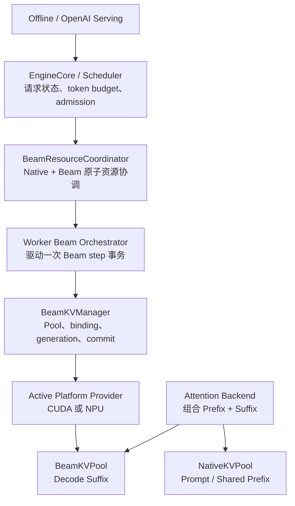
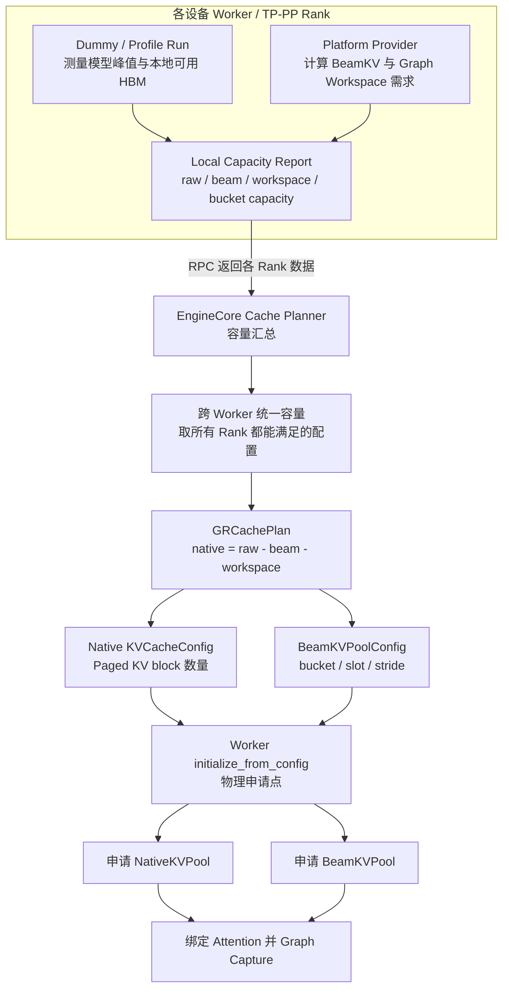
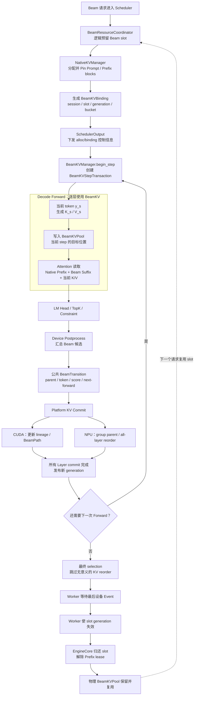
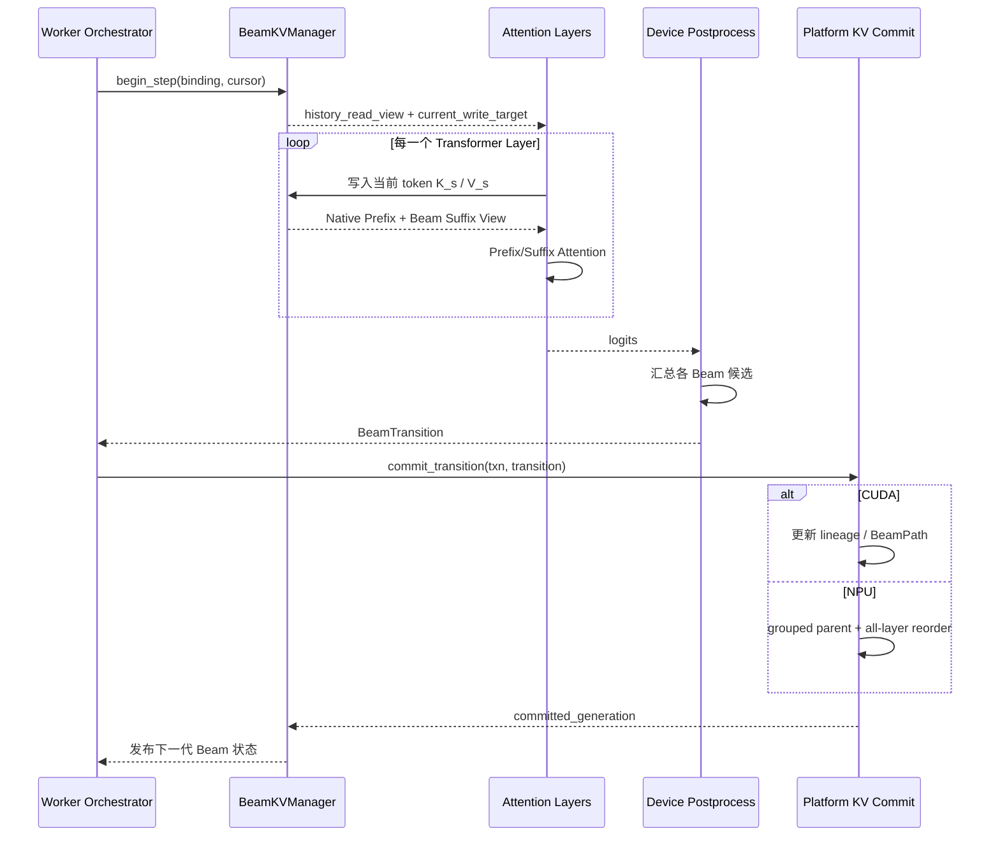
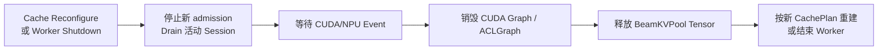
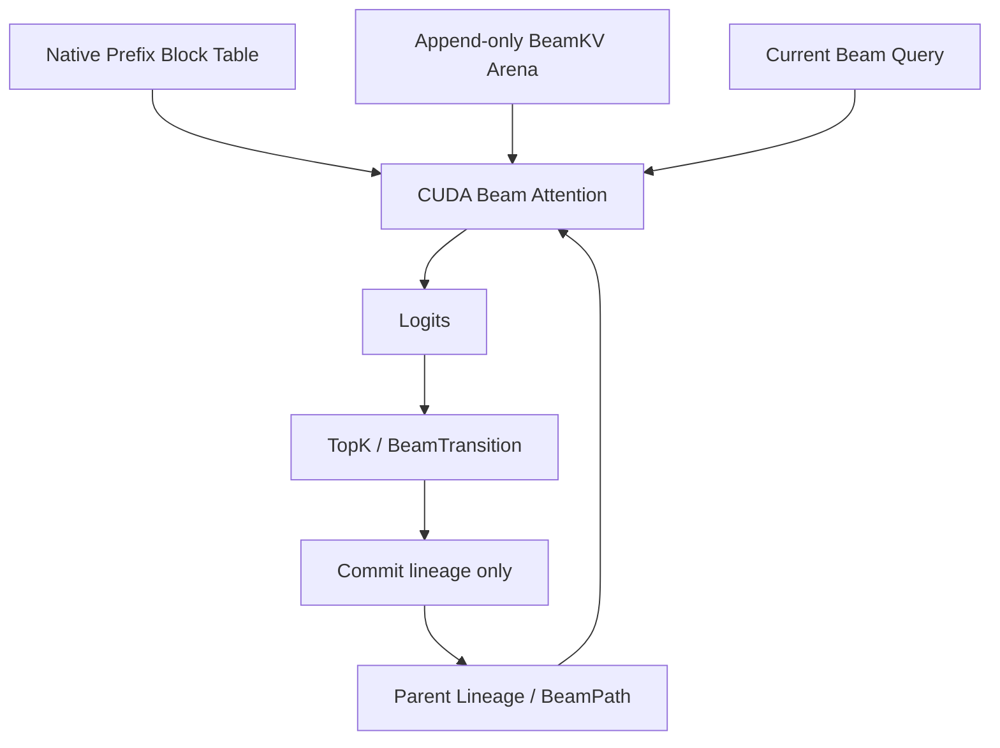
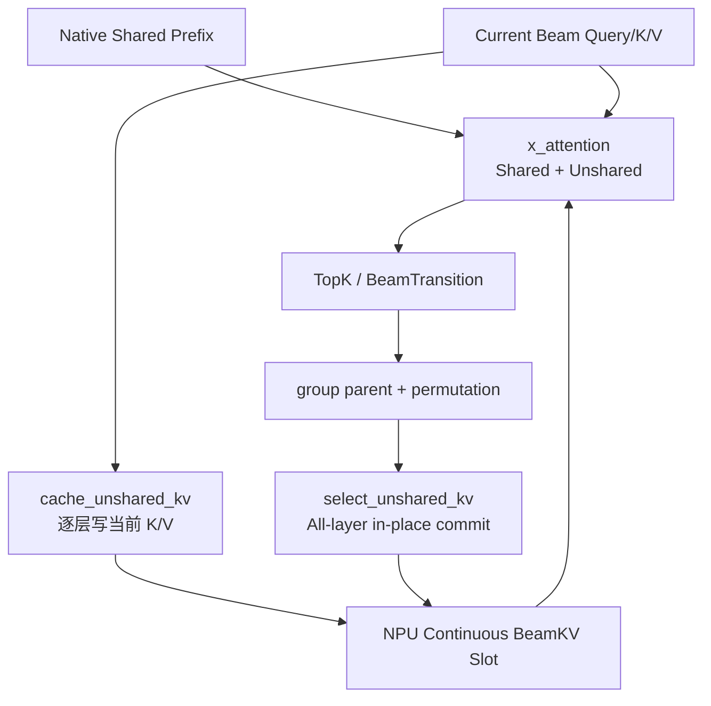

# vLLM-GR Decode BeamKV Cache 架构、数据流与容量调度设计

> 状态：Design Draft  
> 基线：vLLM `releases/v0.22.1`、`JiusiServe/vllm-gr`、`NVIDIA/recsys-examples`、`ACS_vllm-GR`  
> 范围：Decode 阶段 Beam KV Cache 的内存规划、生命周期、GPU/NPU 平台实现、数据流和 Scheduler admission  
> 非目标：本文不改变 Beam ranking、Catalog constraint、EOS、返回格式等上层语义。

## 目录

- [1. 结论摘要](#1-结论摘要)
- [2. 背景与问题定义](#2-背景与问题定义)
- [3. vLLM 原生 KV Cache 的设计理念](#3-vllm-原生-kv-cache-的设计理念)
- [4. 目标架构与所有权划分](#4-目标架构与所有权划分)
- [5. 核心对象与状态不变量](#5-核心对象与状态不变量)
- [6. 初始化阶段：显存汇总与物理 Pool 申请](#6-初始化阶段显存汇总与物理-pool-申请)
- [7. BeamKV 物理容量模型](#7-beamkv-物理容量模型)
- [8. 请求阶段：BeamKV 端到端数据流](#8-请求阶段beamkv-端到端数据流)
- [9. 单个 Decode Step 的事务模型](#9-单个-decode-step-的事务模型)
- [10. 容量安全与 Scheduler Admission](#10-容量安全与-scheduler-admission)
- [11. 释放、销毁、抢占与异常处理](#11-释放销毁抢占与异常处理)
- [12. CUDA BeamKV Provider 设计](#12-cuda-beamkv-provider-设计)
- [13. NPU BeamKV Provider 设计](#13-npu-beamkv-provider-设计)
- [14. ACS、NVIDIA 与目标方案对比](#14-acsnvidia-与目标方案对比)
- [15. 与 L0/L1/L2 执行层级的关系](#15-与-l0l1l2-执行层级的关系)
- [16. Graph 模式约束](#16-graph-模式约束)
- [17. 推荐接口与代码组织](#17-推荐接口与代码组织)
- [18. 对当前 vLLM-GR 代码的改造点](#18-对当前-vllm-gr-代码的改造点)
- [19. 可观测性、测试与验收标准](#19-可观测性测试与验收标准)
- [20. 分阶段实施建议](#20-分阶段实施建议)
- [21. 最终设计决策](#21-最终设计决策)
- [22. 代码与资料索引](#22-代码与资料索引)

---

## 1. 结论摘要

Decode BeamKV 的推荐设计不是继续把 Beam suffix 当作普通 vLLM Paged KV，也不是让
Worker 在请求到达后从“剩余 HBM”临时申请一块 Tensor，而是：

1. `NativeKVPool` 与 `BeamKVPool` 是并列的两类物理缓存；
2. `NativeKVPool` 保存普通请求、Prompt、共享 Prefix、Prefix Cache；
3. `BeamKVPool` 只保存 Beam decode suffix；
4. EngineCore 负责汇总各 Worker 的显存报告，统一规划 Native/Beam/Workspace 容量；
5. Worker/ModelRunner 根据 EngineCore 下发的配置，在本地设备上真正申请物理 Tensor；
6. Scheduler 必须把 Beam slot 当作一等资源，先 reservation，再下发请求；
7. Worker 不能自行决定 slot，只能使用 Scheduler 下发的 `BeamKVBinding`；
8. Common 层统一的是 Beam lineage、step cursor、transition 和事务可见性；
9. CUDA/NPU 不共享物理布局、Tensor tuple、重排算法或图执行参数；
10. CUDA 推荐使用 append-only BeamKV + lineage/BeamPath，避免复制历史 KV；
11. NPU 第一版推荐沿用 ACS 连续 Beam slot + `cache_unshared_kv` + `select_unshared_kv`；
12. 最后一步如果没有下一次 forward，跳过只服务于下一步 Attention 的 KV reorder；
13. 请求结束时只释放 slot 的逻辑所有权，物理 BeamKVPool 保留并复用；
14. 物理 Pool 只在 Worker shutdown、模型卸载或 CachePlan 重配置时销毁。

核心资源不变量：

```text
所有 RESERVED/ACTIVE/RELEASING session 占用的 slot 数量
    <= 启动阶段确认的全局物理 slot 容量
```

核心发布不变量：

```text
所有 Layer 的 Beam KV commit 完成
    -> committed_generation 更新
    -> 新 token / score / parent Beam 状态可见
```

---

## 2. 背景与问题定义

### 2.1 为什么 Beam decode 不能完全使用普通 Paged KV

普通自回归请求的 KV 生命周期通常是线性的：

```text
request token 0 -> token 1 -> token 2 -> ...
```

BeamSearch 的 decode history 是一棵动态树：

```text
shared prompt
  -> beam 0
  -> beam 1
  -> beam 2
       -> child 0
       -> child 1
```

每一步不仅会新增 token，还会产生：

- `parent_beam_ids`；
- 新的语义 Beam 顺序；
- Beam 淘汰和复制；
- score、token、constraint state、finished mask 的同步更新；
- 下一步 Attention 对祖先 KV 的读取关系。

如果继续完全使用普通 Paged KV，需要在每一步将新的 Beam 语义顺序映射回 Block Table，
或者执行 KV block copy。对于固定 Beam width、短 decode 的 GR 场景，这会把大量框架控制和
metadata 开销带入每个 step。

### 2.2 需要解决的四个问题

本文集中回答：

1. BeamKV 抽象放在 EngineCore、Scheduler、Worker、ModelRunner 还是 Attention；
2. BeamKV 物理内存在哪里申请、何时释放；
3. 如何在同一架构下支持 CUDA 与 Ascend NPU；
4. 物理容量有限时，Scheduler 如何保证请求不会越界或过度下发。

### 2.3 目标与非目标

目标：

- 保留 vLLM 控制面和 continuous batching；
- 支持普通请求与 Beam 请求混部；
- 支持 CUDA/NPU 对等、延迟加载和平台代码可剥离；
- 支持固定地址的 CUDA Graph/ACLGraph；
- 支持 L0 stepwise、L1 engine-resident、L2 fixed-window；
- 明确 cancel、finish、timeout、preemption、failure 的清理语义；
- 防止物理越界、双重分配和 slot 复用污染。

非目标：

- 不要求 CUDA/NPU 使用相同 KV layout；
- 不要求 CUDA/NPU 使用相同私有 Tensor 返回结构；
- 不要求第一版支持 BeamKV swap；
- 不要求第一版支持在线 Pool 扩容；
- 不将 Catalog、EOS、ranking 语义下沉给 Platform Provider；
- 不将 ModelRunner V2 升级混入 BeamKV 第一阶段。

---

## 3. vLLM 原生 KV Cache 的设计理念

### 3.1 vLLM 将逻辑容量和物理 Tensor 分开

vLLM V1 的 KVC 具有两层所有权：

| 层次 | 主要位置 | 职责 |
| --- | --- | --- |
| 逻辑 Block 管理 | EngineCore/Scheduler | block 分配、Prefix Cache、引用计数、抢占、释放 |
| 物理 Tensor | Worker/ModelRunner | 按 `KVCacheConfig` 在本地设备创建 Tensor 并绑定 Attention |

`KVCacheManager.allocate_slots()` 返回的是逻辑 Block，而不是新创建的 CUDA Tensor。
请求完成或抢占时，Scheduler 调用 `KVCacheManager.free()` 归还逻辑 Block。

### 3.2 初始化流程的真实执行位置

vLLM `EngineCore._initialize_kv_caches()` 的主要顺序为：

```text
1. model_executor.get_kv_cache_specs()
2. model_executor.determine_available_memory()
3. EngineCore.get_kv_cache_configs(...)
4. 生成 Scheduler 使用的 KVCacheConfig
5. model_executor.initialize_from_config(...)
6. Worker 创建真实 KV Tensor
```

因此：

- dummy/profile run 由 EngineCore 发起和汇总；
- dummy/profile run 实际在各 Worker 上执行；
- `num_blocks` 在 EngineCore 统一规划；
- 物理 HBM Tensor 在 Worker 创建。

BeamKV 应遵循同一理念：

> EngineCore 负责 BeamKV 容量规划，Worker 负责 BeamKV 物理内存所有权。

### 3.3 为什么不能在 Native Paged KV 之后额外申请 BeamKV

假设 profile 得到可用于 KVC 的 HBM 为 20 GiB。原生 vLLM 会近似将这部分全部换算为
Paged KV blocks。如果 Worker 随后额外申请 4 GiB BeamKV：

```text
Native Paged KV = 20 GiB
BeamKV          =  4 GiB
总需求          = 24 GiB
```

这会导致 OOM、allocator fragmentation，或者挤占 Graph workspace。

正确做法是：

```text
Native 可用容量
    = profile 可用容量
    - BeamKV 预留
    - Beam Graph/Metadata/Workspace 预留
```

---

## 4. 目标架构与所有权划分

### 4.1 总体架构



### 4.2 模块职责

| 模块 | 应负责 | 不应负责 |
| --- | --- | --- |
| EngineCore/Scheduler | session、capacity、admission、waiting、finish/cancel | 设备 Tensor、CUDA/NPU kernel |
| BeamResourceCoordinator | Native/Beam 双资源预留和回滚 | 逐层 K/V 读写 |
| Worker Orchestrator | `begin_step -> forward -> select -> commit` | 全局调度策略 |
| BeamKVManager | 物理 Pool、slot binding、generation、事务和提交 | Beam ranking、EOS、Catalog |
| Attention Backend | 消费本层 Prefix/Suffix View，写当前 K/V | 申请 session slot、释放请求 |
| Postprocess | 产生公共 `BeamTransition` | 定义平台物理 KV 顺序 |
| Platform Provider | layout、kernel、graph、workspace、commit | 改变公共 Beam 语义 |

### 4.3 双 Pool 关系

```text
NativeKVPool
  - 普通请求 KV
  - Prompt / Shared Prefix KV
  - Prefix Cache / PD / LMCache 兼容路径

BeamKVPool
  - Beam decode suffix
  - parent-child lineage 对应的物理或逻辑更新
  - CUDA/NPU 各自的物理布局
```

一次 Beam Attention 可以同时读取两类 Pool，但二者不能共享全部 allocation、free、copy、
reorder 规则。

---

## 5. 核心对象与状态不变量

### 5.1 Beam step 时间线

Prefill 已经选择第一个 Beam token `y0`，但 `KV(y0)` 尚未生成。

在 decode step `s` 开始前：

```text
当前输入 token       = y_s
已物化 Beam KV       = KV(y_0 ... y_{s-1})
materialized_kv_len  = s
selected_token_count = s + 1
decode_index         = s
```

公共层统一使用 0-based `decode_index`。ACS/xLLM 的 `decode_step` 是 1-based，转换必须
只发生在 NPU Provider 内：

```text
npu_decode_step = decode_index + 1
```

推荐对象：

```python
@dataclass(frozen=True)
class BeamStepCursor:
    decode_index: int
    materialized_kv_len: int
    selected_token_count: int
```

### 5.2 BeamKVBinding

```python
@dataclass(frozen=True)
class BeamKVBinding:
    session_id: str
    bucket_id: str
    slot_ids: tuple[int, ...]
    generation: int
    beam_width: int
    max_decode_steps: int
    prefix_lease_id: str
```

`slot_ids` 是跨 Worker 一致的逻辑编号。每个 Worker 的实际地址不同，但相同 slot ID 在
所有相关 Worker 上都必须合法。

### 5.3 BeamTransition

```python
@dataclass(frozen=True)
class BeamTransition:
    parent_beam_ids: DeviceTensor
    next_token_ids: DeviceTensor
    next_scores: DeviceTensor
    requires_next_forward: DeviceTensor
```

公共顺序是语义输出顺序，不要求按 parent 排序。

NPU 可以在 Provider 内部生成私有物理结构：

```python
@dataclass(frozen=True)
class NPUBeamCommitView:
    grouped_parent_beam_ids: DeviceTensor
    permutation: DeviceTensor
    group_token_prefix_sums: DeviceTensor
```

### 5.4 BeamKVLayerStepView

```python
@dataclass
class BeamKVLayerStepView:
    history_read_view: object
    current_write_target: object
    current_token_kv: object | None = None
```

`object` 表示 Platform opaque view。Common 层不能假设它是 GPU 的 stacked Tensor、NPU 的
K/V tuple 或某种 Block Table。

### 5.5 状态发布不变量

当前 token K/V 相对于下一代 Beam 顺序是 provisional，但对当前层 Attention 必须可见。
事务保护的对象不是“禁止当前 Attention 读取 K/V”，而是：

```text
禁止在 KV commit 完成前发布新一代 parent/token/score 状态。
```

---

## 6. 初始化阶段：显存汇总与物理 Pool 申请

### 6.1 完整初始化数据流



### 6.2 推荐统一 CachePlan

```python
@dataclass(frozen=True)
class GRCachePlan:
    native_kv_configs: tuple[KVCacheConfig, ...]
    beam_kv_configs: tuple[BeamKVPoolConfig, ...]
    scheduler_beam_capacity: BeamKVCapacityConfig
```

EngineCore 的规划伪代码：

```python
raw_available = executor.determine_available_memory()

beam_specs = executor.get_beam_kv_pool_specs(
    max_sessions=max_beam_sessions,
    beam_width_buckets=beam_width_buckets,
    decode_step_buckets=decode_step_buckets,
)

native_available = [
    raw - beam.pool_bytes - beam.graph_workspace_bytes
    for raw, beam in zip(raw_available, beam_specs)
]

native_configs = get_kv_cache_configs(
    vllm_config,
    native_kv_specs,
    native_available,
)

executor.initialize_gr_cache_from_config(
    native_configs=native_configs,
    beam_configs=beam_specs,
)
```

### 6.3 为什么物理 Tensor 在 Worker 申请

优点：

- Worker 拥有真实 device context、stream 和 allocator；
- 能按本地 PP layer、TP KV heads、dtype 精确计算；
- 不需要跨进程传递 CUDA/NPU device pointer；
- Platform Provider 可以控制 layout 和大块连续内存；
- Pool、Attention、Graph capture 位于同一执行进程；
- 能统一接入 sleep/wake、model unload、device cleanup。

代价：

- EngineCore 与 Worker 必须共享一致的 capacity/binding；
- 若不进入统一 CachePlan，会发生显存双重记账；
- 多 Worker 容量必须取共同最小值；
- 需要处理 Worker failure 和部分绑定失败；
- 独立静态 Pool 可能在没有 Beam 请求时闲置。

结论：

> Worker 是物理内存 owner，但不是容量 policy owner。

---

## 7. BeamKV 物理容量模型

### 7.1 基本容量公式

对于固定连续 layout，单个 Worker 的 Beam Pool 基础字节数可估算为：

```text
M_beam = 2 * L_local * S * W_max * T_max
         * H_kv_local * D * sizeof(dtype)
```

其中：

- `2`：K 和 V；
- `L_local`：当前 PP rank 的本地 Attention layer 数；
- `S`：物理 session slot 数；
- `W_max`：该 bucket 的 Beam width；
- `T_max`：最大 decode step；
- `H_kv_local`：当前 TP rank 的本地 KV heads；
- `D`：head dimension。

还需要额外计入：

- lineage/BeamPath；
- token、score、finished mask；
- device-side step cursor；
- stable input/output buffer；
- CUDA Graph/ACLGraph workspace；
- NPU grouped parent 和 permutation buffer；
- operator temporary workspace。

### 7.2 Bucket 与 slot

推荐按执行几何建立固定 bucket：

```python
BeamKVPoolConfig(
    buckets={
        "w32_t64": BeamKVBucket(
            beam_width=32,
            max_decode_steps=64,
            num_slots=8,
            slot_stride_bytes=...,
        ),
        "w128_t16": BeamKVBucket(
            beam_width=128,
            max_decode_steps=16,
            num_slots=4,
            slot_stride_bytes=...,
        ),
    }
)
```

物理地址：

```text
slot_base = pool_base + slot_id * slot_stride
```

防越界条件：

```text
0 <= slot_id < num_slots
beam_width <= bucket.beam_width
decode_index < bucket.max_decode_steps
binding.generation == slot.current_generation
```

### 7.3 多 Worker 全局容量

每个 bucket 的全局容量必须是所有参与 Worker 的最小值：

```text
C_global(bucket) = min(C_worker_0, C_worker_1, ..., C_worker_n)
```

例如：

| Worker | `w32_t64` 本地容量 |
| --- | ---: |
| PP0 | 10 |
| PP1 | 8 |
| PP2 | 9 |

EngineCore 只能向 Scheduler 公布 8 个全局 slot。

### 7.4 Grouped request 的资源单位

容量单位应是“独立 Beam session”，不是 API request 数量。如果一次 `ADD_BATCH` 包含 4 个
用户，每个用户有一套独立 Beam lineage：

```text
required_slots = 4
```

不能因为它们被一个 RPC 或一个 SchedulerOutput 携带，就只记为一个 slot。

---

## 8. 请求阶段：BeamKV 端到端数据流

### 8.1 完整请求生命周期



### 8.2 Prefill 到 Beam decode 的切换

1. Prefill 继续使用原生 Native Paged KV；
2. Prompt/Prefix 完成后，Prefix blocks 被 lease/pin；
3. Prefill logits 选出初始 Beam token `y0`；
4. 此时 `KV(y0)` 尚未写入 BeamKV；
5. Scheduler 必须已经为该 session 准备好 BeamKVBinding；
6. 第一次 decode forward 负责写入 `KV(y0)`。

### 8.3 每层数据流

每层 Attention 的逻辑输入为：

```text
query                = 当前 Beam hidden states
prefix_read_view     = NativeKVPool 中的 Shared Prefix
history_read_view    = BeamKVPool 中已提交的 suffix
current_write_target = BeamKVPool 中 decode_index 的目标地址
```

每层顺序：

```text
Q/K/V Projection
    -> 写当前 K/V
    -> 当前层可立即读取当前 K/V
    -> Prefix Attention
    -> Suffix/Beam Attention
    -> Merge
    -> 下一层
```

---

## 9. 单个 Decode Step 的事务模型

### 9.1 时序图



### 9.2 推荐事务 API

```python
txn = beam_kv_manager.begin_step(
    binding=binding,
    cursor=cursor,
)

logits = model_runner.forward(
    scheduler_output,
    beam_kv_step=txn,
)

transition = postprocess_backend.select(
    logits,
    beam_state,
)

completion = beam_kv_manager.commit_transition(
    txn,
    transition,
)

beam_execution_state.publish(
    transition,
    completion.generation,
)
```

### 9.3 Commit 前后的失败语义

- commit 前失败：当前 write target 尚未发布，可以覆盖或忽略；
- CUDA lineage commit 失败：旧 generation 仍有效；
- NPU 原地 reorder 中失败：不承诺通用 rollback，session 标记 fatal；
- 所有 failure 都必须使当前 binding 不再被新 step 使用；
- generation 防止迟到的异步操作污染已经复用的 slot。

---

## 10. 容量安全与 Scheduler Admission

### 10.1 为什么 Worker shape check 不够

Worker 中的：

```text
batch <= max_batch
beam <= max_beams
step < max_steps
```

只能防止单次调用直接越界，无法阻止多个并发请求的总容量超过物理 Pool。

正确方式是：

> Scheduler 在请求下发前完成 reservation；Worker 只接受具有有效 binding 的请求。

### 10.2 Beam slot 状态机

```text
FREE
  -> RESERVED
  -> ACTIVE
  -> RELEASING
  -> FREE
```

| 状态 | 含义 | 能否执行 forward |
| --- | --- | --- |
| `FREE` | 无请求占用 | 否 |
| `RESERVED` | Scheduler 已预留，Worker 尚未全部绑定 | 否 |
| `ACTIVE` | 所有 Worker 均绑定成功 | 是 |
| `RELEASING` | 最后设备操作尚未确认完成 | 否 |

### 10.3 Admission 条件

```python
admissible = (
    token_budget_available
    and native_prefix_kv_available
    and beam_kv_slot_available
    and compatible_graph_bucket_available
)
```

BeamKV 是和 token budget、Native KV blocks、`max_num_seqs` 并列的调度资源。

### 10.4 原子资源预留

推荐伪代码：

```python
beam_spec = normalize_beam_request(request)

bucket = beam_capacity_manager.select_smallest_compatible_bucket(
    beam_width=beam_spec.beam_width,
    max_decode_steps=beam_spec.max_decode_steps,
)

if bucket is None:
    fallback_or_reject(request)
    continue

reservation = beam_capacity_manager.try_reserve(
    bucket=bucket,
    num_slots=beam_spec.num_sessions,
)

if reservation is None:
    request.status = WAITING_FOR_BEAM_KV
    continue

native_blocks = kv_cache_manager.allocate_slots(
    request,
    num_new_tokens,
)

if native_blocks is None:
    beam_capacity_manager.rollback(reservation)
    continue

binding = beam_capacity_manager.commit(reservation)

scheduler_output.beam_kv_allocs[request.request_id] = binding
```

禁止以下流程：

```text
先把请求下发给 Worker
    -> Worker 才发现 Pool 不足
    -> 临时扩容或 OOM
```

### 10.5 Eager reservation 与延迟 reservation

#### Eager reservation

请求进入执行前一次性预留完整 Beam window。

优点：

- 不会在 Prefill 完成后才发现无 Beam capacity；
- 适合 fixed-window Graph；
- 地址和 shape 稳定；
- session 中途不会因 KVC 不足失败。

缺点：

- chunked prefill 期间 Beam slot 可能闲置；
- 大请求可能长期占用 reservation。

#### 延迟 reservation

在最后一个 Prefill chunk 或 Prefill-to-Decode 边界才申请。

优点：Beam slot 利用率更高。  
缺点：Prefix 已经占用 Native KV 后可能长时间等待 Beam slot，形成另一类资源死锁或浪费。

第一版建议使用 eager reservation，优先保证正确性和 full-graph 稳定性。

### 10.6 Bucket 选择和公平性

推荐 best-fit：选择能容纳请求的最小 bucket。

```text
W=24,T=48 -> w32_t64
W=80,T=12 -> w128_t16
```

Scheduler 可以在大请求等待时继续调度能放入其他 bucket 的小请求，避免全局队头阻塞；
同时需要 aging 或 reservation priority，防止大 bucket 请求永久饥饿。

### 10.7 Worker 最后防线

即使 Scheduler 已 reservation，Worker 仍需验证：

```python
assert binding.bucket_id in local_pool.buckets
assert all(0 <= slot < local_bucket.num_slots for slot in binding.slot_ids)
assert binding.generation == local_slot.generation
assert binding.beam_width <= local_bucket.beam_width
assert cursor.decode_index < local_bucket.max_decode_steps
assert local_slot.state == ACTIVE
```

这些检查是安全防线，不是 admission policy。

---

## 11. 释放、销毁、抢占与异常处理

### 11.1 逻辑释放与物理销毁

| 操作 | 触发时机 | 位置 | 动作 |
| --- | --- | --- | --- |
| 逻辑释放 | finish/cancel/timeout/error | Worker + EngineCore | generation 失效、slot 归还、Prefix lease 解除 |
| 物理销毁 | shutdown/unload/reconfigure | Worker | 删除 BeamKVPool Tensor，归还 HBM |
| 普通复用 | 新 session 使用旧 slot | Worker | 不销毁 Tensor，只覆盖有效区域 |
| Graph 重建 | Pool 地址/shape 变化 | Worker/Platform | 销毁旧 Graph，重新 capture |

### 11.2 正常释放流程

```text
最后一次 forward
  -> 最终 Beam selection
  -> requires_next_forward = false
  -> 跳过下一步专用 reorder
  -> 等待最后设备 Event
  -> Worker release ack
  -> EngineCore 将 slot 标记 FREE
  -> Prefix lease 解除
```

### 11.3 generation 防止 use-after-free

旧 session：

```python
BeamKVBinding(slot_id=3, generation=8)
```

释放并复用后：

```python
BeamKVBinding(slot_id=3, generation=9)
```

任何来自 generation 8 的迟到操作都必须被拒绝。

### 11.4 抢占策略

可选方案：

| 方案 | 优点 | 问题 |
| --- | --- | --- |
| 抢占后保留 slot | 恢复快 | 被抢占请求继续占用稀缺容量 |
| 释放 slot，恢复时重算 suffix | 真正释放容量 | 恢复代价高 |
| BeamKV swap 到 Host/远端 | 资源利用率高 | 数据搬运、lineage 和地址恢复复杂 |

第一版建议：

> Active Beam decode 不做保留式抢占；若必须抢占，释放 Beam slot，恢复时从 Prefix 重算。

### 11.5 物理销毁流程



---

## 12. CUDA BeamKV Provider 设计

### 12.1 借鉴 NVIDIA 的 ContextKV + BeamKV + BeamPath

NVIDIA SID-GR 的 Beam decode 将：

- Context K/V：Prefill 产生，所有 Beam 共享；
- Beam K/V：每一步新增；
- `topk_indices`：表示当前 Beam 在历史每一步的祖先；
- 专用 Attention kernel：根据 BeamPath 读取祖先 K/V。

这是很自然的 GPU Beam 数据模型。

### 12.2 NVIDIA 示例不能直接用于 serving 的部分

当前示例在一次 `generate_beam_decode()` 内创建：

```python
beam_kv_caches = [None] * num_layers
```

每一步通过 `torch.cat()` 扩展历史 K/V：

```python
torch.cat([k_prev, k_new], dim=1)
torch.cat([v_prev, v_new], dim=1)
```

问题：

- 每步动态分配；
- 每步复制历史；
- Tensor 地址变化；
- 多个调用没有统一容量；
- PyTorch OOM 是事实上的最终容量检查；
- 不适合 CUDA Graph 和 continuous batching。

### 12.3 推荐 CUDA 物理布局

第一版可以采用固定 arena：

```text
[layer, session_slot, step, beam, kv_head, head_dim]
```

或等价的 step-major flattened layout：

```text
[layer, session_slot, step_offset + beam, kv_head, head_dim]
```

每一步只写当前 `(step, beam)`，不复制历史。

### 12.4 CUDA commit

Postprocess 返回：

```text
parent_beam_ids = [3, 1, 1, 1]
```

CUDA commit 只更新：

- parent lineage；
- BeamPath/topk indices；
- valid length；
- generation；
- token/score state。

历史 BeamKV 保持 append-only，不根据新 Beam 顺序物理搬移。

### 12.5 CUDA 数据流



---

## 13. NPU BeamKV Provider 设计

### 13.1 借鉴 ACS 的 Shared/Unshared KV

ACS 使用：

```text
Shared KV   = vLLM Paged KV 中的 Prompt/Prefix
Unshared KV = 连续 Beam decode KV
```

Unshared 形状：

```text
[batch_slot, beam, kv_head, max_decode_steps, head_dim]
```

每层使用 `cache_unshared_kv` 写当前 token，`x_attention` 读取 Shared + Unshared；
selection 后使用 `select_unshared_kv` 对所有 Layer 的 Beam 行原地重排。

### 13.2 推荐保留的部分

- 连续 Beam slot layout；
- `cache_unshared_kv` 逐层写入；
- `x_attention` 组合 Shared/Unshared；
- `select_unshared_kv` 集中 all-layer commit；
- graph-stable persistent buffer；
- 最后一步跳过 reorder。

### 13.3 需要改造的部分

ACS 当前实现主要是 batch-wide 单 Context：

- `NPUModelRunner` 只有一个 `_beam_search_context`；
- Pool 不足时 lazy grow；
- grow 会改变地址并清除 ACLGraph；
- `reset_buffers()` 重置整块 Pool；
- 依赖 Beam chunk 串行执行假设；
- 没有 Scheduler 级 reservation。

vLLM-GR 服务化后需要：

- 每个逻辑 session 独立 slot；
- Scheduler 下发 slot binding；
- 不在运行中扩容；
- 不因一个请求结束而 reset 全 Pool；
- 只清理该 slot 的 metadata/generation；
- 任意到达和取消不影响其他 slot。

### 13.4 NPU grouped commit

公共语义：

```text
parents = [3, 1, 1, 1]
tokens  = [E, F, G, H]
```

NPU Provider 私有 canonicalization：

```text
parents = [1, 1, 1, 3]
tokens  = [F, G, H, E]
group_token_prefix_sums = [0, 3, 3, 4]
```

parent、token、score、sequence、finished、constraint state 必须应用同一个 permutation。
公共 `BeamTransition` 的顺序不能被 NPU kernel 约束污染。

### 13.5 NPU 数据流



---

## 14. ACS、NVIDIA 与目标方案对比

### 14.1 容量与生命周期对比

| 维度 | ACS_vllm-GR | NVIDIA SID-GR | vLLM-GR 目标 |
| --- | --- | --- | --- |
| 物理内存 | 固定但可 lazy grow 的 BufferPool | 每次 generate 动态增长 | 初始化阶段固定 Pool |
| 容量单位 | 当前 batch shape | 实际 Tensor 大小 | Scheduler-visible bucket/slot |
| 防越界 | Worker shape 检查 | 动态 Tensor，无固定上限 | reservation + Worker 检查 |
| 并发 session | 基本为单 Context | 调用间无统一管理 | 多 session 独立 slot |
| Pool 不足 | 扩容、重建 ACLGraph | 继续申请直到 OOM | 请求等待，不下发 |
| 请求释放 | reset Context/Buffer | 函数返回后 Tensor 释放 | 释放逻辑 slot，物理 Pool 复用 |
| Graph 友好 | 地址不变时友好 | 不友好 | 固定地址和 bucket |
| Beam 更新 | NPU 物理 reorder | GPU lineage/topk indices | 各平台独立实现 |
| Scheduler 参与 | 无 | 无 | 必须参与 |

### 14.2 ACS 的适用性与不足

ACS 解决的是：

```text
当前执行 batch 是否能被当前 BufferPool 容纳。
```

优点：

- 有明确 `max_batch/max_beam/max_step`；
- Tensor slice 防止单次调用越界；
- persistent buffer 适合 ACLGraph；
- NPU all-layer reorder 边界清晰。

不足：

- 没有多个并发 session 的 reservation；
- 单一 `_beam_search_context` 使请求生命周期耦合；
- Pool 不足时扩容而不是 backpressure；
- 扩容可能 OOM 并使 graph 失效；
- 不能直接满足 vLLM continuous batching。

### 14.3 NVIDIA 的适用性与不足

NVIDIA 解决的是：

```text
单次 generate 内如何用 lineage 表达 Beam ancestry，并由专用 kernel 读取 Beam KV。
```

优点：

- `ContextKV + BeamKV + BeamPath` 数据模型自然；
- 内存按当前实际 batch/beam/step 增长；
- lineage 避免根据新 Beam 顺序复制历史 KV；
- 适合 GPU 专用 kernel。

不足：

- 没有固定物理容量；
- 没有 Scheduler admission；
- `torch.cat` 动态分配并复制；
- 地址不稳定；
- 并发调用总量无统一控制；
- 不适合 full graph serving。

### 14.4 推荐融合关系

```text
vLLM
  -> 继承 EngineCore 统一容量规划
  -> 继承 Scheduler admission/free 思路

NVIDIA
  -> 继承 GPU append-only BeamKV + lineage/BeamPath

ACS
  -> 继承 NPU continuous slot + cache/select ops

vLLM-GR Common
  -> 统一 Binding、Cursor、Transition、Transaction、Generation
```

---

## 15. 与 L0/L1/L2 执行层级的关系

BeamKV 接口不应固定 Beam loop 在 Host、Engine 还是 Device。

| 级别 | Transition 产生位置 | BeamKV 事务 |
| --- | --- | --- |
| L0 Stepwise | Host/frontend 每步产生或传回 | Worker 每次 forward 独立 begin/commit |
| L1 Engine-resident | Engine/Worker 每步产生 | Worker 每步事务，Scheduler 可重组 batch |
| L2 Fixed window | Worker/device 多步连续产生 | Worker 内连续事务，地址和 workspace 固定 |

稳定演进边界应是：

```text
BeamTransition + BeamKVStepTransaction
```

变化的只是：

- transition producer 在哪里；
- Host 是否参与 step 间决策；
- 是否允许 Scheduler 在 step 间重组 batch；
- 是否进入固定 shape/address 的多步 Graph。

---

## 16. Graph 模式约束

### 16.1 必须稳定的对象

- BeamKVPool base address；
- slot stride；
- binding input buffer 地址；
- parent/permutation buffer 地址；
- Attention metadata buffer 地址；
- postprocess output buffer 地址；
- operator workspace；
- graph signature 对应的 batch/beam/step geometry。

### 16.2 Graph signature

推荐至少包含：

```text
platform
batch_bucket
beam_width_bucket
decode_step_bucket 或固定 window
dtype
kv_layout
attention_backend
postprocess_variant
```

### 16.3 禁止的 hot-path 行为

- `torch.cat` 扩展 BeamKV；
- Pool 在线 grow；
- 按请求重新申请 parent buffer；
- 重新创建 metadata Tensor；
- 运行时在 Common hot path 判断 CUDA/NPU；
- Graph capture 后改变 Pool 地址；
- 因一个 session 完成而 `zero_()` 整个 Pool。

### 16.4 Fallback

不满足 bucket、地址或 kernel 能力时，必须安全回退：

```text
FULL GRAPH
  -> PIECEWISE GRAPH
  -> EAGER
```

回退不能改变 Beam 语义或 KV generation 规则。

---

## 17. 推荐接口与代码组织

### 17.1 目录建议

```text
vllm_gr/
├── v1/
│   ├── beam/
│   │   └── kv/
│   │       ├── protocol.py
│   │       ├── binding.py
│   │       ├── cursor.py
│   │       ├── transition.py
│   │       └── transaction.py
│   ├── engine/
│   │   └── beam_resource_coordinator.py
│   └── worker/
│       ├── beam_execution_orchestrator.py
│       └── beam_kv/
│           ├── manager.py
│           ├── cuda.py
│           └── npu.py
└── platforms/
    ├── protocol.py
    ├── cuda.py
    └── npu.py
```

### 17.2 Platform Provider 扩展

```python
class GRBackendProvider(Protocol):
    @property
    def device_type(self) -> str:
        ...

    def estimate_beam_kv_pool(
        self,
        request: BeamKVCapacityRequest,
        worker_topology: WorkerTopology,
    ) -> BeamKVPoolSpec:
        ...

    def create_beam_kv_manager(
        self,
        config: BeamKVPoolConfig,
        runtime: WorkerRuntimeContext,
    ) -> BeamKVManager:
        ...
```

Provider 在进程初始化时解析并缓存。Hot path 不重复查询 registry 或 `current_platform`。

### 17.3 BeamKVManager 最小语义接口

```python
class BeamKVManager(Protocol):
    def bind(self, binding: BeamKVBinding) -> None:
        ...

    def begin_step(
        self,
        binding: BeamKVBinding,
        cursor: BeamStepCursor,
    ) -> BeamKVStepTransaction:
        ...

    def layer_view(
        self,
        txn: BeamKVStepTransaction,
        layer_idx: int,
    ) -> object:
        ...

    def commit_transition(
        self,
        txn: BeamKVStepTransaction,
        transition: BeamTransition,
    ) -> BeamKVCommitCompletion:
        ...

    def release(self, binding: BeamKVBinding) -> BeamKVReleaseCompletion:
        ...
```

`layer_view()` 和 completion 可以是平台私有对象，Common 不展开其 Tensor 结构。

### 17.4 EngineCore CapacityManager

```python
class BeamKVCapacityManager:
    def select_smallest_compatible_bucket(...): ...
    def try_reserve(...): ...
    def commit(...): ...
    def rollback(...): ...
    def mark_releasing(...): ...
    def complete_release(...): ...
    def get_usage(...): ...
```

它只维护逻辑 slot，不持有设备 Tensor。

---

## 18. 对当前 vLLM-GR 代码的改造点

### 18.1 Scheduler

当前 Scheduler patch 主要通过临时包装 `get_computed_blocks()`，限制 Beam request 的
Prefix Cache 命中范围。这只能解决 prefix visibility，不能解决双 Pool 的 allocation。

需要增加：

- Beam request resource spec；
- `BeamKVCapacityManager`；
- `WAITING_FOR_BEAM_KV`；
- Native/Beam 双资源 reservation；
- SchedulerOutput 中的 alloc/release/binding；
- Beam decode 阶段不再为 suffix 继续分配 Native KV slots；
- Prefix block lease/pin；
- finish/cancel/preempt 的联合清理。

### 18.2 ModelRunner

当前 GPU/NPU ModelRunner patch 已经分开处理不同 `_prepare_inputs()` 和
`_bookkeeping_sync()` tuple contract，这是合理的。BeamKV 不应再次把这些平台私有 tuple
拉回 Common。

需要增加：

- Worker-side Beam execution orchestrator；
- binding/control op 处理；
- begin/commit/release 事务；
- stable per-bucket device buffer；
- Postprocess 后的 Platform commit；
- generation 和 release ack。

### 18.3 BeamAttention

当前 `BeamAttentionImpl` 仍直接处理：

- CUDA/NPU 分支；
- GPU stacked KVC 与 NPU tuple KVC；
- 从 Native KVC gather suffix；
- Common metadata 中的 NPU-specific mask。

目标调整：

```text
BeamAttentionPlan
  -> Platform Metadata Materialization
  -> Platform Attention Execution
```

Common plan 只描述：

- standard segment；
- shared prefix segment；
- Beam suffix logical segment；
- query indices；
- binding/cursor。

CUDA/NPU metadata、mask、workspace、block table、BeamPath、group prefix 都由 Provider 私有化。

### 18.4 Platform registry

当前 Provider Protocol 已覆盖环境、ModelRunner hooks 和 Attention execution。需要扩展
BeamKV estimate/factory/lifecycle，并确保：

- CUDA 进程不 import `torch_npu`、`vllm_ascend`；
- NPU 进程不无条件加载 CUDA execution stack；
- Common 不包含硬件选择分支；
- 删除某个平台目录不要求修改 Common runtime。

---

## 19. 可观测性、测试与验收标准

### 19.1 关键指标

容量：

- `beam_kv_pool_bytes{worker,bucket}`；
- `beam_kv_slots_total{bucket}`；
- `beam_kv_slots_used{bucket}`；
- `beam_kv_slots_reserved{bucket}`；
- `beam_kv_slot_utilization{bucket}`；
- `native_kv_blocks_reduced_by_beam_reservation`。

调度：

- `beam_kv_admission_success_total`；
- `beam_kv_admission_wait_total`；
- `beam_kv_wait_time_ms`；
- `beam_kv_bucket_miss_total`；
- `beam_kv_reservation_rollback_total`；
- `beam_kv_starvation_age_ms`。

事务：

- `beam_kv_begin_step_total`；
- `beam_kv_commit_latency_us`；
- `beam_kv_release_latency_us`；
- `beam_kv_generation_mismatch_total`；
- `beam_kv_session_fatal_total`；
- `beam_kv_final_step_reorder_skipped_total`。

### 19.2 单元测试

- bucket best-fit；
- slot reserve/commit/rollback；
- `FREE -> RESERVED -> ACTIVE -> RELEASING -> FREE`；
- generation reuse；
- grouped request 消耗多个 slot；
- global capacity 取最小 Worker；
- Beam/native 任一分配失败时资源回滚；
- final-step skip；
- cancel/timeout release；
- stale binding 拒绝；
- decode index 越界拒绝。

### 19.3 跨平台语义测试

给 CUDA/NPU 相同：

- logits；
- 初始 score；
- parent candidate；
- EOS mask；
- Catalog constraint；
- Beam width 和 decode steps。

要求产生相同公共 `BeamTransition`：

```text
parent_beam_ids
next_token_ids
next_scores
requires_next_forward
```

随后分别验证：

- CUDA lineage/path 对下一步 Attention 的读取正确；
- NPU grouped permutation 和 all-layer reorder 正确。

### 19.4 并发和故障测试

- 多 session 同 bucket 并发；
- 多 bucket 混部；
- 普通请求与 Beam 请求混部；
- Pool 满时请求等待，不下发；
- slot 释放后立即复用；
- 旧 generation 的迟到 completion；
- Worker bind 失败时全局 rollback；
- NPU commit 中失败时 session-fatal；
- EngineCore cancel 与 Worker release 交叉；
- Graph replay 时 Pool 地址保持不变。

### 19.5 验收不变量

```text
1. 任意时刻 reserved + active + releasing <= global capacity
2. 任意 ACTIVE binding 在所有 Worker 上均存在相同逻辑 slot
3. 未持有 ACTIVE binding 的请求不能进入 Beam forward
4. decode_index 永远小于 bucket.max_decode_steps
5. 新 generation 不读取旧 generation 的有效长度和状态
6. 发布新 Beam 状态前所有 Layer commit 已完成
7. final step 不执行下一步专用 KV reorder
8. CUDA 运行时不加载 NPU execution modules
9. NPU 运行时不依赖 CUDA BeamKV layout
```

---

## 20. 分阶段实施建议

### Phase 0：固定语义与容量配置

- 定义 `BeamStepCursor`；
- 定义 `BeamKVBinding`；
- 定义 `BeamTransition`；
- 定义 `BeamKVPoolConfig/BeamKVCapacityConfig`；
- 固定 0-based/1-based step 转换边界；
- 增加 Pool 字节估算和启动日志。

### Phase 1：统一 CachePlan 与 admission

- profile 后扣除 BeamKV/Workspace 预算；
- EngineCore 生成 Native + Beam 两套配置；
- Worker 初始化期分配固定 BeamKVPool；
- Scheduler 增加 `BeamKVCapacityManager`；
- 实现 reservation/rollback/binding/release；
- Pool 满时进入 `WAITING_FOR_BEAM_KV`。

### Phase 2：NPU Provider

- 将 ACS BufferPool 改成多 session slot；
- 接入 `cache_unshared_kv`；
- 接入 `x_attention`；
- 接入 grouped parent canonicalization；
- 接入 all-layer `select_unshared_kv`；
- 接入 final-step skip；
- 去掉运行中 lazy grow。

### Phase 3：CUDA Provider

- 固定 append-only BeamKV arena；
- stable current-write target；
- parent lineage/BeamPath；
- 专用 Beam Attention view；
- 移除 `torch.cat` 和历史 KV copy；
- 验证与 NVIDIA reference 的语义一致性。

### Phase 4：Worker 事务与 device postprocess

- `BeamKVStepTransaction`；
- forward/select/commit/publish 顺序；
- device-resident BeamTransition；
- generation 和 release ack；
- L1 engine-resident integration。

### Phase 5：Full Graph

- stable metadata/workspace；
- bucket lazy capture；
- CUDA Graph/ACLGraph replay；
- L2 fixed-window；
- FULL/PIECEWISE/EAGER fallback；
- 性能和尾延迟验证。

---

## 21. 最终设计决策

建议将以下内容作为后续实现和 Issue 拆分的共同前提：

- [ ] NativeKVPool 与 BeamKVPool 是并列物理资源；
- [ ] Prompt/Shared Prefix 继续由原生 vLLM KVCacheManager 管理；
- [ ] Beam decode suffix 由 Worker-side BeamKVManager 管理；
- [ ] EngineCore 统一规划 Native/Beam/Workspace 显存；
- [ ] Worker 不允许在 Native Paged KV 分配后偷偷扩容 BeamKV；
- [ ] Scheduler 必须先 reservation，再下发 Beam 请求；
- [ ] 全局 bucket capacity 取所有相关 Worker 的最小值；
- [ ] Grouped request 按逻辑 Beam session 数消耗 slot；
- [ ] Common 只统一 binding/cursor/transition/transaction；
- [ ] GPU/NPU 不共享物理 layout 和 commit 算法；
- [ ] CUDA 第一目标是 append-only BeamKV + lineage；
- [ ] NPU 第一目标是 continuous slot + all-layer in-place reorder；
- [ ] 多 Layer KV commit 完成后才能发布新 generation；
- [ ] NPU 原地 commit 失败按 session-fatal 处理；
- [ ] final step 跳过仅服务于下一次 forward 的 reorder；
- [ ] 请求完成只释放逻辑 slot，不销毁物理 Pool；
- [ ] 第一版使用 eager reservation、固定 bucket、固定 slot；
- [ ] 第一版不做在线扩容和 BeamKV swap；
- [ ] BeamKV 事务边界同时支持 L0/L1/L2。

最终可以概括为：

> vLLM 提供控制面、容量规划和调度哲学；NVIDIA 提供 CUDA BeamPath 数据模型；ACS 提供
> NPU Shared/Unshared KV 与设备算子路径；vLLM-GR Common 统一跨平台 Beam 语义和事务，
> 但不统一硬件物理实现。

---

## 22. 代码与资料索引

### vLLM `releases/v0.22.1`

- [EngineCore KV cache initialization](https://github.com/vllm-project/vllm/blob/releases/v0.22.1/vllm/v1/engine/core.py)
- [KVCacheManager](https://github.com/vllm-project/vllm/blob/releases/v0.22.1/vllm/v1/core/kv_cache_manager.py)
- [KV cache config planning](https://github.com/vllm-project/vllm/blob/releases/v0.22.1/vllm/v1/core/kv_cache_utils.py)
- [GPUWorker memory profiling and initialization](https://github.com/vllm-project/vllm/blob/releases/v0.22.1/vllm/v1/worker/gpu_worker.py)
- [GPUModelRunner KV tensor initialization](https://github.com/vllm-project/vllm/blob/releases/v0.22.1/vllm/v1/worker/gpu_model_runner.py)

### JiusiServe/vllm-gr

- [Multi-platform Backend RFC #230](https://github.com/JiusiServe/vllm-gr/issues/230)
- [EngineCore/Scheduler patch](https://github.com/JiusiServe/vllm-gr/blob/main/vllm_gr/v1/engine/engine_core_patch.py)
- [Common ModelRunner Beam helpers](https://github.com/JiusiServe/vllm-gr/blob/main/vllm_gr/v1/worker/model_runner_common.py)
- [Active-platform ModelRunner dispatcher](https://github.com/JiusiServe/vllm-gr/blob/main/vllm_gr/v1/worker/model_runner_patch.py)
- [BeamAttention implementation](https://github.com/JiusiServe/vllm-gr/blob/main/vllm_gr/v1/attention/backends/beam_attn.py)
- [BeamAttention metadata](https://github.com/JiusiServe/vllm-gr/blob/main/vllm_gr/v1/attention/backends/beam_attn_metadata.py)
- [CUDA BeamAttention execution](https://github.com/JiusiServe/vllm-gr/blob/main/vllm_gr/v1/attention/backends/beam_attn_gpu.py)
- [NPU BeamAttention execution](https://github.com/JiusiServe/vllm-gr/blob/main/vllm_gr/v1/attention/backends/beam_attn_npu.py)
- [Platform Provider protocol](https://github.com/JiusiServe/vllm-gr/blob/main/vllm_gr/platforms/protocol.py)

### NVIDIA/recsys-examples

- [SID-GR generate_beam_decode](https://github.com/NVIDIA/recsys-examples/blob/main/examples/sid_gr/model/gpt_model.py)
- [BeamSearch and build_beam_topk_indices](https://github.com/NVIDIA/recsys-examples/blob/main/examples/sid_gr/beam_search/beam_search.py)
- [JaggedFlashAttnBlock decode_beam](https://github.com/NVIDIA/recsys-examples/blob/main/examples/sid_gr/model/jagged_flash_attn_block.py)

### ACS_vllm-GR

- [BeamSearchBufferPool and BeamSearchContext](https://github.com/zhanghanleo10/ACS_vllm-GR/blob/main/vllm-ascend/vllm_ascend/beam_search/context.py)
- [Ascend Beam Attention](https://github.com/zhanghanleo10/ACS_vllm-GR/blob/main/vllm-ascend/vllm_ascend/attention/attention_v1.py)
- [NPUModelRunner Beam integration](https://github.com/zhanghanleo10/ACS_vllm-GR/blob/main/vllm-ascend/vllm_ascend/worker/model_runner_v1.py)
