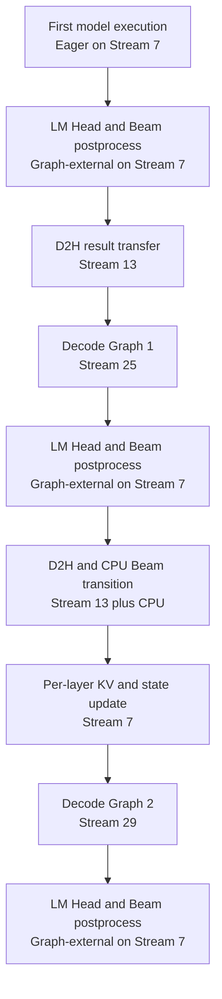
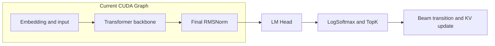
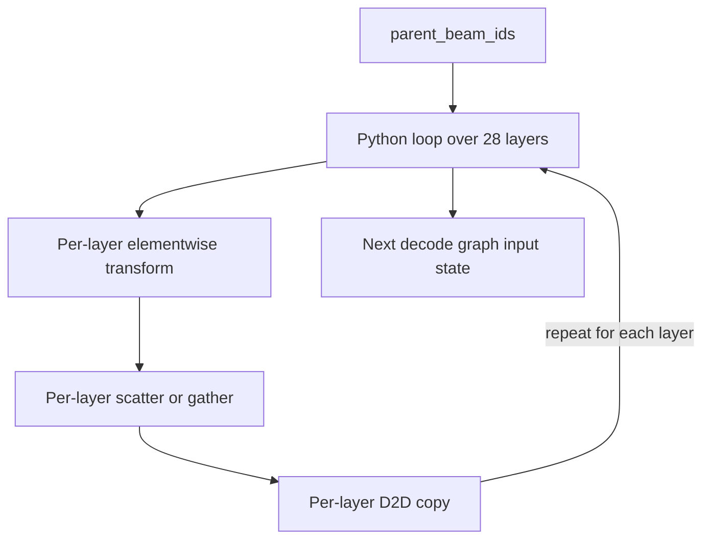
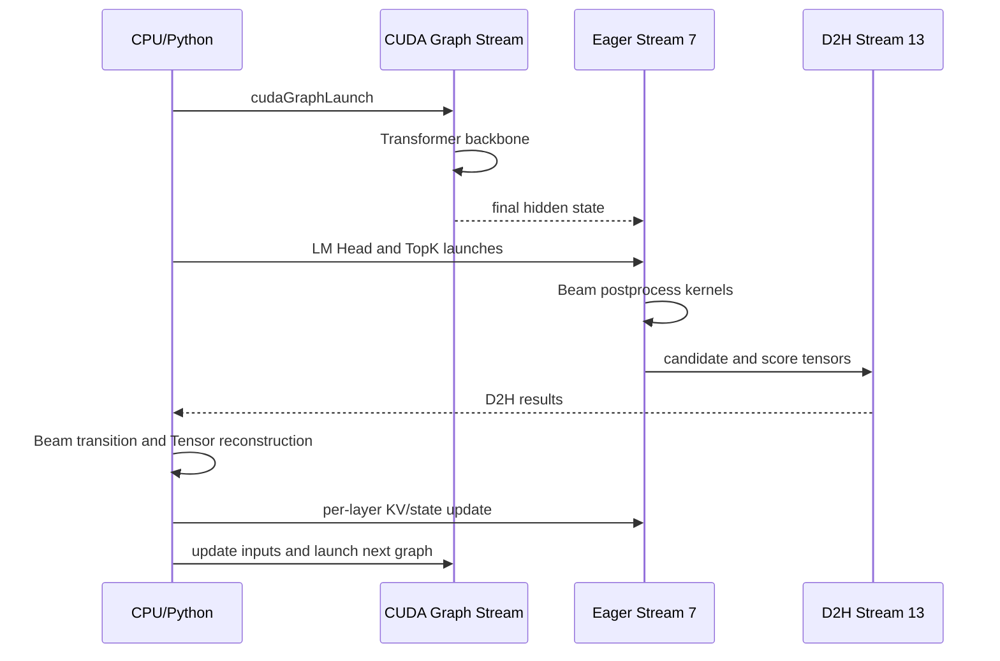

# vLLM-GR BeamSearch CUDA Graph Profiling 时间线与图外开销分析

> 状态：Profiling Analysis  
> 采集设备：NVIDIA L20，SM 8.9，92 SM，约 48 GB HBM  
> Trace：PyTorch Profiler / CUPTI Chrome Trace，包含 CPU op、CUDA Runtime、CUDA Driver、GPU Kernel、Memcpy、Memset 与 NVTX annotation  
> 分析范围：`beam_search_replay_0` 到 `beam_search_replay_4`，重点分析 Decode CUDA Graph 边界、BeamSearch 后处理、CUDA Stream 职责，以及相邻 Graph replay 之间约 83 ms 的图外间隔  
> 非目标：本文不使用单份带 Profiler 的 trace 推导无 Profiler 的绝对线上时延，也不把 kernel 名称推断当作源码级最终结论。

## 目录

- [1. 结论摘要](#1-结论摘要)
- [2. Trace 基本信息与分析方法](#2-trace-基本信息与分析方法)
- [3. 一次 BeamSearch Replay 的总体结构](#3-一次-beamsearch-replay-的总体结构)
- [4. CUDA Graph 的实际边界](#4-cuda-graph-的实际边界)
- [5. BeamSearch 后处理在时间线中的位置](#5-beamsearch-后处理在时间线中的位置)
- [6. CUDA Stream 职责](#6-cuda-stream-职责)
- [7. 两张 Decode Graph 之间的时间分析](#7-两张-decode-graph-之间的时间分析)
- [8. 约 84.8 ms 间隔的分阶段拆解](#8-约-848-ms-间隔的分阶段拆解)
- [9. D2H 与同步是不是主要瓶颈](#9-d2h-与同步是不是主要瓶颈)
- [10. Python BeamSearch 状态处理的证据](#10-python-beamsearch-状态处理的证据)
- [11. KV 重排的执行特征](#11-kv-重排的执行特征)
- [12. Profiler 放大效应与结论边界](#12-profiler-放大效应与结论边界)
- [13. 当前 Graph 完整度判断](#13-当前-graph-完整度判断)
- [14. 优化优先级](#14-优化优先级)
- [15. 建议的验证实验](#15-建议的验证实验)
- [16. 最终结论](#16-最终结论)

---

## 1. 结论摘要

本次 trace 的主要结论如下。

1. 每次 `beam_search_replay_N` 包含三轮模型计算：
   - 第一轮在 Stream 7 上以 Eager 方式执行；
   - 后两轮分别通过 Stream 25 和 Stream 29 执行 CUDA Graph replay。
2. 每次 replay 中恰好出现：
   - 3 次 `aten::log_softmax`；
   - 3 次 `aten::topk`；
   - 2 次 `cudaGraphLaunch`。
3. 每次 `cudaGraphLaunch` 覆盖完整 Transformer backbone，从输入 embedding/RMSNorm 一直到 final RMSNorm。
4. CUDA Graph 当前不包含：
   - LM Head；
   - `log_softmax`；
   - `argmax`；
   - `topk`；
   - Beam score、candidate 和 parent Beam 处理；
   - KV/state 重排；
   - D2H 与 Python BeamSearch 控制逻辑。
5. 相邻两张 Decode Graph 之间平均间隔约为 **83.12 ms**，但 GPU kernel 的累计执行只有约 **1.57 ms**。
6. D2H 的实际设备搬运约为 **14.1 µs**，显式同步 API 也只有几十微秒。PCIe 搬运本身不是几十毫秒间隔的原因。
7. 一次 Graph 间隔内出现约：
   - 586 次 `aten::copy_`；
   - 551 次 `aten::select`；
   - 728 次 `aten::as_strided`；
   - 524 次 `aten::lift_fresh`。
8. 上述模式高度符合 Python 循环逐 Beam、逐候选或逐状态构造 Tensor 的行为，是当前最主要的图外控制开销证据。
9. KV 重排阶段出现 28 组重复的 elementwise、scatter/gather 和 D2D copy，和 28 层 Transformer 的层数特征一致。GPU 数据处理本身约 1.33 ms，但逐层 Python 调度将时间线跨度扩大到约 4.39 ms。
10. Profiler 会显著放大数百次微小 CPU/PyTorch 调用，但单份带 Profiler trace 无法精确扣除放大比例。需要无 Profiler 基线和轻量 CUDA Event 实验完成定量归因。

核心判断是：

> 当前主要问题不是某一个 TopK 或 KV gather kernel 太慢，而是 Decode Graph 结束后回到 CPU/Python，执行大量细粒度 BeamSearch 状态整理、逐层 KV 重排和下一步 Graph 输入准备。优化目标应是消除中间 D2H 控制边界、设备化 Beam transition，并将 LM Head、Beam 后处理和 KV transition 纳入稳定地址的 Decode Full Graph。

---

## 2. Trace 基本信息与分析方法

### 2.1 事件规模

Trace 中主要事件数量如下：

| 事件类别 | 数量 |
| --- | ---: |
| CPU op | 34,055 |
| GPU kernel | 9,055 |
| CUDA Runtime | 4,897 |
| CUDA Driver | 1,025 |
| GPU memcpy | 925 |
| GPU memset | 730 |
| GPU user annotation | 20 |
| User annotation | 5 |

GPU 为 NVIDIA L20：

| 属性 | 数值 |
| --- | ---: |
| Compute Capability | 8.9 |
| SM 数量 | 92 |
| 全局显存 | 47,665,709,056 bytes |
| Warp Size | 32 |

Trace 的分布式配置为 `world_size=1`。虽然存在 NCCL/Gloo ProcessGroup 配置，但本次时间线中没有多卡通信成为主要路径。

### 2.2 分析原则

本文采用以下证据等级。

| 等级 | 含义 |
| --- | --- |
| 直接证据 | Trace 明确记录的 timestamp、duration、stream、kernel、CUDA API 或 PyTorch op |
| 强推断 | kernel 顺序、重复次数、Tensor 字节数与模型结构高度一致 |
| 待源码确认 | 仅凭通用 kernel 名无法唯一映射到某个具体 Python 函数 |

例如：

- “Stream 25 对应第一次 Graph replay”是直接证据；
- “Graph 内存在 28 层 Transformer”是根据 28 次重复 kernel 序列作出的强推断；
- “某一组 66,048-byte Tensor 的准确业务字段”仍需结合 Tensor shape 和源码确认。

---

## 3. 一次 BeamSearch Replay 的总体结构

Trace 中共有五个外层 annotation：

```text
beam_search_replay_0
beam_search_replay_1
beam_search_replay_2
beam_search_replay_3
beam_search_replay_4
```

每次 replay 的结构高度一致。



该结构可解释为：

```text
initial model execution
  -> first beam selection
  -> decode step 1 model graph
  -> second beam selection and state transition
  -> decode step 2 model graph
  -> final beam postprocess
```

这里的“首轮 Eager”可能对应 prefill、首轮特殊 shape，或尚未使用 Decode Graph 的初始步骤。仅凭 trace 可以确认它没有通过 `cudaGraphLaunch` 执行，但其准确业务阶段仍应结合调用代码确认。

---

## 4. CUDA Graph 的实际边界

### 4.1 第一张 Decode Graph

以 `beam_search_replay_0` 为例。

CPU 侧：

```text
cudaGraphLaunch
start = 3448821226358.186 us
CPU API duration = 1902.396 us
```

GPU 侧：

```text
stream = 25
start  = 3448821226390.494 us
end    = 3448821237209.496 us
span   = 10.819 ms
kernel count = 617
```

Graph 中第一个 kernel：

```text
triton_red_fused__to_copy_embedding_rms_norm_0
```

最后一个 kernel：

```text
triton_red_fused_fused_add_rms_norm_2
```

### 4.2 第二张 Decode Graph

```text
stream = 29
start  = 3448821322004.071 us
end    = 3448821332927.073 us
span   = 10.923 ms
kernel count = 617
```

第一张与第二张 Graph：

- kernel 数量相同；
- 开始和结束 kernel 类型相同；
- 中间 Transformer layer kernel 序列基本一致；
- 分别稳定运行在 Stream 25 和 Stream 29。

### 4.3 Graph 内部包含什么

Graph 内能看到规律重复的：

- embedding/input conversion；
- RMSNorm；
- GEMM/CUTLASS；
- FlashAttention split-KV kernel；
- output projection；
- SwiGLU/MLP；
- residual add；
- final RMSNorm。

多个关键 kernel 出现 28 次或 56 次，说明一次 Graph replay 覆盖了完整的多层 Transformer backbone，而不是每一层单独执行一次 `cudaGraphLaunch`。

### 4.4 Graph 在哪里结束

第一张 Graph 的尾部是：

```text
1237204.825  cublasLt::splitKreduce_kernel
1237207.353  triton_red_fused_fused_add_rms_norm_2
              ^
              Graph ends here
```

随后马上切回 Stream 7：

```text
1237210.457  unrolled_elementwise_kernel
1237213.337  vectorized_gather_kernel
1237215.864  cutlass::Kernel2
1237463.065  index_elementwise_kernel
...
1237894.618  LogSoftMaxForward
1237984.827  ArgMax reduction
1238065...   mbtopk kernels
```

其中紧随 final RMSNorm 的 CUTLASS kernel 与 CPU 侧 `aten::linear -> aten::matmul -> aten::mm` 对齐，可以较有把握地判断为 LM Head。

因此当前 Graph 边界为：



---

## 5. BeamSearch 后处理在时间线中的位置

### 5.1 CPU/PyTorch 调用顺序

模型主体结束后的典型顺序是：

```text
aten::linear / matmul / mm
  -> aten::log_softmax
  -> aten::_log_softmax
  -> aten::argmax
  -> aten::topk
  -> aten::gather
  -> Torch-Compiled Region
  -> triton_red_fused_ge_sum_0
  -> aten::cat
  -> aten::to / copy_
```

首轮 Eager 之后的一组 CPU annotation：

| CPU op | Timestamp | Annotation duration |
| --- | ---: | ---: |
| LM Head `linear/matmul/mm` | 1165374 us | 约 83 us |
| `log_softmax` | 1165692 us | 113 us |
| `argmax` | 1165879 us | 55 us |
| `topk` | 1165979 us | 395 us |
| `gather` | 1166400 us | 46 us |
| Compiled beam region | 1166547 us | 213 us |

CPU annotation duration不是纯 GPU 执行时间，它还包含 PyTorch dispatcher 和 profiler record 范围。

### 5.2 GPU kernel 顺序

GPU 上对应的后处理包括：

```text
CUTLASS LM Head
  -> LogSoftMaxForward
  -> ArgMax reduction
  -> mbtopk::fill
  -> mbtopk::computeBlockDigitCounts
  -> mbtopk::computeDigitCumSum
  -> mbtopk::computeBlockwiseWithinKCounts
  -> mbtopk::gatherTopK
  -> radixSortKVInPlace
  -> gather/index/copy
  -> triton_red_fused_ge_sum_0
```

在 Chrome Trace 中，定位 BeamSearch 后处理最有效的锚点是搜索：

```text
aten::topk
```

然后向左查找 `aten::log_softmax` 和 `aten::argmax`，向右查找 `aten::gather`、`triton_red_fused_ge_sum_0`、`aten::cat` 和 `copy_`。

---

## 6. CUDA Stream 职责

Trace 中主要存在四条 GPU Stream。

| Stream | 观察到的事件 | 职责判断 |
| --- | --- | --- |
| 7 | Eager Transformer、LM Head、TopK、gather/index、KV/state update | 主 Eager 计算与图外后处理流 |
| 13 | `Memcpy DtoH (Device -> Pinned)` | GPU 到 CPU 的结果回传流 |
| 25 | 617 个 Graph kernel | 第一轮 Decode CUDA Graph replay |
| 29 | 617 个 Graph kernel | 第二轮 Decode CUDA Graph replay |

### 6.1 Stream 7

Stream 7 承载：

- 首轮 Eager 模型 forward；
- LM Head；
- `log_softmax`、`argmax`、`topk`；
- Beam score、candidate 和 parent 相关操作；
- gather/index/copy；
- KV/state 重排；
- 下一轮 Graph 输入准备。

在第一个外层 replay 中：

```text
kernel count       = 577
kernel accumulated = 73.76 ms
activity span      = 220.34 ms
```

活动跨度远大于 kernel 累计时间，说明 Stream 7 存在大量 launch 间隔和 GPU 空洞。

### 6.2 Stream 13

Stream 13 没有计算 kernel，主要负责 D2H。

首轮回传：

```text
4 bytes
516 bytes
516 bytes
8 bytes
```

后续每个 decode step 回传：

```text
4 bytes
66048 bytes
66048 bytes
8 bytes
```

尺寸关系：

```text
516 = 129 * 4
66048 = 128 * 129 * 4
```

这与 `beam_width=128` 和每个 Beam 129 个 int32/float32 元素的二维数据高度吻合，但具体字段仍需通过 Tensor shape 或源码确认。

### 6.3 Stream 25 和 Stream 29

这两条流分别承载两个独立 Graph replay。Stream ID 本身没有固定的 CUDA 语义；“第一步”和“第二步”是由本次程序的 capture/replay 关系赋予的。

---

## 7. 两张 Decode Graph 之间的时间分析

五次 replay 中，两张 Graph 之间的间隔如下。

| Replay | Graph 1 end 到 Graph 2 start |
| --- | ---: |
| 0 | 84.79 ms |
| 1 | 81.17 ms |
| 2 | 81.03 ms |
| 3 | 87.32 ms |
| 4 | 81.29 ms |
| 平均 | **83.12 ms** |

波动较小，说明该间隔主要来自稳定的软件执行路径，而不是偶发 GPU 抢占或系统噪声。

以 `replay_0` 为例：

```text
Graph 1 end   = 3448821237209 us
Graph 2 start = 3448821322004 us
gap           = 84.795 ms
```

在该区间内：

| 类别 | 数量 | 累计设备时间 |
| --- | ---: | ---: |
| Stream 7 GPU kernel | 106 | 约 1.566 ms |
| Stream 7 memcpy | 64 | 约 0.152 ms |
| Stream 13 D2H | 4 | 约 0.014 ms |
| Stream 7 memset | 2 | 约 0.002 ms |

直接可见的 GPU 工作不足整个间隔的几个百分点。

---

## 8. 约 84.8 ms 间隔的分阶段拆解

### 8.1 GPU 活动聚类

以 500 µs 的 GPU 空闲间隔切分，`replay_0` 的 Graph gap 可分成：

| 相对 Graph 1 结束时间 | GPU 活动跨度 | 主要内容 |
| --- | ---: | --- |
| 0.00–1.76 ms | 1.76 ms | LM Head、log_softmax、argmax、TopK、gather |
| 4.36–5.20 ms | 0.83 ms | 结果准备与 D2H |
| 59.61–61.15 ms | 1.54 ms | slot mapping、index 与少量 metadata 更新 |
| 71.14–75.53 ms | 4.39 ms | 28 层 KV/state 重排 |
| 78.42–78.51 ms | 0.09 ms | 少量 H2D |
| 79.51 ms | <0.01 ms | 单次 H2D |
| 81.58–82.33 ms | 0.75 ms | 下一步输入与 block/slot metadata |
| 82.33–84.79 ms | GPU 基本空闲 | 下一次 Graph launch 准备 |

### 8.2 端到端时间图

```mermaid
gantt
    title Graph 1 End to Graph 2 Start in Replay 0
    dateFormat X
    axisFormat %L ms

    section GPU
    LM Head and TopK           :0, 2
    D2H result transfer        :4, 5
    Slot and metadata update   :60, 61
    Per-layer KV transition    :71, 76
    Next graph input update    :82, 83

    section CPU and control
    Beam candidate processing  :5, 60
    KV dispatch preparation    :61, 71
    Graph input preparation    :76, 85
```



该图是对 trace 时间聚类的可视化，不代表 CPU 的所有区间都被完整 annotation 覆盖。尤其是 Python 字节码执行、列表处理和 profiler 自身开销可能位于 PyTorch op annotation 之间。

### 8.3 最主要的 GPU 空洞

最明显的区间是：

```text
D2H/result preparation end
  -> about 54 ms with almost no GPU work
  -> next metadata GPU cluster
```

与此同时 CPU trace 出现数百次 `select/copy_/as_strided/lift_fresh`，因此主要瓶颈指向 CPU/Python Beam candidate 和状态整理。

---

## 9. D2H 与同步是不是主要瓶颈

### 9.1 D2H 实际搬运时间

一次 decode step 的 D2H 包括：

```text
4 bytes
66048 bytes
66048 bytes
8 bytes
```

四次 D2H 累计设备时间约为：

```text
14.1 us
```

66 KB 级传输不会直接解释 80 ms 级间隔。

### 9.2 显式同步 API

同一 Graph gap 中可见：

| API | 次数 | 累计 CPU API 时间 |
| --- | ---: | ---: |
| `cudaEventSynchronize` | 3 | 约 19 µs |
| `cudaStreamSynchronize` | 3 | 约 15 µs |
| `cudaStreamWaitEvent` | 2 | 约 4 µs |
| `cudaEventRecord` | 4 | 约 13 µs |
| `cudaEventQuery` | 4 | 约 12 µs |

因此：

> 传输和显式同步调用本身不是主要耗时，但 D2H 是架构边界：它使中间 Beam 状态回到 CPU，从而触发后续 Python 控制、Tensor 重建、逐 Beam 处理和下一步设备输入更新。

优化重点不是让 66 KB D2H 再快几微秒，而是让中间 decode step 不需要 D2H。

---

## 10. Python BeamSearch 状态处理的证据

一个 Graph gap 内的 CPU/PyTorch op 统计：

| Op | 次数 | Annotation 累计时间 |
| --- | ---: | ---: |
| `aten::copy_` | 586 | 约 2.999 ms |
| `aten::select` | 551 | 约 2.781 ms |
| `aten::as_strided` | 728 | 约 0.611 ms |
| `aten::index_select` | 31 | 约 1.638 ms |
| `aten::gather` | 29 | 约 0.965 ms |
| `aten::mul_` | 29 | 约 0.697 ms |
| `aten::slice` | 81 | 约 0.464 ms |
| `aten::lift_fresh` | 524 | 约 0.166 ms |
| `aten::repeat_interleave` | 4 | 约 0.411 ms |

典型重复模式：

```text
aten::lift_fresh
  -> aten::select
  -> aten::as_strided
  -> aten::copy_
```

数百次连续出现的 pattern 很像：

```python
for beam_or_candidate in range(...):
    output[beam_or_candidate] = value
```

每个 op 的 annotation 只有几微秒，但总体成本不仅包括 op 本身，还包括：

- Python 循环；
- PyTorch dispatcher；
- Tensor view 构造；
- scalar/list 到 Tensor 的转换；
- CPU allocator 和对象生命周期；
- profiler record；
- CUDA launch 和 correlation；
- CPU/GPU 依赖管理。

因此不能只用表中约几毫秒的 annotation 累计值估算真实 CPU 控制时间。大量 Python 字节码时间并不一定被某个 `aten::*` annotation 完整包住。

---

## 11. KV 重排的执行特征

Graph 2 之前存在一组非常规律的 28 次重复 GPU 操作。

| 操作 | 次数 | 累计 GPU 时间 |
| --- | ---: | ---: |
| BF16 elementwise multiply | 28 | 约 701 µs |
| Scatter/gather elementwise | 28 | 约 505 µs |
| D2D memcpy | 28 | 约 127 µs |
| 合计 | - | **约 1.33 ms** |

该组操作在时间线上的整体跨度约为：

```text
4.39 ms
```

28 次重复与模型的 28 层特征吻合，强烈暗示该阶段在逐层执行 Beam KV/state transition。



这里暴露的不是单个 gather kernel 性能问题，而是执行组织问题：

```text
28 layers
  * multiple PyTorch ops per layer
  * separate CUDA launches
  * Python dispatcher between layers
```

GPU 数据处理约 1.33 ms，但被逐层调度扩展为约 4.39 ms 的时间线跨度。进一步加上前后的 Python 状态准备，整个 KV transition 控制区间更长。

---

## 12. Profiler 放大效应与结论边界

### 12.1 为什么 Profiler 会放大本路径

当前路径有大量微小操作：

- 500+ `select`；
- 500+ `copy_`；
- 700+ `as_strided`；
- 100+ CUDA kernel launch；
- 多次 memcpy、event 和 stream API。

完整 CPU + CUDA Profiler 需要为每个事件记录：

- CPU annotation；
- timestamp；
- correlation ID；
- CUDA Runtime/Driver event；
- CUPTI GPU activity；
- 可能的 input shape、stack 或 memory metadata。

该模式正是 Profiler 最容易放大的路径。

另一个信号是 CPU 侧单次 `cudaGraphLaunch` annotation 达到约 1.5–1.9 ms。该数值不应直接当作无 Profiler 环境下 Graph launch 的真实成本。

### 12.2 当前 trace 能证明什么

可以证明：

- GPU 在 Graph 之间大部分时间没有执行有效 kernel；
- D2H 设备搬运本身只有微秒级；
- CPU 路径存在数百次细粒度 PyTorch op；
- KV transition 以逐层多 launch 方式执行；
- 这些结构稳定地出现在五次 replay 中。

不能单独证明：

- 无 Profiler 时 Graph gap 仍然严格等于 83.12 ms；
- 83.12 ms 中 Profiler 自身占据的准确毫秒数；
- 每段 Python 函数的 exclusive/self time；
- 66,048-byte Tensor 的准确字段含义。

### 12.3 不应做的错误归因

不应直接得出：

```text
84.8 ms - 1.57 ms GPU kernel = 83.2 ms Python business logic
```

剩余时间还包含：

- profiler instrumentation；
- Python interpreter；
- dispatcher；
- runtime launch；
- CPU scheduling；
- annotation 之间没有被命名的空隙。

正确表述应是：

> 在带 Profiler 的观测中，Graph gap 约 83 ms；其中可见 GPU 计算和数据搬运只占极少部分，其余主要落在 CPU/Python 图外控制、调度间隔和 Profiler 放大共同构成的区域。数百次细粒度 Beam/state 操作是最明确的优化目标。

---

## 13. 当前 Graph 完整度判断

如果“Full Graph”只定义为 Transformer model backbone：

> 当前 decode backbone 已经由单次 `cudaGraphLaunch` 覆盖，属于模型 forward 范围内的 Full Graph。

如果“Full Graph”定义为 vLLM-GR 的端到端 Beam decode step：

> 当前不是 Full Graph。

| 模块 | 当前是否在 Graph 内 |
| --- | --- |
| Input embedding / input transform | 是 |
| Transformer layers | 是 |
| Attention / MLP / RMSNorm | 是 |
| Final RMSNorm | 是 |
| LM Head | 否 |
| LogSoftmax | 否 |
| Argmax / TopK | 否 |
| Beam score update | 否 |
| Parent Beam selection | 否 |
| Beam sequence/state transition | 否 |
| KV transition/reorder | 否 |
| Next-step Graph input update | 否 |
| D2H result publication | 否 |

当前每个 decode step 的控制链为：



目标链路应逐步演进为：

```text
Graph replay:
  Transformer
    -> LM Head
    -> constrained TopK
    -> global Beam select
    -> parent transition
    -> KV transition
    -> next-step input update

Only final result:
  -> D2H
  -> publish
```

---

## 14. 优化优先级

### 14.1 P0：消除逐 Beam Python `select/copy_`

将候选、token、score、parent、finished mask 和 sequence 更新改成：

- 一次向量化 Tensor 操作；
- 或单个 Torch compiled region；
- 或单个 Triton/CUDA Beam transition kernel。

不要在 Python 中逐 Beam 或逐候选写 Tensor。

预期收益不仅是减少几百次 op，还包括减少：

- Python bytecode；
- Tensor view 对象；
- dispatcher；
- allocator；
- profiler-sensitive launch；
- CPU/GPU 控制切换。

### 14.2 P0：中间 Beam 状态保留在 Device

中间 decode step 不应把完整候选和 score 搬回 CPU，再由 Python 决定下一步。

设备端应持有固定地址的：

```text
beam_scores
selected_token_ids
parent_beam_ids
finished_mask
sequence/state
decode_step
next_input_ids
```

D2H 仅用于：

- final step；
- 请求完成；
- 必要的可观测性采样；
- 异常诊断。

### 14.3 P1：合并逐层 KV transition

第一阶段至少做到：

- 单个 Python facade；
- 内部一次提交所有 Layer；
- 避免 Python 层 28 次循环；
- 固定 workspace 和地址；
- CUDAGraph capture-safe。

长期可以根据平台选择：

- copy/reorder；
- lineage/index；
- all-layer fused transition；
- pointer table 或 descriptor 驱动。

### 14.4 P1：扩大 Graph 边界

推荐顺序：

1. 将 LM Head 纳入 Graph；
2. 将 logsoftmax/constrained TopK 纳入 Graph；
3. 将 Beam transition 纳入 Graph；
4. 将 next-step input update 纳入 Graph；
5. 将 KV transition 纳入 Graph；
6. 最终只在 final step 做 D2H。

仅将 LM Head 和 TopK 放入图中可以消除约 1–2 ms 的图外 GPU 路径和 launch，但不会自动消除 50 ms 级 CPU Beam 状态整理。

### 14.5 P2：减少 metadata H2D/D2D 小操作

Graph 2 前仍存在多次：

- 小型 H2D；
- D2D；
- `arange`；
- `fill_`；
- slot mapping；
- input copy。

应通过固定地址输入 Buffer 和 device scalar mirror 更新，避免每个 step 创建新 Tensor storage。

---

## 15. 建议的验证实验

为了精确拆出 Profiler 放大、CPU 控制和 GPU 执行，建议使用同一输入完成以下实验。

### 15.1 三组 Profiling 模式

| 组别 | 配置 | 目的 |
| --- | --- | --- |
| A | 完全关闭 Profiler | 获得真实 wall time 基线 |
| B | 仅 CUDA Activity，关闭 CPU op/shape/stack | 估计 CUPTI GPU activity 开销 |
| C | 当前完整 CPU + CUDA Profiler | 获得详细调用结构 |

计算：

```text
full_profiler_overhead
  = wall_time_C - wall_time_A

cuda_activity_overhead
  = wall_time_B - wall_time_A

cpu_instrumentation_overhead
  = wall_time_C - wall_time_B
```

### 15.2 CPU wall time 与 CUDA Event

在单个 decode transition 周围同时记录：

```python
cpu_start = time.perf_counter()

start_event.record()
run_one_decode_transition()
end_event.record()

torch.cuda.synchronize()
cpu_end = time.perf_counter()

gpu_ms = start_event.elapsed_time(end_event)
cpu_wall_ms = (cpu_end - cpu_start) * 1000
```

其中：

```text
CPU wall - CUDA Event
```

反映 CPU 控制、同步和 GPU 空闲，但不等价于纯 Python self time。

### 15.3 增加业务级 NVTX 范围

建议在代码中加入：

```text
beam.lm_head
beam.local_topk
beam.global_select
beam.copy_to_host
beam.cpu_transition
beam.sequence_update
beam.kv_transition
beam.next_step_input
beam.graph_launch
```

尤其要将：

```text
beam.cpu_transition
beam.kv_transition
```

分开标记，避免所有图外时间只能通过底层 `aten::copy_` 猜测。

### 15.4 消融实验

按以下顺序验证归因：

| 实验 | 改动 | 预期现象 |
| --- | --- | --- |
| E1 | 保留 Beam 语义但跳过 D2H/CPU transition | Graph gap 显著下降 |
| E2 | Python 循环改为向量化 reference | `select/copy_` 数量大幅下降 |
| E3 | 28 层 KV transition 合并为单 facade | launch gap 和 dispatcher 开销下降 |
| E4 | LM Head + TopK 纳入 Graph | 图外前半段约 1–2 ms 消失 |
| E5 | Beam transition 完全设备化 | 中间 D2H 和 50 ms 级 CPU 空洞消失 |
| E6 | 无 Profiler 重测 | 获得真实端到端收益 |

### 15.5 建议验收指标

```text
1. Intermediate decode step has no D2H
2. Python select/copy_ count is O(1), not O(beam_width)
3. KV transition submission is O(1), not O(num_layers)
4. One decode step uses one cudaGraphLaunch
5. GPU idle gap between decode steps is below an agreed threshold
6. Final output is bitwise or tolerance-correct against the reference path
7. Tie-break and parent Beam order remain deterministic
```

---

## 16. 最终结论

这份 trace 给出的证据链是：

```text
Transformer backbone is already graphed
  -> Graph ends at final RMSNorm
  -> LM Head and Beam postprocess return to Stream 7
  -> candidate/score tensors are copied to host
  -> CPU performs hundreds of select/copy/view operations
  -> per-layer KV/state transition launches many small operations
  -> next Graph inputs are reconstructed
  -> next cudaGraphLaunch starts about 83 ms later in the profiled run
```

因此当前优化重点不应停留在“哪个 TopK kernel 最慢”，而应转向 Decode step 的控制边界：

> 将 Beam candidate、score、parent Beam、sequence、KV transition 和 next-step input 统一为 device-resident BeamTransition；中间 step 不回 CPU；LM Head、后处理和 KV transition 使用固定地址 Buffer，并逐步纳入单次 Decode CUDA Graph replay。

这也是从“模型 forward Full Graph”演进到“BeamSearch 端到端 Decode Full Graph”的关键路径。
