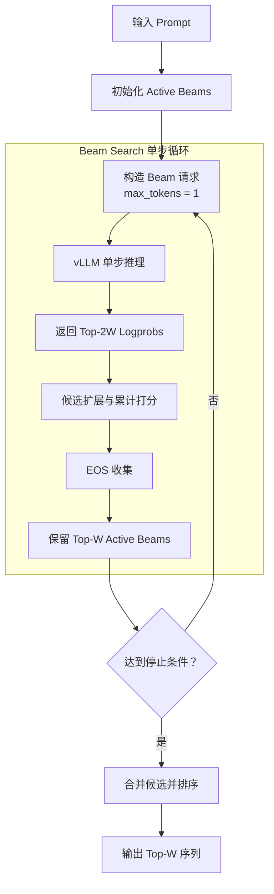

# vLLM Beam Search 整体流程

```mermaid
flowchart TB
    A["输入 Prompt"]
    B["初始化 Active Beams"]

    subgraph LOOP["Beam Search 单步循环"]
        direction TB

        C["构造 Beam 请求<br/>max_tokens = 1"]
        D["vLLM 单步推理"]
        E["返回 Top-2W Logprobs"]
        F["候选扩展与累计打分"]
        G["EOS 收集"]
        H["保留 Top-W Active Beams"]

        C --> D
        D --> E
        E --> F
        F --> G
        G --> H
    end

    I{"达到停止条件？"}
    J["合并候选并排序"]
    K["输出 Top-W 序列"]

    A --> B
    B --> C
    H --> I
    I -->|"否"| C
    I -->|"是"| J
    J --> K
```

