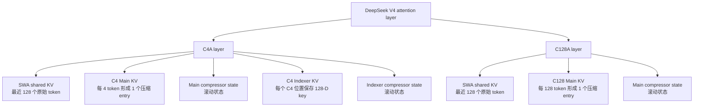
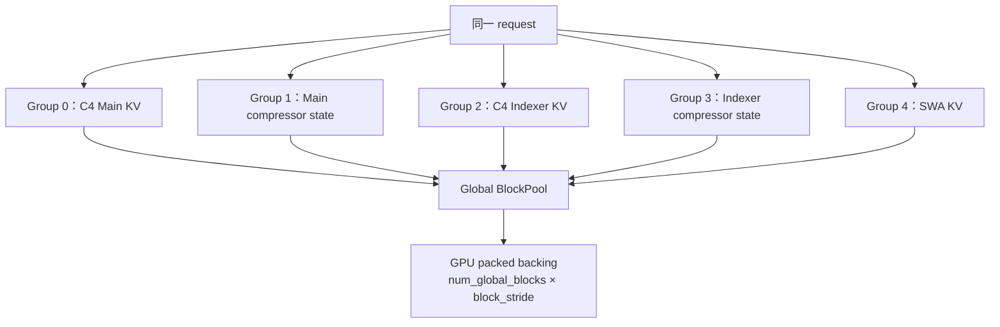
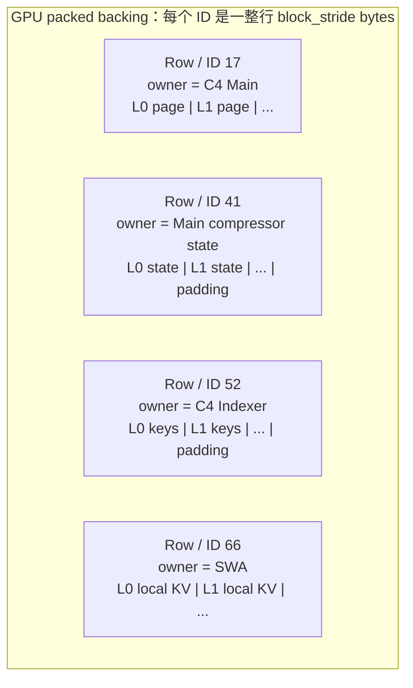
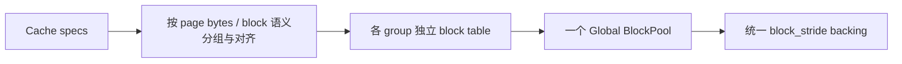
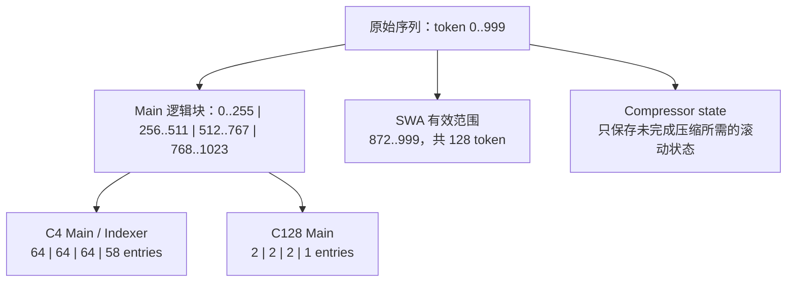
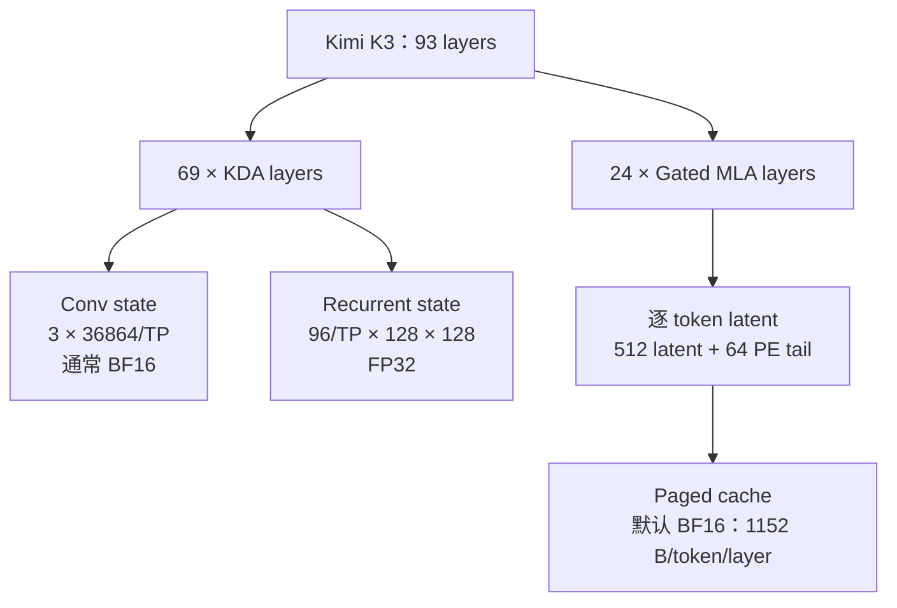
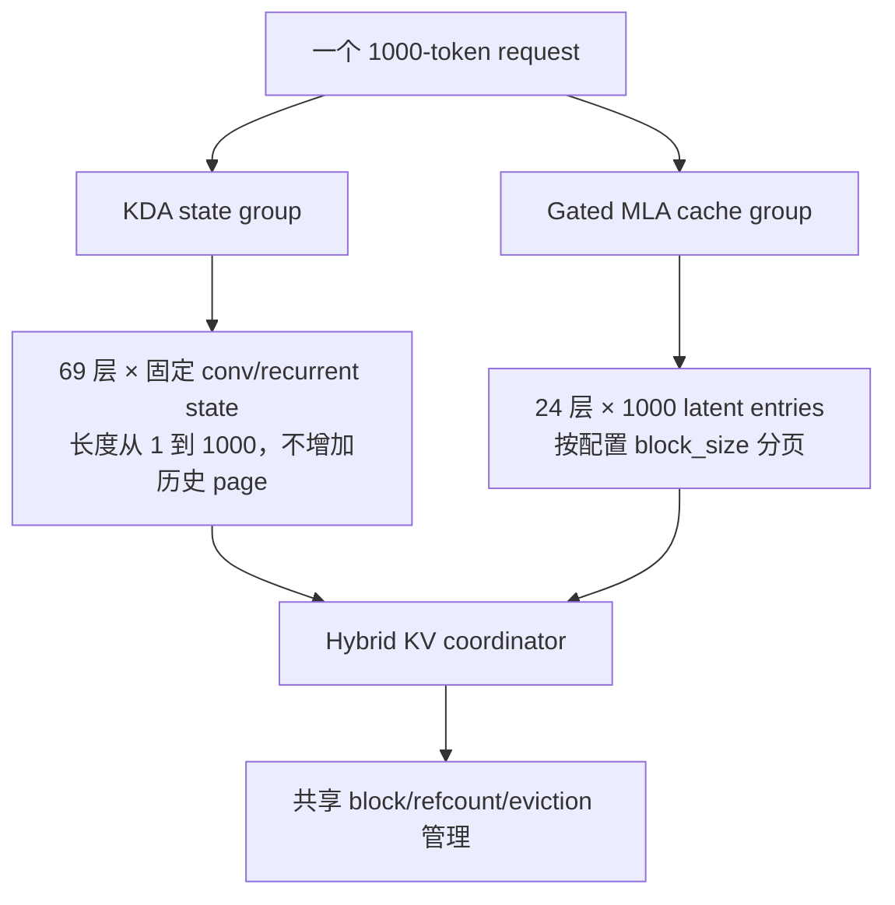
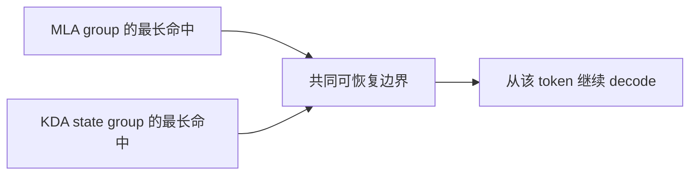

# DeepSeek V4 与 Kimi K3：vLLM KV Cache 组织图

> 状态：Architecture Note  
> 更新日期：2026-08-17  
> 范围：解释模型真正需要保存的 cache、1000 token 示例，以及 vLLM 如何用统一池管理异构 page  
> 口径：下文的“逻辑 token 范围”和“物理存储条目”必须分开理解

---

## 1. 一页结论

| 模型 | 每层保存什么 | 是否随序列长度增长 | vLLM 的核心组织方式 |
| --- | --- | --- | --- |
| DeepSeek V4 C4A | SWA KV、C4 Main KV、Main compressor state、C4 Indexer KV、Indexer compressor state | Main/Indexer/SWA 增长或滑窗；state 为滚动状态 | 多个独立 cache spec/group，共享一个全局 block ID 池和 packed backing |
| DeepSeek V4 C128A | SWA KV、C128 Main KV、Main compressor state | Main 极低速增长；state 为滚动状态 | 与 C4A 一样统一管理，但物理 page 更小 |
| Kimi K3 KDA 层 | convolution state + recurrent state | 否，单请求为常数大小 | Mamba/SSM 类 state cache，滚动 previous/current state |
| Kimi K3 Gated MLA 层 | 每 token 一个压缩 latent：`512 + 64 = 576` 个元素 | 是 | 普通 Paged KV block table |

最关键的两个判断：

1. **DeepSeek V4 是“同一模型里有多种 cache page”。**它们逻辑上分组，物理上从同一大池取 block ID。
2. **Kimi K3 不是 93 层都保存逐 token KV。**69 个 KDA 层保存固定状态，只有 24 个 Gated MLA 层保存逐 token latent。

---

## 2. 先统一三个概念

| 概念 | 含义 | 不代表什么 |
| --- | --- | --- |
| 原始 token 范围 | 请求在模型原始序列中的位置，例如 `[256, 511]` | 不代表物理上一定存 256 条 KV |
| 物理存储条目 | 压缩后真正写入 page 的 entry 数 | 不一定与原始 token 数相等 |
| 全局 block ID | packed backing 中的一整行/槽位的所有权编号 | ID 本身没有固定的“覆盖多少 token”语义 |

例如 DeepSeek V4 C4 的 compression ratio 为 4。逻辑 block 覆盖 256 个原始 token 时，只产生 `256 / 4 = 64` 个 C4 Main KV entry。因此：

> **C4 的 64 是物理压缩 entry 数；该 page 对应的原始 token 范围仍然是 256。**

---

## 3. DeepSeek V4：到底有哪些 cache

### 3.1 C4A 与 C128A 的 cache 组成



各部分职责：

| Cache | 保存内容 | 用途 | 生命周期 |
| --- | --- | --- | --- |
| SWA shared KV | 最近 128 个原始 token 的未压缩局部 KV | 保留最新局部细节 | 滑动窗口；旧页可回收 |
| C4/C128 Main KV | 压缩后的 shared latent KV | 对长历史做主 attention | 随序列增长，但增长速度分别约为 `L/4`、`L/128` |
| Main compressor state | 生成下一份 Main KV 所需的滚动中间状态 | 处理尚未形成完整压缩 entry 的尾部 | 固定/滚动，不是逐 token 历史 |
| C4 Indexer KV | 每个 C4 压缩位置的 128-D retrieval key | 从长历史中选 top-k Main KV 位置 | 约 `L/4` 增长 |
| Indexer compressor state | 生成下一份 indexer key 的滚动状态 | 处理 indexer 的未完成尾部 | 固定/滚动 |

### 3.2 压缩状态到底放在哪里

答案是：**逻辑上单独存，物理上来自同一个大 backing；不塞进 Main KV 的 block。**



- 每个 group 有自己的 request block table，所以 block 的 token/block 解释可以不同。
- 所有 group 从同一个 `BlockPool` 领取全局 block ID。
- **同一时刻，一个全局 block ID 只归一个 group 所有。**状态和 Main KV 不会同时写进同一个 ID。
- worker 只申请一次长期驻留的 packed backing；各 layer cache 是 backing 上按 offset/stride 建出的 typed view。
- request `free` 时释放的是引用和 ID 所有权，不是反复 `cudaFree` 整块显存。

### 3.3 一个具体的物理池示例

下面是假设性的编号，用来说明所有权；编号不是 vLLM 固定值。

| Global block ID | 当前 owner group | 这行 backing 被解释成 | request block table 中的位置 |
| ---: | --- | --- | --- |
| 17 | C4 Main KV group | group 内各 C4 Main layer 的 64-entry page slices | C4 Main 的第 0 个逻辑 block |
| 23 | C4 Main KV group | group 内各 C4 Main layer 的 64-entry page slices | C4 Main 的第 1 个逻辑 block |
| 41 | Main compressor state group | group 内各 layer 的 rolling-state slices | 当前 state block |
| 52 | C4 Indexer KV group | group 内各 indexer layer 的 64 × 128-D key page slices | Indexer 的第 0 个逻辑 block |
| 66 | SWA group | group 内各 SWA layer 的局部 KV page slices | 当前窗口 page |



因此，“状态是否单独占一个 block ID”的准确答案是：

- **是**：它属于独立 group，活跃时领取自己的 block ID。
- **不是单独显存池**：它和其他 cache 的 block ID 都指向同一个 packed backing 中的行。

### 3.4 不同 group 的 page 大小不同，为什么还能统一管理

统一的是**所有权和分配单位**，不是强迫所有 page 保存相同数量的 token。



设第 `g` 个 group 的一行需要容纳其所有 layer page，vLLM 的 packed layout 取：

```text
group_row_bytes[g] = Σ page_bytes(layer in group g)
block_stride       = max_g(group_row_bytes[g])
```

一个 ID 被 group `g` 领取后，该 group 只使用这一行中属于自己的 layer offsets；剩余部分可能是 padding。DeepSeek V4 还会先按相近 page size/语义做统一和分桶，例如较大的 C4 Main/SWA/state、中等的 C4 Indexer、较小的 C128 Main，减少内部 padding。

这种设计控制了两类碎片：

1. **池间外部碎片**：不为每种 cache 建固定容量的独立池；空闲 ID 可转给任意 group。
2. **行内碎片**：用 page-size bucket、layer regrouping 和统一 page spec，降低 `block_stride - group_row_bytes`。

它不会保证零浪费；换来的收益是单一全局容量、简单 eviction/refcount，以及异构 cache 可以共同参与 prefix caching。

---

## 4. DeepSeek V4：1000 token 如何保存

下面使用一个便于解释的配置：

- Main/Indexer 的逻辑 block 覆盖 256 个原始 token。
- C4 compression ratio = 4，所以每个完整 page 有 64 个压缩 entry。
- C128 compression ratio = 128，所以每个完整 page 有 2 个压缩 entry。
- SWA window = 128 个原始 token；示例按 64-token 物理 page 对齐。

### 4.1 四个逻辑 Main block

| 逻辑 block | 原始 token 范围 | C4 Main 物理 entry | C128 Main 物理 entry |
| ---: | --- | ---: | ---: |
| 0 | `[0, 255]` | 64 / 64 | 2 / 2 |
| 1 | `[256, 511]` | 64 / 64 | 2 / 2 |
| 2 | `[512, 767]` | 64 / 64 | 2 / 2 |
| 3 | `[768, 1023]`，当前只到 999 | 58 / 64 | 1 / 2 |
| 合计 | 已输入 1000 token | 250 个完整 C4 entry | 7 个完整 C128 entry |

说明：

- C4：`floor(1000 / 4) = 250` 个完整 entry。
- C128：`floor(1000 / 128) = 7` 个完整 entry；token `896..999` 尚不足 128 个，相关尾部信息保存在 compressor rolling state 中。
- C4 Indexer KV 与 C4 Main 使用相同的 C4 位置节奏，所以也是 250 个 key entry，但每项保存的是 128-D index key，而不是 Main latent。



### 4.2 为什么 SWA 物理覆盖从 832 开始，而有效范围从 872 开始

长度 `L = 1000`，窗口 `W = 128`：

```text
有效 token 范围 = [L - W, L - 1] = [872, 999]
```

但 page 大小为 64 时，包含 token 872 的 page 必须向下对齐：

```text
floor(872 / 64) × 64 = 832
```

因此需要的物理 pages 是：

| 物理 page | 覆盖范围 | 其中有效部分 |
| --- | --- | --- |
| page 13 | `[832, 895]` | `[872, 895]`；前 40 个位置被 mask |
| page 14 | `[896, 959]` | 全部有效 |
| page 15 | `[960, 1023]` | `[960, 999]`；后 24 个位置尚未写入 |

**872 是窗口的语义起点，832 是承载该起点的物理 page 边界。**

---

## 5. Kimi K3：93 层并不是 93 份逐 token KV

### 5.1 层类型与 cache



| 层类型 | 单层、单 TP rank 保存内容 | 随 token 数增长吗 |
| --- | --- | --- |
| KDA | conv state：`[3, 36864/TP]`，通常 BF16 | 否 |
| KDA | recurrent state：`[96/TP, 128, 128]`，固定 FP32 | 否 |
| Gated MLA | `[512 latent \| 64 PE-designated tail] = 576` 元素；默认 BF16 为 1152 bytes/token | 是 |

这里的 `TP` 是 tensor-parallel size；表中形状按“每层、每 TP rank、无 speculative decode 额外 state”理解。

### 5.2 1000 token 示例



若 MLA 的逻辑 block size 记为 `B`：

| Cache | 1000 token 时的数量 |
| --- | --- |
| 每个 KDA 层 | 1 组固定 conv + recurrent rolling state，不是 1000 份 |
| 69 个 KDA 层 | `69 × fixed_state_per_layer_per_rank` |
| 每个 Gated MLA 层 | 1000 个 latent entry，约 `ceil(1000 / B)` 个逻辑 page |
| 24 个 Gated MLA 层 | `24 × 1000 × 1152 B ≈ 27.65 MB` 的有效 BF16 latent payload，另加 page 对齐/元数据 |

因此 K3 单请求 cache 的主要长度项可写成：

```text
K3_cache(L) ≈ 69 × fixed_KDA_state_per_rank
            + 24 × L × 576 × bytes_per_element
            + page_padding_and_metadata
```

### 5.3 K3 的 prefix caching 为什么需要“对齐”

K3 是 hybrid 模型：MLA 可以像普通 Paged KV 一样按完整 block 做 prefix hash 命中；KDA 则依赖某个 token 边界对应的 recurrent/conv state。恢复 prefix 时，两个 group 必须在同一个可恢复边界达成一致。



所以开启 prefix caching 时，KDA state 采用 aligned cache mode：协调器求各 group 都能支持的共同最长 prefix，而不是只采用 MLA 的最大命中长度。

---

## 6. DeepSeek V4 与 Kimi K3 的管理差异

| 维度 | DeepSeek V4 | Kimi K3 |
| --- | --- | --- |
| 异构来源 | C4/C128 压缩率、SWA、Indexer、compressor state | KDA 固定状态 + Gated MLA 逐 token latent |
| 主要逐 token 历史 | Main compressed KV、Indexer KV、SWA | 24 个 MLA 层的 latent |
| 固定/滚动状态 | Main/Indexer compressor state | 69 个 KDA 层的 conv/recurrent state |
| 逻辑组织 | 多 cache spec/group，各自 block table | KDA state group + MLA paged group |
| 物理管理 | 全局 BlockPool + packed backing + size-aware grouping | hybrid coordinator 统一 request 生命周期与 prefix 边界 |
| 释放 | request ref 归零后 ID 回池；有 hash 的 page 可保留为可驱逐 prefix cache | 同样释放 request refs；KDA/MLA 必须协调 |

---

## 7. 对 GR / Beam KV 设计的直接启示

1. **按生命周期和共享语义拆逻辑 group。**逐 token history、滚动 state、Beam mutable tail 不应硬塞进同一种 block 语义。
2. **默认不要为每种 cache 建固定容量的独立显存池。**可以像 DeepSeek V4 一样共享全局所有权池/backing，再用 size class 或 group stride 控制行内浪费。
3. **Beam 的不可变公共 prefix 用 refcount 共享。**分叉后的 mutable tail 用 copy-on-write、独立 slot 或 ancestry mapping，避免全量复制。
4. **状态型 cache 要绑定正确的 parent。**像 KDA/compressor state 这类“一个状态代表整段历史”的 cache，在 Beam 重排时必须按 parent 选择或复制，不能只共享一个状态指针。

---

## 8. 参考实现

- [vLLM：DeepSeek-V4 在线推理系统设计](https://vllm.ai/blog/2026-04-24-deepseek-v4)
- [vLLM：DeepSeek V4 attention API](https://docs.vllm.ai/en/v0.27.1/api/vllm/models/deepseek_v4/attention/)
- [vLLM `kv_cache_utils.py`：异构 spec 分组与 packed layout](https://github.com/vllm-project/vllm/blob/fe1c317157d4478fdc0e02096447e61305b871e9/vllm/v1/core/kv_cache_utils.py)
- [vLLM `kv_cache_coordinator.py`：全局 BlockPool、group manager 与共同 prefix 命中](https://github.com/vllm-project/vllm/blob/fe1c317157d4478fdc0e02096447e61305b871e9/vllm/v1/core/kv_cache_coordinator.py)
- [vLLM `attn_utils.py`：worker packed backing 与 layer view](https://github.com/vllm-project/vllm/blob/fe1c317157d4478fdc0e02096447e61305b871e9/vllm/v1/worker/gpu/attn_utils.py)
- [vLLM：Kimi K3 Preview](https://github.com/vllm-project/vllm-project.github.io/blob/main/_posts/2026-07-22-kimi-k3-preview.md)
- [vLLM：Kimi K3 正式支持](https://github.com/vllm-project/vllm-project.github.io/blob/main/_posts/2026-07-27-k3.md)
- [vLLM Kimi K3 tracking issue](https://github.com/vllm-project/vllm/issues/50001)

