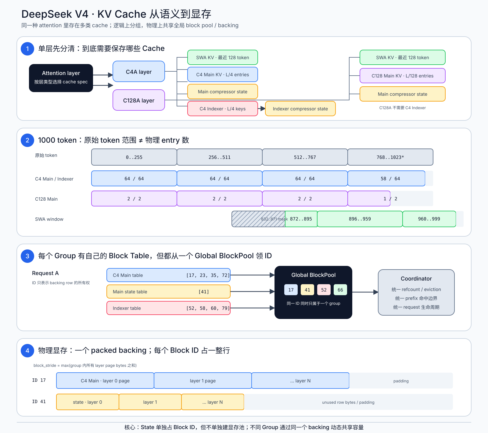
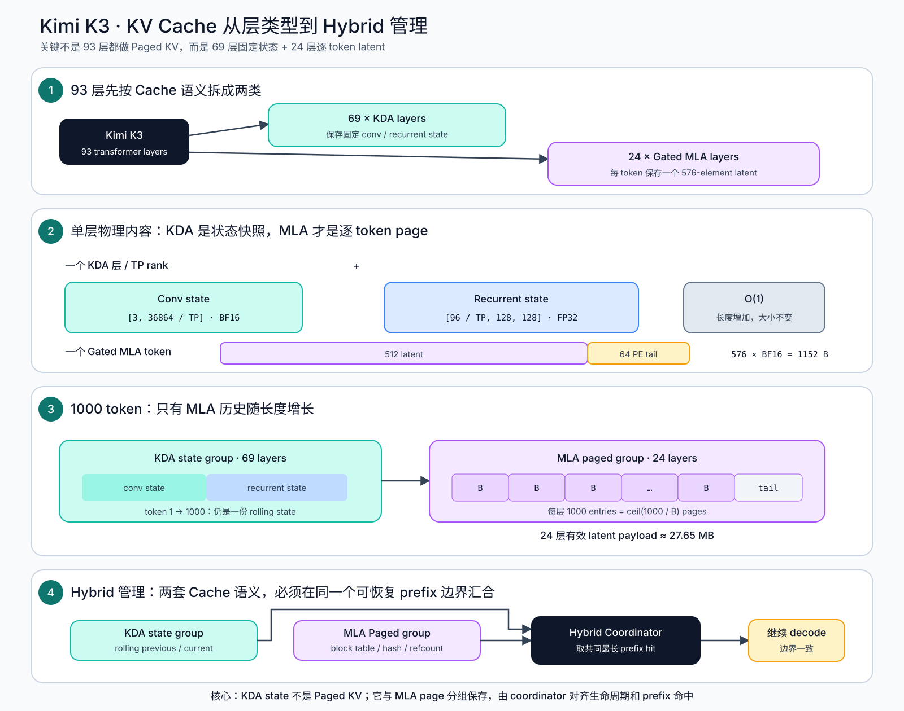

# DeepSeek V4 与 Kimi K3：vLLM KV Cache 组织图

> 更新日期：2026-08-17  
> 阅读顺序：每张图从 ① 到 ④；先看数据是什么，再看 block/page，最后看显存池。

---

## 1. DeepSeek V4



### 图中最重要的三句话

1. **C4 的“64”是一个 page 中的压缩 entry 数，不是只覆盖 64 个原始 token。**一个 C4 Main page 对应 256 个原始 token：`256 / 4 = 64 entries`。
2. **Compressor state 逻辑上单独成 Group、领取独立 Block ID；物理上仍来自同一个 packed backing。**它不会塞进 Main KV 的 block。
3. **全局 Block ID 没有固定 token 数语义。**C4 Main、C128 Main、SWA、Indexer 和 state 各自通过 cache spec/block table 解释同一个编号空间。

### 1000 token 对照表

| Cache | 原始 token 语义 | 实际保存 |
| --- | --- | --- |
| C4 Main KV | `0..999` | `floor(1000/4) = 250` 个 compressed latent entries |
| C4 Indexer KV | `0..999` | 250 个 128-D retrieval keys |
| C128 Main KV | `0..999` | `floor(1000/128) = 7` 个 compressed latent entries |
| Main / Indexer state | 当前未完成压缩的尾部 | rolling state，不保存 1000 份历史 |
| SWA KV | 最近 128 个有效 token：`872..999` | 64-token page 对齐后占 `[832..895]`、`[896..959]`、`[960..1023]` |

SWA 从 832 开始，是因为 872 所在的 64-token page 必须向下对齐：

```text
floor(872 / 64) × 64 = 832
```

其中 `832..871` 被 mask，`1000..1023` 尚未写入。

### 不同大小的 page 如何共用池

```text
group_row_bytes[g] = Σ page_bytes(layer in group g)
block_stride       = max_g(group_row_bytes[g])
```

- 每个 Group 有独立 block table 和 page 语义。
- `KVCacheCoordinator` 只建立一个全局 `BlockPool`。
- worker 申请一个 `[num_global_blocks, block_stride]` packed backing。
- 一个 Block ID 同时只归一个 Group；Group 内各 layer page 使用该行不同 offset。
- page-size grouping / layer regrouping 用于减少行内 padding；共享全局池避免独立池容量被困住。

---

## 2. Kimi K3



### 图中最重要的三句话

1. **K3 不是 93 层都保存逐 token KV。**69 个 KDA 层只保存固定 conv/recurrent state。
2. **只有 24 个 Gated MLA 层随序列增长。**每 token 保存 `512 latent + 64 PE tail = 576` 个元素。
3. **KDA 与 MLA 是两个 cache group。**Prefix caching 时必须取两者都能恢复的共同最长边界。

### 单层、单 TP rank 的保存内容

| Layer type | Cache 内容 | 是否随 `L` 增长 |
| --- | --- | --- |
| KDA | conv state：`[3, 36864/TP]`，通常 BF16 | 否 |
| KDA | recurrent state：`[96/TP, 128, 128]`，FP32 | 否 |
| Gated MLA | 每 token 576 elements；默认 BF16 为 1152 B/token/layer | 是 |

### 1000 token

```text
K3_cache(1000)
  ≈ 69 × fixed_KDA_state_per_layer_per_rank
  + 24 × 1000 × 576 × bytes_per_element
  + page padding / metadata
```

- 69 个 KDA 层：长度从 1 增至 1000，仍是 69 份固定 rolling state，而不是 69 × 1000 份 KV。
- 24 个 MLA 层：每层 1000 个 latent entries，即 `ceil(1000 / B)` 个 page。
- BF16 下 24 层有效 MLA payload 约为 `24 × 1000 × 1152 B = 27.65 MB`，未计 page padding/metadata。

---

## 3. 对 GR / Beam KV 的直接启示

| 数据 | 建议组织 |
| --- | --- |
| 不可变公共 Prompt KV | Paged block + refcount 共享 |
| Beam mutable suffix | 独立 slot、copy-on-write 或 ancestry mapping |
| Compressor/KDA 一类状态 | 单独逻辑 Group；Beam 重排时必须跟随 parent select/copy |
| 多种 page/state 尺寸 | 共享全局 ownership pool/backing；用 size class/group stride 控制内部碎片 |

核心边界：**共享物理池不等于共享同一个 Block ID；共享 prefix 也不等于共享可变状态。**

---

## 4. 参考实现

- [vLLM：DeepSeek-V4 在线推理系统设计](https://vllm.ai/blog/2026-04-24-deepseek-v4)
- [DeepSeek V4 attention API](https://docs.vllm.ai/en/v0.27.1/api/vllm/models/deepseek_v4/attention/)
- [`kv_cache_utils.py`：异构 spec 分组与 packed layout](https://github.com/vllm-project/vllm/blob/fe1c317157d4478fdc0e02096447e61305b871e9/vllm/v1/core/kv_cache_utils.py)
- [`kv_cache_coordinator.py`：全局 BlockPool 与共同 prefix 命中](https://github.com/vllm-project/vllm/blob/fe1c317157d4478fdc0e02096447e61305b871e9/vllm/v1/core/kv_cache_coordinator.py)
- [`attn_utils.py`：worker packed backing 与 layer view](https://github.com/vllm-project/vllm/blob/fe1c317157d4478fdc0e02096447e61305b871e9/vllm/v1/worker/gpu/attn_utils.py)
- [vLLM：Kimi K3 Preview](https://github.com/vllm-project/vllm-project.github.io/blob/main/_posts/2026-07-22-kimi-k3-preview.md)
- [vLLM：Kimi K3 正式支持](https://github.com/vllm-project/vllm-project.github.io/blob/main/_posts/2026-07-27-k3.md)
- [Kimi K3 tracking issue](https://github.com/vllm-project/vllm/issues/50001)

