# 近线 GR 多 Batch 调度策略设计

> 对比对象：vLLM V1、NVIDIA SID-GR、xLLM OneRec
>
> 目标场景：上游已规整 Batch，Prompt 约 1K～10K tokens，Beam Width 64～512，
> 输出 2～5 个位置，目标整批 P99 不高于 100 ms，并保持固定执行形状

## 0. 阅读路径与结论

本文按 `vLLM → NVIDIA → xLLM → 用户场景 → 推荐方案` 展开。核心选择如下：

| 层次 | 推荐语义 |
| --- | --- |
| 输入协议 | 一个 `BatchEnvelope` 明确携带一批 Item |
| 调度 | 一个 Envelope 对应一个 sealed `ExecutionCohort` |
| Prefill | 允许切 chunk，但必须等全 Cohort 完成 |
| Decode | 固定 `B_bucket × W`，执行中不加入新请求 |
| 多 Batch | 通过多个 `ExecutionSlot` 或多个副本并发 |
| 多轮控制 | 优先放在 Executor 内；必要时可退化为 Coordinator 逐步驱动 |

结论：这类负载不应直接照搬 request-level continuous batching。

---

## 1. vLLM 原生调度：request-level continuous batching

### 1.1 核心原理

vLLM V1 不维护独立的 Prefill 队列和 Decode 队列。它统一计算每个请求本轮需要推进的
`num_scheduled_tokens`。

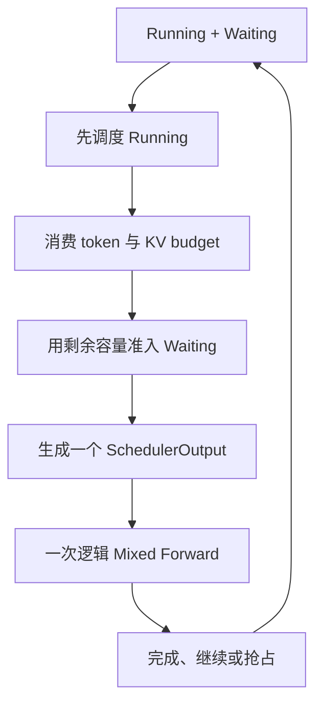

> `running-first` 不等于 `decode-first`：未完成的 chunked Prefill 也属于 Running。

三个主要预算：

| 预算 | 限制什么 | 不等于什么 |
| --- | --- | --- |
| `max_num_scheduled_tokens` | 本轮 query token 总数 | 总上下文长度或真实 FLOPs |
| `input_budget` | 本轮模型输入 token 容量 | BeamKV 或 Top-K workspace |
| `max_num_seqs` | Running 请求/sequence 数 | 专用 fused Beam 容量模型 |
| KV capacity | 可分配的 Context KV | BeamKV、Top-K workspace |

### 1.2 一个 Mixed Batch 例子

设 scheduled-token 和 input budget 都允许 12，且 sequence、KV 与 long-prefill 约束也满足：

| 请求 | 状态 | 本轮需求 |
| --- | --- | ---: |
| D1 | Running Decode | 1 token |
| P1 | Running Prefill | 9 tokens |
| P2 | Waiting Prefill | 还剩 6 tokens |

开启 chunked Prefill 后：

```text
num_scheduled_tokens = {D1: 1, P1: 9, P2: 2}
```

- 三者合计 12 个 query token，组成一个 `SchedulerOutput`；
- Prefill chunk 与 Decode token 通常进入同一次逻辑 target-model forward；
- P2 尚未完成 Prefill，不发布生成 token；
- 下一轮重新组 batch，membership 可以变化。

### 1.3 对 GR 的意义

| 优点 | 对本场景的不足 |
| --- | --- |
| 长 Prompt 可分块，控制面成熟 | 没有上游 Batch 原子边界 |
| Context KV 与 prefix reuse 成熟 | Stock Beam 展开为 `B × W` 请求；fused GR 需额外账本 |
| 动态到达时利用率高 | 同一批 Item 可能处于不同阶段 |
| Prefill/Decode 可混合 | 固定 Graph、整批 P99 更难稳定 |
| 请求级抢占灵活 | 大 Beam Session 的抢占与恢复代价高 |

一句话：**vLLM 擅长动态请求利用率，不天然表达 GR 的整批阶段语义。**

---

## 2. NVIDIA SID-GR：stage-aware、shape-aware tick

### 2.1 一个 tick 不是一次 forward

NVIDIA 的调度器先管理请求阶段，再按 shape 把同阶段请求分组。

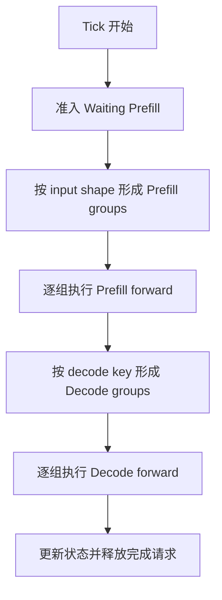

在 cache miss/disabled，且 group 指切块后的 planned microbatch 时：

```text
forwards_per_tick
  = executed_prefill_microbatches
  + executed_decode_microbatches
```

Cache exact hit 可能不执行 Prefill model forward，prefix extension 也可能走额外路径。在单设备
上，实际产生的 group forward 通常是**顺序调用**，不是把多个自回归 forward 同时算完。

### 2.2 Decode 如何分组

典型 Decode group key 包含：

```text
(current_decode_step, active_beam_width, next_beam_width, context_len)
```

只有 key 兼容的请求才进入同一个 Decode forward。

### 2.3 多请求例子

某个 tick 开始时：

- C 是新到达的 Prefill 请求；
- A、B 都在 Decode step 1，shape 相同；
- D 在 Decode step 2，Beam Width 不同。

以下假设 `max_decode_batch_size >= 2` 且 C 没有命中 Prefill cache：

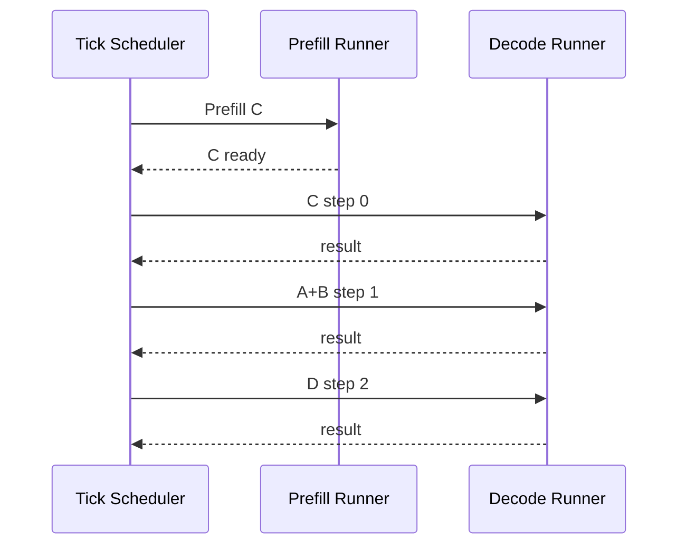

这个 tick 实际包含四次模型调用。A、B 因 key 相同且 group 上限允许而合成一个 microbatch；
D 单独执行。若保持默认 `max_decode_batch_size=1`，A、B 会再拆成两次 forward。
Decode groups 在 Prefill groups 完成后重新形成，所以新完成 Prefill 的 C 才能在同一 tick 进入
step 0。Prefill 已产生第一个输出位置；这里的 step 0 是第一次增量 Decode，产生第二个位置。

### 2.4 对 GR 的意义

| 优点 | 对本场景的不足 |
| --- | --- |
| 显式理解 Prefill 与多阶段 Decode | tick 内可能产生多次小 forward |
| 按 Beam、step、context shape 分组 | 上游 Batch 仍可能被拆散 |
| 动态在线利用率高于固定 cohort | 整批完成时间取决于 group 交错 |
| 适合多种请求同时在线 | shape 变化多，Graph/P99 更难固定 |

一句话：**NVIDIA 比 vLLM 更理解 GR 计算形状，但仍以动态 request/group 为核心。**

---

## 3. xLLM OneRec：FixedSteps 外层 + 两种多轮执行

### 3.1 OneRec 没有走通用 ContinuousScheduler 入口

OneRec 的 REC 入口固定创建 `FixedStepsScheduler`。

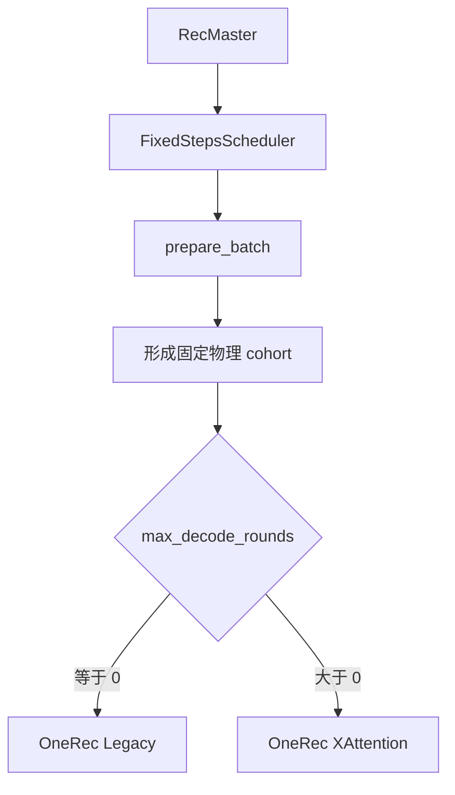

`FixedStepsScheduler` 虽继承 `ContinuousScheduler`，但 OneRec 覆盖了 batch 准备与执行路径；
不能把它理解为普通 token-step continuous batching。

### 3.2 固定的是物理 cohort，不是上游 Envelope

重要边界：

- 若 A、B 同时在队列且资源足够，可形成一个 cohort；
- 若预算不足，A、B 仍可能被拆开；
- cohort 形成后，新到达的 C 不能 late join；
- xLLM 本身没有表达“这几个 Item 属于同一个上游 Batch”的 Envelope 协议。

此外，首个请求即可唤醒调度，代码中没有显式 batch-fill 等待窗口；低流量下可能形成未填满的
physical cohort。

### 3.3 Legacy 与 XAttention 的执行位置

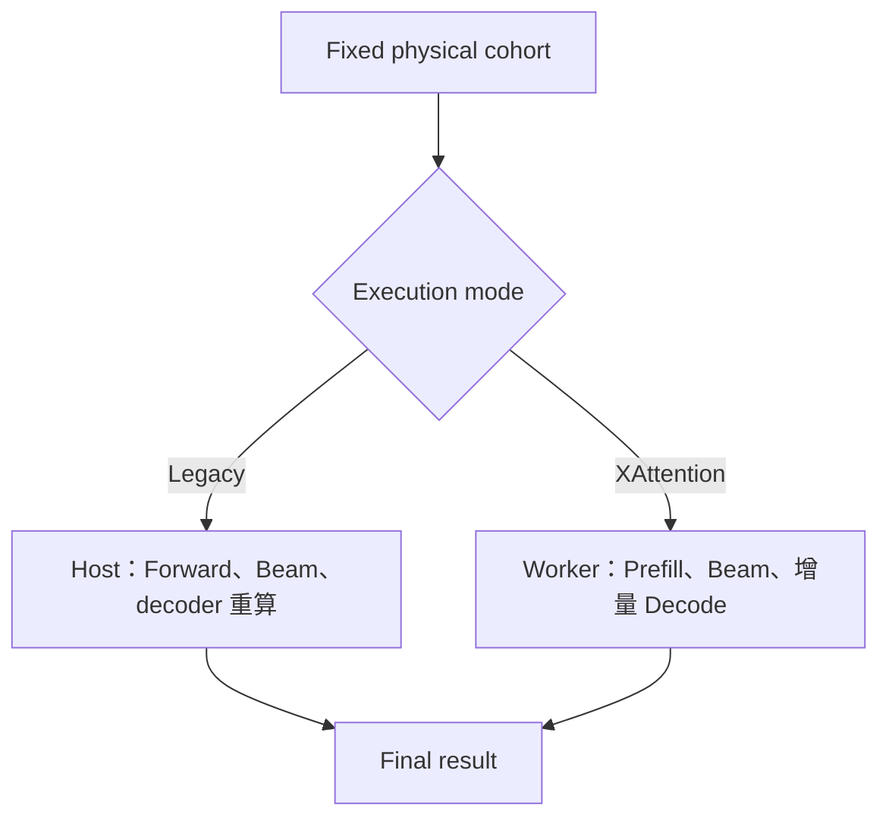

Legacy 固定做 1 次初始 forward 和 2 次后续 forward；Host 每轮 Beam，后续 round 跳过
encoder，只对当前完整 decoder token prefix 做 PREFILL-style 重算。XAttention 只做一次 Engine
pipeline invocation，每个分布式 Worker 各调用一次 `step_async`，多轮留在 Worker/device 内。

注意 round 计数：

```text
max_decode_rounds = total_rounds
round 0 = Prefill
round 1 ... total_rounds-1 = incremental Decode
```

因此配置为 3 表示 `1 Prefill + 2 Decode`，不是 `1 Prefill + 3 Decode`。

`max_decode_rounds > 0` 只负责选择 XAttention pipeline；实际进入多轮还要求
`total_round > 1`、`beam_width > 1` 且 selected indices 有效，否则会退化为单轮。

### 3.4 两条路径与并发参数

<!-- markdownlint-disable MD013 -->

| 维度 | OneRec Legacy | OneRec XAttention |
| --- | --- | --- |
| 外层调度 | FixedSteps physical cohort | FixedSteps physical cohort |
| 多轮控制 | Engine/Host 循环 | Worker/device 内循环 |
| Engine pipeline 调用 | 每轮一次 | 整个 cohort 一次 |
| 后续轮 | decoder prefix 重算 | 真正增量 Decode |
| Beam 状态处理 | Host 每轮参与 | Worker/device 内处理 |
| 适用性 | 兼容简单，开销大 | 短固定多轮更合适 |

<!-- markdownlint-enable MD013 -->

`rec_worker_max_concurrency = K` 允许 K 个独立 fixed cohort 占用 K 套执行 pipeline。实现中会
创建 K 套 model/context/executor/stream pipeline，并非轻量逻辑 slot；它也不是 Beam Width，
更不会把新请求连续插入正在执行的 cohort。

一句话：**xLLM XAttention 最接近本场景需要的固定短程执行，但仍缺少显式上游 Batch 原子语义。**

---

## 4. 用户场景与策略选择

### 4.1 负载约束

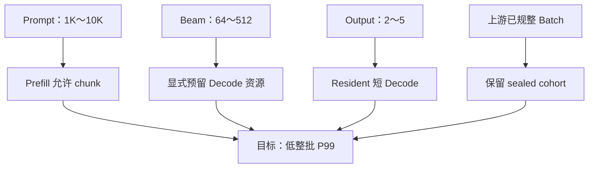

由此得到五条不变量：

1. 不靠到达时间猜 Batch 边界；
2. 不只按逻辑 request/token 估算大 Beam 成本；
3. Prefill 可以分块，但 Decode 前必须全 Cohort ready；
4. Decode 期间 membership 与物理 shape 固定；
5. 多 Batch 通过多 ExecutionSlot 并发，不向活跃 Cohort 填新 Item。

### 4.2 对比结论

下表是架构倾向，不是性能基准；吞吐与 P99 必须在目标硬件和 Profile 上实测。

<!-- markdownlint-disable MD013 -->

| 维度 | vLLM V1 | NVIDIA SID-GR | xLLM Legacy | xLLM XAttention |
| --- | --- | --- | --- | --- |
| 调度原子 | Request/token | Stage/shape group | Physical cohort | Physical cohort |
| Batch membership | 每轮可变 | group 动态形成 | cohort 内固定 | cohort 内固定 |
| Prefill/Decode | Mixed forward | tick 内分组 | decoder prefix 重算 | Prefill 后增量 Decode |
| 多轮控制 | Control plane | Tick scheduler | Engine/Host | Worker/device |
| Beam 资源认知 | Stock Beam request fan-out | group key 感知 | pipeline 专用 | pipeline 专用 |
| Graph 友好度 | 低 | 中 | 中 | 高 |
| 整批 P99 可预测性 | 低 | 中 | 中 | 高 |

<!-- markdownlint-enable MD013 -->

vLLM 与 NVIDIA 的动态利用率更高；xLLM XAttention 的短固定多轮更贴近本场景，但三者都
没有完整的上游 Batch 原子协议。

固定 membership 也不自动等于固定地址；还需在 Cohort 生命周期内绑定 slot-local buffer、
Context/BeamKV lease 与 workspace。

### 4.3 组合原则

| 采用 | 不直接复制 |
| --- | --- |
| vLLM 的 Context KV 与 chunked Prefill | request-level admission |
| NVIDIA 的 stage/shape profile | 任意跨请求动态 grouping |
| xLLM XAttention 的 fixed cohort/resident rounds | Legacy decoder prefix 重算 |
| 新增显式 `BatchEnvelope` | 把物理 cohort 当成业务 Batch |

---

## 5. 推荐方案：Sealed Cohort + Resident Decode

### 5.1 总体架构

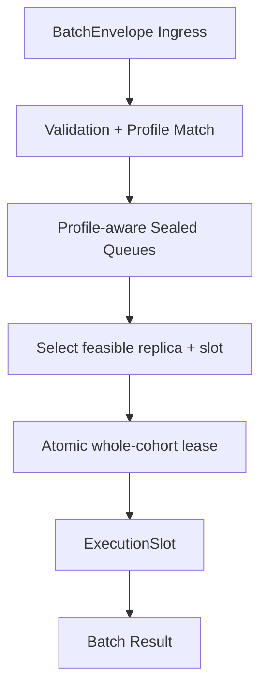

每层只负责一件事：

| 层 | 意图 |
| --- | --- |
| `BatchEnvelope` | 保留上游批边界、参数、幂等与超时 |
| Profile Queue | 只让 shape/能力明确的批进入对应队列 |
| Dispatcher | 选择资源可行的 slot/replica |
| Cohort Admission | 在目标 slot/replica 上原子预留整批最坏资源 |
| ExecutionSlot | 执行 Prefill Barrier 与固定短 Decode |

### 5.2 一个 ExecutionSlot 的状态机

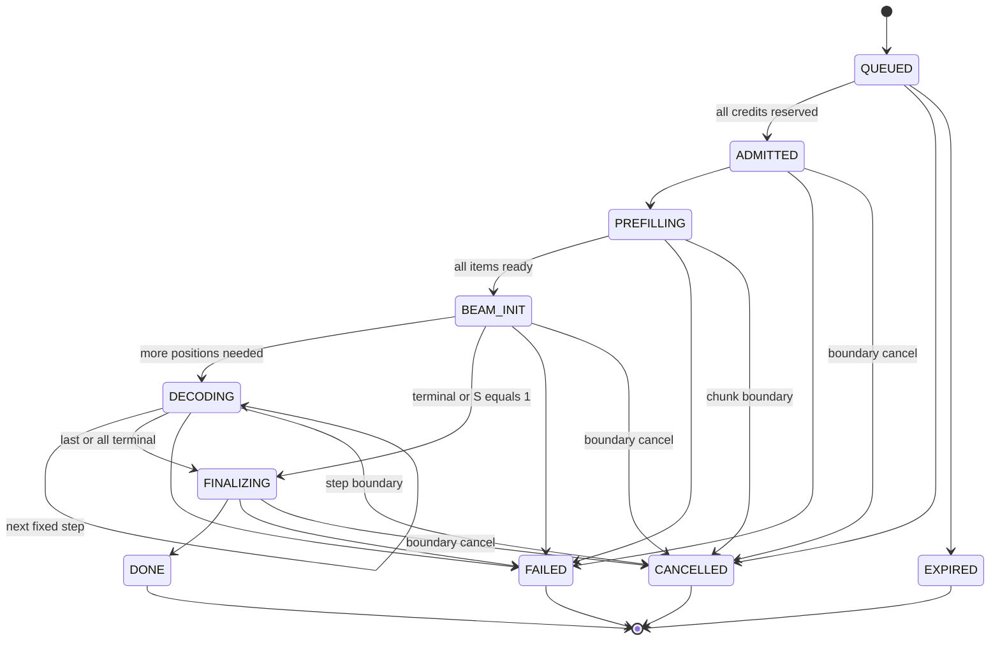

一个 slot 同时只拥有一个 active Cohort；一个模型副本可以发布 `K >= 1` 个 slot。所有终态都
必须在设备 completion 安全后释放整批 lease。

### 5.3 Cohort 内部执行语义

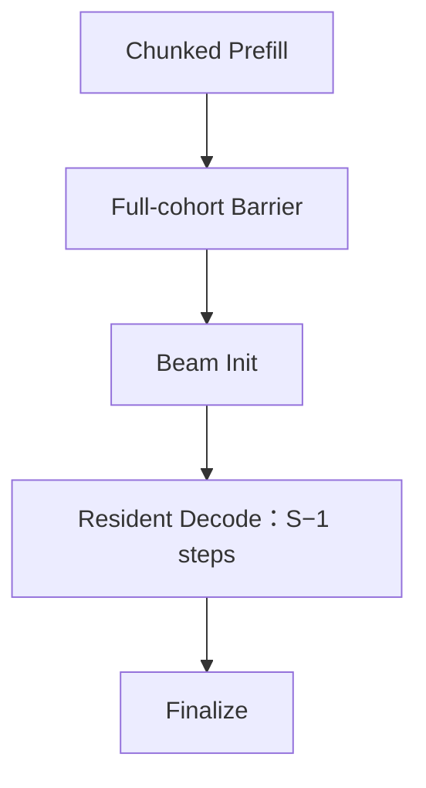

| 记号 | 含义 |
| --- | --- |
| `B` | Envelope 中实际 Item 数 |
| `B_bucket` | Profile 的固定 batch bucket |
| `W` | Beam Width |
| `S` | 总生成位置数 |
| `N_exec` | 固定物理 lane 数，`B_bucket × W` |
| `N_inc` | Beam Init 后的增量次数，`S - 1` |

Prefill 可以按 Item 或连续 token range 切分，但不改变 Cohort membership：

```text
token_start == num_computed_tokens[item]
num_computed_tokens[item] += token_count
ready[item] := num_computed_tokens[item] == prompt_len[item]
```

乱序、重叠或越界 chunk 必须拒绝；所有 Item ready 后才能 Beam Init。Beam Init 使用 B 份
logits 绑定 `N_exec` 个 lane，它本身不是一次 `B × W` 行的 Decode forward。

- `exact_steps`：始终生成 S 个位置；
- `max_steps`：EOS 可让 Item 提前 terminal；
- terminal lane 只修改 `active_mask`，不缩 shape；
- 空出的 lane 不从下一个 Envelope 补请求。

这牺牲少量尾部利用率，换来固定地址、固定 Graph、简单 BeamKV 与更稳定的 P99。

多轮默认留在 Executor 内，同时保留语义等价的 Coordinator-driven fallback：

<!-- markdownlint-disable MD013 -->

| 模式 | 优点 | 代价 | 用途 |
| --- | --- | --- | --- |
| Executor-resident | 少控制往返，地址/Graph 稳定，最适合 S=2～5 | Executor 需持有 Beam 状态与后处理 | 推荐默认 |
| Coordinator-driven | 易调试、易逐步观测，后端改造小 | 每步控制与同步开销更高 | bring-up 与兼容模式 |

<!-- markdownlint-enable MD013 -->

两种模式必须共享同一 sealed membership、资源 reservation 与结果语义，不能形成两套外部协议。

### 5.4 整批资源准入

不能只检查 `max_num_seqs` 或 token budget。每个 Envelope 的容量向量至少包含：

```text
Need(E) = {
  ExecutionSlotCredit,
  ContextCacheCredit,
  DecodeLaneCredit = B_bucket × W,
  BeamKVCacheCredit,
  BeamSearchStateCredit,
  WorkspaceCredit,
  OutputBufferCredit,
  GraphWorkspaceCredit
}
```

`BeamKVCacheCredit` 至少由 `B_bucket × W × (S - 1)`、层数、KV heads、head dim、dtype 和
block rounding 共同决定；`BeamSearchStateCredit` 覆盖 score、parent、mask 等状态。

Graph executable 命中本身不是通用 credit；只有 `fallback_policy=reject` 时，Profile/Graph 命中
才是 admission 前置条件。

```text
Admit(E) iff Need_r(E) <= Free_r for every resource r
```

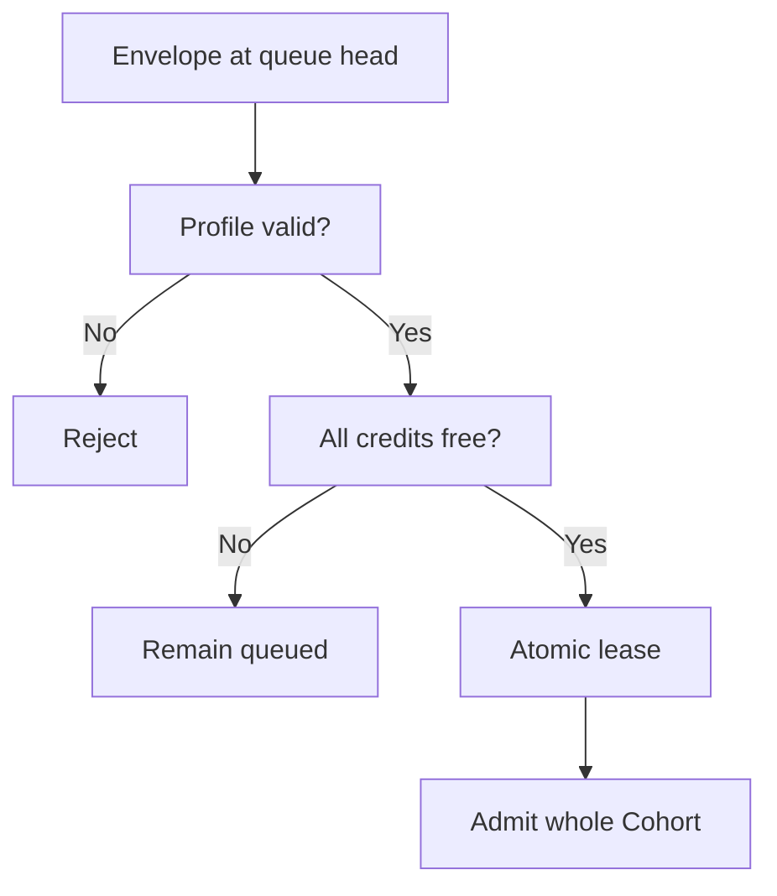

推荐队列策略：

- 每个 Profile 内 FIFO；
- 多租户之间使用 batch-granularity weighted fair queue；
- 从各 Profile 队首选择 oldest feasible Envelope，减少全局 head-of-line blocking；
- active Cohort 不做 step-level 抢占；
- 等待超过 `max_queue_ms` 转为 `EXPIRED`，不静默拆批。

Profile 的 service-time envelope 必须由目标硬件实测；若某个 `L/W/B/S` 组合无法满足 100 ms
目标，应标记为不支持，而不是在运行时静默降级。

### 5.5 多 Batch 如何并发

`K=2` 时，A、B 可各占一个 slot，C 等待任一 slot 释放：

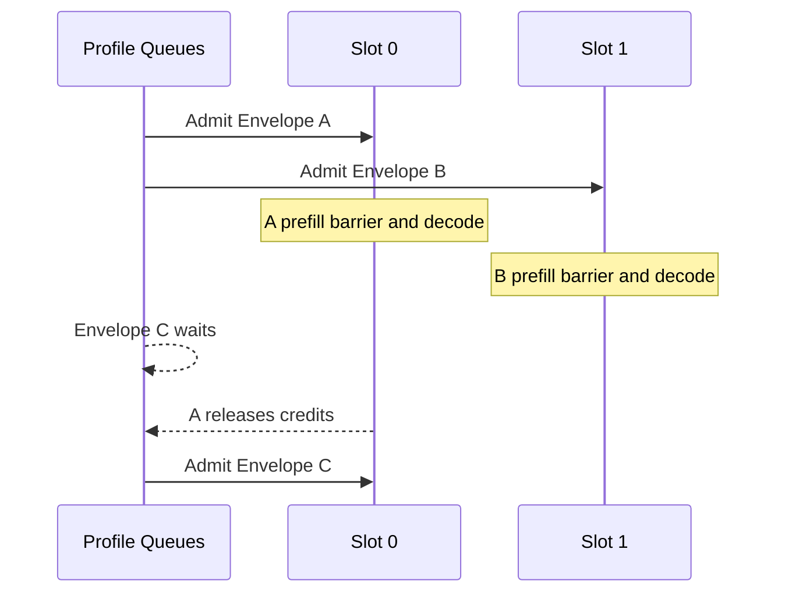

`K` 是资源隔离后的并发槽位数，不是越大越好：

| 配置 | 适用场景 |
| --- | --- |
| `K=1` | 最强整批 P99、最大单 Cohort 资源、实现最简单 |
| `K=2` | 有独立 pipeline 或 stage interleave 时可降低批间阻塞 |
| `K>2` | 仅在资源账本、Graph workspace 与带宽验证后启用 |

K 个逻辑 slot 不自动等于 K 个 forward 物理并行。单设备若没有独立 stream/pipeline 或受控的
stage interleave，两个 slot 仍可能顺序执行；最清晰的并发隔离是不同模型副本。

---

## 6. 最小输入协议与能力协商

### 6.1 三个对象

| 对象 | 边界 |
| --- | --- |
| `ItemRequest` | 一个 Prompt 与一个 Item 结果 |
| `BatchEnvelope` | 客户提交、幂等、排队、取消边界 |
| `ExecutionCohort` | 服务端 reservation、Barrier、Decode 边界 |
| `ExecutionSubBatch` | 一次 Prefill chunk；不改变 membership |

V1 规定：

```text
1 BatchEnvelope = 1 ExecutionCohort
```

`sealed` 只承诺整批校验、整批准入和固定 membership，不表示输出具备事务回滚语义；结果仍按
Item 返回终态。

对外统一使用 `generation.num_output_tokens`：它只计算模型生成位置，不包含服务端管理的
begin/end 边界 token；`include_stop_token` 仅决定触发终止的模型 token 是否进入业务结果。
旧接口的 `max_tokens/pre_calc` 换算属于 adapter，不进入新协议。

### 6.2 Capability/Profile

客户端先读取 `/v1/gr/capabilities`。每个离散 Profile 至少发布：

| 字段 | 示例 |
| --- | --- |
| `profile_id` / `revision` | `gr-b4-l4096-w128-s3-graph` / `7` |
| 模型约束 | model revision、dtype、backend |
| Batch 约束 | `max_items`、`B_bucket`、总 Prompt token 上限 |
| 生成约束 | `beam_width`、`num_output_tokens`、stop policy |
| 执行约束 | graph/eager、padding、fallback policy |
| 队列约束 | payload bytes、queued batches、`max_queue_ms` |
| SLA 约束 | 经过基准验证的 service-time envelope |

若 `B=3` 匹配 `B_bucket=4`，只允许按 Profile 明示 padding；V1 不用另一个 Envelope 填第
4 个 lane。

### 6.3 Submit

```json
{
  "schema_version": "gr.batch.v1",
  "batch_id": "batch-20260812-0001",
  "idempotency_key": "order-feed-9817",
  "profile_id": "gr-b4-l4096-w128-s3-graph",
  "profile_revision": 7,
  "membership_atomicity": "sealed",
  "fallback_policy": "reject",
  "max_queue_ms": 20,
  "generation": {
    "beam_width": 128,
    "num_output_tokens": 3,
    "stop_policy": "max_steps",
    "include_stop_token": false
  },
  "items": [
    {"request_id": "item-0", "prompt_token_ids": [101, 102]},
    {"request_id": "item-1", "prompt_token_ids": [201, 202]},
    {"request_id": "item-2", "prompt_token_ids": [301, 302]},
    {"request_id": "item-3", "prompt_token_ids": [401, 402]}
  ]
}
```

服务端必须按实际 `items` 和 token 内容重新计算 B、长度、资源需求，不能相信客户端声明的
shape。

接受后返回异步 handle：

```json
{
  "batch_handle": "grb_01J5XYZ",
  "state": "QUEUED",
  "status_url": "/v1/gr/batches/grb_01J5XYZ",
  "result_url": "/v1/gr/batches/grb_01J5XYZ/result",
  "cancel_url": "/v1/gr/batches/grb_01J5XYZ"
}
```

### 6.4 协议时序

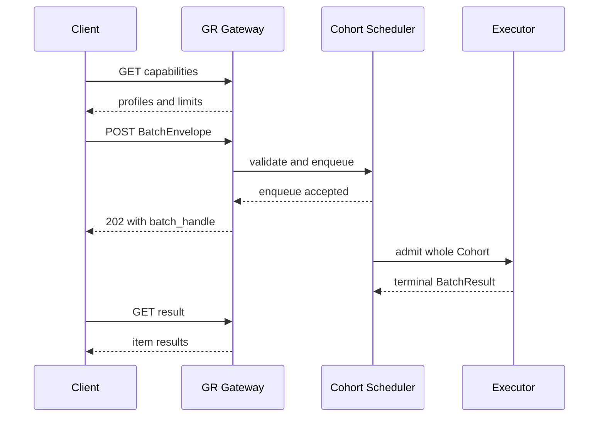

### 6.5 固定错误语义

| 条件 | 结果 |
| --- | --- |
| Profile/参数静态不匹配 | `422 PROFILE_MISMATCH` |
| Payload 超限 | `413 PAYLOAD_TOO_LARGE` |
| 队列容量已满 | `429 RESOURCE_EXHAUSTED` + `retry_after_ms` |
| 同幂等键、不同 payload | `409 IDEMPOTENCY_CONFLICT` |
| 已接收但排队超时 | 状态转为 `EXPIRED` |
| Active batch 取消 | 在 chunk/step 边界停止并释放整批 lease |

禁止静默降低 W、拆 Batch或跨 Envelope 合并。未经请求协议允许，也不得从 Graph 静默切换为
eager execution。

---

## 7. 完整执行例子

### 7.1 参数

| 参数 | 值 |
| --- | ---: |
| Envelope A | 4 Items |
| Prompt | 每个约 4K tokens |
| `B_bucket` | 4 |
| `W` | 128 |
| `S` | 3 个生成位置 |
| Prefill budget | 每次 8K tokens |
| 固定 Decode lanes | `4 × 128 = 512` |

### 7.2 执行

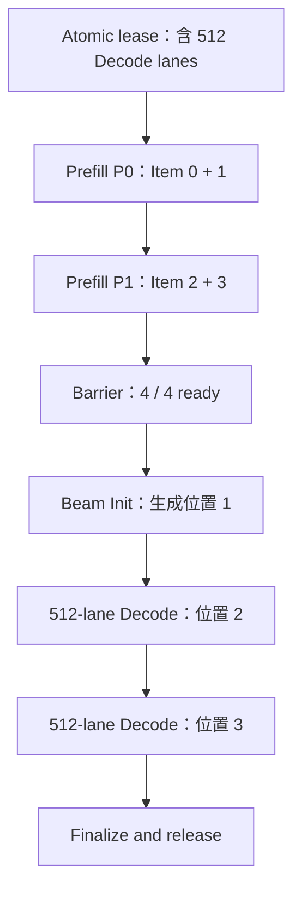

在 A 执行期间到达的 Envelope B：

- 有空闲 slot：整批路由到另一个 slot；
- 没有空闲 slot：在 Profile Queue 中等待；
- 不能加入 A 的 Prefill chunk；
- 不能填充 A 因 EOS 空出的 Decode lane。

这就是“多 Batch 输入”与“跨 Batch 动态拼接”的区别。

---

## 8. 方案优劣、演进与结论

### 8.1 推荐方案的收益

| 收益 | 来源 |
| --- | --- |
| 上游 Batch 不被意外拆散 | Envelope + whole-cohort admission |
| 长 Prompt 不独占单次 forward | Cohort 内 chunked Prefill |
| Fused 大 Beam 成本完整计费 | 显式 Decode lane/BeamKV/workspace credits |
| Decode shape 与地址稳定 | sealed membership + active mask |
| 短多轮控制开销低 | Executor-resident loop |
| 多 Batch 可扩展 | K slots + multi-replica dispatcher |

### 8.2 需要接受的代价

| 代价 | 控制方式 |
| --- | --- |
| EOS 后可能有 masked 空 lane | S 很短，优先换取固定 shape |
| Whole-cohort admission 可能等待 | Profile queue + oldest feasible |
| Resident executor 实现更复杂 | 先提供 Coordinator fallback |
| 大 profile 容量碎片 | 离散 B/L/W/S bucket 与容量监控 |
| active cohort 不抢占 | admission 前做最坏 service-time 校验 |

### 8.3 能力分阶段

| 阶段 | 可验证结果 |
| --- | --- |
| P1 | 协议不再依赖请求到达时间推断 Batch |
| P2 | 任一资源不足都不会半批 admission |
| P3 | 所有 Item ready 前绝不进入 Beam Init |
| P4 | S−1 个 Decode step 不回控制面重建 membership |
| P5 | 多 Cohort 并发且资源、状态、失败域隔离 |

最终策略：

> **协议层封住 Batch，调度层整批预留，Prefill 层允许分块但设置全批 Barrier，Decode 层在
> Executor 内以固定 `B_bucket × W` 运行短多轮；多 Batch 通过独立 slot/replica 并发。**

它不是 vLLM、NVIDIA 或 xLLM 的简单复制，而是针对“上游已规整、长 Prompt、大 Beam、短
Decode、整批低 P99”这组约束做的最小组合。

---

## 9. 代码与延伸阅读

### 9.1 vLLM V1

- [统一 token-progress、Running-first 与 Waiting admission](https://github.com/vllm-project/vllm/blob/52be12cfac0c5a18ba906814b2d2bcadb40a9c4b/vllm/v1/core/sched/scheduler.py#L438-L790)
- [EngineCore 的 schedule → execute → update](https://github.com/vllm-project/vllm/blob/52be12cfac0c5a18ba906814b2d2bcadb40a9c4b/vllm/v1/engine/core.py#L580-L608)
- [Stock Beam active-beam fan-out](https://github.com/vllm-project/vllm/blob/52be12cfac0c5a18ba906814b2d2bcadb40a9c4b/vllm/entrypoints/generate/beam_search/offline.py#L210-L275)

### 9.2 NVIDIA SID-GR

- [Scheduler 与 tick](https://github.com/NVIDIA/recsys-examples/blob/9a3bf5df169969b71defdced0cc29079fe897064/examples/sid-gr-inference/src/gr_inference/gr_serving/continuous.py#L270-L434)
- [Policy 默认 group 上限](https://github.com/NVIDIA/recsys-examples/blob/9a3bf5df169969b71defdced0cc29079fe897064/examples/sid-gr-inference/src/gr_inference/gr_serving/continuous.py#L141-L157)
- [Prefill admission](https://github.com/NVIDIA/recsys-examples/blob/9a3bf5df169969b71defdced0cc29079fe897064/examples/sid-gr-inference/src/gr_inference/gr_serving/continuous.py#L515-L545)
- [Prefill executor grouping](https://github.com/NVIDIA/recsys-examples/blob/9a3bf5df169969b71defdced0cc29079fe897064/examples/sid-gr-inference/src/gr_inference/gr_serving/continuous.py#L1491-L1546)
- [Decode planning](https://github.com/NVIDIA/recsys-examples/blob/9a3bf5df169969b71defdced0cc29079fe897064/examples/sid-gr-inference/src/gr_inference/gr_serving/continuous.py#L547-L578)
- [Decode execution](https://github.com/NVIDIA/recsys-examples/blob/9a3bf5df169969b71defdced0cc29079fe897064/examples/sid-gr-inference/src/gr_inference/gr_serving/continuous.py#L2014-L2153)

### 9.3 xLLM OneRec

- [RecMaster 创建 FixedStepsScheduler](https://github.com/xLLM-AI/xllm/blob/cd167a6aca8b4de200a1e7ab76b105cf102e7b72/xllm/core/distributed_runtime/rec_master.cpp#L557-L573)
- [FixedSteps prepare_batch](https://github.com/xLLM-AI/xllm/blob/cd167a6aca8b4de200a1e7ab76b105cf102e7b72/xllm/core/scheduler/fixed_steps_scheduler.cpp#L193-L321)
- [Legacy Engine/Host 多轮](https://github.com/xLLM-AI/xllm/blob/cd167a6aca8b4de200a1e7ab76b105cf102e7b72/xllm/core/distributed_runtime/rec_engine.cpp#L699-L759)
- [XAttention Engine 到 Worker fan-out](https://github.com/xLLM-AI/xllm/blob/cd167a6aca8b4de200a1e7ab76b105cf102e7b72/xllm/core/distributed_runtime/rec_engine.cpp#L845-L908)
- [XAttention Worker 内多轮](https://github.com/xLLM-AI/xllm/blob/cd167a6aca8b4de200a1e7ab76b105cf102e7b72/xllm/core/runtime/rec_worker_impl.cpp#L1741-L1959)
- [多套 Worker pipeline](https://github.com/xLLM-AI/xllm/blob/cd167a6aca8b4de200a1e7ab76b105cf102e7b72/xllm/core/runtime/rec_worker_impl.cpp#L3002-L3088)

### 9.4 本仓库相关设计

- [BeamKV Cache 架构与调度](./beam_kv_cache_architecture_and_scheduling_design.md)
- [Beam 增量 Decode 统一架构](./beam_incremental_decode_unified_architecture_design.md)
- [Beam Search 优化分析](./BEAM_SEARCH_OPTIMIZATION_ANALYSIS.md)
- [xLLM OneRec 代码走读](../xLLM/onerec_code_walkthrough_detailed.md)
