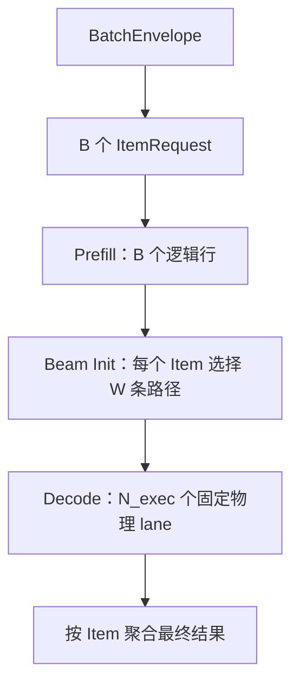
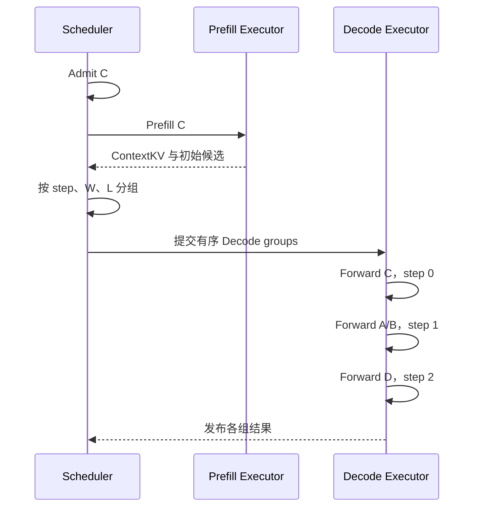
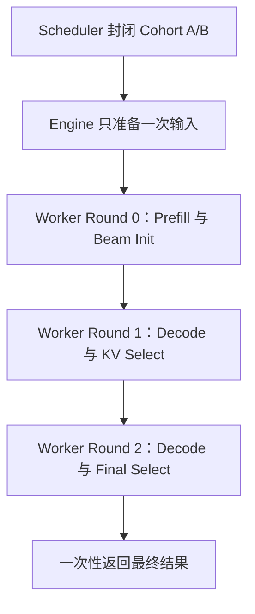
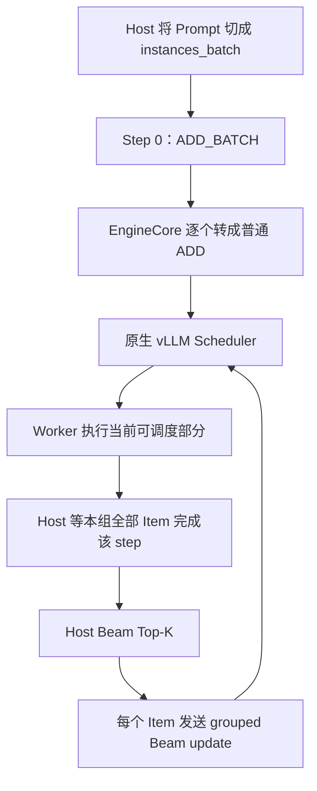
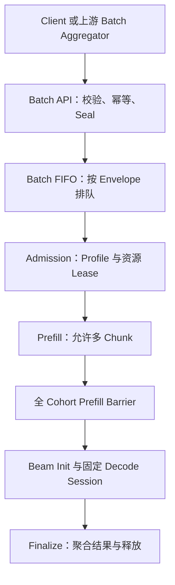
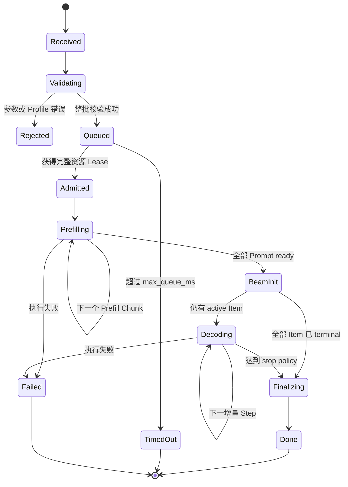
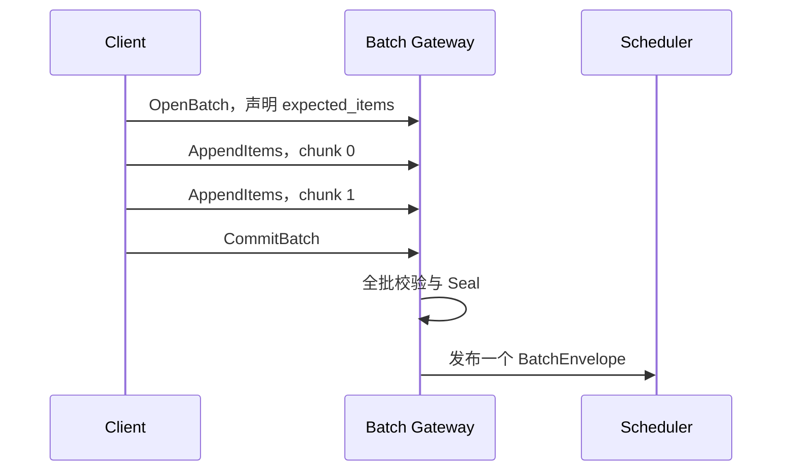
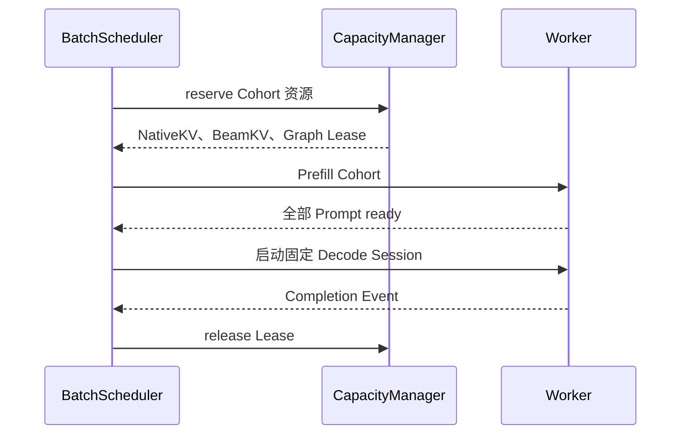
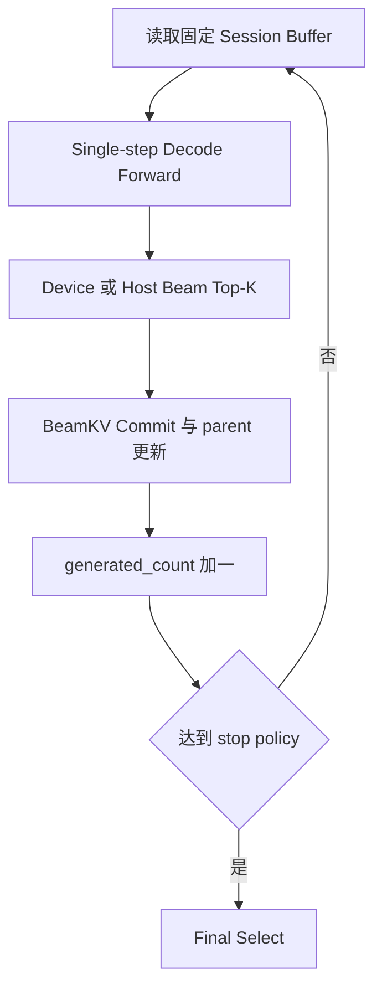
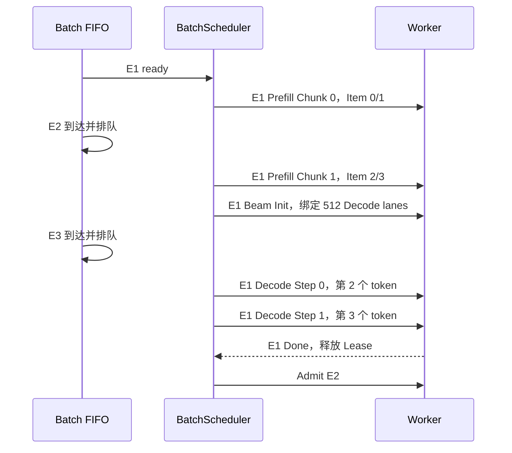

# vLLM-GR 近线多 Batch 调度与输入协议设计

> 状态：设计草案
>
> 场景：近线 Generative Recommendation，输入由上游规整成批，单批 Prompt 长度相近
>
> 典型范围：Prompt 1K～10K tokens、Beam Width 64～512、输出步数 2～5、P99 目标不高于 100 ms
>
> 核心结论：将上游 `BatchEnvelope` 提升为调度原子，第一版采用 sealed cohort、
> Prefill barrier 和固定形状 Decode；不依赖到达时间推断 batch 边界。

---

## 1. 为什么需要单独设计 GR Batch Scheduler

通用大模型在线服务通常接收彼此独立的请求。Scheduler 每个 tick 根据 token budget、KV
容量和请求状态动态拼接 Prefill 与 Decode，以提高设备利用率。

GR 近线场景不同：

- 上游通常已经完成 batch 规整；
- 同一批请求的 Prompt 长度接近；
- Beam Width 较大，但输出只有少量固定步；
- Decode 物理工作量接近 `B × W`，远大于 Scheduler 看见的逻辑请求数 `B`；
- Decode Graph、BeamKV 和后处理都更依赖稳定 shape；
- 与极致吞吐相比，整批完成时间和 P99 抖动更重要。

如果仍把每个 Item 当作完全独立的在线请求，会产生三个根本问题：

1. **Batch 边界丢失**：Scheduler 不知道哪些请求必须共同进入下一阶段；
2. **资源低估**：逻辑请求数是 `B`，物理 Beam lane 却可能是 `B × W`；
3. **阶段交错**：部分请求已 Decode，另一部分仍 Prefill，破坏固定 Graph 和整批完成语义。

因此，外部协议和内部 Scheduler 必须共同理解“一个上游 batch”。仅增加一个批量 RPC
不足以解决问题。

---

## 2. 统一术语与记号

### 2.1 三个生命周期对象与一个执行切片

| 对象 | 含义 | 生命周期与责任 |
| --- | --- | --- |
| `ItemRequest` | 一个业务 Prompt | 保存 item ID、原始 token、单 item 输出 |
| `BatchEnvelope` | 上游规整好的 `B` 个 Item | 提交、校验、幂等、排队和取消原子 |
| `ExecutionCohort` | 服务端完整执行批 | reservation、Barrier、Decode、释放 |
| `ExecutionSubBatch` | 一次物理 forward 的输入切片 | 只切执行，不改变 Cohort membership |

第一版采用最强且最容易验证的关系：

```text
1 BatchEnvelope = 1 ExecutionCohort
```

即不拆分、不跨 Envelope 合并、不允许执行中的 late join。

### 2.2 统一记号

| 记号 | 含义 |
| --- | --- |
| `Q` | 同时排队或在途的 BatchEnvelope 数量 |
| `B` | 一个 Envelope 内的实际 Item 数 |
| `B_bucket` | Graph/Profile 使用的物理 batch bucket |
| `L_i` | 第 `i` 个 Item 的 Prompt 长度 |
| `L_bucket` | Prefill Profile 使用的长度 bucket |
| `W` | 固定 Beam Width |
| `S` | 模型生成位置上限，即 `output_steps` |
| `N_inc` | 最大增量 Decode 次数，`S - 1` |
| `N_exec` | reservation/固定图执行 lane 数，`B_bucket × W` |
| `N_live` | 当前仍有业务效果的 lane 数，`active_item_count × W` |

本文统一规定：

```text
output_steps = S
```

表示最多执行 `S` 个模型生成位置，不包含服务端管理的 begin/end 边界 token。Prefill forward
产生第一个模型 token 的候选，Beam Init 后：

```text
generated_count = 1
N_inc = S - 1
decode_step = generated_count - 1 = 0 ... S - 2
is_last_step = (decode_step == S - 2)
```

`generated_count` 是唯一持久化的权威计数；`decode_step` 是提交下一次增量 forward 前由它派生的
零基索引，不独立递增。一次 step 成功 commit 后只原子执行
`generated_count += 1`，下个 `decode_step` 随之改变。

`exact_steps` 始终产生并返回 `S` 个模型 token；`max_steps` 允许 stop token 使结果短于 `S`。
若触发终止的 stop token 不返回，业务结果甚至可以是 0 个 token。两种策略的 reservation 都按
最坏情况 `S - 1` 个增量 step 计算。这样可以同时避免“decode rounds 是否包含 Prefill”的歧义
和容量计算的 off-by-one。

begin/end 边界 token 由选中的 Profile/catalog revision 管理，客户端不能在每个 Item 中任意
覆盖。兼容当前 GR API 时，适配层使用：

```text
S = max_tokens - reserved_begin - reserved_end
```

`reserved_begin/reserved_end` 表示旧接口为有效边界配置预留的计数，并不等价于“每条最终 Beam
都实际包含该 token”：begin 在推理前追加到 Prompt，end 只在循环结束后追加到仍 active 的
Beam。适配层必须按来源标记并从业务结果排除服务端边界 token，不能按 token ID 全局删除，
否则会误删模型正常生成的同 ID token。旧 Online 路径可能把追加的边界 token 切进
`CompletionOutput.token_ids`，因此仅转换计数仍不够，结果适配也必须同步完成。

当前兼容语义可对照：

- [Offline 边界计数与生成循环](https://github.com/JiusiServe/vllm-gr/blob/6ece5a625d406ca298e9549f6975c7d1e4631447/vllm_gr/entrypoints/gr.py#L526-L651)
- [Offline end token 追加](https://github.com/JiusiServe/vllm-gr/blob/6ece5a625d406ca298e9549f6975c7d1e4631447/vllm_gr/entrypoints/gr.py#L789-L808)
- [Online 边界计数](https://github.com/JiusiServe/vllm-gr/blob/6ece5a625d406ca298e9549f6975c7d1e4631447/vllm_gr/entrypoints/openai/serving_engine.py#L268-L334)
- [Online stop token 与结果切片](https://github.com/JiusiServe/vllm-gr/blob/6ece5a625d406ca298e9549f6975c7d1e4631447/vllm_gr/entrypoints/openai/serving_engine.py#L537-L659)

### 2.3 Batch、Beam 与物理行的关系



首轮 Prefill 不应简单乘上 Beam Width。只有完成初始候选选择后，后续增量 Decode 才进入
`B_bucket × W` 的 Beam 几何。Beam Init 自身仍以每个 Item 的首轮 logits 为输入，它是“选择并
绑定 `N_exec` 条 Decode lane”，不是一次 `N_exec` 行的增量 Decode forward。Padding 或已结束
Item 对应的 lane 仍可能参与固定图执行，但通过 mask 失效，因此通常有 `N_live <= N_exec`。

---

## 3. 参考调度机制：哪些能力值得借鉴

这一节只讨论可复用的调度原理，不要求 vLLM-GR 复制任何一套完整运行时。

### 3.1 请求级动态 Tick 调度

NVIDIA SID-GR 的 continuous scheduler 将请求维护为
`waiting_prefill → decoding → finished` 三个阶段。每个 tick 的控制流是：

1. 处理超时；
2. 按 Prefill batch 上限和内存预算准入新请求；
3. 执行一个或多个 Prefill microbatch；
4. 将所有 decoding 请求按执行几何重新分组；
5. 每个 Decode group 前进一步；
6. 发布完成请求和资源使用量。

源码中 `tick()` 先调用 Prefill executor，再规划并调用 Decode executor；Decode group key
至少包含 step、当前 Beam Width、下一步 Beam Width和 Context Length。因此一个 tick
不是一次 model forward，而是一个控制面调度周期。

参考代码：

- [continuous scheduler 状态与策略](https://github.com/NVIDIA/recsys-examples/blob/9a3bf5df169969b71defdced0cc29079fe897064/examples/sid-gr-inference/src/gr_inference/gr_serving/continuous.py#L89-L258)
- [`tick()` 的 Prefill → Decode 顺序](https://github.com/NVIDIA/recsys-examples/blob/9a3bf5df169969b71defdced0cc29079fe897064/examples/sid-gr-inference/src/gr_inference/gr_serving/continuous.py#L382-L428)
- [Prefill admission 与 Decode grouping](https://github.com/NVIDIA/recsys-examples/blob/9a3bf5df169969b71defdced0cc29079fe897064/examples/sid-gr-inference/src/gr_inference/gr_serving/continuous.py#L515-L576)

#### 一个 tick 同时有 Prefill 和 Decode 时怎样执行

假设 tick 开始前：

| 请求 | 当前状态 | 几何 |
| --- | --- | --- |
| A、B | Decode step 1 | `W=128, L=4K` |
| C | Waiting Prefill | `W=128, L=4K` |
| D | Decode step 2 | `W=64, L=2K` |

本 tick 可能执行：



这些 forward 通常按顺序提交。它们不表示一个设备上存在三个相互依赖的 Decode forward
同时计算。动态 tick 的收益来自每轮重新组织 ready 请求，而不是消除自回归依赖。

Prefill executor 内部还会按 `input_ids.shape` 再分组。因此，如果本 tick 同时 admit 了
`L=4K` 和 `L=2K` 两类请求，可能连续执行两次 Prefill forward，然后再执行若干 Decode
forward。更准确的关系是：

```text
一个 scheduler tick
  -> 0..N 次 Prefill forward
  -> 0..M 次 Decode forward
```

参考代码：[Prefill shape grouping](https://github.com/NVIDIA/recsys-examples/blob/9a3bf5df169969b71defdced0cc29079fe897064/examples/sid-gr-inference/src/gr_inference/gr_serving/continuous.py#L1491-L1550)

#### 多阶段 Decode 怎样推进

每个请求只在一次 tick 内推进一个逻辑 step。不同 step 的请求被放入不同 Decode group：

```text
Tick 7: A/B step 1, D step 2
Tick 8: A/B step 2, D 完成
Tick 9: A/B 完成
```

同一个 tick 可以包含多个 Decode group，因此可能触发多次 `forward_decode_step()`。这种策略
适合请求级在线服务，优点是利用率高；代价是 batch membership、step 和 shape 持续变化，整批
P99、Graph 命中与资源预测更复杂。

#### 对 vLLM-GR 的借鉴边界

值得借鉴：

- Context token 和 Beam capacity 同时进入 admission budget；
- Decode 按完整执行几何分组，不能只看总 token 数；
- 每个 tick 发布明确的状态与资源指标；
- Prefill、Decode 和完成请求具有独立队列语义。

第一版不直接采用：

- 在一个上游 batch 内逐请求动态准入；
- Prefill 与同一 Envelope 的 Decode 交错；
- 在每个 Decode step 重新改变 cohort membership；
- 动态 Beam Width。

### 3.2 xLLM OneRec 的两条固定 Cohort 路径

xLLM 当前 OneRec 外层由 `FixedStepsScheduler` 接收并封闭 cohort。虽然该类继承了通用
Scheduler 基类，但 OneRec 的 REC 入口没有实例化普通 `ContinuousScheduler`。路径选择由
`max_decode_rounds` 决定：

| OneRec 路径 | 选择条件 | 多轮控制位置 | KV 行为 |
| --- | --- | --- | --- |
| Legacy/Default | `max_decode_rounds == 0` | Engine/Host | 完整序列重算 |
| XAttention | `max_decode_rounds > 0` | Worker | Prefill 后增量 Decode |

参考代码：

- [OneRec pipeline 选择](https://github.com/xLLM-AI/xllm/blob/cd167a6aca8b4de200a1e7ab76b105cf102e7b72/xllm/core/util/rec_model_utils.h#L32-L87)
- [RecMaster 创建 FixedStepsScheduler](https://github.com/xLLM-AI/xllm/blob/cd167a6aca8b4de200a1e7ab76b105cf102e7b72/xllm/core/distributed_runtime/rec_master.cpp#L557-L573)
- [Legacy Engine/Host 多轮循环](https://github.com/xLLM-AI/xllm/blob/cd167a6aca8b4de200a1e7ab76b105cf102e7b72/xllm/core/distributed_runtime/rec_engine.cpp#L699-L759)
- [XAttention Worker 内多轮循环](https://github.com/xLLM-AI/xllm/blob/cd167a6aca8b4de200a1e7ab76b105cf102e7b72/xllm/core/runtime/rec_worker_impl.cpp#L1741-L1959)

#### Legacy/Default 例子

`B=2, W=4`，一个 Item 由 3 个 token 表示：

```text
Scheduler 封闭 Cohort[A, B]

Forward 0: [prompt]
  -> Host Beam 得到 token 1

Forward 1: [prompt + token 1]
  -> Host Beam 得到 token 2

Forward 2: [prompt + token 1 + token 2]
  -> Host Beam 得到 token 3
```

后两轮 Builder 仍按 Prefill 构造完整序列，因此属于全量重算，而不是复用 Paged KV 的标准
单 token Decode。

#### XAttention multi-round 例子

同样是 `B=2, W=4, total_rounds=3`：



两条路径执行期间都不接受新请求 C 加入 A/B。区别不是是否 continuous batching，而是多轮
控制留在 Engine/Host，还是下沉到 Worker/Device。

#### 对 vLLM-GR 的启示

- sealed cohort 非常适合上游已规整的近线 batch；
- Prefill barrier 是多轮状态安全的边界；
- Legacy 路径实现简单，但重复 Prefill 计算不可作为长期性能目标；
- Worker-resident loop 最适合最终形态，但不应阻塞第一版 single-step Decode Graph；
- 外部 BatchEnvelope 协议不应绑定 Host loop 或 Worker loop，执行层以后可以无损下沉。

### 3.3 控制面异步流水的真实收益与风险

调度器可以维护深度为 2 的在途队列，使 batch `n+1` 的 CPU scheduling、KV 元数据准备、
RPC 提交，与 batch `n` 的设备 forward 或输出 D2H 重叠。

它能重叠：

- CPU Scheduler 计算；
- KV block/slot bookkeeping；
- RPC 与命令提交；
- 上一批输出 D2H 和下一批设备工作。

它不能消除：

- 同一请求 token `n+1` 对 token `n` 的数据依赖；
- 同一默认 stream 上的顺序执行；
- Beam parent 选择完成前下一步输入未知的问题。

对 sealed batch 更重要的风险是：如果没有显式 Prefill barrier，Scheduler 可能在 Cohort 的
部分 Prompt 尚未 Prefill 时，提前推进已完成 Item 的 Decode。第一版因此不做跨阶段异步预排；
只有当前 Cohort 全部 Prompt ready 后才允许切换状态。

---

## 4. 当前 vLLM-GR 的真实调度链路

截至 `JiusiServe/vllm-gr@6ece5a6`，主干没有独立的 GR Fixed Scheduler。当前实现是：

> Host 逐输出 step 维护 Beam barrier，底层仍调用原生 vLLM Scheduler。

Scheduler patch 临时适配 grouped-beam 的 KV 查询边界，并把 `beam_width`、`prefix_len`、
`beam_decode_steps` 写入 `SchedulerOutput.beam_data`，最后仍调用 `_original_schedule()`。

参考代码：

- [Scheduler patch](https://github.com/JiusiServe/vllm-gr/blob/6ece5a625d406ca298e9549f6975c7d1e4631447/vllm_gr/v1/engine/engine_core_patch.py#L196-L281)
- [Beam scheduling metadata](https://github.com/JiusiServe/vllm-gr/blob/6ece5a625d406ca298e9549f6975c7d1e4631447/vllm_gr/v1/engine/scheduler_metadata.py)

### 4.1 CUSTOM Beam Attention 路径



具体语义：

1. `concurrency_limit` 将 Prompt list 切成 frontend cohort；
2. Step 0 用 `ADD_BATCH(force_batch=True)` 一次发送 `B` 个 Prefill 请求；
3. EngineCore 解码后循环处理每个 Item，并逐个放回普通 `ADD` 队列；
4. Scheduler 可以同 tick 调度，也可以因 token budget、KV 或 chunked prefill 拆开；
5. Host 收齐整个 frontend cohort 的结果后才做 Beam Top-K；
6. 后续每个 Item 创建一个 grouped Request，内部携带该 Item 的 `W` 条 Beam；
7. Scheduler 看见 `B` 个逻辑 grouped Request，Worker 再展开成约 `B × W` 个物理行；
8. Host 再次收齐本步所有 Item，循环到最终 step。

参考代码：

- [`ADD_BATCH` 客户端发送](https://github.com/JiusiServe/vllm-gr/blob/6ece5a625d406ca298e9549f6975c7d1e4631447/vllm_gr/v1/engine/core_client.py#L10-L49)
- [EngineCore 将 `ADD_BATCH` 拆为普通请求](https://github.com/JiusiServe/vllm-gr/blob/6ece5a625d406ca298e9549f6975c7d1e4631447/vllm_gr/v1/engine/core.py#L323-L346)
- [Offline Host step barrier](https://github.com/JiusiServe/vllm-gr/blob/6ece5a625d406ca298e9549f6975c7d1e4631447/vllm_gr/entrypoints/gr.py#L329-L465)
- [Grouped Beam Request 构造](https://github.com/JiusiServe/vllm-gr/blob/6ece5a625d406ca298e9549f6975c7d1e4631447/vllm_gr/v1/engine/core.py#L109-L239)

### 4.2 非 CUSTOM 路径

非 CUSTOM 路径每个输出 step 将当前所有 active Beam 展平为 `B × W` 个普通 Prompt，调用一次
`generate(max_tokens=1)`，等待全部结果后在 Host 选择下一组 Beam。

它具有 step barrier，但底层 Scheduler 看到的是 `B × W` 个普通独立请求，既没有 grouped
Beam 语义，也没有 Scheduler 级 cohort 原子性。

参考代码：[普通 Beam Host 循环](https://github.com/JiusiServe/vllm-gr/blob/6ece5a625d406ca298e9549f6975c7d1e4631447/vllm_gr/entrypoints/gr.py#L630-L809)

### 4.3 Online Serving 路径

每个 HTTP Beam 请求独立等待自己的当前 step，再提交下一步。不同 HTTP session 可以在共享的
原生 Scheduler 中混排或合批，没有 server-wide BatchEnvelope barrier。

参考代码：[Online Beam lifecycle](https://github.com/JiusiServe/vllm-gr/blob/6ece5a625d406ca298e9549f6975c7d1e4631447/vllm_gr/entrypoints/openai/serving_engine.py#L47-L171)

### 4.4 `ADD_BATCH` 为什么不是 Batch Scheduler

当前 `ADD_BATCH` 只表达一个 wire payload 中携带多个请求。它不包含：

- `batch_id` 或 `expected_items`；
- seal/commit 状态；
- 全批校验和 all-or-reject；
- 全批资源 reservation；
- 同 tick 或同 Cohort 保证；
- Batch 级完成、取消和幂等；
- `N_exec = B_bucket × W` 物理 Decode lane accounting。

其中一个 Item 预处理失败时，其他 Item 仍可能继续入队。因此它甚至不应被描述为业务层的
原子 admission。

此外，`current_wave` 沿用 vLLM 的 DP wave 协调语义，不是 GR batch identity，也不能作为
Prefill barrier 或 Decode wave ID。

参考代码：[字段透传](https://github.com/JiusiServe/vllm-gr/blob/6ece5a625d406ca298e9549f6975c7d1e4631447/vllm_gr/v1/engine/core_client.py#L10-L75)

### 4.5 当前方案与目标之间的 Gap

| 能力 | 当前实现 | 目标 V1 |
| --- | --- | --- |
| Batch 边界 | Frontend Python 隐式维护 | `BatchEnvelope` 显式协议对象 |
| Scheduler 单位 | 独立 Item/grouped Request | sealed `ExecutionCohort` |
| Prefill barrier | Host 收齐结果形成 | Scheduler 状态机硬约束 |
| Beam 容量 | `max_num_seqs` 与 token budget 间接限制 | 显式 `B_bucket × W` reservation |
| 多 Batch | Offline 分块串行；Online 动态混排 | Envelope FIFO + bounded admission |
| Decode loop | Host 每步往返 | V1 可保留；后续下沉 Worker |
| 幂等与取消 | Request 级 | Batch 级 + Item mask |
| Graph Profile | 下层按现有 batch 决定 | admission 前协商并钉住 |

---

## 5. 目标方案：Sealed Batch + Fixed Cohort

### 5.1 核心设计决策

第一版采用：

> 上游 Batch 原子入队 + 单 Active Cohort + Prefill Barrier + 固定形状 Decode。

设计不变量：

1. 一个 Envelope 是校验、排队、幂等和 membership 原子；
2. V1 中一个 Envelope 等于一个 Cohort；
3. Cohort admission 必须一次性获得全部资源 credit；
4. Prefill 可分多个 chunk，但 Decode 只能在全组 Prompt ready 后开始；
5. Decode membership、`B_bucket`、`W`、`S` 和 BeamKV binding 固定；
6. 新 Envelope 不能进入 active Cohort；
7. `max_steps` 下的 EOS 或 Item cancel 只将 lane 标记 inactive，不从下一批补位；
8. Cohort 全部 Item terminal 后 Batch 才进入终态并释放资源；
9. V1 一个 Worker/ModelRunner 同时只有一个 active Cohort，即一个
   `cohort_session_slot`；
10. Scheduler 不通过超时窗口推断 batch 边界。

### 5.2 总体架构



### 5.3 为什么第一版只允许一个 Active Cohort

单 active Cohort 不是说系统只能接收一个 batch，而是：

```text
Q 个 Envelope 可以同时排队
1 个 Envelope 在一个 ModelRunner 上 active
```

这样可以先冻结以下难点：

- BeamKV slot 所有权；
- fixed-address Graph buffer；
- Prefill → Beam Init 切换；
- `generated_count` 生命周期与派生 `decode_step`；
- Item EOS/cancel 的 lane mask；
- Batch 级完成和异常清理。

后续增加多个 Cohort slot 或多个 DP 副本时，不需要改变外部协议。

### 5.4 Cohort 状态机



状态切换必须由 BatchScheduler 统一发布，不能由某个 Item 的输出回调自行切换整个 Cohort。
`DONE` 表示所有 Item 成功或按 stop policy 正常终止；若基础设施错误使整批无法继续，则为
`FAILED`；若只有部分 Item 失败而其余结果仍可交付，则为 `PARTIAL_FAILED`。无论哪一种，只有
全部 Item 都进入 terminal 状态后，Batch 才能进入对应终态。协议不承诺已发布输出的回滚。

---

## 6. 用户输入协议

### 6.1 推荐提供两个清晰的服务等级

| Endpoint | 语义 | 适用场景 |
| --- | --- | --- |
| `/v1/gr/batches` | 强 Batch 语义，sealed cohort | 近线、上游已规整 batch、稳定 Graph |
| OpenAI-compatible endpoint | Request 级动态合批 | 通用在线与兼容性 |

不要让一个模糊的 `generate(list[prompt])` 同时承担两种语义。调用方必须明确选择是“整批执行”
还是“独立请求交给服务端动态合批”。

### 6.2 BatchEnvelope V1

```json
{
  "schema_version": "gr.batch.v1",
  "batch_id": "batch-20260812-0042",
  "idempotency_key": "upstream-job-9834",
  "model_revision": "onerec-v7",
  "catalog_revision": "catalog-20260812",
  "generation": {
    "beam_width": 128,
    "output_steps": 3,
    "stop_policy": "exact_steps",
    "include_stop_token": false
  },
  "execution": {
    "membership_atomicity": "sealed",
    "profile_policy": "auto",
    "fallback_policy": "reject",
    "max_queue_ms": 20,
    "e2e_sla_ms": 100
  },
  "items": [
    {
      "request_id": "item-1001",
      "prompt_token_ids": [101, 203, 304]
    },
    {
      "request_id": "item-1002",
      "prompt_token_ids": [102, 204, 305]
    }
  ]
}
```

服务端必须从 `items` 重算 `B_actual`、每个 `L_i` 和总 Prompt token，不能信任客户端的
shape hint。V1 不需要单独的 `batch_size` 字段，避免声明值与实际数组长度不一致。

#### 必填字段

| 字段 | 语义 |
| --- | --- |
| `schema_version` | 协议版本，避免字段含义随服务升级漂移 |
| `batch_id` | 租户范围内的业务 Batch ID |
| `idempotency_key` | 网络重试去重键 |
| `generation.beam_width` | Batch 级固定 `W` |
| `generation.output_steps` | 模型生成位置上限 `S`，不含服务端边界 token |
| `generation.stop_policy` | `exact_steps` 或 `max_steps` |
| `generation.include_stop_token` | `max_steps` 下是否返回触发终止的模型 stop token |
| `execution.membership_atomicity` | V1 固定为 `sealed` |
| `execution.max_queue_ms` | 从接受入队到 admission 的最大等待时间 |
| `execution.e2e_sla_ms` | 可选 E2E 目标，用于可行性校验，不用于越队 |
| `items` | 完整、已 sealed 的 Item 列表 |
| `items[].request_id` | Batch 内唯一的 Item ID |
| `items[].prompt_token_ids` | 未 Padding 的原始 token IDs |

#### 不应暴露给用户的字段

- Paged KV block ID；
- BeamKV slot ID、地址和 generation；
- `current_wave`；
- Worker/DP rank；
- Padding 后的 Prompt Tensor；
- Graph executable ID；
- 设备 workspace 指针；
- `generated_count` 的设备 buffer；
- begin/end 边界 token ID；它们由 Profile/catalog revision 管理；

这些是服务端实现细节。用户只声明业务语义，服务端选择物理 Profile 并返回确认结果。

### 6.3 接受响应

```json
{
  "batch_id": "batch-20260812-0042",
  "batch_handle": "grb_01J52Z8V0Q5T",
  "state": "QUEUED",
  "accepted_items": 2,
  "selected_profile": "b2-l4096-w128-s3-v2",
  "profile_revision": 2,
  "status_url": "/v1/gr/batches/grb_01J52Z8V0Q5T",
  "result_url": "/v1/gr/batches/grb_01J52Z8V0Q5T/result"
}
```

`QUEUED` 只表示请求已通过静态校验并进入有界队列，不表示设备资源已经 reservation。POST
成功时返回 `202 + batch_handle`。同步 HTTP/gRPC 也可以保持调用直到终态，但内部状态机与
资源语义必须完全相同。

最终结果示例：

```json
{
  "batch_id": "batch-20260812-0042",
  "state": "DONE",
  "selected_profile": "b2-l4096-w128-s3-v2",
  "items": [
    {
      "request_id": "item-1001",
      "token_ids": [7001, 42, 19],
      "state": "DONE",
      "finish_reason": "exact_steps"
    },
    {
      "request_id": "item-1002",
      "token_ids": [7002, 31, 88],
      "state": "DONE",
      "finish_reason": "exact_steps"
    }
  ]
}
```

结果按 `items` 原顺序返回，同时携带 `request_id`，避免调用方依赖隐式位置。
`token_ids` 永远不含服务端管理的 begin/end 边界 token；是否包含模型生成且触发终止的 stop
token，只由 `generation.include_stop_token` 决定。

### 6.4 异步查询、结果与取消

V1 至少提供以下完整生命周期：

| 操作 | 语义 |
| --- | --- |
| `POST /v1/gr/batches` | 校验并尝试进入有界队列，成功返回 `202` |
| `GET /v1/gr/batches/{handle}` | 查询 Batch 状态、Item 终态和时间戳 |
| `GET /v1/gr/batches/{handle}/result` | 终态后读取完整结果；未终态返回 `409 NOT_TERMINAL` |
| `DELETE /v1/gr/batches/{handle}` | 请求取消；实际生效点取决于当前 chunk/step 边界 |

状态响应至少返回 `received_at`、`queued_at`、`admitted_at`、当前 stage、每个 Item 状态和
`result_expires_at`。Batch 终态与结果默认保留一个可配置 TTL，TTL 必须覆盖客户端重试窗口。
SSE/gRPC stream 或 callback 只能作为可选通知通道；handle 查询与结果读取是基础能力，避免
通知丢失后无法恢复。

### 6.5 完整消息与分片提交

推荐 V1 使用一个 unary HTTP/gRPC 消息携带完整 Item list：

```text
一个提交消息 = 一个 sealed BatchEnvelope
```

不要使用“首个 Item 到达后等待若干毫秒”来猜 batch 是否结束。这会引入 underfilled batch、
边界歧义和 P99 抖动。

只有在 payload 很大、生产者分布式或无法一次组装时，才增加事务式扩展：



`CommitBatch` 前 Scheduler 完全看不到该 batch。缺失 Item、重复 chunk 或 seal timeout 都在
Gateway 层失败，不允许产生部分 Cohort。

---

## 7. Capability 与 Profile 协商

### 7.1 能力发现

客户端启动时可查询并缓存：

```http
GET /v1/gr/capabilities
```

示例响应：

```json
{
  "schema_versions": ["gr.batch.v1"],
  "model_revision": "onerec-v7",
  "profile_revision": 2,
  "limits": {
    "max_items_per_batch": 8,
    "max_payload_bytes": 4194304,
    "max_total_prompt_tokens": 32768,
    "max_queued_batches": 64
  },
  "beam_widths": [64, 128, 256, 512],
  "output_steps": [2, 3, 4, 5],
  "prompt_buckets": [1024, 2048, 4096, 8192, 10240],
  "membership_atomicity": ["sealed"],
  "stop_policies": ["exact_steps", "max_steps"],
  "include_stop_token": [false, true],
  "fallback_policies": ["reject", "allow_eager"],
  "boundary_token_policy": "profile_managed_excluded_from_result",
  "queue_durability": "durable",
  "profiles": [
    {
      "profile_id": "b4-l4096-w128-s3-v2",
      "batch_bucket": 4,
      "max_prompt_tokens_per_item": 4096,
      "max_total_prompt_tokens": 16384,
      "beam_width": 128,
      "output_steps": 3,
      "stop_policies": ["exact_steps", "max_steps"],
      "graph_mode": "single_decode_step",
      "service_time_upper_bound_ms": 72
    }
  ]
}
```

能力结果应与 `model_revision` 和 `profile_revision` 一起缓存。模型、BeamKV layout 或 Graph
Profile 变化时必须升级 revision。

`B_actual` 始终由 `items.length` 推导，客户端不重复声明。Capability 的硬上限用于静态校验，
Profile 的 `service_time_upper_bound_ms` 则描述 admission 后、在指定 shape 下的服务时间包络。
若某个 10K Prompt 或 `W=512` Profile 无法满足已声明 SLA，服务端就不应发布该 Profile，而
不是接受后静默降级。端到端延迟统一从服务端收到完整 Envelope 开始，至 Batch 进入终态结束：

```text
batch_e2e_ms = queue_wait_ms + admitted_service_ms
```

其中 `max_queue_ms` 只约束 `queue_wait_ms`，不会触发 deadline-aware 越队。
若客户端声明 `e2e_sla_ms`，服务端只有在
`max_queue_ms + service_time_upper_bound_ms <= e2e_sla_ms` 时才能接受；否则返回
`422 SLA_UNSATISFIABLE`。

### 7.2 自动选择与严格钉住

支持两类客户端：

#### 普通客户端

客户端只声明 `B`、实际 token、`W`、`S`，由服务端选择：

```text
B_actual -> B_bucket
max(L_i) -> L_bucket
(B_bucket, L_bucket, W, S) -> selected_profile
```

服务端在接受响应中返回最终 Profile。

#### 强 SLA 客户端

客户端显式携带：

```json
{
  "profile_id": "b4-l4096-w128-s3-v2",
  "profile_revision": 2
}
```

任何 shape 或 revision 不匹配都返回 `422 PROFILE_MISMATCH`，不能静默：

- 缩小 Beam Width；
- 减少输出步数；
- 拆分上游 Batch；
- 与其他 Batch 合并；
- 切换到未声明的 eager fallback。

### 7.3 Padding 规则

当 `B_actual=3`、`B_bucket=4` 时，可以使用一条 dummy lane，但必须满足：

- Profile 明确允许 `PAD_TO_PROFILE`；
- dummy lane 的 token、mask、KV 和输出区域固定；
- dummy 结果不进入业务输出；
- 不使用下一个 Envelope 的 Item 填补空位。

后者看似提高利用率，实际会破坏两个 Envelope 的生命周期隔离、取消语义和完成时间。

### 7.4 Prefill 与 Decode 的 Graph Key 不应混为一个整数

Prefill 主要关心：

```text
(model revision, backend, dtype, B_bucket, L_bucket, LoRA/catalog mode)
```

Decode 主要关心：

```text
(model revision, backend, dtype, B_bucket, W, step shape,
 BeamKV layout, postprocess mode)
```

`B=1,W=8` 与 `B=2,W=4` 虽然总 lane 都是 8，但 Shared Context 行数、Beam grouping、
BlockTable 和结果形状不同，不能只按 `num_tokens=8` 复用同一张图。

更详细的 Graph 与 BeamKV 约束见：

- [BeamKV Cache 架构、数据流与容量调度设计](./beam_kv_cache_architecture_and_scheduling_design.md)
- [Beam Incremental Decode 统一架构设计](./beam_incremental_decode_unified_architecture_design.md)

---

## 8. Scheduler Admission 与资源模型

### 8.1 Admission 必须是整批事务

Scheduler 准入一个 Cohort 时，需要同时检查并 reservation：

1. Native Prompt KV blocks；
2. 一个 `cohort_session_slot`；
3. `B_bucket` 个 `beam_item_slot` 与 `N_exec` 条物理 Decode lane credit；
4. BeamKV bytes；
5. Graph Session 和固定输入输出 buffer；
6. Decode workspace；
7. Output/metadata buffer；
8. 队列深度和已排队 Prompt token。

任何一项失败都不能只放入部分 Item。静态 shape/Profile 在空闲设备上也永远不可执行时，直接
拒绝；请求有效但 active lease 暂时繁忙时保持 `QUEUED`，直到获得资源或超过
`max_queue_ms`。

### 8.2 Prompt KV 预算

设 Native KV block size 为 `P`：

```text
prompt_blocks = sum(ceil(L_i / P))
```

Prefix cache 命中可以减少实际新增 block，但 admission 必须使用可验证的保守 credit，避免
完成 Prefill 后才发现 Beam Decode 资源不足。

### 8.3 Cohort Session、Beam Item 与物理 Lane 预算

这里必须冻结三个不同单位：

```text
cohort_session_slots = 1
beam_item_slots = B_bucket
physical_decode_lanes = N_exec = B_bucket × W
live_decode_lanes = N_live = active_item_count × W
```

当前 grouped Request 在 Scheduler 中可能只算一个逻辑 sequence，但 Worker 会扩为 `W` 条
Beam lane。一个 Cohort 持有一个长生命周期 Decode Session；其中每个 Item 占一个
`beam_item_slot`，该 slot 最多绑定 `W × (S - 1)` 深度的 suffix BeamKV。Pool 可以采用其他
物理布局，但外部容量账本仍必须同时表达这三个单位；`max_num_seqs` 不能替代 lane 和 BeamKV
bytes budget。

### 8.4 BeamKV 容量

一个固定步 BeamKV Profile 的近似容量为：

```text
beam_kv_bytes =
    num_layers
  × B_bucket
  × W
  × max_incremental_steps
  × num_kv_heads
  × head_dim
  × 2
  × element_size
```

其中 `max_incremental_steps = N_inc = S - 1`，`2` 表示 K 和 V。实际布局、对齐、共享 Prefix
和平台后端可能改变 stride，因此服务启动时应把每个 Profile 的精确 bytes 预计算到
Capability；请求 admission 只消费预计算 credit。

### 8.5 Reservation 时机

推荐在 `QUEUED → ADMITTED` 时一次性取得整批 credit：



物理 Paged KV 可以在 Prefill chunk 中逐步绑定，但 admission credit 已经预留。这样不会出现
“Prompt 都算完了，却没有 BeamKV 或 Graph slot”的半完成状态。

---

## 9. Prefill、Barrier 与 Decode 策略

### 9.1 Prefill 可以分 Chunk

sealed cohort 不等于一次 forward 必须容纳全部 Prompt。若 token budget 不足，可以按 Item
子集切分，也可以对单个长 Prompt 按 token range 做 chunked prefill。例如：

```text
Prefill Chunk 0: Item 0、1
Prefill Chunk 1: Item 2，token [0, 4096)
Prefill Chunk 2: Item 2，token [4096, L_2)；Item 3，token [0, 2048)
Prefill Chunk 3: Item 3，token [2048, L_3)
```

但这些 chunk 始终属于同一个 Cohort。执行期间：

- 后到 Envelope 不进入这些 chunk；
- 已完成 Prefill 的 Item 不提前进入 Decode；
- Scheduler 为每个 Item 维护 `num_computed_tokens[i]`；
- 每个物理 chunk 显式携带 `(item_idx, token_start, token_count)`；
- 调度前验证 `token_start == num_computed_tokens[i]` 且
  `0 < token_count <= L_i - token_start`；
- chunk commit 后原子执行 `num_computed_tokens[i] += token_count`；重复、重叠、乱序和越界
  range 必须拒绝，或先通过唯一 chunk ID 做显式幂等去重；
- 只有 `num_computed_tokens[i] == L_i` 的 Item 才算 Prefill ready；
- 所有实际 Item 都满足该条件时才触发 Barrier；
- 每个 Item 的 Prompt KV binding 必须在 Barrier 前完成发布。

### 9.2 Beam Init

Beam Init 是 Prefill 与增量 Decode 的明确边界：

1. 每个 Item 获得首 token 的候选 logits；
2. 应用 Catalog/约束 mask；
3. 选择初始 `W` 条 Beam；
4. 初始化 Beam score、parent、token 和 active mask；
5. 绑定固定 BeamKV/Graph buffer；
6. 设置 `generated_count=1`；下一次 forward 的 `decode_step` 由它派生为 `0`。

`max_steps` 下，若首 token 使某个 Item EOS，必须在第一次增量 Decode 前更新
`active_item_mask/N_live`；若全部 Item 已 terminal，则从 Beam Init 直接进入 `FINALIZING`。其他
情况只有完成以上操作后，Cohort 才进入 `DECODING`。

### 9.3 固定步 Decode

第一版采用 single-step Decode Graph：



在 Task1 或早期实现中，循环可以仍由 Engine/Host 驱动；只要 Session、资源 Lease 和 cohort
membership 不变，后续可以把循环下沉到 Worker，而不修改 BatchEnvelope 协议。

### 9.4 Stop Policy、EOS 与 Item Cancel

Profile 必须显式声明支持的 stop policy：

| Policy | Stop 行为 | 每个 Item 的业务结果长度 |
| --- | --- | --- |
| `exact_steps` | 不因 EOS 提前终止；EOS ID 作为普通模型 token 或由约束 mask | 恒为 `S` |
| `max_steps` + include | stop token 使该 Item terminal，并保留触发 token | `1 ... S` |
| `max_steps` + exclude | stop token 使该 Item terminal，但不返回触发 token | `0 ... S` |

固定 shape 下，`max_steps` 的某个 Item 因 EOS 提前结束，或任一策略下 Item 被取消时：

- 将该 Item 的 `W` 条 lane 标记 inactive；
- 后续 Graph replay 通过 mask 跳过其有效写入和结果发布；
- 不收缩 `B_bucket × W`；
- 不使用其他 Envelope 补位；
- Cohort 完成或整体取消后统一释放物理资源。

这种策略会浪费少量尾部计算，但显著简化 Graph、地址稳定性和正确性验证。即使所有业务 Item
已经 EOS，Scheduler 也可以在 step 边界提前结束 Cohort；若仍回放固定图，结果写入必须全部
mask。由于 `S` 只有 2～5，浪费通常可控。

---

## 10. 多 Batch 执行例子

### 10.1 输入

设备 Prefill token budget 为 8K：

| Envelope | `B` | Prompt 长度 | `W` | `S` | 到达时刻 |
| --- | ---: | --- | ---: | ---: | --- |
| E1 | 4 | 3900、4000、4050、3950 | 128 | 3 | T0 |
| E2 | 4 | 2000、2050、1980、2100 | 128 | 3 | E1 Prefill 中 |
| E3 | 2 | 8000、7900 | 256 | 2 | E1 Decode 中 |

E1 的 Decode 物理 lane 数是：

```text
4 × 128 = 512
```

### 10.2 第一版单 Active Cohort 时间线



完整执行表：

| 阶段 | Active Cohort | E2 | E3 |
| --- | --- | --- | --- |
| Prefill-0 | E1 Item 0/1 | 未到达 | 未到达 |
| Prefill-1 | E1 Item 2/3 | FIFO 等待 | 未到达 |
| Beam Init | E1，选择并绑定 512 lanes | FIFO 等待 | 未到达 |
| Decode step 0 | E1，执行 512 lanes | FIFO 等待 | 到达并排队 |
| Decode step 1 | E1，执行 512 lanes | FIFO 等待 | FIFO 等待 |
| Finalize | E1 | FIFO 等待 | FIFO 等待 |
| Next Admission | E2 | Active | FIFO 等待 |

### 10.3 哪些行为明确禁止

E2 不能：

- 加入 E1 的第二个 Prefill chunk；
- 与 E1 的 512-lane Decode 合并；
- 填补 E1 提前 EOS 的 Item lane；
- 复用 E1 的 BeamKV binding；
- 因为 Prompt 更短而越过 E1。

V1 使用 FIFO，避免复杂优先级与饥饿问题。若某 Profile 永远无法在空闲设备上独立 admission，
应在 `VALIDATING` 阶段直接 `422`，而不是让它永久堵塞队头。

### 10.4 未来多 Cohort Slot

后续可以支持：

```text
Model replica 0: Active Cohort E1
Model replica 1: Active Cohort E2
FIFO: E3、E4...
```

也可以在同一副本维护多个独立 `cohort_session_slot`，但每个 Cohort 仍保持 sealed。多个 slot
是并列的生命周期，不是把新 Item late join 到旧 Cohort。

---

## 11. Sealed 语义、幂等、取消与 Backpressure

### 11.1 Sealed Membership 的四项保证

| 层级 | 必须保证的语义 |
| --- | --- |
| 校验原子 | 一个 Item 非法则整批拒绝 |
| 排程原子 | Envelope 不拆成多个 Cohort |
| 执行原子 | Active Cohort 不接受新成员 |
| 生命周期门闩 | 所有 Item terminal 后 Batch 才进入 Batch 终态 |

协议字段因此叫 `membership_atomicity="sealed"`，而不是笼统的“结果原子”。结果可以按 Item
流式返回，且不会回滚已经发布的 Item 输出；Batch 状态不能因第一个 Item 完成而提前进入终态。

| Batch 终态 | 定义 |
| --- | --- |
| `DONE` | 所有 Item 正常完成或按 stop policy 结束 |
| `PARTIAL_FAILED` | 至少一个 Item 有可用结果，同时至少一个 Item 失败或取消 |
| `FAILED` | Cohort 基础设施失败，或没有任何可交付结果 |
| `CANCELLED` | 整批被取消且没有继续执行 |
| `TIMED_OUT` | 在 admission 前超过 `max_queue_ms` |

### 11.2 幂等

建议 key：

```text
(tenant_id, idempotency_key)
```

服务端对规范化 payload 计算 hash：

- 同 key、同 hash：返回已有 handle 或最终结果；
- 同 key、不同 hash：返回 `409 IDEMPOTENCY_CONFLICT`；
- 去重记录 TTL 必须覆盖调用方最大重试窗口。

这可以避免网络重试导致同一 Batch 重复占用 BeamKV 和重复产生业务结果。

### 11.3 取消

| 状态 | 取消语义 |
| --- | --- |
| `QUEUED` | 整批从 FIFO 移除，不申请设备资源 |
| `PREFILLING` | 在当前 chunk completion 后终止，释放已绑定资源 |
| `DECODING` | 在当前 step completion 后终止，避免破坏 Graph/BeamKV 事务 |
| 单 Item cancel | 将 Item lane mask 为 inactive，Cohort 生命周期继续 |

释放前必须等待相关设备 completion event，防止 slot 被新 Cohort 复用时旧 kernel 仍在写入。

### 11.4 Backpressure

服务端使用有界队列，至少限制：

- `queued_batches`；
- `queued_items`；
- `queued_prompt_tokens`；
- 每 Profile 等待数量；
- 可预留的 Cohort session、Beam Item、物理 lane credit 和 BeamKV；
- active Graph Session 数量。

若 POST 时有界队列已经满，立即返回：

```text
429 RESOURCE_EXHAUSTED
retry_after_ms: 8
reason: QUEUE_FULL | TENANT_QUEUE_LIMIT
```

只要请求已通过静态校验且队列有位置，即使 BeamKV、Graph 或 active Cohort lease 正忙，也先
返回 `202 QUEUED`；达到队头后等待资源，不把暂时性繁忙误报为永久错误。超过
`max_queue_ms` 后异步状态变为 `TIMED_OUT/QUEUE_TIMEOUT`，同步等待接口可映射为 HTTP 408。

`202` 表示 Envelope 与幂等记录已经提交到 Capability 声明的队列持久层，不表示设备资源已
reservation。推荐 `queue_durability="durable"`；若部署只支持进程内队列，必须显式广告
`process_lifetime`，并要求客户端在进程重启后用相同幂等键重试。V1 不静默拆分 Batch，也不因
`max_queue_ms` 做优先级重排，仍保持 FIFO。

### 11.5 错误码

| HTTP/业务码 | 含义 |
| --- | --- |
| `400 INVALID_BATCH` | 缺失字段、重复 Item ID、token 非法 |
| `409 IDEMPOTENCY_CONFLICT` | 同一幂等键对应不同 payload |
| `413 BATCH_TOO_LARGE` | 单 Envelope 超过硬上限 |
| `422 PROFILE_MISMATCH` | `B/L/W/S` 无可执行 Profile |
| `422 SLA_UNSATISFIABLE` | 已发布 Profile 与排队预算无法满足声明的 E2E 目标 |
| `408 QUEUE_TIMEOUT` | 已接受请求在 admission 前超过 `max_queue_ms`；异步查询返回业务码 |
| `429 RESOURCE_EXHAUSTED` | POST 时有界队列或租户队列配额已满 |
| `499 CLIENT_CANCELLED` | 调用方取消 |
| `500 EXECUTION_FAILED` | Worker、Graph 或算子失败，整批进入终态 |

---

## 12. 调度策略比较与最终选择

| 策略 | Batch membership | Prefill/Decode | 多轮位置 | 利用率 | 整批 P99/Graph 稳定性 | 结论 |
| --- | --- | --- | --- | --- | --- | --- |
| 请求级动态 Tick | 每 tick 重组 | 可同 tick 顺序执行 | 每步 | 高 | 中 | 后续在线模式 |
| 当前 Host barrier | Frontend cohort | 底层可拆，Host 收齐 | Host | 中 | 中 | 迁移基线 |
| Legacy 全序列重算 | 固定 cohort | 每轮重算完整序列 | Engine/Host | 低 | 高 | 仅适合作为简单兼容路径 |
| Worker multi-round | 固定 cohort | Prefill 后设备内多轮 | Worker | 高 | 高 | 长期执行目标 |
| 目标 V1 | Envelope 固定 | Barrier 后固定 Decode | Host → Worker | 中高 | 高 | 当前推荐 |

目标 V1 的关键不是立刻把所有循环都放进一张图，而是先冻结：

- batch 边界；
- admission 原子性；
- Prefill barrier；
- BeamKV/Graph Session 生命周期；
- 输出步数和 Profile 语义。

这些控制面协议稳定后，执行循环可以逐步下沉而不影响用户。

---

## 13. 建议代码对象与职责

### 13.1 Frontend / API

```text
BatchEnvelope
BatchItem
BatchGenerationSpec
BatchExecutionPolicy
BatchAcceptedResponse
BatchResult
```

职责：协议校验、token 化边界、幂等、完整 Batch 输出，不持有设备资源。

### 13.2 EngineCore / Scheduler

```text
BatchAdmissionController
BatchQueue
ExecutionCohortState
BatchCapacityManager
BatchScheduler
```

职责：

- seal 后入队；
- Profile 选择；
- NativeKV + BeamKV + Graph 的原子 reservation；
- Prefill chunk 进度；
- Barrier 与状态发布；
- Batch cancel/failure；
- 完成后释放。

### 13.3 SchedulerOutput 扩展

建议显式携带：

```text
cohort_id
cohort_generation
profile_id
stage
prefill_chunks[(item_idx, token_start, token_count)]
prompt_lengths[B]
num_computed_tokens[B]
beam_kv_bindings
graph_session_binding
generated_count
active_item_mask
is_last_step
```

不要依赖 request ID 命名规则反推 Cohort，也不要复用 DP wave 字段。

### 13.4 Worker / ModelRunner

```text
CohortDecodeSession
BeamKVManager
BeamGraphDispatcher
BeamPostprocessBackend
```

职责：消费 Scheduler 已分配的 binding；维护固定地址 device buffer；执行 Prefill、Beam Init、
single-step Decode Graph 和 Final Select；不自行决定跨 Batch admission。

### 13.5 Batch 级 Step Update

当前 grouped 路径对每个 Item 单独发送 `BeamRequestStepUpdate`。目标方案可以增加一个 Batch 级
消息：

```text
BatchBeamStepUpdate
  cohort_id
  generated_count
  item_updates[B]
  active_item_mask[B]
  is_last_step
```

这样可以一次验证 `B` 个 Item 的 step 一致性，并避免部分 update 已入队、另一部分仍在 RPC
途中的中间状态。长期 Worker-resident loop 就不再需要每步跨进程发送该消息。

---

## 14. 分阶段落地

### Phase 0：协议与观测先行

- 定义 `BatchEnvelope V1`；
- 新增 capabilities/profile API；
- 定义 Batch 状态、错误码和幂等；
- 指标中区分 Item、Envelope、Cohort；
- 保留现有执行路径作为 backend。

### Phase 1：显式 Sealed Cohort

- `BatchEnvelope` 成为 Scheduler 对象；
- 单 active Cohort；
- 全批校验和 FIFO；
- Prefill chunk + barrier；
- Host 仍可每步做 Beam Top-K；
- 新 Envelope 不与 active Cohort 混排。

即使最早能力只开放 `max_items_per_batch=1`，外部仍使用 Envelope 协议；后续扩大到 `B>1`
不需要改 RPC 和生命周期模型。

### Phase 2：资源与 Single-step Graph

- Cohort session、Beam Item slot、物理 lane 和 BeamKV credit 作为 Scheduler 一等资源；
- 原子 NativeKV/BeamKV/Graph reservation；
- Worker 持有长生命周期 `CohortDecodeSession`；
- fixed-address input/output/step buffer；
- single-step CUDA Graph/ACL Graph；
- Item inactive mask。

### Phase 3：后处理设备化与 Worker Loop

- Beam Top-K、约束 mask、parent 更新、BeamKV commit 下沉设备；
- Worker 内执行 `S - 1` 个增量 step；
- Engine 只接收最终结果或低频状态；
- 外部协议保持不变。

### Phase 4：多 Cohort 与在线模式

- 一个模型副本多个独立 Cohort slot；
- DP Router 将完整 Envelope 路由到单一副本；
- Profile-aware queue；
- 可选、显式的跨 Envelope merge 策略；
- 可选请求级动态 tick endpoint。

跨 Envelope merge 必须是新的协议能力，默认关闭，不能作为内部无感优化上线。

---

## 15. 测试与验收

### 15.1 协议测试

- 重复 `batch_id` 和幂等键；
- 同 key 同 payload 重试；
- 同 key 不同 payload 冲突；
- 重复 Item ID；
- 混合 `W/S/model/catalog revision`；
- `exact_steps` 恒定输出 `S`，`max_steps` 可因 stop token 提前结束；
- `include_stop_token=false` 的首 token 终止结果允许为空；
- 服务端 begin/end 边界 token 不计入 `S`，按来源剥离后旧接口适配无 off-by-one；
- 模型正常生成与边界 token 相同 ID 时，不得被结果适配误删；
- Profile revision 过期；
- 完整消息和分片 Commit 的等价性。

### 15.2 Sealed Membership 测试

- 一个 Item 非法时整批没有请求进入 Scheduler；
- `ADD_BATCH` 替代路径不能绕过 Envelope admission；
- Prefill token budget 不足时可多 chunk，但不接纳下一 Envelope；
- 部分 Item Prefill ready 时不得开始 Decode；
- 单个长 Prompt 跨 chunk 时，只有 `num_computed_tokens[i] == L_i` 才可通过 Barrier；
- 重复、重叠、乱序或越界 Prefill range 不得推进 `num_computed_tokens`；
- `max_steps` 的全部 Item 在 Beam Init 命中 EOS 时，不得再提交增量 Decode；
- Decode 中途到达的新 Envelope 不得进入 active Cohort；
- Batch 只有在所有 Item terminal 后才 `DONE`。

### 15.3 容量测试

- `B=1,W=512` 必须按 512 Beam lanes 计费；
- `B=8,W=128` 必须按 1024 Beam lanes 计费；
- `S=3` 的 BeamKV suffix 只按两个增量 step 建模，并在 step 0、1 后正确终止；
- Native KV 足够但 BeamKV 不足时不得 admission；
- BeamKV 足够但 Graph slot 不足时不得进入 `ADMITTED`；
- cancel/failure 后 slot generation 更新，旧 completion 不得污染新 Cohort。

### 15.4 Graph 与 Padding 测试

- `B_actual < B_bucket` 时 dummy lane 不产生业务输出；
- inactive Item 不污染 live lane；
- `B=1,W=8` 与 `B=2,W=4` 不误用同一 Graph key；
- fixed buffer 地址在 Session 生命周期内不变；
- Graph miss 的 fallback 必须符合 Envelope policy。

### 15.5 多 Batch 时间线测试

构造 E1/E2/E3 在 Prefill、Beam Init、Decode 不同时刻到达，断言：

- FIFO 顺序稳定；
- E2/E3 不 late join；
- E1 的任何 chunk/step 都只包含 E1 Item；
- E1 release completion 后 E2 才获得相同 slot；
- 重复运行输出顺序和 Batch metadata 一致。

### 15.6 性能指标

至少记录：

| 指标 | 目的 |
| --- | --- |
| `batch_queue_wait_ms` | 观察 nearline 排队与 P99 |
| `batch_admission_ms` | Profile 和资源 reservation 开销 |
| `prefill_chunks_per_batch` | 判断 token budget 是否合理 |
| `prefill_barrier_wait_ms` | 观察长度差和 chunk 尾部等待 |
| `beam_init_ms` | 首轮候选与 Session 初始化 |
| `decode_step_ms{step}` | 定位每一步性能 |
| `cohort_sessions_reserved/used` | 观察 active Cohort Session 容量 |
| `beam_item_slots_reserved/used` | 观察每个 Cohort 的 Item/Beam group 容量 |
| `physical_decode_lanes_reserved/live` | 识别固定执行 lane 与 inactive mask 浪费 |
| `graph_hit/miss/fallback` | 判断 Profile 覆盖率 |
| `inactive_lane_ratio` | 衡量 EOS/cancel padding 浪费 |
| `batch_e2e_p50/p95/p99` | 核心 SLA |

吞吐指标应同时区分 `items/s`、`batches/s` 和 `beam-lanes/s`，否则 Beam Width 不同时无法公平
比较。

---

## 16. 最终推荐

对于当前近线、batch 已规整、Prompt 长度相近、固定 `W/S` 的 GR 场景，建议冻结以下决策：

1. 新增强语义 `/v1/gr/batches`，一个完整请求就是一个 sealed Envelope；
2. V1 使用 `1 Envelope = 1 Cohort`，不拆、不合并、不 late join；
3. FIFO + bounded queue；静态不可行或队列已满才早拒绝，暂时性 lease 繁忙则排队，不做复杂
   deadline 重排；
4. admission 同时预留 NativeKV、一个 `cohort_session_slot`、`B_bucket` 个
   `beam_item_slot`、`N_exec = B_bucket × W` 条物理 lanes、BeamKV、Graph 和 workspace；
5. Prefill 可多 chunk，但设置全 Cohort barrier；
6. Beam Init 后固定 `B_bucket/W/S` 和 Cohort Session binding；
7. 第一版单 active Cohort、single-step Decode Graph；
8. Host loop 可作为迁移实现，长期将多轮 Beam 和 KV commit 下沉 Worker；
9. `exact_steps/max_steps`、`include_stop_token` 和边界 token 归一化显式协商；EOS/cancel 使用
   inactive mask，不用下一个 Envelope 补位；
10. capabilities/profile、幂等、错误码和 Batch 状态从第一版纳入协议。

这条路线同时保留了三种能力：

- vLLM 的控制面、Paged Context KV 和成熟执行主链；
- 固定 Cohort 对近线整批 P99、Graph 与 BeamKV 的稳定性；
- 未来演进到 Worker-resident multi-round 和多 Cohort serving 的空间。

最重要的是：先把 Batch 作为协议和调度对象定义正确，再优化 forward 在 Host、Engine 还是
Device 中循环。执行位置可以迭代，错误的 Batch 边界却很难在上线后兼容修复。

---

## 17. 相关文档

- [vLLM-GR Decode BeamKV Cache 架构、数据流与容量调度设计](./beam_kv_cache_architecture_and_scheduling_design.md)
- [Beam Incremental Decode 统一架构设计](./beam_incremental_decode_unified_architecture_design.md)
- [BeamSearch 优化方案代码分析](./BEAM_SEARCH_OPTIMIZATION_ANALYSIS.md)
- [xLLM OneRec 五阶段代码走读](../xLLM/onerec_code_walkthrough_detailed.md)
