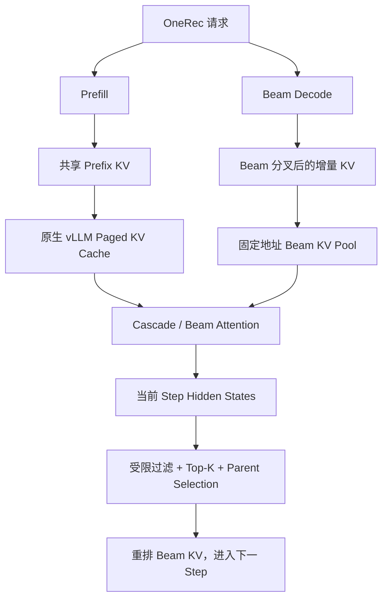
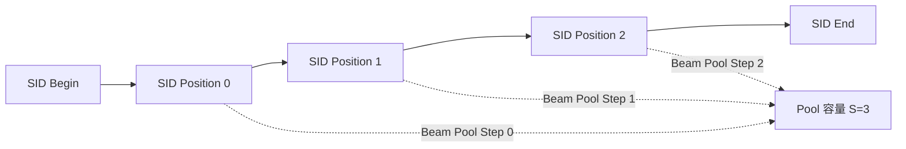
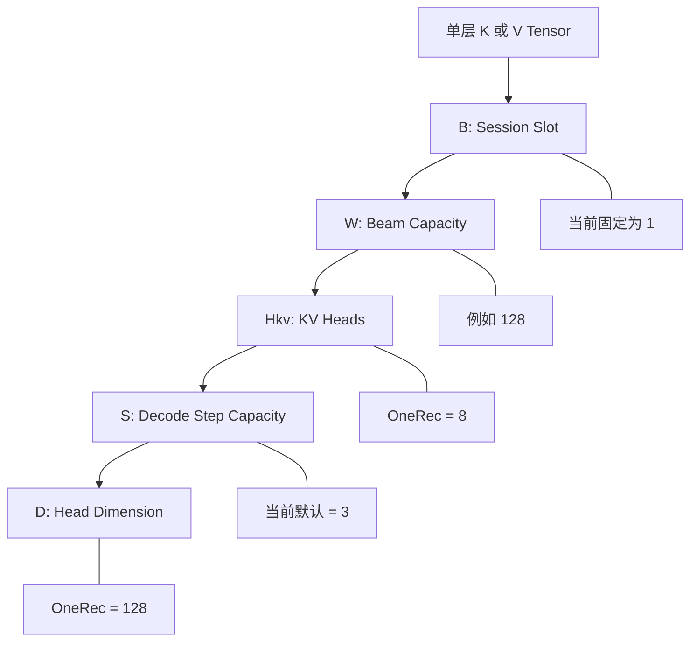
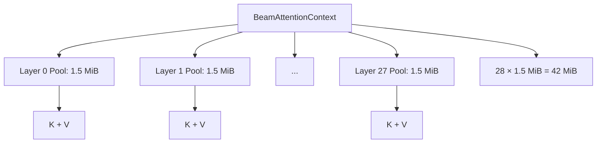
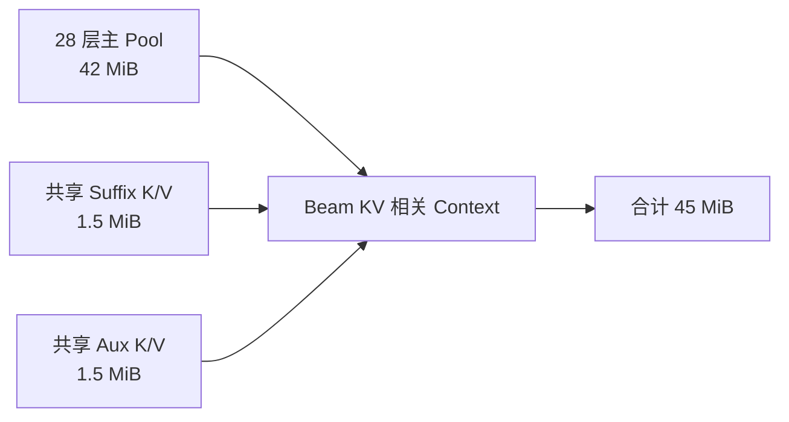
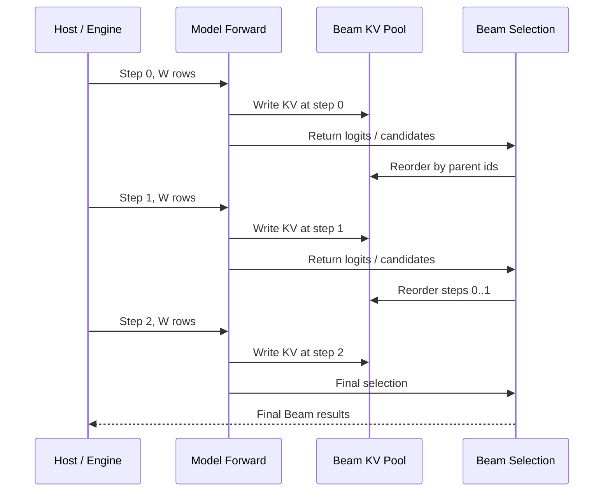
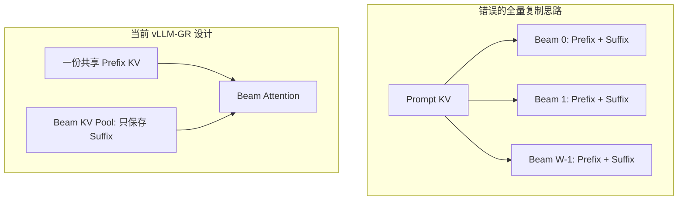
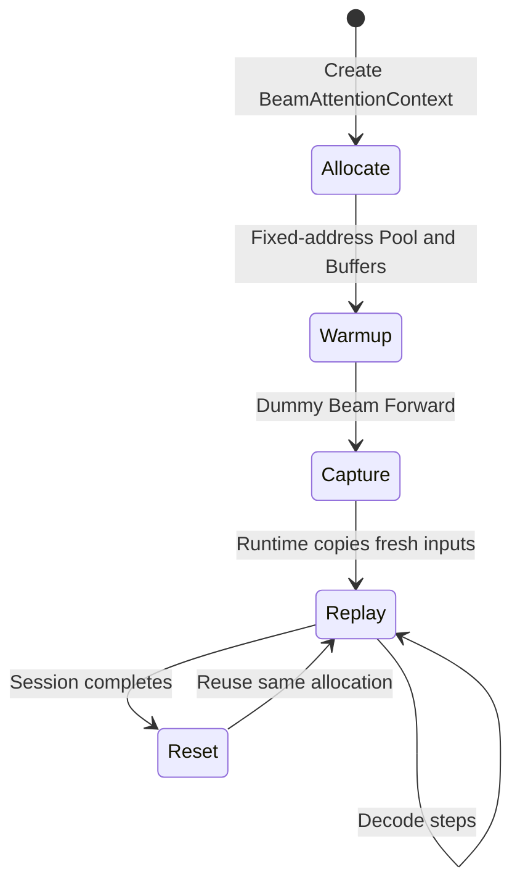

# vLLM-GR Beam KV Pool 在 OneRec-1.7B 上的容量计算与内存布局

> 分析对象：`JiusiServe/vllm-gr` 的 `decode_graph` 分支  
> 代码快照：[`391246e`](https://github.com/JiusiServe/vllm-gr/commit/391246e173d91000f5bf32aa69880f5b2b463839)  
> 模型：[`OpenOneRec/OneRec-1.7B`](https://huggingface.co/OpenOneRec/OneRec-1.7B/blob/main/config.json)  
> 本文只计算 Beam KV Pool 及其直接配套缓冲区，不把模型权重、原生 Prefix KV、Attention workspace、模型激活和 CUDA/ACL Graph 私有内存混入同一个数字。

## 1. 结论

在当前单卡、`max_batch=1`、BF16、`beam_max_decode_steps=3` 的实现下，如果配置：

```text
beam_max_width = 128
```

则有三种需要严格区分的容量口径：

| 口径 | 组成 | 大小 |
|---|---|---:|
| 单层 `BeamAttentionPool` | 一层的 K Pool + V Pool | **1.5 MiB** |
| 核心 Beam KV Pool | 28 层 `BeamAttentionPool` | **42 MiB** |
| 完整 Beam KV 相关 Context | 28 层 Pool + suffix K/V + aux K/V | **45 MiB** |

因此，讨论“Beam KV Pool 多大”时：

- 如果只指 `context.pools` 中 28 层真正保存历史增量 KV 的空间，答案是 **42 MiB**；
- 如果指 `BeamAttentionContext` 为 Beam KV 路径持有的全部主要常驻 Tensor，答案是 **45 MiB**；
- `torch.cuda.memory_reserved()` 可能因为 CUDA allocator 分段、Graph 私有池和其他运行时分配而增加更多，不能拿它直接当作 Beam KV Pool 的逻辑大小。

当前 `beam_max_width` 默认值是 `None`。不配置最大宽度时，Beam Decode Pool/Graph 不会按 128 自动分配；128 是当前测试和常见实验容量，而不是默认值。

## 2. 整体内存分工：Prefix 与 Beam 增量 KV 分离

当前设计没有为每条 Beam 复制完整 Prompt KV，而是把 KV 分成两部分：



这条边界决定了容量公式：

- Prefix KV 与 Prompt 长度相关，但不乘 Beam Width；
- Beam KV Pool 与 Beam Width 和 Decode Steps 相关，但不乘 Prompt 长度；
- Attention 时再把共享 Prefix 和每条 Beam 的独立 suffix 组合起来。

换句话说，Beam KV Pool 解决的不是“保存整条序列”，而是：

> 在共享 Prefix 不复制的前提下，为每条 Beam 保存少量分叉后的增量 KV，并保持固定地址以支持 CUDA/ACL Full Graph。

## 3. OneRec-1.7B 的模型参数

OneRec-1.7B 基于 Qwen3-1.7B。其模型配置中与 KV 容量直接相关的参数为：

| 参数 | 符号 | 数值 | 来源 |
|---|---:|---:|---|
| Transformer 层数 | \(L\) | 28 | `num_hidden_layers` |
| Attention Heads | \(H_q\) | 16 | `num_attention_heads` |
| KV Heads | \(H_{kv}\) | 8 | `num_key_value_heads` |
| Head Dimension | \(D\) | 128 | `head_dim` |
| 模型 DType | \(E\) | BF16，2 bytes | `torch_dtype` |

注意：KV Pool 使用的是 **KV Heads=8**，不是 Query Heads=16。

GQA 下两个 Query Heads 共享一个 KV Head，因此容量计算不能写成 `num_attention_heads × head_dim`，必须使用：

\[
H_{kv} \times D = 8 \times 128
\]

## 4. Decode Steps 为什么是 3

`GRConfig` 中当前默认值为：

```python
_BEAM_MAX_DECODE_STEPS_DEFAULT = 3
```

代码注释给出的 OneRec SID 语义是：`max_tokens=5`，去掉固定的 begin/end，Beam Pool 为三个真正发生分叉的 SID 位置保留容量。



因此本文基线使用：

\[
S = \text{beam\_max\_decode\_steps} = 3
\]

如果业务 SID 深度变为 4 或 5，Pool 会按新的 `beam_max_decode_steps` 线性增长，不能继续沿用 42 MiB 的结论。

## 5. 单层 BeamAttentionPool 的物理布局

每个 Transformer Layer 都拥有独立的 `BeamAttentionPool`。Pool 内部有两个固定地址、连续分配的 Tensor：

```text
unshared_key
unshared_value
```

两者的形状完全相同：

\[
[B, W, H_{kv}, S, D]
\]

对应代码：

```python
pool_shape = (
    max_batch,
    max_beams,
    num_kv_heads,
    max_decode_steps,
    head_dim,
)

self.unshared_key = torch.zeros(pool_shape, dtype=dtype, device=device)
self.unshared_value = torch.zeros(pool_shape, dtype=dtype, device=device)
```

### 5.1 五个维度分别表示什么



在 OneRec-1.7B、W=128 时，一层中的两个 Tensor 为：

```text
K: [1, 128, 8, 3, 128] × BF16
V: [1, 128, 8, 3, 128] × BF16
```

### 5.2 单层容量公式

单层 K+V 的字节数为：

\[
M_{layer}
=
2_{K,V}
\times B
\times W
\times H_{kv}
\times S
\times D
\times E
\]

代入 OneRec-1.7B 的参数：

\[
M_{layer}
=
2 \times 1 \times W \times 8 \times 3 \times 128 \times 2
\]

\[
M_{layer}=12{,}288W\ \text{bytes}
\]

当 \(W=128\)：

\[
M_{layer}
=12{,}288\times128
=1{,}572{,}864\ \text{bytes}
=1.5\ \text{MiB}
\]

仓库单测也精确校验了 `[1, 128, 8, 3, 128]` 的一层 K/V Pool 等于 `1,572,864 bytes`。

## 6. 28 层核心 Beam KV Pool：42 MiB

`BeamAttentionContext` 会按模型层数创建一组 Pool：

```python
self.pools = [
    BeamAttentionPool(...)
    for _ in range(num_layers)
]
```

OneRec-1.7B 有 28 层，因此：

\[
M_{main}
=L\times M_{layer}
\]

\[
M_{main}
=28\times1.5\ \text{MiB}
=\boxed{42\ \text{MiB}}
\]

其层级关系如下：



另一种直观理解是：

- 一条 token 的 K/V 跨 28 层占 112 KiB；
- `W=128, S=3` 一共提供 `128 × 3 = 384` 个 Beam-token 槽位；
- `384 × 112 KiB = 42 MiB`。

## 7. 为什么完整 Context 是 45 MiB

核心 Pool 之外，`BeamAttentionContext` 还持有两组直接服务于 Beam KV 路径的共享缓冲区。

### 7.1 Suffix K/V Buffer

形状为：

\[
[B\times W\times S, H_{kv}, D]
\]

包含一组 K 和 V：

```text
suffix_k_buf
suffix_v_buf
```

在 `B=1` 时，其元素数量正好等于一层 `BeamAttentionPool` 的 K/V 数量，因此：

\[
M_{suffix}=1.5\ \text{MiB}
\]

它用于 Cascade Attention 将当前 Session 的独立 suffix 整理成 Attention Kernel 所需的连续视图。

### 7.2 Aux K/V Buffer

形状为：

\[
[W,H_{kv},S,D]
\]

包含：

```text
aux_key_buf
aux_value_buf
```

因此：

\[
M_{aux}=1.5\ \text{MiB}
\]

Aux Buffer 用于 `select_unshared_kv` 根据新的 `parent_beam_ids` 重排已有 Beam KV。

这里没有为 28 层分别创建 28 组 Aux Buffer。所有层串行执行 KV 重排并复用同一组 Aux Buffer，因此节省了：

\[
(28-1)\times1.5=40.5\ \text{MiB}
\]

如果将来把各层 reorder 并行化，就不能继续共享同一组 Aux Buffer；届时容量和同步关系都需要重新设计。

### 7.3 Context 总量



因此：

\[
M_{context}
=42+1.5+1.5
=\boxed{45\ \text{MiB}}
\]

此外还有几个极小的控制 Buffer：

- `decode_step_buf`: 4 bytes；
- `decode_step_1based_buf`: 4 bytes；
- `xllm_block_table_buf`: `4 × max_batch` bytes。

这些量相对于 MiB 级 KV Tensor 可以忽略，但它们的固定地址对 CUDA/ACL Graph replay 很重要。

## 8. 通用容量公式

定义一组单层、单 Session 的 K/V 容量：

\[
P=2\times W\times H_{kv}\times S\times D\times E
\]

则：

### 8.1 核心 Pool

\[
M_{main}=L\times B\times P
\]

### 8.2 完整 KV 相关 Context

Suffix Buffer 随 \(B\) 增长，而当前 Aux Buffer 是整个 Worker 共享一份：

\[
M_{context}
=L\times B\times P+B\times P+P
\]

\[
M_{context}=((L+1)B+1)P
\]

当前 \(B=1\) 时：

\[
M_{context}=(L+2)P
\]

代入 OneRec-1.7B 的 \(L=28\)：

\[
M_{context}=30P
\]

## 9. Beam Width 对容量的影响

在 BF16、`S=3`、`B=1` 下：

| Beam Width | 单层 Pool | 28 层核心 Pool | 完整 Context |
|---:|---:|---:|---:|
| 32 | 0.375 MiB | 10.5 MiB | 11.25 MiB |
| 64 | 0.75 MiB | 21 MiB | 22.5 MiB |
| 128 | 1.5 MiB | 42 MiB | 45 MiB |
| 256 | 3 MiB | 84 MiB | 90 MiB |
| 512 | 6 MiB | 168 MiB | 180 MiB |
| 1024 | 12 MiB | 336 MiB | 360 MiB |

OneRec-1.7B 下可以进一步简化为：

\[
M_{main}
=0.328125\times W\times\frac{S}{3}\times B\ \text{MiB}
\]

在当前 `B=1, S=3` 下，每增加一条 Beam，核心 Pool 增加：

\[
0.328125\ \text{MiB}=336\ \text{KiB}
\]

## 10. Decode Steps 对容量的影响

Beam Pool 对 `beam_max_decode_steps` 也是严格线性增长。

以 `W=128` 为例：

| 最大 Decode Steps | 28 层核心 Pool | 完整 Context |
|---:|---:|---:|
| 2 | 28 MiB | 30 MiB |
| 3 | 42 MiB | 45 MiB |
| 4 | 56 MiB | 60 MiB |
| 5 | 70 MiB | 75 MiB |

因此容量规划必须使用允许接入的最大 SID 深度，而不是平均 Decode Steps。固定地址 Pool 一旦创建，就会为最大容量常驻显存。

## 11. Pool 在多步 Decode 中如何使用

每一步 Forward 只写当前 step 的槽位，Beam Search 选出新 parent 后，再重排已有的增量 KV：



对应的逻辑布局可以理解为：

```text
Beam 0: [step 0 KV][step 1 KV][step 2 KV]
Beam 1: [step 0 KV][step 1 KV][step 2 KV]
...
Beam W-1: [step 0 KV][step 1 KV][step 2 KV]
```

每次 Parent Selection 发生后，逻辑 Beam 编号对应的祖先可能改变，因此 `select_unshared_kv` 必须让历史 KV 与新的 Beam 排名保持一致。

## 12. Prompt 长度为什么不进入 Beam Pool 公式

OneRec-1.7B 单 token、跨全部 28 层的 K/V 大小为：

\[
M_{token}
=2\times28\times8\times128\times2
=114{,}688\ \text{bytes}
=112\ \text{KiB}
\]

如果 Prompt 长度约为 900：

\[
M_{prefix}
=900\times112\ \text{KiB}
=98.4375\ \text{MiB}
\]

这部分由原生 Paged KV Cache 保存，并在 Beam Decode 中共享。

如果错误地把这份 Prefix KV 为 128 条 Beam 各复制一份，理论容量将达到：

\[
98.4375\times128
=12{,}600\ \text{MiB}
\approx12.3\ \text{GiB}
\]

当前设计的核心收益正是避免这类 `Prompt Length × Beam Width` 的物理复制：



## 13. `max_num_seqs` 不等于 Beam Pool 的 max_batch

这是当前实现中最容易误判的另一个地方。

即使服务启动参数配置：

```text
--max-num-seqs 1024
```

Beam Context 当前仍通过以下方式创建：

```python
_create_beam_context(..., max_batch=1)
```

因此当前含义是：

- 原生 Scheduler 可以管理大量普通 Request；
- 但一个 Worker 的增量 Beam Pool 当前只有一个 Beam Session slot；
- Pool 容量不会因为 `max_num_seqs=1024` 自动乘以 1024；
- 同时出现多个增量 Beam Session 时，当前实现会执行容量/并发保护，而不是静默扩容。

如果后续将 `max_batch` 从 1 扩展到 \(B>1\)，主 Pool 和 suffix Buffer 都会随 \(B\) 线性增长；共享 Aux Buffer 是否仍可复用，则取决于多 Session、多层 reorder 的执行顺序。

## 14. CUDA/ACL Graph 对容量和生命周期的影响

Beam Pool 在初始化或 capture 阶段预分配，之后保持固定地址：



需要注意：

1. Graph capture 不应再复制一套 Beam KV Pool；capture 创建的 Context 会作为运行时 Context 继续复用。
2. Graph 私有内存池仍可能保留模型中间激活和算子 workspace，它们不属于本文的 45 MiB。
3. 使用 `torch.cuda.memory_reserved()` 观察时，会同时看到 allocator chunk、Graph pool 和其他缓存，通常大于逻辑 Tensor 的 `numel × element_size`。
4. Beam Pool 当前只允许 FP16/BF16。即使原生 KV Cache 支持 FP8，也不能直接把本文结果除以 2。

## 15. 显存预算中应该怎样使用这个结果

完整 Worker 显存预算应写成：

\[
M_{weights}
+M_{nativeKV}
+M_{beamKV}
+M_{workspace}
+M_{graph}
+M_{temporary}
+M_{fragmentation}
\le M_{usable}
\]

其中本文给出的：

```text
M_beamKV_main    = 42 MiB   # 28 层历史增量 KV
M_beamKV_context = 45 MiB   # 加 suffix / aux
```

容量规划建议使用 45 MiB 作为 Beam KV 子系统的直接常驻 Tensor 基线，再通过启动前后显存差分和 Graph capture 前后差分分别测量：

- PyTorch allocator 额外保留；
- CUDA/ACL Graph 私有池；
- FlashAttention/Cascade Attention workspace；
- Model Runner 静态输入输出 Buffer；
- 实际峰值重叠。

不要把 45 MiB 当作整个 Decode Full Graph 的显存成本。

## 16. 建议的运行时验证方法

逻辑大小可以直接从 Tensor 求和：

```python
def tensor_bytes(t):
    return t.numel() * t.element_size()

main_pool_bytes = sum(
    tensor_bytes(pool.unshared_key) + tensor_bytes(pool.unshared_value)
    for pool in context.pools
)

suffix_bytes = (
    tensor_bytes(context.suffix_k_buf)
    + tensor_bytes(context.suffix_v_buf)
)

aux_bytes = (
    tensor_bytes(context.aux_key_buf)
    + tensor_bytes(context.aux_value_buf)
)

print("main pool MiB:", main_pool_bytes / 1024**2)
print("suffix MiB:", suffix_bytes / 1024**2)
print("aux MiB:", aux_bytes / 1024**2)
print("context total MiB:",
      (main_pool_bytes + suffix_bytes + aux_bytes) / 1024**2)
```

对于 OneRec-1.7B、W=128、S=3、B=1，预期输出：

```text
main pool MiB:    42.0
suffix MiB:        1.5
aux MiB:           1.5
context total MiB: 45.0
```

同时建议分别记录：

```python
torch.cuda.memory_allocated()
torch.cuda.memory_reserved()
```

在以下四个时刻的差值：

1. 模型加载后；
2. Beam Context 创建后；
3. Beam Graph capture 后；
4. 第一次真实 replay 后。

这样可以把“Beam KV Tensor 逻辑容量”和“Graph/allocator 实际额外成本”分开。

## 17. 代码来源映射

| 关注点 | 代码位置 |
|---|---|
| 单层 K/V Pool 形状与分配 | [`beam_attention_pool.py`](https://github.com/JiusiServe/vllm-gr/blob/decode_graph/vllm_gr/v1/beam/beam_attention_pool.py) |
| 28 层 Pool、suffix/aux/control buffers | [`beam_attention_context.py`](https://github.com/JiusiServe/vllm-gr/blob/decode_graph/vllm_gr/v1/beam/beam_attention_context.py) |
| 从模型和 GRConfig 推导 Pool 维度 | [`model_runner_common.py`](https://github.com/JiusiServe/vllm-gr/blob/decode_graph/vllm_gr/v1/worker/model_runner_common.py) |
| `beam_max_width` 与 `beam_max_decode_steps` | [`config/models.py`](https://github.com/JiusiServe/vllm-gr/blob/decode_graph/vllm_gr/config/models.py) |
| W=128 单层 1.5 MiB 精确单测 | [`test_beam_attention_pool.py`](https://github.com/JiusiServe/vllm-gr/blob/decode_graph/tests/test_beam_attention_pool.py) |
| OneRec-1.7B 模型结构参数 | [`config.json`](https://huggingface.co/OpenOneRec/OneRec-1.7B/blob/main/config.json) |

## 18. 最终结论

OneRec-1.7B 的 Beam KV Pool 容量由以下变量决定：

\[
\boxed{
2_{K,V}
\times L
\times B
\times W
\times H_{kv}
\times S
\times D
\times E
}
\]

在当前目标配置：

```text
L=28
B=1
W=128
Hkv=8
S=3
D=128
E=2 bytes
```

得到：

\[
\boxed{M_{main}=42\ \text{MiB}}
\]

加上共享 suffix 和 aux K/V：

\[
\boxed{M_{context}=45\ \text{MiB}}
\]

这套设计的关键不是把 KV 做得“绝对很小”，而是把容量从潜在的：

\[
PromptLength\times BeamWidth
\]

拆成：

\[
SharedPrefix(PromptLength)
+BeamSuffix(BeamWidth\times DecodeSteps)
\]

因此它尤其适合 OneRec 这种 Prompt 较长、Beam Width 较大、但 SID Decode Steps 很短且固定的场景。
