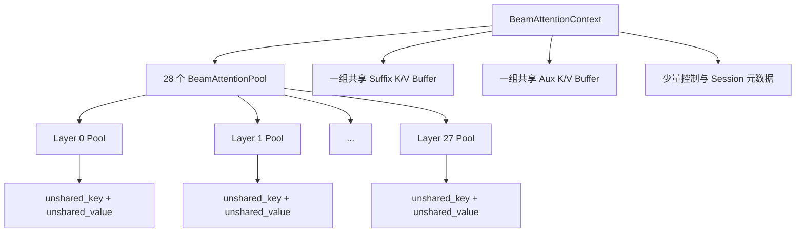
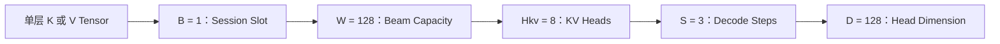
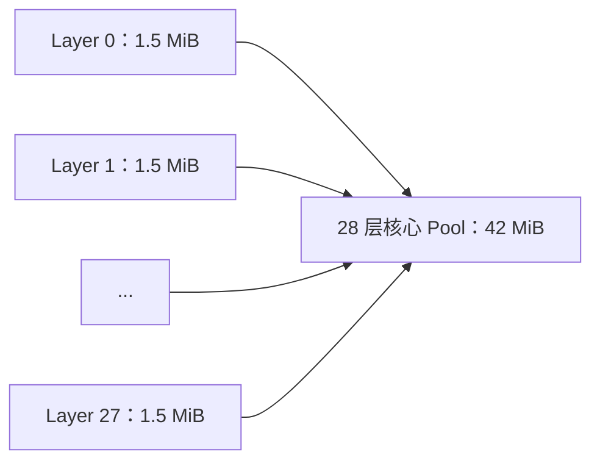

# OneRec-1.7B Beam KV Pool 大小计算

> 分析对象：`JiusiServe/vllm-gr` 的 `decode_graph` 分支  
> 代码快照：[`391246e`](https://github.com/JiusiServe/vllm-gr/commit/391246e173d91000f5bf32aa69880f5b2b463839)

## 1. 结论

在以下配置下：

```text
Model                  = OneRec-1.7B
DType                  = BF16
max_batch              = 1
beam_max_width         = 128
beam_max_decode_steps  = 3
```

Beam KV 相关显存大小为：

| 统计范围 | 大小 |
|---|---:|
| 单层 `BeamAttentionPool` | **1.5 MiB** |
| 28 层核心 Beam KV Pool | **42 MiB** |
| 核心 Pool + suffix Buffer + aux Buffer | **45 MiB** |

通常所说的 **Beam KV Pool 大小是 42 MiB**；如果把 `BeamAttentionContext` 中直接服务于 Beam KV 的共享临时 Buffer 也算进去，则是 **45 MiB**。

## 2. Pool 的组织关系

### 2.1 Worker 级组织

一个 Worker 持有一个 `BeamAttentionContext`。Context 内部包含：



对应关系：

| 对象 | 数量 | 作用 |
|---|---:|---|
| `BeamAttentionContext` | 每个 Worker 1 个 | 持有全部 Beam KV 资源 |
| `BeamAttentionPool` | 每层 1 个，共 28 个 | 保存该层所有 Beam 的增量 K/V |
| `unshared_key` | 每层 1 个 | 保存该层的 Beam Key |
| `unshared_value` | 每层 1 个 | 保存该层的 Beam Value |
| `suffix_k_buf/suffix_v_buf` | 整个 Context 1 组 | Cascade Attention 使用的连续 suffix Buffer |
| `aux_key_buf/aux_value_buf` | 整个 Context 1 组 | Beam parent 重排时使用的共享临时 Buffer |

### 2.2 单层 Tensor 布局

每层 `BeamAttentionPool` 内有两个形状完全相同的 Tensor：

```text
unshared_key:   [B, W, Hkv, S, D]
unshared_value: [B, W, Hkv, S, D]
```

其中：

| 维度 | 含义 | OneRec-1.7B 当前取值 |
|---|---|---:|
| `B` | Beam Session slot 数，即 `max_batch` | 1 |
| `W` | 最大 Beam Width | 128 |
| `Hkv` | KV Head 数 | 8 |
| `S` | 最大 Beam Decode Steps | 3 |
| `D` | Head Dimension | 128 |



因此，每层实际分配为：

```text
K: [1, 128, 8, 3, 128] × BF16
V: [1, 128, 8, 3, 128] × BF16
```

## 3. OneRec-1.7B 的计算参数

OneRec-1.7B 模型配置中与 Beam KV Pool 相关的参数为：

| 模型参数 | 符号 | 数值 |
|---|---:|---:|
| Transformer 层数 | \(L\) | 28 |
| KV Heads | \(H_{kv}\) | 8 |
| Head Dimension | \(D\) | 128 |
| DType 字节数 | \(E\) | 2 bytes |

Pool 配置为：

| Pool 参数 | 符号 | 数值 |
|---|---:|---:|
| 最大 Session slots | \(B\) | 1 |
| 最大 Beam Width | \(W\) | 128 |
| 最大 Decode Steps | \(S\) | 3 |

注意，容量计算使用的是 `num_key_value_heads=8`，不是 `num_attention_heads=16`。

## 4. Pool 大小计算

### 4.1 单层 Pool：1.5 MiB

单层包含一份 K 和一份 V，因此：

\[
M_{layer}
=2_{K,V}
\times B
\times W
\times H_{kv}
\times S
\times D
\times E
\]

代入：

\[
M_{layer}
=2\times1\times128\times8\times3\times128\times2
\]

\[
M_{layer}
=1{,}572{,}864\ \text{bytes}
=1.5\ \text{MiB}
\]

所以：

```text
每层 BeamAttentionPool = 1.5 MiB
```

### 4.2 28 层核心 Pool：42 MiB

OneRec-1.7B 有 28 层，每层一个 Pool：

\[
M_{main}=L\times M_{layer}
\]

\[
M_{main}=28\times1.5=42\ \text{MiB}
\]



因此：

\[
\boxed{M_{main}=42\ \text{MiB}}
\]

### 4.3 Suffix Buffer：1.5 MiB

Context 额外持有一组共享的：

```text
suffix_k_buf: [B × W × S, Hkv, D]
suffix_v_buf: [B × W × S, Hkv, D]
```

其元素数量与一层 Pool 的 K/V 总量相同，因此：

\[
M_{suffix}=1.5\ \text{MiB}
\]

### 4.4 Aux Buffer：1.5 MiB

Context 还持有一组共享的：

```text
aux_key_buf:   [W, Hkv, S, D]
aux_value_buf: [W, Hkv, S, D]
```

当前 `B=1`，其大小同样等于一个单层 Pool：

\[
M_{aux}=1.5\ \text{MiB}
\]

Aux Buffer 被 28 层串行复用，没有为每层分别分配一组。

### 4.5 完整 Context：45 MiB

```text
28 层核心 Beam KV Pool     42.0 MiB
共享 Suffix K/V Buffer      1.5 MiB
共享 Aux K/V Buffer         1.5 MiB
-----------------------------------
Beam KV 相关 Context       45.0 MiB
```

即：

\[
M_{context}=42+1.5+1.5=45\ \text{MiB}
\]

## 5. 通用公式

### 5.1 核心 Beam KV Pool

\[
\boxed{
M_{main}
=2\times L\times B\times W\times H_{kv}\times S\times D\times E
}
\]

### 5.2 完整 Beam KV 相关 Context

定义一层、单 Session 的 K/V 容量：

\[
P=2\times W\times H_{kv}\times S\times D\times E
\]

则：

\[
M_{main}=L\times B\times P
\]

\[
M_{suffix}=B\times P
\]

\[
M_{aux}=P
\]

所以：

\[
\boxed{
M_{context}=((L+1)B+1)P
}
\]

当前 \(B=1\) 时：

\[
M_{context}=(L+2)P
\]

## 6. 不同 Beam Width 下的大小

保持 `B=1`、`S=3`、BF16 不变：

| Beam Width | 单层 Pool | 28 层核心 Pool | 完整 Context |
|---:|---:|---:|---:|
| 32 | 0.375 MiB | 10.5 MiB | 11.25 MiB |
| 64 | 0.75 MiB | 21 MiB | 22.5 MiB |
| 128 | 1.5 MiB | 42 MiB | 45 MiB |
| 256 | 3 MiB | 84 MiB | 90 MiB |
| 512 | 6 MiB | 168 MiB | 180 MiB |

Beam Width、Decode Steps 和 `max_batch` 都会让 Pool 线性增长。

## 7. 统计边界

本文的 42/45 MiB 不包含：

- 原生 vLLM Prefix Paged KV Cache；
- 模型权重；
- Model Runner 静态输入输出；
- Attention workspace；
- CUDA/ACL Graph 私有内存池；
- PyTorch allocator 预留和显存碎片。

因此：

- 用 Tensor 的 `numel × element_size` 计算，会得到精确的 42/45 MiB；
- `torch.cuda.memory_reserved()` 通常会大于 45 MiB，不能直接视为 Beam KV Pool 大小。

## 8. 代码位置

| 内容 | 代码位置 |
|---|---|
| 单层 K/V Pool 的形状与分配 | [`beam_attention_pool.py`](https://github.com/JiusiServe/vllm-gr/blob/decode_graph/vllm_gr/v1/beam/beam_attention_pool.py) |
| 28 层 Pool、suffix/aux Buffer | [`beam_attention_context.py`](https://github.com/JiusiServe/vllm-gr/blob/decode_graph/vllm_gr/v1/beam/beam_attention_context.py) |
| 从模型配置推导 Pool 维度 | [`model_runner_common.py`](https://github.com/JiusiServe/vllm-gr/blob/decode_graph/vllm_gr/v1/worker/model_runner_common.py) |
| Beam 最大宽度与 Decode Steps 配置 | [`config/models.py`](https://github.com/JiusiServe/vllm-gr/blob/decode_graph/vllm_gr/config/models.py) |
| 单层 1.5 MiB 的精确单测 | [`test_beam_attention_pool.py`](https://github.com/JiusiServe/vllm-gr/blob/decode_graph/tests/test_beam_attention_pool.py) |
| OneRec-1.7B 模型参数 | [`config.json`](https://huggingface.co/OpenOneRec/OneRec-1.7B/blob/main/config.json) |
