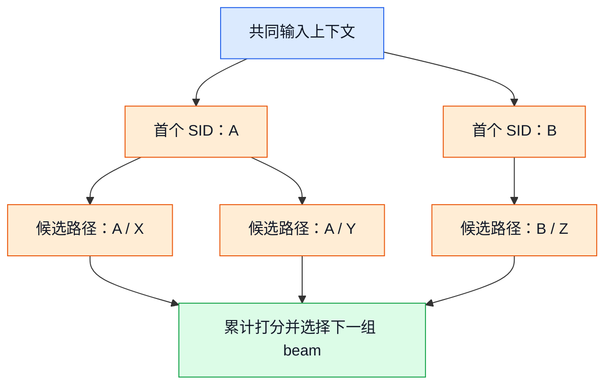
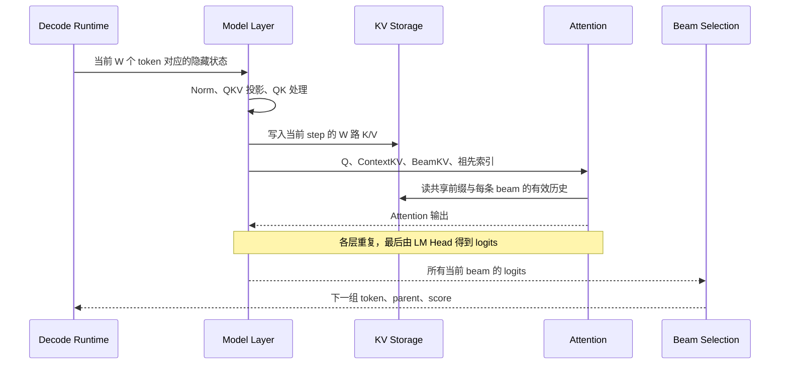
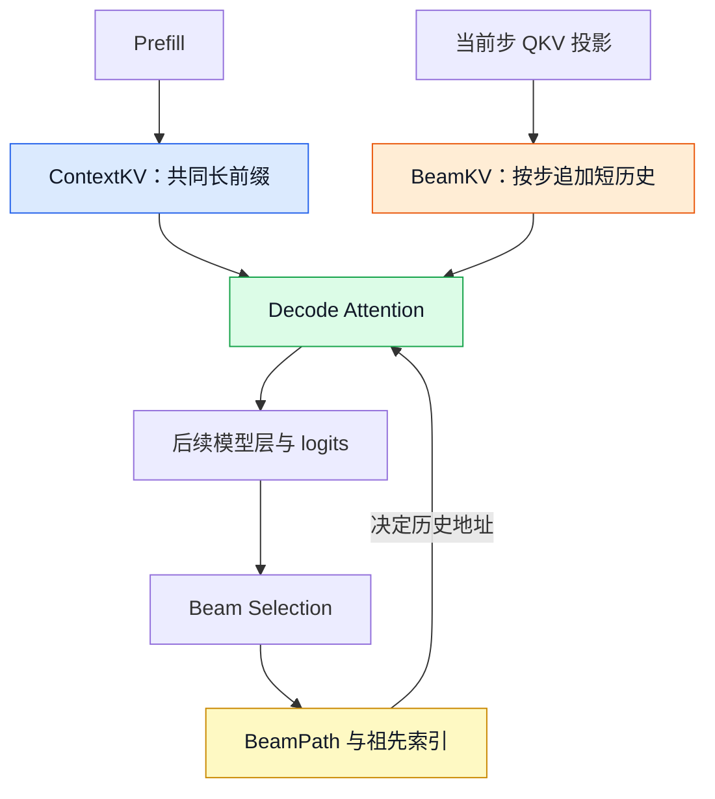
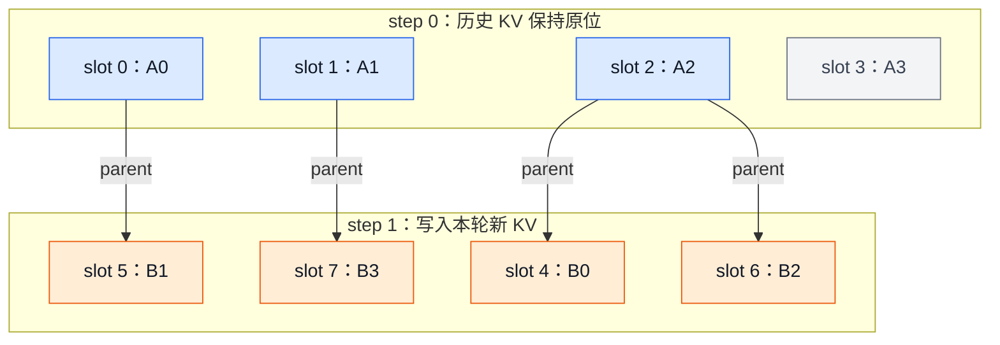
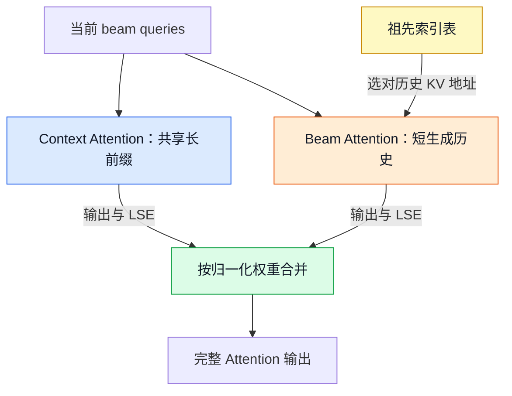
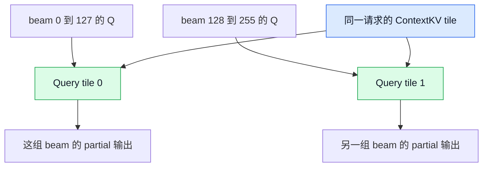
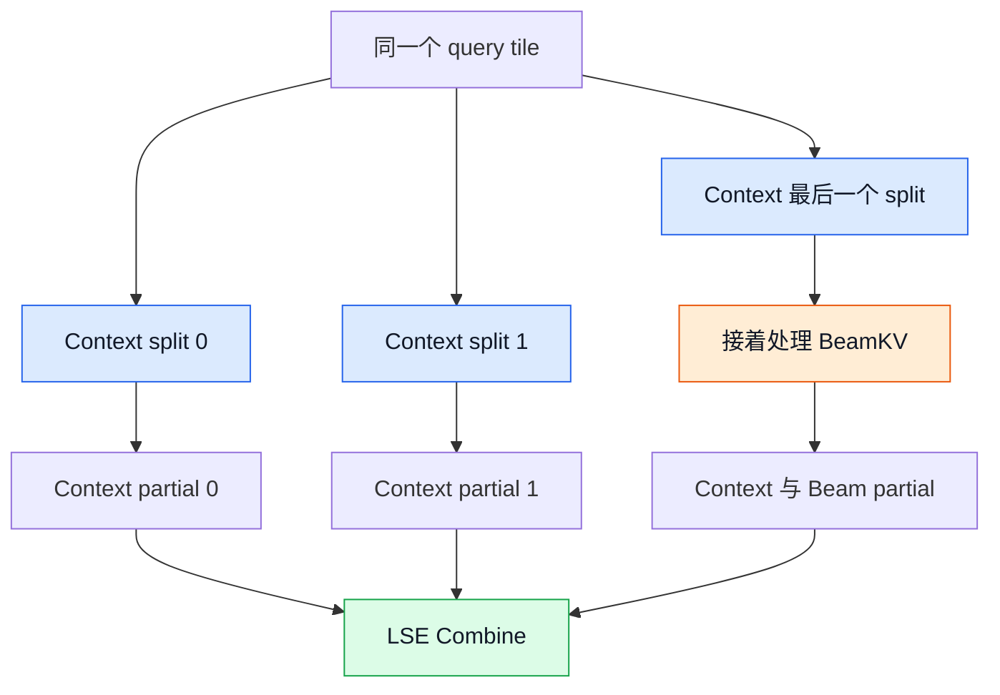
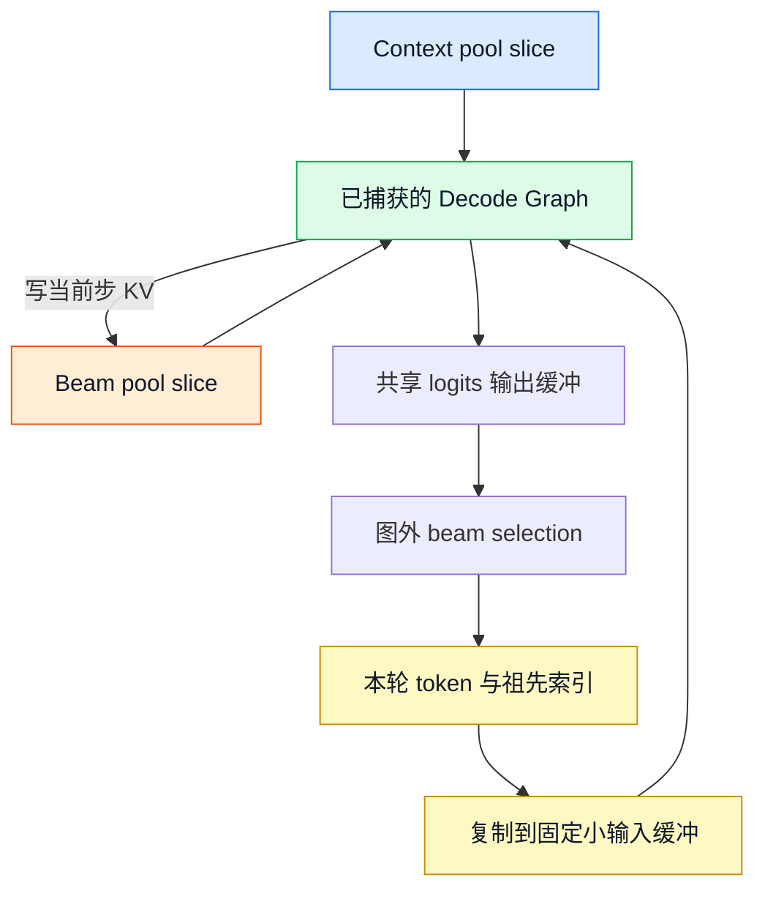

# 图解 SID-GR Decode：Attention、BeamKV 与祖先索引

> 面向读者：了解 Transformer 基本概念，希望理解生成式推荐推理的新同学。  
> 分析对象：NVIDIA `recsys-examples` 的 `examples/sid-gr-inference`，以及仓内 `corelib/gr_decode_atten` 内核快照。  
> 代码基线：[`c11dcb691f8e`](https://github.com/NVIDIA/recsys-examples/tree/c11dcb691f8e1fa51d7a3ccc4b0b6b68836a2c4a)，核对日期：2026-09-09。  
> 范围：decode Attention、KV 存储与寻址、CUDA Graph 的配合；不展开完整调度器、EOS 和推荐约束算法。

**先记住三个动作：长前缀只存一份，短历史按步追加，Attention 按祖先索引读取。**

这套设计面向“长输入、大 beam、短输出”的生成式推荐负载。它让 Attention 利用同一请求中多条 beam 的共享前缀，并将短且分叉的生成历史单独处理。

**模型边界：本文代码基线中的模型适配是 Qwen3，没有找到 OneRec 专用适配。** 文中的 OneRec 部分讲迁移思路；Qwen3 的模型细节和性能数据不等于 OneRec 的实测结果。部署时，适配器通过 `GR_DECODE_ATTEN_ROOT` 等路径选择外部 `interface.py`；本文内核细节以仓内可核验的 `corelib/gr_decode_atten` 为准，实际运行还应核对加载的内核版本。[模型目录][models] · [内核适配器][adapter]

## 阅读路线

| 想解决的问题 | 对应章节 |
| --- | --- |
| Prefill、decode、beam 分别是什么？ | 1 |
| 一次 decode 怎样读写 KV？ | 2 |
| KV 在显存中到底怎么排？ | 3 |
| Beam 重排后为什么不用搬历史 KV？ | 4 |
| Attention 为什么拆成两部分，如何加速？ | 5–6 |
| 固定地址与 CUDA Graph 如何配合？ | 7 |
| 对 OneRec / vllm-gr 有什么借鉴价值？ | 8 |
| 从哪些源码开始阅读？ | 10 |

## 1. 从一个推荐请求开始

### 1.1 三个基本概念

| 概念 | 在本文中的含义 |
| --- | --- |
| Prefill | 一次处理输入上下文，为各层生成前缀 K/V，并产生预测下一个 token 的 logits |
| Decode | 输入已经选出的新 token，读取历史 KV，预测再下一个 token |
| Beam search | 同时保留多条候选生成路径；每轮扩展后重新选出若干条路径 |
| Beam width `W` | 当前保留的候选路径数，不是历史 token 数 |
| Parent | 新一轮某条 beam 来自上一轮哪条 beam |
| KV Cache | 保存历史 token 在各层的 K/V，避免每一步重算旧 token 的表示 |

例如一个请求有 4,096 个上下文 token，希望生成一个由 3 个 SID token 组成的推荐结果，并保留 128 条候选路径。

在通常的自回归流程中，prefill 的最后位置 logits 已能选出第一个 SID token；再做两次 decode forward，即可分别选出第二、第三个 token。因此，**输出 token 数、decode forward 次数、KV 预留步数是三个不同的计数**，不能直接混用。实际 API 的 `max_steps` 等参数应以调用层的定义为准。

### 1.2 为什么会出现大量共享？

同一个请求中的所有 beam 都看过相同的输入上下文，但生成的短后缀逐渐不同。



**图 1：同一父路径可以产生多个入选的子路径。** 图中省略未入选候选；分支节点表示逻辑路径，不代表复制了一整份 KV。

长前缀可能有数千 token，而每条路径的生成历史通常只有几个 token。这两部分的长度和访问模式明显不同，适合分开存储和计算。

## 2. 一次 decode：先写当前 KV，再读完整有效历史

先看执行顺序，再看物理布局。



**图 2：新 K/V 的写入发生在本层 Attention 之前；beam 选择发生在整个模型 forward 之后。**

在所查 Qwen3 实现的 `forward_decode` 中：

1. 对当前隐藏状态进行归一化和 QKV 投影。
2. 执行 QK norm / RoPE，位置通常是 `context_len + step`。
3. 将本层 K/V 写入 `BeamKV[layer, :, step, :W]`。
4. 调用 Attention，默认 `decode_nums = step + 1`，包含当前步。
5. 执行输出投影、残差、MLP 等后续计算。

**不能把“刚选出的 token”与“已经计算并缓存的 KV”混为一谈。** 新 token 被选出来时，还要在下一次 forward 中计算它自己的各层 K/V。[逐层 decode 实现][layers] · [KV 写入器][writer]

## 3. 三类状态：ContextKV、BeamKV、BeamPath

### 3.1 先看职责



**图 3：数据与路径分离。** 箭头表示数据依赖；选择结果更新的是供下一轮使用的路径信息。

| 对象 | 保存什么 | 是否随 beam 选择而移动 |
| --- | --- | --- |
| ContextKV | Prefill 得到的各层长前缀 K/V | 固定请求内共享，decode 通常只读 |
| BeamKV | 每个生成位置、每个物理 beam slot 的 K/V | 固定宽度直接寻址路径保留历史原位 |
| BeamPath | 各轮 parent、token、score | 每轮追加逻辑关系 |
| `topk_indices` | Attention 使用的祖先 KV 地址表 | 随路径变化重新准备 |

这里的共享发生在**同一请求的 beam 之间**。它不要求开启跨请求的 Prefix Cache；两个请求是否复用同一个 prompt 是另一层问题。

### 3.2 物理 tensor 布局

统一记号：`L` 为层数，`B` 为请求数，`S` 为上下文长度，`T_max` 为 decode 容量，`W_max` 为 beam 容量，`Hkv/Hq` 为 KV/query head 数，`D` 为 head dimension。

| 数据 | K、V 各自的形状 | 说明 |
| --- | --- | --- |
| ContextKV | `[L, B, S, Hkv, D]` | 没有 beam 维度 |
| BeamKV | `[L, B, T_max, W_max, Hkv, D]` | step-major，每个 step 保存一组 beam |
| 一层的 Q，框架接口 | `[B, W, Hq, D]` | 每条 beam 一个当前 query |
| 一层的 Q，内核接口 | `[B, 1, W, Hq, D]` | `1` 表示每条 beam 本次只有一个 query token |
| 祖先索引，内核接口 | `[B, 1, Hq, t, W]` | `t` 表示有效 decode 历史步数，可包含当前步 |

**K 和 V 分别存储在独立 tensor 中。** 连续分配时，最内层 `D` 连续；BeamKV 接着是 head、beam、step。Pool 的 slice 可以保留较大的外层 stride，不能仅凭逻辑 shape 判断整个 view 都连续。[ContextKV 定义][context] · [BeamKV 定义][beam]

以一层、一个请求、`W=4` 为例，忽略 head 和 dimension 后，BeamKV 的地址对应关系如下：

| Step 平面 | beam slot 0 | beam slot 1 | beam slot 2 | beam slot 3 |
| --- | --- | --- | --- | --- |
| step 0 | flat 0 | flat 1 | flat 2 | flat 3 |
| step 1 | flat 4 | flat 5 | flat 6 | flat 7 |
| step 2 | flat 8 | flat 9 | flat 10 | flat 11 |

这是一张**物理存储表**：同一列在不同 step 的 KV，不一定属于同一条最终路径。最终路径要由祖先索引串起来。

### 3.3 送入 Attention 时怎样展平？

适配器从完整 tensor 选择当前层与有效历史：

```python
# 解释布局的伪代码，省略校验。
context = context_kv[layer]                 # [B, S, Hkv, D]
history = beam_kv[layer, :, :t, :W]          # [B, t, W, Hkv, D]
history = history.reshape(B, t * W, Hkv, D)
```

当 `W == W_max` 且 step/beam 的 stride 可合并时，最后一步是 view，不搬数据。若 `W < W_max`，相邻 step 之间可能存在未使用槽位，`reshape` 就可能触发实际拷贝。**固定容量、固定有效宽度，是理解最快路径的重要前提。**[适配器 `_select_beam_history`][adapter]

### 3.4 容量：省在哪里？

令每个元素占 `e` 字节，则 KV 预留容量为：

$$
M_{\mathrm{KV}}=2LBH_{kv}De\left(S+T_{\max}W_{\max}\right)
$$

前面的 `2` 对应 K 与 V。仅作为算术示例，设 `L=28、B=1、Hkv=8、D=128、BF16、S=4096、T_max=3、W_max=128`：

| 部分 | 计算结果 |
| --- | ---: |
| ContextKV | 448 MiB |
| BeamKV | 42 MiB |
| 两者合计 | 490 MiB |

这是示例配置下的 KV 容量，不含权重、临时 workspace、graph 内存，也不是对 OneRec 实际配置的声明。`T_max=3` 是预留容量，不等于一定执行三次 decode。

长前缀的存储量不再乘 `W`。不过，支持共享 block 的 Paged KV 也能做到前缀不复制；因此要继续区分：**存储共享、计算时复用、历史重排消除，是三项不同收益。**[容量估算与 pool][memory]

## 4. 用四条 beam 讲清祖先索引

### 4.1 一父多子：旧 slot 2 被两条路径引用

step 0 已完成 forward，四个物理 slot 记作 `A0、A1、A2、A3`。下一组 beam 选择出的父节点是：

```python
parents = [2, 0, 2, 1]
```

含义是“新 beam 0 来自旧 beam 2，新 beam 1 来自旧 beam 0……”。



**图 4：箭头表示祖先引用，不表示 KV copy。** 节点按引用关系排布，物理地址以 slot 编号为准。旧 slot 3 在当前入选路径中不再被引用，但固定 pool 不必立即回收这个单独槽位。

此时四条 query 各自可见的历史是：

| 当前 query beam | step 0 祖先 KV | step 1 当前 KV | 完整可见范围 |
| ---: | --- | --- | --- |
| 0 | flat 2：A2 | flat 4：B0 | ContextKV + A2 + B0 |
| 1 | flat 0：A0 | flat 5：B1 | ContextKV + A0 + B1 |
| 2 | flat 2：A2 | flat 6：B2 | ContextKV + A2 + B2 |
| 3 | flat 1：A1 | flat 7：B3 | ContextKV + A1 + B3 |

注意：query beam 0 不会因为能访问整个 BeamKV tensor，就去读 B1、B2、B3。**祖先索引限定了它可见的路径，避免不同候选互相“看见”不属于自己的历史。**

### 4.2 索引公式与实际内容

固定宽度下：

$$
I[d,j]=dW+\operatorname{ancestor}(j,d)
$$

`d` 是历史 step，`j` 是当前 query beam。上例忽略 batch/head 维度后：

```python
# 每一行是一个历史 step，每一列是一条当前 query beam。
indices = [
    [2, 0, 2, 1],  # step 0：沿 parent 找到历史 slot
    [4, 5, 6, 7],  # step 1：当前 beam 自己的新 KV
]
```

**`topk_indices` 这个名字容易误导：它是 BeamKV 的地址表，不是筛选“Attention 分数最高的几个 token”。** 所有有效前缀 token 和该 beam 路径上的有效历史 token 仍然参与 Attention。[索引构造][indices]

### 4.3 再走一步：parent 需要组合，不能只记最后一跳

假设 step 2 的父节点是 `[1, 0, 0, 3]`。当前 beam 0 的路径是：

`step 2 beam 0 → step 1 beam 1 → step 0 beam 0`。

对应索引为：

| 历史 step | query 0 | query 1 | query 2 | query 3 |
| --- | ---: | ---: | ---: | ---: |
| step 0 | 0 | 2 | 2 | 1 |
| step 1 | 5 | 4 | 4 | 7 |
| step 2 | 8 | 9 | 10 | 11 |

历史 KV 仍保持原位。实现中的 `_beam_ancestry` 从当前 beam 逐步回溯 parent，得到每个历史位置的祖先编号。

下面给出等价语义的伪代码，帮助理解状态转移；它不是对当前 GPU 实现的逐字描述：

```python
# old_ancestry[j, d]：旧 query j 在历史 step d 的物理地址
# parents[new_j]：新 query 来自哪个旧 query
new_ancestry[:, :t] = old_ancestry[parents, :t]
new_ancestry[:, t] = t * W + arange(W)
# 这里只更新整数地址；不移动历史 K/V。
```

当前通用索引构造路径仍包含 Python 回溯和 tensor 构造；“KV 不搬”并不自动意味着“索引维护零 CPU 开销”。[索引构造][indices]

### 4.4 与物理 reorder 的区别

| 对比项 | 按 parent 物理整理历史 | 原位 KV + 祖先索引 |
| --- | --- | --- |
| 选择后的动作 | 把 parent 历史复制到 child 对应位置 | 更新每条 child 的祖先地址 |
| 一父多子 | 同一历史复制到多个位置 | 多条路径引用同一历史 slot |
| Attention 接口 | 通常直接读整理好的每条路径 | kernel 需要支持索引读取 |
| 每轮维护对象 | 多层、多 head 的 K/V 浮点数据 | 短路径的整数元数据 |
| 主要代价 | KV copy 与必要的临时缓冲 | 索引准备与 kernel 间接寻址 |

这是一种把工作从“移动历史数据”转成“维护地址关系”的设计。是否更快仍需结合历史长度、beam 宽度和 Attention kernel 测量。

### 4.5 动态缩 beam 是一个重要例外

如果 beam 从 4 缩到 2，但新路径需要读取旧 slot 3，直接截取 `:2` 会漏掉祖先。当前代码在检测到这类情况时，会构造临时 BeamKV，把当前路径需要的历史 gather 到有效范围，再使用 compacted 索引。

因此准确结论是：**固定宽度、合适 stride 的直接路径可以不搬历史；动态宽度存在 compaction 和隐式 reshape copy 的成本。**[动态 BeamKV compaction][compaction]

## 5. Attention：共享长前缀与短路径分别计算

### 5.1 从正确性公式理解两部分

对一条当前 query，完整可见 KV 是：

`共同前缀 KV + 祖先路径 KV + 当前 token KV`。

整体计算仍遵循：

$$
O=\operatorname{softmax}\left(QK^\top/\sqrt{D}\right)V
$$

拆分的是计算与存储组织，不是改变哪些 token 可见。



**图 5：逻辑上的两部分 Attention。** 分开 launch 时通过 LSE 合并；融合时在同一个 kernel 内更新共同的 softmax 状态。

### 5.2 Context Attention：把多条 beam 变成一个 query tile

忽略 batch/head，对于同一个请求：

| 矩阵 | 形状 | 含义 |
| --- | --- | --- |
| Q | `[W, D]` | W 条 beam 的当前 query |
| Context K | `[S, D]` | 共同前缀 |
| QK 转置乘积 | `[W, S]` | 每条 query 对前缀各位置的分数 |

kernel 将 `[B, 1, W, Hq, D]` 的 Q 视为 `[B, W, Hq, D]`，沿 beam 维度切 query tile。于是同一块 ContextKV 可以在 tile 内服务多条 beam，形成适合 Tensor Core MMA 的矩阵运算。



**图 6：示意 `W=256、tile_m=128` 时的 query 分组。** 每个 tile 内的多条 query 复用 KV；图不是“整段前缀全 GPU 只加载一次”的承诺。

当前入口中，`D <= 128` 时设置 `tile_m=128、tile_n=128`，更大 D 使用较小 tile；实际受支持形状应继续检查后端约束。代码以 query head 分派，fused 配置为 `pack_gqa=False`。[Attention 入口与 tile 配置][interface]

这里有三个必须分清的事实：

1. **每条 beam 的 Q 不同，QK 乘法仍然要分别计算。** FLOPs 不会因为共享前缀直接减少 W 倍。
2. **收益来自 tile 内 KV 复用、访存和矩阵计算组织。** 不同 tile、head、split 仍可能再次加载 KV。
3. **这是 batch 内已知共享前缀的利用。** 不能把所有通用 Attention 后端都概括为“完全没有共享复用”。

### 5.3 Beam Attention：短路径直接 gather + FMA

Beam 部分只有几个历史位置，并且不同 query 的祖先地址可能不同。为这点数据先整理完整矩阵，再跑一次通用大 Attention，可能得不偿失。

SM80 实现的短历史阶段执行：

1. 从 shared memory 读取当前 Q。
2. 按祖先索引加载一个历史 K。
3. 4 个线程协作计算 Q 与 K 的点积。
4. 更新在线 softmax 状态。
5. 加载对应 V，并累加输出。

使用 CUDA Core FMA 可以直接处理短且不规则的历史；长 Context 部分则使用 Tensor Core MMA。[SM80 `_beam_sparse_phase`][sm80]

| 部分 | 典型长度 | 数据复用与访问模式 | 计算策略 |
| --- | --- | --- | --- |
| Context | 数千 token | 多条 beam 共享、按 tile 读取 | Tensor Core MMA |
| Beam history | 几个 token | 每条路径按祖先地址读取 | CUDA Core FMA |

这里的 “sparse” 指只读取某条 beam 的祖先路径，不是近似 Attention，也不是省略该路径中本应可见的 token。

### 5.4 两个 softmax 输出不能直接相加

假设两部分分别得到归一化输出 `Oc、Ob`，以及各自分数的 log-sum-exp `Lc、Lb`。正确合并为：

$$
L=\operatorname{logaddexp}(L_c,L_b)
$$

$$
O=e^{L_c-L}O_c+e^{L_b-L}O_b
$$

直观例子：前缀部分未归一化权重和为 9，beam 部分为 1，则最终输出应是 `0.9 × Oc + 0.1 × Ob`，而非 `Oc + Ob`，也不是各占一半。

LSE 让这个合并在数值上保持稳定。数学等价不保证低精度浮点计算逐 bit 一致，迁移时仍需检查 BF16/FP16 误差及最终 beam 排序。[LSE combine 内核][combine]

## 6. 从两部分计算到 fused Attention

### 6.1 三 kernel 路径与融合路径

| 执行路径 | 主要 kernel launch | 中间结果 |
| --- | --- | --- |
| 三 kernel | Context → Beam → Combine | Context 各 split 与 Beam 各自产生 partial 输出 |
| Fused，`ns=1` | Context 与 Beam 在一个 kernel 中完成 | 直接输出最终结果 |
| Fused，`ns>1` | Fused partial → Combine | ns 份 FP32 partial 输出 |

这里 `ns` 是 ContextKV 的 split 数。三 kernel 路径有 `ns+1` 份 partial：ns 份来自 Context，1 份来自 Beam。

融合路径的关键是**复用 softmax 状态和输出 accumulator**：长前缀 mainloop 结束后，短 BeamKV 直接接着更新相同的 `row_max`、`row_sum` 和输出，无需先把两部分都完整写回显存再合并。

### 6.2 split-KV 为什么存在？

小 batch 下，如果 query tile 数量不足，部分 SM 可能没有足够任务。沿长 ContextKV 再切分，可以增加并行工作；代价是 partial buffers 和 combine。



**图 7：融合路径示意。只有最后一个 split 加入 BeamKV，避免历史被重复计入 softmax。** `ns=1` 时这个唯一 split 也就是最后一个 split。[split 分派][interface] · [SM80 融合条件][sm80]

入口根据 query tile 数、SM 数、KV 长度等计算 split 数。因此不能只看 launch 数就判断快慢：一个 kernel 可能并行度不足，两个 kernel 反而更快。

### 6.3 L20 与其他 GPU 的路径

| GPU 架构 | 当前默认分派 | 备注 |
| --- | --- | --- |
| SM8x，例如 L20/A100/L40 | Fused，按启发式决定 split | L20 对应关注路径 |
| SM90，例如 H100/H20 | Fused，按启发式决定 split | 使用 Hopper 对应实现 |
| SM100，例如 B200 | 三 kernel | 当前入口自动分派 |
| SM120 | Fused | 对应实现继承 SM80 路径 |

`backend="3kernel"` 可显式选择三 kernel 路径。上述 launch 只统计 **Attention 内部**，不包含 QKV 投影、KV 写入、LM Head 或 beam selection。[架构分派][interface]

不要将这里的三 kernel 与业务后处理的 `TopK → BeamSearchGroup → SelectUnsharedKV` 混淆。

### 6.4 长度不一致时，不要直接沿用固定长度结论

仓内内核 API 已提供 `seqused_k` 和 `cu_seqlens_k`，分别用于有效长度和 jagged 上下文。当前它们仅支持三 kernel 路径；所查入口对这些路径强制 `ns=1`，其中有效长度路径的注释记录了 split 组合的已知问题。

但 SID-GR 所查适配器没有把这些参数传下去。**内核具备某个接口，不代表 serving 的所有调用路径已经接入。** Jagged 连续 token 存储也不等同于 vLLM 的 paged block table。[内核参数与限制][interface] · [适配器实参][adapter]

## 7. KV Pool 与 CUDA Graph：让存储地址跨步稳定

### 7.1 Pool lease 是什么？

Pool 是预先分配并复用的显存。请求得到一个 slot 的使用权，也就是 lease；请求结束后归还 slot，整个 pool 不需要随请求销毁。

| 层级 | 布局与职责 |
| --- | --- |
| Context pool | `[L, slots, S_max, Hkv, D]`，管理长前缀空间 |
| Beam pool | `[L, slots, T_max, W_max, Hkv, D]`，管理短历史空间 |
| 请求 view | 指向属于该请求的 pool slice |
| Decode batch view | 在条件合适时组合连续 slot 窗口，保留可复用地址 |

固定 pool 不意味着不同 slot 的地址相同；slot 内每步写入位置也不同。稳定的是分配及其 view 的存储关系。[Pool 与 lease 实现][memory]

### 7.2 Graph 直接绑定 pool view



**图 8：符合条件的 direct pool-view 路径。** 每轮更新小输入，Graph 直接读写已绑定的 KV slice，避免反复复制整段 KV 到独立 graph 输入区。

所查 graph key 包含输入 shape、context 长度、step、beam width、decode 历史长度，以及 KV view/地址信息。地址不一致时不能盲目复用旧图。不同 capture 还共享 graph private pool，并按形状复用 logits buffer；这要求输出在后续 replay 覆盖前已被消费。[Decode CUDA Graph][graph]

### 7.3 成图后仍有哪些边界？

| 容易误解的说法 | 准确理解 |
| --- | --- |
| KV 不搬，所以 decode 没有 CPU 开销 | 索引维护、beam selection、调度及结果构造仍可能有 host 工作 |
| Attention 接口不再分配临时 tensor | eager 入口仍创建输出和 partial tensors；capture/replay 改变了执行时机 |
| 一张图可覆盖任意 slot、任意 step | 当前实现有 shape、step、地址等复用条件 |
| 所有 batch 都能 direct pool-view replay | 动态、不连续 KV 组合存在 eager 回退 |
| 模型 forward 成图就是整个 beam 循环成图 | 当前图外仍有 beam selection 等动作 |

## 8. 对 OneRec / vllm-gr 的借鉴

这一节是**迁移分析，不是已完成的 OneRec 接入方案**。保留模型原本的层结构、QK 变换、位置编码和数值语义，仅讨论 Attention/KV 的组织方式。

### 8.1 最值得分开验证的两项优化

| 优化 | 改变什么 | 用什么证据判断 |
| --- | --- | --- |
| 共享前缀按 beam tile 计算 | 将已知共享关系传入 Attention 的计算组织 | 同一份 Q/K/V 下的正确性、kernel 延迟、访存和 GPU 利用率 |
| BeamKV 原位存储与祖先索引 | 用地址维护替代按 parent 复制短历史 | 多步分叉正确性、KV copy bytes、索引成本、D→D 总延迟 |

如果已有后处理算子负责“按 parent 整理历史 KV”，专用 ancestry Attention 可替代其中的数据复制职责。能否删除整个算子，还需检查它是否同时承担当前步写入、slot 管理或释放等职责。

理论上的后续数据流可以是：`Beam selection 更新 parent 和 ancestry → 下一步写当前 KV → Attention 按索引读历史`。**这是候选演进方向，不应写成当前 vllm-gr 已经具备的行为。**

### 8.2 Paged ContextKV 如何衔接？

SID-GR 当前适配器读 dense ContextKV；若接入侧使用 Paged KV，就需要解决格式边界。

| 选择 | 好处 | 需要计入的成本 |
| --- | --- | --- |
| Prefill 后一次性整理为 dense ContextKV | 更接近现有内核接口，后续 decode 可重复使用 | 全层前缀整理、额外内存与生命周期、P→D 延迟 |
| 扩展 Attention 直接读 paged ContextKV | 保留现有 block 共享和存储管理 | 页表寻址、跨页 tile、kernel 实现与维护成本 |

比较时至少计入：`一次性适配成本 + 各步 Attention + 索引/重排 + 其他新增开销`。短 decode 中，一次性的前缀搬运也可能抵消后续 kernel 的收益。

### 8.3 建议怎样验证

1. **先验证算子语义。** 用相同 Q/K/V、parent 路径，对比显式拼接有效历史的参考 Attention；覆盖一父多子、多跳祖先、当前 token 可见性以及实际 head/dtype 配置。
2. **再验证数据移动。** 固定 beam 宽度，记录 KV 写入、历史 copy、索引生成和 kernel 时间，识别 `reshape` 是否发生真实拷贝。
3. **最后验证完整生成。** 对照 logits 误差、最终 beam 输出和推荐精度，并测 P→D、D→D、端到端延迟及显存峰值。

Attention 数值误差可能改变接近分数候选的排序，所以仅有单层误差达标还不足以证明最终推荐结果一致。

## 9. 常见疑问与阅读自检

| 问题 | 回答 |
| --- | --- |
| 同一前缀存一份，Attention 算量是否降到原来的 1/W？ | 不会。不同 beam 的 Q 不同；主要收益来自 KV 复用与矩阵计算组织。 |
| `topk_indices` 是否表示近似 Attention？ | 不是；它选择的是 beam 路径上的历史地址。 |
| 当前 beam 会看到其他 beam 的当前 token 吗？ | 不会；当前步索引指向自己，旧步索引指向自己的祖先。 |
| parent 改变时，位置编码要重做吗？ | 本文固定同步步数示例中，同一个历史 step 的位置不变，复用已计算的 K；模型的实际位置语义仍需保持。 |
| 旧 slot 不再被引用，必须马上释放吗？ | 固定短历史 pool 可以保留到请求结束后整体复用。 |
| 动态 shrink 是否仍然完全免拷贝？ | 不保证；当前实现存在 compaction 和 reshape 拷贝路径。 |
| Fused 是否总是比三 kernel 快？ | 不一定；与 GPU、宽度、长度、split 数和历史步数有关。 |
| 这份文档是否证明 OneRec 已在 SID-GR 跑通？ | 没有；所查模型适配和公开基准是 Qwen3。 |

读完后，可以尝试独立回答三个问题：

- 给定两轮 parent 数组，能否写出当前每条 beam 在各历史 step 的 flat KV 地址？
- 能否解释 ContextKV 存储共享、Attention tile 复用和 BeamKV 免重排各省了什么？
- 如果前缀来自 Paged KV，能否把接入新增的成本准确放到 P→D 或 D→D 时间线上？

## 10. 源码导航与延伸阅读

所有 NVIDIA 源码链接固定到本文基线，避免后续 `main` 变化造成解释错位。建议按表格顺序阅读。

| 顺序 | 文件 / 入口 | 重点看什么 |
| ---: | --- | --- |
| 1 | [`context_kv.py`][context] / [`beam_kv.py`][beam] | 形状、所有权语义和 step-major 布局 |
| 2 | [`batched_topk_indices.py`][indices] | `_beam_ancestry` 与 flat 地址构造 |
| 3 | [`layers.py`][layers] | `forward_decode` 中先写 KV 再 Attention 的顺序 |
| 4 | [`decode_kv.py`][writer] | 当前 step 的 K/V 写入 |
| 5 | [`existing_kernel_backend.py`][adapter] | 层切片、历史 reshape、调用参数与实际内核加载 |
| 6 | [`interface.py`][interface] | tile、split 启发式、fused/三 kernel 分派与临时 buffer |
| 7 | [`sm80/flash_fwd.py`][sm80] | Context mainloop 后的 `_beam_sparse_phase` |
| 8 | [`flash_fwd_combine.py`][combine] | partial 输出与 LSE 的稳定合并 |
| 9 | [`beam_kv_compaction.py`][compaction] | 动态宽度时为何需要 gather 历史 |
| 10 | [`memory.py`][memory] / [`decode_cuda_graph.py`][graph] | pool lease、地址稳定性与 graph 复用条件 |

本文没有运行 GPU benchmark。仓库 README 中的公开数据可作为背景，但应保留其 Qwen3 模型、GPU、beam、batch、长度和对比版本条件，不直接转写为 OneRec 或 vllm-gr 的收益。

本仓库相关文档：

- [Beam Decode KV Buffer：现状、对比与推荐方案](./beam_decode_kv_buffer_organization_analysis.md)
- [BeamKV Cache 架构与调度设计](./beam_kv_cache_architecture_and_scheduling_design.md)
- [Beam 增量 Decode 统一架构设计](./beam_incremental_decode_unified_architecture_design.md)

这些文档各自有独立的代码快照和日期；阅读其中的“当前状态”时请先核对基线。

[models]: https://github.com/NVIDIA/recsys-examples/tree/c11dcb691f8e1fa51d7a3ccc4b0b6b68836a2c4a/examples/sid-gr-inference/src/gr_inference/gr_models
[context]: https://github.com/NVIDIA/recsys-examples/blob/c11dcb691f8e1fa51d7a3ccc4b0b6b68836a2c4a/examples/sid-gr-inference/src/gr_inference/gr_kv/context_kv.py
[beam]: https://github.com/NVIDIA/recsys-examples/blob/c11dcb691f8e1fa51d7a3ccc4b0b6b68836a2c4a/examples/sid-gr-inference/src/gr_inference/gr_kv/beam_kv.py
[indices]: https://github.com/NVIDIA/recsys-examples/blob/c11dcb691f8e1fa51d7a3ccc4b0b6b68836a2c4a/examples/sid-gr-inference/src/gr_inference/gr_runtime/batched_topk_indices.py
[layers]: https://github.com/NVIDIA/recsys-examples/blob/c11dcb691f8e1fa51d7a3ccc4b0b6b68836a2c4a/examples/sid-gr-inference/src/gr_inference/gr_models/qwen3/layers.py#L742-L819
[writer]: https://github.com/NVIDIA/recsys-examples/blob/c11dcb691f8e1fa51d7a3ccc4b0b6b68836a2c4a/examples/sid-gr-inference/src/gr_inference/gr_runtime/decode_kv.py
[adapter]: https://github.com/NVIDIA/recsys-examples/blob/c11dcb691f8e1fa51d7a3ccc4b0b6b68836a2c4a/examples/sid-gr-inference/src/gr_inference/gr_kernels/attention/existing_kernel_backend.py
[interface]: https://github.com/NVIDIA/recsys-examples/blob/c11dcb691f8e1fa51d7a3ccc4b0b6b68836a2c4a/corelib/gr_decode_atten/interface.py
[sm80]: https://github.com/NVIDIA/recsys-examples/blob/c11dcb691f8e1fa51d7a3ccc4b0b6b68836a2c4a/corelib/gr_decode_atten/src/sm80/flash_fwd.py
[combine]: https://github.com/NVIDIA/recsys-examples/blob/c11dcb691f8e1fa51d7a3ccc4b0b6b68836a2c4a/corelib/gr_decode_atten/src/flash_fwd_combine.py
[compaction]: https://github.com/NVIDIA/recsys-examples/blob/c11dcb691f8e1fa51d7a3ccc4b0b6b68836a2c4a/examples/sid-gr-inference/src/gr_inference/gr_runtime/beam_kv_compaction.py
[memory]: https://github.com/NVIDIA/recsys-examples/blob/c11dcb691f8e1fa51d7a3ccc4b0b6b68836a2c4a/examples/sid-gr-inference/src/gr_inference/gr_serving/memory.py
[graph]: https://github.com/NVIDIA/recsys-examples/blob/c11dcb691f8e1fa51d7a3ccc4b0b6b68836a2c4a/examples/sid-gr-inference/src/gr_inference/gr_serving/decode_cuda_graph.py
