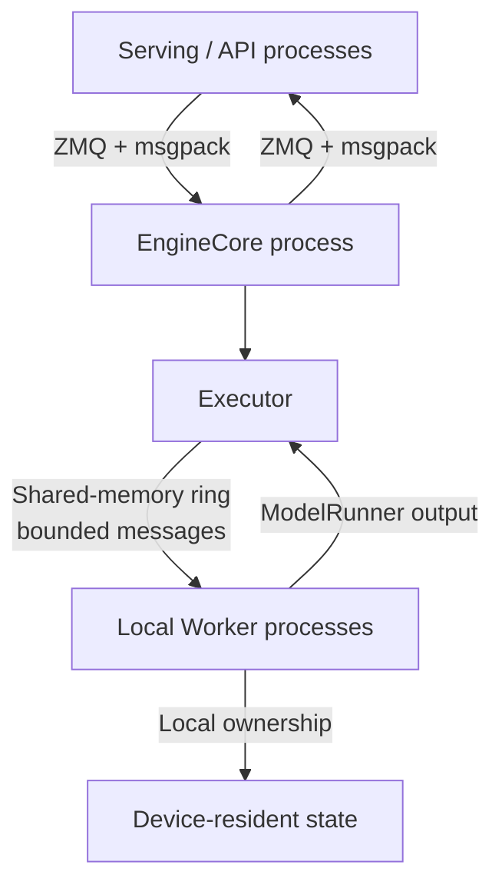
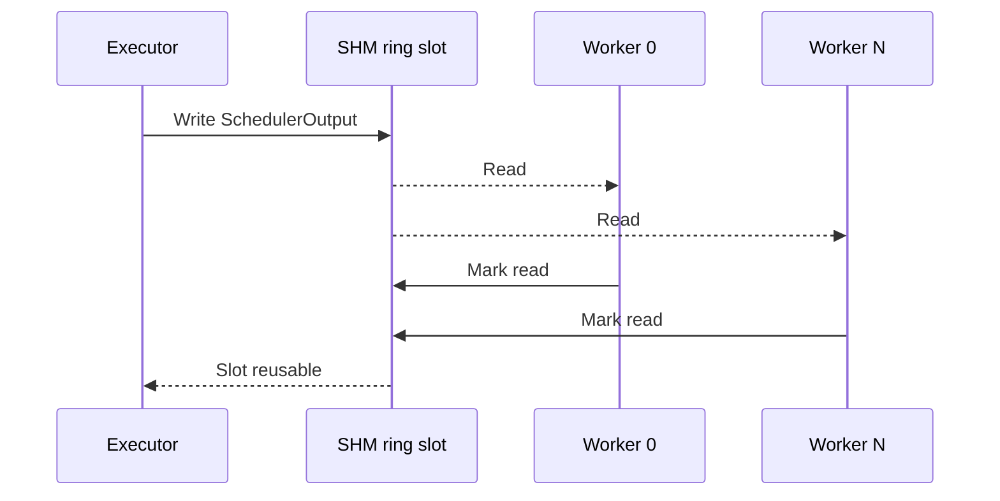
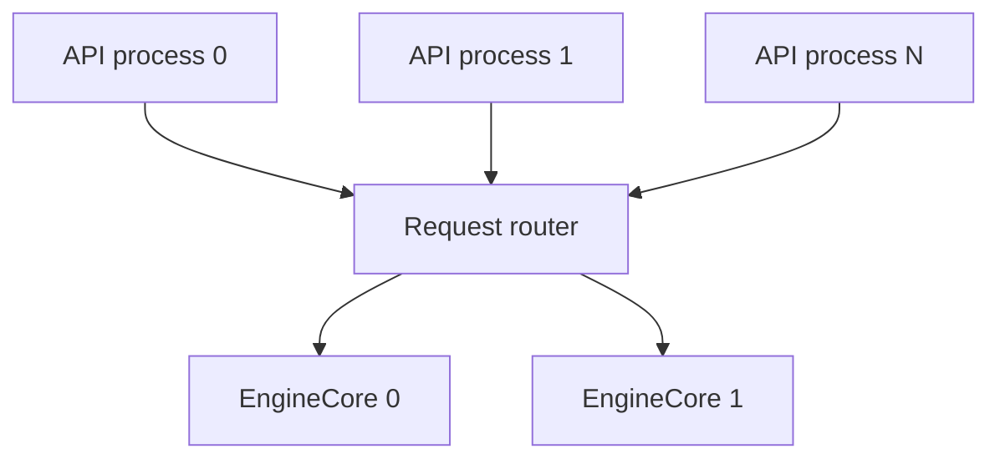
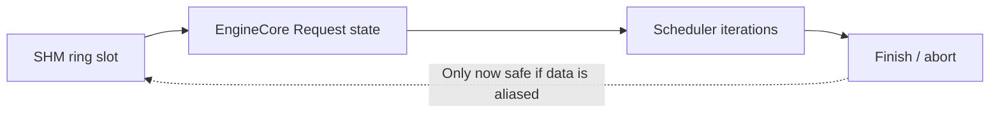
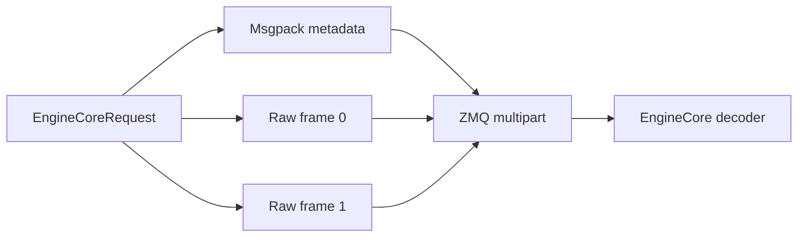
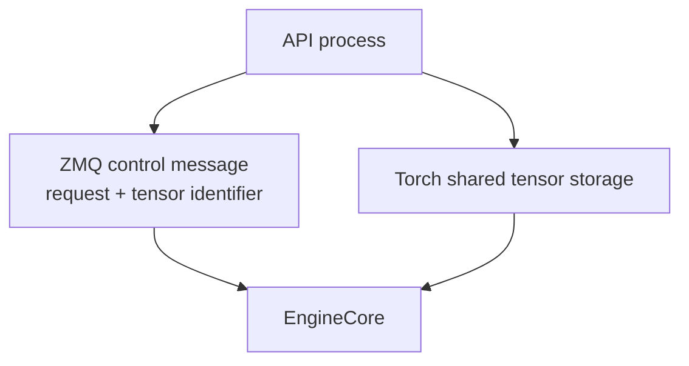
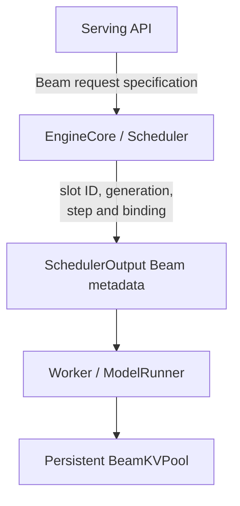

# Why vLLM Does Not Use General-Purpose Process-Shared Memory Between Serving and EngineCore

> **Status:** Architecture analysis  
> **Date:** 2026-08-10  
> **Upstream source snapshot:** `vllm-project/vllm@243c63baf5239f961305e25160c1bf6d34096df4`  
> **Scope:** Process-shared host memory, specifically memory mapped into multiple processes. In this document, ZeroMQ `ipc://`, Unix-domain sockets, TCP, NCCL, and CUDA IPC are not classified as process-shared host memory.  
> **Purpose:** Explain why upstream vLLM uses ZeroMQ and msgpack between the Serving/API process and EngineCore, while using a shared-memory ring for the Executor-to-Worker path, and derive the corresponding design guidance for vllm-gr.

---

## 1. Executive conclusion

Upstream vLLM does use process-shared host memory, but it does so on the path whose communication semantics fit a bounded shared-memory ring:

```text
Executor
    -> one command
    -> a fixed set of local Worker processes
    -> all readers consume the command within the current execution round
```

It does not use the same mechanism as the general transport between Serving/API processes and EngineCore:

```text
one or more API processes
    -> asynchronously routed requests
    -> one or more EngineCore processes
    -> requests remain alive across many scheduling and decode iterations
```

The reason is architectural rather than accidental:

1. The Serving-to-EngineCore path is multi-producer, asynchronously routed, and potentially cross-node.
2. An `EngineCoreRequest` is converted into long-lived EngineCore/Scheduler state, while a shared-memory ring slot is intended to be short-lived and quickly reusable.
3. Most ordinary request payloads are control-plane objects rather than very large contiguous buffers.
4. Shared memory does not directly share Python object graphs. Serialization and reconstruction are still required.
5. A shared-memory transport would need its own routing, flow control, crash recovery, ownership, reclamation, and local/remote fallback protocols.
6. ZeroMQ provides these properties with one protocol for local and remote deployment.
7. Large contiguous tensors are handled separately through out-of-band frames or the optional `torch_shm` tensor path.
8. Persistent large state, such as KV cache and model weights, is allocated and retained in Worker processes rather than transferred per request.

Therefore, the upstream strategy is:

```text
Route control-plane requests through ZeroMQ.
Use shared memory for bounded, short-lived, one-writer-to-fixed-readers messages.
Keep persistent large state where it is consumed.
Create a separate data plane only for genuinely large contiguous payloads.
```

---

## 2. Transport boundaries in vLLM

The relevant process topology is:



These boundaries deliberately use different transports.

| Boundary | Communication semantics | Upstream mechanism |
| --- | --- | --- |
| Serving/API to EngineCore | Asynchronous request routing | ZMQ ROUTER/DEALER + msgpack |
| EngineCore to Serving/API | Asynchronous routed output | ZMQ PUSH/PULL + msgpack |
| Executor to local Workers | One writer, fixed readers, per-round broadcast | Shared-memory ring |
| Executor to remote Workers | Cross-node broadcast | ZMQ/TCP |
| Worker-to-Worker tensor communication | Device data plane | torch.distributed/NCCL or device-specific collectives |
| Large multimodal tensor input | Optional out-of-band tensor path | Direct RPC frames or `torch_shm` |
| Persistent KV and graph buffers | Worker-owned state | Preallocated in each Worker |

The use of shared memory is therefore determined by ownership and lifetime, not only by payload size.

---

## 3. Why the Executor-to-Worker path fits shared memory

The vLLM multiprocessing executor creates a `MessageQueue` backed by a `ShmRingBuffer` for local readers. The Executor serializes a collective RPC message:

```python
(method, args, kwargs, output_rank)
```

The most important hot-path example is:

```python
execute_model(scheduler_output)
```

All local Workers consume the same execution command. The communication pattern has several useful invariants:

- there is one logical writer;
- the reader set is known during initialization;
- all readers process messages in the same order;
- a message is normally consumed within one execution round;
- a reader can mark a slot as completed immediately after deserialization;
- the ring can use a fixed number of preallocated chunks;
- the writer can safely reuse a chunk after every reader has marked it read.



This is an excellent match for a bounded broadcast ring.

The queue also maintains an overflow path. If a serialized message does not fit in the configured ring chunk, the writer marks the ring entry as overflow and sends the multipart payload through ZMQ. Remote readers always use ZMQ/TCP.

The shared-memory ring is therefore an optimization for the common bounded case, not an unbounded object store.

---

## 4. Why the Serving-to-EngineCore path does not fit the same ring

### 4.1 The topology is multi-producer and routed

A serving deployment may have:

- multiple API server processes;
- multiple EngineCore processes for data parallelism;
- internal, external, or hybrid load balancing;
- local and remote EngineCore processes;
- elastic replacement of an EngineCore identity.

The logical topology is closer to:



The current shared-memory `MessageQueue` is not a multi-producer request router. Reusing it would require either:

1. one shared-memory ring per API process and an EngineCore poller over all rings; or
2. a new multi-producer shared-memory allocator and queue protocol.

The first option scales shared-memory allocation and polling cost with the number of API processes. The second requires atomic slot allocation, ordering, generation protection, producer crash recovery, backpressure, and request routing.

ZeroMQ already provides identities, routing, asynchronous queues, socket readiness, connection replacement, and local/remote transports.

### 4.2 Requests have a long logical lifetime

A `SchedulerOutput` is short-lived:

```text
produce
    -> execute one model round
    -> consume
    -> release the ring slot
```

An `EngineCoreRequest` is different:

```text
receive
    -> preprocess
    -> create internal Request
    -> wait in Scheduler
    -> run prefill
    -> run multiple decode iterations
    -> finish, abort, or fail
```

If the internal Request directly referenced a shared-memory ring slot, that slot could not be safely reused until every referenced field had been copied or the request had finished. A slow or long-running request could pin a slot for many scheduling iterations.



That lifetime is incompatible with a small, rapidly recycled ring.

The alternative is to copy all required data from the ring into EngineCore-owned objects during preprocessing. In that case, the data path becomes:

```text
Serving object
    -> serialize/copy into shared memory
    -> deserialize/copy into EngineCore-owned state
```

Shared memory would replace the socket transport but would not eliminate the ownership transfer or object reconstruction.

### 4.3 Shared memory does not share Python object graphs

An ordinary request includes structures such as:

- request identifiers;
- token ID lists;
- sampling parameters;
- structured-output configuration;
- LoRA metadata;
- multimodal metadata;
- KV-transfer metadata;
- nested dataclasses, lists, dictionaries, and optional fields.

A Python `list[int]`, dataclass, or dictionary cannot be consumed by another process merely because both processes map the same byte range. The producer still has to encode the object, and the consumer still has to decode or reconstruct it.

For example, a 10,000-token prompt represented as raw `int32` is approximately:

```text
10,000 * 4 bytes = 40,000 bytes
```

The real msgpack representation includes object metadata, but it is still generally a control-plane message rather than a model-scale buffer.

For this workload, the main question is not whether the transport can map bytes into both processes. The main question is whether the receiver can safely retain the original representation without rebuilding long-lived EngineCore state. Usually it cannot.

---

## 5. The current ZMQ path is not naive serialization

The Serving-to-EngineCore path does not serialize every tensor into one large byte string.

vLLM's msgpack encoder uses a multipart representation:

- ordinary metadata is encoded into the main msgpack frame;
- small CPU tensors and arrays can be inlined;
- larger tensors and arrays are emitted as separate backing-buffer frames;
- the request records dtype, shape, and frame index;
- ZMQ sends multipart frames with `copy=False`;
- the receiver can construct NumPy or Torch views from received frames where lifetime rules permit.



This avoids copying every large tensor into and out of the main msgpack payload.

However, `copy=False` should not be confused with process-shared memory. It avoids some user-space and serialization copies, but a local ZMQ `ipc://` transport remains a socket transport.

The design benefit is that the serialization protocol remains the same for local IPC and TCP deployment.

---

## 6. Local and remote deployment use one protocol

vLLM selects the EngineCore transport address according to placement:

```python
if client_local_only:
    return get_open_zmq_ipc_path()
return get_tcp_uri(host, port)
```

Thus:

- colocated Serving and EngineCore processes use local ZMQ IPC;
- non-colocated processes use ZMQ TCP;
- the request and output protocol remains unchanged.

A process-shared-memory design would necessarily need a second transport for remote EngineCore processes. It would also need a negotiation layer deciding whether a request contains:

- inline serialized data;
- a local shared-memory descriptor;
- a remote payload;
- a fallback copy after a shared-memory allocation failure.

Maintaining one routing and serialization protocol is operationally simpler and reduces divergence between single-node and distributed serving.

---

## 7. Failure isolation and resource reclamation

A shared-memory transport introduces ownership questions that do not exist in the same form for a socket message:

- Which process creates and unlinks the segment?
- What happens if a producer dies after reserving a slot but before publishing?
- What happens if EngineCore dies while holding references?
- How is a slot reclaimed after a consumer restart?
- How are stale descriptors distinguished from a newly reused slot?
- How is memory usage bounded across multiple API processes?
- How is a slow consumer prevented from blocking unrelated producers?

A robust design needs at least:

- generation counters;
- producer and consumer liveness detection;
- reference or acknowledgement tracking;
- orphan reclamation;
- timeout and cancellation handling;
- bounded allocation;
- local/remote fallback.

The Executor-to-Worker shared-memory ring can solve a smaller problem because the processes have a fixed parent/child relationship and a known reader set. Serving-to-EngineCore has a more dynamic topology and stronger fault-isolation requirements.

---

## 8. Large data is separated from the ordinary request path

Large contiguous payloads are where process-shared memory can provide a material benefit.

The current multimodal configuration supports:

```text
direct_rpc
    Large tensor is represented as an out-of-band RPC frame.

torch_shm
    Tensor storage is shared through torch.multiprocessing.
    The msgpack request carries a lightweight tensor identifier.
```

The `torch_shm` path uses sender, message, and tensor identifiers to associate tensors arriving through the tensor queue with the corresponding request.



This is a control-plane/data-plane split:

- ZMQ retains routing, compatibility, and failure handling;
- shared tensor storage is used only for the payload that benefits from it.

This is preferable to forcing all request fields through a shared-memory object protocol.

---

## 9. Why persistent large buffers are not transferred

The strongest optimization is to avoid transmission.

### 9.1 KV cache

KV cache is allocated in Worker processes and remains device-resident. EngineCore and Scheduler send logical block IDs, slot mappings, and scheduling metadata. They do not send the KV contents through the Serving or Executor transports.

### 9.2 Model weights

Each Worker loads or owns the weight shard it executes. Standard serving does not load the entire model in EngineCore and redistribute it as a request payload.

### 9.3 Graph buffers and workspaces

CUDA Graph or other graph-execution buffers are allocated in the execution process with stable addresses. A control message selects the appropriate buffer or graph instance; it does not transport the workspace contents.

This yields the general invariant:

```text
Large persistent execution state stays in the process and device that consumes it.
Cross-process messages carry ownership, index, shape, and scheduling metadata.
```

---

## 10. Why large messages overflow from the Worker shared-memory ring

Even where vLLM uses a shared-memory ring, it does not make the ring unbounded.

When a serialized local Worker message exceeds the configured chunk size:

1. the ring slot is marked as overflow;
2. the payload is sent through a local ZMQ multipart socket;
3. out-of-band buffers still avoid unnecessary pickle copies.

This prevents rare large messages from forcing every queue to reserve very large shared-memory chunks.

An unbounded or dynamically resized ring would introduce:

- unpredictable `/dev/shm` consumption;
- long writer stalls while readers consume a large slot;
- allocator and remapping complexity;
- larger fixed memory cost for every queue;
- head-of-line blocking caused by one exceptional message.

The ring is designed for frequent, bounded execution messages. It is not a general large-object store.

---

## 11. Decision matrix

| Data or state | Expected lifetime | Recommended transport/ownership |
| --- | --- | --- |
| Request ID, sampling configuration, token IDs | Request admission/control | ZMQ + msgpack |
| Large contiguous multimodal tensor | Until EngineCore/Worker ingestion | Optional out-of-band shared tensor data plane |
| Per-step `SchedulerOutput` | One execution round | Local shared-memory ring |
| Oversized exceptional Worker RPC | One execution round | ZMQ multipart overflow |
| KV cache | Request/session lifetime | Preallocated Worker-owned device pool |
| BeamKV | Beam session lifetime | Preallocated Worker-owned device pool |
| Graph workspace | Worker lifetime | Worker-owned stable-address allocation |
| Tensor-parallel activations | One model operation | Device collective |
| Cross-instance KV | Transfer session | Dedicated KV connector |

---

## 12. Implications for vllm-gr

vllm-gr should preserve the upstream separation between the request-control path and execution-state ownership.

### 12.1 Do not move BeamKV through Serving-to-EngineCore shared memory

BeamKV is large, device-resident, and active across multiple decode steps. Moving it through process-shared host memory would add synchronization and host copies while breaking fixed-address graph assumptions.

The preferred ownership is:



EngineCore should transfer only metadata such as:

- session ID;
- Beam slot ID;
- slot generation;
- current decode step;
- active Beam width;
- parent Beam mapping;
- graph execution signature;
- completion and release state.

The physical BeamKV tensor remains in the Worker.

### 12.2 Keep the current control path unless evidence shows a bottleneck

For the vllm-gr target workload, prompt lengths may be in the 1K-10K range. Token IDs at this scale are still much smaller than KV, weights, and execution buffers.

Replacing the complete ZMQ control plane with shared memory would add substantial architecture and failure-handling complexity. It should not be justified solely by prompt length.

The decision should be based on measured evidence:

- request serialization CPU time;
- API-to-EngineCore queueing latency;
- payload-size distribution;
- percentage of time in msgpack encoding/decoding;
- request rate and number of API processes;
- local versus remote EngineCore deployment.

### 12.3 If a future payload requires shared memory, add a separate data plane

If vllm-gr later introduces a genuinely large contiguous host buffer, use an out-of-band shared-memory pool rather than replacing the request transport.

A suitable descriptor would contain:

```python
@dataclass(frozen=True)
class SharedBufferDescriptor:
    pool_id: str
    offset: int
    nbytes: int
    dtype: str
    shape: tuple[int, ...]
    generation: int
```

The request remains routed through ZMQ:

```text
ZMQ request:
    request metadata + SharedBufferDescriptor

Shared data plane:
    preallocated shared-memory pool
```

Required invariants include:

- the producer cannot reuse a region before EngineCore acknowledges ingestion;
- generation prevents stale descriptor reuse;
- capacity is bounded at startup;
- producer failure cannot permanently leak regions;
- EngineCore copies or transfers data into its final owner before releasing the region;
- remote EngineCore has an explicit fallback path.

This design follows upstream vLLM's tensor IPC direction without turning the entire request protocol into a shared-memory object system.

---

## 13. Final architectural position

The absence of a general-purpose shared-memory transport between Serving and EngineCore is a deliberate consequence of the boundary's semantics.

```text
Serving -> EngineCore
    asynchronous
    routed
    multi-producer
    potentially remote
    long-lived request state
    => ZMQ control plane

Executor -> local Workers
    one writer
    fixed reader set
    ordered broadcast
    short-lived per-round messages
    => shared-memory ring

Large persistent execution state
    long-lived
    device-resident
    stable-address sensitive
    => allocate and retain in Worker
```

For vllm-gr, the correct default is therefore:

1. retain the upstream Serving-to-EngineCore control transport;
2. transfer only Beam scheduling and ownership metadata;
3. keep BeamKV, graph workspace, and device buffers Worker-local;
4. introduce an out-of-band shared-memory data plane only for a measured large contiguous host payload;
5. do not use shared memory as a substitute for clear state ownership.

---

## 14. Upstream source references

- [EngineCore client ZMQ transport](https://github.com/vllm-project/vllm/blob/243c63baf5239f961305e25160c1bf6d34096df4/vllm/v1/engine/core_client.py)
- [EngineCore input and output socket processing](https://github.com/vllm-project/vllm/blob/243c63baf5239f961305e25160c1bf6d34096df4/vllm/v1/engine/core.py)
- [EngineCore address selection](https://github.com/vllm-project/vllm/blob/243c63baf5239f961305e25160c1bf6d34096df4/vllm/v1/engine/utils.py)
- [Msgpack tensor and ndarray serialization](https://github.com/vllm-project/vllm/blob/243c63baf5239f961305e25160c1bf6d34096df4/vllm/v1/serial_utils.py)
- [Multiprocessing Executor RPC path](https://github.com/vllm-project/vllm/blob/243c63baf5239f961305e25160c1bf6d34096df4/vllm/v1/executor/multiproc_executor.py)
- [Shared-memory broadcast ring and overflow transport](https://github.com/vllm-project/vllm/blob/243c63baf5239f961305e25160c1bf6d34096df4/vllm/distributed/device_communicators/shm_broadcast.py)
- [Optional tensor shared-memory transport](https://github.com/vllm-project/vllm/blob/243c63baf5239f961305e25160c1bf6d34096df4/vllm/v1/engine/tensor_ipc.py)
