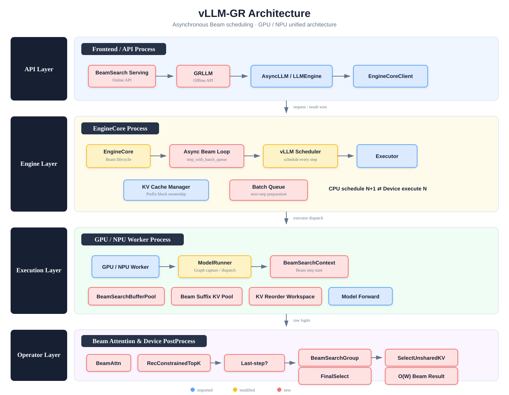

# vLLM-GR Architecture

## Scope

This diagram describes the target vLLM-GR architecture using asynchronous Beam scheduling:

- `EngineCore` owns the Beam request lifecycle and the multi-step asynchronous loop.
- The vLLM scheduler remains in the execution path for every decode step.
- The batch queue overlaps CPU scheduling for step *N+1* with device execution for step *N*.
- `ModelRunner` owns graph capture/dispatch and Worker-side Beam runtime state.
- Beam suffix KV, reorder workspace, and device post-processing remain inside the Worker process.
- Non-final steps run `BeamSearchGroup → SelectUnsharedKV`; the final step runs `BeamSearchRecFinalSelect`.

## Legend

- **Blue — imported:** reused from upstream vLLM.
- **Yellow — modified:** upstream vLLM component patched or extended by vLLM-GR.
- **Red — new:** component introduced by vLLM-GR.

## Process boundaries

1. **Frontend / API process:** online and offline entry points, `AsyncLLM`/`LLMEngine`, and `EngineCoreClient`.
2. **EngineCore process:** lifecycle management, asynchronous Beam loop, per-step scheduling, Prefix KV block ownership, and executor dispatch.
3. **GPU / NPU Worker process:** `ModelRunner`, `BeamSearchContext`, device buffers, model forward, graph dispatch, and Beam post-processing.
