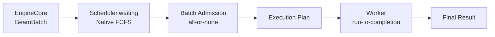
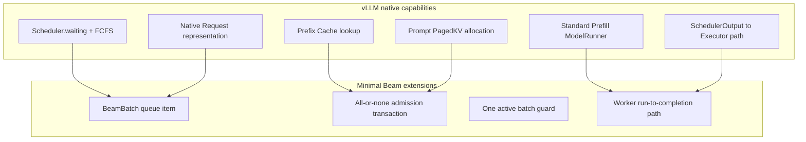
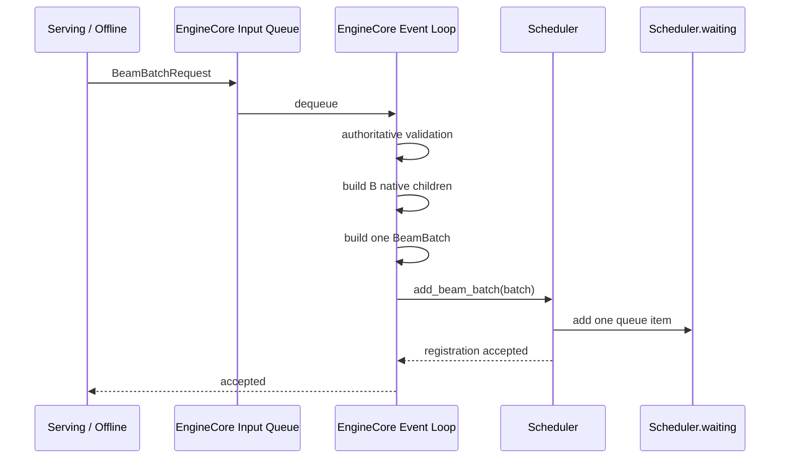
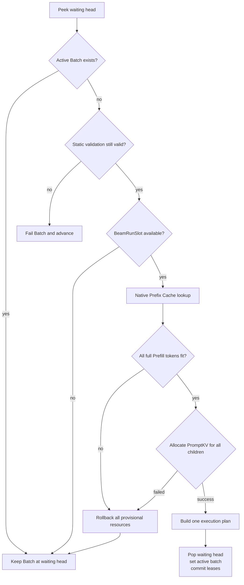
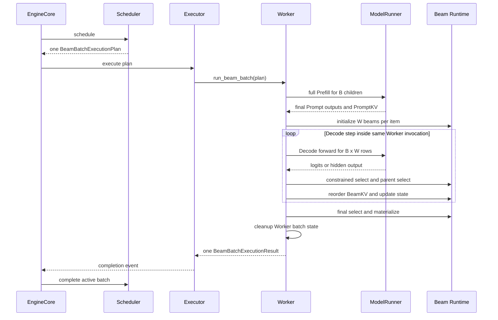
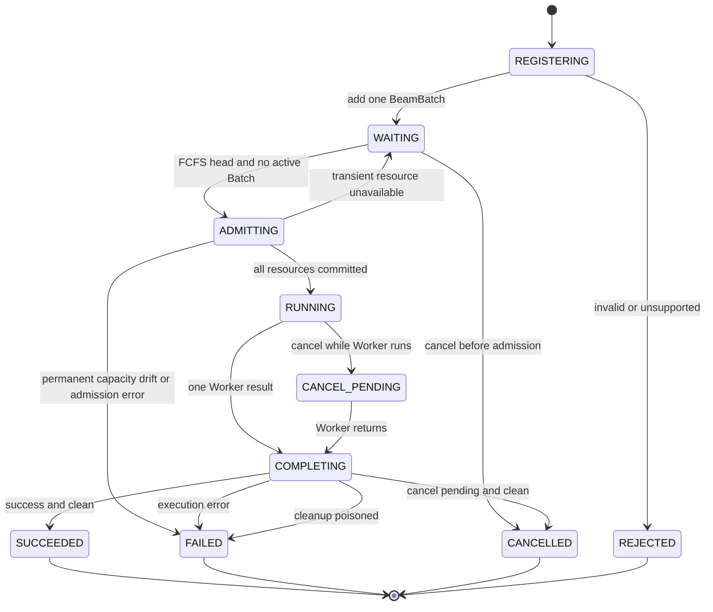
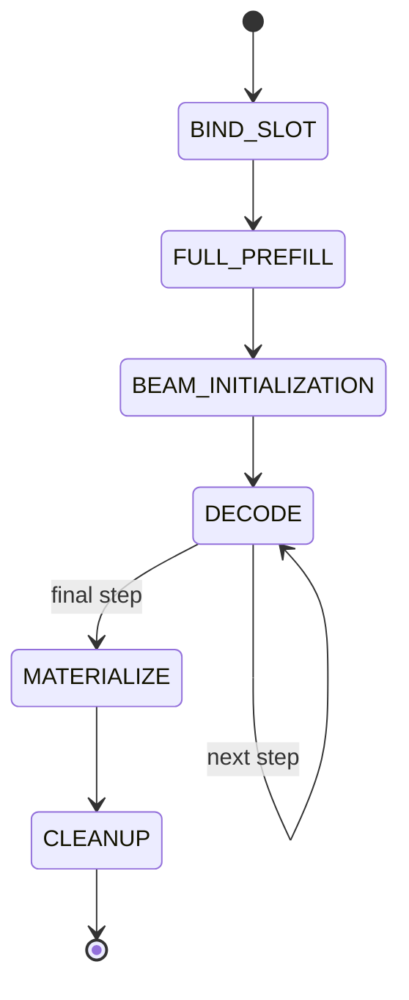
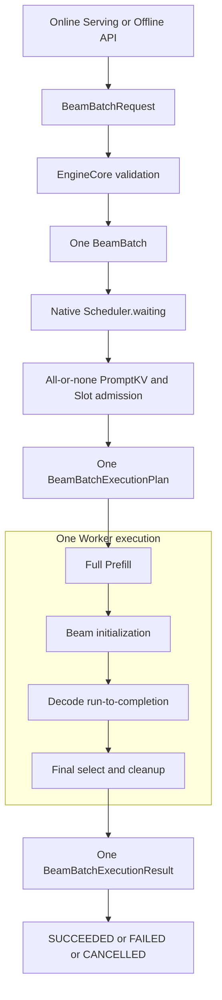

# Beam Batch：EngineCore 到 Scheduler 的原生 FCFS 与 Worker 一次执行设计

> 状态：Design / 当前冻结方案  
> 日期：2026-08-21  
> 上游入口设计：[Serving / Offline 到 EngineCore 的 Beam Batch 入口设计](./serving_to_enginecore_batch_beam_entry_design.md)  
> 关联 RFC：[vllm-gr Issue #35](https://github.com/zhanghanleo10/vllm-gr/issues/35)  
> 范围：从 EngineCore 收到 `BeamBatchRequest` 开始，到 Scheduler 完成整批准入、Worker 完成一次完整执行并返回最终结果。

---

## 0. 一页结论

当前版本不实现独立的 Beam FIFO、Prefill Barrier 或 Scheduler 多轮调度。

方案收敛为：

```text
一个 BeamBatchRequest
    ↓
EngineCore 构造一个 BeamBatch
    ↓
BeamBatch 作为一个排队项进入 vLLM Scheduler.waiting
    ↓
按 Batch FCFS 排队
    ↓
整批一次性准入
    ↓
Worker 一次执行：
Full Prefill → Beam 初始化 → Decode Loop → Final Result
```



冻结结论：

1. 一个业务 `BeamBatchRequest` 对应一个 Scheduler 排队项 `BeamBatch`。
2. Scheduler 复用 vLLM 原生 `waiting` 和 FCFS 顺序，不新增 Beam FIFO。
3. 不配置 Beam 专用 waiting depth。
4. 当前专用 Engine 中不存在普通 Request 与 Beam Batch 混合调度。
5. 一个 `BeamBatch` 内包含 B 个 native child `Request`，但 child 不能分别进入 `waiting`。
6. B 个 native child 只用于标准 Prefill、Prefix Cache 和 Prompt PagedKV。
7. `enable_chunked_prefill=False`，每个 Prompt 必须完整执行。
8. 关闭 chunked Prefill 不能自动保证整批原子性，因此仍需一层很薄的 Batch all-or-none admission。
9. Scheduler 同时只允许一个 Active Beam Batch。
10. 同一 Batch 只产生一个 Worker execution plan。
11. Worker 在一次调用中完成完整 Prefill、Beam 初始化和所有 Decode step。
12. Scheduler 不维护 Prefill 或 Decode 的逐轮状态。
13. 不存在 `BeamPrefillReady`、Prefill Barrier、per-step result 或 continuation。
14. 不支持 Decode micro-batch；`B × W` 必须一次容纳。
15. Worker 只返回一次成功或失败结果。
16. 当前方案不支持 Active Batch preemption、单 child cancel、动态 Beam width 或 DP migration。
17. EngineCore 不自动重试失败 Batch。
18. 在线过载保护如有需要，应放在 Serving admission 层，而不是重新增加 Scheduler 私有 FIFO。

---

## 1. 目标与边界

当前版本只解决三件事：

```text
1. 按 Beam Batch 排队
2. 按 Beam Batch 整批准入
3. 按 Beam Batch 一次执行
```

成功标准：

- 一个 Batch 不会只有部分 child 完成 Prefill；
- Batch 排队顺序符合 FCFS；
- Worker 开始执行后不再回到 Scheduler 请求下一步；
- PromptKV 和 BeamRunSlot 不发生部分占用或提前释放；
- 成功、失败和取消都只有一个 Batch 级终态；
- 不复制一套与 vLLM 原生 Scheduler 重叠的等待队列。

本文不展开：

- Online HTTP schema；
- Offline 结果保序；
- Beam 选择 kernel；
- BeamKV 内部 layout；
- CUDA/ACL Graph 捕获实现；
- 约束资源文件格式。

---

## 2. 当前适用约束

| 约束 | 当前值 |
| --- | --- |
| 调度业务 | 仅 Beam Batch |
| 普通 Request 混合 | 不支持 |
| Scheduler 策略 | FCFS |
| chunked Prefill | 关闭 |
| Active Batch 数量 | 1 |
| Prefill micro-batch | 不支持 |
| Decode micro-batch | 不支持 |
| Decode 调度位置 | Worker 内 |
| Worker 返回次数 | 1 |
| 动态 Beam width | 不支持 |
| Active Batch preemption | 不支持 |
| Scheduler 自动重试 | 不支持 |

这些约束使复杂的 Prefill Barrier、Ready 汇聚和 Scheduler Decode 循环没有存在必要。

---

## 3. 与 vLLM 原生 Scheduler 的关系

### 3.1 直接复用的能力



直接复用：

- `Scheduler.waiting`；
- FCFS 排队语义；
- native `Request`；
- Prefix Cache；
- Prompt PagedKV；
- 标准 Prefill 输入构造；
- SchedulerOutput 到 Executor 的交付路径。

新增：

- 一个 Batch 级 Scheduler queue item；
- Batch all-or-none 资源准入；
- 一个 Active Batch 限制；
- Worker 内 Beam 初始化和 Decode loop；
- 一个 Batch 级执行结果。

### 3.2 原生语义不足之处

原生 Scheduler 的原子单位是单个 `Request`：

```text
Request 0 可以调度
Request 1 可以调度
Request 2 放不下
```

如果把 B 个 child 分别加入原生队列，会出现：

```text
一个业务 Batch
  ├─ child 0 已准入
  ├─ child 1 已准入
  └─ child 2 仍在 waiting
```

这不满足 Beam Batch 的完整 Prefill 要求。

禁止：

```python
for child in batch.children:
    scheduler.add_request(child)
```

正确方式：

```python
scheduler.add_beam_batch(batch)
```

### 3.3 关闭 chunked Prefill 能解决什么

```text
enable_chunked_prefill = False
```

保证：

```text
单个 child：
    完整 Prompt 执行
    或本轮完全不执行
```

不保证：

```text
整个 Batch：
    B 个 child 全部执行
    或全部不执行
```

因此当前语义来自：

```text
关闭 chunked Prefill
        +
Batch all-or-none admission
        =
完整 Beam Batch Prefill
```

---

## 4. 核心数据模型

### 4.1 上游请求

Serving 和 Offline 入口统一向 EngineCore 提交：

```python
@dataclass(frozen=True, slots=True)
class BeamBatchRequest:
    protocol_version: int
    beam_batch_id: str
    children: tuple[BeamChildRequest, ...]
    execution: BeamExecutionParameters
    result_options: BeamResultOptions
```

上游入口层已经完成：

- schema 解码；
- tokenize 和通用输入准备；
- child identity 生成；
- Batch 参数冻结。

### 4.2 EngineCore 构造的 Scheduler 对象

```python
@dataclass(frozen=True, slots=True)
class BeamCapacityEnvelope:
    batch_size: int
    beam_width: int
    max_decode_steps: int
    logical_decode_rows: int
    graph_gear: int


@dataclass(frozen=True, slots=True)
class BeamBatch:
    beam_batch_id: str
    arrival_time: float

    children: tuple[Request, ...]
    execution: BeamExecutionParameters
    result_options: BeamResultOptions

    capacity: BeamCapacityEnvelope
```

不变量：

```python
batch.capacity.batch_size == len(batch.children)

batch.capacity.logical_decode_rows == (
    batch.capacity.batch_size
    * batch.capacity.beam_width
)
```

B 个 child 的作用仅限于：

```text
native Request
→ Prefix Cache
→ Prompt block allocation
→ Standard Prefill input
→ Prompt PagedKV
```

W 路 Beam row 不创建为 native `Request`：

```text
B native Requests
        ↓ Beam initialization
B × W Worker Beam rows
```

### 4.3 Registry

允许维护：

```python
beam_batches: dict[str, BeamBatch]
```

Registry 只负责：

- Batch 查找；
- Cancel 定位；
- Result 校验；
- 生命周期状态。

Registry 不承担排队顺序。唯一排队顺序由：

```python
scheduler.waiting
```

决定。

---

## 5. EngineCore 注册到 Scheduler

### 5.1 单写边界

EngineCore event loop 是 Scheduler 状态的唯一写者。



Input/socket thread 可以进行纯解析，但不能直接修改：

- `Scheduler.waiting`；
- Batch registry；
- Active Batch；
- PromptKV lease；
- BeamRunSlot lease。

### 5.2 注册伪代码

```python
def register_beam_batch(
    request: BeamBatchRequest,
) -> BeamRegistrationResult:
    validate_batch_identity(request)
    validate_request_schema(request)

    children = build_native_children(request)
    batch = build_beam_batch(request, children)

    validate_static_capacity(batch)

    try:
        scheduler.add_beam_batch(batch)
    except Exception as exc:
        return BeamRegistrationResult.rejected(
            beam_batch_id=request.beam_batch_id,
            error=exc,
        )

    return BeamRegistrationResult.accepted(
        beam_batch_id=request.beam_batch_id,
    )
```

Scheduler：

```python
def add_beam_batch(self, batch: BeamBatch) -> None:
    if batch.beam_batch_id in self.beam_batches:
        raise DuplicateBeamBatch(batch.beam_batch_id)

    self.beam_batches[batch.beam_batch_id] = batch

    try:
        self.waiting.add_request(batch)
    except Exception:
        self.beam_batches.pop(batch.beam_batch_id, None)
        raise
```

注册成功只表示：

```text
BeamBatch 已进入 waiting
```

不表示：

- PromptKV 已分配；
- BeamRunSlot 已占用；
- Worker 已开始；
- Batch 已完成 Prefill。

---

## 6. Scheduler 排队模型

### 6.1 复用原生 `waiting`

Scheduler 只保留一条权威等待队列：

```python
scheduler.waiting
```

每一个排队项都是完整 `BeamBatch`：

```text
waiting
  ├─ BeamBatch A
  ├─ BeamBatch B
  └─ BeamBatch C
```

不是：

```text
waiting
  ├─ A.child-0
  ├─ A.child-1
  ├─ B.child-0
  └─ ...
```

### 6.2 不新增独立 FIFO

删除：

```python
beam_waiting_fifo
max_waiting_beam_groups
max_prefetched_beam_groups
```

不维护：

```text
native waiting
    +
beam waiting
```

这样的双队列。

### 6.3 Batch 级 FCFS

```text
Batch A 到达
Batch B 到达
Batch C 到达

执行顺序：
A → B → C
```

Batch 内 child 没有独立 FCFS 顺序。

当前不支持：

- Priority Scheduler；
- 后到的小 Batch 绕过队首；
- 按 Prompt 长度重排；
- 按 Beam width 重排；
- 队首资源不足时跳过队首。

### 6.4 一个 Active Batch

```text
active_batch = A
waiting      = [B, C, D]
```

当 Active Batch 非空时：

```python
def schedule_beam_batch(self) -> SchedulerOutput:
    if self.active_beam_batch is not None:
        return SchedulerOutput.empty()
```

当前执行顺序：

```text
A run-to-completion
→ A cleanup
→ B admission
→ B run-to-completion
```

Waiting Batch 不提前申请：

- PromptKV；
- BeamRunSlot；
- BeamKV；
- Decode workspace；
- Graph runtime ownership。

### 6.5 无 Beam 专用队列深度

Scheduler 不提供 Beam 专用：

- queue full；
- waiting depth；
- 429；
- 预取一个 Batch。

如果在线服务需要有界过载保护，应在 Serving admission 层基于：

- in-flight Batch 数；
- EngineCore input backlog；
- SLA；
- Host memory budget；

实现统一背压。

Offline 可以继续使用上层 submission window 控制 outstanding Batch 数。

---

## 7. 注册前静态可执行性检查

永久无法执行的 Batch 不能进入 FCFS 队首，否则会永久阻塞后续 Batch。

### 7.1 Prefill 容量

MVP 按无 Prefix Cache 命中的保守情况验证：

```python
len(batch.children) <= scheduler_config.max_num_seqs

sum(
    child.num_prompt_tokens
    for child in batch.children
) <= scheduler_config.max_num_batched_tokens
```

Prefix Cache 命中可以减少实际计算，但不能成为 Batch 可执行的必要条件。

### 7.2 模型长度

```python
all(
    child.num_prompt_tokens
    + batch.capacity.max_decode_steps
    <= model_config.max_model_len
    for child in batch.children
)
```

### 7.3 Decode 容量

```python
logical_rows = (
    batch.capacity.batch_size
    * batch.capacity.beam_width
)

logical_rows <= beam_runtime_config.max_decode_rows
```

必须存在支持该形状的 Decode gear：

```python
gear = select_supported_graph_gear(logical_rows)

if gear is None:
    raise UnsupportedBeamShape(logical_rows)
```

### 7.4 PromptKV 理论容量

即使当前空闲 KV 不足，也必须保证该 Batch 在空载 Worker 上理论可执行：

```python
required_prompt_blocks(batch) <= (
    kv_cache_manager.total_allocatable_blocks
)
```

### 7.5 BeamRunSlot 容量

Warmup 已创建的 Slot 必须支持：

```text
batch size
beam width
decode steps
logical rows
graph gear
BeamKV capacity
workspace capacity
```

注册阶段只验证容量，不占用 Slot。

---

## 8. 整批原子准入

### 8.1 为什么需要资源事务

对 B 个 child 逐个调用 native KV allocation 时，可能发生：

```text
child 0 分配成功
child 1 分配成功
child 2 分配失败
```

如果没有事务回滚，会留下：

- 部分 PromptKV lease；
- 部分 block refcount；
- 部分 Prefix Cache binding；
- Batch 状态与 KV 状态不一致。

因此准入必须满足：

```text
全部成功 → commit
任一失败 → rollback all
```

### 8.2 Admission transaction

```python
class BeamBatchAdmissionTransaction:
    batch: BeamBatch
    slot_lease: BeamRunSlotLease | None
    child_prompt_leases: list[PromptKVLease]
    committed: bool

    def rollback(self) -> None:
        for lease in reversed(self.child_prompt_leases):
            lease.rollback()

        if self.slot_lease is not None:
            self.slot_lease.rollback()
```

事务记录：

- Prefix Cache 引用增量；
- 新申请的 PromptKV blocks；
- 每个 child 的 computed-token 状态；
- BeamRunSlot generation；
- execution ID；
- 尚未 commit 的 Scheduler 索引。

### 8.3 准入流程



### 8.4 Scheduler 伪代码

```python
def schedule_beam_batch(self) -> SchedulerOutput:
    if self.active_beam_batch is not None:
        return SchedulerOutput.empty()

    if not self.waiting:
        return SchedulerOutput.empty()

    batch = self.waiting.peek_request()

    if not self.is_statically_supported(batch):
        self.waiting.pop_request()
        self.fail_batch(
            batch,
            code="UNSUPPORTED_BATCH_CAPACITY",
        )
        return SchedulerOutput.empty()

    tx = BeamBatchAdmissionTransaction(batch)

    try:
        tx.slot_lease = self.beam_slots.try_reserve(
            batch.capacity,
        )

        if tx.slot_lease is None:
            return SchedulerOutput.empty()

        native_prefill_plans = []

        for child in batch.children:
            prefix = self.kv_cache_manager.get_computed_blocks(
                child
            )

            prefill_plan = self.plan_full_prefill(
                child=child,
                prefix=prefix,
            )

            native_prefill_plans.append(prefill_plan)

        total_new_tokens = sum(
            plan.num_new_tokens
            for plan in native_prefill_plans
        )

        if total_new_tokens > self.max_num_batched_tokens:
            tx.rollback()
            return SchedulerOutput.empty()

        for plan in native_prefill_plans:
            lease = self.kv_cache_manager.allocate_full_prompt(
                plan
            )

            if lease is None:
                tx.rollback()
                return SchedulerOutput.empty()

            tx.child_prompt_leases.append(lease)

        execution_plan = self.build_execution_plan(
            batch=batch,
            native_prefill_plans=native_prefill_plans,
            prompt_leases=tx.child_prompt_leases,
            slot_lease=tx.slot_lease,
        )

        popped = self.waiting.pop_request()
        assert popped.beam_batch_id == batch.beam_batch_id

        self.active_beam_batch = ActiveBeamBatch(
            batch=batch,
            execution_id=execution_plan.execution_id,
            prompt_leases=tuple(tx.child_prompt_leases),
            slot_lease=tx.slot_lease,
        )

        tx.committed = True

        return SchedulerOutput.for_beam_batch(
            execution_plan
        )

    except Exception:
        if not tx.committed:
            tx.rollback()
        raise
```

### 8.5 Prefix Cache full hit

Prefix Cache 命中继续复用 native 逻辑。

Batch 层不能自行假设：

```python
num_new_tokens = prompt_len - cached_tokens
```

应复用 native Scheduler 对最终 Prompt token、输出位置和必要重算的处理。

Batch 层只聚合 native planning 给出的：

```python
plan.num_new_tokens
```

并检查：

```python
sum(plan.num_new_tokens) <= max_num_batched_tokens
```

---

## 9. 一次 Worker Execution Plan

### 9.1 Plan 定义

```python
@dataclass(frozen=True, slots=True)
class NativeChildPrefillPlan:
    request_id: str
    item_index: int
    num_prompt_tokens: int
    num_computed_tokens: int
    num_new_tokens: int
    prompt_kv_binding: PromptKVBinding


@dataclass(frozen=True, slots=True)
class BeamBatchExecutionPlan:
    beam_batch_id: str
    execution_id: str

    children: tuple[NativeChildPrefillPlan, ...]

    slot_lease: BeamRunSlotLease
    beam_width: int
    max_decode_steps: int
    logical_decode_rows: int
    graph_gear: int

    constraint_resource_id: str
    result_options: BeamResultOptions
```

Plan 中没有：

- Prefill chunk cursor；
- Ready mask；
- Barrier generation；
- Decode epoch；
- per-step continuation；
- micro-batch index；
- Scheduler-side Beam scores；
- Scheduler-side parent IDs。

### 9.2 SchedulerOutput

```python
@dataclass
class SchedulerOutput:
    # native fields remain available
    ...

    beam_batch_execution: BeamBatchExecutionPlan | None = None
```

当前专用 Engine 中：

```python
assert not scheduler_output.contains_normal_requests()
assert scheduler_output.beam_batch_execution is not None
```

一个 SchedulerOutput 最多包含一个 Beam Batch execution。

### 9.3 Plan 身份校验

Plan 至少携带：

```text
beam_batch_id
execution_id
slot_id
slot_generation
```

Worker 执行前必须验证：

```python
plan.slot_lease.generation == worker_slot.generation
plan.logical_decode_rows <= worker_slot.capacity
plan.graph_gear in worker_slot.supported_gears
```

过期 Plan 必须 fail closed，不能绑定到已被其他 Batch 复用的 Slot。

---

## 10. Worker 内执行流程

### 10.1 总体执行



### 10.2 Worker 伪代码

```python
def run_beam_batch(
    plan: BeamBatchExecutionPlan,
) -> BeamBatchExecutionResult:
    slot = validate_and_bind_slot(plan.slot_lease)

    try:
        prefill_output = model_runner.execute_full_prefill(
            plan.children
        )

        beam_state = beam_runtime.initialize(
            prompt_output=prefill_output,
            prompt_kv_bindings=tuple(
                child.prompt_kv_binding
                for child in plan.children
            ),
            beam_width=plan.beam_width,
            max_decode_steps=plan.max_decode_steps,
            slot=slot,
        )

        while not beam_state.finished:
            decode_output = model_runner.execute_beam_decode(
                state=beam_state,
                slot=slot,
                physical_rows=plan.graph_gear,
            )

            selection = beam_runtime.select(
                decode_output=decode_output,
                state=beam_state,
            )

            if selection.finished:
                beam_state.finish(selection)
                break

            beam_runtime.reorder_beam_kv(
                parent_ids=selection.parent_ids,
                state=beam_state,
                slot=slot,
            )

            beam_state.advance(selection)

        output = beam_runtime.finalize(
            state=beam_state,
            result_options=plan.result_options,
        )

        cleanup_state = cleanup_worker_batch(
            beam_batch_id=plan.beam_batch_id,
            slot=slot,
        )

        return BeamBatchExecutionResult.success(
            beam_batch_id=plan.beam_batch_id,
            execution_id=plan.execution_id,
            slot_lease=plan.slot_lease,
            output=output,
            cleanup_state=cleanup_state,
        )

    except Exception as exc:
        cleanup_state = try_cleanup_worker_batch(
            beam_batch_id=plan.beam_batch_id,
            slot=slot,
        )

        return BeamBatchExecutionResult.failure(
            beam_batch_id=plan.beam_batch_id,
            execution_id=plan.execution_id,
            slot_lease=plan.slot_lease,
            error=serialize_execution_error(exc),
            cleanup_state=cleanup_state,
        )
```

### 10.3 Prefill 职责

Prefill 复用标准 vLLM 路径：

```text
B native child Requests
→ native input construction
→ native attention metadata
→ native Prompt PagedKV writes
→ final Prompt output
```

Native child 不负责：

- W 路 Beam lineage；
- Beam scores；
- Beam suffix KV；
- Decode step continuation；
- 最终 Beam 排序。

### 10.4 Beam 初始化

完整 Prefill 成功后，Worker 使用每个 child 的最终 Prompt 输出初始化 W 路 Beam：

```text
one Prompt history
        ↓
select initial W candidates
        ↓
W Beam tokens + scores + constraint states
```

这一转换发生在 Worker 内，不产生 EngineCore 事件。

### 10.5 Decode loop

每一步都在同一次 Worker 调用中：

```text
Decode forward
→ 写入当前 Beam suffix KV
→ 约束过滤
→ 选择 next token 与 parent
→ 非终态时按 parent 重排已写入的 BeamKV
→ 更新 sequence / score / constraint state
→ 下一次 Decode forward
```

最后一步不再为下一步准备 continuation，只执行最终选择和结果物化。

### 10.6 无跨层 Prefill Barrier

阶段依赖只存在于 Worker 内：

```text
Full Prefill 成功
        ↓
Beam 初始化
        ↓
Decode
```

如果使用同一 device stream，stream 顺序保证依赖。

如果内部使用多个 stream，通过 Worker 内 CUDA/NPU event 建立依赖。

不需要：

- EngineCore Ready 汇聚；
- Scheduler Ready 状态；
- `BeamPrefillReady`；
- 跨层 Barrier Ack；
- `cudaDeviceSynchronize()` 作为协议。

---

## 11. Worker 返回协议

```python
class BeamCleanupState(str, Enum):
    CLEAN = "clean"
    POISONED = "poisoned"


@dataclass(frozen=True, slots=True)
class BeamBatchExecutionResult:
    beam_batch_id: str
    execution_id: str
    slot_id: int
    slot_generation: int

    succeeded: bool
    output: BeamBatchOutput | None
    error: BeamExecutionError | None

    cleanup_state: BeamCleanupState
    metrics: BeamExecutionMetrics
```

Worker 只返回一次：

```text
SUCCESS + final output
或
FAILURE + error
```

不返回：

- Prefill Ready；
- 每步 logits；
- 每步 W × K candidates；
- parent history continuation；
- 中间 Beam result；
- 下一步 Scheduler plan。

### 11.1 Result 验证

EngineCore/Scheduler 必须验证：

```python
result.beam_batch_id == active.batch.beam_batch_id
result.execution_id == active.execution_id
result.slot_id == active.slot_lease.slot_id
result.slot_generation == active.slot_lease.generation
```

重复或过期结果：

- 不得再次提交终态；
- 不得释放当前 Slot；
- 不得释放属于另一 generation 的 PromptKV；
- 记录协议错误并 fail closed。

---

## 12. EngineCore 与 Worker execution

Worker 一次执行可能覆盖完整 Prefill 和全部 Decode。

为了让 EngineCore 在运行期间仍能接收 Waiting Batch 和 Cancel，可以只保留一个 Worker Future：

```python
active_worker_future = executor.submit(
    run_beam_batch,
    execution_plan,
)
```

这不等于 Scheduler async scheduling：

```text
允许：
    一个 Worker execution 在途
    EngineCore 继续处理控制事件

禁止：
    Scheduler 提前派发第二个 Batch
    Scheduler 预计算下一轮 Decode
    多个 execution plan 同时在途
```

```python
assert scheduler.active_beam_batch is not None
assert scheduler.schedule_beam_batch().is_empty
```

如果具体 Executor 当前只能同步调用，也可以先使用同步实现。其代价是 Active 期间新请求和 Cancel 只能留在既有 EngineCore 输入通道中，待 Worker 返回后处理。该差异不改变 Scheduler、Plan 或 Result 协议。

---

## 13. 状态机

### 13.1 EngineCore / Scheduler 状态



外部可观察状态：

```text
WAITING
RUNNING
SUCCEEDED | FAILED | CANCELLED | REJECTED
```

`ADMITTING` 与 `COMPLETING` 是 EngineCore event loop 内部短暂状态。

### 13.2 Worker 内部状态



Worker 内部状态不映射为 Scheduler 状态，也不向 EngineCore 逐阶段发送事件。

---

## 14. 资源所有权

| 阶段 | Host Batch | PromptKV | BeamRunSlot | Worker Beam state |
| --- | --- | --- | --- | --- |
| `WAITING` | Scheduler/registry | 无 | 无 | 无 |
| `ADMITTING` | Scheduler | provisional | reserved | 无 |
| `RUNNING` | Active Batch | Active Batch 持有 | Active Batch 持有 | Worker 持有 |
| `COMPLETING` | Active Batch | 尚未释放 | 尚未释放 | 正在清理 |
| Clean terminal | 释放 | 释放引用 | generation 可复用 | 已清理 |
| Poisoned terminal | 释放 Host 对象 | 不再用于执行 | POISONED | 不可信 |

### 14.1 Waiting 不占设备资源

Waiting Batch 可以保存：

- tokenized inputs；
- native child `Request` 对象；
- Batch 参数；
- Batch identity；
- Host 侧校验结果。

Waiting Batch 不能保存：

- PromptKV lease；
- BeamRunSlot lease；
- BeamKV ownership；
- runtime workspace ownership；
- Active graph binding。

### 14.2 正常释放顺序

```text
Worker 所有 rank 停止访问资源
        ↓
Worker 返回 CLEAN
        ↓
验证 batch / execution / slot generation
        ↓
释放 PromptKV child leases
        ↓
释放 BeamRunSlot generation
        ↓
清除 active_beam_batch
        ↓
提交 Batch 终态
        ↓
下一次 schedule() 选择 waiting 队首
```

伪代码：

```python
def complete_beam_batch(
    self,
    result: BeamBatchExecutionResult,
) -> None:
    active = self.require_matching_active(result)

    if result.cleanup_state is BeamCleanupState.POISONED:
        self.poison_worker_slot(active.slot_lease)
        self.fail_active_and_waiting(
            code="WORKER_STATE_UNAVAILABLE"
        )
        return

    for lease in active.prompt_leases:
        self.kv_cache_manager.free(lease)

    self.beam_slots.release(active.slot_lease)
    self.active_beam_batch = None

    self.commit_terminal_result(active, result)
```

不能在 Worker 返回前释放 PromptKV，因为 Decode 仍需要读取 Prompt history。

---

## 15. Cancel 语义

### 15.1 只支持 Batch 级 Cancel

```text
支持：
    cancel(beam_batch_id)

不支持：
    cancel one child
    shrink batch
    shrink beam width
```

### 15.2 Waiting Cancel


Waiting 尚未持有设备资源，不需要 Worker teardown。

### 15.3 Admission 期间 Cancel

EngineCore event loop 是单写者，因此 Cancel 与 admission transaction 不并发修改同一 Batch。

Cancel 要么：

```text
发生在 admission commit 前
→ Batch 从 waiting 移除
```

要么：

```text
发生在 admission commit 后
→ 按 RUNNING Cancel 处理
```

不存在部分 child 已取消、部分 child 已准入的状态。

### 15.4 Running Cancel

当前不实现设备侧 cooperative abort，也不杀死 Worker。

```text
Cancel received
→ mark cancel_pending
→ 不派发下一项工作
→ 等待当前 Worker invocation 返回
→ 丢弃成功输出
→ CLEAN 时提交 CANCELLED
```

如果 Worker cleanup 结果为 `POISONED`，资源安全优先：

```text
terminal = FAILED
worker slot = POISONED
```

终态竞争规则：

```text
Cancel 在 terminal commit 前被 EngineCore 接收
→ Cancel 可以胜过正常成功结果

正常结果已经 terminal commit
→ 后到 Cancel 为 no-op
```

同步 Executor 实现无法在 Worker 调用期间处理 Cancel 时，Cancel 只能在调用返回后的 EngineCore 事件边界生效；当前版本不承诺运行中硬中断延迟。

---

## 16. 失败处理

### 16.1 失败矩阵

| 失败点 | Batch 结果 | 资源处理 | 后续 Batch |
| --- | --- | --- | --- |
| 输入校验失败 | `REJECTED` | 无设备资源 | 不受影响 |
| 静态容量不支持 | `REJECTED` | 无设备资源 | 不受影响 |
| Waiting Cancel | `CANCELLED` | 释放 Host 对象 | 保持 FCFS |
| Slot 暂时不可用 | 继续 `WAITING` | admission rollback | 队首阻塞 |
| PromptKV 暂时不足 | 继续 `WAITING` | rollback 全部 child | 队首阻塞 |
| admission 内部异常 | `FAILED` | rollback 全部资源 | 继续下一 Batch |
| Executor 提交失败 | `FAILED` | 释放已 commit 资源 | 继续下一 Batch |
| Prefill 失败 | 整个 Batch `FAILED` | Worker cleanup | CLEAN 后继续 |
| Beam 初始化失败 | 整个 Batch `FAILED` | Worker cleanup | CLEAN 后继续 |
| Decode 失败 | 整个 Batch `FAILED` | Worker cleanup | CLEAN 后继续 |
| Final materialize 失败 | 整个 Batch `FAILED` | Worker cleanup | CLEAN 后继续 |
| 任一 rank cleanup 不可信 | `FAILED` | Slot `POISONED` | 停止准入 |
| 重复或 stale result | 协议错误 | 不释放当前 generation | fail closed |

### 16.2 整批失败

不支持：

- 部分 child 成功；
- 部分 child 重试；
- 复用失败 Batch 的 PromptKV；
- 复用失败 Batch 的 Beam state；
- 从某个 Decode step 恢复。

任意执行阶段失败：

```text
entire Beam Batch → FAILED
```

### 16.3 无 EngineCore 自动重试

EngineCore 不自动把失败 Batch 重新放回队首。

如果 Online 或 Offline 上层决定重试：

```text
创建新的 beam_batch_id
→ 构造新的 BeamBatchRequest
→ 进入 waiting 队尾
```

失败 Batch 的终态不可变。

### 16.4 Worker fatal

如果不能证明所有 rank 已停止访问 Slot：

```text
active Batch  → FAILED
BeamRunSlot   → POISONED
waiting Batch → WORKER_STATE_UNAVAILABLE
new admission → stopped
```

当前只有一个 Worker Slot且不支持迁移，需要重启 Worker/Engine 后恢复服务。

---

## 17. TP / PP 执行要求

一个 `BeamBatchExecutionPlan` 对应一次 distributed Worker invocation。

```text
Driver receives one plan
→ broadcast to all ranks
→ all ranks Full Prefill
→ all ranks Beam initialization
→ all ranks Decode loop
→ aggregate cleanup state
→ driver returns one result
```

要求：

- 所有 TP rank 使用相同 `execution_id`；
- 所有 rank 使用相同 `slot_generation`；
- 任一 rank Prefill、初始化或 Decode 失败，整个 Batch 失败；
- 只有所有 rank 都证明 cleanup 完成，结果才可标记为 `CLEAN`；
- PP stage 发生中断时 fail closed；
- 不发送 per-rank `BeamPrefillReady`。

---

## 18. 配置

### 18.1 vLLM Scheduler 配置

```python
scheduler_config.policy = "fcfs"

scheduler_config.enable_chunked_prefill = False
scheduler_config.long_prefill_token_threshold = 0

scheduler_config.async_scheduling = False
```

含义：

- `enable_chunked_prefill=False` 是完整 Prefill 的核心执行约束；
- `long_prefill_token_threshold=0` 不启用 long-prefill 分块限制；
- `async_scheduling=False` 表示 Scheduler 不提前生成后续执行；
- 单个 Worker Future 不属于 Scheduler 循环调度或 schedule-ahead。

容量配置必须覆盖最大 Batch：

```python
scheduler_config.max_num_seqs >= max_batch_size

scheduler_config.max_num_batched_tokens >= (
    maximum_supported_sum_of_prompt_tokens
)
```

### 18.2 Beam Runtime 配置

```python
@dataclass(frozen=True, slots=True)
class BeamRuntimeConfig:
    max_batch_size: int
    max_beam_width: int
    max_decode_steps: int
    max_decode_rows: int

    supported_decode_gears: tuple[int, ...]
    default_constraint_resource_id: str
```

当前不再配置：

```python
prefill_barrier_mode
max_waiting_beam_groups
prefill_chunk_size
prefill_ready_timeout
decode_micro_batch_size
```

### 18.3 启动期校验

```python
def validate_beam_scheduler_config(
    scheduler: SchedulerConfig,
    beam: BeamRuntimeConfig,
) -> None:
    assert scheduler.policy == "fcfs"
    assert scheduler.enable_chunked_prefill is False
    assert scheduler.long_prefill_token_threshold == 0
    assert scheduler.async_scheduling is False

    assert scheduler.max_num_seqs >= beam.max_batch_size
    assert beam.max_decode_rows >= beam.max_batch_size
    assert beam.supported_decode_gears
```

设备内存约束：

\[
M_{weights}
+
M_{promptKV}
+
M_{beamKV}
+
M_{workspace}
+
M_{graph}
+
M_{temporary}
+
M_{fragmentation}
\le
M_{usable}
\]

Admission 使用的容量模型必须与实际 allocator 和 Warmup 容量一致。

---

## 19. 模块划分

```text
vllm_gr/
├── v1/
│   ├── engine/
│   │   ├── beam_request_handler.py
│   │   ├── beam_batch_state.py
│   │   └── beam_result_router.py
│   │
│   ├── core/
│   │   ├── beam_batch.py
│   │   ├── beam_batch_admission.py
│   │   └── beam_execution_protocol.py
│   │
│   └── worker/
│       ├── beam_batch_runner.py
│       ├── beam_runtime.py
│       ├── beam_kv_manager.py
│       └── beam_run_slot.py
```

| 模块 | 责任 |
| --- | --- |
| `beam_request_handler.py` | EngineCore 注册、Cancel、终态提交 |
| `beam_batch_state.py` | Batch identity 与状态 |
| `beam_batch.py` | Scheduler queue item 与 Batch metadata |
| `beam_batch_admission.py` | Batch all-or-none 准入和 rollback |
| `beam_execution_protocol.py` | Plan / Result 类型 |
| `beam_batch_runner.py` | Full Prefill、Beam 初始化和 Decode loop |
| `beam_runtime.py` | Beam sequence、score、constraint 与 final select |
| `beam_kv_manager.py` | Beam suffix KV 写入和 parent reorder |
| `beam_run_slot.py` | 预热容量与运行时 lease |

不新增：

```text
beam_waiting_fifo.py
prefill_barrier.py
beam_prefill_ready.py
beam_step_scheduler.py
beam_step_accumulator.py
```

---

## 20. 验收测试

### 20.1 Native waiting 与 FCFS

必须验证：

1. 一个 Batch 只在 `Scheduler.waiting` 中出现一次。
2. B 个 child 不独立出现在 waiting。
3. Batch A、B、C 按到达顺序执行。
4. 队首暂时无法准入时，后续 Batch 不绕过。
5. 不存在 Beam 专用 queue-full 分支。
6. 普通 Request 进入该专用 Scheduler 时 fail fast。

```python
assert list(scheduler.waiting) == [
    batch_a,
    batch_b,
    batch_c,
]

assert all(
    child not in scheduler.waiting
    for batch in (batch_a, batch_b, batch_c)
    for child in batch.children
)
```

### 20.2 静态校验

覆盖：

- `B > max_num_seqs`；
- Prompt token 总数超过单轮 budget；
- `prompt_len + decode_steps > max_model_len`；
- `B × W > max_decode_rows`；
- 无匹配 graph gear；
- PromptKV 理论容量不足；
- BeamRunSlot capacity 不支持。

这些 Batch 必须在进入 waiting 前被拒绝。

### 20.3 关闭 chunked Prefill

验证：

```python
scheduler_config.enable_chunked_prefill is False
scheduler_config.long_prefill_token_threshold == 0
```

每个已调度 child：

```python
scheduled_tokens == full_required_prefill_tokens
```

不允许出现：

```text
child 0 full
child 1 partial
child 2 unscheduled
```

### 20.4 All-or-none admission

故障注入：

```text
child 0 allocation succeeds
child 1 allocation succeeds
child 2 allocation fails
```

验证：

- child 0 lease 已回滚；
- child 1 lease 已回滚；
- Prefix Cache refcount 恢复；
- Slot reservation 回滚；
- Batch 仍完整位于 waiting 队首；
- `active_beam_batch is None`；
- 未生成 Worker plan。

### 20.5 Prefix Cache

覆盖：

- 无命中；
- 部分 child 命中；
- 全部 child 部分命中；
- 某 child full hit；
- Cache 状态在 Waiting 期间变化。

验证实际 token 预算来自 native planning，同时静态可执行性不依赖 Cache 命中。

### 20.6 Worker 一次执行

```python
assert worker.run_beam_batch.call_count == 1
assert scheduler.beam_dispatch_count == 1
assert final_result_count == 1
```

同时验证：

- Full Prefill 完成后才执行 Beam 初始化；
- Beam 初始化后才进入 Decode；
- 所有 Decode step 都在同一 Worker invocation；
- 不生成 `BeamPrefillReady`；
- 不返回 per-step result；
- 不创建 Scheduler continuation；
- 不执行 Decode micro-batch。

### 20.7 一个 Active Batch

Batch A 运行期间反复调用 Scheduler：

```python
output = scheduler.schedule_beam_batch()
assert output.is_empty()
```

Batch A CLEAN 完成后，下一次 `schedule()` 才能准入 Batch B。

### 20.8 Cancel

覆盖：

- Waiting Batch Cancel；
- Admission commit 前 Cancel；
- Active Batch Cancel；
- Cancel 与成功结果竞争；
- Cancel 与 Worker failure 竞争；
- terminal 后重复 Cancel；
- 非法单 child Cancel。

验证 Active Cancel 不会在当前版本中强制中断 GPU 执行。

### 20.9 失败与资源

分别在以下阶段注入失败：

- Slot bind；
- Prefill；
- Beam 初始化；
- 第一个 Decode step；
- 中间 Decode step；
- Final select；
- Result materialize；
- Worker cleanup；
- TP 任一 rank。

每个用例验证：

```text
一个 Batch 终态
无部分 child 成功
无 PromptKV 泄漏
无 Slot generation 误释放
无重复结果
```

Cleanup 不可信时验证：

```text
Slot POISONED
waiting batches failed
new admission stopped
```

### 20.10 协议幂等

覆盖：

- duplicate execution result；
- stale execution ID；
- stale slot generation；
- result 属于旧 Batch；
- executor submission failure；
- completion callback 重复触发。

任何 stale result 都不能释放当前 Active Batch 的资源。

### 20.11 Online / Offline 一致性

同一个 `BeamBatchRequest` 分别由 Online 和 Offline 入口提交，验证：

- EngineCore 构造的 `BeamBatch` 相同；
- Scheduler FCFS 行为相同；
- Worker Plan 相同；
- 终态协议相同；
- 差异只存在于最终结果格式化和上层等待方式。

---

## 21. 可观测性

至少记录：

```text
beam_waiting_batches
beam_active_batch
beam_batch_wait_time
beam_batch_admission_time
beam_full_prefill_time
beam_initialization_time
beam_decode_time
beam_worker_total_time
beam_prompt_kv_blocks
beam_admission_rollback_count
beam_execution_failure_count
beam_cancel_count
beam_slot_poison_count
```

延迟拆分：

\[
T_{e2e}
=
T_{queue}
+
T_{admission}
+
T_{prefill}
+
T_{beam\_init}
+
T_{decode}
+
T_{cleanup}
+
T_{return}
\]

不要把 `T_queue` 与 Worker 执行时间合并，否则无法判断 FCFS 排队和 Worker run-to-completion 对 P99 的影响。

---

## 22. 当前方案接受的代价

### 22.1 无 chunked Prefill

优点：

- 无 Prefill 进度状态；
- 无 Ready 协议；
- 无 EngineCore Barrier；
- 无跨 tick PromptKV 增量 commit；
- 整个 Batch 一次构建。

代价：

- 单个 Batch 的完整 Prompt 必须放入 token budget；
- 长 Prompt Batch 无法通过 chunk 分轮执行；
- 大 Batch 可能被静态拒绝。

### 22.2 一个 Active Batch

优点：

- Slot 所有权简单；
- 不需要跨 Batch 公平性；
- Decode Graph 和固定 Buffer 更容易管理；
- 无 Active Batch 间抢占。

代价：

- Active Decode 期间不执行下一个 Batch 的 Prefill；
- 队列加深不会直接提高一个 Worker 的吞吐；
- 长 Batch 会增加后续 Batch 的 FCFS 等待时间。

### 22.3 Native waiting 无 Beam 专用深度

优点：

- 不维护第二套 FIFO；
- Online/Offline 共用原生排队；
- 减少 queue ownership 和 Cancel 状态。

代价：

- Scheduler 不提供 Beam 专用 queue-full/429；
- 在线过载保护需要 Serving admission 或全局并发限制；
- 如果上层无背压，Host waiting 可能持续增长。

---

## 23. 重新讨论设计的触发条件

| 观察 | 下一步可能需要 |
| --- | --- |
| 合法业务 Batch 经常超过完整 Prefill token budget | chunked Prefill |
| 长 Prompt 导致不可接受的队首阻塞 | Prefill 分块或新调度策略 |
| Active Decode 期间 GPU 存在显著可利用空隙 | 多 Active Batch 或 Prefill/Decode overlap |
| `B × W` 经常超过单个 Decode gear | Decode micro-batch |
| 在线 Waiting 无界导致内存或 P99 问题 | Serving admission/backpressure |
| Active Cancel 必须在严格 SLA 内生效 | cooperative Worker cancel |
| 单 Worker failure 不允许影响 Waiting Batch | Slot pool、Worker recovery 或 DP migration |
| Prefix Cache 命中率稳定且容量收益显著 | 放宽最坏情况静态准入策略 |

这些事实出现之前，不预先加入对应复杂度。

---

## 24. 删除项与保留项

### 删除

- Beam 私有 FIFO；
- FIFO 深度配置；
- `1 ACTIVE + 1 WAITING` 特殊协议；
- `BeamPrefillBarrierMode`；
- `worker_atomic` / `engine_coordinated` 双模式；
- Scheduler Prefill Barrier；
- `BeamPrefillReady`；
- child Ready mask；
- chunk cursor；
- Scheduler Decode loop；
- per-step Worker result；
- continuation；
- Decode micro-batch；
- ordinary Request 混合调度；
- `BeamBatchSchedulingGroup` 这一额外核心类型。

### 保留

- `BeamBatchRequest`；
- `BeamBatch`；
- B 个 native child `Request`；
- native `Scheduler.waiting`；
- Batch-level FCFS；
- Batch all-or-none admission；
- native Prefix Cache 与 Prompt PagedKV；
- BeamRunSlot；
- Worker Full Prefill；
- Worker Beam 初始化；
- Worker Decode run-to-completion；
- 一个 final result；
- Batch 级 Cancel、失败和 cleanup；
- Batch / execution / slot generation 校验。

---

## 25. 最终冻结方案



最终一句话：

> **当前版本复用 vLLM 原生 `Scheduler.waiting` 和 FCFS；一个 `BeamBatchRequest` 在 EngineCore 中构造为一个 `BeamBatch` 排队；关闭 chunked Prefill；只新增 Batch all-or-none admission；Scheduler 一次派发，Worker 一次完成 Full Prefill、Beam 初始化和全部 Decode。**
