# Beam Batch：EngineCore 到 Scheduler 的调度与 Worker 交接设计

> 状态：Design / 当前讨论结论  
> 日期：2026-08-21  
> 上游入口设计：[Online / Offline Frontend 到 EngineCore 入口层设计](./serving_to_enginecore_batch_beam_entry_design.md)  
> 关联 RFC：[Dual Prefill Barrier 与 Worker Run-to-Completion Decode](https://github.com/zhanghanleo10/vllm-gr/issues/35)  
> 范围：从 EngineCore 收到已经完成输入准备的 Beam Batch 开始，到 Scheduler 完成 Prefill 调度并向 Worker 交付一次完整 BeamRun；不重复 Online/Offline 协议，也不展开 Beam kernel 内部实现。

---

## 0. 一页结论

本设计的核心不是给 B 个普通 Request 增加一个计数器，而是让 EngineCore、Scheduler 和 Worker 共同识别一个不可拆散的 `BeamBatchSchedulingGroup`。

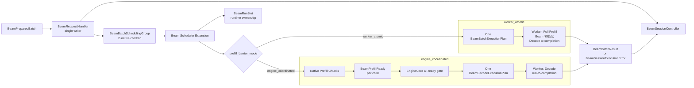

冻结结论：

1. EngineCore 原子注册、Scheduler 物理准入、Prefill 执行完成是三个不同阶段。
2. `BeamRequestHandler` 在 EngineCore event loop 中单写；input/socket thread 不直接修改 Scheduler。
3. 一个 B-item Batch 只向 Scheduler 注册一个 `BeamBatchSchedulingGroup`；不能循环执行 B 次普通 `add_request()`。
4. BeamKV、Beam State、Workspace、Static Buffer 与 Decode Graph 在 Beam Warmup 阶段创建；运行时不再进行大块分配或图捕获。
5. 运行时只预留已有 `BeamRunSlot` 的 Session 所有权。MVP 每个 Worker 一个 Slot。
6. `worker_atomic` 禁止 chunked Prefill；Scheduler 一次交付完整计划，Worker 在同一次调用内执行完整 Prefill、Beam 初始化和全部 Decode。
7. `engine_coordinated` 允许 B 个 child 跨多个 Scheduler tick 完成 Prefill；只有 final Prefill 实际完成且 Worker 已创建 `BeamInitialState` 后，child 才算 Ready。
8. `engine_coordinated` 的逻辑 Barrier 由 `BeamSessionController` 持有，Scheduler 负责停车与 PromptKV，Worker 负责 Beam 初始化。
9. Beam 初始化表示从最后 Prompt logits 为每个 item 选择第一批 W 个 token。
10. Beam 初始化之后，Decode 只在 Worker 内 run-to-completion；EngineCore 不参与逐 step 控制。
11. MVP 不支持 Decode micro-batch、fragment、单 child preemption、async scheduling、DP migration 或静默模式降级。
12. Worker teardown 完成前不能释放 PromptKV、Beam state 或 `BeamRunSlot`。
13. `worker_atomic` 与 Decode run-to-completion 独占一次 distributed Worker invocation，不能混入普通 native rows。
14. `engine_coordinated` 的 PromptKV 按 chunk 增量 commit；只回滚本 tick 未提交 delta，不误释放此前完成的 sibling KV。
15. TP Ready 是 all-rank prepare/commit 后由 driver 发出的聚合事件；任一 rank 失败都会使整个 Slot fail closed。
16. all-ready 通过稳定 `dispatch_id` 与 Scheduler 幂等 commit，Worker 释放通过 `BeamTeardownExecutionPlan` / `BeamWorkerTeardownAck` 闭环。

---

## 1. 范围与上下游边界

### 1.1 本文输入

上游入口层已经完成：

```text
Online / Offline Adapter
→ BeamRequestManager
→ ADD_BEAM_BATCH
→ BeamBatchRequest
→ input thread decode / prepare
→ BeamPreparedBatch
```

`BeamPreparedBatch` 中已经存在：

- 可信 schema 解码结果；
- `BeamSessionKey`；
- B 个确定性 child request ID；
- B 个已经完成通用输入准备的 native `Request` 候选对象；
- 冻结的 `BeamExecutionParameters` 与 `BeamResultOptions`；
- 已选择的 DP replica；
- 部署级 `BeamPrefillBarrierMode`。

```python
class BeamPrefillBarrierMode(str, Enum):
    WORKER_ATOMIC = "worker_atomic"
    ENGINE_COORDINATED = "engine_coordinated"
```

该开关是部署级能力选择，在 Session 注册后不可改变；任何模式都不能在容量不足或执行失败时静默降级为另一模式。上游 `BeamSessionConfig.prefill_barrier_mode` 的实现类型必须是 `BeamPrefillBarrierMode`；线上序列化值仍是上述字符串，而不是任意 `str`。

### 1.2 本文输出

本文覆盖到以下边界：

```text
Scheduler → Worker:
    BeamBatchExecutionPlan
    or BeamPrefillExecutionPlan / BeamDecodeExecutionPlan
    or BeamTeardownExecutionPlan

Worker → Scheduler completion path:
    BeamPrefillReady

Scheduler → EngineCore, after identity/lease validation:
    validated BeamPrefillReady

Worker → EngineCore return path, through Executor/Scheduler bookkeeping:
    BeamBatchResult
    BeamSessionExecutionError
    BeamWorkerTeardownAck
```

`BeamPrefillReady` 的 schema 在 Worker 与 EngineCore 间保持不变，但 Scheduler 只有在验证 Session、attempt、execution ID、Slot generation 与 PromptKV lease 后才允许转交；Controller 不接收未经验证的 Ready。

### 1.3 非目标

- Online HTTP/OpenAI schema；
- Offline N→B 分组与结果保序；
- Trie/Catalog 文件格式；
- candidate select、Beam select、final select 的 kernel 实现；
- CUDA/ACL Graph 内部捕获代码；
- TP/PP collective 细节；
- Decode micro-batch；
- 多 Session Worker execution batch；
- 动态 Beam width；
- 运行时 Graph capture 或 BeamKV 扩容。

---

## 2. 名词、规模与阶段

### 2.1 三种规模

```text
B = 一个 Beam Batch 中的业务 item 数
W = 每个 item 的 Beam width
R = B × W，Decode 的 logical rows
G = smallest_supported_graph_gear(R)，实际 physical capacity
```

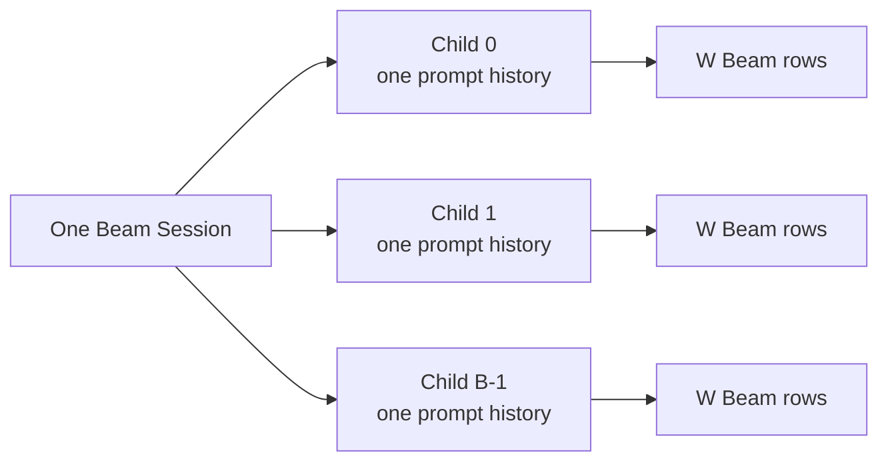

Scheduler 只管理 B 个 native child Request；W 路 Beam 不注册为 W 个 native Request。`B × W` 只存在于 Worker Beam Runtime 和资源容量模型中。

### 2.2 四个不可混淆的里程碑

| 阶段 | 含义 | 不保证什么 |
| --- | --- | --- |
| `REGISTERED` | Group、Session Controller 和 B 个 child 已原子登记 | 不保证 KV 或立即执行 |
| `ADMITTED` | 本次需要的 Scheduler/Beam capacity 已获得 | 不保证 forward 已完成 |
| `SCHEDULED` | 工作已写入某次 `SchedulerOutput` | 不保证设备执行成功 |
| `COMPLETED` | 对应 Worker execution 已返回并被 `update_from_output()` 验收 | 不等于整个 Session 终态 |

这四项是完成度里程碑，不是后文 Session/child 状态机的枚举值。原生 vLLM 的 `Scheduler.add_request()` 只完成登记；真正 KV-backed admission 发生在后续 `schedule()` / `allocate_slots()`。因此 `BeamSessionRegistrationAccepted` 只能表示 `REGISTERED`。

### 2.3 责任表

| 组件 | 负责 | 不负责 |
| --- | --- | --- |
| `BeamRequestHandler` | 权威校验、stage-all、commit-once、registration reply | KV 容量、Prefill 执行 |
| `BeamSessionController` | Session 状态、engine barrier、dispatch-once、terminal-once | logits、Beam scores、parent |
| `BeamBatchSchedulingGroup` | B-child 组边界、Scheduler 生命周期与资源关联 | Frontend 格式、设备算法 |
| Beam Scheduler Extension | group admission、PromptKV、chunk 调度、停车、typed plan | 逐步 Beam 决策 |
| `BeamRuntimeCapacityManager` | Warmup capacity 描述、`BeamRunSlot` reserve/activate/drain | Prompt token 调度 |
| Worker / ModelRunner | Prefill forward、Beam 初始化、完整 Decode | Frontend output routing |
| Native KV manager | Prefix Cache、Prompt PagedKV block ownership | Beam suffix KV parent reorder |
| `BeamKVPool` | Beam suffix KV 固定池 | PromptKV、Prefix Cache |

---

## 3. EngineCore 单写与原子注册

### 3.1 两线程责任边界

input/socket thread 可以进行纯解析和私有 staging，但不能修改 EngineCore/Scheduler 的共享状态。

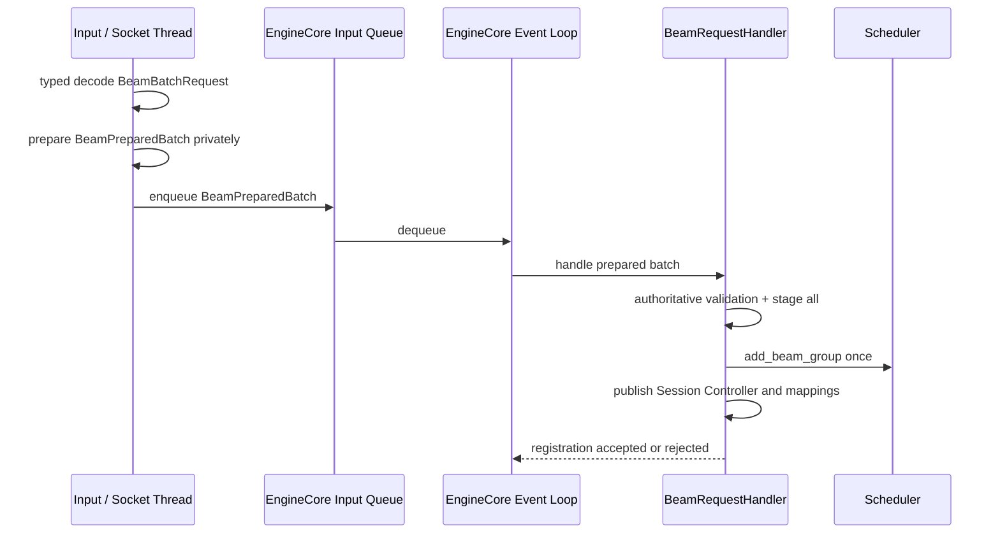

`BeamRequestHandler` 是注册事务的唯一写者。MP、SyncMP、AsyncMP 与 Inproc 都必须最终进入同一 handler。

### 3.2 内部 staging 类型

```python
@dataclass(frozen=True, slots=True)
class BeamPreparedChild:
    item_index: int
    request: Request


@dataclass(frozen=True, slots=True)
class BeamPreparedBatch:
    session_key: BeamSessionKey
    children: tuple[BeamPreparedChild, ...]
    execution_parameters: BeamExecutionParameters
    result_options: BeamResultOptions
    session_config: BeamSessionConfig
    payload_digest: str
```

容器不可变不代表其中的 native `Request` 深度不可变。`Request` 在 commit 后由 Scheduler event loop 单线程拥有。

### 3.3 注册事务

```python
def register_prepared_batch(prepared: BeamPreparedBatch) -> None:
    validate_complete_batch(prepared)
    reserve_session_identity(prepared.session_key, prepared.payload_digest)

    controller = BeamSessionController.from_prepared(prepared)
    group = BeamBatchSchedulingGroup.from_prepared(prepared)

    try:
        scheduler.add_beam_group(group)       # one group commit
        publish_controller(controller)       # local dict publication
        publish_child_to_session_mapping(group)
    except Exception:
        scheduler.rollback_beam_group(group.session_key)
        rollback_unpublished_controller(controller)
        release_session_identity(prepared.session_key)
        emit_registration_rejected(prepared.session_key)
        return

    emit_registration_accepted(prepared.session_key)
```

实际实现应把 commit 区域收敛成一个不可失败或可完整 rollback 的本地事务。禁止：

```python
for child in prepared.children:
    scheduler.add_request(child.request)
```

因为第 k 个 child 失败时，前 k-1 个已经对 Scheduler、connector hook 或统计系统可见。

### 3.4 线性化点

```text
Scheduler Group 可见
and BeamSessionController 可见
and child→Session mapping 可见
──────────────────────────────────
才允许发送 BeamSessionRegistrationAccepted
```

在此之前失败是 `BeamSessionRegistrationRejected`；在此之后的 capacity、Prefill 或 Worker 失败都是 `BeamSessionExecutionError`。

### 3.5 MVP fail-closed 边界

若某条路径包含无法证明 rollback 正确的副作用，MVP 不开启该组合，例如：

- KVConnector/P-D connector 在 registration 阶段产生外部副作用；
- 不能撤销的 grammar/MM cache publish；
- async scheduling 导致同一 Group 多 execution 在途；
- Group rollback 不能恢复所有 request maps、queue 与 hooks。

---

## 4. Scheduler 的组级对象与接口

### 4.1 `BeamBatchSchedulingGroup`

```python
@dataclass(frozen=True, slots=True)
class BeamCapacityEnvelope:
    batch_size: int
    beam_width: int
    max_decode_steps: int
    logical_decode_rows: int
    graph_gear: int


@dataclass(frozen=True, slots=True)
class BeamPromptKVBinding:
    child_request_id: str
    prompt_kv_lease_generation: int


@dataclass(frozen=True, slots=True)
class BeamPromptKVLease:
    child_request_id: str
    prompt_kv_lease_generation: int


@dataclass(frozen=True, slots=True)
class BeamConstraintBinding:
    constraint_handle_id: str
    constraint_generation: int


@dataclass(frozen=True, slots=True)
class BeamBatchSchedulingGroup:
    session_key: BeamSessionKey
    children: tuple[Request, ...]
    session_config: BeamSessionConfig
    execution_parameters: BeamExecutionParameters
    result_options: BeamResultOptions
    capacity_envelope: BeamCapacityEnvelope
```

Group 是 Scheduler 的排队、取消和失败边界。B 个 child 仍是 native `Request`，用于复用：

- token history；
- Prefix Cache hash；
- Prompt PagedKV；
- block table；
- LoRA/MM 等原生 ModelRunner metadata。

Group 不复制 Prompt tokens、block IDs 或 `num_computed_tokens`，避免出现两份权威。

### 4.2 Scheduler 扩展接口

```python
class BeamSchedulerControl(Protocol):
    def add_beam_group(
        self,
        group: BeamBatchSchedulingGroup,
    ) -> None:
        """Atomic logical registration; no child visible on failure."""

    def rollback_beam_group(self, session_key: BeamSessionKey) -> None:
        """Undo an unaccepted registration; no external side effects."""

    def reserve_beam_run_slot(
        self,
        session_key: BeamSessionKey,
    ) -> BeamRunReservation | None:
        """Reserve an existing Warmup-created slot before Prefill."""

    def try_enqueue_beam_decode(
        self,
        work_item: BeamDecodeWorkItem,
    ) -> bool:
        """Idempotent commit keyed by session_key + dispatch_id."""

    def abort_beam_group(self, session_key: BeamSessionKey) -> None: ...

    def release_beam_group(self, session_key: BeamSessionKey) -> None:
        """Only after Worker teardown acknowledgement."""
```

### 4.3 Scheduler 内部索引

```python
beam_groups: dict[BeamSessionKey, BeamBatchSchedulingGroup]
beam_waiting: deque[BeamSessionKey]
beam_child_to_session: dict[str, tuple[BeamSessionKey, int]]
beam_run_reservations: dict[BeamSessionKey, BeamRunReservation]
```

普通 Request 继续走 native waiting/running 路径。Beam child 可以复用 native `Request` 与 KV manager，但其排队、停车、抢占和释放必须受 Group 状态约束。

### 4.4 必须持续成立的不变量

```python
assert group_child_ids_are_unique
assert child_visible_implies_group_visible
assert no_child_scheduled_before_run_slot_reserved
assert ready_child_never_enters_native_decode
assert ready_child_implies_prompt_kv_lease_valid
assert decode_dispatch_count <= 1
assert slot_released_implies_worker_teardown_acked
assert slot_released_implies_all_children_freed
```

---

## 5. Beam Warmup 与运行时容量

### 5.1 物理资源在 Warmup 创建

```mermaid
flowchart LR
    MODEL[Load Model]
    CONSTRAINT[Load Constraint Resource]
    ENVELOPE[Freeze Beam Runtime Envelope]
    BUFFERS[Create BeamKV / State<br/>Static Buffers / Workspace]
    RESERVE[Reserve Graph Memory Budget]
    PROFILE[determine available memory]
    NATIVEKV[Initialize Native PagedKV]
    WARMUP[Beam Dummy Warmup]
    GRAPH[Capture Decode Graph Gears]
    PUBLISH[Publish BeamRuntimeCapacity<br/>Slots = FREE]

    MODEL --> CONSTRAINT --> ENVELOPE --> BUFFERS --> RESERVE
    RESERVE --> PROFILE --> NATIVEKV --> WARMUP --> GRAPH --> PUBLISH
```

如果 Graph 必须在 native KV 初始化后捕获，则在 KV sizing 前先扣除 Graph pool 上界，再在预留预算内 materialize。

### 5.2 显存预算

```text
M_weights
+ M_constraint
+ M_beamKV_pool
+ M_beam_state
+ M_workspace
+ M_graph_pool
+ M_nativeKV
+ M_temporary
+ M_fragmentation
<= M_usable
```

Beam 资源必须在 native PagedKV 使用剩余显存前计入预算。运行时禁止现场扩大 Beam width、BeamKV 或 Workspace。

### 5.3 Warmup capacity 与 Session 所有权分离

```python
@dataclass(frozen=True, slots=True)
class BeamRuntimeCapacity:
    max_batch_size: int
    max_beam_width: int
    max_decode_steps: int
    max_decode_rows: int
    supported_graph_gears: tuple[int, ...]
    num_run_slots: int


class BeamRunSlotState(str, Enum):
    FREE = "free"
    RESERVED = "reserved"
    ACTIVE = "active"
    DRAINING = "draining"
    POISONED = "poisoned"


@dataclass(slots=True)
class BeamRunSlot:
    slot_id: int
    generation: int
    state: BeamRunSlotState
    owner: BeamSessionKey | None
    envelope: BeamCapacityEnvelope | None


@dataclass(frozen=True, slots=True)
class BeamRunReservation:
    session_key: BeamSessionKey
    slot_id: int
    slot_generation: int
    envelope: BeamCapacityEnvelope


class BeamRuntimeCapacityManager(Protocol):
    @property
    def capacity(self) -> BeamRuntimeCapacity: ...

    def reserve(
        self,
        session_key: BeamSessionKey,
        envelope: BeamCapacityEnvelope,
    ) -> BeamRunReservation | None: ...

    def activate(self, reservation: BeamRunReservation) -> None: ...

    def begin_drain(self, reservation: BeamRunReservation) -> None: ...

    def release_after_teardown(
        self,
        reservation: BeamRunReservation,
        ack: "BeamWorkerTeardownAck",
    ) -> None:
        """Requires a matching CLEAN acknowledgement."""

    def poison(self, reservation: BeamRunReservation, reason: str) -> None: ...

    def reset_poisoned_slot(self, slot_id: int) -> None:
        """Maintenance path only; never called by a request."""


class BeamKVPool(Protocol):
    def bind_preallocated_rows(
        self,
        reservation: BeamRunReservation,
    ) -> None: ...

    def reset_rows_after_teardown(
        self,
        reservation: BeamRunReservation,
    ) -> None: ...
```

Warmup 只创建 Slot；请求到来后 `reserve` 只改变所有权，不进行大块设备分配。

`BeamRuntimeCapacityManager` 是 Slot 状态的唯一写者；Scheduler 只能经由该接口 reserve/activate/drain。`BeamKVPool` 只绑定和清理 Warmup 已分配的 rows，不在 request path 扩容。`reset_poisoned_slot()` 是人工维护/Worker restart 路径。

```text
FREE
→ RESERVED(session, envelope)
→ ACTIVE
→ DRAINING
→ FREE
```

Worker fatal 或 teardown 无法证明完成时：

```text
DRAINING → POISONED
```

`POISONED` Slot 必须由显式 reset/restart 恢复，不能直接交给下一个 Session。

### 5.4 MVP Slot 策略

```text
每个 Worker：num_run_slots = 1
每个 Worker：最多一个已开始 Prefill 的 Beam Session
```

后续 Session 可以原子注册，但停在 `WAITING_FOR_BEAM_RUN_SLOT`，不开始 child Prefill，也不占 PromptKV。

当前不变量仍是任何 child Prefill 前完成 Slot reservation。未来只有在引入独立、可证明且不会被其他 Session 抢占的 Decode capacity reservation 协议后，才可重新讨论把物理 Slot 绑定推迟到 final Prefill 之前；不能在所有 child 已经 Ready 后才首次验证 Decode capacity。

这里的 “Worker” 指一个 DP replica 对应的 distributed Worker group，而不是单个 TP rank。`reserve/activate/drain/poison` 是该 Worker group 的一致状态迁移；TP 各 rank 不得各自独立选择 Slot。

---

## 6. Scheduler 物理准入

### 6.1 静态可行性与动态可用性

注册确认前完成不会随瞬时负载变化的检查：

```text
B <= max_batch_size
W <= max_beam_width
D <= max_decode_steps
R = B × W <= max_decode_rows
存在 G >= R 的 supported graph gear
完整 Prompt 长度满足模型上下文
单 Group 的 PromptKV + Beam runtime 峰值不超过部署 envelope
```

Scheduler tick 只处理当前资源是否可用：

```text
run slot 是否 FREE
native sequence slots 是否可用
token budget 是否可用
PromptKV blocks 是否可分配
```

整体结果：

| 结果 | 时机 | 语义 |
| --- | --- | --- |
| `REJECT` | registration accepted 前 | 请求结构上永远装不下 |
| `WAIT` | Scheduler admission | 当前资源暂时不足；不得遗留本次尝试未 commit 的 provisional delta |
| `ADMIT` | Scheduler admission | 所需资源已按模式提交，可产生执行计划 |

### 6.2 Prefix Cache 与 token 预算

Prefix hit 必须通过 native KV manager 查询，不能由 Beam Scheduler 复制 hash/block 计算。即使完整 Prefix Cache 命中，最后一个 Prompt token 通常仍需重新计算，以得到最终位置 logits。

```text
full_prefill_tokens(group)
    = sum(native_num_new_tokens(child) for child in children)
```

`worker_atomic` 的结构检查不能依赖当前 cache hit：完整未命中的 B 个 Prompt 也必须能在一次 Prefill execution 中满足 token budget，否则 cache 驱逐后会永久等待。

### 6.3 Logical rows 与 physical gear

```python
logical_decode_rows = batch_size * beam_width
physical_graph_gear = min(
    gear for gear in supported_graph_gears
    if gear >= logical_decode_rows
)
```

Beam State/Workspace/Graph static buffers 通常按 `physical_graph_gear`；BeamKV 使用 logical rows 还是 physical gear，必须由 Warmup allocator 与运行时 allocator 使用同一 sizing helper，不能由 Scheduler 另写公式。

### 6.4 Group admission 与 PromptKV commit

native `allocate_slots(full_sequence_must_fit=True)` 是单 Request 语义，不是 B-child transaction。两种模式共享 “Group/Slot 先 admission”，但 PromptKV commit 粒度不同：

- `worker_atomic`：同一个 tick 为 B 个完整 Prompt 计划并提交全部 PromptKV；任一 child 失败则回滚本次全部 provisional allocation。
- `engine_coordinated`：先原子取得 Group sequence identity 与 `BeamRunSlot`，随后每个 tick 按 native chunk 增量提交 PromptKV。已经成功执行的 chunk KV 是 Session 的 committed resource，可以跨 tick 保留；失败时只回滚本 tick 尚未 commit 的 delta。

因此，“不得持有半组 provisional allocation”只约束一次 admission/调度事务，不表示 `engine_coordinated` 在 Session 生命周期中不能持有不同进度的 sibling PromptKV。

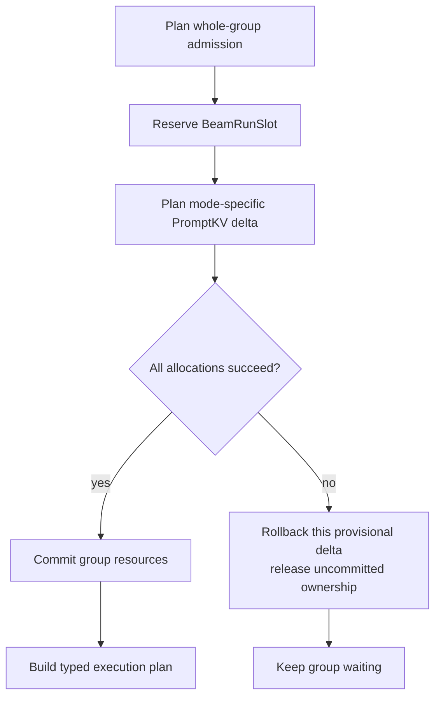

MVP 对无法证明本 tick rollback 的 KVConnector/P-D 路径 fail closed。长期方案是在 native KV manager 增加 non-mutating group plan + atomic commit API。

---

## 7. Mode A：`worker_atomic`

### 7.1 适用条件

```text
Prefill 不切 chunk
B 个 child 在同一次 SchedulerOutput 中出现
完整 Prompt token budget 可一次容纳
PromptKV 可一次完成 group allocation
B × W 适配一个 graph gear
BeamRunSlot 已 RESERVED
async_scheduling = False
```

配置必须 fail fast：

```text
enable_chunked_prefill = False
long_prefill_token_threshold = 0
```

容量不足时只能 WAIT 或 REJECT，不能静默改为 `engine_coordinated`。

### 7.2 一次 WorkerRun

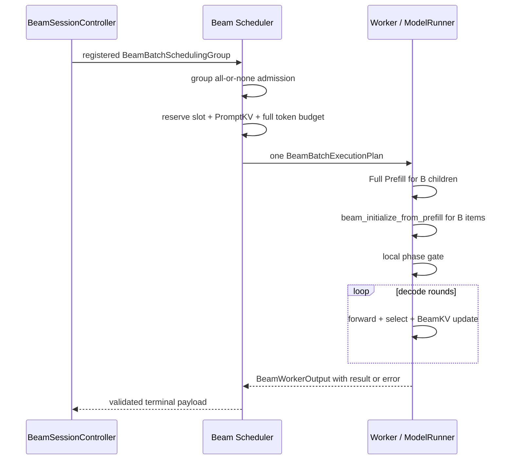

这里的 atomic 是控制面边界，不表示一个 GPU kernel 或一张覆盖所有阶段的 Graph。

### 7.3 Typed execution plan

```python
@dataclass(frozen=True, slots=True)
class BeamBatchExecutionPlan:
    protocol_version: int
    session_key: BeamSessionKey
    worker_invocation_id: str
    worker_generation: int
    dispatch_id: str
    child_request_ids: tuple[str, ...]
    prompt_kv_bindings: tuple[BeamPromptKVBinding, ...]
    constraint_bindings: tuple[BeamConstraintBinding, ...]
    num_prefill_tokens: tuple[int, ...]
    execution_parameters: BeamExecutionParameters
    result_options: BeamResultOptions
    logical_decode_rows: int
    physical_graph_gear: int
    run_slot_id: int
    run_slot_generation: int
```

Worker 接收到的是一个不可拆分执行单元。计划可以携带或引用 B 个 child 的原生 ModelRunner metadata，但不能把它们解释成 B 个独立可返回 Scheduler 的请求。

### 7.4 Worker 内 Beam 初始化

```python
def run_beam_batch(plan: BeamBatchExecutionPlan) -> BeamWorkerOutput:
    prefill = run_full_prefill(
        child_request_ids=plan.child_request_ids,
        prompt_kv_bindings=plan.prompt_kv_bindings,
    )

    initial_state = beam_initialize_from_prefill(
        final_prompt_logits=prefill.final_logits,
        beam_width=plan.execution_parameters.beam_width,
        constraint_bindings=plan.constraint_bindings,
    )

    result = run_decode_to_completion(plan, initial_state)
    return BeamWorkerOutput(
        protocol_version=plan.protocol_version,
        identity=BeamWorkerInvocationIdentity(
            session_key=plan.session_key,
            worker_invocation_id=plan.worker_invocation_id,
            worker_generation=plan.worker_generation,
            run_slot_id=plan.run_slot_id,
            run_slot_generation=plan.run_slot_generation,
        ),
        kind=BeamWorkerOutputKind.BATCH_RESULT,
        batch_result=result,
    )
```

`BeamInitialState` 是 Worker-local、每 child 一个的权威对象：

```python
@dataclass(slots=True)
class BeamInitialState:
    handle_id: str
    session_key: BeamSessionKey
    child_request_id: str
    item_index: int
    worker_generation: int
    run_slot_id: int
    run_slot_generation: int
    prompt_kv_lease_generation: int
    first_tokens: Tensor       # [W]
    scores: Tensor             # [W]
    parent_ids: Tensor         # [W], initialized to 0
    constraint_states: Tensor  # [W, ...]
    active_mask: Tensor        # [W]


class BeamInitialStateRegistry(Protocol):
    def commit(self, state: BeamInitialState) -> "BeamInitialStateRef": ...

    def resolve(self, ref: "BeamInitialStateRef") -> BeamInitialState: ...

    def release_session_after_teardown(
        self,
        session_key: BeamSessionKey,
        run_slot_generation: int,
    ) -> None: ...
```

`beam_initialize_from_prefill()` 是唯一的 Beam 初始化操作；`worker_atomic` 一次返回 B 个 state，`engine_coordinated` 每个 final child 返回一个 state。对象从 registry commit 起由 `(session_key, handle_id, run_slot_generation)` 唯一拥有，只能在 Worker teardown fence 完成后删除。

这些第一批 token 尚未执行 forward，因此此时没有对应 Beam suffix KV；它们在第一次 Decode forward 中写入 BeamKV。

### 7.5 Worker 内阶段门

```text
PREFILLING
→ INITIALIZING_BEAMS
→ DECODING
→ FINALIZING
```

同一 stream 依赖 stream order；跨 stream 使用 event record/wait。禁止用一次 EngineCore 往返或 `deviceSynchronize()` 充当业务 Barrier。

`worker_atomic` 不产生：

- `BeamPrefillReady`；
- EngineCore ready mask；
- child parked 状态；
- 第二次 Scheduler decode dispatch；
- per-step Beam output。

---

## 8. Mode B：`engine_coordinated`

### 8.1 适用条件

- 保留原生 chunked Prefill；
- B 个 child 的 Prompt 长度或 Prefix Cache 命中程度不同；
- Prefill 可以跨多个 Scheduler tick；
- BeamRunSlot 已在任何 child Prefill 前 RESERVED；
- all-ready 后只激活 Slot，不再进行容量竞争；
- Decode 仍然只有一次 Worker run-to-completion。

### 8.2 总体流程

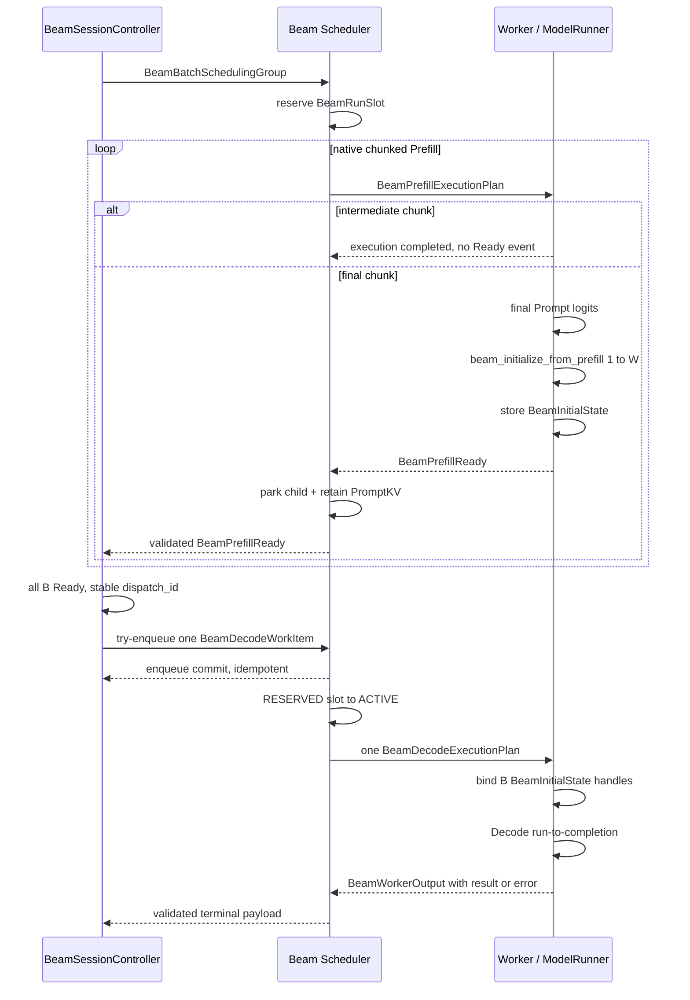

### 8.3 Child chunk 可以独立完成，但 Group 不能被拆散

不同 child 可以拥有不同 chunk 数量和完成顺序：

```text
child 0: chunk 0 → chunk 1 → final → PREFILL_READY_HELD
child 1: final                         → PREFILL_READY_HELD
child 2: chunk 0 → chunk 1 → chunk 2 → final → PREFILL_READY_HELD
```

不要求它们每个 tick lockstep，也不要求每个 chunk 相同长度。Scheduler 继续复用 native token budget、Prefix Cache 与 PromptKV allocator。

但 B 个 child 不是 B 个独立全局请求：

- Group 开始前必须为 B 个 native sequence identity 保留组级容量；
- Group 开始后优先推进未完成 sibling，避免长期保留部分 PromptKV；
- child Ready 后不得进入 native Decode；
- 不允许单 child preemption；资源压力下 whole-group abort/restart；
- MVP 一个 Worker 同时只推进一个 `engine_coordinated` Beam Session。

更细的多 Session 公平性、跨 Group token 分配和可抢占 Prefill 属于后续调度策略，不改变上述正确性边界。

### 8.4 final Prefill 必须由 execution metadata 标识

Scheduler 在某次 execution 中判断：

```text
start_position < prompt_length
and start_position + num_scheduled_tokens >= prompt_length
```

并把不可变标记放入本次 `SchedulerOutput`：

```python
@dataclass(frozen=True, slots=True)
class BeamPrefillExecutionPlan:
    protocol_version: int
    session_key: BeamSessionKey
    worker_invocation_id: str
    worker_generation: int
    child_request_id: str
    item_index: int
    child_attempt: int
    prefill_execution_id: str
    num_scheduled_tokens: int
    is_final_chunk: bool
    prompt_kv_binding: BeamPromptKVBinding
    constraint_binding: BeamConstraintBinding
    execution_parameters: BeamExecutionParameters
    run_slot_id: int
    run_slot_generation: int
```

Worker 不能读取可能已被下一次 schedule 修改的 mutable `num_computed_tokens` 来推断当前 execution 是否 final。final chunk 所需的 Beam width、candidate/select 参数、constraint handle 与 PromptKV lease 都必须来自该不可变 plan，不能隐式读取未定义的全局 registry。

### 8.5 Beam 初始化替换原生 final-Prefill sampler

原生 vLLM 会为 Prefill row 取最后 scheduled position logits 并执行 sampler；中间 chunk 的 sampled token 随后丢弃，final chunk 的 token 则会进入 native Request。

Beam child 的 final chunk 必须改为：

```text
final Prefill logits
→ 不进入 native single-token sampler
→ constraint filtering
→ per-item top-W
→ create BeamInitialState
→ return BeamPrefillReady
```

最自然的 Worker hook 是 ModelRunner `sample_tokens()` / postprocess 的 row-level 分支：

```python
regular_rows, beam_final_rows = partition_rows(execution_plan)

regular_output = native_sample(regular_rows)
beam_ready = beam_initialize_from_prefill(
    logits=final_logits[beam_final_rows],
    plans=beam_final_plans,
)
```

这样允许普通 Request、中间 Beam chunk 和 final Beam chunk 共享一次 ModelRunner execution，同时保持首 token 所有权唯一。

### 8.6 `BeamPrefillReady` 的严格语义

```python
class BeamInitialStateRef(msgspec.Struct, frozen=True, forbid_unknown_fields=True):
    handle_id: str
    worker_generation: int
    run_slot_id: int
    run_slot_generation: int
    prompt_kv_lease_generation: int
    prefix_length: int


class BeamPrefillReady(msgspec.Struct, frozen=True, forbid_unknown_fields=True):
    protocol_version: int
    session_key: BeamSessionKey
    child_request_id: str
    item_index: int
    child_attempt: int
    prefill_execution_id: str
    initial_state_ref: BeamInitialStateRef
```

Ready 必须同时表示：

```text
final Prefill forward 已成功完成
and 最后 Prompt 位置 logits 已产生
and Beam 初始化已执行且只执行一次
and BeamInitialState 已提交到 Worker-local registry
and PromptKV lease 仍然有效
and native Request 未追加普通 sampled token
```

`BeamInitialStateRef` 是 opaque 引用，不包含 Tensor、device pointer 或进程内地址。TP 场景中每个 rank 按同一 logical handle ID 持有本地 shard；这里的 Ready 必须是 distributed Worker group 的聚合结果：所有 TP rank 先 prepare 本地 shard，collective 确认全部成功后再 commit，并且只由 driver rank 发出一个 `BeamPrefillReady`。任一 rank prepare/commit 失败都产生 Session 级错误并 poison 整个 Slot。PP 在 collective prepare/commit/teardown 定义前继续 fail closed。

`BeamPromptKVBinding.prompt_kv_lease_generation`、`BeamPromptKVLease.prompt_kv_lease_generation` 与 `BeamInitialStateRef.prompt_kv_lease_generation` 必须相等。它们共同标识一次 PromptKV 所有权租约；native block-table 的内部版本不是该协议字段，Scheduler 在验收 Ready 时另行验证当前 block table 仍属于这次租约。

| 标识 | 创建者 | 递增/变化时机 | 验收者与失效条件 |
| --- | --- | --- | --- |
| `worker_generation` | Worker group 启动流程 | Worker group restart | EngineCore/Scheduler；不匹配即 stale |
| `run_slot_generation` | Capacity manager | Slot 每次从 FREE→RESERVED | Scheduler/Worker；Slot 被重新预留即 stale |
| `prompt_kv_lease_generation` | Scheduler KV ownership layer | child PromptKV 重新分配、preempt/recompute | Scheduler；与 Binding/Lease/Ref 任一不一致即 stale |
| `child_attempt` | Beam Session Controller | whole-group retry 产生新 child attempt | Controller；旧 attempt Ready 丢弃或 fail closed |
| `prefill_execution_id` | Scheduler | 每个 Prefill execution | Scheduler；只接受对应在途 execution |
| `dispatch_id` | Controller | all-ready 首次形成 Decode 意图 | Scheduler/Worker；同 ID 幂等，不同 ID 冲突 |

### 8.7 早完成 child 停车

```text
FINAL_PREFILL_IN_FLIGHT
→ PREFILL_READY_HELD
```

Scheduler 验收 Ready 后：

- 从普通可调度集合中移除；
- 不进入 native Decode；
- 不产生 Frontend token output；
- 保留 native Request 与 PromptKV ownership；
- 保存 `BeamPromptKVLease(child_request_id, prompt_kv_lease_generation)`；
- 禁止单 child preemption/free；
- 等待 whole-group Decode 或 whole-group abort。

底层可以增加明确的 `WAITING_FOR_BEAM_GROUP` 请求状态，但 Beam child phase 的权威应位于 `BeamBatchSchedulingGroup`，并由一个 Scheduler 方法原子更新两者。

### 8.8 EngineCore all-ready gate

```python
@dataclass(slots=True)
class BeamEngineBarrierState:
    child_ready: list[bool]
    initial_state_refs: list[BeamInitialStateRef | None]
    ready_count: int = 0
    decode_dispatch_id: str | None = None
    decode_enqueue_committed: bool = False


def on_prefill_ready(
    controller: BeamSessionController,
    scheduler: BeamSchedulerControl,
    event: BeamPrefillReady,
) -> None:
    controller.validate_ready_identity_and_lease(event)

    if controller.has_conflicting_ready_event(event):
        controller.fail_closed("conflicting BeamPrefillReady")
        return

    if not controller.is_same_ready_event(event):
        controller.record_ready(event)

    try_commit_decode_enqueue(controller, scheduler)


def try_commit_decode_enqueue(
    controller: BeamSessionController,
    scheduler: BeamSchedulerControl,
) -> None:
    """Called after Ready and on later EngineCore ticks until committed."""

    if controller.ready_count != controller.batch_size:
        return
    if controller.decode_enqueue_committed:
        return

    dispatch_id = controller.get_or_create_decode_dispatch_id()
    work_item = controller.build_decode_work_item(dispatch_id)
    if scheduler.try_enqueue_beam_decode(work_item):
        controller.mark_decode_enqueue_committed(dispatch_id)
```

由于 `BeamSessionController` 位于 EngineCore 单写 event loop，这里不需要分布式 CAS；但 Controller flag 与 Scheduler enqueue 仍必须形成可恢复的本地 commit。`dispatch_id` 在第一次尝试前固定，Scheduler 对 `(session_key, dispatch_id)` 幂等；enqueue 未 commit 时 Controller 保持 all-ready 并在后续 tick 使用同一 ID 重试，不能先设置 started flag 再丢失 work item。

### 8.9 Decode handoff

```python
@dataclass(frozen=True, slots=True)
class BeamDecodeWorkItem:
    session_key: BeamSessionKey
    dispatch_id: str
    initial_state_refs: tuple[BeamInitialStateRef, ...]
    execution_parameters: BeamExecutionParameters
    result_options: BeamResultOptions
    run_slot_id: int
    run_slot_generation: int


@dataclass(frozen=True, slots=True)
class BeamDecodeExecutionPlan:
    protocol_version: int
    session_key: BeamSessionKey
    worker_invocation_id: str
    worker_generation: int
    dispatch_id: str
    initial_state_refs: tuple[BeamInitialStateRef, ...]
    prompt_kv_leases: tuple[BeamPromptKVLease, ...]
    execution_parameters: BeamExecutionParameters
    result_options: BeamResultOptions
    logical_decode_rows: int
    physical_graph_gear: int
    run_slot_id: int
    run_slot_generation: int
```

`try_enqueue_beam_decode()` 只做一次逻辑入队；真正 Worker dispatch 仍由下一次 `Scheduler.schedule()` 产生。不能从 `update_from_output()` 递归调用 Worker。

---

## 9. Typed `SchedulerOutput`

禁止继续使用动态属性：

```python
scheduler_output.beam_data = ...
```

建议显式增加 typed sidecar：

```python
class BeamTeardownReason(str, Enum):
    COMPLETED = "completed"
    CANCELLED = "cancelled"
    FAILED = "failed"


class BeamTeardownOutcome(str, Enum):
    CLEAN = "clean"
    FENCE_UNPROVEN = "fence_unproven"


@dataclass(frozen=True, slots=True)
class BeamTeardownExecutionPlan:
    protocol_version: int
    session_key: BeamSessionKey
    worker_invocation_id: str
    teardown_id: str
    dispatch_id: str | None
    run_slot_id: int
    run_slot_generation: int
    worker_generation: int
    reason: BeamTeardownReason


class BeamWorkerTeardownAck(
    msgspec.Struct,
    frozen=True,
    forbid_unknown_fields=True,
):
    protocol_version: int
    session_key: BeamSessionKey
    teardown_id: str
    dispatch_id: str | None
    run_slot_id: int
    run_slot_generation: int
    worker_generation: int
    outcome: BeamTeardownOutcome
    error_code: str | None = None


class BeamWorkerOutputKind(str, Enum):
    PREFILL_READY = "prefill_ready"
    BATCH_RESULT = "batch_result"
    SESSION_ERROR = "session_error"
    TEARDOWN_ACK = "teardown_ack"


@dataclass(frozen=True, slots=True)
class BeamWorkerInvocationIdentity:
    session_key: BeamSessionKey
    worker_invocation_id: str
    worker_generation: int
    run_slot_id: int
    run_slot_generation: int


@dataclass(frozen=True, slots=True)
class BeamWorkerOutput:
    protocol_version: int
    identity: BeamWorkerInvocationIdentity
    kind: BeamWorkerOutputKind
    ready_events: tuple[BeamPrefillReady, ...] = ()
    batch_result: BeamBatchResult | None = None
    session_error: BeamSessionExecutionError | None = None
    teardown_ack: BeamWorkerTeardownAck | None = None


@dataclass(frozen=True, slots=True)
class BeamSchedulerOutput:
    atomic_run: BeamBatchExecutionPlan | None = None
    prefill_runs: tuple[BeamPrefillExecutionPlan, ...] = ()
    decode_run: BeamDecodeExecutionPlan | None = None
    teardown_run: BeamTeardownExecutionPlan | None = None
```

并作为正式字段进入 upstream `SchedulerOutput` 或由一个明确的 wrapper 承载：

```python
@dataclass(frozen=True, slots=True)
class BeamSchedulerStepPlan:
    native: SchedulerOutput
    beam: BeamSchedulerOutput
```

四个 `Beam...ExecutionPlan` 与 `BeamWorkerOutput` 会跨 Scheduler↔Worker executor/process 边界，因此必须携带 `protocol_version`。`BeamDecodeWorkItem`、`BeamSchedulerOutput` 与 `BeamSchedulerStepPlan` 是 EngineCore 进程内对象，不是 wire protocol。

约束：

```text
atomic_run != None  ⇒ native.is_empty and prefill_runs == () and decode_run == None and teardown_run == None
decode_run != None  ⇒ native.is_empty and prefill_runs == () and atomic_run == None and teardown_run == None
teardown_run != None ⇒ native.is_empty and prefill_runs == () and atomic_run == None and decode_run == None
prefill_runs != ()  ⇒ each Beam plan maps to rows in this native execution
BeamWorkerOutput.kind 与四类 payload 严格一一对应，其余三类必须为空
同一 invocation 任一 child/rank 失败 ⇒ SESSION_ERROR，ready_events 必须为空
每个 Session 每个 tick 最多一个 Decode execution
一个 dispatch_id 最多进入一个 Worker invocation
```

`BeamWorkerInvocationIdentity` 必须逐字段回显 Scheduler 发出的 plan；Executor 用 `worker_invocation_id` 找回在途 plan，再验证 Session、Worker generation 与 Slot identity。不能只凭返回对象里的 `session_key` 关联长调用。

`atomic_run` 或 `decode_run` 一旦 dispatch，就独占该 DP replica 的 distributed Worker invocation；在 terminal `BeamWorkerOutput` 返回前，Scheduler 不得向同一 executor lane 投递普通 native work 或另一个 Beam run。否则一次长 Decode 会破坏普通 `SchedulerOutput` 的 one-step 语义。

两种模式都不再产生：

- `WorkerBeamStepResult`；
- `BeamContinuation`；
- step fragment；
- StepAccumulator；
- per-step EngineCore candidate payload。

---

## 10. 状态机

### 10.1 `worker_atomic`

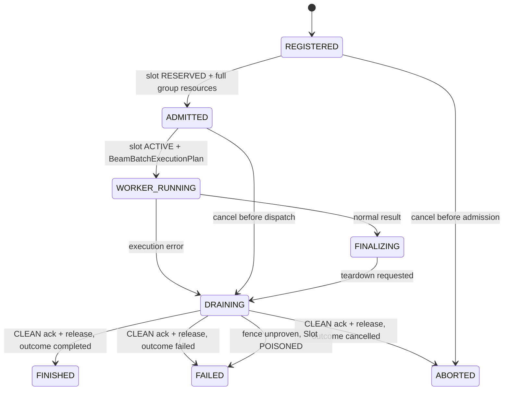

### 10.2 `engine_coordinated`

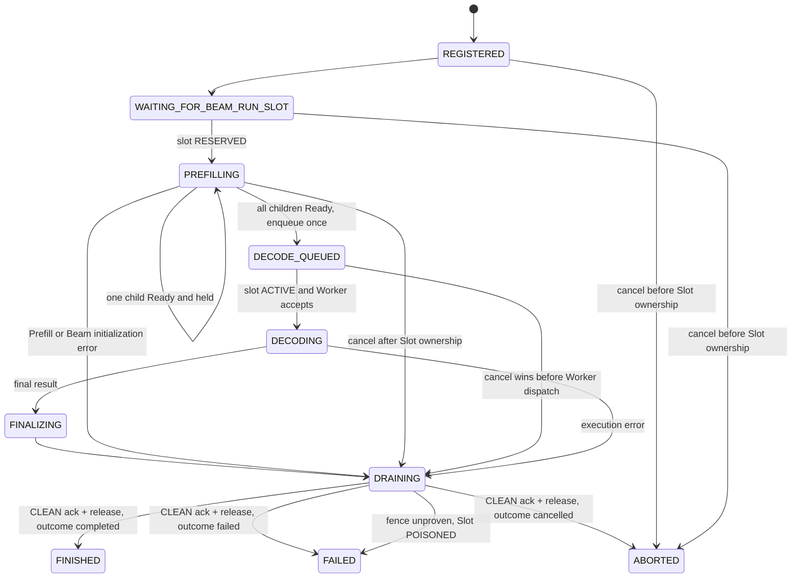

Session lifecycle state 与 terminal outcome 分开保存。任何已取得 Slot、PromptKV 或 `BeamInitialState` 的失败/取消都必须先进入 `DRAINING`。CLEAN Ack 后按序释放并发布 `FINISHED`、`FAILED` 或 `ABORTED`；fence 无法证明时仍向 Frontend 发布一次 Session `FAILED`，同时把 `BeamRunSlot.state` 设为 `POISONED` 并隔离设备资源。`POISONED` 不是 Session 终态。

### 10.3 Child 状态

```text
WAITING
→ PREFILLING
→ FINAL_PREFILL_IN_FLIGHT
→ PREFILL_READY_HELD
→ DECODE_BOUND
→ RELEASED
```

任一 child failure 默认使整个 Session 进入 failure/abort；MVP 不返回部分 item 成功。

---

## 11. Cancel、失败与释放

### 11.1 统一释放顺序

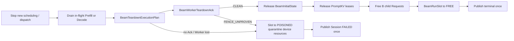

Slot 必须最后释放。只收到 `BeamBatchResult` 不代表 Worker 已停止读取静态输出或 KV。

`update_from_output()` 的闭环顺序固定为：

```text
validate BeamWorkerOutput identity/generations
→ SESSION_ERROR: assert ready_events empty; record pending error and stop new dispatch
→ PREFILL_READY: validate every Ready, then forward as one commit batch
→ BATCH_RESULT: record pending result and stop new dispatch
→ schedule exactly one BeamTeardownExecutionPlan(teardown_id)
→ validate BeamWorkerTeardownAck
→ CLEAN: release InitialState → PromptKV → children → Slot; publish terminal once
→ FENCE_UNPROVEN/no Ack after Worker loss: poison Slot; quarantine device resources
```

`BeamTeardownExecutionPlan` 是触发 Ack 的命令，`BeamWorkerTeardownAck` 是释放前提；`BeamSchedulerOutput.teardown_run` 不能被解释成直接释放资源。重复的同一 `teardown_id`、terminal payload 或 Ack 必须幂等，不同 generation/ID 则 fail closed。

若同一次 mixed Prefill invocation 中已经计算出部分 Ready、随后另一个 child/rank 失败，Worker 必须丢弃尚未对外 commit 的 Ready，返回唯一的 `SESSION_ERROR` variant；EngineCore 不得先放行 Ready 再处理同批错误。

### 11.2 失败矩阵

| 失败位置 | 处理 |
| --- | --- |
| registration validation/staging | `BeamSessionRegistrationRejected`；Scheduler 可见 child 为 0 |
| 等待 Slot 时 cancel | 移出等待队列；无 PromptKV/Worker 清理 |
| Prefill allocation 暂时不足 | `worker_atomic` 回滚整次尝试；`engine_coordinated` 只回滚本 tick provisional delta，保留此前 committed chunk KV |
| 任一 child Prefill error | whole-group error；drain siblings；CLEAN teardown Ack 后按统一顺序释放全部 PromptKV |
| duplicate identical Ready | 幂等忽略 |
| conflicting/stale Ready | fail closed；whole-group teardown |
| all-ready 与 cancel 并发 | event loop 中只有 cancel-before-dispatch 或 dispatch-then-cancel 两种线性化结果 |
| Worker Decode error | whole-group teardown；无 per-child retry |
| Worker fatal / fence unknown | Slot 标记 `POISONED`；禁止立即复用 |
| duplicate final/teardown Ack | 幂等；所有释放副作用至多一次 |

### 11.3 Decode 期间的 Cancel

MVP 没有 out-of-band cooperative cancel channel。`worker_atomic` 或 `engine_coordinated` Decode 的长 Worker invocation 发出后，EngineCore 不能声称在中途打断它：新 cancel 只会在 transport/event queue 中等待，Worker 返回 result/error 后再由 Controller 线性化为 pending terminal outcome，并执行统一 teardown。真正的中途取消必须先增加 Worker 可轮询的 control channel 与安全 checkpoint，属于后续能力。

### 11.4 Preemption

MVP：

- `worker_atomic` admission 后不可 preempt；
- `engine_coordinated` child 进入 `PREFILL_READY_HELD` 后不可 individual preempt；
- unfinished child 若因原生策略被 preempt，必须 whole-group abort/restart，不能保留旧 Ready handle；
- PromptKV lease generation 变化会使对应 `BeamInitialStateRef` 立即失效。

---

## 12. 与原生 vLLM 的关键差异

### 12.1 原生事实与设计后果

| 原生事实 | 设计后果 |
| --- | --- |
| `scheduler.add_request()` 只加入 waiting/maps | Beam registration reply 不能表示资源 admission |
| `schedule()` 中 `allocate_slots()` 才决定运行容量 | Beam Group 需要独立 admission plan/rollback |
| Scheduler 用统一 token gap 调度 Prefill/Decode | 必须显式 gate Beam child，不能依赖 native Prefill phase |
| `num_computed_tokens` 在 forward 前乐观推进 | Ready 必须来自 execution completion，不来自计数 |
| 中间 Prefill chunk 仍可能计算 sampler，再丢弃 token | 是否有 logits/采样不能作为 Ready |
| final Prefill 默认保留一个 sampled token | Beam final row 必须替换 native sampler |
| final sampled token 会触发普通 Decode | Ready child 必须停车 |
| native preemption 会释放 KV 并把进度重置为 0 | MVP 不能允许 Beam child 独立 preemption |

### 12.2 Chunked Prefill 的两个限制来源

```text
long_prefill_token_threshold
    先限制单次长 Prefill token 数

remaining scheduler token budget
    enable_chunked_prefill=True 时继续截断
    enable_chunked_prefill=False 时整个请求等待
```

因此 `worker_atomic` 必须同时关闭 chunk 和 long-prefill threshold；只设置其中一个不够。

### 12.3 Prefix Cache full hit

Prefix Cache full hit 也不能直接将 child 标记 Ready。为了获得最后 Prompt 位置 logits，native KV manager 通常最多命中到 `prompt_length - 1`，最后 token 仍需实际 forward，并在 Worker 完成 Beam 初始化。

---

## 13. xLLM OneRec 的参考边界

xLLM OneRec 的 XAttention multi-round 路径适合参考 `worker_atomic`，因为一次 Worker job 包含完整 Prefill 和所有 Decode round。它不是跨 Scheduler tick 的 `engine_coordinated` 实现。

| 设计点 | xLLM 代码事实 | vllm-GR 采用方式 |
| --- | --- | --- |
| 执行边界 | Engine 调用一次 Worker，Worker 内执行多 round | `worker_atomic` 一次 WorkerRun；EngineCore 不逐 step 驱动 |
| Worker lane | job 开始前取得固定 pipeline lane，结束后归还 | `BeamRunSlot` 固定 Session/Worker/stream 生命周期 |
| BeamKV | pipeline 构造时按最大配置预分配 unshared K/V | Beam Warmup 创建固定 BeamKVPool |
| Workspace | 每执行线程固定 Workspace | Workspace 与 Slot/Warmup 绑定 |
| Beam 状态 | round loop 前准备批级状态 | Worker 在 Prefill 后创建 `BeamInitialState` |
| Chunk Prefill | FixedSteps OneRec 路径不真正切分完整 Prompt | 不能照搬到 `engine_coordinated`；必须显式 Ready Barrier |

xLLM 中运行时 Beam width 超配置可能触发现场扩容，shared KV/部分 Beam state 也存在 batch-time allocation。vllm-GR 的 Graph/固定地址目标不采用这些 fail-late 行为：超出 Warmup envelope 时在 registration/admission 阶段拒绝。

---

## 14. 模块建议

```text
vllm_gr/engine/
├── beam_request_handler.py
├── beam_session_controller.py
└── beam_engine_config.py

vllm_gr/core/
├── beam_batch_scheduling_group.py
├── beam_scheduler_control.py
├── beam_runtime_capacity.py
└── beam_scheduler_output.py

vllm_gr/worker/
├── beam_worker_runtime.py
├── beam_initial_state.py
├── beam_kv_pool.py
└── beam_warmup.py

vllm_gr/beam/
└── contracts.py
```

模块依赖方向：

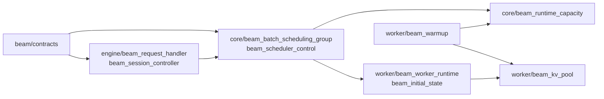

新增领域模块与类型统一使用职责名称和 `Beam...` 前缀，不在路径或类型名中加入 `V1/V2`；协议版本只由跨进程顶层消息的 `protocol_version` 表达。若需要接入 upstream `vllm/v1`，由薄 adapter 完成，不把 upstream 版本号传播到 Beam 领域命名。

---

## 15. 验收测试

### 15.1 Registration 与 admission

- 第 k 个 child staging 失败时 Scheduler 可见 child 为 0；
- duplicate Session + same digest 幂等，different digest fail closed；
- registration accepted 后资源暂时不足只 WAIT，不重新注册；
- `worker_atomic` 任一 PromptKV allocation 注入失败，整次 provisional allocation 回滚；
- `engine_coordinated` 某 tick allocation 失败只回滚该 tick delta，此前 committed chunk KV 不被误释放；
- rollback 后 free block 数、request maps、Prefix Cache events 与 connector state 一致。

### 15.2 `worker_atomic`

- B 个 child 只出现在一个 `BeamBatchExecutionPlan`；
- chunk/threshold/async 非法组合 fail fast；
- Prefill、Beam 初始化、全部 Decode 只发生在一次 Worker invocation；
- long run 对应的 `native` execution 为空，同一 executor lane 不混入普通请求；
- EngineCore 不收到 child Ready 或 per-step result；
- logical rows padding 到正确 graph gear；
- 完整 Prefix hit 仍执行最后 Prompt token。

### 15.3 `engine_coordinated`

- B=1 与 B>1；不同 Prompt 长度和不同 chunk 数；
- Prefix hit/miss 混合；Ready 到达顺序任意；
- 中间 chunk 不产生 Ready；final chunk schedule 但 execution 未返回时 Barrier 保持关闭；
- final Beam row 不向 native Request追加普通 token；
- final plan 完整携带 PromptKV、constraint 与 frozen execution parameters；
- Ready child 保持 PromptKV block IDs/lease generation；
- duplicate Ready 幂等，stale attempt/execution/generation fail closed；
- all-ready 只生成一个 `BeamDecodeWorkItem` 与一个 `BeamDecodeExecutionPlan`；
- 注入首次 enqueue 失败后使用同一 `dispatch_id` 重试，Controller 不丢失 all-ready 状态；
- parked child 不进入 native Decode，也不成为 individual preemption victim。
- TP 任一 rank 初始化失败不产生 Ready；全部 rank commit 后 driver 只产生一个 Ready。
- mixed invocation 中 Ready 后发生 child/rank error 时只返回 `SESSION_ERROR` variant，不提交任何 Ready 或 Decode。

### 15.4 生命周期与资源

- cancel 位于 registration wait、Slot wait、partial Ready、all-ready、Decode invocation 在途、Finalizing；Decode 在途 cancel 必须等待 Worker 返回，不能伪装成中途打断；
- Worker terminal 前 PromptKV、Beam state 和 Slot 不释放；
- `BeamTeardownExecutionPlan`、teardown Ack、child free、Slot release、Frontend terminal 各至多一次；
- Worker output 的 invocation/session/worker/slot identity 任一不匹配均 fail closed；
- CLEAN Ack 走严格释放顺序；`FENCE_UNPROVEN` 或 Worker loss 只 poison，不复用 Slot；
- partial-ready cancel 必须进入 DRAINING；Slot poison 时 Session 仍向 Frontend 发布一次 FAILED；
- Worker fatal 将 Slot 标记 `POISONED`；
- Warmup 后 request path 不出现 BeamKV/Workspace 大块分配或 runtime graph capture；
- Online 与 Offline 经过同一 Scheduler/Worker 路径并得到同一 reference 结果。

---

## 16. MVP 运行限制

```text
async_scheduling = False
num_beam_run_slots_per_worker = 1
max_active_engine_coordinated_sessions_per_worker = 1
no decode micro-batch
no dynamic beam width
no individual child preemption
no DP migration
no runtime graph capture
no runtime BeamKV/workspace resize
PP fail closed until collective prepare/commit/teardown is defined
TP Ready requires all-rank prepare/commit aggregation
```

这些是当前产品合同，不允许 silently fallback。

---

## 17. 当前冻结决策

1. EngineCore input thread 只产生 `BeamPreparedBatch`；`BeamRequestHandler` 在 event loop 中负责唯一注册写入。
2. 一个 Batch 原子注册一个 `BeamBatchSchedulingGroup`；B 个 child 不逐个调用普通 `scheduler.add_request()`。
3. `BeamSessionRegistrationAccepted` 只表示逻辑注册成功，不表示 KV/Worker capacity admission。
4. Group、Controller 与 child mapping 全部发布后才可发送 registration accepted。
5. BeamKV、Beam State、Static Buffer、Workspace 和 Graph gear 在 Beam Warmup 创建，并在 native KV sizing 中预先计入。
6. 运行时只预留 `BeamRunSlot` 所有权；MVP 在任何 child Prefill 前 reserve，teardown 后最后 release。
7. `worker_atomic` 不支持 chunked Prefill；一次 WorkerRun 完成 Full Prefill、Beam 初始化和全部 Decode。
8. `engine_coordinated` 允许 child 跨 tick Prefill；中间 chunk 不产生 Ready。
9. Beam 初始化在 Worker：final Prompt logits → constrained top-W → `BeamInitialState`。
10. `engine_coordinated` Barrier 在 EngineCore：Scheduler 验收 Ready、停车 child并保留 PromptKV；Controller all-ready 后以稳定 `dispatch_id` 幂等 commit 一次 Decode enqueue。
11. Ready 以 final execution 完成、`BeamInitialState` commit 和 PromptKV lease 有效为准，不能由 `num_computed_tokens` 推导。
12. final Beam Prefill row 不走 native single-token sampler，也不允许自动进入 native Decode。
13. 两种模式进入 Decode 后都由 Worker run-to-completion；长 invocation 独占 executor lane，不与普通 native execution 混跑。
14. Scheduler/Worker 交接使用 typed plan 与 `BeamWorkerOutput`，不使用动态 `beam_data`、continuation、fragment 或 StepAccumulator。
15. `worker_atomic` 整次提交 PromptKV；`engine_coordinated` 按 tick 增量 commit PromptKV，只回滚未提交 delta。
16. 失败、取消、抢占和释放均以整个 Session 为单位；PromptKV 与 Slot 持有到 CLEAN Worker teardown Ack；fence 无法证明时 poison。
17. TP Ready 表示所有 rank 的 `BeamInitialState` shard 已 prepare/commit；PP 在集体协议定义前 fail closed。
18. Decode 在途 cancel 不提供虚假的中途终止语义；MVP 等待同步 Worker invocation 返回。
19. 新增领域类型使用 `Beam...` 名称，不使用类型版本后缀。

---

## 18. 后续讨论点

当前文档先冻结正确性边界，以下内容后续单独讨论：

1. `engine_coordinated` 中多个 child 的组内 token-budget 分配顺序；
2. 多 BeamRunSlot、多 Session 并发 Prefill 的公平性与 head-of-line blocking；
3. 引入独立 Decode capacity reservation 协议后，final-Prefill 前绑定物理 Slot 的多 Session 优化；
4. unfinished child 是否允许 whole-group checkpoint/recompute；
5. PP 的 all-stage Beam initialization commit 与 Slot poison；
6. out-of-band cooperative cancel channel 与安全检查点；
7. Decode micro-batch 的重访条件。

---

## 19. 代码依据

### vLLM `v0.22.1`

- [EngineCore request preprocessing](https://github.com/vllm-project/vllm/blob/v0.22.1/vllm/v1/engine/core.py#L794-L816)
- [EngineCore `add_request`](https://github.com/vllm-project/vllm/blob/v0.22.1/vllm/v1/engine/core.py#L337-L370)
- [Scheduler `add_request` 只登记 waiting/maps](https://github.com/vllm-project/vllm/blob/v0.22.1/vllm/v1/core/sched/scheduler.py#L1755-L1777)
- [Scheduler 统一 token-gap 模型](https://github.com/vllm-project/vllm/blob/v0.22.1/vllm/v1/core/sched/scheduler.py#L329-L399)
- [Chunked Prefill token 截断逻辑](https://github.com/vllm-project/vllm/blob/v0.22.1/vllm/v1/core/sched/scheduler.py#L651-L680)
- [WAITING request KV allocation 与转入 RUNNING](https://github.com/vllm-project/vllm/blob/v0.22.1/vllm/v1/core/sched/scheduler.py#L703-L809)
- [`num_computed_tokens` 在 execution 前乐观推进](https://github.com/vllm-project/vllm/blob/v0.22.1/vllm/v1/core/sched/scheduler.py#L951-L970)
- [Scheduler `update_from_output`](https://github.com/vllm-project/vllm/blob/v0.22.1/vllm/v1/core/sched/scheduler.py#L1283-L1525)
- [ModelRunner Prefill logits 与 discard mask](https://github.com/vllm-project/vllm/blob/v0.22.1/vllm/v1/worker/gpu_model_runner.py#L1993-L2137)
- [ModelRunner sampling bookkeeping](https://github.com/vllm-project/vllm/blob/v0.22.1/vllm/v1/worker/gpu_model_runner.py#L3528-L3577)
- [KV cache manager prefix lookup / allocate / free](https://github.com/vllm-project/vllm/blob/v0.22.1/vllm/v1/core/kv_cache_manager.py#L194-L429)
- [Scheduler preemption 与请求释放](https://github.com/vllm-project/vllm/blob/v0.22.1/vllm/v1/core/sched/scheduler.py#L929-L949)

### vllm-gr / xLLM

- [vllm-gr RFC Issue #35](https://github.com/zhanghanleo10/vllm-gr/issues/35)
- [vllm-gr PR #290 persistent prototype](https://github.com/JiusiServe/vllm-gr/pull/290)
- [vllm-gr PR #292 Beam contracts/reference](https://github.com/JiusiServe/vllm-gr/pull/292)
- [xLLM OneRec FixedSteps admission](https://github.com/xLLM-AI/xllm/blob/78aa2a8583b7a85c21cd369a995f2bf2c431ffb0/xllm/core/scheduler/fixed_steps_scheduler.cpp#L56-L161)
- [xLLM OneRec Worker multi-round loop](https://github.com/xLLM-AI/xllm/blob/78aa2a8583b7a85c21cd369a995f2bf2c431ffb0/xllm/core/runtime/rec_worker_impl.cpp#L1741-L1959)
- [xLLM OneRec BeamKV preallocation](https://github.com/xLLM-AI/xllm/blob/78aa2a8583b7a85c21cd369a995f2bf2c431ffb0/xllm/core/runtime/rec_worker_impl.cpp#L1021-L1056)
- [xLLM OneRec Worker lane lifecycle](https://github.com/xLLM-AI/xllm/blob/78aa2a8583b7a85c21cd369a995f2bf2c431ffb0/xllm/core/runtime/rec_worker_impl.cpp#L3163-L3193)
