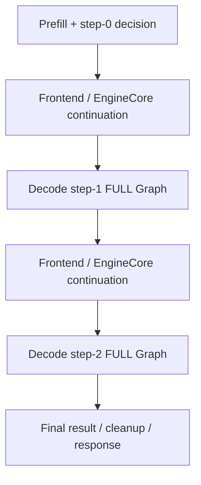
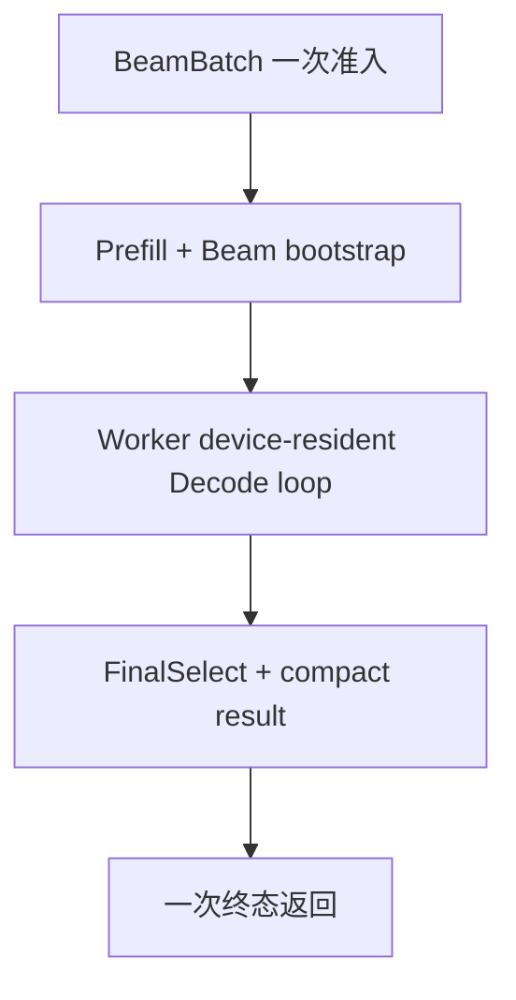

# OneRec-1.7B Beam Decode Profiling：瓶颈归因与优化路线

> 状态：Profiling Analysis / Optimization Input  
> 日期：2026-08-28  
> 关联实现：[JiusiServe/vllm-gr PR #310](https://github.com/JiusiServe/vllm-gr/pull/310)  
> 上游设计：[Serving / Offline 到 EngineCore 的 Beam Batch 入口设计](./serving_to_enginecore_batch_beam_entry_design.md)  
> 执行设计：[EngineCore 到 Scheduler 的原生 FCFS 与 Worker 一次执行设计](./enginecore_to_scheduler_beam_scheduling_design.md)  
> 范围：L20、OneRec-1.7B、Batch=1、input=1024、SID length=3、Beam width=128；分析 Prefill、Decode Full CUDA Graph、Constraint TopK、Beam 选择、Beam KV、Scheduler 和最终返回的完整关键路径。

---

## 0. 一页结论

PR #310 中的融合算子已经正确命中，设备侧 Beam 后处理本身不是当前主要瓶颈。

Nsight 的完整请求窗口约为 `134.788 ms`，其中 GPU 工作约 `52.641 ms`，剩余约 `82.147 ms` 来自 CPU 编排、CUDA launch envelope、同步、Scheduler、Frontend/EngineCore 往返及最终结果返回。

最重要的结论不是“继续融合某个几十微秒的 kernel”，而是：

1. 当前每个 Beam step 仍经过 Frontend → EngineCore → 新 Request → Prefix Cache → Scheduler → Worker 的完整往返。
2. Decode preprocess 每步重新构造 row mapping、position、attention metadata 和 sampling metadata。
3. Beam session 初始化逐层清空 KV Pool，产生 56 个极小 fill kernel。
4. `sample` 中存在由 Python list CUDA 高级索引触发的隐式 `cudaStreamSynchronize`，将尚未完成的 Decode Graph 等待错误归因到 `sample`。
5. `RecConstrainedTopK`、Beam selection、wire packing 和 state update 仍在 model-forward CUDA Graph 之外。
6. 最后一次 TopK 到 response 约 `24.440 ms`，而 GPU 工作仅 `0.062 ms`，终态返回路径需要单独整改。

Profiling 直接支持现有冻结设计：

> 一个 Beam Batch 只准入一次；Worker 在一次执行中完成 Prefill、全部 Decode step 和 Final Result；中间 step 不返回 Frontend，也不重新进入 Scheduler。

---

## 1. Profiling 合同与口径

### 1.1 测试合同

| 项目 | 配置 |
|---|---|
| GPU | NVIDIA L20 |
| 模型 | `OpenOneRec/OneRec-1.7B` |
| Batch | 1 |
| 输入长度 | 1024 tokens |
| SID length | 3 |
| Beam width | 128 |
| Prefix caching | 开启；独立请求前清空 |
| Decode Graph | 两次 BW128 FULL CUDA Graph replay |
| Graph 边界 | 仅 model forward；Beam postprocess 在 Graph 外 |

每个请求的执行序列为：

```text
1024-token Prefill
→ SID step-0 constrained TopK / Beam bootstrap
→ 128-token Decode FULL Graph
→ SID step-1 constrained TopK / Beam group
→ SelectUnsharedKV
→ 128-token Decode FULL Graph
→ SID step-2 constrained TopK / FinalSelect
→ Final response
```

### 1.2 两类 profiler 的用途不同

PyTorch trace 开启了：

```text
with_stack = true
record_shapes = true
profile_memory = true
```

它记录了大量 Python function event，适合定位调用链，但会显著放大 Python、allocator 和 launch 的 wall time。

因此本文采用：

- Nsight Systems：端到端阶段窗口、GPU kernel、CUDA Graph、copy 和真实 device work；
- PyTorch trace：定位 Python 调用链、隐式同步、Request/Scheduler 生命周期；
- 无 profiler E2E：作为最终性能验收口径。

不得将 PyTorch trace 中的 inclusive range 直接相加，也不能将 `sample` CPU range 等同于 sampler GPU compute。

---

## 2. 端到端关键路径账本

### 2.1 Nsight 阶段窗口

| 阶段窗口 | Wall time | GPU work | 非 GPU / launch / idle |
|---|---:|---:|---:|
| Prefill → step-0 TopK | 53.600 ms | 31.898 ms | 21.702 ms |
| step-0 TopK → step-1 TopK | 26.228 ms | 10.323 ms | 15.905 ms |
| step-1 TopK → step-2 TopK | 30.520 ms | 10.358 ms | 20.162 ms |
| step-2 TopK → response | 24.440 ms | 0.062 ms | 24.378 ms |
| 合计 | 134.788 ms | 52.641 ms | 82.147 ms |

这张表给出优化排序：

```text
第一优先级：Beam step 生命周期和最终返回
第二优先级：Decode preprocess / metadata / Graph 边界
第三优先级：Prefill Graph 外开销
最后：GEMM / Attention kernel 计算优化
```

### 2.2 当前关键路径



两个 `ROUND` 节点和 `FINAL` 节点几乎没有有效 GPU 计算，却占用了当前请求的大量时延。

---

## 3. P0：删除 Beam step 间 Frontend / EngineCore 往返

### 3.1 Trace 证据

PyTorch trace 中：

```text
step-0 sample 结束 → 下一次 BW128 execute 开始：约 15.6 ms
step-1 sample 结束 → 下一次 BW128 execute 开始：约 20.1 ms
```

主要组成包括：

| 操作 | step-0 → step-1 | step-1 → step-2 |
|---|---:|---:|
| 等待 Engine input queue | 约 4.5 ms | 约 12.6 ms |
| `_handle_beam_request_step_update` | 约 3.64 ms | 约 2.24 ms |
| Scheduler | 约 2.68 ms | 约 1.98 ms |
| Prefix cache lookup | 约 1.29 ms | 约 0.73 ms |
| 空 `execute_context_0(0)` | 多次 | 多次 |

### 3.2 当前 per-step Request 成本

每个中间 step 当前都会重新：

1. Worker 产生中间 Beam 结果；
2. Frontend 接收并构造 `BeamRequestStepUpdate`；
3. 通过 ZMQ 发送到 EngineCore；
4. EngineCore 遍历 Beam token / parent 数据；
5. 重新解析 GRConfig；
6. 创建新的 native `Request`；
7. 更新 block hashes；
8. 将 ADD 放入 Engine input queue；
9. PrefixCaching 再次查找 1024-token prefix；
10. Scheduler 重新 admission；
11. Worker 再次创建逻辑请求状态并执行下一步。

其中 `update_block_hashes()`、`get_computed_blocks()` 和 PrefixCaching 都不是 Beam 数学语义所要求的；它们只是“每步重新创建 Request”带来的框架成本。

### 3.3 整改方向

冻结方案应直接落地为：

```text
一次 BeamBatch admission
→ Prefill 一次
→ Worker 创建持久 Beam session
→ Worker 内部运行全部 Decode step
→ 只返回一次 Final Result
```

必须消除：

- 中间 step ZMQ continuation；
- 中间 step native Request 重建；
- 中间 step Prefix cache lookup；
- 中间 step Scheduler admission；
- 中间 step `execute_context_0(0)` 空 tick；
- 中间 step Beam 结果序列化和反序列化。

这也是本次 profiling 中预期收益最大的单项架构整改。

---

## 4. P0：整改 Final Result 返回路径

最后一次 TopK 后：

```text
GPU work：约 0.062 ms
TopK → response：约 24.440 ms
```

Worker trace 可见：

- `SamplerOutput` / `AsyncGPUModelRunnerOutput` 构造；
- bookkeeping；
- abort queue；
- session cleanup；
- 空 Scheduler / Worker tick。

但完整的 `24.440 ms` 并未全部包含在 rank0 Worker trace 中。Frontend 的 Beam 结果解码、对象构造、终态清理、API response 构造需要补充 profiling。

最终接口应只返回一次紧凑结果：

```text
token_ids : [B, W, SID_LEN]
scores    : [B, W]
status    : one terminal status per Beam Batch
```

验收要求：

- 一次 D2H；
- 一次 Worker → EngineCore/Frontend 消息；
- 一次 terminal cleanup；
- 不再使用额外空 tick 完成 abort/free；
- 不在 Frontend 重建中间 Beam graph。

当前三步总 D2H 只有约 3 KB，传输带宽不是瓶颈；协议和对象生命周期才是瓶颈。

---

## 5. P1：Decode preprocess 静态化

两个 BW128 Decode 的 `gpu_model_runner: preprocess` 分别约为：

```text
6.405 ms
6.357 ms
```

主要调用链：

| 子阶段 | 每步 PyTorch trace |
|---|---:|
| patched `_prepare_inputs` | 约 3.47 ms |
| `_beam_remap_inputs` | 约 1.20–1.32 ms |
| Attention metadata build | 约 1.89–1.94 ms |
| `_update_states` | 约 0.55 ms |

### 5.1 `_beam_remap_inputs`

每步重新创建：

- row-to-request mapping；
- logits-to-batch mapping；
- position segments；
- logits indices；
- request row configs；
- `InputBatchProxy`。

但目标 workload 固定为 `B=1`、`W=128`、`SID length=3`。绝大多数形状、stride 和映射可在启动或 capture 时确定。

整改要求：

- 预生成 position、row map 和 logits map 模板；
- 每步只更新 token、decode step 和有效长度；
- `logits_map` 常驻 device，禁止 Python list CUDA 高级索引；
- 不再每步创建 `InputBatchProxy`；
- persistent request 下不再重复 `add_request()` / `refresh_metadata()`。

### 5.2 Attention metadata

每步约包含：

```text
_create_beam_tensors：约 1.0 ms
_build_beam_mappings：约 0.42 ms
```

以下 buffer 应启动期预分配并保持固定地址：

- `cu_seqlens_q/k`；
- slot mapping；
- beam parent mapping；
- suffix lengths；
- block table；
- attention metadata object 及其 device tensors。

每步只允许固定地址上的 in-place 更新，并逐步纳入 Decode Graph。

---

## 6. P1：修复 `execute_context_1(128)` 前置 Beam 工作

`execute_context_1(128)_generation_0(0)` 不是一个独立 kernel。它是 vLLM profiler 对整个 `GPUWorker.execute_model()` 的外层 annotation：

```text
1 个 context request
128 个 scheduled tokens
0 个 generation request
```

当前 Beam decode step 使用新的 Engine Request，因此被 profiler 分类为 `context request`；这不代表它是 Prefill。实际 Graph dispatch 仍是 `FULL(num_tokens=128, uniform=True)`。

### 6.1 第一个 Decode：逐层清空 Beam KV Pool

`BeamSearchSession.begin_session()` 遍历28层：

```text
28 layers × K/V = 56 个 BF16 fill kernel
```

Trace 结果：

```text
GPU kernel compute：约 62 µs
加 metadata fill：约 65 µs
GPU annotation envelope：约 3.286 ms
```

问题本质是56次 Python/PyTorch/CUDA launch，而不是显存清零带宽。

优先验证：如果 attention 始终由 `decode_step` / sequence length 限定有效区域，且合法区域会在读取前被覆盖，则无需清空 KV payload，只需重置逻辑状态。

若必须清空：

- 将所有层组织成连续 `[L, B, W, H, S, D]` K/V buffer；
- K/V 各一次 `zero_()`；
- 或捕获一个 reset Graph。

### 6.2 后续 Decode：SelectUnsharedKV

```text
Python wrapper：约 0.987 ms
gather GPU：约 25.7 µs
scatter GPU：约 18.0 µs
```

整改要求：

- parent IDs 使用固定 device buffer；
- 不再 `torch.tensor(parent_beam_ids, device=...)`；
- aux/scratch 固定地址；
- 将 SelectUnsharedKV 放进下一步 Decode Graph；
- Worker 内部多步循环时，parent 直接来自上一步 device Beam decision，不经过 Host。

---

## 7. P1：修复 `sample` 的隐式同步并扩大 Graph 边界

### 7.1 `sample` 为何看起来很大

PyTorch trace 中三次 `sample`：

| SID step | CPU range | 主要同步等待 | `RecConstrainedTopK` GPU |
|---:|---:|---:|---:|
| 0 | 5.441 ms | 基本没有 | 约 185 µs |
| 1 | 10.925 ms | 约 5.499 ms | 约 9 µs |
| 2 | 11.315 ms | 约 5.533 ms | 约 8 µs |

两个 Decode step 中的长同步来自：

```text
InputBatchProxy.sampling_metadata
→ val[logits_map]
→ Python list 高级索引
→ H2D index copy
→ cudaStreamSynchronize
```

该同步等待的是前面已经 launch、但尚未在 GPU 上执行完成的 Decode Graph。因此模型 GEMM 和 FlashAttention 会在时间线上落入 `sample` window；这不是 sampler 在执行模型。

修复要求：

- B1场景直接使用 `[1]` temperature 广播；
- 多请求场景复用 device index tensor；
- 不在读取 `sampling_metadata` 时 remap 所有采样字段；
- `_temperatures_for_rows()` 只执行一次；
- 缓存 GRConfig 和 Backend 状态；
- `sample` 内不得出现由 metadata remap 触发的长 `cudaStreamSynchronize`。

### 7.2 融合算子仍不是一个 Graph

核心 device postprocess 共25次 launch：

- `RecConstrainedTopK`：3次；
- step-0 bootstrap：1次；
- hierarchical local TopK：2次；
- 六层 merge：12次；
- group/final output：2次；
- parent prefix：2次；
- sequence write：3次。

此外还有：

- wire packing：6个 kernel；
- validity、tensor materialization、bookkeeping：53个小 kernel。

因此“几个融合大算子”是语义级接口，不等于每个接口只有一个 CUDA kernel。

整改方向：

- 使用 `beam_search_group_cuda_out` / `beam_search_rec_final_select_cuda_out`；
- scratch/output/state/wire buffer 全部固定地址；
- 删除每步 `empty/zeros/full/cat`；
- 用 candidate count 驱动 Beam selection，避免单独构造完整 `valid_mask`；
- 将 token/parent packing 合入 group/final output；
- 分别捕获 step-0、step-1、step-2 postprocess Graph；
- 最终将 SelectUnsharedKV → model forward → constrained TopK → Beam decision 串成 Worker 内部固定执行链。

当前三步 postprocess envelope 约 `5.041 ms`，完整整改后的合理目标是三步合计约 `0.9–1.5 ms`。

---

## 8. P2：Prefill Graph 外开销

Prefill 阶段：

```text
Wall：约 53.600 ms
GPU work：约 31.898 ms
非 GPU / launch / prepare：约 21.702 ms
```

PyTorch trace 中可见：

| 子阶段 | 时间 |
|---|---:|
| preprocess | 约 13.2 ms |
| `_prepare_inputs` | 约 4.54 ms |
| input prep event synchronize | 约 3.26 ms |
| `_update_states` | 约 2.29 ms |
| attention metadata | 约 2.08 ms |

当前路线可继续保持 Prefill 复用原生 vLLM，但应逐步：

1. 缓存固定 metadata 结构；
2. 将 input preparation 提前并与调度/上一请求重叠；
3. 为高频长度捕获少量 Prefill bucket，例如1024；
4. 对1K–10K真实长度分布评估 padding成本，避免为每个长度单独捕图；
5. 优先考虑 piecewise/bucket Graph，不立即强制所有动态 Prefill 进入一个 Full Graph。

Prefill 优化不应阻塞 Decode run-to-completion 的主路径整改。

---

## 9. P3：模型 GPU 计算热点

主要 GPU 计算为：

| 热点 | GPU 时间 |
|---|---:|
| 主要 BF16 GEMM variants | 约 27.019 ms |
| 大 Prefill GEMM | 约 3.033 ms |
| FlashAttention | 约 2.260 ms |
| 两次 Decode Graph | 约 17.260 ms，约 8.63 ms/step |

这是完成 Host/协议优化后的主要计算下限。

后续可研究：

- L20上的GEMM kernel选择和shape tuning；
- MLP activation与相邻elementwise融合；
- CUTLASS split-K配置；
- Prefill与Decode分别选择GEMM策略；
- sliced logits是否仍处理了不需要的hidden rows。

当前不应优先投入这些优化，因为非GPU时间仍显著大于可从单个GEMM中获得的收益。

---

## 10. 不应优先优化的项目

| 项目 | 结论 |
|---|---|
| D2H/H2D带宽 | 数据量很小，不是瓶颈 |
| 约117 MB D2D | GPU时间仅约0.12 ms |
| `RecConstrainedTopK` kernel | 三步约0.20 ms |
| `SelectUnsharedKV` GPU计算 | gather+scatter约44 µs |
| hierarchical Beam merge GPU计算 | 仅几十微秒 |

这些路径需要减少 launch envelope 或纳入 Graph，而不是继续微调 kernel 算术。

---

## 11. 目标执行架构



Worker Decode loop 内部顺序：

```text
固定 metadata/state
→ 必要时 SelectUnsharedKV
→ Decode FULL Graph
→ RecConstrainedTopK
→ BeamSearchGroup / FinalSelect
→ device sequence/score/parent state 更新
→ 下一步或终态
```

中间状态必须保持在 device：

- cumulative scores；
- SID sequence；
- selected tokens；
- parent indices；
- decode step；
- valid counts；
- Beam KV state；
- fixed-address metadata。

Frontend 和 Scheduler 不参与中间step。

---

## 12. 实施顺序

### Phase 1：生命周期整改

1. Persistent Beam Request / Beam Batch；
2. Worker run-to-completion；
3. 删除中间 ZMQ continuation；
4. 删除每步 native Request、block hash和PrefixCaching lookup；
5. 删除中间空 Scheduler/Worker tick；
6. 一个终态结果和一次cleanup。

### Phase 2：Decode固定执行链

1. 固定 Beam/Attention/Sampling metadata；
2. 删除逐层 BeamKVPool reset或改为批量reset；
3. parent/token/step全部device-resident；
4. 修复temperature remap隐式同步；
5. 使用所有CUDA算子的out接口和固定scratch；
6. postprocess Graph；
7. 将SelectUnsharedKV并入下一步Graph。

### Phase 3：Prefill与模型计算

1. Prefill metadata缓存；
2. input prep异步重叠；
3. 1024等高频长度bucket Graph；
4. GEMM/Attention kernel tuning。

---

## 13. 验收指标

### 13.1 生命周期

- 一个 Beam Batch 只出现一次Scheduler admission；
- 中间step没有ZMQ continuation；
- 中间step没有native Request构造；
- 中间step没有`get_computed_blocks()`；
- 中间step没有`execute_context_0(0)`空tick；
- Worker只返回一次Final Result。

### 13.2 Decode Graph与后处理

- 每次Decode均命中BW128 FULL Graph；
- `sample` 内没有长 `cudaStreamSynchronize`；
- 没有逐层56个Beam Pool fill kernel；
- SelectUnsharedKV不再创建Host parent tensor；
- 三步postprocess Nsight wall time目标 `≤ 1.5 ms`；
- 后处理GPU work保持约 `0.3–0.5 ms`，不因Graph化引入额外大计算。

### 13.3 最终返回

- 最后一次TopK后只有一次紧凑D2H；
- 没有terminal空tick；
- 增加Frontend profiling，完整覆盖`worker_final_ready → api_response_ready`；
- 最终性能以无profiler E2E mean/P50/P90/P95和P99验收。

---

## 14. 最终判断

PR #310 已证明 Device Beam 后处理的数学路径和融合 kernel 可以正确工作，并已将核心GPU后处理压缩到亚毫秒级。

当前性能差距来自融合算子之外的系统边界：

```text
per-step Request生命周期
+ Frontend/EngineCore往返
+ Scheduler与PrefixCaching重复工作
+ Graph外动态metadata
+ 小kernel launch envelope
+ 最终终态返回
```

因此下一阶段不应继续以“再写一个更快的小kernel”为主线，而应落实已经冻结的 Worker run-to-completion 设计，并将完整Decode step逐步收敛为固定地址、device-resident、Graph-replayable的执行链。