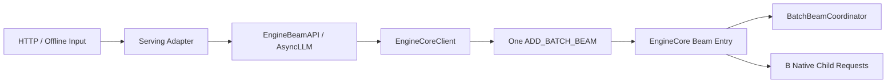
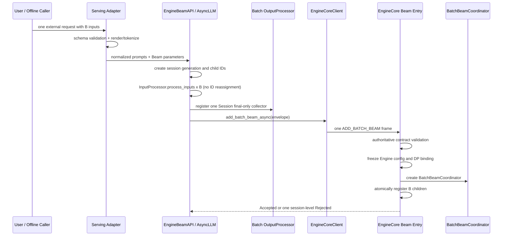

# Batch Beam：Serving 到 EngineCore 入口层设计

> 状态：Design / Frozen for discussion  
> 日期：2026-08-20  
> 关联 RFC：[Dual Prefill Barrier 与 Worker Run-to-Completion Decode](https://github.com/zhanghanleo10/vllm-gr/issues/35)  
> 范围：只定义 `Serving → EngineBeamAPI / AsyncLLM → EngineCore` 的输入、协议、身份、输出注册和取消边界；不展开 Scheduler、Prefill Barrier、ModelRunner 或 Worker Decode 的内部实现。

---

## 0. 一页结论

入口层冻结为：

> **一个业务 Batch Beam 请求，只向 EngineCore 发送一条组级 `ADD_BATCH_BEAM` 消息。**

Serving 不能把 B 个 item 拆成 B 次普通 `ADD`，也不能把一次 Beam Decode 拆成多次 `max_tokens=1` 请求。



三层职责：

| 层 | 核心职责 |
| --- | --- |
| Serving Adapter | 外部协议、render/tokenize、参数映射、最终输出格式化 |
| EngineBeamAPI / AsyncLLM | 创建内部身份、复用 InputProcessor、注册独立 Session final collector、组装原子 envelope |
| EngineCore Beam Entry | authoritative validation、冻结部署模式、创建 Coordinator、原子注册 B child、交给 Scheduler admission |

必须区分两种规模：

```text
入口层：B 个业务 item = B 个 native child Request
Worker：B × W 个 Beam row
```

入口层不能把 W 个 Beam 分支膨胀成 W 个普通 Request；`B × W` 只作为部署 envelope/capacity gate，真正的 Beam row 在 Worker Bootstrap 后产生。

明确不在该边界发生：

- Serving 端 Beam loop；
- Catalog/Trie/constraint candidate filtering；
- Top-W、parent、EOS completion 或 final select；
- Prefill Barrier、Prefix Cache lookup、PromptKV/BeamKV 分配；
- Worker handle、block table、完整 logits 或中间 Beam state 传输；
- per-step `BeamContinuation` / `WorkerBeamStepResult`。

---

## 1. 为什么不能继续使用当前 `ADD_BATCH`

当前 vllm-gr 的优化路径是：

```text
Serving Beam loop
→ 对 active beams 逐条 prepare_request
→ ADD_BATCH(list[EngineCoreRequest])
→ EngineCore 逐条 preprocess
→ Scheduler 逐条 add_request
→ 返回一步 logprobs
→ Serving 选择下一轮 Beam
```

当前 `ADD_BATCH` 只是多条 `EngineCoreRequest` 的传输优化，不具备业务 Batch Session 语义：

- 不携带 `batch_session_id`；
- 不知道预期 item 数 B；
- 无法表达 `beam_width`、`result_width` 和完整 Decode plan；
- EngineCore 逐条 preprocess，某个 child 失败时可能留下半组；
- DP client 可能按普通请求语义路由；
- Scheduler 看见的是互不相关的 Requests；
- output 与 cancel 退化为 B 份状态；
- 无法提供 group all-or-none admission。

因此新入口不是在 `ADD_BATCH` 上补几个 optional 字段，而是新增一个独立的组级消息类型。

### 1.1 当前可复用与必须替换的部分

可复用：

- Serving 的 chat template / render；
- upstream `InputProcessor.process_inputs()`；
- tokenizer、LoRA、MM input、cache salt、priority 等通用输入处理；
- OutputProcessor “先注册 collector，再发送请求”的顺序；
- EngineCoreClient 的 msgspec/ZMQ transport、client index 与 DP routing 基础设施。

必须替换：

- Serving 中的 per-step Beam loop；
- `SamplingParams(max_tokens=1, logprobs=W)` 对 Beam 的模拟；
- `ADD_BATCH(list[EngineCoreRequest])` 作为 Beam Session 入口；
- `BEAM_REQUEST_STEP_UPDATE`；
- B 个普通 output collectors；
- Serving 端 candidate/beam/final select。

---

## 2. 目标调用链



只有最后一个步骤完成后，Session 才能进入 Scheduler admission。任何入口错误都必须在“无 child 可见”或“全部 child rollback”状态下结束。

---

## 3. Serving Adapter 职责

Serving 只理解用户协议，不拥有 Engine 内部 Session 状态。

### 3.1 输入规范化

Serving 接收一个逻辑请求，其中包含 B 个业务输入：

```python
class PublicBatchBeamRequest:
    inputs: list[TextPrompt | TokensPrompt | ChatMessages]
    beam_width: int
    max_tokens: int
    n: int
    temperature: float
    ignore_eos: bool
    begin_token: str | None
    end_token: str | None
    logprobs: bool | int | None
    include_scores: bool
    include_parent_lineage: bool
```

外部协议可以来自：

- 专用 GR Online endpoint；
- OpenAI-compatible adapter；
- Offline `GRLLM` adapter。

如果 OpenAI Chat schema 无法自然表达 B 个业务 item，应新增 GR adapter，不应伪装为 B 次互相独立的 Chat 请求。

### 3.2 参数映射

入口必须把搜索宽度与返回宽度分开：

```text
beam_width             -> 内部搜索宽度 W
n                       -> output_spec.result_width
max_tokens              -> max_decode_steps
temperature             -> Beam score 使用的温度语义
logprobs/output flags   -> BeamOutputSpecV1
```

约束：

```text
B > 0
beam_width > 0
0 < result_width <= beam_width
max_decode_steps > 0
temperature is finite and >= 0
```

当前把 `n` 直接解释成 `beam_width` 的行为必须停止。`n` 是返回多少条结果，不应隐式改变内部搜索宽度。

### 3.3 Token 与模型语义

Serving 负责：

- chat template / render；
- tokenizer 编码；
- `begin_token` / `end_token` 转 token ID；
- tokenizer vocabulary 范围校验；
- 模型支持的 input 类型校验；
- stop/EOS 的外部语义规范化；
- tokenization failure 转为用户可理解的 4xx 错误。

EngineCore 不接收 raw chat messages、tokenizer 对象或 token 字符串。

### 3.4 Serving 不得决定的字段

以下字段来自部署/Engine 配置，不属于用户请求：

- `prefill_barrier_mode`；
- Worker / graph gear；
- BeamKV capacity；
- DP replica；
- Prefix Cache policy；
- Constraint Artifact path、digest 或 handle。

当前只支持模型级 default Constraint Resource。外部请求不需要携带 `resource_id`；如果兼容协议允许传入，V1 只能接受缺省值或 `"default"`。

---

## 4. EngineBeamAPI / AsyncLLM 职责

EngineBeamAPI 是 Serving 与 EngineCore 之间的内部 Engine frontend。它可以与 Serving 位于同一进程，但责任上不属于 HTTP 协议层。

### 4.1 三层身份与 generation

```text
external_request_id
    用户/Serving 看到的请求身份；只保存在 Frontend collector 映射

(batch_session_id, session_generation)
    Engine 内唯一的业务 Batch Session incarnation 身份

child_request_id[i]
    B 个 native child Request 身份
```

推荐生成方式：

```python
batch_session_id = new_internal_uuid()
session_generation = 0
child_request_id = f"{batch_session_id}:{item_index}"
```

规则：

- 用户只能控制 `external_request_id`，不能注入 Session 或 child ID；
- `external_request_id` 不进入 EngineCore wire，由 Frontend 以 `(session_id, generation) -> external_request_id` 映射持有；
- `(batch_session_id, session_generation)` 在发送前产生，用于 collector、cancel、DP sticky 和 final routing；
- item index 必须唯一且连续覆盖 `[0, B)`；
- child ID 必须由 EngineBeamAPI 确定性生成；
- child ID 生成后不得再经过 upstream `assign_request_id()`，否则会被随机化并破坏 Session mapping；
- EngineCore 必须重新校验 identity mapping。

### 4.2 复用原生 InputProcessor

对 B 个 item 分别调用 upstream `InputProcessor.process_inputs()` 完成输入规范化，再使用已派生的 child ID 构造 native `EngineCoreRequest`：

```python
processed_inputs = tuple(
    input_processor.process_inputs(normalized_prompt)
    for normalized_prompt in items
)

child_requests = tuple(
    build_engine_core_request(
        request_id=f"{batch_session_id}:{item_index}",
        processed_inputs=processed,
        params=derive_native_prefill_params(beam_runtime_params),
        lora_request=common_lora,
        priority=common_priority,
        trace_headers=trace_headers,
        ...,
    )
    for item_index, processed in enumerate(processed_inputs)
)
```

这样可以继续复用：

- prompt token IDs / prompt embeds；
- multimodal features；
- LoRA request；
- cache salt；
- arrival time、priority、trace headers；
- supported-task 与 max-model-length 输入检查。

Beam 搜索语义不能继续寄存在 `SamplingParams.n`、`max_tokens=1` 或 `logprobs=W` 中。它们必须由独立 `BeamRuntimeParamsV1` 表达。native child 的 params 只服务于原生 Request 构造/Prefill 兼容，必须由 `BeamRuntimeParamsV1` 确定性派生并由 EngineCore 校验，不能成为 temperature、EOS 或 decode length 的第二权威。

### 4.3 同质性要求

MVP 要求同一组 B 个 child 使用相同：

- model / tokenizer；
- LoRA adapter（通常为 `None`）；
- priority policy；
- cache policy；
- Beam width / decode steps / output spec；
- default constraint resource；
- DP replica。

不满足时应拆为不同 Batch Session 或直接拒绝，不能让 WorkerRun 内部出现多套模型执行配置。

### 4.4 Final-only collector

EngineBeamAPI 只注册一个独立的 Session 级 collector：

```python
collector_registry[(batch_session_id, session_generation)] = (
    BatchBeamOutputCollector(
    external_request_id=external_request_id,
    batch_session_id=batch_session_id,
    session_generation=session_generation,
    output_spec=output_spec,
    )
)
```

顺序必须是：

```text
prepare all B children
→ validate local envelope
→ register one collector
→ send ADD_BATCH_BEAM
```

不能先发送再注册，否则 EngineCore 快速失败或快速完成时，结果可能先于 collector 到达。

B 个 child 不注册 B 个普通 `RequestOutputCollector`，也不向 Serving 暴露中间 child output。这个 registry 不能通过原生 `OutputProcessor.add_request()` 伪装成普通请求；Batch Final 的 payload 和状态机不同，必须由独立 demux/registry 接管。

### 4.5 本地失败的事务语义

- B 个 item 中任一 render/tokenize/InputProcessor 失败：不发送任何 EngineCore 消息；
- collector 注册失败：不发送；
- 发送前 validation 失败：注销 collector 并返回一个 batch-level error；
- send 明确失败且请求确认未进入 transport：注销 collector；
- send 结果不确定：保留 collector 与 Session route，best-effort 发送带相同 `(session_id, generation)` 的 abort，并等待终态或有界超时回收；不能重新生成新 Session 自动重试。

---

## 5. EngineCore Wire 协议

### 5.1 独立消息类型

新增：

```text
ADD_BATCH_BEAM
ABORT_BATCH_BEAM
```

迁移期必须分配新的 wire value，例如：

```text
0x06  ADD_BATCH                 # legacy，暂时保留
0x07  BEAM_REQUEST_STEP_UPDATE  # legacy，暂时保留
0x08  ADD_BATCH_BEAM            # new
0x09  ABORT_BATCH_BEAM          # new
```

实际值以合入时的 enum inventory 为准，但禁止复用 `0x06/0x07`。否则滚动升级期间，旧进程可能使用旧 schema 解读新 payload。

删除目标路径对以下消息的依赖：

```text
ADD_BATCH(list[EngineCoreRequest])
BEAM_REQUEST_STEP_UPDATE
```

`ADD_BATCH_BEAM` 是一条逻辑命令和一个原子 admission envelope；它不是多条 `ADD` 的打包。

### 5.2 Beam 参数协议

```python
class BeamRuntimeParamsV1(msgspec.Struct, frozen=True):
    beam_width: int
    max_decode_steps: int
    temperature: float
    eos_token_id: int | None
    begin_token_id: int | None
    end_token_id: int | None
    ignore_eos: bool
    include_stop_token: bool
    resource_id: str = "default"


class BeamOutputSpecV1(msgspec.Struct, frozen=True):
    wire_version: int
    result_width: int
    logprobs_mode: str
    top_logprobs: int
    include_scores: bool
    include_parent_lineage: bool
```

`prefill_barrier_mode` 不出现在该协议中。EngineCore 从 `GRBeamRuntimeConfig` 读取并在 Session 创建时冻结。

### 5.3 Item 与 Admission Envelope

推荐让 native `EngineCoreRequest` 成为 Prompt 及通用执行属性的唯一权威：

```python
class EngineCoreBatchBeamItemV1(msgspec.Struct, frozen=True):
    item_index: int
    request: EngineCoreRequest


class EngineCoreBatchBeamRequestV1(msgspec.Struct, frozen=True):
    protocol_version: int
    batch_session_id: str
    session_generation: int
    items: tuple[EngineCoreBatchBeamItemV1, ...]
    beam_params: BeamRuntimeParamsV1
    output_spec: BeamOutputSpecV1

    client_index: int = 0
    current_wave: int = 0
    data_parallel_rank: int | None = None
```

外部 `external_request_id` 不进入该 envelope；Frontend 只凭 `(batch_session_id, session_generation)` 将 Accepted/Rejected/Final 映射回用户身份。

`EngineCoreRequest` 内已有：

- internal/external request identity；
- prompt token IDs / embeds / MM features；
- LoRA、cache salt；
- arrival、priority、trace headers；
- DP routing metadata。

如果 upstream `EngineCoreRequest` 结构要求 child `external_req_id`，它也必须由 `(session_id, generation, item_index)` 内部派生，不能复制用户的 group `external_request_id`，更不能作为 Frontend output routing 的权威。

不要在 `BatchBeamItemV1` 再复制一份 `prompt_token_ids`、`child_request_id` 或 LoRA 字段，否则产生两份权威。如果为了兼容 PR #292 暂时保留重复字段，EngineCore 必须逐 item 强校验完全相等，随后只使用 native request 中的数据。

### 5.4 Transport 规则

- 整个 envelope 使用一个 map-like msgspec schema（不启用 `array_like=True`）和一个 wire version，避免字段顺序成为脆弱 ABI；
- 一个 frame 解码失败时，不得产生任何 child；
- `ADD_BATCH_BEAM` 使用专用 typed `MsgpackDecoder(EngineCoreBatchBeamRequestV1, oob_tensor_provider=...)`，不走 generic/raw-list decoder；
- `client_index/current_wave` 由 EngineCoreClient 注入，不接受用户控制；
- envelope 中的 B 个 child 必须路由到同一个 EngineCore / DP replica；
- transport 不携带 tokenizer、Trie、Constraint Artifact、Worker handle、KV block ID 或 device tensor；
- 大型 prompt embeds / MM tensor 继续复用 upstream MsgpackEncoder、Tensor IPC 与 OOB tensor provider，不能在新协议中退化为复制大 payload；
- 发送端必须持有 envelope/backing tensor，直到 ZMQ `MessageTracker` 标记发送完成，不能让 backing buffer 提前释放；
- MVP 若只支持纯 token OneRec，必须在 Frontend 明确拒绝 embeds/MM，而不是静默丢弃或从 token IDs 重建。

### 5.5 Session 控制消息

所有 Session 生命周期消息使用同一关联键：

```python
class BatchBeamSessionKeyV1(msgspec.Struct, frozen=True):
    batch_session_id: str
    session_generation: int


class BatchBeamAcceptedV1(msgspec.Struct, frozen=True):
    key: BatchBeamSessionKeyV1
    protocol_version: int


class BatchBeamRejectedV1(msgspec.Struct, frozen=True):
    key: BatchBeamSessionKeyV1
    code: str
    message: str
    retryable: bool
    failed_item_index: int | None = None
```

`Accepted` 是 EngineCore 原子 commit 的确认，不是容量准入成功，也不承诺立即执行。Frontend 在收到 Accepted 前发生 timeout/disconnect 时仍保留 collector/route，并用同一个 key 发送幂等 abort；不能把 ZMQ send 完成当作 EngineCore commit。

---

## 6. EngineCore Beam Entry 职责

推荐入口：

```python
def add_batch_beam_request(
    self,
    request: EngineCoreBatchBeamRequestV1,
) -> None:
    ...
```

### 6.1 Authoritative validation

EngineCore 必须重新验证，而不能信任 Serving：

#### Envelope

- protocol/output wire version；
- `(batch_session_id, session_generation)` 合法且当前未被冲突占用；
- items 非空；
- items 已按 `item_index` 排序，indices 唯一且恰好为 `0..B-1`；
- child request IDs 唯一且符合 session mapping；
- B 与部署 `max_batch_size`；
- `beam_width`、`max_decode_steps`、`result_width`；
- `B × W <= max_decode_rows`；
- `resource_id == "default"`；
- mode 与部署支持能力一致。

#### Native children

- prompt 有效且未超过模型 envelope；
- B 个 child 的 model/LoRA/task/DP rank 等同质；
- child request 尚未存在；
- arrival/priority/cache/trace metadata 合法；
- prompt tokens 只有一个权威来源；
- child native params 与 `BeamRuntimeParamsV1` 的确定性派生规则一致；
- 所有 child 的 `data_parallel_rank` 完全相同（包括均为 `None`），并与 envelope Session route 一致。

运行时显存、PrefixKV、BeamKV、workspace 等实际 capacity admission 仍属于后续 Scheduler/Runtime 阶段；入口只做 schema 与部署 envelope gate。

### 6.2 冻结部署决策

EngineCore 创建 Session 时注入：

```python
resolved = ResolvedBatchBeamPlan(
    batch_session_id=request.batch_session_id,
    session_generation=request.session_generation,
    prefill_barrier_mode=config.prefill_barrier_mode,
    resource_id=config.default_resource_id,
    dp_rank=chosen_dp_rank,
    ...,
)
```

用户不能为某个请求选择 `worker_atomic` / `engine_coordinated`，也不能在运行中切换。

### 6.3 原子创建

入口事务：

```text
validate complete envelope
→ reserve Coordinator identity/tombstone
→ preprocess/construct all B native child Request objects in a private staging area
→ validate complete child set and build group admission plan
→ publish Coordinator + child mapping atomically
→ enqueue one group admission object
```

任一步失败：

```text
remove unpublished objects
→ release staged MM/grammar/OOB resources
→ rollback identity reservation
→ emit one batch-level failure
→ expose zero child to Scheduler
```

禁止：

```python
for child in request.items:
    scheduler.add_request(child.request)
```

因为循环中途失败会破坏 all-or-none 语义。EngineCore 应向 Scheduler 提交一个组级 `BatchBeamAdmission` 对象，或使用具有 rollback 的原子 group API。

Input socket thread 只做 decode、校验和提交，不在这里等待 KV/运行容量或执行模型。MP、Inproc 与 Sync client 必须复用同一 Core handler，不能各自复制一套逐 child 逻辑。

### 6.4 Duplicate 与幂等

MVP 建议：

- 首次 `((batch_session_id, generation), payload_digest)`：创建；
- 相同 Session incarnation + 相同 digest 的重复 START：返回现有 Session/Accepted 状态，不重复创建；
- 相同 Session incarnation + 不同 digest：协议冲突，fail closed；
- terminal tombstone 存在时的 late START：返回既有终态或拒绝，不能复活；
- 一个 session 只绑定一个 output collector owner/client index。

如果初版不实现同 payload 的幂等重放，也必须至少拒绝所有 duplicate session ID，不能创建第二份工作。

---

## 7. DP 路由

一个 Batch Session incarnation 必须整体绑定同一 DP replica：

```text
EngineCoreClient chooses one DP target for the envelope
→ all B child IDs map to that target
→ EngineCore freezes dp_rank in (session_id, generation)
→ cancel/final/late message use the same binding
```

Serving 不应通过公共请求指定 `data_parallel_rank`。选择发生在 EngineCoreClient / DP load balancer：

- 以整个 Batch 为负载单位；
- 不能对 B 个 child 分别调用普通 load balancing；
- 路由表以 `(batch_session_id, session_generation)` 为主键；
- child IDs 只作为 Session 内部成员；
- EngineCore 必须校验所有 native child 的 DP metadata 一致。

DP load accounting 必须按这次 Session 实际提交的 B 个 Scheduler children 记账，不能沿用“只把第一个 child 算入负载”的旧批量路径。

发送失败时，不能把同一个 Session 的部分 child 重路由到另一 replica。

---

## 8. Final Output 与 Cancel

### 8.1 Final-only 输出

EngineCore 对该入口只产生：

```text
BatchBeamAcceptedV1 / BatchBeamRejectedV1
BatchBeamFinalResult
BatchBeamFailure
```

不产生：

- B 个普通 RequestOutput；
- Prefill progress；
- per-step logits/candidates/tokens/parents；
- Barrier ready mask；
- WorkerStepResult。

所有控制与终态消息都携带 `(batch_session_id, session_generation)`。`Accepted` 只表示 EngineCore 已完成原子注册，不表示已获得 Scheduler/KV/Worker 运行容量。Final result 通过该键找到一个 collector，再映射回 `external_request_id`。

### 8.2 Group cancel

新增：

```python
class AbortBatchBeamRequestV1(msgspec.Struct, frozen=True):
    batch_session_id: str
    session_generation: int
    client_index: int
    reason: str | None = None
```

语义：

- 外部 disconnect/cancel 只发送一次 group abort；
- MVP 不支持单 item cancel；
- duplicate cancel 幂等，unknown/terminal Session 为安全 no-op 或返回已有终态；
- cancel 与 START/FINAL 并发由 EngineCore Coordinator 线性化；
- Serving 不需要知道 B 个 child IDs；
- EngineCore 将 group abort 展开为 child stop/drain/teardown。

MP 模式下，abort 要同时进入 eager abort 通道和有序 input 通道，复用原生 ABORT 的竞态处理原则：前者尽快停止工作，后者保证相对于 ADD 的有序生命周期记录。终态只能向 Session collector 投递一次。

---

## 9. Validation 所有权

| 检查 | Serving | EngineBeamAPI | EngineCore |
| --- | --- | --- | --- |
| HTTP/OpenAI schema | authoritative | - | - |
| chat template/tokenize | authoritative | 可复用 InputProcessor | 不处理 raw text |
| B/W/D/result-width 基础关系 | early reject | validate | authoritative revalidate |
| begin/end token 字符串 | 转 token ID | validate IDs | validate integer/range contract |
| child ID | 不接触 | 生成 | authoritative validate |
| session/generation | 不接触内部 ID | 生成/注册独立 collector | reserve/duplicate/tombstone gate |
| barrier mode | 不允许传 | 不允许覆盖 | 从 Engine config 冻结 |
| Prefix/Beam KV capacity | 不检查 | 不检查 | 后续 admission owner |
| DP target | 不指定 | EngineCoreClient 选择 | 冻结/校验 |
| LoRA/MM/task 同质性 | 可 early reject | validate | authoritative revalidate |
| constraint resource | 缺省/default | 注入内部 default | authoritative default binding |
| final output formatting | authoritative | collector/routing | 只返回内部 FinalResult |

两次校验不是重复浪费：Serving 提供快速用户错误；EngineCore 保护跨进程信任边界和运行时配置。

---

## 10. 当前代码迁移

### 10.1 Serving

当前相关文件：

- `vllm_gr/entrypoints/openai/serving_engine.py`
- `vllm_gr/entrypoints/openai/protocol.py`
- `vllm_gr/entrypoints/gr.py`

调整：

- 删除/停用 `_add_batch_step()` 和 `_beam_request_step()` 的目标路径；
- 删除 Serving per-step candidate/beam/final selection；
- 新增 `prepare_batch_beam_request()`；
- 明确 `beam_width` 与 `n/result_width`；
- Online/Offline 复用同一个 `EngineBeamAPI.add_batch_beam_request()`；
- Serving 只适配 final result。

### 10.2 AsyncLLM / EngineBeamAPI

当前相关文件：

- `vllm_gr/v1/engine/async_llm.py`
- upstream `vllm/v1/engine/async_llm.py`

新增：

```text
prepare_batch_beam_request
add_batch_beam_request
register_batch_beam_output（独立 registry，不复用普通 OutputProcessor）
abort_batch_beam_request
```

复用 InputProcessor，但不注册 B 个普通 collectors。

### 10.3 Core client / codec / wire

当前相关文件：

- `vllm_gr/v1/engine/core_client.py`
- `vllm_gr/v1/engine/codec.py`
- `vllm_gr/v1/engine/wire.py`
- `vllm_gr/v1/engine/core_client_patch.py`

建议新增 `vllm_gr/v1/engine/batch_beam_types.py`，集中定义 Session envelope、Accepted/Rejected/Final/Abort 等 V1 types。

新增：

```text
EngineCoreRequestType.ADD_BATCH_BEAM
EngineCoreRequestType.ABORT_BATCH_BEAM
EngineCoreBatchBeamRequestV1 decoder
AbortBatchBeamRequestV1 decoder
add_batch_beam_async
abort_batch_beam_async
session_routes[(session_id, generation)]
```

新 wire value 先与旧 `ADD_BATCH/BEAM_REQUEST_STEP_UPDATE` 并存；删除目标路径对旧消息的依赖后，再单独安排 legacy 清理。CoreClient 负责 Session 级 DP affinity、按 B 更新负载，并在 MessageTracker 完成前保留 OOB backing resources。

### 10.4 EngineCore entry

当前相关文件：

- `vllm_gr/v1/engine/core.py`
- `vllm_gr/v1/engine/engine_core_patch.py`

新增：

```text
preprocess_add_batch_beam
handle_add_batch_beam
handle_abort_batch_beam
BatchBeamCoordinator registry
atomic child registration / rollback
batch-level output path
Accepted / Rejected demux
```

当前 `ADD_BATCH` 逐条转换为普通 `ADD` 的路径不能复用为新的 Session admission。

### 10.5 PR #292 Contract 调整

保留：

- Beam/output version；
- beam width、decode steps、temperature、special token IDs；
- `BeamOutputSpecV1`；
- CPU Beam reference。

调整：

- 将纯 Beam 参数拆为 `BeamRuntimeParamsV1`；
- EngineCore wire 使用 `EngineCoreBatchBeamRequestV1`；
- Prompt 以 native child `EngineCoreRequest` 为唯一权威；
- `child_request_id` 由 EngineBeamAPI 生成，不由用户协议提供；
- 删除 Serving/EngineCore 稳态中的 continuation、fragment、step result。

### 10.6 推荐实施顺序

1. **Contract / codec**：落 V1 types、新 wire values、专用 decoder、OOB round-trip 测试；旧 `0x06/0x07` 保持不变。
2. **EngineCore entry**：实现 prepare-all / commit-once、Session tombstone、Accepted/Rejected 和 fake group admission。
3. **CoreClient / Frontend registry**：实现一次 DP route、Session affinity、独立 final collector、group abort。
4. **Serving cut流**：Online/Offline 都只调用 `add_batch_beam_request()`，停止发送 step update。
5. **Legacy cleanup**：在消息计数和端到端测试证明新流量不再依赖旧路径后，再弃用 Serving Beam loop 与 `BEAM_REQUEST_STEP_UPDATE`。

该顺序允许先用 fake Scheduler 验证入口原子性，不必等待 Prefill Barrier 和 Worker Decode 全部完成。

---

## 11. 错误模型

入口错误全部是 batch-level：

| 阶段 | 示例 | 结果 |
| --- | --- | --- |
| Serving | tokenization、非法 begin/end、参数关系错误 | 4xx / Offline validation error；不发送 |
| EngineBeamAPI | item prepare 失败、collector 注册失败 | 本地 batch failure；不发送 |
| Wire | schema/version/decode 失败 | EngineCore batch reject；零 child 可见 |
| EngineCore validation | duplicate ID、超 envelope、LoRA/DP mismatch | batch reject；零 child 可见 |
| Atomic registration | child 构造中途失败 | 全部 rollback；一个 failure |
| Send outcome unknown | timeout/connection interruption | 保留 collector；按 session query/abort，不自动重发新 ID |

错误输出至少包含：

```python
class BatchBeamEntryFailureV1:
    batch_session_id: str
    session_generation: int
    code: str
    message: str
    retryable: bool
    failed_item_index: int | None
```

`failed_item_index` 只用于定位入口数据错误，不代表允许其他 items 继续运行。

---

## 12. 验收测试

### 12.1 Contract / Serialization

- `EngineCoreBatchBeamRequestV1` msgspec round-trip；
- map-like schema 与 nested `EngineCoreRequest` 字段 contract；
- 包含 prompt embeds/MM OOB tensor 的 round-trip 与 MessageTracker 生命周期；
- B=1、B>1；
- empty/non-contiguous/duplicate item index；
- duplicate child ID；
- unknown protocol/output version；
- invalid B/W/D/result width/temperature；
- mode 字段无法由 wire 注入；
- non-default resource fail closed；
- native request 与 batch identity mismatch。

### 12.2 Atomicity

- B 个 item 中第 N 个 InputProcessor 失败时发送次数为 0；
- EngineCore 第 N 个 child preprocess 失败时 Scheduler 可见 children 为 0；
- duplicate START 不创建第二个 Coordinator/child set；
- 相同 `(session, generation)` 的 Add/Accepted/Rejected/Abort/Final 正确关联；
- conflicting duplicate payload fail closed；
- `ADD_BATCH_BEAM` 只能形成一个 group admission object。

### 12.3 Output / Cancel

- collector 注册严格早于 send；
- collector 使用独立 Session registry，而非原生单请求 OutputProcessor；
- B 个 child 不产生普通 frontend outputs；
- 一个 Session 只发布一次 final/failure；
- disconnect 只发送一次 `ABORT_BATCH_BEAM`；
- duplicate cancel 幂等；
- cancel 与 fast reject / final 并发时不丢失、不双投递；
- late result 不复活终态 collector。

### 12.4 DP / Transport

- 一个 envelope 只选择一个 DP target；
- B 个 child 均绑定同一 target；
- DP load accounting 按 B 记账；
- cancel/final 使用同一路由；
- send 失败不产生跨 replica 半组；
- OOB tensor/large MM input 不退化为 inline copy；
- spawn/MP/inproc 三种 client 路径协议一致。

### 12.5 Legacy Removal

- 新入口不调用 `_beam_request_step()`；
- 新入口不发送 `BEAM_REQUEST_STEP_UPDATE`；
- 不构造 `max_tokens=1, logprobs=W` 的 Beam 模拟请求；
- Serving 不执行 catalog filter、Top-W 或 final select；
- EngineCore 输入消息数：每 Session 一个 START，而不是每 step / 每 item 一个 ADD。

---

## 13. 非目标与后续边界

本文不定义：

- Scheduler 如何实现 `worker_atomic` group admission；
- `engine_coordinated` 的 Prefill ready mask；
- PromptKV/BeamKV 的具体 allocator；
- Worker `InlinePrefillPlan | ReadyPrefillHandles`；
- Bootstrap、Decode loop、final select；
- Device Constraint Table；
- CUDA/ACL Graph；
- TP/PP Worker 内 collective；
- Decode 运行中的 cancel flag；
- multi-session Worker batch；
- Decode micro-batch。

入口层只保证下游获得一个完整、稳定、可取消、可关联输出的 Batch Session admission 对象。

---

## 14. 最终冻结决策

1. 一个业务 Batch Beam 请求只发送一条 `ADD_BATCH_BEAM`。
2. Serving 只负责外部协议、render/tokenize、参数映射与最终格式化。
3. EngineBeamAPI 创建 `(batch_session_id, session_generation)` 和 child IDs，并复用 native InputProcessor；child ID 不再经 `assign_request_id()` 改写。
4. B 个 child 只注册一个 final-only collector。
5. Prompt 与 LoRA/MM/cache/priority 等通用字段以 native `EngineCoreRequest` 为唯一权威。
6. Beam 搜索语义由独立 `BeamRuntimeParamsV1` / `BeamOutputSpecV1` 表达，不借用 `SamplingParams.n`。
7. `prefill_barrier_mode` 来自 Engine 配置，不允许请求覆盖。
8. EngineCore authoritative validation 后原子创建 Coordinator 和 B child；失败全部 rollback。
9. 一个 Session 固定一个 DP replica，Serving 不指定 rank。
10. Cancel 只以 `(batch_session_id, session_generation)` 为单位；MVP 不支持单 item cancel。
11. 入口不传输 Trie、Constraint Artifact、Worker handle、KV metadata、logits 或 per-step Beam state。
12. 当前 `ADD_BATCH` 与 `BEAM_REQUEST_STEP_UPDATE` 不作为新架构入口协议。

---

## 15. 代码依据

- [当前 GR Serving Beam loop](https://github.com/JiusiServe/vllm-gr/blob/975cb95f7890cc9c0614ca27a4bd093d0bba7c91/vllm_gr/entrypoints/openai/serving_engine.py#L196-L410)
- [当前 GR `_add_batch_step`](https://github.com/JiusiServe/vllm-gr/blob/975cb95f7890cc9c0614ca27a4bd093d0bba7c91/vllm_gr/entrypoints/openai/serving_engine.py#L61-L93)
- [当前 GR AsyncLLM `prepare_request`](https://github.com/JiusiServe/vllm-gr/blob/975cb95f7890cc9c0614ca27a4bd093d0bba7c91/vllm_gr/v1/engine/async_llm.py#L21-L100)
- [当前 GR `ADD_BATCH` codec](https://github.com/JiusiServe/vllm-gr/blob/975cb95f7890cc9c0614ca27a4bd093d0bba7c91/vllm_gr/v1/engine/codec.py#L25-L50)
- [当前 PR #292 Batch contract](https://github.com/JiusiServe/vllm-gr/blob/638f8c672fe1caecade350390ad9726d54d81c95/vllm_gr/v1/beam/contracts.py#L69-L102)
- [upstream vLLM AsyncLLM request preparation](https://github.com/vllm-project/vllm/blob/v0.22.1/vllm/v1/engine/async_llm.py#L280-L412)
- [upstream vLLM EngineCoreRequest](https://github.com/vllm-project/vllm/blob/v0.22.1/vllm/v1/engine/__init__.py#L77-L137)
- [upstream vLLM EngineCore add request entry](https://github.com/vllm-project/vllm/blob/v0.22.1/vllm/v1/engine/core.py#L337-L373)
