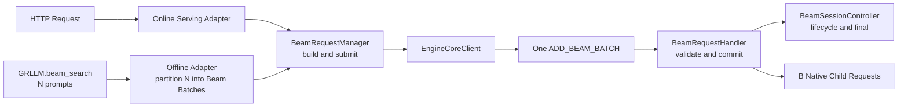
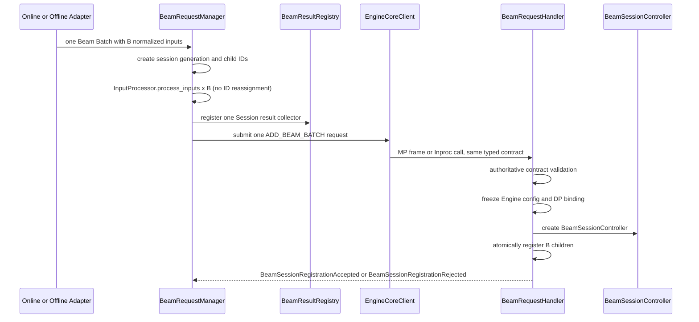

# Beam Batch：Online / Offline Frontend 到 EngineCore 入口层设计

> 状态：Design / Frozen for discussion  
> 日期：2026-08-20  
> 关联 RFC：[Dual Prefill Barrier 与 Worker Run-to-Completion Decode](https://github.com/zhanghanleo10/vllm-gr/issues/35)  
> 范围：定义 Online Serving 与 Offline `GRLLM/LLM` 如何通过统一的 `BeamRequestManager` 进入 EngineCore，包括输入、协议、身份、结果收集和取消边界；不展开 Scheduler、Prefill Barrier、ModelRunner 或 Worker Decode 的内部实现。

---

## 0. 一页结论

入口层冻结为：

> **Online 和 Offline 共用同一个协议；每个 B-item Beam Batch 只提交一条 `ADD_BEAM_BATCH`，EngineCore 为它注册一个 Beam Session。**

Online Serving 和 Offline `GRLLM` 都不能把 B 个 item 拆成 B 次普通 `ADD`，也不能把一次 Beam Decode 拆成多次 `max_tokens=1` 请求。



分层职责：

| 层 | 核心职责 |
| --- | --- |
| Online Serving Adapter | HTTP/OpenAI 协议、render/tokenize、在线取消与响应格式化 |
| Offline GRLLM Adapter | 同步调用、N→Session 分组、结果顺序恢复、异常/中断清理 |
| `BeamRequestManager` | 创建内部身份、复用 InputProcessor、注册 Session 结果收集器、组装并提交一个原子请求 |
| `BeamRequestHandler` | 权威校验、冻结部署模式、创建 Session Controller、原子注册 B 个 child、交给 Scheduler 准入 |

必须区分三种规模：

```text
Offline API call：N 个输入（可能包含多个 Session）
单个 Session：B 个业务 item = B 个 native child Request
Worker：B × W 个 Beam row
```

`N`、`B`、`W` 不能混淆：Offline 一次调用的 N 个输入可按容量分为多个 B-sized Session；入口层不能把 W 个 Beam 分支膨胀成 W 个普通 Request。`B × W` 只用于部署上限检查，真正的 Beam row 在 Worker Bootstrap 后产生。

### 0.1 命名与模块边界

新增名称遵循“看名字就知道谁负责什么”的规则：

- vllm-GR 新增的领域类型统一以 `Beam` 开头，再用范围和职责作后缀，例如 `BeamRequestHandler`、`BeamAsyncResultCollector`；
- `Job`：Offline 一次 N-input Python 调用，只存在于 Offline Adapter；
- `Batch`：一次提交的 B 个业务输入，是 wire request 和 Scheduler group 的组边界；
- `Session`：这个 Batch 在 EngineCore 内的身份与生命周期；
- `Child`：Batch 中一个 native `EngineCoreRequest`；
- `registration`：EngineCore 完成原子发布；`admission`：Scheduler 接受运行容量。两者不能混用；

- 类型名不携带版本号后缀；顶层 wire message 统一携带 `protocol_version`，codec 解码后校验该字段；
- `RequestManager` 属于 Frontend，负责准备、身份、结果注册和提交；
- `RequestHandler` 属于 EngineCore，负责信任边界校验与原子提交；
- `SessionController` 属于 EngineCore，负责一个 Session 的生命周期、取消和单次终态；
- `ResultRegistry` 负责按 Session key 路由，`ResultCollector` 负责把内部终态交还给 Online 或 Offline 调用者；
- `SchedulingGroup` 是 EngineCore 交给 Scheduler 的 B-child 原子调度对象；名称不编码 MP/Inproc、GPU/NPU 或 Barrier 模式。

| 类型 | 所属层 | 建议模块 | 单一责任 |
| --- | --- | --- | --- |
| `BeamOnlineBatchRequest` | Online Adapter | `serving_engine.py` | 表达一次 Online B-item 输入，完成 HTTP/GR schema 到共享参数的映射 |
| `BeamOfflineJob` / `BeamOfflineJobError` | Offline Adapter | `gr.py` | 管理一次 N-input 同步调用的分组、保序和部分失败 |
| `BeamRequestManager` | Shared Frontend | `beam_request_manager.py` | 准备 B 个输入、生成内部 ID、注册结果、调用 EngineCoreClient |
| 协议 Struct | Frontend / EngineCore shared | `beam_protocol.py` | 只定义 request、reply、result 和 error structs |
| `BeamResultRegistry` / `BeamResultCollector` Protocol | Shared Frontend | `beam_result_registry.py` | 按 Session key 路由终态，并保证每个 collector 只完成一次 |
| `BeamAsyncResultCollector` | Online Adapter | `serving_engine.py` | 异步等待一个 Session 终态；不负责 HTTP 格式化 |
| `BeamSyncResultCollector` | Offline Adapter | `gr.py` | 同步等待一个 Session 终态；不负责 Job 保序聚合 |
| `BeamRequestHandler` | EngineCore | `beam_request_handler.py` | 权威校验、stage-all、commit-once、失败 rollback |
| `BeamSessionController` | EngineCore | `beam_session_controller.py` | 管理 Session 状态、child 关联、cancel 与 final-once |
| `BeamSessionConfig` | EngineCore | `beam_session_controller.py` | 保存一个 Session 已冻结的 Barrier、资源与 DP 决策 |
| `BeamEngineConfig` | Engine 初始化 / EngineCore | `beam_engine_config.py` | 保存 Barrier 模式、Batch 上限、默认资源等部署级配置 |
| `BeamBatchSchedulingGroup` | EngineCore → Scheduler | `beam_batch_scheduling_group.py` | 表达 B 个 child 的组级准入与调度边界 |

明确不在该边界发生：

- Online Serving / Offline GRLLM 端 Beam loop；
- Catalog/Trie/constraint candidate filtering；
- Top-W、parent、EOS completion 或 final select；
- Prefill Barrier、Prefix Cache lookup、PromptKV/BeamKV 分配；
- Worker handle、block table、完整 logits 或中间 Beam state 传输；
- per-step `BeamContinuation` / `WorkerBeamStepResult`。

---

## 1. 为什么不能继续使用当前 `ADD_BATCH`

当前 vllm-gr Online 优化路径是：

```text
Serving Beam loop
→ 对 active beams 逐条 prepare_request
→ ADD_BATCH(list[EngineCoreRequest])
→ EngineCore 逐条 preprocess
→ Scheduler 逐条 add_request
→ 返回一步 logprobs
→ Serving 选择下一轮 Beam
```

当前 `ADD_BATCH` 只是多条 `EngineCoreRequest` 的传输优化，不具备业务 Beam Session 语义：

- 不携带 `beam_session_id`；
- 不知道预期 item 数 B；
- 无法表达 `beam_width`、`result_width` 和完整 Beam Search 参数；
- EngineCore 逐条 preprocess，某个 child 失败时可能留下半组；
- DP client 可能按普通请求语义路由；
- Scheduler 看见的是互不相关的 Requests；
- output 与 cancel 退化为 B 份状态；
- 无法提供 group all-or-none admission。

因此新入口不是在 `ADD_BATCH` 上补几个 optional 字段，而是新增一个独立的组级消息类型。

当前 Offline `GRLLM.beam_search()` 也存在同一个结构性问题，只是调用方式由异步 HTTP 变成同步 engine pump：

```text
GRLLM.beam_search(prompts, concurrency_limit)
→ 将 prompts 切成 instances_batch
→ 每个 token step 构造 EngineCoreRequest / BeamRequestStepUpdate
→ add_requests(force_batch=True)
→ 反复 llm_engine.step() 等待本 step 全部输出
→ Python 做 Catalog/EOS/Top-W/parent 选择
→ 下一 token step
```

其中 `instances_batch` 目前只是一次 `ADD_BATCH` 的传输/执行集合，每个 prompt 仍拥有独立 session ID；它不是一个可原子注册、可统一取消的 B-item Beam Batch。

因此 Offline 不能继续保留另一套 host-side Beam loop。正确目标是：**Online/Offline 只保留不同的调用与结果适配，共用同一个 Session request、EngineCore handler 和 Worker run-to-completion。**

### 1.1 当前可复用与必须替换的部分

可复用：

- Serving 的 chat template / render；
- Offline `LLM._preprocess_cmpl()` 与同步结果格式；
- upstream `InputProcessor.process_inputs()`；
- tokenizer、LoRA、MM input、cache salt、priority 等通用输入处理；
- “先注册 Session result collector，再发送请求”的竞态规避顺序；
- EngineCoreClient 的 msgspec/ZMQ transport、core client index 与 DP routing 基础设施。

必须替换：

- Serving 中的 per-step Beam loop；
- Offline `GRLLM.beam_search()` 中的 per-step `generate()/llm_engine.step()` Beam loop；
- `SamplingParams(max_tokens=1, logprobs=W)` 对 Beam 的模拟；
- `ADD_BATCH(list[EngineCoreRequest])` 作为 Beam Session 入口；
- `BEAM_REQUEST_STEP_UPDATE`；
- B 个普通 output collectors；
- Serving 端 candidate/beam/final select；
- Offline 端 candidate/beam/final select。

---

## 2. 目标调用链

### 2.1 共享 Core 路径



只有最后一个步骤完成后，Session 才能进入 Scheduler admission。任何入口错误都必须在“无 child 可见”或“全部 child rollback”状态下结束。

### 2.2 Online 调用

```text
HTTP/OpenAI request(B items)
→ Online Serving Adapter
→ submit_beam_batch_async()
→ BeamAsyncResultCollector
→ await BeamBatchResult or BeamSessionExecutionError / handle disconnect with session abort
→ HTTP response
```

Online 的特有职责是 request/response 协议、异步等待、disconnect 与超时；它不拥有 Beam 算法状态。

### 2.3 Offline 调用

```text
GRLLM.beam_search(N prompts, concurrency_limit)
→ _preprocess_cmpl(N)
→ partition into one or more Beam Batches, each size B
→ submit_beam_batch_sync() once per Session
→ BeamSyncResultCollector
→ llm_engine.step() only pumps Engine until Session terminal
→ restore original input order
→ list[BeamSearchOutput] length N
```

Offline 的同步 `llm_engine.step()` 仍可保留为 Engine 驱动器，但不再按 token step 返回控制权给 Python：一次 Session submission 后只等待 `BeamSessionRegistrationAccepted` / `BeamSessionRegistrationRejected` 和最终 `BeamBatchResult` / `BeamSessionExecutionError`，Decode 的 D 个 round 不增加 Frontend→EngineCore 消息数。

### 2.4 xLLM OneRec 的参考边界

xLLM OneRec 的 Online RPC 与 Offline C API 最终都进入同一个 RecMaster/FixedStepsScheduler/RecEngine 主链路，差异停留在外部 adapter。这验证了“调用形态不同，不应复制 Engine 内部协议”的方向。vllm-GR 借鉴的是统一内部链路，不照搬 xLLM 的具体 FixedSteps admission 或无 chunk 策略。

---

## 3. Online / Offline Frontend Adapter 职责

Frontend Adapter 只理解调用协议，不拥有 Engine 内部 Session 状态。

### 3.1 输入规范化

Online Serving 接收一个逻辑请求，其中包含 B 个业务输入：

```python
class BeamOnlineBatchRequest:
    inputs: list[TextPrompt | TokensPrompt | ChatMessages]
    beam_width: int
    max_tokens: int
    n: int
    temperature: float
    ignore_eos: bool
    begin_token: str | None
    end_token: str | None
    logprobs: bool | int | None
    include_scores: bool
    include_parent_lineage: bool
```

Offline 保留用户熟悉的同步批量接口：

```python
def beam_search(
    prompts: Sequence[PromptType],          # N inputs in this Python call
    params: BeamSearchParams,
    lora_request: Sequence[LoRARequest] | LoRARequest | None = None,
    *,
    use_tqdm: bool = False,
    concurrency_limit: int | None = None,   # compatibility alias of max_items_per_beam_batch
) -> list[BeamSearchOutput]:                # ordered by original input index
    ...
```

外部协议可以来自：

- 专用 GR Online endpoint；
- OpenAI-compatible adapter；
- Offline `GRLLM` adapter。

如果 OpenAI Chat schema 无法自然表达 B 个业务 item，应新增 GR adapter，不应伪装为 B 次互相独立的 Chat 请求。

### 3.2 参数映射

入口必须把搜索宽度与返回宽度分开：

```text
beam_width             -> 内部搜索宽度 W
n                       -> result_options.result_width
max_tokens              -> max_decode_steps
temperature             -> Beam score 使用的温度语义
logprobs/output flags   -> BeamResultOptions
```

约束：

```text
B > 0
beam_width > 0
0 < result_width <= beam_width
max_decode_steps > 0
temperature is finite and >= 0
```

当前把 `n` 直接解释成 `beam_width` 的行为必须停止。`n` 是返回多少条结果，不应隐式改变内部搜索宽度。

Offline `BeamSearchParams` 当前没有 Online `n` 语义。为兼容现有返回值，当前协议默认 `result_width = beam_width`；未来若增加显式 `result_width`，也必须满足 `0 < result_width <= beam_width`。`concurrency_limit` 与 `use_tqdm` 都是 Offline adapter policy，不进入 EngineCore wire；进度条按完成的 item/Session 更新，不再按 token step 更新。

`BeamSearchParams` 是现有 Offline 公共 API 类型；`BeamExecutionParameters` 是 Request Manager 完成 Online/Offline 归一化后写入 wire 的内部类型。两者职责不同，不互相作为第二权威。

### 3.3 Token 与模型语义

Online/Offline Frontend 共同负责：

- chat template / render；
- tokenizer 编码；
- `begin_token` / `end_token` 转 token ID；
- tokenizer vocabulary 范围校验；
- 模型支持的 input 类型校验；
- stop/EOS 的外部语义规范化；
- tokenization failure 由 Adapter 转为 Online 4xx 或 Offline Python validation exception。

EngineCore 不接收 raw chat messages、tokenizer 对象或 token 字符串。

### 3.4 Frontend 不得决定的字段

以下字段来自部署/Engine 配置，不属于用户请求：

- `prefill_barrier_mode`；
- Worker / graph gear；
- BeamKV capacity；
- DP replica；
- Prefix Cache policy；
- Constraint Artifact path、digest 或 handle。

当前只支持模型级 default Constraint Resource。Online/Offline 公共协议若为兼容旧调用接收 `resource_id`，只能接受缺省值或 `"default"`，校验后丢弃；`BeamBatchRequest` 不携带资源字段，EngineCore 只从 `BeamEngineConfig.default_constraint_resource_id` 绑定资源。

### 3.5 Offline 的 N→B Beam Batch 分组

Offline 一次 Python 调用中的 N 个 prompts 是一个 `BeamOfflineJob`，不自动等于一个原子 Beam Batch。MVP 沿用 `concurrency_limit` 的用户语义，但把它作为 `max_items_per_beam_batch` 的兼容别名：

```text
requested_batch_size = N if concurrency_limit is None else concurrency_limit
require requested_batch_size > 0
B = min(requested_batch_size, config.max_beam_batch_items)
beam_batches = contiguous_partition(prompts, max_size=B)
```

Offline Frontend 维护一个 `BeamOfflineJob`，保存 N 个 `job_input_indices`、G 个 `BeamSessionKey` 和输出槽位；该 Job 不是 EngineCore 对象，`job_id` 不进入 wire。

每个 `beam_batch` 对应一个独立 `ADD_BEAM_BATCH`，注册后对应一个 Beam Session；整个 N 不会永远绑定成一个巨型 Session。这样：

- 单个 Session 仍保持 B-item all-or-none；
- 任意长的 Offline 输入列表不会扩大一次原子失败与资源预留范围；
- `item_index` 是 Session 内索引，另保留 `job_input_index` 用于最终恢复全局顺序；
- MVP 可以顺序执行这些 Session，避免引入尚未冻结的 Worker multi-session batching。

如果 `concurrency_limit=None` 且 N 不超过部署上限，则 N 个输入形成一个 Session，与当前默认“全部并发”的用户感知一致。

`concurrency_limit` 容易同时被理解为“每个 Batch 的 B”和“在途 Session 数”。兼容期只把它映射为 `max_items_per_beam_batch`；MVP 的 `max_in_flight_sessions` 固定为 1。未来若确需并发多个 Session，再新增独立配置，不能复用同一个字段表达两种含义。

如果调用者提供的是不可拆分的业务 Group，应使用显式的单组 API（例如 `generate_beam_batch(inputs)`）：全部 inputs 构成一个 Beam Batch，超过部署容量时直接拒绝，不能静默拆分。兼容 `beam_search(prompts, concurrency_limit)` 则是 dataset-style flat API，允许按上述规则形成多个 Beam Batch。

### 3.6 Online 与 Offline 只在适配层不同

| 维度 | Online | Offline |
| --- | --- | --- |
| 调用单位 | 一个 HTTP/GR request | 一次 Python 调用，可能拆成多个 Beam Batch |
| 等待方式 | async await / queue | 同步 engine pump / result slots |
| 用户身份 | `client_request_id` | `job_input_index` / 原输入顺序 |
| 取消来源 | disconnect、timeout、explicit cancel | exception、KeyboardInterrupt、shutdown |
| 返回格式 | HTTP/OpenAI response | `list[BeamSearchOutput]` |
| EngineCore request | `BeamBatchRequest` | 完全相同 |
| Beam/Barrier/Worker 逻辑 | 共享 | 共享 |

---

## 4. Shared Frontend：`BeamRequestManager`

`BeamRequestManager` 是 Online/Offline Adapter 与 EngineCore 之间的共享请求管理模块。Online 可由 `AsyncLLM` 承载，Offline 可由同步 `LLMEngine` facade 承载，但两者必须调用相同的 `build_beam_batch_request()`、`BeamResultRegistry` 与 `EngineCoreClient` contract。

### 4.1 调用者、Session 与 Child 三层身份

```text
client_request_id
    Online 用户看到的请求身份；只保存在 Frontend result 映射

job_input_index
    Offline 输入在原始 prompts 列表中的位置；只保存在同步 result slots

BeamSessionKey(beam_session_id, session_generation)
    Engine 内唯一的 Beam Session incarnation 身份

child_request_id[i]
    B 个 native child Request 身份
```

推荐生成方式：

```python
beam_session_id = new_internal_uuid()
session_generation = 0
session_key = BeamSessionKey(beam_session_id, session_generation)
child_request_id = f"{beam_session_id}:{session_generation}:{item_index}"
```

规则：

- Online 用户只能控制 `client_request_id`；Offline 用户只提供输入顺序，二者都不能注入 Session 或 child ID；
- `client_request_id` 不进入 EngineCore wire，由 Frontend 以 `BeamSessionKey -> client_request_id` 映射持有；
- `BeamSessionKey` 在发送前产生，用于 result collector、cancel、DP sticky 和 final routing；
- MVP 每次新提交都生成新的 `beam_session_id`，`session_generation=0`，不复用 ID；未来只有显式创建同一逻辑 Session 的新 incarnation 时，才可在旧 incarnation 已终态并留下 tombstone 后递增 generation；
- item index 必须唯一且连续覆盖 `[0, B)`；
- child ID 必须由 BeamRequestManager 确定性生成；
- child ID 生成后不得再经过 upstream `assign_request_id()`，否则会被随机化并破坏 Session mapping；
- EngineCore 必须重新校验 identity mapping。

### 4.2 复用原生 InputProcessor

对 B 个 item 分别调用 upstream `InputProcessor.process_inputs()` 完成输入规范化，再使用已派生的 child ID 构造 native `EngineCoreRequest`：

```python
processed_inputs = tuple(
    input_processor.process_inputs(normalized_prompt)
    for normalized_prompt in items
)

engine_core_requests = tuple(
    build_engine_core_request(
        request_id=f"{beam_session_id}:{session_generation}:{item_index}",
        processed_inputs=processed,
        params=derive_native_prefill_params(execution_parameters),
        lora_request=common_lora,
        priority=common_priority,
        trace_headers=trace_headers,
        # Forward the remaining native EngineCoreRequest fields unchanged.
    )
    for item_index, processed in enumerate(processed_inputs)
)

children = tuple(
    BeamChildRequest(item_index, engine_core_request)
    for item_index, engine_core_request in enumerate(engine_core_requests)
)
```

这样可以继续复用：

- prompt token IDs / prompt embeds；
- multimodal features；
- LoRA request；
- cache salt；
- arrival time、priority、trace headers；
- supported-task 与 max-model-length 输入检查。

Beam 搜索语义不能继续寄存在 `SamplingParams.n`、`max_tokens=1` 或 `logprobs=W` 中。它们必须由独立 `BeamExecutionParameters` 表达。native child 的 params 只服务于原生 Request 构造/Prefill 兼容，必须由 `BeamExecutionParameters` 确定性派生并由 EngineCore 校验，不能成为 temperature、EOS 或 decode length 的第二权威。

### 4.3 同质性要求

MVP 要求同一组 B 个 child 使用相同：

- model / tokenizer；
- LoRA adapter（通常为 `None`）；
- priority policy；
- cache policy；
- Beam width / decode steps / result options；
- default constraint resource；
- DP replica。

不满足时应拆为不同 Beam Batch 或直接拒绝，不能让 Worker run-to-completion path 内部出现多套模型执行配置。

### 4.4 `BeamResultRegistry` 与 ResultCollector

每个 Session 只注册一个实现共享 `BeamResultCollector` Protocol 的 collector。具体 collector 由各自 Adapter 构造，再传给 `BeamRequestManager`；Shared Frontend 不分支判断 Online/Offline：

```python
class BeamResultCollector(Protocol):
    def complete(
        self,
        terminal: BeamBatchResult | BeamSessionExecutionError,
    ) -> None: ...


collector = adapter.create_beam_result_collector(result_options)
beam_result_registry.register(session_key, collector)
```

顺序必须是：

```text
build all B children
→ validate local request
→ register one Session result collector
→ send ADD_BEAM_BATCH
```

不能先发送再注册，否则 EngineCore 快速失败或快速完成时，结果可能先于 result collector 到达。

B 个 child 不注册 B 个普通 `RequestOutputCollector`，也不向任何 Frontend 暴露中间 child output。这个 registry 不能通过原生 `OutputProcessor.add_request()` 伪装成普通请求；`BeamBatchResult` 的 payload 和状态机不同，必须由独立 demux/registry 接管。

`BeamSyncResultCollector` 只完成一个 Session future/slot；`BeamOfflineJob` 在收到 `BeamBatchResult` 或 `BeamSessionExecutionError` 后，使用 `job_input_indices` 回填全局输出槽。即使不同 Session 完成顺序不同，公开返回值也必须与输入 prompts 顺序一致。

### 4.5 本地失败的事务语义

- B 个 item 中任一 render/tokenize/InputProcessor 失败：不发送任何 EngineCore 消息；
- result collector 注册失败：不发送；
- 发送前 validation 失败：注销 result collector 并返回一个 batch-level error；
- send 明确失败且请求确认未进入 transport：注销 result collector；
- send 结果不确定：保留 result collector 与 Session route，best-effort 发送带相同 `BeamSessionKey` 的 abort，并等待终态或有界超时回收；不能重新生成新 Session 自动重试。

### 4.6 Shared API 与 Online/Offline Facade

```python
def submit_beam_batch(
    inputs: Sequence[EngineInput],
    execution_parameters: BeamExecutionParameters,
    result_options: BeamResultOptions,
    collector: BeamResultCollector,
) -> BeamSessionKey: ...
```

Online Adapter 的 `submit_beam_batch_async()` 创建 `BeamAsyncResultCollector`，Offline Adapter 的 `submit_beam_batch_sync()` 创建 `BeamSyncResultCollector`，二者再调用上面的共享方法。共享方法调用 `build_beam_batch_request()`，最终生成完全相同的 `BeamBatchRequest`。区别仅是等待机制：Online await collector；Offline 调用 `llm_engine.step()` 推进 Engine，直到 collector terminal。Inproc 可以跳过字节序列化，但不能跳过同一 typed contract、validation 和 EngineCore handler。

---

## 5. EngineCore Wire 协议

### 5.1 独立消息类型

新增：

```text
ADD_BEAM_BATCH
ABORT_BEAM_SESSION
```

迁移期必须分配新的 wire value，例如：

```text
0x06  ADD_BATCH                 # legacy，暂时保留
0x07  BEAM_REQUEST_STEP_UPDATE  # legacy，暂时保留
0x08  ADD_BEAM_BATCH         # new
0x09  ABORT_BEAM_SESSION     # new
```

实际值以合入时的 enum inventory 为准，但禁止复用 `0x06/0x07`。否则滚动升级期间，旧进程可能使用旧 schema 解读新 payload。

删除目标路径对以下消息的依赖：

```text
ADD_BATCH(list[EngineCoreRequest])
BEAM_REQUEST_STEP_UPDATE
```

`ADD_BEAM_BATCH` 是一条逻辑命令和一个原子组级请求；它不是多条 `ADD` 的打包。Online 一个请求默认产生一条；Offline 一次 N-input 调用若分为 G 个 Beam Batch，则产生 G 条。每个 Batch 注册后对应一个 Beam Session。

### 5.2 Beam 参数协议

```python
class BeamExecutionParameters(msgspec.Struct, frozen=True, forbid_unknown_fields=True):
    beam_width: int
    max_decode_steps: int
    temperature: float
    eos_token_id: int | None
    begin_token_id: int | None
    end_token_id: int | None
    ignore_eos: bool
    include_stop_token: bool


class BeamResultOptions(msgspec.Struct, frozen=True, forbid_unknown_fields=True):
    result_width: int
    logprobs_mode: str
    top_logprobs: int
    include_scores: bool
    include_parent_lineage: bool
```

`prefill_barrier_mode` 不出现在该协议中。EngineCore 从 `BeamEngineConfig` 读取并在 Session 创建时冻结。

`BeamExecutionParameters` 与 `BeamResultOptions` 都是顶层请求内的值对象，不各自携带版本。每一条顶层 wire message 统一使用 `protocol_version`，nested types 不重复携带版本字段。

### 5.3 Request Item 与组级请求

推荐让 native `EngineCoreRequest` 成为 Prompt 及通用执行属性的唯一权威：

```python
class BeamSessionKey(msgspec.Struct, frozen=True, forbid_unknown_fields=True):
    beam_session_id: str
    session_generation: int


class BeamChildRequest(msgspec.Struct, frozen=True, forbid_unknown_fields=True):
    item_index: int
    engine_core_request: EngineCoreRequest


class BeamBatchRequest(msgspec.Struct, frozen=True, forbid_unknown_fields=True):
    protocol_version: int
    session_key: BeamSessionKey
    children: tuple[BeamChildRequest, ...]
    execution_parameters: BeamExecutionParameters
    result_options: BeamResultOptions

    core_client_index: int = 0
    dp_routing_wave: int = 0
    data_parallel_rank: int | None = None
```

外部 `client_request_id` 不进入该请求；Frontend 只凭 `BeamSessionKey` 将 registration reply 与 terminal result 映射回用户身份。

协议中同样不增加 `frontend_kind=online/offline`、Offline call ID、全局 prompt index 或 `concurrency_limit`。EngineCore 不应感知调用来源；这些全部是 Frontend 本地适配状态。

`EngineCoreRequest` 内已有：

- internal/external request identity；
- prompt token IDs / embeds / MM features；
- LoRA、cache salt；
- arrival、priority、trace headers；
- DP routing metadata。

如果 upstream `EngineCoreRequest` 结构要求 child `external_req_id`，它也必须由 `(beam_session_id, session_generation, item_index)` 内部派生，不能复制用户的 group `client_request_id`，更不能作为 Frontend output routing 的权威。

不要在 `BeamChildRequest` 再复制一份 `prompt_token_ids`、`child_request_id` 或 LoRA 字段，否则产生两份权威。如果为了兼容 PR #292 暂时保留重复字段，EngineCore 必须逐 child 强校验完全相等，随后只使用 `engine_core_request` 中的数据。

### 5.4 Transport 规则

- 整个 request 使用一个 map-like msgspec schema（不启用 `array_like=True`）和一个 `protocol_version`，避免字段顺序成为脆弱 ABI；
- 所有 wire-visible 和 nested Struct 都启用 `forbid_unknown_fields=True`；`prefill_barrier_mode`、resource、graph gear 等注入必须在 decode 阶段 fail closed；
- 一个 frame 解码失败时，不得产生任何 child；
- `ADD_BEAM_BATCH` 使用专用 typed `MsgpackDecoder(BeamBatchRequest, oob_tensor_provider=...)`，不走 generic/raw-list decoder；
- `core_client_index/dp_routing_wave` 由 EngineCoreClient 注入，不接受用户控制；
- request 中的 B 个 child 必须路由到同一个 EngineCore / DP replica；
- AsyncMP、SyncMP 使用同一个 request type/codec；Inproc 直接调用时也传同一个 Struct 并进入同一个 Core handler；
- transport 不携带 tokenizer、Trie、Constraint Artifact、Worker handle、KV block ID 或 device tensor；
- 大型 prompt embeds / MM tensor 继续复用 upstream MsgpackEncoder、Tensor IPC 与 OOB tensor provider，不能在新协议中退化为复制大 payload；
- 发送端必须持有 request/backing tensor，直到 ZMQ `MessageTracker` 标记发送完成，不能让 backing buffer 提前释放；
- MVP 若只支持 pure-token Beam path，必须在 Frontend 明确拒绝 embeds/MM，而不是静默丢弃或从 token IDs 重建。

`BeamRequestManager` 构造的 draft 中，top-level 与所有 child 的 `data_parallel_rank` 都必须为 `None`。`EngineCoreClient` 选定 target 后不能原地修改 frozen Struct，而是通过同一个 `route_beam_batch_request()` helper 创建最终不可变副本，同时写入：

```text
core_client_index
dp_routing_wave
top-level data_parallel_rank
each child.engine_core_request.data_parallel_rank
```

最终副本中所有 rank 必须等于选定 target。AsyncMP、SyncMP 与 Inproc 都复用该 helper；EngineCore 再次校验 top-level 与全部 child rank 完全一致。

### 5.5 Session 控制消息

所有 Session 生命周期消息复用 5.3 定义的 `BeamSessionKey`：

```python
class BeamSessionRegistrationAccepted(msgspec.Struct, frozen=True, forbid_unknown_fields=True):
    protocol_version: int
    session_key: BeamSessionKey


class BeamSessionRegistrationRejected(msgspec.Struct, frozen=True, forbid_unknown_fields=True):
    protocol_version: int
    session_key: BeamSessionKey
    code: str
    message: str
    retryable: bool
    failed_item_index: int | None = None
```

`BeamSessionRegistrationAccepted` 是 EngineCore 原子 commit 的确认，不是容量准入成功，也不承诺立即执行。Frontend 在收到该消息前发生 timeout/disconnect 时仍保留 result collector/route，并用同一个 `session_key` 发送幂等 abort；不能把 ZMQ send 完成当作 EngineCore commit。

---

## 6. EngineCore：`BeamRequestHandler`

推荐入口：

```python
def handle_add_beam_batch(
    self,
    request: BeamBatchRequest,
) -> None:
    ...
```

### 6.1 Authoritative validation

EngineCore 必须重新验证，而不能信任任一 Frontend Adapter：

#### Group request

- `protocol_version` 是受支持的值；
- `session_key` 合法且当前未被冲突占用；
- `children` 非空；
- `children` 已按 `item_index` 排序，indices 唯一且恰好为 `0..B-1`；
- child request IDs 唯一且符合 session mapping；
- B 不超过 `config.max_beam_batch_items`；
- `beam_width`、`max_decode_steps`、`result_width`；
- `B × W <= config.max_beam_decode_rows`；
- schema 不允许注入 `prefill_barrier_mode`、constraint resource、graph gear 或其他部署策略字段。

#### Native children

- prompt 有效且未超过模型上下文上限；
- B 个 child 的 model/LoRA/task/DP rank 等同质；
- child request 尚未存在；
- arrival/priority/cache/trace metadata 合法；
- prompt tokens 只有一个权威来源；
- child native params 与 `BeamExecutionParameters` 的确定性派生规则一致；
- 所有 child 的 `data_parallel_rank` 完全相同（包括均为 `None`），并与 request 的 Session route 一致。

运行时显存、PrefixKV、BeamKV、workspace 等实际 capacity admission 仍属于后续 Scheduler/Runtime 阶段；入口只做 schema 与部署上限检查。

### 6.2 冻结部署决策

EngineCore 创建 Session 时注入：

```python
class BeamSessionConfig(msgspec.Struct, frozen=True, forbid_unknown_fields=True):
    session_key: BeamSessionKey
    prefill_barrier_mode: str
    constraint_resource_id: str
    data_parallel_rank: int | None


resolved = BeamSessionConfig(
    session_key=request.session_key,
    prefill_barrier_mode=config.prefill_barrier_mode,
    constraint_resource_id=config.default_constraint_resource_id,
    data_parallel_rank=chosen_data_parallel_rank,
)
```

用户不能为某个请求选择 `worker_atomic` / `engine_coordinated`，也不能在运行中切换。

### 6.3 原子创建

入口事务：

```text
validate complete request
→ reserve Session Controller identity/tombstone
→ preprocess/construct all B native child Request objects in a private staging area
→ validate complete child set and build one BeamBatchSchedulingGroup
→ publish Session Controller + child mapping atomically
→ enqueue the BeamBatchSchedulingGroup
```

任一步失败：

```text
remove unpublished objects
→ release staged MM/grammar/OOB resources
→ rollback identity reservation
→ emit one batch-level failure
→ expose zero child to Scheduler
```

禁止：

```python
for child in request.children:
    scheduler.add_request(child.engine_core_request)
```

因为循环中途失败会破坏 all-or-none 语义。EngineCore 应向 Scheduler 提交一个组级 `BeamBatchSchedulingGroup` 对象，或使用具有 rollback 的原子 group API。

Input socket thread 只做 decode、校验和提交，不在这里等待 KV/运行容量或执行模型。MP、Inproc 与 Sync client 必须复用同一 Core handler，不能各自复制一套逐 child 逻辑。

### 6.4 Duplicate 与幂等

MVP 建议：

`payload_digest` 覆盖 `protocol_version`、`session_key`、所有 child 的语义 payload、`BeamExecutionParameters` 和 `BeamResultOptions`；只排除 `core_client_index`、`dp_routing_wave`、top-level/child `data_parallel_rank` 等可重建的传输与路由元数据。OOB tensor 必须以稳定内容摘要参与计算，不能使用进程内地址或 handle。

- 首次 `(session_key, payload_digest)`：创建；
- 相同 `BeamSessionKey` + 相同 digest 的重复 `ADD_BEAM_BATCH`：返回现有 Session/registration 状态，不重复创建；
- 相同 `BeamSessionKey` + 不同 digest：协议冲突，fail closed；
- terminal tombstone 存在时的 late `ADD_BEAM_BATCH`：返回既有终态或拒绝，不能复活；
- 一个 Session 只绑定一个 result collector owner/`core_client_index`。

如果初版不实现同 payload 的幂等重放，也必须至少拒绝所有 duplicate `BeamSessionKey`，不能创建第二份工作。

---

## 7. DP 路由

一个 Beam Session incarnation 必须整体绑定同一 DP replica：

```text
EngineCoreClient chooses one DP target for the request
→ all B child IDs map to that target
→ EngineCore stores session_routes[session_key].data_parallel_rank
→ cancel/final/late message use the same binding
```

Online/Offline Frontend 都不应通过公共请求指定 `data_parallel_rank`。选择发生在 EngineCoreClient / DP load balancer：

- 以整个 Batch 为负载单位；
- 不能对 B 个 child 分别调用普通 load balancing；
- 路由表以 `BeamSessionKey` 为主键；
- child IDs 只作为 Session 内部成员；
- EngineCore 必须校验所有 native child 的 DP metadata 一致。

DP load accounting 必须按这次 Session 实际提交的 B 个 Scheduler children 记账，不能沿用“只把第一个 child 算入负载”的旧批量路径。

发送失败时，不能把同一个 Session 的部分 child 重路由到另一 replica。

Offline 一次 N-input 调用拆出的 G 个 Session 是独立路由单位：同一 Session 内 B 个 child 必须 sticky，但不同 Session 无需绑定同一 DP replica。公开结果顺序由 Offline result slots 恢复，不能依赖完成或路由顺序。

---

## 8. 终态结果与取消

### 8.1 只输出 Session 终态

EngineCore 对该入口只产生：

```text
BeamSessionRegistrationAccepted / BeamSessionRegistrationRejected
BeamBatchResult
BeamSessionExecutionError
```

不产生：

- B 个普通 RequestOutput；
- Prefill progress；
- per-step logits/candidates/tokens/parents；
- Barrier ready mask；
- WorkerBeamStepResult。

所有控制与终态消息都携带 `BeamSessionKey`。`BeamSessionRegistrationAccepted` 只表示 EngineCore 已完成原子注册，不表示已获得 Scheduler/KV/Worker 运行容量。

```python
class BeamBatchResult(msgspec.Struct, frozen=True, forbid_unknown_fields=True):
    protocol_version: int
    session_key: BeamSessionKey
    items: tuple[BeamItemResult, ...]
```

`BeamItemResult` 的字段级 contract 由 `vllm_gr/v1/beam/contracts.py` 持有，并由 `beam_protocol.py` 显式导入；它来自 PR #292 的单 item Beam 输出类型，但移除版本后缀。本文冻结它的导入来源、名称、`item_index` 关联和外层排序，不从 Online/Offline 返回类型反向导入 wire schema。

`items` 必须按 Session-local `item_index` 排序，恰好覆盖 `0..B-1`，且每项包含 `result_width` 条最终序列或明确的 item 终态。Online collector 将 `session_key` 映射回 `client_request_id`；Offline collector 根据本地 `job_input_indices` 回填 `outputs[N]`，所有 Session 终态后按原 prompts 顺序返回。

`BeamSessionRegistrationRejected` 只表示请求未原子注册成功，必须保持零 child 可见；`BeamSessionExecutionError` 只表示请求已注册、但之后在 Scheduler/Worker 执行阶段以失败终止。两者不能混用。

### 8.2 Group cancel

新增：

```python
class BeamSessionAbortRequest(msgspec.Struct, frozen=True, forbid_unknown_fields=True):
    protocol_version: int
    session_key: BeamSessionKey
    core_client_index: int
    reason: str | None = None
```

语义：

- Online disconnect/timeout/explicit cancel 对当前 Session 只发送一次 session abort；
- Offline caller-side exception、`KeyboardInterrupt`、Engine-fatal 或 `GRLLM.shutdown()` 停止提交后续 Session，并对所有已提交但未终态 Session 分别发送 session abort；
- MVP 不支持单 item cancel；
- duplicate cancel 幂等，unknown/terminal Session 为安全 no-op 或返回已有终态；
- cancel 与 add/terminal 并发由 `BeamSessionController` 线性化；
- Online/Offline Adapter 都不需要知道 B 个 child IDs；
- EngineCore 将 session abort 展开为 child stop/drain/teardown。

MP 模式下，abort 要同时进入 eager abort 通道和有序 input 通道，复用原生 ABORT 的竞态处理原则：前者尽快停止工作，后者保证相对于 `ADD_BEAM_BATCH` 的有序生命周期记录。终态只能向 Session result collector 投递一次。

### 8.3 Offline 多 Session 失败语义

一个 Offline Python 调用可能对应 G 个独立 Session，因此“Session 原子”不等于“整个调用原子”。MVP 采用独立 Session、调用级聚合的语义：

1. 在提交第一个 Session 前先完成 N 个输入的本地 preprocess，尽量让输入错误变成零发送；
2. 某个 Session 收到 `BeamSessionRegistrationRejected` 或 `BeamSessionExecutionError` 时，只记录该 Session outcome，不回滚已完成组，也不自动取消无关组；
3. `max_in_flight_sessions=1` 时继续顺序处理其余组；未来并发窗口下则等待已提交组终态；
4. 全部组 drain 后，如存在失败，抛出 `BeamOfflineJobError`，其中包含有序 outcomes、partial results 与 failures；
5. 兼容 `beam_search()` 不静默返回半填充的 `list[BeamSearchOutput]`，当前阶段暂不增加 `return_exceptions`。

只有 caller cancel、Engine-fatal、KeyboardInterrupt 或 shutdown 才停止后续提交并 abort active Session。这不要求 EngineCore 增加跨 Session 事务；Job 聚合完全属于 Offline Adapter。

---

## 9. Validation 所有权

| 检查 | Online Serving | Offline GRLLM | Shared Frontend | EngineCore |
| --- | --- | --- | --- | --- |
| HTTP/OpenAI schema | authoritative | - | - | - |
| prompts/concurrency/use_tqdm | - | authoritative | 接收分组后的 B items | 不感知 Offline policy |
| chat template/tokenize | authoritative | `_preprocess_cmpl()` | 复用 InputProcessor | 不处理 raw text |
| B/W/D/result-width 基础关系 | early reject | early reject | validate | authoritative revalidate |
| begin/end token 字符串 | 转 token ID | 转 token ID | validate IDs | validate integer/range contract |
| child ID | 不接触 | 不接触 | 生成 | authoritative validate |
| session/generation | 不接触内部 ID | 不接触内部 ID | 生成/注册 result collector | reserve/duplicate/tombstone gate |
| barrier mode | 不允许传 | 不允许传 | 不允许覆盖 | 从 Engine config 冻结 |
| Prefix/Beam KV capacity | 不检查 | 不检查 | 不检查 | 后续 admission owner |
| DP target | 不指定 | 不指定 | EngineCoreClient 选择 | 冻结/校验 |
| LoRA/MM/task 同质性 | 可 early reject | 可 early reject | validate | authoritative revalidate |
| constraint resource | legacy default 可 early validate | legacy default 可 early validate | 校验后丢弃，不写入 wire | authoritative config binding |
| output ordering/format | HTTP response | `BeamOfflineJob` 按原 prompts 顺序聚合 | Session terminal demux/routing | 只返回内部终态 |

Frontend 与 EngineCore 的两次校验不是重复浪费：Online/Offline Adapter 提供快速用户错误；EngineCore 保护进程/方法调用信任边界和运行时配置。

---

## 10. 当前代码迁移

下列 `vllm_gr/v1/` 与 upstream `vllm/v1/` 是现有仓库包路径，本设计不改动目录结构；“类型名不携带版本号”只约束本方案新增的 class、function 和 wire type。

### 10.1 Online Serving

当前相关文件：

- `vllm_gr/entrypoints/openai/serving_engine.py`
- `vllm_gr/entrypoints/openai/protocol.py`

调整：

- 删除/停用 `_add_batch_step()` 和 `_beam_request_step()` 的目标路径；
- 删除 Serving per-step candidate/beam/final selection；
- 新增 `build_beam_batch_request()`；
- 明确 `beam_width` 与 `n/result_width`；
- Online 调用共享 `submit_beam_batch_async()`；
- Serving 只适配 final result。

### 10.2 Offline GRLLM

当前相关文件：

- `vllm_gr/entrypoints/gr.py`
- `tests/test_offline_beam_search.py`

调整：

- 保留 `GRLLM.beam_search(prompts, params, lora_request, use_tqdm, concurrency_limit)` 公共 API；
- 保留 `_preprocess_cmpl()`、LoRA normalization 和 `list[BeamSearchOutput]` 输出兼容；
- 将 N 个输入按 `concurrency_limit`/部署上限切成 Beam Batches；
- 每组调用一次共享 `submit_beam_batch_sync()`；
- `llm_engine.step()` 只负责推进 Engine 并等待 Session terminal result/error；
- 按本地 `job_input_indices` 恢复输入顺序，`use_tqdm` 按完成 item/group 更新；
- caller cancel/KeyboardInterrupt/Engine-fatal/shutdown 统一 abort active Session；单组失败由 Job 聚合，不取消无关组。

目标路径停用/删除：

- `_custom_beam_search_batch()` 的 token loop；
- `_prepare_beam_step_requests()`；
- `_step_engine_and_collect_outputs()` 的 per-token barrier；
- fallback 中每 token 调用 `self.generate(max_tokens=1)`；
- Offline `BeamRequestStepUpdate` 与 `_beam_request_cleanup()`。

### 10.3 Shared Frontend Request Manager / Result Registry

当前相关文件：

- `vllm_gr/v1/engine/async_llm.py`
- upstream `vllm/v1/engine/async_llm.py`
- 新增 `vllm_gr/v1/engine/beam_request_manager.py`
- 新增 `vllm_gr/v1/engine/beam_result_registry.py`

新增：

```text
build_beam_batch_request
submit_beam_batch（接收 BeamResultCollector Protocol）
cancel_beam_session
BeamResultRegistry.register
BeamResultRegistry.complete
```

Online Adapter 另外实现 `submit_beam_batch_async()`，Offline Adapter 实现 `submit_beam_batch_sync()`；两者只负责创建各自 collector 和等待。`BeamRequestManager` 同时服务 `AsyncLLM` 和同步 `LLMEngine`：二者复用 InputProcessor、request builder 和 `BeamResultRegistry`，但不注册 B 个普通 collectors。

`LLMEngine.step()` / SyncMP output demux 需要识别新的 registration reply 与 terminal result/error，并路由到 `BeamSyncResultCollector`；不能把 `BeamBatchResult` 强塞进只认识普通 `EngineCoreOutputs` 的原生单请求 OutputProcessor。

### 10.4 EngineCoreClient / codec / wire

当前相关文件：

- `vllm_gr/v1/engine/core_client.py`
- `vllm_gr/v1/engine/codec.py`
- `vllm_gr/v1/engine/wire.py`
- `vllm_gr/v1/engine/core_client_patch.py`

新增 `vllm_gr/v1/engine/beam_protocol.py`，只定义 Session request、registration reply、result、error 与 abort structs；command enum 仍归 `wire.py`，typed decoder 仍归 `codec.py`。类型名不带版本后缀；codec 先按 command enum 选择 typed decoder，解码后校验顶层 `protocol_version`。若未来出现无法由当前 schema 解码的不兼容形态，应先增加稳定的外层 header，再按版本选择 payload decoder，而不是给类型名追加版本号。

新增：

```text
EngineCoreRequestType.ADD_BEAM_BATCH
EngineCoreRequestType.ABORT_BEAM_SESSION
BeamBatchRequest decoder
BeamSessionAbortRequest decoder
add_beam_batch_async
abort_beam_session_async
add_beam_batch
abort_beam_session
session_routes[session_key]
```

新 wire value 先与旧 `ADD_BATCH/BEAM_REQUEST_STEP_UPDATE` 并存；删除目标路径对旧消息的依赖后，再单独安排 legacy 清理。AsyncMP、SyncMP 和 Inproc 各提供薄适配，但必须汇入相同 Core handler。`EngineCoreClient` 负责 Session 级 DP affinity、按 B 更新负载，并在 MessageTracker 完成前保留 OOB backing resources。

### 10.5 EngineCore Request Handler / Session Controller

当前相关文件：

- `vllm_gr/v1/engine/core.py`
- `vllm_gr/v1/engine/engine_core_patch.py`
- 新增 `vllm_gr/v1/engine/beam_request_handler.py`
- 新增 `vllm_gr/v1/engine/beam_session_controller.py`

新增：

```text
validate_and_stage_beam_batch
handle_add_beam_batch
handle_abort_beam_session
BeamRequestHandler
BeamSessionController
```

`BeamRequestHandler` 负责权威校验、stage-all、commit-once 与 rollback；`BeamSessionController` 负责状态迁移、child 关联、cancel 和 final-once。当前 `ADD_BATCH` 逐条转换为普通 `ADD` 的路径不能复用为新的 Beam Session registration。

### 10.6 PR #292 Contract 调整

保留：

- 顶层 `protocol_version`；
- beam width、decode steps、temperature、special token IDs；
- `BeamResultOptions`；
- `BeamItemResult` 的字段内容，类型改为无版本后缀并由 `beam_protocol.py` 显式导入；
- CPU Beam reference。

调整：

- 将纯 Beam 参数拆为 `BeamExecutionParameters`；
- EngineCore wire 使用 `BeamBatchRequest`；
- Prompt 以 native child `EngineCoreRequest` 为唯一权威；
- `child_request_id` 由 BeamRequestManager 生成，不由用户协议提供；
- 删除 Frontend/EngineCore 稳态中的 continuation、fragment、step result。

### 10.7 推荐实施顺序

1. **Contract / codec**：落无版本后缀的协议类型、新 wire values、按 command 选择并校验 `protocol_version` 的专用 decoder、OOB round-trip 测试；旧 `0x06/0x07` 保持不变。
2. **EngineCore Request Handler**：实现 stage-all / commit-once、Session tombstone、registration reply，并先用 Scheduler stub 验证单个 `BeamBatchSchedulingGroup` 的准入边界。
3. **EngineCoreClient / Frontend registry**：实现一次 DP route、Session affinity、Async/Sync result collector、session abort。
4. **Frontend cut流**：Online 调 async facade；Offline 调 sync facade 并保序，两端都停止发送 step update。
5. **Legacy cleanup**：在消息计数和端到端测试证明新流量不再依赖旧路径后，再弃用 Online/Offline host Beam loop 与 `BEAM_REQUEST_STEP_UPDATE`。

该顺序允许先用 Scheduler stub 验证入口原子性，不必等待 Prefill Barrier 和 Worker Decode 全部完成。

---

## 11. 错误模型

入口错误全部是 batch-level：

| 阶段 | 示例 | 结果 |
| --- | --- | --- |
| Online Serving | tokenization、非法 begin/end、参数关系错误 | 4xx；不发送 |
| Offline GRLLM | preprocess、concurrency、参数关系错误 | `ValueError/VLLMValidationError`；对应 Session 不发送 |
| `BeamRequestManager` | item build 失败、result collector 注册失败 | 本地 Session failure；不发送 |
| Wire | schema/version/decode 失败 | EngineCore batch reject；零 child 可见 |
| `BeamRequestHandler` | duplicate ID、超部署上限、LoRA/DP mismatch | batch reject；零 child 可见 |
| Atomic registration | child 构造中途失败 | 全部 rollback；一个 failure |
| Send outcome unknown | timeout/connection interruption | 保留 result collector；按 session abort/terminal timeout，不自动重发新 ID |

已注册 Session 的终态执行错误至少包含：

```python
class BeamSessionExecutionError(msgspec.Struct, frozen=True, forbid_unknown_fields=True):
    protocol_version: int
    session_key: BeamSessionKey
    code: str
    message: str
    retryable: bool
    failed_item_index: int | None
```

注册前错误通过 `BeamSessionRegistrationRejected` 返回；Frontend 本地错误直接映射为 Online 4xx 或 Offline Python exception。`failed_item_index` 只用于定位数据或执行错误，不代表允许其他 items 继续运行。

---

## 12. 验收测试

### 12.1 Contract / Serialization

- `BeamBatchRequest` msgspec round-trip；
- map-like schema 与 nested `EngineCoreRequest` 字段 contract；
- 包含 prompt embeds/MM OOB tensor 的 round-trip 与 MessageTracker 生命周期；
- B=1、B>1；
- empty/non-contiguous/duplicate item index；
- duplicate child ID；
- unknown `protocol_version`；
- invalid B/W/D/result width/temperature；
- 注入未知字段会 decode fail；专门覆盖 `prefill_barrier_mode`、resource 与 graph gear；
- non-default resource fail closed；
- native request 与 batch identity mismatch。

### 12.2 Atomicity

- B 个 item 中第 N 个 InputProcessor 失败时发送次数为 0；
- EngineCore 第 N 个 child preprocess 失败时 Scheduler 可见 children 为 0；
- duplicate `ADD_BEAM_BATCH` 不创建第二个 `BeamSessionController`/child set；
- 相同 `BeamSessionKey` 的 add/registration reply/abort/terminal message 正确关联；
- MVP 的新提交不复用 `beam_session_id`；未留下旧代 terminal tombstone 时禁止递增 `session_generation`；
- conflicting duplicate payload fail closed；
- 只改变 route metadata 时 `payload_digest` 不变；改变 child 语义 payload 或 Beam 参数时 digest 必须变化；
- `ADD_BEAM_BATCH` 只能形成一个 `BeamBatchSchedulingGroup`。

### 12.3 Output / Cancel

- result collector 注册严格早于 send；
- result collector 使用独立 Session registry，而非原生单请求 OutputProcessor；
- B 个 child 不产生普通 frontend outputs；
- 一个 Session 只发布一次 final/failure；
- Online disconnect 只发送一次 `ABORT_BEAM_SESSION`；
- duplicate cancel 幂等；
- cancel 与 fast reject / final 并发时不丢失、不双投递；
- late result 不复活终态 result collector。

### 12.4 DP / Transport

- 一个 `BeamBatchRequest` 只选择一个 DP target；
- Request Manager 产生的 draft 中 top-level 和所有 child rank 均为 `None`；
- 共享 routing helper 返回新的 immutable request，原 draft 不变；
- B 个 child 均绑定同一 target；
- DP load accounting 按 B 记账；
- cancel/final 使用同一路由；
- send 失败不产生跨 replica 半组；
- OOB tensor/large MM input 不退化为 inline copy；
- AsyncMP/SyncMP/Inproc 三种 client 路径协议一致。

### 12.5 Offline Semantics

- N=1 形成一个 Session；
- N>B 时形成 `G=ceil(N/B)` 个 Session，`ADD_BEAM_BATCH` 消息数严格等于 G；
- `concurrency_limit`、`use_tqdm`、`job_input_index/job_input_indices` 不进入 wire；
- Offline 默认 `result_width=beam_width`；
- 多 Session 乱序完成后仍按原 prompts 顺序返回；
- Online/Offline 同样输入规范化后的 request 除 ID/arrival/route 外语义等价；
- SyncMP 与 Inproc 都进入相同 EngineCore handler；
- caller cancel/KeyboardInterrupt/Engine-fatal/shutdown abort active Session，并停止提交后续组；
- 单个 Session failure 不取消无关组；最终 `BeamOfflineJobError` 保留 ordered outcomes/partial results；
- `llm_engine.step()` 只 pump terminal result/error，不形成 per-token host barrier；
- 整个 Offline 调用失败时不静默返回半填充 output list。

### 12.6 Legacy Removal

- 新入口不调用 `_beam_request_step()`；
- 新入口不发送 `BEAM_REQUEST_STEP_UPDATE`；
- 不构造 `max_tokens=1, logprobs=W` 的 Beam 模拟请求；
- Online Serving 和 Offline GRLLM 都不执行 catalog filter、Top-W 或 final select；
- EngineCore 输入消息数：每 Session 一个 `ADD_BEAM_BATCH`，而不是每 step / 每 item 一个普通 `ADD`。

---

## 13. 非目标与后续边界

本文不定义：

- Scheduler 如何实现 `worker_atomic` group admission；
- `engine_coordinated` 的 Prefill ready mask；
- PromptKV/BeamKV 的具体 allocator；
- Worker `InlinePrefillInput | ReadyPrefillHandles`；
- Bootstrap、Decode loop、final select；
- Device Constraint Table；
- CUDA/ACL Graph；
- TP/PP Worker 内 collective；
- Decode 运行中的 cancel flag；
- multi-session Worker batch；
- Offline `max_in_flight_sessions > 1` 的并发窗口策略；
- Decode micro-batch。

入口层只保证下游获得一个完整、稳定、可取消、可关联输出的 `BeamBatchSchedulingGroup`。

---

## 14. 最终冻结决策

1. 一个 B-item Beam Batch 只发送一条 `ADD_BEAM_BATCH`；EngineCore 为它注册一个 Beam Session，并向 Scheduler 提交一个 `BeamBatchSchedulingGroup`。一次 Offline 调用可映射为 G 个 Beam Session。
2. Online 与 Offline 共用同一个 request、Session identity、EngineCoreClient contract、`BeamRequestHandler` 和 terminal schema；wire 不区分调用来源。
3. Online Serving 只负责 HTTP/async/cancel/response；Offline GRLLM 只负责同步调用、N→B 分组、Engine pump、保序与异常清理。
4. `BeamRequestManager` 创建 `BeamSessionKey` 和 child IDs，并复用 native InputProcessor；child ID 不再经 `assign_request_id()` 改写。
5. B 个 child 只注册一个 final-only Session result collector；Online/Offline 仅 collector 和等待机制不同。
6. Prompt 与 LoRA/MM/cache/priority 等通用字段以 native `EngineCoreRequest` 为唯一权威。
7. Beam 搜索语义由独立 `BeamExecutionParameters` / `BeamResultOptions` 表达，不借用 `SamplingParams.n`。
8. `prefill_barrier_mode` 来自 Engine 配置，不允许请求覆盖。
9. `BeamRequestHandler` 权威校验后原子创建 `BeamSessionController` 和 B 个 child；失败全部 rollback。
10. 一个 Session 固定一个 DP replica，Frontend 不指定 rank；不同 Offline Session 可独立路由。
11. Cancel 只以 `BeamSessionKey` 为单位；MVP 不支持单 item cancel。
12. Offline `concurrency_limit` 只作为 `max_items_per_beam_batch` 的兼容别名，不进入 wire，也不是 Decode micro-batch。
13. 入口不传输 Trie、Constraint Artifact、Worker handle、KV metadata、logits 或 per-step Beam state。
14. 当前 `ADD_BATCH` 与 `BEAM_REQUEST_STEP_UPDATE` 不作为新架构入口协议；Online/Offline host Beam loop 都退出目标路径。
15. vllm-GR 新增领域类型使用 `Beam...` 名称，不使用 `V1/V2` 类型后缀；wire 版本只由顶层 `protocol_version` 表达。

---

## 15. 代码依据

- [当前 Offline `GRLLM.beam_search()` 公共入口](https://github.com/JiusiServe/vllm-gr/blob/975cb95f7890cc9c0614ca27a4bd093d0bba7c91/vllm_gr/entrypoints/gr.py#L503-L522)
- [Offline preprocess 与 `concurrency_limit` 分组](https://github.com/JiusiServe/vllm-gr/blob/975cb95f7890cc9c0614ca27a4bd093d0bba7c91/vllm_gr/entrypoints/gr.py#L584-L672)
- [Offline CUSTOM host Beam loop 与批量 ADD](https://github.com/JiusiServe/vllm-gr/blob/975cb95f7890cc9c0614ca27a4bd093d0bba7c91/vllm_gr/entrypoints/gr.py#L329-L456)
- [Offline 同步 `llm_engine.step()` 等待本 step 输出](https://github.com/JiusiServe/vllm-gr/blob/975cb95f7890cc9c0614ca27a4bd093d0bba7c91/vllm_gr/entrypoints/gr.py#L213-L236)
- [Offline fallback 每 token 调用 `generate()`](https://github.com/JiusiServe/vllm-gr/blob/975cb95f7890cc9c0614ca27a4bd093d0bba7c91/vllm_gr/entrypoints/gr.py#L674-L701)
- [当前 GR Serving Beam loop](https://github.com/JiusiServe/vllm-gr/blob/975cb95f7890cc9c0614ca27a4bd093d0bba7c91/vllm_gr/entrypoints/openai/serving_engine.py#L196-L410)
- [当前 GR `_add_batch_step`](https://github.com/JiusiServe/vllm-gr/blob/975cb95f7890cc9c0614ca27a4bd093d0bba7c91/vllm_gr/entrypoints/openai/serving_engine.py#L61-L93)
- [当前 GR AsyncLLM `prepare_request`](https://github.com/JiusiServe/vllm-gr/blob/975cb95f7890cc9c0614ca27a4bd093d0bba7c91/vllm_gr/v1/engine/async_llm.py#L21-L100)
- [当前 GR `ADD_BATCH` codec](https://github.com/JiusiServe/vllm-gr/blob/975cb95f7890cc9c0614ca27a4bd093d0bba7c91/vllm_gr/v1/engine/codec.py#L25-L50)
- [当前 PR #292 Batch contract](https://github.com/JiusiServe/vllm-gr/blob/638f8c672fe1caecade350390ad9726d54d81c95/vllm_gr/v1/beam/contracts.py#L69-L102)
- [upstream vLLM AsyncLLM request preparation](https://github.com/vllm-project/vllm/blob/v0.22.1/vllm/v1/engine/async_llm.py#L280-L412)
- [upstream Offline `LLM` 创建同步 `LLMEngine`](https://github.com/vllm-project/vllm/blob/v0.22.1/vllm/entrypoints/llm.py#L305-L364)
- [upstream EngineCoreClient：Inproc / SyncMP / AsyncMP 选择](https://github.com/vllm-project/vllm/blob/v0.22.1/vllm/v1/engine/core_client.py#L70-L104)
- [upstream 同步 `LLMEngine.step()`](https://github.com/vllm-project/vllm/blob/v0.22.1/vllm/v1/engine/llm_engine.py#L287-L325)
- [xLLM OneRec Online RPC 进入 RecMaster](https://github.com/xLLM-AI/xllm/blob/78aa2a8583b7a85c21cd369a995f2bf2c431ffb0/xllm/api_service/rec_completion_service_impl.cpp#L269-L367)
- [xLLM OneRec Offline C API 进入同一 Master](https://github.com/xLLM-AI/xllm/blob/78aa2a8583b7a85c21cd369a995f2bf2c431ffb0/xllm/c_api/internal/helper.cpp#L323-L441)
- [upstream vLLM EngineCoreRequest](https://github.com/vllm-project/vllm/blob/v0.22.1/vllm/v1/engine/__init__.py#L77-L137)
- [upstream vLLM EngineCore add request entry](https://github.com/vllm-project/vllm/blob/v0.22.1/vllm/v1/engine/core.py#L337-L373)
