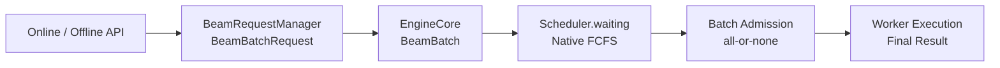
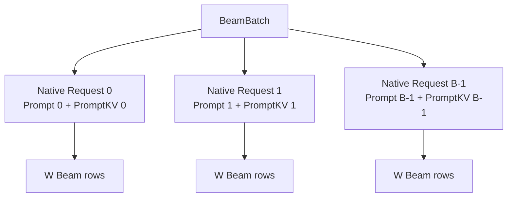
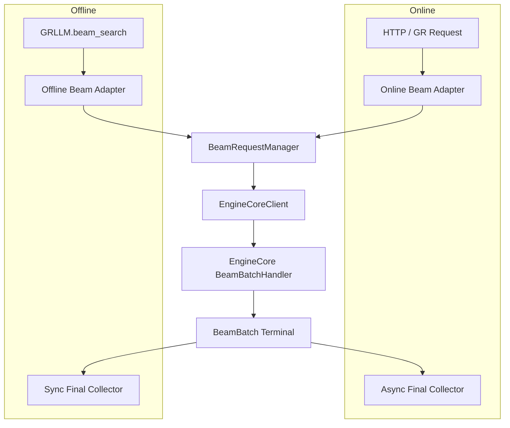
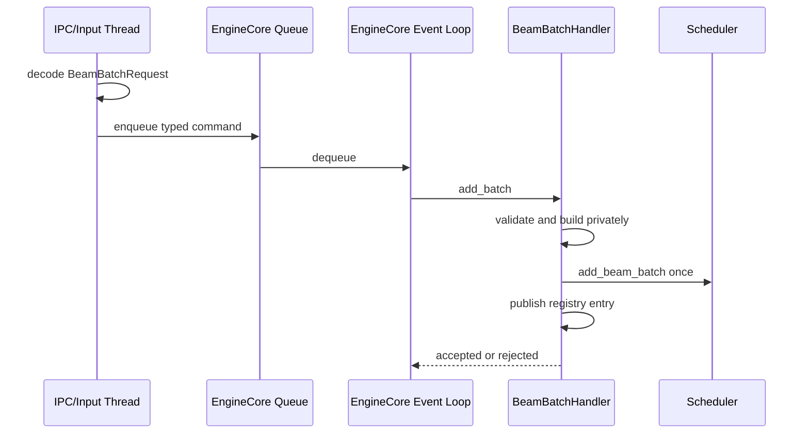
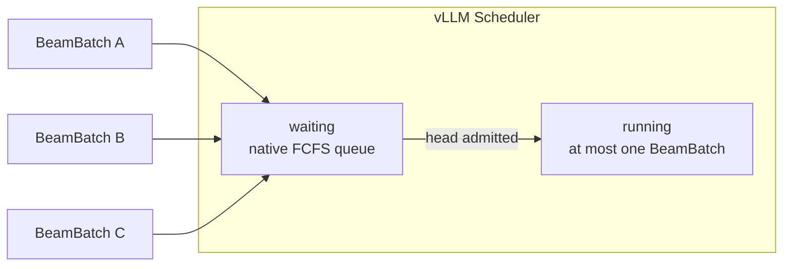
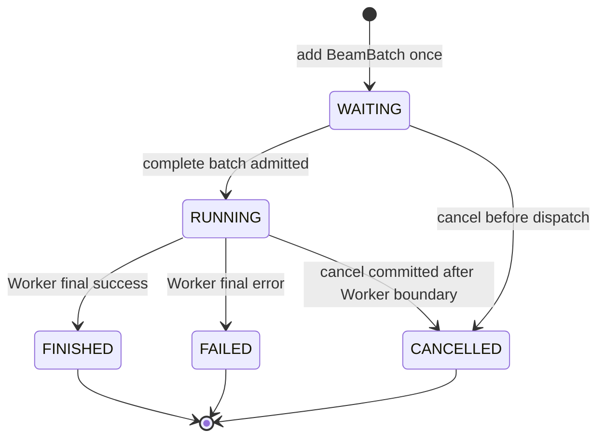
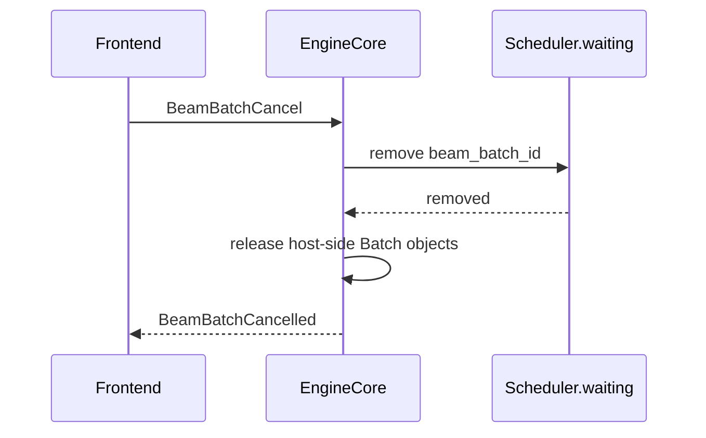
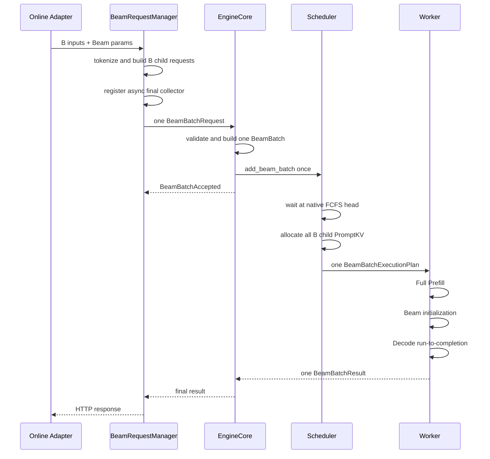
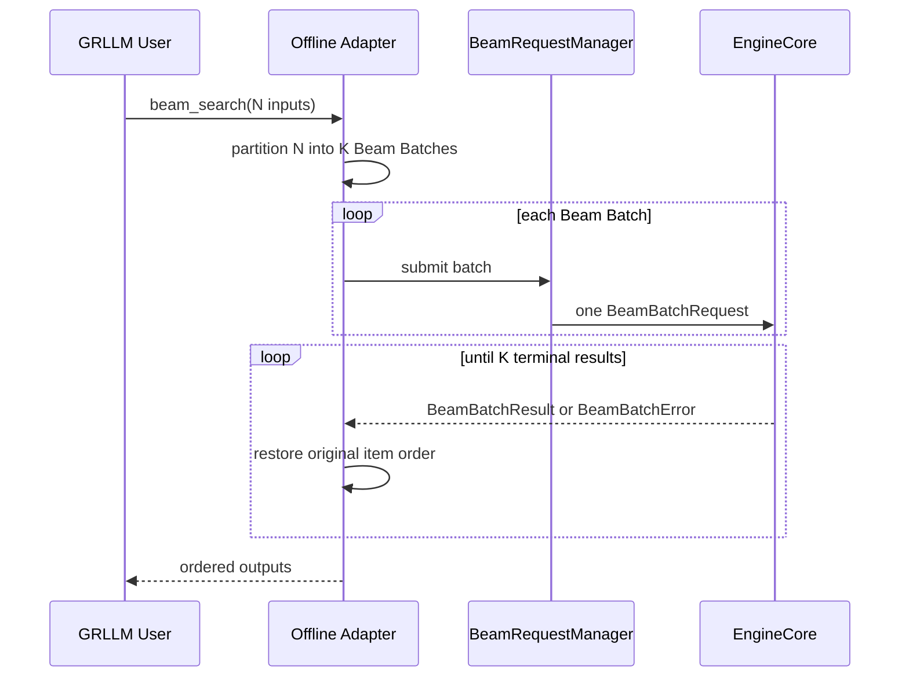
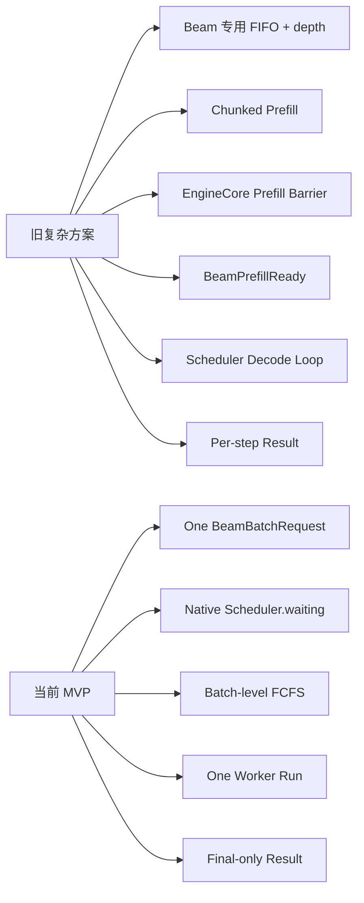

# Beam Batch：Serving / Offline 到 EngineCore 的统一入口设计

> 状态：Design / 当前方案  
> 日期：2026-08-21  
> 关联 RFC：[Worker 内执行完整 Beam Batch](https://github.com/zhanghanleo10/vllm-gr/issues/35)  
> 范围：定义 Online Serving 与 Offline API 如何提交一个 Beam Batch，EngineCore 如何构造一个包含 B 个 native child Request 的 `BeamBatch`，以及该 Batch 如何一次进入 vLLM 原生 Scheduler waiting。本文不展开 Worker 内部 Beam kernel。

---

## 0. 一页结论

当前版本采用最小方案：

> **增加一个 `BeamBatchRequest`，复用 vLLM 原生 Scheduler waiting 和 FCFS；不再建立 Beam 专用 FIFO，也不配置 FIFO 深度。**



一个业务 Batch 在各层始终只有一个顶层对象：

```text
Frontend：
    BeamBatchRequest
        └── B 个输入

EngineCore：
    BeamBatch
        └── B 个 native Request

Scheduler：
    waiting 中的一个 BeamBatch

Worker：
    一个 BeamBatchExecutionPlan
        └── Full Prefill + Beam 初始化 + Decode run-to-completion
```

当前版本明确不支持：

- chunked prefill；
- Scheduler 层 Prefill 循环调度；
- Scheduler 层 Decode 循环调度；
- EngineCore Prefill Barrier；
- Beam 专用 waiting FIFO；
- `max_waiting_beam_groups`；
- 普通 Request 与 Beam Batch 混合调度；
- 单个 child 独立取消或失败；
- 中间 step 输出；
- EngineCore 自动重试。

---

## 1. 设计不变量

### 1.1 一个 Batch，一次提交

```text
一个 BeamBatchRequest
        ↓
一个 BeamBatch
        ↓
一次 Scheduler waiting 注册
        ↓
一次 Worker 派发
        ↓
一个终态结果
```

禁止将一个 Batch 拆成 B 次 Scheduler 注册：

```python
# 禁止
for child in batch.children:
    scheduler.add_request(child)
```

正确方式：

```python
# 一个 Batch 作为一个 FCFS 排队项
scheduler.add_beam_batch(batch)
```

### 1.2 一个 child 对应一个 Prompt



三种规模必须分开：

```text
B = 一个 BeamBatch 中的业务输入数
W = 每个输入的 Beam width
B × W = Worker Decode 阶段的逻辑 Beam rows
```

Scheduler 只管理一个 `BeamBatch` 和其中 B 个 Prompt child。

`B × W` 不应在 EngineCore 中膨胀为 `B × W` 个 native Request。

### 1.3 Registration 不等于执行

```text
REGISTERED
    = BeamBatch 已加入 Scheduler.waiting

ADMITTED
    = Scheduler 已确认整个 Batch 本轮可以完整执行

RUNNING
    = Batch 已一次性派发给 Worker

TERMINAL
    = Worker 已返回最终结果或错误
```

`BeamBatchAccepted` 只表示已经进入原生 waiting，不保证立即获得 GPU、KV 或 RunSlot。

---

## 2. Online 与 Offline 统一入口

Online 与 Offline 只在外部调用方式上不同。



### 2.1 Online Adapter 负责

- HTTP/OpenAI/GR schema 解析；
- chat template；
- tokenize；
- Online 参数校验；
- 注册异步结果等待器；
- client disconnect 转换为 Batch Cancel；
- 把最终内部结果转换为 HTTP 响应。

Online Adapter 不负责：

- Beam step loop；
- candidate select；
- parent select；
- BeamKV 重排；
- Prefill/Decode 调度；
- 中间 logits 接收。

### 2.2 Offline Adapter 负责

- 接收 N 个输入；
- 使用现有输入处理流程；
- 必要时将 N 个输入拆成多个 Beam Batch；
- 同步等待每个 Batch 终态；
- 按原始输入顺序恢复结果；
- `KeyboardInterrupt` 或调用取消转换为 Batch Cancel。

```text
Offline call：N 个输入
        │
        ├── BeamBatch 0：B0 个输入
        ├── BeamBatch 1：B1 个输入
        └── BeamBatch K：BK 个输入
```

Offline Adapter 不再按 Decode step 重复调用 EngineCore：

```python
# 禁止
while not finished:
    submit_one_decode_step()
    wait_step_output()
    select_next_beams()
```

正确方式：

```python
batch_id = submit_beam_batch(inputs, params)
terminal = wait_beam_batch(batch_id)
```

### 2.3 共享的 Request Manager

```python
class BeamRequestManager:

    def submit(
        self,
        inputs: Sequence[PromptType],
        params: BeamSearchParams,
        result_options: BeamResultOptions,
    ) -> BeamBatchHandle:
        ...
```

统一入口负责：

```text
1. 为 Batch 分配内部 beam_batch_id
2. 为 B 个 child 分配确定性 child_request_id
3. 复用 native InputProcessor 处理 B 个输入
4. 构造一个 BeamBatchRequest
5. 先注册一个 Batch 结果收集器
6. 再向 EngineCore 发送一条消息
```

先注册结果等待器，再发送消息，避免快速完成时结果先于 collector 到达。

---

## 3. Wire 协议

### 3.1 顶层请求

类型名不携带 `V1`、`V2` 后缀。协议版本由顶层字段表达。

```python
@dataclass(frozen=True, slots=True)
class BeamBatchRequest:
    protocol_version: int
    beam_batch_id: str
    children: tuple[BeamChildRequest, ...]
    execution: BeamExecutionParameters
    result_options: BeamResultOptions
```

```python
@dataclass(frozen=True, slots=True)
class BeamChildRequest:
    item_index: int
    child_request_id: str
    engine_core_request: EngineCoreRequest
```

其中 `EngineCoreRequest` 继续承载 vLLM 原生输入信息：

- prompt token IDs；
- multimodal inputs；
- LoRA request；
- cache salt；
- priority；
- arrival time；
- 其他 native Request 构造所需字段。

Beam 参数只在 Batch 顶层保存一份，不在 B 个 child 中重复。

### 3.2 Beam 执行参数

```python
@dataclass(frozen=True, slots=True)
class BeamExecutionParameters:
    beam_width: int
    max_decode_steps: int
    temperature: float
    ignore_eos: bool
    begin_token_id: int | None
    end_token_id: int | None
    constraint_resource_id: str | None
```

```python
@dataclass(frozen=True, slots=True)
class BeamResultOptions:
    result_width: int
    include_scores: bool
    include_token_ids: bool
    include_parent_lineage: bool
```

必须区分：

```text
beam_width  = Worker 内部搜索宽度
result_width = 最终为每个 item 返回多少条结果
```

约束：

```text
B > 0
beam_width > 0
0 < result_width <= beam_width
max_decode_steps > 0
temperature 为有限值且 temperature >= 0
```

### 3.3 身份

一个 Batch 只有一个顶层 ID：

```text
beam_batch_id
```

B 个 child ID 由 Request Manager 分配：

```python
def child_request_id(beam_batch_id: str, item_index: int) -> str:
    return f"{beam_batch_id}:{item_index}"
```

`item_index` 必须满足：

```text
0 <= item_index < B
且在同一 Batch 内连续、唯一
```

外部重试必须生成新的 `beam_batch_id`。EngineCore 不复用失败 Batch 的 PromptKV、BeamKV 或中间状态。

### 3.4 Wire 消息数量

正常执行：

```text
Frontend → EngineCore：
    1 × BeamBatchRequest

EngineCore → Frontend：
    0 or 1 × BeamBatchAccepted
    1 × BeamBatchResult
```

失败执行：

```text
Frontend → EngineCore：
    1 × BeamBatchRequest

EngineCore → Frontend：
    0 or 1 × BeamBatchAccepted
    1 × BeamBatchError
```

取消：

```text
Frontend → EngineCore：
    1 × BeamBatchCancel

EngineCore → Frontend：
    1 × BeamBatchCancelled
```

控制面 `Accepted` 不属于模型输出。“final-only”指不返回 Prefill、Beam 初始化或 Decode step 的中间计算结果。

---

## 4. EngineCore 入口处理

### 4.1 一个 handler

MP、Inproc、Online 和 Offline 最终必须进入同一个处理函数：

```python
class BeamBatchHandler:

    def add_batch(self, request: BeamBatchRequest) -> None:
        ...

    def cancel_batch(self, request: BeamBatchCancel) -> None:
        ...

    def finish_batch(self, terminal: BeamBatchTerminal) -> None:
        ...
```

不同运行模式不得复制：

- Batch 校验；
- native Request 构造；
- Scheduler 注册；
- cancel；
- final-once。

### 4.2 EngineCore 内部对象

```python
@dataclass(slots=True)
class BeamBatch:
    beam_batch_id: str
    children: tuple[Request, ...]
    execution: BeamExecutionParameters
    result_options: BeamResultOptions
    arrival_time: float
    state: BeamBatchState
```

```python
class BeamBatchState(Enum):
    WAITING = auto()
    RUNNING = auto()
    FINISHED = auto()
    FAILED = auto()
    CANCELLED = auto()
```

不需要在 EngineCore/Scheduler 中增加：

```text
PREFILL_PARTIAL
PREFILL_READY
BEAM_INITIALIZED
DECODE_STEP_N
```

这些阶段只存在于 Worker 的一次执行内部。

### 4.3 从 wire 构造一个 Batch

```python
def build_beam_batch(request: BeamBatchRequest) -> BeamBatch:
    validate_wire_contract(request)

    children = tuple(
        Request.from_engine_core_request(child.engine_core_request)
        for child in request.children
    )

    validate_children(request, children)
    validate_one_shot_schedulable(request, children)

    return BeamBatch(
        beam_batch_id=request.beam_batch_id,
        children=children,
        execution=request.execution,
        result_options=request.result_options,
        arrival_time=min(child.arrival_time for child in children),
        state=BeamBatchState.WAITING,
    )
```

构造期间对象只在 handler 私有作用域可见。

任何 child 构造失败，都必须丢弃整个 Batch：

```text
child 0 构造成功
child 1 构造成功
child 2 构造失败
        ↓
整个 BeamBatchRequest 拒绝
        ↓
Scheduler 看不到 child 0 和 child 1
```

### 4.4 一次注册

```python
def add_batch(self, request: BeamBatchRequest) -> None:
    batch = build_beam_batch(request)

    try:
        self.scheduler.add_beam_batch(batch)
        self.batch_registry[batch.beam_batch_id] = batch
    except Exception as exc:
        rollback_unpublished_batch(batch)
        emit_batch_rejected(
            beam_batch_id=request.beam_batch_id,
            error=exc,
        )
        return

    emit_batch_accepted(batch.beam_batch_id)
```

核心约束：

```text
Scheduler waiting 可见
and
EngineCore batch_registry 可见
────────────────────────────
才能返回 BeamBatchAccepted
```

实现时应将 Scheduler 注册与 registry publish 收敛为一个可以完整回滚的 event-loop 内事务。

### 4.5 EngineCore 单写



IPC/Input thread 只做：

- typed decode；
- schema 基础检查；
- 放入 EngineCore command queue。

它不能直接修改：

- `Scheduler.waiting`；
- `Scheduler.running`；
- Batch registry；
- KV manager；
- Worker RunSlot。

---

## 5. 复用 vLLM 原生 Scheduler waiting

### 5.1 不再建立 Beam FIFO

删除以下设计：

```python
beam_waiting_fifo: OrderedDict[str, None]
max_waiting_beam_groups: int
BeamQueueConfig
```

也不再维护：

```text
1 ACTIVE + 1 WAITING
FIFO full
EngineCore queue-full
Beam 专用 429
```

等待 Batch 直接进入：

```python
scheduler.waiting
```



### 5.2 复用什么

复用 vLLM 原生能力：

- `Scheduler.waiting` 所有权；
- FCFS 入队与出队顺序；
- EngineCore 驱动 Scheduler 的主循环；
- native Request；
- Prompt PagedKV 管理；
- ModelRunner 输入准备；
- Worker Executor；
- request finished 后的资源释放框架。

只增加 Beam Batch 所需的最薄扩展：

```python
def add_beam_batch(self, batch: BeamBatch) -> None:
    self.waiting.add_request(batch)
```

以及 Scheduler 识别 Batch 顶层对象的准入分支：

```python
def schedule_waiting(self) -> SchedulerOutput:
    batch = self.waiting.peek_request()

    if not self.can_admit_complete_batch(batch):
        return SchedulerOutput.empty()

    allocations = self.try_allocate_complete_batch(batch)
    if allocations is None:
        return SchedulerOutput.empty()

    self.waiting.pop_request()
    self.running.append(batch)

    return BeamBatchExecutionPlan.from_batch(
        batch=batch,
        allocations=allocations,
    )
```

### 5.3 不将 BeamBatch 伪装成单个 native Request

`BeamBatch` 不是一条 sequence，不能通过继承 `Request` 假装成一个 Prompt。

```text
BeamBatch
    ├── Request 0
    ├── Request 1
    └── Request B-1
```

建议将原生 waiting queue 容器泛化为可保存 Scheduler 顶层排队项：

```python
SchedulableItem = Request | BeamBatch
```

当前 Beam 专用部署中不会出现普通 Request 与 BeamBatch 混合，因此实际 waiting 中只保存 `BeamBatch`。

### 5.4 FCFS 粒度

FCFS 的排序单位是整个 Batch：

```text
BeamBatch A 到达
BeamBatch B 到达
BeamBatch C 到达

执行顺序：
A → B → C
```

不是 child 粒度：

```text
禁止：
A.child0 → A.child1 → B.child0 → A.child2
```

队首 Batch 因当前动态 KV 不足而不能准入时：

```text
waiting = [A, B, C]
A 当前不能完整准入
        ↓
本轮不调度新的 BeamBatch
        ↓
B、C 不绕过 A
```

永久不可能执行的 Batch 必须在进入 waiting 前拒绝，避免永久阻塞队首。

### 5.5 没有 Scheduler waiting 深度

原生 waiting 没有 Beam 专用深度限制：

```text
EngineCore 不维护 max_waiting_beam_groups
EngineCore 不因 Beam waiting 长度返回 queue-full
```

因此：

- 当前 MVP 不提供 EngineCore 级 Beam 排队背压；
- Online 过载保护未来应放在 Serving admission 层；
- Offline 可以在调用层限制 outstanding Batch 数；
- 这些外部策略不改变 EngineCore/Scheduler 协议。

当前应监控：

```text
beam_waiting_count
beam_waiting_time
beam_running_time
beam_end_to_end_time
```

当实际数据证明 waiting 增长导致内存或 P99 问题时，再增加 Serving 层容量控制；不提前在 EngineCore 复制第二套队列。

---

## 6. 关闭 chunked prefill

### 6.1 部署约束

Beam 模式启动时必须满足：

```python
scheduler_config.enable_chunked_prefill is False
```

建议启动期直接 fail fast：

```python
def validate_beam_engine_config(config: EngineConfig) -> None:
    if config.scheduler_config.enable_chunked_prefill:
        raise ValueError(
            "Beam batch worker execution requires chunked prefill disabled"
        )
```

不允许某个请求临时覆盖该设置，也不允许运行中自动切换。

### 6.2 关闭 chunk 不等于整组原子

关闭 chunk 只保证：

```text
单个 child 的 Prompt：
完整执行 or 本轮不执行
```

它不能自动保证：

```text
B 个 child：
全部执行 or 全部不执行
```

因此仍需 Batch 级准入：

```python
def can_admit_complete_batch(batch: BeamBatch) -> bool:
    return (
        no_other_beam_batch_running()
        and all_prompt_kv_available(batch.children)
        and beam_run_slot_available(batch)
    )
```

### 6.3 一次性可调度验证

在 Batch 进入 waiting 前，EngineCore 必须验证其在当前部署配置下永久可执行：

```python
def validate_one_shot_schedulable(
    request: BeamBatchRequest,
    children: tuple[Request, ...],
) -> None:
    batch_size = len(children)
    prompt_tokens = sum(
        child.num_prompt_tokens
        for child in children
    )

    if batch_size > scheduler_config.max_num_seqs:
        raise BeamBatchTooLarge("batch size exceeds max_num_seqs")

    if prompt_tokens > scheduler_config.max_num_batched_tokens:
        raise BeamBatchTooLarge(
            "complete prefill exceeds max_num_batched_tokens"
        )

    for child in children:
        if (
            child.num_prompt_tokens
            + request.execution.max_decode_steps
            > model_config.max_model_len
        ):
            raise BeamBatchTooLarge(
                "prompt plus decode exceeds max_model_len"
            )

    validate_beam_runtime_capacity(
        batch_size=batch_size,
        beam_width=request.execution.beam_width,
        max_decode_steps=request.execution.max_decode_steps,
    )
```

当前版本按无 Prefix Cache 命中的保守情况验证：

```text
required_prefill_tokens
    = sum(all child prompt lengths)
```

不依赖一次临时 Prefix Cache 命中来放行一个本来超过单轮预算的 Batch。

### 6.4 整组 KV 分配

Scheduler 不能先公开部分 child 的 KV 所有权：

```python
# 禁止形成对外可见的部分 Batch
for child in batch.children:
    allocate_slots(child)
```

需要使用 staged allocation：

```python
def try_allocate_complete_batch(
    batch: BeamBatch,
) -> BeamBatchAllocations | None:
    staged = []

    try:
        for child in batch.children:
            allocation = kv_cache_manager.try_allocate_slots(child)

            if allocation is None:
                rollback_allocations(staged)
                return None

            staged.append(allocation)

        return BeamBatchAllocations(tuple(staged))

    except Exception:
        rollback_allocations(staged)
        raise
```

只有 B 个 child 全部分配成功后，才能：

```text
pop Scheduler.waiting head
→ 放入 Scheduler.running
→ 构造 BeamBatchExecutionPlan
```

---

## 7. Scheduler 只派发一次

### 7.1 Scheduler 视角



没有以下转换：

```text
WAITING → PREFILL_CHUNK_0
PREFILL_CHUNK_0 → PREFILL_CHUNK_1
PREFILL_READY → DECODE_STEP_0
DECODE_STEP_0 → DECODE_STEP_1
```

### 7.2 Worker 视角

Scheduler 一次生成：

```python
@dataclass(frozen=True, slots=True)
class BeamBatchExecutionPlan:
    beam_batch_id: str
    children: tuple[BeamChildExecutionInput, ...]
    prompt_kv_bindings: tuple[PromptKVBinding, ...]
    execution: BeamExecutionParameters
    result_options: BeamResultOptions
    run_slot: BeamRunSlotBinding
```

Worker 在一次调用中完成：

```python
def execute_beam_batch(
    plan: BeamBatchExecutionPlan,
) -> BeamBatchExecutionResult:
    prefill_output = model_runner.execute_full_prefill(
        plan.children,
        plan.prompt_kv_bindings,
    )

    beam_state = initialize_beam_rows(
        prefill_output=prefill_output,
        beam_width=plan.execution.beam_width,
    )

    while not beam_state.finished:
        beam_state = execute_decode_step(beam_state)

    return build_final_worker_result(
        beam_state,
        plan.result_options,
    )
```

Worker 内的程序顺序就是阶段依赖：

```text
Full Prefill 完成
        ↓
PromptKV 完整有效
        ↓
Beam 初始化
        ↓
Decode run-to-completion
```

因此当前版本不需要：

- `BeamPrefillReady`；
- EngineCore all-ready gate；
- Scheduler Prefill Barrier；
- Barrier 模式开关；
- Prefill child progress；
- Decode continuation。

### 7.3 MVP 不新增异步 Worker 执行要求

当前 MVP 沿用现有 EngineCore / Executor 调用方式，不要求为了 Beam Batch 新增异步 Worker Future。

```text
如果当前 EngineCore 调用 Worker 时阻塞：

新 BeamBatchRequest / BeamBatchCancel
        ↓
保留在现有 ingress / IPC / EngineCore command queue
        ↓
当前 Worker 调用返回
        ↓
EngineCore 按现有顺序继续处理
```

如果底层本来就支持非阻塞 Executor，也可以继续复用，但它不是本方案成立的前提。无论底层调用方式如何，对同一个 `BeamBatch`，Scheduler 都只派发一次。

这一取舍意味着：在阻塞实现中，运行中 Cancel 只能在 Worker 返回后被 EngineCore 处理；当前 MVP 接受该延迟，不额外引入 GPU 中断或协作式取消协议。

---

## 8. Final-only 结果协议

### 8.1 成功结果

```python
@dataclass(frozen=True, slots=True)
class BeamBatchResult:
    beam_batch_id: str
    outputs: tuple[BeamItemResult, ...]
```

```python
@dataclass(frozen=True, slots=True)
class BeamItemResult:
    item_index: int
    candidates: tuple[BeamCandidateResult, ...]
```

```python
@dataclass(frozen=True, slots=True)
class BeamCandidateResult:
    token_ids: tuple[int, ...]
    score: float | None
    parent_lineage: tuple[int, ...] | None
    finish_reason: str
```

结果约束：

```text
len(outputs) == B
item_index 唯一
item_index 覆盖 [0, B)
每个 item 的 candidate 数 <= result_width
```

Frontend 根据 `item_index` 恢复 Online/Offline 输入顺序。

### 8.2 失败结果

```python
@dataclass(frozen=True, slots=True)
class BeamBatchError:
    beam_batch_id: str
    stage: BeamFailureStage
    code: str
    message: str
    retryable: bool
```

```python
class BeamFailureStage(Enum):
    VALIDATION = auto()
    WAITING = auto()
    PREFILL = auto()
    BEAM_INITIALIZATION = auto()
    DECODE = auto()
    CLEANUP = auto()
    WORKER = auto()
```

任何一个 child 的 Prefill、Beam 初始化或 Decode 失败，整个 Batch 失败：

```text
不返回部分 child success
不重试单个 child
不复用部分 PromptKV
不复用部分 Beam state
```

`retryable` 只给 Online/Offline 调用层提供建议。EngineCore 不自动重试。

### 8.3 不返回中间结果

Frontend 不接收：

- Prefill logits；
- `BeamPrefillReady`；
- 第一次 Beam token；
- 每轮 `parent_ids`；
- 每轮候选 logprobs；
- BeamKV 重排结果；
- Decode step complete。

正常路径只返回最终 `BeamBatchResult`。

---

## 9. Cancel 协议

### 9.1 只支持 Batch 级取消

```python
@dataclass(frozen=True, slots=True)
class BeamBatchCancel:
    beam_batch_id: str
    cancel_id: str
    reason: str
```

不支持：

```text
cancel child 3
cancel beam row 17
cancel one candidate
```

一个 child 被取消等价于整个 Batch 被取消。

### 9.2 WAITING 取消



WAITING Batch 尚未持有：

- PromptKV allocation；
- BeamRunSlot；
- BeamKV；
- Worker Beam state。

因此不需要 Worker teardown。

### 9.3 RUNNING 取消

当前版本没有 Worker/GPU 中途抢占。

下图中的“Cancel 到达”指 EngineCore event loop 实际取出并处理该命令，而不是 Cancel 数据刚进入 IPC。若 EngineCore 正阻塞在 Worker 调用中，Cancel 先留在现有 ingress/IPC 队列；Worker 结果可能先完成终态提交，此时后续 Cancel 为 no-op。

```text
Cancel 到达
    ↓
EngineCore 标记 cancel_requested
    ↓
不再提交新的工作
    ↓
等待当前 Worker 原子调用返回
    ↓
丢弃尚未提交的成功结果
    ↓
完成资源清理
    ↓
提交 BeamBatchCancelled
```

```python
def on_worker_result(result: BeamBatchExecutionResult) -> None:
    batch = batch_registry[result.beam_batch_id]

    if batch.cancel_requested:
        cleanup_batch(batch)
        commit_cancelled_once(batch)
        return

    commit_terminal_once(batch, result)
```

终态竞争规则：

```text
Cancel 在终态提交前被 EngineCore event loop 处理：
    Cancel 胜出

成功/失败终态已经提交：
    后到 Cancel 为幂等 no-op
```

如果 Worker 无法证明资源已经安全释放：

```text
Batch 终态 = FAILED
RunSlot = POISONED
后续 Batch 不再调度，直到 Worker 恢复或重启
```

---

## 10. 校验责任边界

### 10.1 Frontend 校验

Frontend 提供快速、面向用户的错误：

- 输入列表非空；
- render/tokenize 成功；
- token ID 在 vocabulary 范围内；
- Beam 参数类型正确；
- Online schema 合法；
- Offline 参数长度与输入数量匹配。

Frontend 校验不是安全边界。

### 10.2 EngineCore 权威校验

EngineCore 必须重新验证：

- `protocol_version`；
- `beam_batch_id` 非空且未使用；
- child 数量大于零；
- child ID 唯一；
- `item_index` 连续、唯一；
- Beam 参数范围；
- `result_width <= beam_width`；
- Prompt 长度；
- Prompt 加最大 Decode 长度；
- B 不超过 `max_num_seqs`；
- 完整 Prefill token 总量不超过单轮 token budget；
- `B × W` 存在已 Warmup 的 Decode gear；
- RunSlot 配置可以容纳该 Batch；
- chunked prefill 已关闭；
- 不存在普通 Request 混合模式。

### 10.3 Scheduler 动态准入

Scheduler 只处理运行时会变化的资源：

- 当前是否已有运行中的 BeamBatch；
- 当前 PromptKV 是否足够；
- BeamRunSlot 是否空闲；
- Worker 是否健康；
- 当前设备资源 generation 是否有效。

```text
永久不支持
    → 注册前 Reject

当前暂时无资源
    → 留在 Scheduler.waiting

资源可用
    → 整组原子准入
```

---

## 11. 失败与回滚

### 11.1 注册前失败

```text
wire decode / validation / child construction 失败
        ↓
不写 Scheduler.waiting
不写 batch_registry
不分配 PromptKV
        ↓
BeamBatchRejected
```

### 11.2 Scheduler 注册失败

```python
try:
    scheduler.add_beam_batch(batch)
    batch_registry.add(batch)
except Exception:
    scheduler.remove_beam_batch_if_present(batch.beam_batch_id)
    batch_registry.remove_if_present(batch.beam_batch_id)
    emit_rejected(batch.beam_batch_id)
```

必须证明没有半注册状态。

### 11.3 动态准入失败

动态资源暂时不足：

```text
Batch 保持 WAITING
Scheduler 本轮返回空计划
不允许后续 Batch 绕过
```

staged allocation 部分成功后失败：

```text
回滚本次所有 allocation
Batch 保持 WAITING
不改变 child 的 committed token 状态
```

### 11.4 Worker 执行失败

```text
Worker 返回 Batch 级错误
        ↓
Scheduler 标记 Batch FAILED
        ↓
清理 PromptKV / BeamKV / RunSlot
        ↓
EngineCore 提交一次 BeamBatchError
        ↓
下一轮调度 waiting 队首
```

EngineCore 不自动重新入队。

---

## 12. 推荐代码结构

```text
Frontend
├── beam_request_manager.py
│   ├── BeamRequestManager
│   ├── Online/Offline 共用输入准备
│   └── BeamBatchRequest 构造
│
├── beam_result_registry.py
│   ├── BeamResultRegistry
│   ├── BeamAsyncResultCollector
│   └── BeamSyncResultCollector
│
Online Adapter
├── serving_beam.py
│   ├── HTTP/GR schema
│   ├── async submit
│   └── disconnect cancel
│
Offline Adapter
├── offline_beam.py
│   ├── N → BeamBatch 分组
│   ├── sync wait
│   └── 结果保序
│
Shared Protocol
├── beam_protocol.py
│   ├── BeamBatchRequest
│   ├── BeamChildRequest
│   ├── BeamBatchCancel
│   ├── BeamBatchResult
│   └── BeamBatchError
│
EngineCore
├── beam_batch_handler.py
│   ├── 权威校验
│   ├── BeamBatch 构造
│   ├── add/cancel/final
│   └── terminal-once
│
├── beam_batch.py
│   ├── BeamBatch
│   └── BeamBatchState
│
Scheduler
├── scheduler.py
│   ├── 原生 waiting / running
│   ├── add_beam_batch
│   ├── complete-batch admission
│   └── 一次 BeamBatchExecutionPlan
│
Worker
└── beam_batch_runner.py
    ├── Full Prefill
    ├── Beam 初始化
    ├── Decode loop
    └── final result
```

不新增：

```text
beam_waiting_fifo.py
beam_queue_config.py
beam_prefill_barrier.py
beam_prefill_ready.py
beam_decode_continuation.py
```

---

## 13. 典型流程

### 13.1 Online 成功



### 13.2 Offline 多 Batch



### 13.3 队首资源暂时不足

```text
Scheduler.waiting = [Batch A, Batch B]

Batch A：
    永久配置合法
    当前 PromptKV 暂时不足

本轮：
    A 保留在队首
    B 不绕过
    不产生 Worker plan

资源释放后：
    A 整组准入
```

---

## 14. 配置

当前 Beam MVP 只需要冻结执行能力，不增加队列深度配置。

```python
@dataclass(frozen=True, slots=True)
class BeamEngineConfig:
    enabled: bool
    max_batch_size: int
    supported_beam_widths: tuple[int, ...]
    supported_decode_gears: tuple[int, ...]
    max_decode_steps: int
```

启动期联合检查：

```python
def validate_startup_config(
    beam: BeamEngineConfig,
    scheduler: SchedulerConfig,
) -> None:
    if not beam.enabled:
        return

    if scheduler.enable_chunked_prefill:
        raise ValueError("Beam mode requires chunked prefill disabled")

    if beam.max_batch_size > scheduler.max_num_seqs:
        raise ValueError(
            "Beam max_batch_size exceeds Scheduler max_num_seqs"
        )
```

不增加：

```python
max_waiting_beam_groups
prefill_barrier_mode
beam_scheduler_loop
decode_scheduler_loop
```

---

## 15. 测试要求

### 15.1 协议测试

- Online 与 Offline 产生相同的 `BeamBatchRequest`；
- wire serialization round trip；
- unknown `protocol_version` fail closed；
- child ID 与 `item_index` 重复时整组拒绝；
- `beam_width` 与 `result_width` 边界；
- 不允许 `max_tokens=1` per-step 模拟路径。

### 15.2 注册原子性

故障注入 B 个 child 的每个构造位置：

```text
child 0 failure
child k failure
last child failure
Scheduler add failure
registry publish failure
```

每种失败都必须满足：

```text
Scheduler.waiting 中不存在该 Batch
Scheduler.running 中不存在该 Batch
batch_registry 中不存在活跃记录
没有 PromptKV lease
没有 Worker plan
```

### 15.3 Scheduler 测试

- Batch 只调用一次 `add_beam_batch()`；
- waiting 顺序为 Batch 级 FCFS；
- 队首暂时无资源时后续 Batch 不绕过；
- B 个 child 不能部分进入 Worker plan；
- staged KV allocation 失败后完整 rollback；
- chunked prefill 开启时启动失败；
- 完整 Prompt token 总量超过预算时注册前拒绝；
- 一个 Batch 只生成一个 Worker execution plan；
- Worker 未完成前不调度第二个 BeamBatch。

### 15.4 结果测试

- 正常执行只产生一个 final result；
- 不产生 Prefill/Decode step 输出；
- B 个 item 按 `item_index` 完整返回；
- 任一 child 失败导致整个 Batch 失败；
- EngineCore 不自动重试；
- duplicate Worker result 不能重复提交终态。

### 15.5 Cancel 测试

- WAITING Batch 可从 native waiting 中移除；
- WAITING cancel 不调用 Worker teardown；
- EngineCore 能在终态前处理 RUNNING cancel 时，Cancel 在 Worker 返回边界生效；
- 阻塞 Worker 调用下，Worker 终态先提交时后到 Cancel 为 no-op；
- cancel-first 抑制成功结果；
- final-first 使后到 cancel 成为 no-op；
- 同一 `cancel_id` 重复提交幂等；
- 不允许单 child cancel。

### 15.6 Online / Offline 一致性

同一组 tokenized inputs 和 Beam 参数：

```text
Online final outputs
==
Offline final outputs
```

至少对比：

- token IDs；
- scores；
- finish reason；
- item 顺序；
- error code；
- cancel 终态。

---

## 16. 从旧方案删除的内容



应删除或停止设计：

- `BeamQueueConfig`；
- `max_waiting_beam_groups`；
- `beam_waiting_fifo`；
- FIFO 满后的 EngineCore reject；
- `worker_atomic` / `engine_coordinated` 双模式；
- `BeamPrefillBarrierMode`；
- `BeamPrefillReady`；
- Prefill chunk cursor；
- child remaining-prefill-token；
- Scheduler 内的 Group token quota；
- EngineCore all-ready gate；
- Decode continuation；
- per-step Beam output；
- Serving/Offline host-side Beam loop。

---

## 17. 当前方案的边界

当前方案接受以下取舍：

| 项目 | 当前决定 | 影响 |
| --- | --- | --- |
| 排队 | 复用原生 waiting，无 Beam 深度 | EngineCore 不提供 queue-full 背压 |
| 顺序 | Batch 级 FCFS | 长 Batch 可能产生队首等待 |
| Prefill | 完整 Prefill，不 chunk | 超过单轮 token budget 的 Batch 直接拒绝 |
| 执行 | Worker run-to-completion | 运行中 Cancel 不能立即中断 GPU |
| 并发 | 一个运行中的 BeamBatch | 不做多 Batch Worker micro-batch |
| 结果 | final-only | Frontend 不观察中间 Beam 状态 |
| 失败 | 整 Batch 失败 | 不提供 child 级部分成功 |
| 重试 | 上层新 Batch | EngineCore 不复用失败状态 |

以下事实发生变化时再重新讨论 Scheduler 复杂度：

- 必须支持超过单轮 token budget 的长 Prompt；
- 必须支持 chunked prefill；
- 普通 Request 与 BeamBatch 需要混合服务；
- 单 Worker 同时运行多个 BeamBatch；
- Online waiting 无界导致可测量的内存或 P99 问题；
- 必须提供硬实时运行中 Cancel；
- Worker run-to-completion 不能满足公平性或 SLA。

在这些条件出现前，当前最小闭环是：

```text
统一 BeamBatchRequest
        +
EngineCore 构造一个 BeamBatch
        +
复用 native Scheduler.waiting / FCFS
        +
整组原子准入
        +
关闭 chunked prefill
        +
Worker 一次执行到结束
        +
final-only result
```
