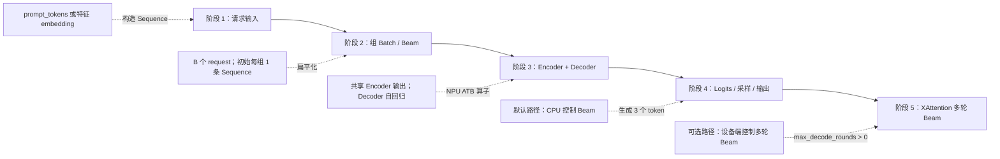
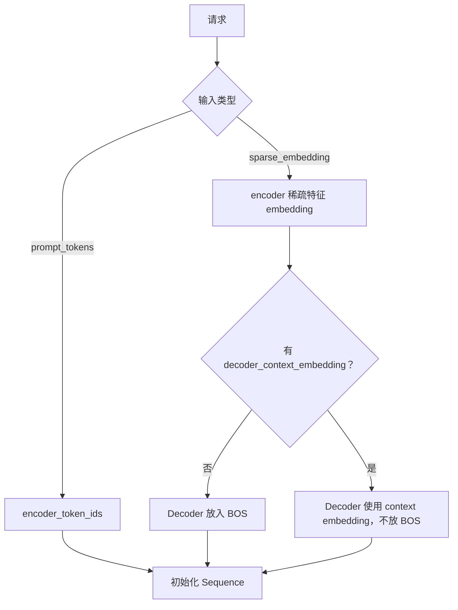
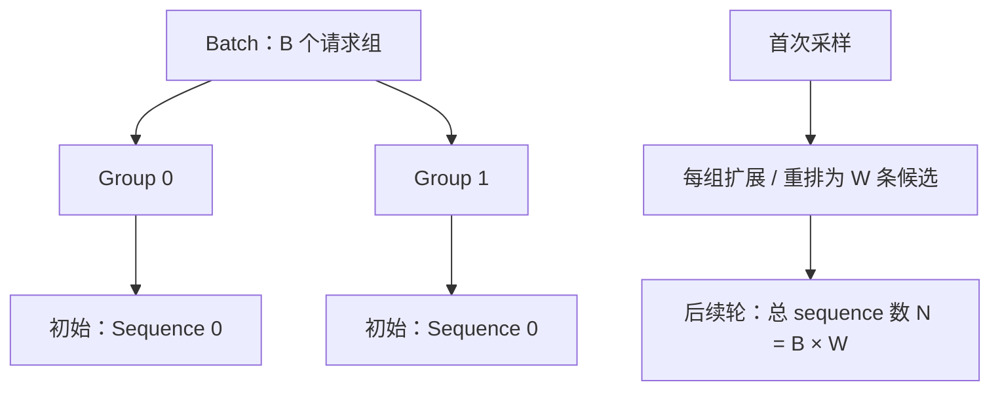
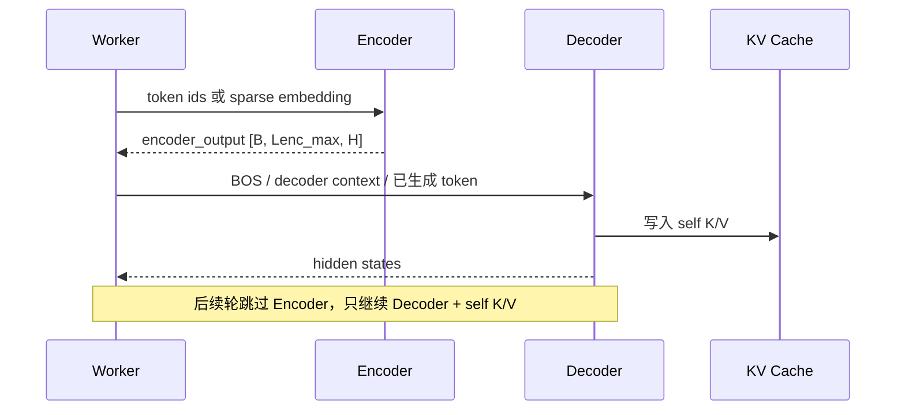
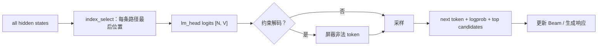
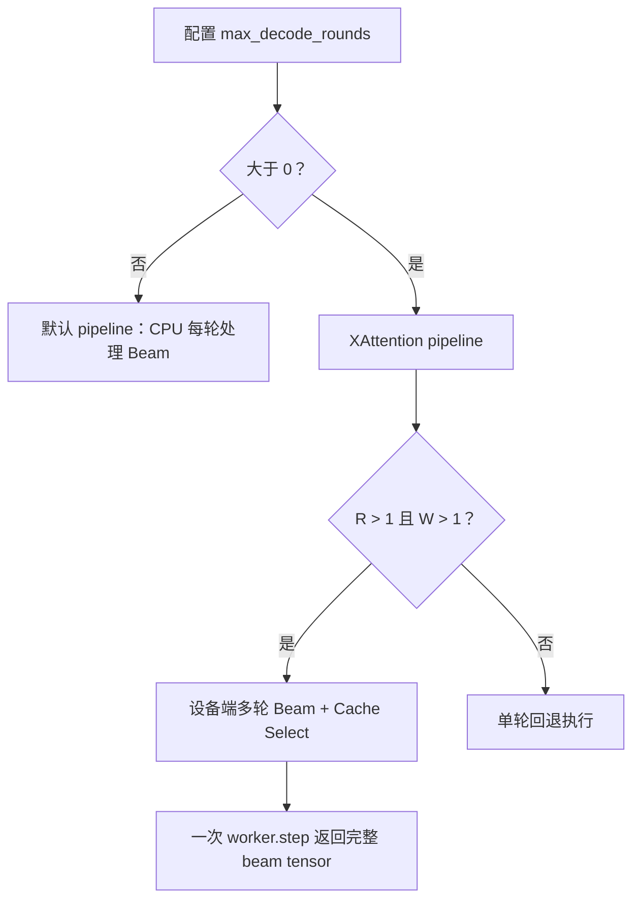

# OneRec 五阶段代码走读：速览版

本文把当前仓库中的 OneRec 推理链路压缩为五个阶段。目标是先建立全局心智模型，再按文末的源码入口深入阅读。

> 适用范围：`model_type=onerec` 的 NPU 推理路径。文中 `B` 表示请求数、`W` 表示 beam 宽度、`H` 表示 hidden size、`R` 表示生成轮数。

## 先记住这一张总图

## 五阶段速查表

| 阶段 | 一句话 | 最关键的对象 / 张量 | 建议先看 |
| --- | --- | --- | --- |
| 1. 输入 | 把 token 或推荐特征变成一条 `Sequence` | `RecMaster`、`Sequence` | `rec_master.cpp`、`sequence.cpp` |
| 2. Batch / Beam | 先按请求组成 batch；Beam 在默认路径的首次采样后才扩展 | `SequencesGroup`、`Batch` | `batch_factory.cpp`、`onerec_batch_input_builder.cpp` |
| 3. 模型 | Encoder 编码用户/稀疏特征，Decoder 逐 token 预测 | `NpuOneRecModel`、`NpuOneRecBlockLayer` | `onerec_npu_impl.h` |
| 4. 采样和输出 | 选择最后位置 hidden 得到 vocab logits，采样出推荐 token | `RecSampler`、`RecConstrainedDecoding` | `rec_sampler.cpp` |
| 5. XAttention | 可选地把多轮 Beam 搜索移到设备端 | `OneRecXAttention`、`RecWorkerImpl` | `onerec_xattention_batch_input_builder.cpp` |

---

## 阶段 1：输入如何变成 Sequence

OneRec 的输入二选一：

- `prompt_tokens`：已经准备好的 encoder token id。
- `input_tensors`：推荐模型常用的特征 embedding，必须含 `sparse_embedding`，可选 `decoder_context_embedding`。

不能同时给两者。embedding 必须是 FP32 的二维 `[长度, H]`，并且 `H == model_args.hidden_size`；框架校验后转为 BF16。

直观理解：Encoder 的“条件”可以是离散 token，也可以是外部推荐特征；Decoder 的起点要么是模型的 BOS，要么是调用方传入的 decoder context。

源码入口：[`rec_model_utils.h`](../../../xllm/core/util/rec_model_utils.h)、[`rec_master.cpp`](../../../xllm/core/distributed_runtime/rec_master.cpp)、[`sequence.cpp`](../../../xllm/core/framework/request/sequence.cpp)。

---

## 阶段 2：Batch 怎样组织，Beam 又何时展开

对象层级是：`Request → SequencesGroup → Sequence → Batch`。

- 一个请求对应一个 `SequencesGroup`。
- 一条 `Sequence` 对应一条候选路径，也就是一个 beam。
- 一个 batch 装若干请求组，而不是直接装“所有 beam”。
- 新请求刚进来时，每组只有一条 sequence；默认 Beam Search 在第一次采样之后才扩展到 `W` 条。

因此，在 beam 宽度为 4、batch 有 2 个请求时：

| 时刻 | 每组 sequence 数 | 模型实际行数 `N` |
| --- | ---: | ---: |
| 第一次模型前 | 1 | 2 |
| 第一次 Beam 处理后 | 4 | 8 |
| 后续 decode | 4 | 8 |

输入构建器按“请求组，再组内 sequence”扁平化数据。它用第一个 group 的 sequence 数作为 `group_width`，所以同一个 OneRec batch 内的 group 应保持相同 beam 宽度。

源码入口：[`batch_factory.cpp`](../../../xllm/core/framework/batch/batch_factory.cpp)、[`onerec_batch_input_builder.cpp`](../../../xllm/core/framework/batch/onerec_batch_input_builder.cpp)、[`sequences_group.cpp`](../../../xllm/core/framework/request/sequences_group.cpp)。

---

## 阶段 3：模型一次是怎样前向的

首轮前向与后续 decode 不同：首轮要先跑 Encoder，再跑 Decoder；后续只跑 Decoder。

最容易混淆的是三类缓存：

| 缓存 | 保存什么 | 目的 |
| --- | --- | --- |
| `encoder_output_` | Encoder hidden states | 给 cross-attention 读取条件 |
| `cross_k_cache_` / `cross_v_cache_` | Encoder 投影后的 K/V | 避免每轮重复做 cross-attention 投影 |
| `worker.kv_caches_` | Decoder self-attention 的历史 K/V | 让 Decoder 看到此前生成 token |

底层每层的 `NpuOneRecBlockLayer` 负责把 hidden、mask、缓存和参数交给 NPU ATB OneRec 算子；C++ 主要负责编排、张量形状和缓存绑定。

源码入口：[`onerec.h`](../../../xllm/models/rec/npu/onerec.h)、[`onerec_npu_impl.h`](../../../xllm/models/rec/npu/onerec_npu_impl.h)、[`npu_onerec_block_layer_impl.cpp`](../../../xllm/core/layers/npu/npu_onerec_block_layer_impl.cpp)。

---

## 阶段 4：从 hidden 到推荐结果

模型不会对所有位置都做最终采样。它先选出每条 sequence 最后一个有效位置的 hidden：

`selected_idx = start_offset + seq_len + num_decoder_embeddings - 1`

再经过 `lm_head` 得到 `[N, vocab_size]` logits，采样器执行 penalty、top-k/top-p、softmax 与抽样。若启用约束解码，会额外给非法 token 加一个很小的 mask 值。

默认 OneRec 引擎固定执行 3 个推荐 token：首轮 prefill 产生第一个 token，再做 2 次 decode。配置 `enable_convert_tokens_to_item` 时，恰好 3 个 token 会尝试转换成 `item_id` 或 item 信息。

源码入口：[`rec_model_base.h`](../../../xllm/models/rec/rec_model_base.h)、[`rec_sampler.cpp`](../../../xllm/core/framework/sampling/rec_sampler.cpp)、[`rec_constrained_decoding.cpp`](../../../xllm/core/framework/sampling/rec_constrained_decoding.cpp)。

---

## 阶段 5：XAttention 为何不同

当 `max_decode_rounds > 0` 时，请求进入 XAttention pipeline。它仍使用同一个 OneRec 模型，但把“逐轮选择父 beam、重排 KV Cache”的主循环搬进设备端。

| 对比项 | 默认 OneRec | XAttention OneRec |
| --- | --- | --- |
| Beam 控制位置 | CPU，在每轮 sample 后扩展和重排 | NPU，`beam_search_rec` 直接产生下一轮 beam |
| Decoder self KV | 常规 worker cache + host block 映射 | 设备端 unshared K/V，并按 parent beam 重排 |
| Engine 调用 | prefill 后继续 2 次 decode | 一次 `worker.step` 内完成多轮 |
| 输出组装 | `generate_onerec_output`，可转换 item | `generate_multi_round_output`，当前返回 token/text/score |

重要差异：当前 XAttention 的多轮 Beam 输出绕过了默认的 `generate_onerec_output`，所以即使轮数为 3，也不会自动填充默认路径的 `item_id` / `item_infos` 字段。

源码入口：[`onerec_xattention_batch_input_builder.cpp`](../../../xllm/core/framework/batch/onerec_xattention_batch_input_builder.cpp)、[`rec_worker_impl.cpp`](../../../xllm/core/runtime/rec_worker_impl.cpp)、[`rec_engine.cpp`](../../../xllm/core/distributed_runtime/rec_engine.cpp)。

---

## 推荐的阅读顺序

1. 先读输入：`rec_master.cpp` → `sequence.cpp`。
2. 再读 batch：`batch_factory.cpp` → `onerec_batch_input_builder.cpp`。
3. 接着读模型和缓存：`onerec_npu_impl.h` → `npu_onerec_block_layer_impl.cpp`。
4. 最后读采样：`rec_sampler.cpp` → `sequences_group.cpp`。
5. 需要理解设备端多轮 Beam 时，再读 `onerec_xattention_batch_input_builder.cpp` 与 `rec_worker_impl.cpp`。

完整的张量形状、默认 Beam 的父路径重排、XAttention 轮次执行，以及两个端到端例子见：[详细版](onerec_code_walkthrough_detailed.md)。
