# OneRec 五阶段代码走读：详细版

本文以一次请求为主线，解释当前仓库的 OneRec 如何从输入一路走到推荐结果。重点覆盖：输入协议、普通 Batch 与 Beam Search、NPU Encoder/Decoder、采样/约束解码，以及 XAttention 设备端多轮 Beam。

它是对源码的阅读地图，不替代接口文档。为避免把实现细节和产品语义混在一起，文中会明确区分“当前代码做了什么”与“由此带来的使用约束”。

## 0. 阅读范围、记号与全局结论

### 范围

- 模型类型：`onerec`，NPU 路径。
- 默认 pipeline：`max_decode_rounds == 0`。
- XAttention pipeline：`max_decode_rounds > 0`。
- 本文讨论请求进入 `RecMaster` 后的推理主链；模型权重加载、服务协议细节不展开。

### 统一记号

| 记号 | 含义 |
| --- | --- |
| `B` | 一个 batch 内的请求组数 |
| `W` | 每个请求组的 beam 宽度 |
| `N` | 扁平化后送进模型的 sequence 数；稳定 Beam 阶段通常为 `B × W` |
| `Lenc` | 某个请求的 encoder 长度 |
| `Lenc_max` | 本 batch 的最大 encoder 长度 |
| `Ldec` | 某条路径当前 decoder token 长度 |
| `H` | 模型 hidden size |
| `V` | 推荐 token 词表大小 |
| `R` | XAttention 的 decode round 数 |

### 全链路图

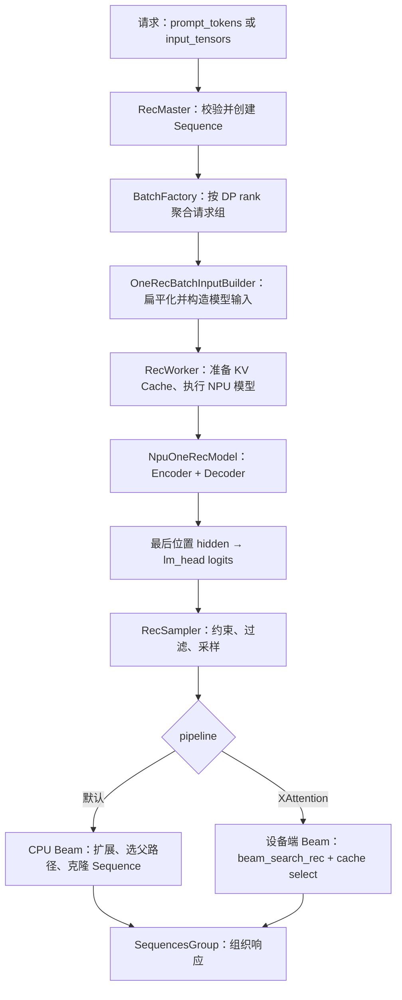

### 先给结论

1. OneRec 的“条件输入”可以是 encoder token，也可以是 `sparse_embedding`；它不是把自然语言 `prompt` 字符串自动 tokenize 后再送模型。
2. 普通 Beam Search 不是一开始就复制 `W` 份请求：首轮先以每组 1 条路径运行，采样后才扩展；后续才达到 `N=B×W`。
3. NPU 推理的关键不是每轮重跑 Encoder，而是复用 `encoder_output_`、cross-attention K/V 和 decoder self-attention K/V。
4. 默认引擎固定生成 3 个推荐 token，恰好可转换为 item；XAttention 多轮 Beam 当前走另一套输出组装路径，默认 item 字段不会自动生成。
5. `max_decode_rounds > 0` 只是切换到 XAttention pipeline 的入口条件；只有 `R>1` 且 `W>1` 才真正进入设备端多轮 Beam 分支。

---

## 1. 阶段一：请求输入与 Sequence 初始化

### 1.1 首先如何判定使用哪个 pipeline

`get_rec_pipeline_type` 按 `max_decode_rounds` 分流：

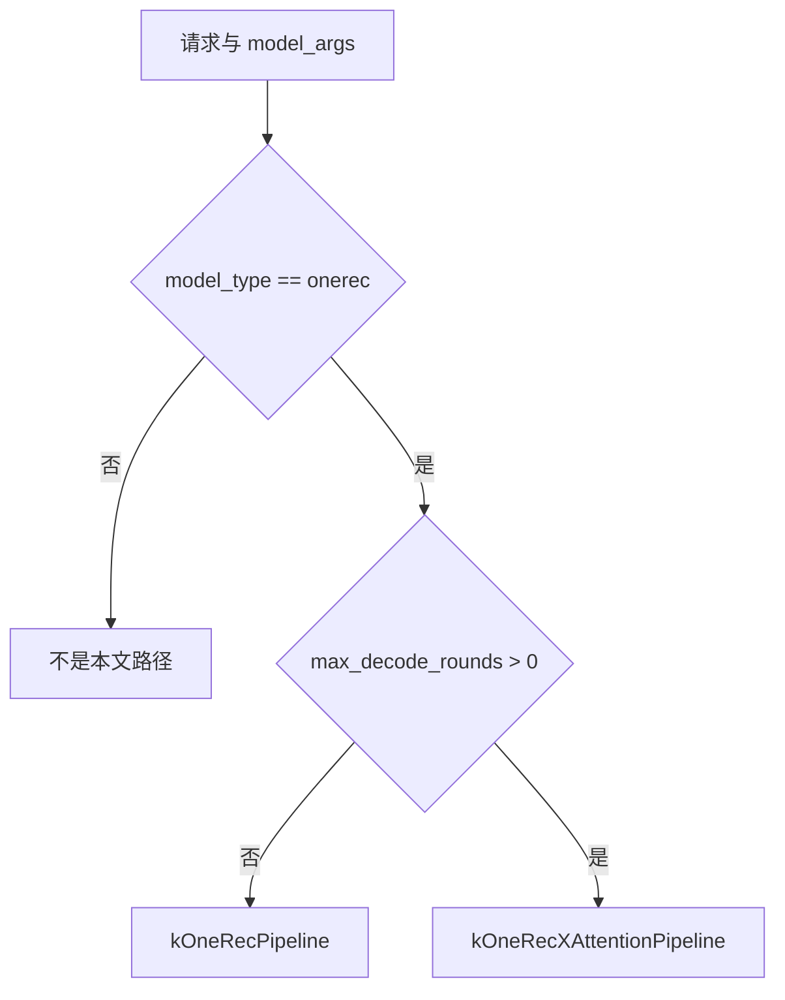

这里的含义是“执行编排不同”，并非换了一套 OneRec 权重。普通路径把 Beam 的控制逻辑放在 CPU；XAttention 路径准备设备端多轮 Beam 的输入和缓存。

源码入口：[`rec_model_utils.h`](../../../xllm/core/util/rec_model_utils.h)。

### 1.2 输入是互斥的两种形态

`RecMaster` 接收并校验 OneRec 输入。调用方必须给出以下二者之一：

| 形态 | 必需内容 | 在模型中的角色 |
| --- | --- | --- |
| token 输入 | `prompt_tokens` | Encoder 的 token id 序列 |
| embedding 输入 | `input_tensors["sparse_embedding"]` | Encoder 的连续稀疏特征 |

同时给 `prompt_tokens` 和 `input_tensors` 会被拒绝。embedding 输入还可选择给 `decoder_context_embedding`。

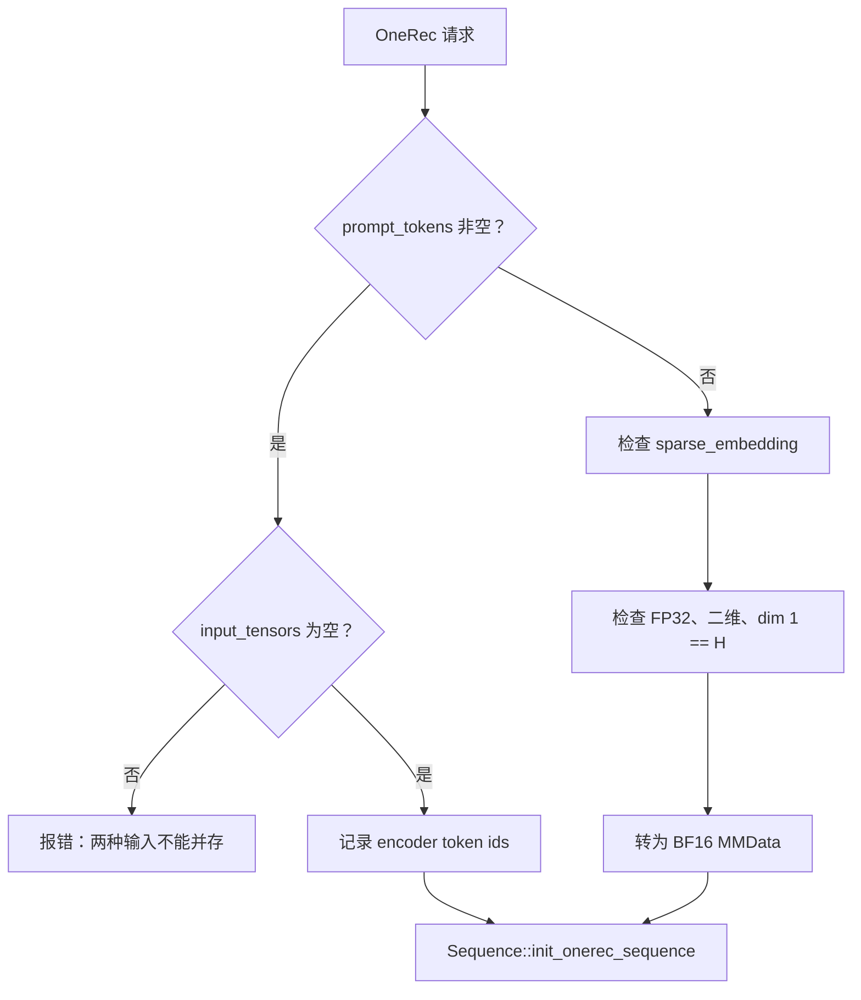

当前允许的 tensor 名称只有：

- 必需：`sparse_embedding`。
- 可选：`decoder_context_embedding`。

二者都要满足二维 `[长度, H]`；`H` 必须与 `model_args.hidden_size` 一致。输入的 FP32 在进入内部数据结构时被转为 BF16，这符合 NPU 路径的计算类型预期。

### 1.3 Sequence 初始化的三个分支

`Sequence` 是一次候选生成路径的状态容器。初始化时它决定 encoder 长度、decoder 的起点及后续 KV 映射所需的元数据。

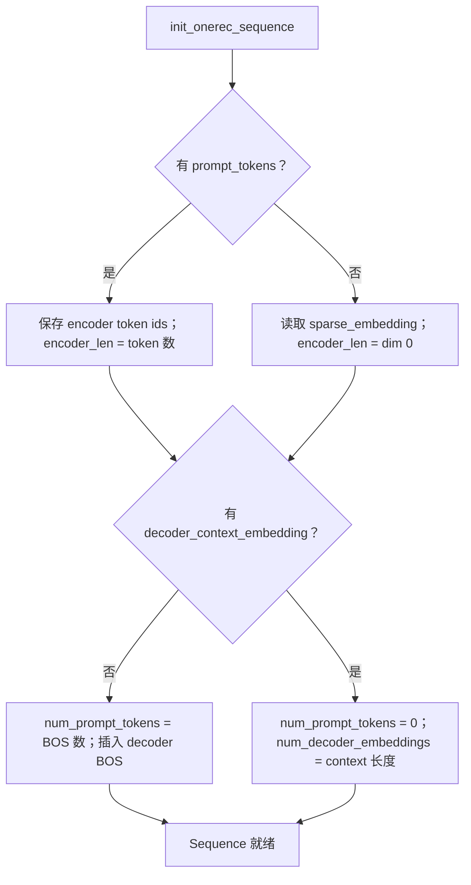

| 输入组合 | Encoder 输入 | Decoder 首次输入 | 重要计数 |
| --- | --- | --- | --- |
| `prompt_tokens`，无 context | token ids | BOS token | `num_prompt_tokens = kDecoderBosTokenCount` |
| `sparse_embedding`，无 context | embedding | BOS token | 同上 |
| 任一 encoder 输入 + `decoder_context_embedding` | token 或 embedding | context embedding | `num_prompt_tokens=0`，`num_decoder_embeddings=context_len` |

这里有一个常见误区：请求中的文本 `prompt` 会保存在 sequence 元数据中，但在这条 OneRec 主路径里，真正被送给模型的是 `prompt_tokens` 或 `input_tensors`；不要假设它会在此处自动 tokenization。

### 1.4 本阶段的调试检查点

当结果异常或请求在入口失败，按这个顺序看：

1. 是不是同时传了 `prompt_tokens` 和 `input_tensors`？
2. `sparse_embedding` 是否存在、是否 FP32、是否二维、最后一维是否为 `H`？
3. 若传了 `decoder_context_embedding`，它的最后一维是否也为 `H`？
4. 预期走默认还是 XAttention pipeline？`max_decode_rounds` 是否符合预期？
5. `Sequence` 中的 `encoder_len`、`num_prompt_tokens`、`num_decoder_embeddings` 是否与输入一致？

源码入口：[`rec_master.cpp`](../../../xllm/core/distributed_runtime/rec_master.cpp)、[`sequence.cpp`](../../../xllm/core/framework/request/sequence.cpp)。

---

## 2. 阶段二：Batch 怎样组成，尤其是普通 Beam Search

这一阶段要把三个层级彻底分开。它们混淆后，几乎所有 batch shape 和 Beam 行为都会看不懂。

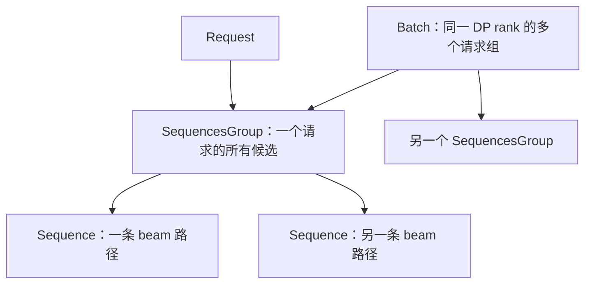

### 2.1 Batch 的创建单位是请求组

`BatchFactory::create_rec_batches` 把请求对应的 `SequencesGroup` 加入目标 DP rank 的 batch。换句话说，调度器的直接单位是“一个请求组”，而不是“一个 token”或“一个 beam”。

新请求被加入 group 时，group 初始只有一条 sequence。这个事实非常关键：即便请求的 beam width 是 4，普通 Beam 路径也不会在模型首轮之前预先复制 4 条 sequence。

### 2.2 输入构建器的扁平化规则

`OneRecBatchInputBuilder` 接收一组 `SequencesGroup`，然后：

1. 遍历 request group；
2. 再遍历该 group 内的 sequence；
3. 把每条 sequence 的 decoder 输入、长度、selected index、采样参数拼成扁平数组；
4. 形成模型侧的 `N` 行数据。

因此，扁平化顺序是：

```text
group 0 / seq 0
group 0 / seq 1
...
group 1 / seq 0
group 1 / seq 1
...
```

构建器中的三个量可这样理解：

| 字段 | 来源 | 含义 |
| --- | --- | --- |
| `bs` | `sequence_groups.size()` | 请求组数，即 `B` |
| `num_sequences` | 所有 group 的 sequence 数之和 | 扁平化行数，即 `N` |
| `group_width` | 第一个 group 的 sequence 数 | 一组内的 beam 数，即稳定阶段的 `W` |

由于 `group_width` 取自第一个 group，同一 OneRec batch 中的 group 应维持一致的 sequence 数。当前输入构建器没有在此处显式按不同 beam 宽度重新分桶，也没有以断言给出更友好的错误信息；调度或调用配置应避免把不同宽度的 group 混入同一 batch。

### 2.3 首轮和后续轮的形状变化

假设 `B=2`、配置 `W=4`：

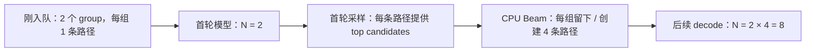

| 时刻 | `B` | 每 group 的实际 sequence 数 | `N` | 说明 |
| --- | ---: | ---: | ---: | --- |
| 首次 prefill 前 | 2 | 1 | 2 | 未展开 Beam |
| 首次 sample 后 | 2 | 4 | 8（逻辑上） | CPU 已完成扩展/重排 |
| 第 2 次模型输入 | 2 | 4 | 8 | 每个 beam 独立 decode |
| 最后一次模型输入 | 2 | 4 | 8 | 之后裁剪到最终返回数 |

这也解释了为什么不能简单把“beam width”理解为首轮模型 batch size 的乘数：首轮真实 N 仍是请求数 B。

### 2.4 selected index：为什么总是选“最后一个有效位置”

OneRec Decoder 会产出所有本轮 token 位置的 hidden，但采样只需要每条 beam 的下一个 token 分布。构建器为每条扁平化 sequence 计算：

```text
selected_idx = start_offset + seq_len + num_decoder_embeddings - 1
```

含义分解如下：

| 部分 | 含义 |
| --- | --- |
| `start_offset` | 该 sequence 在拼接 hidden 中的起始位置 |
| `seq_len` | 本轮 decoder token 的有效长度 |
| `num_decoder_embeddings` | decoder context 的长度；无 context 时为 0 |
| `-1` | 从长度转换为最后一个下标 |

所以它选中的永远是“这条路径当前能预测下一个 token 的最后状态”，而不是 encoder 最后位置，也不是 padding 位置。

### 2.5 decoder context 如何在 batch 中复制

若请求提供 `decoder_context_embedding`，模型需要看到每条 beam 相同的 context。输入构建阶段会把 context 组织为与 group/beam 对齐的形状，概念上是：

```text
[B, W, context_len + current_seq_len, H]
```

其中同一个 request 的 context 被复制给其各个 beam；之后用当前 token 的 embedding 覆盖 context 之后需要的位置。这样做让多 beam 的 Decoder 输入形状规则，同时保持“各 beam 共享同一个初始条件”。

### 2.6 默认 CPU Beam 在做什么

在 `Batch::process_sample_output` 之后，每条 sequence 已经暂时写入一个采样结果，其中包括：

- 选中的 `next_token`；
- 该 token 的 logprob；
- 若是 Beam Search，还包括足够的 top candidates。

随后 `SequencesGroup::process_beam_search` 对一个 group 内的所有“父路径 × 候选 token”重新打分：

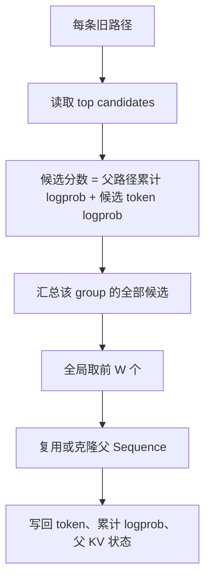

可以把一次 Beam 更新理解为下面的二维表：

| 父路径 | 候选 token | 新累计分数 | 是否进入前 `W` |
| --- | --- | ---: | --- |
| beam 0 | a | `score(0)+logp(a)` | 由全局排序决定 |
| beam 0 | b | `score(0)+logp(b)` | 由全局排序决定 |
| beam 1 | c | `score(1)+logp(c)` | 由全局排序决定 |

入选候选可能来自同一个父路径多次，因此代码有两种操作：

- 第一次使用某父路径时可复用原 sequence；
- 同一父路径再次被选中时，需要 clone 一条 sequence。

每条子路径还要记录其来源 KV state。后续真正运行 decoder 时，这些来源关系让正确的历史 K/V 能被复用或交换，而不是把所有历史状态按 token 逐个拷贝。

### 2.7 最后一轮为什么还要一次 Beam 处理

默认引擎的最后一次 decode 调用会带上 `force_requested_beam_result_size=true`。含义是：即使内部 beam width 大于用户希望返回的候选数，最后一次也要根据 `num_return_sequences`（若设置）或 beam width 整理最终结果集。

### 2.8 本阶段的排障方法

当观察到 batch 维度、beam 数或结果数量异常，可依次打印/观察：

1. `Batch` 中 `sequence_groups` 数量：它应是 `B`。
2. 每个 group 的 `sequences().size()`：首轮通常是 1，首轮 Beam 后应为 `W`。
3. `num_sequences`、`bs`、`group_width`：确认 `N`、`B`、`W` 三者没有混淆。
4. `selected_idx` 是否落在每条实际 hidden 范围内。
5. 每个入选 beam 的父 sequence 与 `KVCacheState` 来源是否一致。

源码入口：[`batch_factory.cpp`](../../../xllm/core/framework/batch/batch_factory.cpp)、[`batch.cpp`](../../../xllm/core/framework/batch/batch.cpp)、[`onerec_batch_input_builder.cpp`](../../../xllm/core/framework/batch/onerec_batch_input_builder.cpp)、[`sequences_group.cpp`](../../../xllm/core/framework/request/sequences_group.cpp)。

---

## 3. 阶段三：NPU OneRec 模型与三类缓存

### 3.1 首轮和后续 decode 是两条不同的数据路径

`RecWorkerImpl` 的普通 OneRec 路径中，首轮负责准备完整条件：

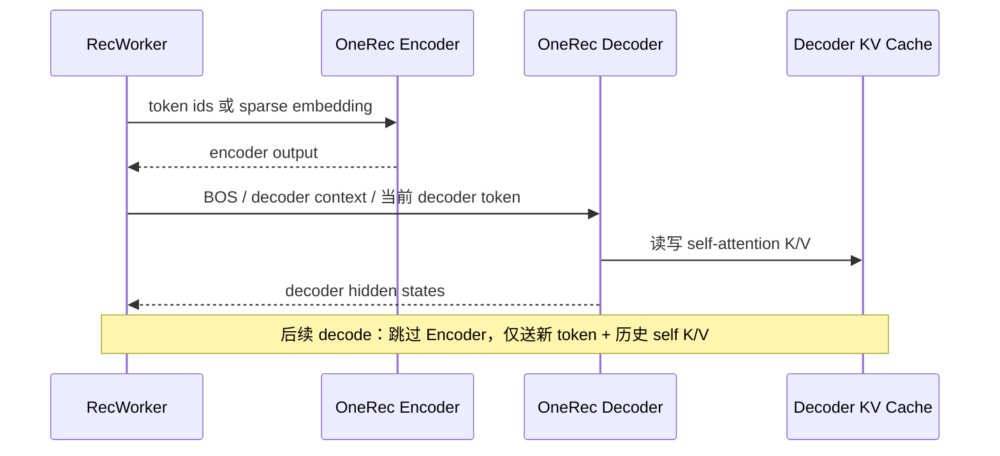

首轮分为两步：

1. Encoder 前向：若给了 `sparse_embedding`，以 hybrid embedding 模式直接使用；否则先查词表得到 token embedding。
2. Decoder 前向：输入 BOS、decoder context 或后续 token，并让 decoder cross-attention 读取 encoder 条件。

后续轮不再运行 Encoder；Decoder 只消费新 token 与已经缓存的状态。

### 3.2 Encoder 输出为什么要 pad

不同请求的 `Lenc` 可以不同。Encoder 首先产生逻辑上拼接的结果 `[sum(Lenc), H]`，随后依照 `encoder_seq_lens` 填充成规则形状：

```text
encoder_output_ : [B, Lenc_max, H]
```

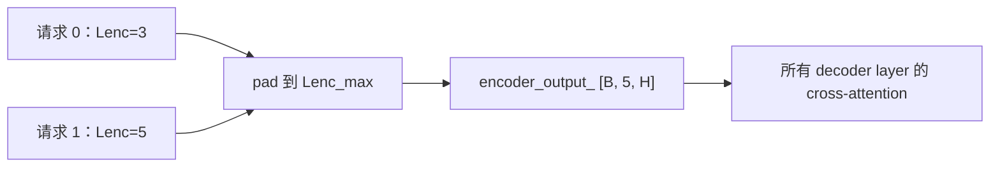

这让下游 NPU 算子拥有一致的 batch 维度；真正有效的长度仍由对应的长度与 mask 表达。

### 3.3 Decoder context 与 token embedding 的合成

Decoder 的输入有两种模式：

| 情况 | Decoder 首轮 hidden 输入 |
| --- | --- |
| 无 `decoder_context_embedding` | 对 BOS 或本轮 token 做 word embedding |
| 有 context、当前没有 token | 直接使用 context embedding |
| 有 context、当前有 token | 复制 context，补上当前 token embedding，再整理为 decoder 所需形状 |

对 Beam 而言，同一 request 的 context 需要广播到它的所有 `W` 条路径。这样每条 beam 都从同一个 context 开始，而它们之后生成的 token 不同。

### 3.4 每层 NPU block 的职责边界

模型结构由共享 `WordEmbedding`、Encoder `OneRecStack`、Decoder `OneRecStack` 组成。每一个 `NpuOneRecBlockLayer` 的 C++ 代码并不手写 Transformer 的每个 matmul，而是负责：

1. 接收当前 hidden、mask、层参数；
2. 绑定 self-attention KV 和可选的 cross-attention 输入；
3. 选择本轮使用的缓存张量；
4. 调用 NPU ATB `onerec::BlockLayer` 融合算子；
5. 取得输出 hidden 与更新后的缓存。

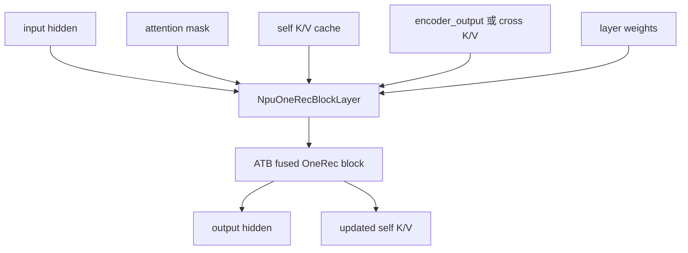

Encoder attention 使用 encoder 的相对/绝对 mask；Decoder 使用因果 mask，保证当前位置不会看到未来 token。decode 模式下仍按 NPU 算子期望组织张量形状，不能只从“本轮新增一个 token”推断出所有 mask 都是一维。

### 3.5 三类缓存必须分清

这是理解 OneRec 性能与 Beam 行为的核心。

| 名称 | 所在层级 | 典型形状 / 内容 | 生命周期 | 为什么存在 |
| --- | --- | --- | --- | --- |
| `encoder_output_` | 模型对象 | `[B, Lenc_max, H]` 的 encoder hidden | 一个模型执行批次 | 给 Decoder cross-attention 提供条件 |
| `cross_k_cache_`、`cross_v_cache_` | 每个 decoder NPU block | encoder hidden 投影后的 K/V | decoder 首轮后复用 | 后续轮无需重复投影 Encoder 输出 |
| `worker.kv_caches_` | Worker | 每层 decoder self-attention 历史 K/V | 随请求的 decode 演进 | 让新 token 能注意到历史 decoder token |
| `Sequence::KVCacheState` | 单条 sequence 的 host 状态 | cache block 映射、来源等元数据 | 随 Beam 分裂/重排 | 把逻辑 beam 路径映射到实际缓存块 |

可用一张图把前 3 种计算缓存串起来：

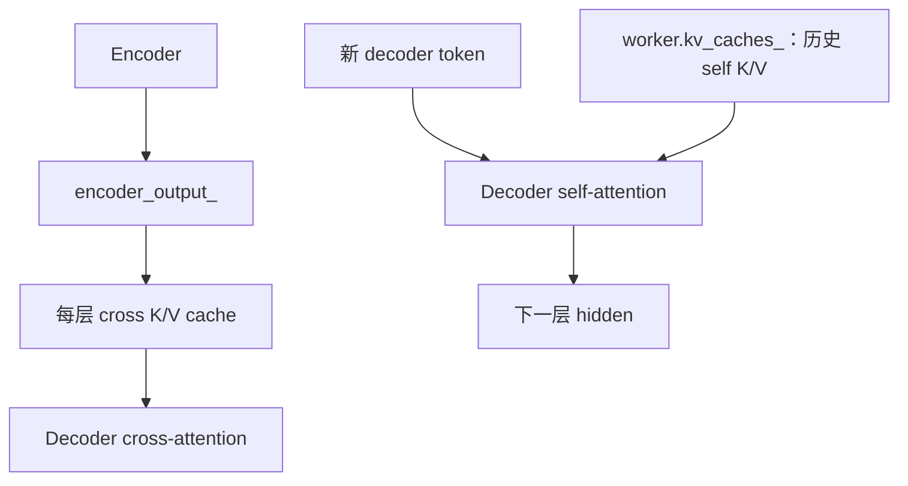

`encoder_output_` 与 cross K/V 相关但不等价：前者是 hidden states，后者是把 hidden states 经 attention 的 K/V 投影得到的结果。前者可供首轮计算 cross K/V，后者让后续 decode 直接使用投影结果。

### 3.6 一个普通首轮的张量形状例子

假定：`B=2`，首轮尚未展开 Beam，因此 `W_effective=1`；`Lenc=[3,5]`，`H=256`。

| 步骤 | 概念形状 | 说明 |
| --- | --- | --- |
| 稀疏 encoder 输入 | `[3,256] + [5,256]` | 请求长度可不同 |
| encoder 扁平输出 | `[8,256]` | 累加长度 |
| pad 后 `encoder_output_` | `[2,5,256]` | NPU cross-attention 的规则 batch |
| Decoder 首轮 BOS hidden | `[2,1,256]` 或等价扁平布局 | 每请求一条路径 |
| 首轮 logits | `[2,V]` | 每条路径只取最后位置 |
| Beam 扩展后下一轮 decoder | `[2,4,...]` 或扁平 `[8,...]` | 具体布局由输入构建器和算子接口转换 |

### 3.7 本阶段的调试检查点

1. 首轮是否实际跑了 Encoder；后续轮是否错误地重复运行 Encoder？
2. `encoder_seq_lens` 与 pad 后 `encoder_output_` 的第一、第二维是否一致？
3. decoder context 的广播维度是否与 `B`、`W` 对齐？
4. cross K/V 是否只在需要时投影，而 self K/V 是否在每轮继续累积？
5. Beam 重排后，逻辑 `KVCacheState` 与 Worker 实际 cache block 映射是否仍指向正确父路径？

源码入口：[`onerec.h`](../../../xllm/models/rec/npu/onerec.h)、[`onerec_npu_impl.h`](../../../xllm/models/rec/npu/onerec_npu_impl.h)、[`npu_onerec_block_layer_impl.cpp`](../../../xllm/core/layers/npu/npu_onerec_block_layer_impl.cpp)、[`kv_cache.h`](../../../xllm/core/framework/kv_cache/kv_cache.h)、[`rec_worker_impl.cpp`](../../../xllm/core/runtime/rec_worker_impl.cpp)。

---

## 4. 阶段四：logits、约束解码、采样与默认输出

### 4.1 从所有 hidden 中取出“该采样的那一行”

Decoder 会输出多位置 hidden。`RecModelBase` 先用 batch 输入构建的 `selected_idx` 做 `index_select`，得到每条扁平化 sequence 的最后有效 hidden，再送入 `lm_head`：

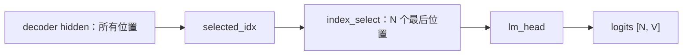

若启用了 tied embedding，logits 的计算会复用词表 embedding 权重并带相应 scale；无论具体 head 实现如何，采样接口得到的最终形状都是每条路径一行 `[V]` 的分布。

### 4.2 约束解码如何限制 item token 的合法性

开启 `enable_constrained_decoding` 时，`RecVocabDict` 从 vocab 文件建立 item 与 token 三元组的对应关系，并建立“已有前缀 → 下一位允许 token”的索引。

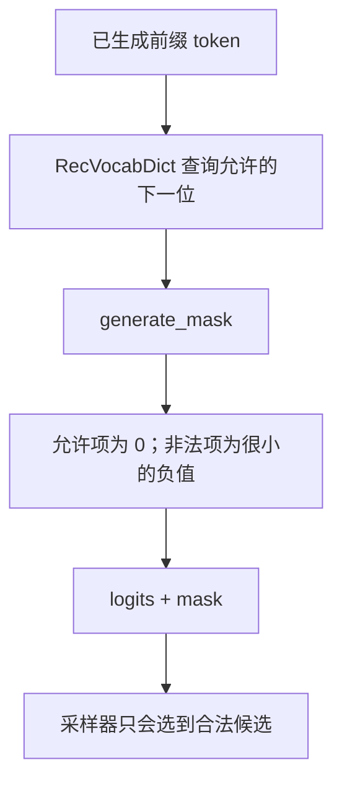

这个 mask 的作用是把组合空间收窄到 vocab 中存在的 item 编码路径。例如某一 item 用三个 token 表示，已经生成第一个 token 后，第二个 token 的候选会被限制到该前缀下允许的集合。

Worker 会把相关 CPU mask 构建与模型前向交叠，以减少等待；采样前再把 mask 加到 logits。这里的“加”不是概率相加，而是对非法 token 的 logit 加极小负数，使其 softmax 概率接近 0。

### 4.3 RecSampler 的采样职责

采样器依次承担以下职责：

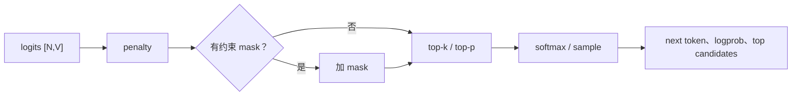

在普通采样中，输出的重点是每条路径的 `next_token` 与其 logprob。Beam Search 还需要多个高分候选，让随后 CPU 或 NPU 的 Beam 逻辑进行全局重排序；所以“模型采样出的第一名”不一定是最终保留的某个 beam 的唯一依据。

### 4.4 默认路径的 3 token 节奏

当前默认 `RecEngine` 用 `kRecDecodeSteps=2`，并且推荐 token 总数为 `REC_TOKEN_SIZE=3`。因此时序为：

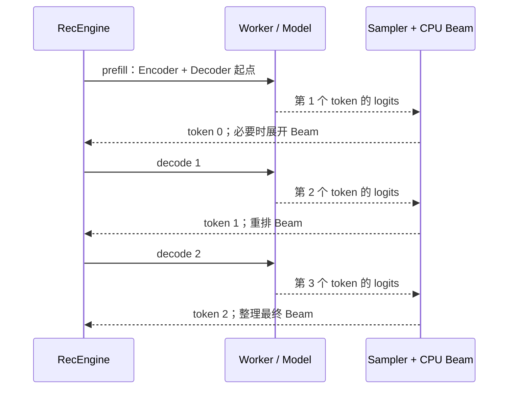

这解释了两件事：

- 默认路径为什么会有“首轮后 Beam 扩展”的现象；
- 为什么输出转换逻辑在 token 数恰好为 3 时可以把 token 三元组解释为 item。

### 4.5 从 token 到对外结果

`Sequence::generate_onerec_output` 负责默认路径的单条候选结果。它会：

1. 排除 decoder prompt / BOS 等不是推荐结果的部分；
2. 可选择保留 token 的 logprob；
3. 若 `enable_convert_tokens_to_item` 且恰有 3 个推荐 token，则通过 `RecTokenizer` 转换为 item 标识或扩展 item 信息；
4. 由 `SequencesGroup` 把多个 beam 的候选组织为响应。

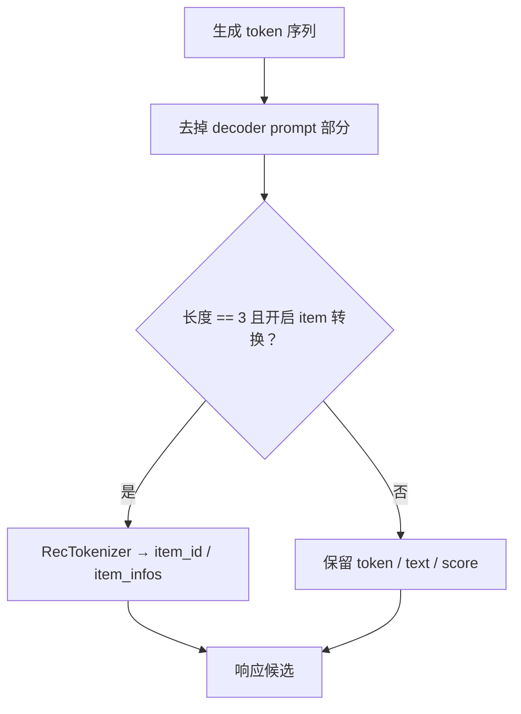

### 4.6 本阶段的易错点

| 现象 | 优先检查 |
| --- | --- |
| logits 行数不等于期望 beam 数 | `N` 是否是首轮的 `B`，还是后续的 `B×W`；`selected_idx` 是否正确 |
| 约束解码仍产生非法组合 | vocab 三元组、已生成 prefix、mask 是否正确加到 logits |
| item 转换为空 | 是否正好有 3 个有效推荐 token；是否开启转换；tokenizer/vocab 是否匹配 |
| Beam 结果不等于每行 greedy top-1 | 正常；Beam 是跨父路径的累计分数排序 |

源码入口：[`rec_model_base.h`](../../../xllm/models/rec/rec_model_base.h)、[`rec_sampler.cpp`](../../../xllm/core/framework/sampling/rec_sampler.cpp)、[`rec_constrained_decoding.cpp`](../../../xllm/core/framework/sampling/rec_constrained_decoding.cpp)、[`rec_engine.cpp`](../../../xllm/core/distributed_runtime/rec_engine.cpp)、[`sequence.cpp`](../../../xllm/core/framework/request/sequence.cpp)。

---

## 5. 阶段五：XAttention 多轮 Beam 的执行方式

XAttention 的核心并非“模型多一层 Attention”，而是同一 OneRec 推理在执行控制、Beam 搜索和 KV 重排位置上的变化。

### 5.1 与默认路径的对照

| 维度 | 默认 OneRec pipeline | OneRec XAttention pipeline |
| --- | --- | --- |
| 启用条件 | `max_decode_rounds == 0` | `max_decode_rounds > 0` |
| Beam 搜索控制器 | CPU 的 `SequencesGroup::process_beam_search` | NPU `beam_search_rec` |
| 路径状态 | 每轮更新/克隆 C++ `Sequence` | 设备端维护 beam sequence tensor 与分数 |
| KV 重排 | host 侧 `KVCacheState` 参与映射 | `execute_cache_select` 按父 beam 重排 device cache |
| Engine 循环 | prefill + 2 次 decode | 一次 `worker.step` 内完成配置的多轮 |
| 最终输出 | 逐 Sequence 默认格式化 | 从 device beam tensor 生成多轮结果 |

### 5.2 XAttention 输入在普通输入上增加了什么

`OneRecXAttentionBatchInputBuilder` 先构造普通 `OneRecModelInputParams`，再补充 XAttention 特有信息：

- block tables / cache slots；
- Decoder 采样需要的选择位置；
- `StepDecodeMeta`：`batch_size`、`beam_width`、`current_round`、`total_round`、每条路径的 decode position、完整 KV 形状等。

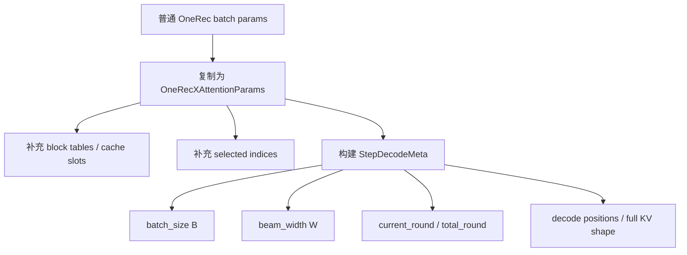

`total_round` 会保证至少为 1；但真正的设备端多轮分支还要求：

```text
total_round > 1 && beam_width > 1 && decoder selected index 已定义
```

因此只把 `max_decode_rounds` 设为正数，并不必然意味着每个请求都会走完整设备端多轮 Beam：beam 宽度为 1 时没有 Beam 父路径选择，自然会退回单轮性质的执行。

### 5.3 首轮：编码、解码并初始化 Beam tensor

第 0 轮与默认首轮一样，先运行 Encoder，再运行 Decoder。不同点在于采样结果不立刻由 CPU 克隆 `Sequence`，而是用于初始化设备侧的 beam 状态：

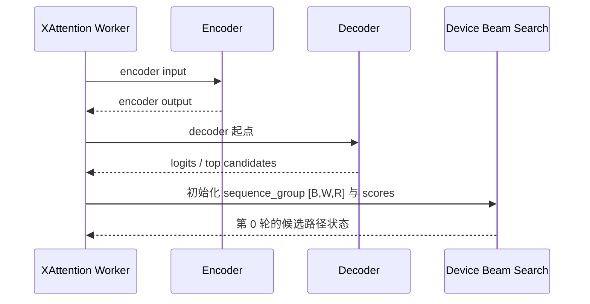

其中 `sequence_group` 可直观理解为“每个请求、每个 beam、每一轮所选 token”的三维记录；最终会与对应的累计 score 一起返回。

### 5.4 后续轮：NPU 选择父 beam 并重排 cache

第 `r>0` 轮时，Worker 把 stage 切到 `DECODE`，从上一轮 `sequence_group[:,:,r-1]` 取出 token 作为本轮 decoder 输入；然后更新当前 round、position 和 selected index。

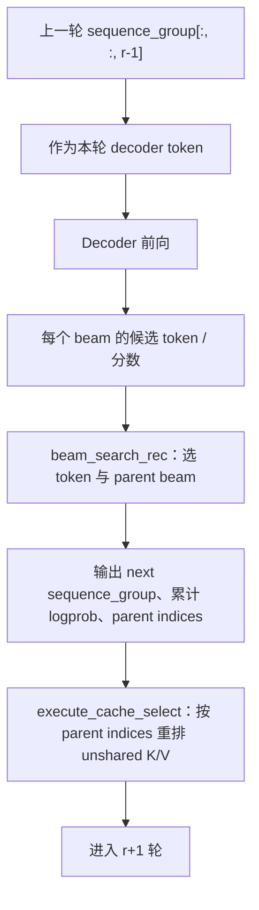

这一步正是 XAttention 的价值所在：父路径选择与 self K/V 的重排在设备内完成，避免每轮把大量路径控制逻辑与缓存重排搬回 CPU。

### 5.5 XAttention 的缓存分工

XAttention Worker 为每一层准备 shared 和 unshared 两种 device cache。可用下面的直觉理解：

| 缓存类型 | 是否跨 beam 共享 | 典型用途 |
| --- | --- | --- |
| shared K/V | 是 | 所有 beam 可共同读取的部分，例如共享条件相关状态 |
| unshared K/V | 否，每个 beam 各自拥有 | decoder 自回归历史；每轮需随 parent beam 选择重排 |

`NpuOneRecBlockLayer` 在 `use_xattn` 时会改用这套输入绑定：既可接收 shared cache，也可接收当前 beam 的 unshared cache。之后 `execute_cache_select` 根据 `beam_search_rec` 产出的 parent index，把“子路径应继承哪个父路径的历史”同步到下一轮的 unshared K/V。

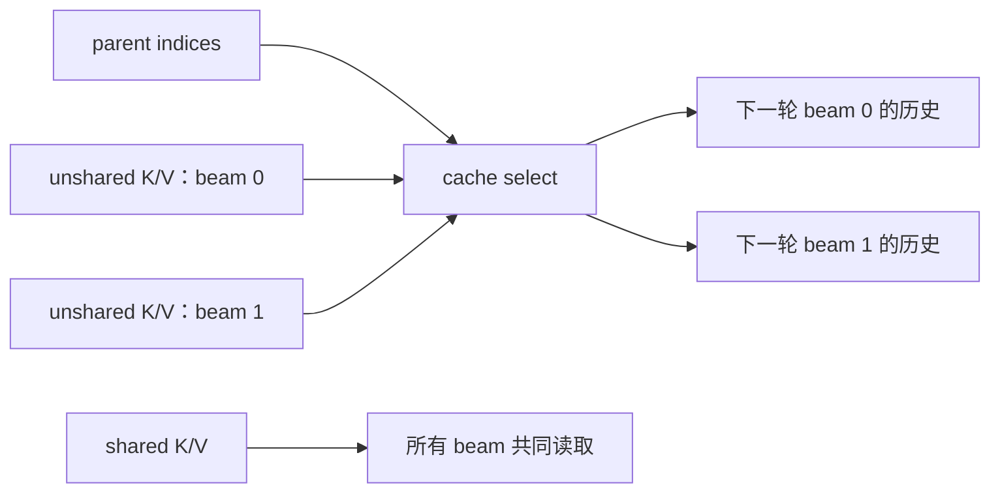

### 5.6 为什么 XAttention Engine 只调用一次 worker.step

普通 engine 显式做“首轮 + 若干 decode”的循环；XAttention engine 把完整轮次执行放进 Worker 的设备侧流程，所以只需要一次 `worker.step`。返回时它把最终的 beam sequence tensor 与 Beam 输出移回 CPU。

之后 `Batch::process_beam_sequence_group` 把结果交给每个 request group：调用 base sequence 的 `set_beam_result`，保存最终 beam token 与分数，而不是像默认路径那样每轮创建/更新很多 C++ `Sequence`。

### 5.7 输出语义上的重要差异

`SequencesGroup::generate_outputs` 发现“推荐多轮 Beam 且基础 group 有缓存的 beam result”时，会走 `generate_multi_round_output`：

1. 按最终累计 logprob 排序；
2. 返回每个候选的 token ids、文本 decode 与最终分数；
3. 不会调用默认路径的 `Sequence::generate_onerec_output`。

因此，这是当前实现必须明确记录的差异：

> XAttention 多轮 Beam 即使输出轮数为 3，也不会自动填充默认 OneRec 路径中的 `item_id` / `item_infos`。它当前的对外信息是 token、text 和 score。

若业务要求两条 pipeline 的 item 字段完全一致，需要在 XAttention 的最终输出格式化处补齐同等的 token-to-item 转换；本文只描述现状，不建议在未评估接口兼容性的情况下直接改动。

### 5.8 XAttention 排障清单

1. `max_decode_rounds` 是否大于 0，且预期确实进入 XAttention pipeline？
2. `R>1`、`W>1`、decoder selected index 是否同时满足？
3. `StepDecodeMeta` 的 `B`、`W`、round、position 是否与输入 batch 一致？
4. `beam_search_rec` 的 parent index 与 `execute_cache_select` 使用的 index 是否来自同一轮？
5. 是否把默认路径期待的 `item_id` 字段错误地用来验证 XAttention 输出？

源码入口：[`onerec_xattention_batch_input_builder.cpp`](../../../xllm/core/framework/batch/onerec_xattention_batch_input_builder.cpp)、[`rec_worker_impl.cpp`](../../../xllm/core/runtime/rec_worker_impl.cpp)、[`rec_engine.cpp`](../../../xllm/core/distributed_runtime/rec_engine.cpp)、[`batch.cpp`](../../../xllm/core/framework/batch/batch.cpp)、[`sequences_group.cpp`](../../../xllm/core/framework/request/sequences_group.cpp)。

---

## 6. 两个端到端例子

### 6.1 默认 pipeline：B=2，W=4，稀疏特征输入

假设两个请求均提供 `sparse_embedding`，不提供 decoder context，beam 宽度为 4。

```mermaid
sequenceDiagram
    participant R0 as Request 0
    participant R1 as Request 1
    participant B as Batch / Model
    participant C as CPU Beam
    R0->>B: sparse_embedding，初始 1 条 Sequence
    R1->>B: sparse_embedding，初始 1 条 Sequence
    B->>B: Encoder：N=2；Decoder BOS：N=2
    B-->>C: 每个请求的第 1 个 token 候选
    C->>C: 每组展开为 W=4
    C->>B: 第 2 token decode，N=8
    B-->>C: 候选 + 分数
    C->>B: 第 3 token decode，N=8
    B-->>C: 最终候选
    C-->>R0: 最终 beam 结果
    C-->>R1: 最终 beam 结果
```

逐步看维度：

| 步骤 | group 结构 | 模型扁平行数 | 关键状态 |
| --- | --- | ---: | --- |
| 入队 | `2 × 1 sequence` | - | 两个 Sequence 各有 encoder embedding 与 BOS |
| 首轮 | `2 × 1` | `N=2` | Encoder 输出和第一个 logits |
| 首轮 Beam 后 | `2 × 4` | - | 每组按累计分数取 4 条路径 |
| decode 1 | `2 × 4` | `N=8` | self K/V 分别延续 8 条逻辑路径 |
| decode 2 | `2 × 4` | `N=8` | 最终 token；裁剪到请求的返回数 |

如果启用了 item 转换，最终每个候选的 3 个推荐 token 会在默认输出路径中尝试转换为 item。

### 6.2 XAttention：B=2，W=4，R=3

这次 `max_decode_rounds=3`。请求先在 host 侧组 batch，随后将多轮状态交给 device：

```mermaid
flowchart TD
    A["B=2，W=4，R=3"] --> B["构建 OneRecXAttentionParams"]
    B --> C["round 0：Encoder + Decoder"]
    C --> D["device 初始化 [B,W,R] 序列与分数"]
    D --> E["round 1：decoder + beam_search_rec + cache select"]
    E --> F["round 2：decoder + beam_search_rec"]
    F --> G["一次 worker.step 返回最终 tensors"]
    G --> H["CPU 按分数组织 token / text / score"]
```

注意同样是“3 个 token”，它与默认 pipeline 的对外格式仍可能不同：这里走多轮 Beam 输出函数，当前不会自动补 `item_id` / `item_infos`。

---

## 7. 源码阅读路线图

如果要从调用入口追到 NPU 算子，建议按以下顺序单步跟踪：

```mermaid
flowchart TD
    A["输入与 pipeline 选择"] --> B["Request / Sequence 初始化"]
    B --> C["BatchFactory"]
    C --> D["OneRec BatchInputBuilder"]
    D --> E["RecWorkerImpl"]
    E --> F["NpuOneRecModel / NpuOneRecBlockLayer"]
    F --> G["RecSampler"]
    G --> H["Batch / SequencesGroup 输出"]
    D --> X["XAttention Builder"]
    X --> Y["device Beam Search / Cache Select"]
```

| 关注问题 | 首选源码 |
| --- | --- |
| 何时选 XAttention | [`rec_model_utils.h`](../../../xllm/core/util/rec_model_utils.h) |
| 如何验证输入和创建请求 | [`rec_master.cpp`](../../../xllm/core/distributed_runtime/rec_master.cpp) |
| BOS / context / token 如何进入 sequence | [`sequence.cpp`](../../../xllm/core/framework/request/sequence.cpp) |
| 请求组如何并成 Batch | [`batch_factory.cpp`](../../../xllm/core/framework/batch/batch_factory.cpp) |
| `B`、`W`、`N`、selected index 如何计算 | [`onerec_batch_input_builder.cpp`](../../../xllm/core/framework/batch/onerec_batch_input_builder.cpp) |
| 默认 CPU Beam 的候选重排 | [`sequences_group.cpp`](../../../xllm/core/framework/request/sequences_group.cpp) |
| sample 输出何时写入 sequence | [`batch.cpp`](../../../xllm/core/framework/batch/batch.cpp) |
| Worker 首轮 / decode / XAttention 主流程 | [`rec_worker_impl.cpp`](../../../xllm/core/runtime/rec_worker_impl.cpp) |
| Encoder、Decoder 与 NPU block 绑定 | [`onerec_npu_impl.h`](../../../xllm/models/rec/npu/onerec_npu_impl.h)、[`npu_onerec_block_layer_impl.cpp`](../../../xllm/core/layers/npu/npu_onerec_block_layer_impl.cpp) |
| logits、约束、采样 | [`rec_model_base.h`](../../../xllm/models/rec/rec_model_base.h)、[`rec_constrained_decoding.cpp`](../../../xllm/core/framework/sampling/rec_constrained_decoding.cpp)、[`rec_sampler.cpp`](../../../xllm/core/framework/sampling/rec_sampler.cpp) |
| XAttention 参数与 Engine | [`onerec_xattention_batch_input_builder.cpp`](../../../xllm/core/framework/batch/onerec_xattention_batch_input_builder.cpp)、[`rec_engine.cpp`](../../../xllm/core/distributed_runtime/rec_engine.cpp) |

## 8. 最后的心智模型

把 OneRec 当成以下三层协作即可：

1. **请求与调度层**：将特征或 token 表达成 `Sequence`，再按请求组放进 batch。
2. **模型与缓存层**：Encoder 提供条件；Decoder 用 cross K/V 和 self K/V 高效地产生下一 token 分布。
3. **搜索与输出层**：普通路径由 CPU 逐轮管理 Beam；XAttention 路径由 device 管理多轮父路径选择和 cache 重排，最终再由 CPU 格式化结果。

```mermaid
flowchart LR
    A["条件：token / embedding"] --> B["Encoder"]
    B --> C["Decoder：预测推荐 token"]
    C --> D["搜索：默认 CPU 或 XAttention device"]
    D --> E["候选 item token 序列"]
    E --> F["响应：默认可转 item；XAttention 当前为 token/text/score"]
```

当需要定位问题时，不要一开始就钻入 NPU 融合算子。先确认阶段边界的状态：输入是否正确、`B/W/N` 是否正确、selected index 是否正确、是哪一类缓存出了错、最终走的是默认输出还是 XAttention 多轮输出。这样通常能以最短路径收敛问题。

---

速览请见：[OneRec 五阶段代码走读：速览版](onerec_code_walkthrough_brief.md)。
